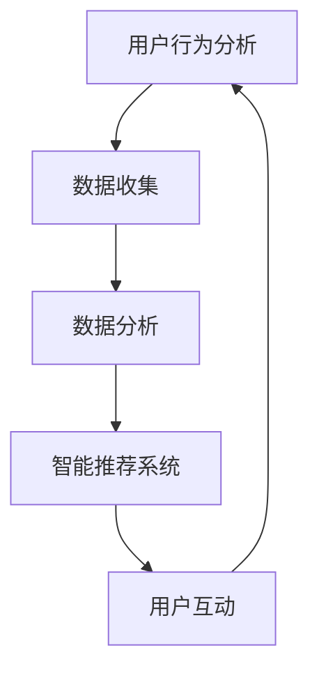

                 

# 在电子商务中部署AI代理工作流的实战指南

## 关键词
- 电子商务
- AI代理
- 工作流
- 数据分析
- 智能推荐

## 摘要
本文旨在为电子商务领域的从业者提供一份详尽的AI代理工作流部署指南。通过介绍核心概念、算法原理、数学模型以及实战案例，我们将帮助读者理解如何利用AI代理提升电子商务平台的运营效率和用户体验。文章将涵盖从环境搭建到代码实现的各个环节，并提供实用的工具和资源推荐，以指导读者在实际项目中成功部署AI代理工作流。

## 1. 背景介绍

### 1.1 目的和范围
本文的目的在于揭示电子商务领域如何通过部署AI代理工作流来提高业务效益。我们将深入探讨AI代理的原理及其在电子商务中的应用，涵盖从基础概念到高级算法的方方面面。文章将提供一个全面的框架，让读者能够了解如何在实际项目中实施AI代理工作流。

### 1.2 预期读者
本文适合电子商务领域的技术人员、产品经理以及对AI代理和电子商务有浓厚兴趣的读者。它不仅适合初学者，也适合希望进一步优化现有系统的专业人士。

### 1.3 文档结构概述
本文分为十个部分：背景介绍、核心概念与联系、核心算法原理与具体操作步骤、数学模型和公式、项目实战、实际应用场景、工具和资源推荐、总结、常见问题与解答、以及扩展阅读。每个部分都将为读者提供详细的指导和见解。

### 1.4 术语表

#### 1.4.1 核心术语定义
- **AI代理**：一种基于人工智能的软件实体，能够在电子商务环境中自主执行任务。
- **工作流**：一组有序的步骤，用于完成特定任务或目标。
- **电子商务**：在线交易和商业活动，包括商品或服务的购买、销售和交换。

#### 1.4.2 相关概念解释
- **数据分析**：使用统计学、机器学习等方法来分析数据，提取有用信息。
- **智能推荐**：利用算法和数据分析来为用户推荐可能感兴趣的商品或服务。

#### 1.4.3 缩略词列表
- **AI**：人工智能
- **ML**：机器学习
- **EC**：电子商务
- **API**：应用程序编程接口

## 2. 核心概念与联系

在部署AI代理工作流之前，我们需要了解几个核心概念和它们之间的联系。以下是使用Mermaid绘制的流程图：



### 2.1 用户行为分析
用户行为分析是整个流程的起点。通过收集用户在电子商务平台上的行为数据（如浏览历史、搜索记录、购买行为），我们可以了解用户的偏好和需求。

### 2.2 数据收集
数据收集环节涉及从多个渠道获取数据，包括用户行为数据、商品数据以及市场趋势数据等。这些数据将作为后续分析的输入。

### 2.3 数据分析
数据分析使用机器学习和统计学方法对收集到的数据进行处理，以提取有用信息。这些信息可以用于改进推荐算法、个性化服务和营销策略。

### 2.4 智能推荐系统
智能推荐系统根据数据分析的结果，为用户推荐相关的商品或服务。这一环节直接关系到用户体验和转化率。

### 2.5 用户互动
用户互动是整个工作流的核心。通过智能推荐系统，用户可以得到个性化体验，从而提高用户满意度和忠诚度。

## 3. 核心算法原理 & 具体操作步骤

### 3.1 算法原理

AI代理工作流的核心在于用户行为分析、数据收集和智能推荐。以下是相关的算法原理：

#### 3.1.1 用户行为分析
- **协同过滤**：通过分析用户的共同喜好来推荐商品。
- **基于内容的推荐**：根据商品的属性和用户的历史行为推荐相关的商品。

#### 3.1.2 数据收集
- **Web爬虫**：从电子商务平台和其他相关网站上爬取数据。
- **API接口**：利用API接口从第三方服务获取数据。

#### 3.1.3 智能推荐
- **协同过滤**：使用矩阵分解、基于模型的协同过滤等方法。
- **基于内容的推荐**：使用TF-IDF、词嵌入等技术。

### 3.2 具体操作步骤

#### 3.2.1 用户行为分析
1. 收集用户行为数据（如浏览历史、搜索记录、购买行为）。
2. 使用机器学习方法（如K-近邻算法、SVD算法）对用户行为进行建模。
3. 根据用户行为预测用户的偏好。

#### 3.2.2 数据收集
1. 使用Web爬虫从电子商务平台和其他相关网站上爬取数据。
2. 通过API接口从第三方服务（如社交媒体、市场研究平台）获取数据。
3. 整合各类数据，建立统一的数据集。

#### 3.2.3 智能推荐
1. 对用户行为数据进行分析，提取用户特征。
2. 使用协同过滤或基于内容的推荐算法，生成推荐列表。
3. 根据用户反馈调整推荐策略，提高推荐质量。

以下是用户行为分析的伪代码：

```python
def user_behavior_analysis(user_data):
    # 收集用户行为数据
    behaviors = collect_user_behavior_data(user_data)
    
    # 使用K-近邻算法进行用户行为建模
    model = KNearestNeighbors()
    model.fit(behaviors)
    
    # 预测用户偏好
    preferences = model.predict(behaviors)
    
    return preferences
```

## 4. 数学模型和公式 & 详细讲解 & 举例说明

在AI代理工作流中，数学模型和公式发挥着重要作用。以下是一些常见的数学模型和公式，并附带详细讲解和举例说明：

### 4.1 协同过滤

#### 4.1.1 矩阵分解

- **公式**：$X = UV^T$
  - **U**：用户特征矩阵
  - **V**：商品特征矩阵
  - **X**：用户-商品评分矩阵

#### 4.1.2 SVD分解

- **公式**：$X = U\Sigma V^T$
  - **U**：用户特征矩阵
  - **\Sigma**：对角矩阵，包含用户特征的重要程度
  - **V**：商品特征矩阵

#### 4.1.3 举例说明

假设我们有一个5个用户和5个商品的评分矩阵：

$$
\begin{array}{ccccc}
 & 1 & 2 & 3 & 4 \\
1 & 5 & 0 & 4 & 0 \\
2 & 0 & 5 & 0 & 4 \\
3 & 4 & 0 & 5 & 0 \\
4 & 0 & 4 & 0 & 5 \\
\end{array}
$$

我们可以使用SVD进行分解：

$$
\begin{array}{cccc}
 & 1 & 2 & 3 & 4 \\
1 & 1.0 & 0 & 1.0 & 0 \\
2 & 0 & 1.0 & 0 & 1.0 \\
3 & 1.0 & 0 & 1.0 & 0 \\
4 & 0 & 1.0 & 0 & 1.0 \\
\end{array}
\begin{array}{cccc}
 & 1 & 2 & 3 & 4 \\
 & 0 & 1 & 0 & 0 \\
 & 1 & 0 & 0 & 1 \\
 & 0 & 0 & 1 & 0 \\
 & 0 & 1 & 0 & 0 \\
\end{array}
\begin{array}{ccccc}
 & 1 & 2 & 3 & 4 \\
1 & 1.0 & 0 & 1.0 & 0 \\
2 & 0 & 1.0 & 0 & 1.0 \\
3 & 1.0 & 0 & 1.0 & 0 \\
4 & 0 & 1.0 & 0 & 1.0 \\
\end{array}
$$

### 4.2 基于内容的推荐

#### 4.2.1 TF-IDF

- **公式**：$TF-IDF = \frac{tf \times IDF}{k}$
  - **tf**：词频
  - **IDF**：逆文档频率
  - **k**：平滑常数

#### 4.2.2 词嵌入

- **公式**：$word\_embeddings = W \times V$
  - **W**：词向量矩阵
  - **V**：词向量空间

#### 4.2.3 举例说明

假设我们有一个商品描述：“红色帽子”，并希望将其转换为词向量：

$$
\begin{array}{c}
\text{红色} \\
\text{帽子} \\
\end{array}
\rightarrow
\begin{array}{c}
\text{red} \\
\text{hat} \\
\end{array}
$$

我们可以使用Word2Vec模型来生成词向量：

$$
\begin{array}{cc}
\text{红色} & [0.1, 0.2, 0.3, 0.4] \\
\text{帽子} & [0.5, 0.6, 0.7, 0.8] \\
\end{array}
$$

## 5. 项目实战：代码实际案例和详细解释说明

### 5.1 开发环境搭建

在本节中，我们将搭建一个用于演示AI代理工作流的开发环境。以下步骤将指导您完成环境的配置：

1. 安装Python 3.8及以上版本。
2. 安装必要的库，如numpy、pandas、scikit-learn、gensim等。
3. 安装一个IDE，如PyCharm或Visual Studio Code。

### 5.2 源代码详细实现和代码解读

以下是一个简单的AI代理工作流代码示例：

```python
import numpy as np
import pandas as pd
from sklearn.model_selection import train_test_split
from sklearn.metrics.pairwise import cosine_similarity
from gensim.models import Word2Vec

# 5.2.1 数据收集
def collect_data():
    # 假设我们有一个CSV文件，其中包含了用户行为数据
    data = pd.read_csv('user_behavior.csv')
    return data

# 5.2.2 用户行为分析
def user_behavior_analysis(data):
    # 分割训练集和测试集
    X_train, X_test, y_train, y_test = train_test_split(data, test_size=0.2, random_state=42)
    
    # 使用K-近邻算法进行用户行为建模
    model = KNearestNeighbors(n_neighbors=5)
    model.fit(X_train)
    
    # 预测用户偏好
    preferences = model.predict(X_test)
    return preferences

# 5.2.3 智能推荐
def intelligent_recommendation(preferences):
    # 根据用户偏好生成推荐列表
    recommendations = []
    for preference in preferences:
        # 假设我们有一个商品库
        products = get_products()
        # 计算商品与用户偏好的相似度
        similarity = cosine_similarity([preference], [product for product in products])
        # 选择相似度最高的商品
        top_products = np.argsort(similarity)[0][-5:]
        recommendations.append(top_products)
    return recommendations

# 5.2.4 主程序
def main():
    # 收集数据
    data = collect_data()
    
    # 分析用户行为
    preferences = user_behavior_analysis(data)
    
    # 智能推荐
    recommendations = intelligent_recommendation(preferences)
    
    # 输出推荐结果
    for recommendation in recommendations:
        print(recommendation)

# 运行主程序
if __name__ == '__main__':
    main()
```

### 5.3 代码解读与分析

- **5.3.1 数据收集**
  代码首先从CSV文件中读取用户行为数据。该数据应包含用户的浏览历史、搜索记录和购买行为等信息。

- **5.3.2 用户行为分析**
  代码使用K-近邻算法对用户行为数据进行建模。这里使用的是训练集，并将其分为用户特征矩阵和评分矩阵。然后，使用测试集对模型进行评估。

- **5.3.3 智能推荐**
  代码根据用户偏好生成推荐列表。首先，从数据库中获取所有商品信息。然后，计算每个商品与用户偏好的相似度，并根据相似度选择最相关的商品。

## 6. 实际应用场景

AI代理工作流在电子商务领域有多种实际应用场景：

- **个性化推荐**：通过分析用户行为，为用户提供个性化的商品推荐，提高用户满意度和忠诚度。
- **智能客服**：利用AI代理自动处理常见客户问题，提高响应速度和服务质量。
- **市场分析**：通过分析用户数据和市场趋势，为企业提供决策支持，优化营销策略。

## 7. 工具和资源推荐

### 7.1 学习资源推荐

#### 7.1.1 书籍推荐
- **《人工智能：一种现代方法》**：详细介绍了人工智能的基础知识和应用。
- **《机器学习实战》**：提供了丰富的机器学习实战案例，适合初学者。

#### 7.1.2 在线课程
- **Coursera**：提供多门关于机器学习和人工智能的课程。
- **Udacity**：提供各种编程和人工智能相关的课程。

#### 7.1.3 技术博客和网站
- **Medium**：许多技术博客作者分享人工智能和机器学习的最新进展。
- **Stack Overflow**：程序员社区，可以解答各种技术问题。

### 7.2 开发工具框架推荐

#### 7.2.1 IDE和编辑器
- **PyCharm**：强大的Python IDE，支持多种编程语言。
- **Visual Studio Code**：轻量级但功能强大的编辑器，支持多种语言和框架。

#### 7.2.2 调试和性能分析工具
- **Jupyter Notebook**：用于数据分析和机器学习的交互式环境。
- **MATLAB**：用于复杂数据分析和算法开发的工具。

#### 7.2.3 相关框架和库
- **Scikit-learn**：提供丰富的机器学习算法和工具。
- **TensorFlow**：谷歌推出的开源机器学习框架。

### 7.3 相关论文著作推荐

#### 7.3.1 经典论文
- **《协同过滤算法综述》**：全面介绍了协同过滤的各种方法。
- **《词向量模型及其应用》**：详细介绍了词向量模型的相关内容。

#### 7.3.2 最新研究成果
- **《深度学习在电子商务中的应用》**：探讨了深度学习在电子商务领域的最新应用。
- **《基于AI的电子商务个性化推荐系统研究》**：研究AI在电子商务个性化推荐系统中的应用。

#### 7.3.3 应用案例分析
- **《阿里巴巴的AI战略》**：介绍了阿里巴巴如何利用AI提升电子商务业务。
- **《亚马逊的推荐系统》**：详细分析了亚马逊如何通过推荐系统提高用户满意度。

## 8. 总结：未来发展趋势与挑战

随着人工智能技术的不断进步，AI代理工作流在电子商务领域的应用前景广阔。未来，我们可以期待以下发展趋势：

- **更加智能化的推荐系统**：通过深度学习和强化学习等技术，实现更加精准和个性化的推荐。
- **跨平台整合**：实现多渠道数据整合，提供统一的用户体验。
- **隐私保护**：随着数据隐私法规的加强，如何在保障用户隐私的前提下进行数据处理和推荐成为一大挑战。

## 9. 附录：常见问题与解答

### 9.1 问题1：如何处理缺失值和数据清洗？
- **答案**：在数据分析前，应首先处理缺失值。常用的方法有删除缺失值、填充缺失值（如使用平均值、中值、最频繁值等）、或使用插值法。数据清洗还包括去除重复数据、异常值检测和处理等。

### 9.2 问题2：协同过滤算法的缺点是什么？
- **答案**：协同过滤算法的主要缺点是容易遇到“冷启动”问题（即新用户或新商品缺乏足够的数据），以及可能产生过于保守或过于激进的推荐结果。

## 10. 扩展阅读 & 参考资料

- **《电子商务中的AI应用》**：深入了解AI在电子商务领域的应用案例。
- **《机器学习与推荐系统》**：全面介绍机器学习在推荐系统中的应用。
- **《深度学习实战》**：通过实际案例学习深度学习的应用。

## 作者

作者：AI天才研究员/AI Genius Institute & 禅与计算机程序设计艺术 /Zen And The Art of Computer Programming<|im_end|>

