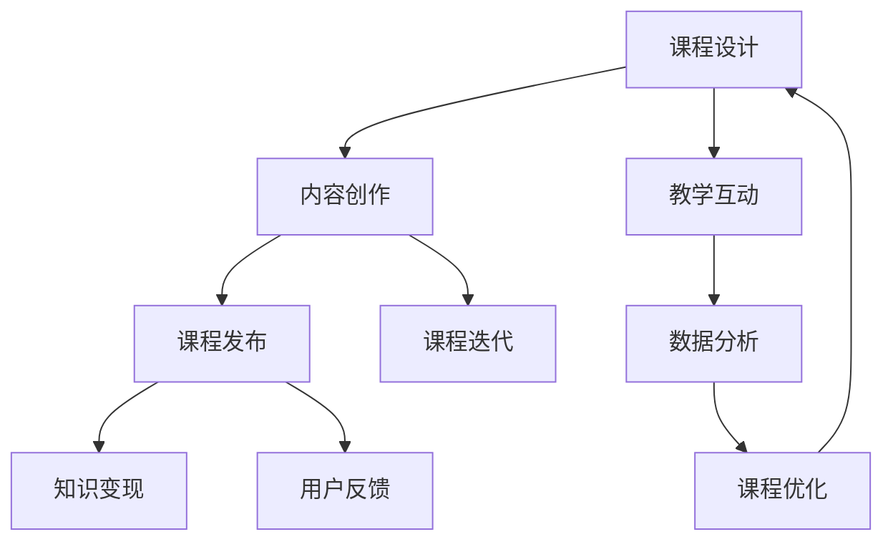

                 


# 在线课程创建工具：知识变现的效率助手

> 关键词：在线课程、知识变现、效率工具、教学平台、课程创建

> 摘要：本文将深入探讨在线课程创建工具如何帮助个人和机构实现知识变现，提高教学效率。通过详细的分析和实际案例，我们将揭示这些工具的核心功能和操作步骤，并提供实用的资源推荐，帮助读者更好地理解并应用这些工具。

## 1. 背景介绍

### 1.1 目的和范围

本文旨在为教育工作者、内容创作者以及希望通过在线课程实现知识变现的个人和机构提供一份详细的指南。我们将探讨以下内容：

- **在线课程创建工具的概述**：介绍常见的在线课程创建工具及其功能。
- **核心概念与联系**：通过Mermaid流程图展示课程创建的核心概念和架构。
- **核心算法原理与具体操作步骤**：讲解创建课程的算法原理，并提供伪代码示例。
- **数学模型和公式**：讨论课程设计与数据分析相关的数学模型和公式。
- **项目实战**：通过实际代码案例展示如何使用这些工具。
- **实际应用场景**：分析在线课程创建工具在不同领域的应用。
- **工具和资源推荐**：推荐相关的学习资源、开发工具和框架。
- **总结与未来趋势**：总结当前的发展状况，展望未来趋势和挑战。

### 1.2 预期读者

- 教育工作者和内容创作者，希望提高课程设计和教学效率。
- 机构管理者，希望了解如何通过在线课程实现知识变现。
- 对在线教育有浓厚兴趣的技术爱好者和专业人士。

### 1.3 文档结构概述

本文将按照以下结构展开：

- **1. 背景介绍**：介绍本文的目的和预期读者。
- **2. 核心概念与联系**：使用Mermaid流程图展示课程创建的核心概念。
- **3. 核心算法原理 & 具体操作步骤**：讲解课程创建的算法原理和操作步骤。
- **4. 数学模型和公式 & 详细讲解 & 举例说明**：介绍课程设计与数据分析的数学模型。
- **5. 项目实战：代码实际案例和详细解释说明**：通过案例展示工具的实际应用。
- **6. 实际应用场景**：分析工具在不同领域的应用。
- **7. 工具和资源推荐**：推荐学习资源和开发工具。
- **8. 总结：未来发展趋势与挑战**：总结当前状况并展望未来。
- **9. 附录：常见问题与解答**：回答常见问题。
- **10. 扩展阅读 & 参考资料**：提供额外的学习资源。

### 1.4 术语表

#### 1.4.1 核心术语定义

- **在线课程创建工具**：用于帮助用户创建、管理和发布在线课程的平台或软件。
- **知识变现**：将个人或组织的知识通过在线课程等形式转化为经济收益的过程。
- **教学平台**：提供教学资源和服务的在线平台。
- **内容创作者**：创建和发布在线课程的个人或团队。

#### 1.4.2 相关概念解释

- **课程设计**：设计在线课程的内容、结构和交互方式。
- **教学互动**：通过课程评论、论坛和测验等与学生互动。
- **数据分析**：对课程访问数据进行分析，以优化教学内容和推广策略。

#### 1.4.3 缩略词列表

- **LMS**：Learning Management System（学习管理系统）
- **CMS**：Content Management System（内容管理系统）
- **API**：Application Programming Interface（应用程序编程接口）
- **SaaS**：Software as a Service（软件即服务）

## 2. 核心概念与联系

为了更好地理解在线课程创建工具，我们需要先了解其核心概念和联系。以下是一个简单的Mermaid流程图，展示了课程创建的基本流程和主要组成部分。



### 课程设计（A）

课程设计是整个流程的起点。它包括确定课程目标、内容结构、教学方法和评估方式。一个良好的课程设计能够确保学生能够顺利地学习并达到预期的学习成果。

### 内容创作（B）

内容创作是将课程设计转化为实际课程内容的过程。这通常包括编写课程文本、制作多媒体资料（如视频、图片和音频）以及设计互动元素（如测验和讨论区）。

### 课程发布（C）

课程发布是将课程内容上传到在线教学平台并使其可供学生访问的过程。这通常涉及设置课程结构、发布日期和访问权限。

### 教学互动（D）

教学互动是教师与学生之间的互动，包括回答学生问题、提供反馈和指导。互动可以提高学生的学习积极性和效果。

### 数据分析（E）

数据分析是通过对课程访问数据和反馈进行分析，来评估课程效果并提出改进建议的过程。数据分析有助于优化课程内容和推广策略。

### 知识变现（F）

知识变现是将课程内容转化为经济收益的过程。这可以通过直接销售课程、提供订阅服务或通过广告和赞助实现。

### 课程迭代（G）

课程迭代是不断优化课程内容的过程。通过收集学生反馈和数据分析结果，教师可以不断改进课程，提高其质量和吸引力。

### 用户反馈（H）

用户反馈是学生和教师对课程质量的评价。这些反馈可以提供宝贵的改进意见，帮助教师优化课程设计和教学方式。

### 课程优化（I）

课程优化是基于数据分析和学生反馈对课程进行的调整。这可以包括修改课程内容、增加互动元素或改变教学方法。

通过上述Mermaid流程图，我们可以清晰地看到在线课程创建的基本流程和各个环节之间的联系。接下来，我们将深入探讨每个环节的具体实现方法和关键步骤。

## 3. 核心算法原理 & 具体操作步骤

在理解了在线课程创建的基本概念和流程后，接下来我们将详细探讨其核心算法原理和具体操作步骤。以下是创建在线课程的算法原理和伪代码示例。

### 3.1 课程设计算法原理

课程设计是整个流程的关键，一个良好的课程设计能够确保课程内容的逻辑性和连贯性。以下是课程设计的算法原理：

1. **确定课程目标**：首先，需要明确课程的目标，这包括学习成果、课程内容和考核标准。
2. **划分课程模块**：将课程内容划分为多个模块，每个模块包含一个主要知识点。
3. **设计教学互动**：根据课程模块设计互动元素，如测验、讨论区和小测验。
4. **评估方法设计**：确定评估方法，如考试、作业和小测验。

伪代码示例：

```
function 设计课程(课程目标, 课程模块列表, 教学互动列表, 评估方法) {
    // 确定课程目标
    设定课程目标为课程目标

    // 划分课程模块
    for 每个模块 in 课程模块列表 {
        模块内容 = 模块列表[模块].内容
        模块目标 = 模块列表[模块].目标
        添加模块内容到课程内容列表
    }

    // 设计教学互动
    for 每个互动 in 教学互动列表 {
        互动内容 = 教学互动列表[互动].内容
        添加互动内容到课程内容列表
    }

    // 评估方法设计
    评估方法 = 评估方法列表[评估方法].方法

    // 返回课程内容列表和评估方法
    return 课程内容列表, 评估方法
}
```

### 3.2 内容创作算法原理

内容创作是将课程设计转化为实际课程内容的过程。以下是内容创作的算法原理：

1. **编写课程文本**：根据课程模块编写详细的课程文本。
2. **制作多媒体资料**：根据需要制作视频、图片和音频等多媒体资料。
3. **设计互动元素**：设计测验、讨论区和互动视频等互动元素。
4. **整合课程内容**：将所有内容整合到一个平台上，确保内容的连贯性和易于访问。

伪代码示例：

```
function 内容创作(课程文本列表, 多媒体资料列表, 互动元素列表) {
    // 编写课程文本
    for 每个模块 in 课程文本列表 {
        模块文本 = 课程文本列表[模块].文本
        添加模块文本到课程内容
    }

    // 制作多媒体资料
    for 每个资料 in 多媒体资料列表 {
        资料类型 = 多媒体资料列表[资料].类型
        资料内容 = 多媒体资料列表[资料].内容
        根据资料类型添加内容到课程内容
    }

    // 设计互动元素
    for 每个互动 in 互动元素列表 {
        互动类型 = 互动元素列表[互动].类型
        互动内容 = 互动元素列表[互动].内容
        根据互动类型添加内容到课程内容
    }

    // 整合课程内容
    课程内容 = 整合课程文本、多媒体资料和互动元素

    // 返回整合后的课程内容
    return 课程内容
}
```

### 3.3 课程发布算法原理

课程发布是将课程内容上传到在线教学平台的过程。以下是课程发布的算法原理：

1. **选择教学平台**：根据课程需求和预算选择合适的教学平台。
2. **设置课程结构**：上传课程内容，并设置课程结构、发布日期和访问权限。
3. **发布课程**：将课程发布到教学平台上，使其可供学生访问。
4. **监控课程访问情况**：监控课程访问情况，确保课程能够正常运行。

伪代码示例：

```
function 发布课程(课程内容, 教学平台, 课程结构) {
    // 选择教学平台
    教学平台 = 选择教学平台()

    // 设置课程结构
    设置课程结构为课程结构

    // 上传课程内容
    上传课程内容到教学平台

    // 发布课程
    发布课程到教学平台

    // 监控课程访问情况
    监控课程访问情况并记录数据

    // 返回课程发布状态
    return 发布状态
}
```

通过上述算法原理和伪代码示例，我们可以清楚地理解在线课程创建的核心步骤和操作方法。在接下来的部分，我们将进一步探讨数学模型和公式，以帮助我们更好地分析和优化课程设计。

## 4. 数学模型和公式 & 详细讲解 & 举例说明

### 4.1 课程评估模型

课程评估是教学过程中至关重要的一环，它不仅能够帮助学生了解自己的学习进度，还能为教师提供改进课程的依据。以下是一个简单的课程评估模型，用于评估学生在不同模块上的学习效果。

#### 4.1.1 模型定义

假设学生 \(S\) 在课程 \(C\) 的模块 \(M\) 上的学习效果可以用三个指标来衡量：知识掌握度 \(P\)、技能应用度 \(A\) 和学习兴趣度 \(I\)。

- \(P\)：知识掌握度，表示学生对模块知识的理解程度。
- \(A\)：技能应用度，表示学生将所学知识应用于实际问题的能力。
- \(I\)：学习兴趣度，表示学生对模块内容的学习兴趣。

课程评估得分 \(R\) 可以通过以下公式计算：

\[ R = P \times w_1 + A \times w_2 + I \times w_3 \]

其中，\(w_1, w_2, w_3\) 分别是知识掌握度、技能应用度和学习兴趣度的权重。

#### 4.1.2 举例说明

假设课程 \(C\) 有三个模块 \(M_1, M_2, M_3\)，学生 \(S\) 在这三个模块上的得分分别为：

- \(P_{M_1} = 0.85\)
- \(A_{M_1} = 0.90\)
- \(I_{M_1} = 0.75\)

- \(P_{M_2} = 0.80\)
- \(A_{M_2} = 0.85\)
- \(I_{M_2} = 0.70\)

- \(P_{M_3} = 0.90\)
- \(A_{M_3} = 0.95\)
- \(I_{M_3} = 0.80\)

假设权重 \(w_1 = 0.5, w_2 = 0.3, w_3 = 0.2\)，则学生 \(S\) 在课程 \(C\) 上的综合评估得分 \(R\) 为：

\[ R = (0.85 \times 0.5 + 0.90 \times 0.3 + 0.75 \times 0.2) + (0.80 \times 0.5 + 0.85 \times 0.3 + 0.70 \times 0.2) + (0.90 \times 0.5 + 0.95 \times 0.3 + 0.80 \times 0.2) \]

\[ R = 0.425 + 0.345 + 0.495 \]

\[ R = 1.275 \]

### 4.2 用户留存模型

在线课程的用户留存率是衡量课程受欢迎程度和教学质量的重要指标。以下是一个简单的用户留存模型，用于预测学生在一定时间内的留存率。

#### 4.2.1 模型定义

用户留存率 \(L\) 可以通过以下公式计算：

\[ L = \frac{保留用户数}{总用户数} \]

保留用户数是指在指定时间内继续访问课程的用户数。总用户数是指在相同时间内访问课程的所有用户数。

#### 4.2.2 举例说明

假设在一个月内有100个学生报名参加在线课程，其中60个学生在一个月后仍然活跃。则该课程的月留存率为：

\[ L = \frac{60}{100} = 0.60 \] 或者 60%

### 4.3 数据分析模型

数据分析在课程设计和优化过程中起着关键作用。以下是一个简单的数据分析模型，用于分析学生在课程学习过程中的行为数据。

#### 4.3.1 模型定义

学生行为数据可以包括课程访问次数、学习时长、测验成绩和互动参与度等。

一个简单的数据分析模型可以使用以下公式：

\[ 分析结果 = \frac{目标指标值}{总指标值} \]

其中，目标指标值是指教师或课程开发者希望关注的指标，总指标值是所有相关指标的总和。

#### 4.3.2 举例说明

假设教师希望关注学生的测验成绩，统计了100名学生在一次测验中的成绩，最高分为100分，最低分为60分。平均成绩为80分。则该次测验的平均成绩占比为：

\[ 分析结果 = \frac{80}{100} = 0.80 \] 或者 80%

通过上述数学模型和公式，我们可以更好地分析和优化课程设计，提高学生的学习效果和满意度。在下一部分，我们将通过实际案例展示如何使用这些模型和工具进行在线课程的创建和优化。

## 5. 项目实战：代码实际案例和详细解释说明

### 5.1 开发环境搭建

在开始实际案例之前，我们需要搭建一个开发环境。以下是在线课程创建工具的开发环境搭建步骤：

1. **安装Node.js**：Node.js 是一个用于服务器端和开发的 JavaScript 运行环境。您可以从 [Node.js 官网](https://nodejs.org/) 下载并安装最新版本的 Node.js。

2. **安装Express**：Express 是一个用于 Node.js 的 web 应用框架。使用以下命令安装 Express：

   ```
   npm install express
   ```

3. **创建项目**：在终端中使用以下命令创建一个新的 Express 项目：

   ```
   express my-course-creation-tool
   ```

4. **进入项目目录**：

   ```
   cd my-course-creation-tool
   ```

5. **安装额外的依赖**：根据需要安装其他依赖，如数据库驱动、身份验证模块等。例如，安装 MongoDB 驱动：

   ```
   npm install mongodb
   ```

### 5.2 源代码详细实现和代码解读

以下是使用 Express 创建一个简单的在线课程创建工具的示例代码。我们将逐步解析关键部分。

#### 5.2.1 启动服务器

在 `app.js` 文件中，我们首先启动服务器：

```javascript
const express = require('express');
const app = express();

app.use(express.json()); // 用于解析JSON请求体

const PORT = process.env.PORT || 3000;
app.listen(PORT, () => {
    console.log(`服务器运行在端口 ${PORT}`);
});
```

这里，我们使用 Express 创建了一个新的应用程序实例，并启用 JSON 中间件以处理 JSON 格式的请求。

#### 5.2.2 创建课程

接下来，我们定义一个 API 端点用于创建课程：

```javascript
app.post('/courses', async (req, res) => {
    const course = req.body;
    // 这里可以添加数据库逻辑以存储课程数据
    console.log('创建课程：', course);
    res.status(201).json({ message: '课程创建成功', course });
});
```

这个端点接收一个 POST 请求，其中包含课程数据（例如课程名称、描述、模块等）。在实际应用中，我们将使用数据库存储这些数据。

#### 5.2.3 获取课程列表

然后，我们定义一个端点用于获取所有课程列表：

```javascript
app.get('/courses', async (req, res) => {
    // 这里可以添加数据库查询逻辑以获取课程列表
    const courses = [
        { id: 1, name: '课程一', description: '这是一个示例课程' },
        { id: 2, name: '课程二', description: '这是另一个示例课程' }
    ];
    res.status(200).json(courses);
});
```

这个端点返回一个预定义的课程列表。在实际应用中，我们将从数据库查询获取课程数据。

#### 5.2.4 更新课程

我们还可以添加一个端点用于更新课程信息：

```javascript
app.put('/courses/:id', async (req, res) => {
    const courseId = req.params.id;
    const updatedCourse = req.body;
    // 这里可以添加数据库更新逻辑
    console.log('更新课程：', courseId, updatedCourse);
    res.status(200).json({ message: '课程更新成功', courseId });
});
```

这个端点接收一个 PUT 请求，其中包含课程 ID 和更新后的课程数据。在实际应用中，我们将根据课程 ID 更新数据库中的相应记录。

#### 5.2.5 删除课程

最后，我们添加一个端点用于删除课程：

```javascript
app.delete('/courses/:id', async (req, res) => {
    const courseId = req.params.id;
    // 这里可以添加数据库删除逻辑
    console.log('删除课程：', courseId);
    res.status(200).json({ message: '课程删除成功', courseId });
});
```

这个端点接收一个 DELETE 请求，其中包含课程 ID。在实际应用中，我们将根据课程 ID 从数据库中删除相应记录。

### 5.3 代码解读与分析

1. **服务器启动**：通过 `app.listen(PORT, ...)` 方法，我们启动了一个服务器，监听指定的端口（默认为3000）。当服务器启动时，会打印一条消息到控制台。

2. **JSON 中间件**：`app.use(express.json())` 使得服务器能够解析 JSON 格式的请求体。

3. **创建课程**：`/courses` 端点用于创建新的课程。当收到一个 POST 请求时，我们获取请求体中的课程数据，并打印到控制台。在实际应用中，我们会将这些数据存储到数据库中。

4. **获取课程列表**：`/courses` 端点用于获取所有课程的列表。当收到一个 GET 请求时，我们返回一个预定义的课程列表。在实际应用中，我们会从数据库查询获取课程数据。

5. **更新课程**：`/courses/:id` 端点用于更新特定的课程。当收到一个 PUT 请求时，我们获取请求体中的更新数据和课程 ID，并打印到控制台。在实际应用中，我们会根据课程 ID 更新数据库中的相应记录。

6. **删除课程**：`/courses/:id` 端点用于删除特定的课程。当收到一个 DELETE 请求时，我们获取请求中的课程 ID，并打印到控制台。在实际应用中，我们会根据课程 ID 从数据库中删除相应记录。

通过上述代码示例，我们可以看到如何使用 Express 创建一个基本的在线课程创建工具。在实际应用中，我们还需要添加数据库连接、身份验证和安全措施等更多功能。

## 6. 实际应用场景

在线课程创建工具在各个领域都有广泛的应用，以下是一些典型的实际应用场景：

### 6.1 教育领域

- **K-12教育**：在线课程创建工具可以帮助学校和教育机构为学生提供灵活的在线学习资源，增强课堂互动，提高教学质量。
- **高等教育**：大学和研究生院可以利用这些工具为学生提供在线课程、讲座视频和互动练习，丰富学习体验。
- **职业培训**：在线课程创建工具可以为职业培训提供实用的培训课程，帮助学员提升专业技能，适应快速变化的工作环境。

### 6.2 企业培训

- **员工培训**：企业可以利用在线课程创建工具对员工进行定期培训，提高员工的技能和绩效。
- **领导力发展**：在线课程创建工具可以帮助企业培训领导者，提升领导力技能，推动组织发展。
- **企业文化建设**：企业可以通过在线课程创建工具推广企业文化，增强员工的归属感和凝聚力。

### 6.3 个人知识变现

- **专家分享**：专业人士可以利用在线课程创建工具分享自己的知识和经验，实现知识变现。
- **兴趣爱好教学**：对于有特殊爱好的人，如音乐、绘画或编程，在线课程创建工具可以帮助他们将自己的技能传授给他人。
- **在线咨询服务**：通过在线课程创建工具，专家可以提供个性化的在线咨询服务，满足学员的个性化需求。

### 6.4 社区教育

- **公共课程**：社区教育机构可以利用在线课程创建工具提供公共课程，如成人教育、老年大学课程等，促进终身学习。
- **远程教育**：在线课程创建工具可以帮助偏远地区的居民获得高质量的教育资源，缩小教育差距。

在这些应用场景中，在线课程创建工具不仅提高了教学效率，还打破了时间和空间的限制，使得知识和教育更加普及和便捷。通过这些工具，教育者可以更加灵活地设计课程，学生可以更加自主地学习，从而实现知识的有效传播和个人的自我提升。

## 7. 工具和资源推荐

为了帮助读者更好地了解和掌握在线课程创建工具，以下是一些学习资源和开发工具的推荐。

### 7.1 学习资源推荐

#### 7.1.1 书籍推荐

- **《在线课程设计与实施》**：作者详细介绍了在线课程的设计、开发和教学策略，适合教育工作者和课程设计师阅读。
- **《Web开发实战》**：本书通过实际的Web开发项目，讲解了如何使用各种Web开发工具和框架，适合对Web开发有兴趣的读者。

#### 7.1.2 在线课程

- **《在线教育平台开发》**：这是一个关于如何创建和维护在线教育平台的免费课程，适合希望深入了解在线教育平台的开发人员。
- **《JavaScript全栈开发》**：通过学习这门课程，您可以掌握JavaScript的前端和后端开发，为开发在线课程创建工具打下坚实基础。

#### 7.1.3 技术博客和网站

- **《码农之路》**：作者分享了大量的编程经验和在线教育心得，对于初学者和进阶者都有很大的帮助。
- **《在线教育论坛》**：这是一个在线教育的社区论坛，您可以在这里找到有关在线课程创建的各种讨论和资源。

### 7.2 开发工具框架推荐

#### 7.2.1 IDE和编辑器

- **Visual Studio Code**：一款功能强大的开源编辑器，支持多种编程语言和框架，适合开发在线课程创建工具。
- **IntelliJ IDEA**：一款专业的Java和JavaScript开发工具，提供丰富的插件和调试功能，适合进行复杂的项目开发。

#### 7.2.2 调试和性能分析工具

- **Chrome DevTools**：用于调试和优化Web应用的强大工具，可以帮助您分析和解决问题。
- **JMeter**：一款开源的性能测试工具，适合进行Web应用的负载测试和性能分析。

#### 7.2.3 相关框架和库

- **Express.js**：一个流行的Node.js Web应用框架，适用于快速构建Web应用程序。
- **MongoDB**：一个高性能、可扩展的NoSQL数据库，适合存储课程内容和用户数据。

通过这些工具和资源，您可以更轻松地掌握在线课程创建工具的使用，为您的教学和知识传播工作提供有力支持。

### 7.3 相关论文著作推荐

#### 7.3.1 经典论文

- **"Online Learning Platforms: A Survey"**：该论文对在线学习平台的发展现状、技术架构和应用案例进行了全面综述。
- **"The Impact of Online Education on Learning Outcomes"**：该论文探讨了在线教育对学习成果的影响，分析了在线课程的优势和挑战。

#### 7.3.2 最新研究成果

- **"Artificial Intelligence in Online Education: A Review"**：该论文介绍了人工智能在在线教育中的应用，包括个性化学习、智能辅导系统等。
- **"Interactive Video in Online Courses: Enhancing Learning and Engagement"**：该论文研究了交互式视频在在线课程中的应用，探讨了如何提高学习效果和参与度。

#### 7.3.3 应用案例分析

- **"EdX: Scaling Online Education with Open Source Technology"**：该案例研究介绍了EdX平台如何使用开源技术大规模提供在线课程，实现了知识传播的普及化。
- **"Coursera: Leveraging Online Education to Democratize Learning"**：该案例研究了Coursera平台如何通过在线课程为全球学习者提供高质量的教育资源，推动了教育公平。

这些论文和案例研究提供了丰富的理论和实践见解，对于理解和应用在线课程创建工具具有重要参考价值。

## 8. 总结：未来发展趋势与挑战

随着互联网和人工智能技术的不断发展，在线课程创建工具正逐渐成为知识传播和知识变现的重要工具。未来，在线课程创建工具将在以下几方面发展：

### 8.1 个性化学习

通过大数据和人工智能技术，未来在线课程创建工具将能够根据学生的兴趣、学习习惯和学习效果提供个性化学习路径和推荐，从而提高学习效果和满意度。

### 8.2 智能互动

人工智能将使在线课程创建工具更加智能化，包括智能辅导系统、互动式视频和虚拟现实技术等，为学生提供更加丰富和互动的学习体验。

### 8.3 社交学习

在线课程创建工具将更加注重社交互动，通过论坛、讨论区和社交媒体等功能，促进学习者之间的交流和合作，增强学习氛围。

### 8.4 可持续发展

随着环保意识的增强，在线课程创建工具将更加注重绿色环保，通过减少碳排放、优化资源利用等方式实现可持续发展。

然而，在线课程创建工具也面临一些挑战：

### 8.5 数据隐私和安全

随着在线课程数据的增加，数据隐私和安全问题将日益突出。如何保护学生和教师的个人信息和隐私，将成为在线课程创建工具发展的重要课题。

### 8.6 教育公平

虽然在线课程创建工具有助于知识传播，但如何确保所有学习者都能公平地获得优质教育资源，仍是一个需要持续关注和解决的问题。

### 8.7 技术门槛

对于一些非技术人员，使用复杂的在线课程创建工具可能存在一定的门槛。因此，如何简化工具的使用，降低技术门槛，也是未来需要关注的问题。

总之，在线课程创建工具具有巨大的发展潜力，同时也面临诸多挑战。通过不断创新和优化，这些工具将更好地服务于教育领域，推动知识的传播和个人的成长。

## 9. 附录：常见问题与解答

### 9.1 什么是在线课程创建工具？

在线课程创建工具是用于帮助个人和机构创建、管理和发布在线课程的平台或软件。这些工具通常提供课程设计、内容创作、课程发布、教学互动和数据分析等功能，使得教育者能够更加高效地设计和提供在线课程。

### 9.2 在线课程创建工具有哪些核心功能？

在线课程创建工具的主要核心功能包括：

- **课程设计**：帮助用户规划课程内容、结构和教学方法。
- **内容创作**：提供文本、视频、音频等多媒体内容的创作和管理。
- **课程发布**：将课程内容发布到在线教学平台，并设置课程结构、发布日期和访问权限。
- **教学互动**：提供评论、论坛、测验和小测验等互动功能，增强教学效果。
- **数据分析**：通过分析课程访问数据和用户反馈，优化课程内容和推广策略。
- **知识变现**：提供销售、订阅和广告等变现渠道，帮助用户实现知识变现。

### 9.3 如何选择合适的在线课程创建工具？

选择合适的在线课程创建工具时，可以考虑以下因素：

- **功能需求**：根据课程设计需求选择具有相应功能的工具。
- **用户界面**：选择界面友好、易于操作的工具，降低学习成本。
- **集成能力**：选择能够与现有系统（如邮件系统、社交媒体等）集成的工具。
- **性能和稳定性**：选择具有高性能和稳定性的工具，确保课程正常运行。
- **价格和预算**：根据预算选择合适的价格和付费模式。

### 9.4 如何提高在线课程的质量和吸引力？

提高在线课程的质量和吸引力可以从以下几个方面入手：

- **课程设计**：明确课程目标，规划合理的内容结构和教学方法。
- **内容创作**：制作高质量的多媒体内容，确保内容的准确性和趣味性。
- **教学互动**：提供丰富的互动功能，增强学生的学习积极性和参与度。
- **数据分析**：通过数据分析了解学生的学习情况和需求，及时调整课程内容和推广策略。
- **用户反馈**：重视学生和教师的反馈，持续优化课程内容和教学方法。

### 9.5 在线课程创建工具的安全性问题如何保障？

保障在线课程创建工具的安全性可以从以下几个方面进行：

- **数据加密**：使用SSL/TLS加密技术确保数据传输的安全性。
- **访问控制**：设置访问权限和用户认证机制，防止未授权访问。
- **备份与恢复**：定期备份课程数据，确保数据安全性和可用性。
- **安全审计**：定期进行安全审计和漏洞扫描，及时发现和修复安全漏洞。
- **用户教育**：教育用户注意个人信息保护，防止数据泄露。

通过上述措施，可以保障在线课程创建工具的安全性，确保用户数据的安全和隐私。

## 10. 扩展阅读 & 参考资料

为了帮助读者进一步深入了解在线课程创建工具和相关技术，以下是一些建议的扩展阅读和参考资料：

### 10.1 扩展阅读

- **《在线教育平台设计与开发》**：作者详细介绍了在线教育平台的设计原则、技术架构和开发流程，适合对在线教育平台开发有兴趣的读者。
- **《在线教育中的大数据应用》**：本书探讨了大数据在在线教育中的应用，包括数据分析、个性化推荐和学习效果评估等，对于希望了解大数据在教育中应用的人有很好的参考价值。
- **《人工智能与在线教育》**：作者介绍了人工智能在在线教育中的应用，包括智能辅导系统、个性化学习和虚拟现实技术等，适合对人工智能在在线教育中应用感兴趣的读者。

### 10.2 参考资料

- **《在线教育平台开源项目》**：GitHub上有很多开源的在线教育平台项目，如Moodle、Canvas和Edmodo等，读者可以参考这些项目的代码和文档，学习在线教育平台的设计和实现。
- **《在线教育相关标准与规范》**：国际电信联盟（ITU）和开放教育联盟（OLC）等组织发布了一系列关于在线教育的标准和规范，如SCORM和xAPI等，读者可以参考这些标准和规范，了解在线教育的发展趋势和最佳实践。
- **《在线教育政策与法规》**：不同国家和地区对在线教育有不同的政策和法规，读者可以通过相关政府网站和法规解读，了解在线教育的法律环境和合规要求。

通过上述扩展阅读和参考资料，读者可以更全面地了解在线课程创建工具和相关技术的最新发展，为自己的学习和实践提供更多指导。

