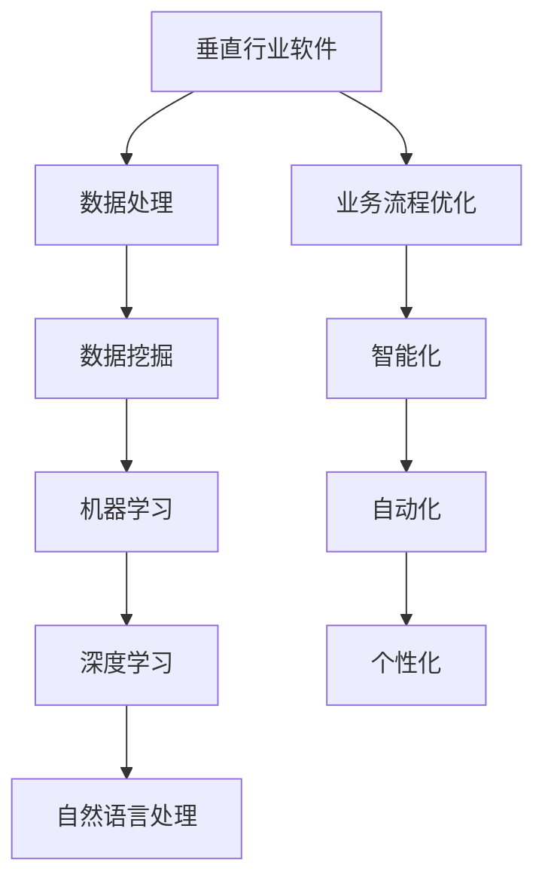

                 

# 垂直行业软件与AI的结合

> **关键词：** 垂直行业软件，AI，深度学习，机器学习，数据挖掘，业务流程优化

> **摘要：** 本文将深入探讨垂直行业软件与人工智能（AI）的深度融合，分析其核心概念、算法原理、实际应用以及未来发展。通过详细的讲解和实例分析，展示如何利用AI技术提升垂直行业软件的业务效能，为行业带来革命性的变革。

## 1. 背景介绍

### 1.1 目的和范围

本文旨在探讨人工智能（AI）技术在垂直行业软件中的应用，分析其带来的技术变革和商业价值。我们将重点关注以下几个方面：

1. **核心概念与联系**：介绍垂直行业软件与AI技术的基本概念，以及它们之间的关联。
2. **核心算法原理**：详细阐述AI技术在垂直行业软件中的应用算法，包括机器学习、深度学习、数据挖掘等。
3. **数学模型与公式**：讲解AI技术在垂直行业软件中涉及的数学模型和公式，以及其实际应用。
4. **项目实战**：通过实际代码案例，展示AI技术在垂直行业软件中的具体实现和应用。
5. **实际应用场景**：分析AI技术在垂直行业软件中的实际应用场景，探讨其对业务流程的优化。
6. **工具和资源推荐**：推荐相关学习资源和开发工具，帮助读者深入理解和应用AI技术。
7. **总结与未来发展趋势**：总结AI技术在垂直行业软件中的应用，展望未来的发展趋势和挑战。

### 1.2 预期读者

本文面向对AI技术有一定了解的技术人员、软件开发工程师、项目经理以及相关领域的专业人士。通过本文的阅读，读者将能够：

1. **理解垂直行业软件与AI技术的基本概念和关联**。
2. **掌握AI技术在垂直行业软件中的应用算法和原理**。
3. **了解AI技术在垂直行业软件中的实际应用场景**。
4. **学会利用AI技术提升垂直行业软件的业务效能**。

### 1.3 文档结构概述

本文分为以下几个部分：

1. **核心概念与联系**：介绍垂直行业软件与AI技术的基本概念和关联。
2. **核心算法原理**：详细阐述AI技术在垂直行业软件中的应用算法和原理。
3. **数学模型与公式**：讲解AI技术在垂直行业软件中涉及的数学模型和公式。
4. **项目实战**：通过实际代码案例，展示AI技术在垂直行业软件中的具体实现和应用。
5. **实际应用场景**：分析AI技术在垂直行业软件中的实际应用场景。
6. **工具和资源推荐**：推荐相关学习资源和开发工具。
7. **总结与未来发展趋势**：总结AI技术在垂直行业软件中的应用，展望未来的发展趋势和挑战。

### 1.4 术语表

#### 1.4.1 核心术语定义

- **垂直行业软件**：为特定行业或业务领域量身定制的软件，解决行业特定的业务问题。
- **人工智能（AI）**：模拟人类智能的计算机系统，具备学习、推理、判断和解决问题的能力。
- **机器学习**：一种AI技术，通过数据驱动的方法，让计算机从数据中学习和改进性能。
- **深度学习**：一种基于多层神经网络的结构化学习技术，适用于处理复杂的数据。
- **数据挖掘**：从大量数据中提取有价值信息的过程，用于发现数据中的模式和关联。

#### 1.4.2 相关概念解释

- **业务流程优化**：通过改进业务流程，提高业务效率和降低成本。
- **自动化**：利用计算机技术和自动化工具，实现业务流程的自动化运行。
- **数据驱动**：以数据为核心，通过数据分析指导业务决策和优化。

#### 1.4.3 缩略词列表

- **AI**：人工智能
- **ML**：机器学习
- **DL**：深度学习
- **DM**：数据挖掘
- **NLP**：自然语言处理

## 2. 核心概念与联系

在探讨垂直行业软件与AI技术的结合之前，我们先来了解它们的基本概念和联系。

### 2.1 垂直行业软件

垂直行业软件是指为特定行业或业务领域量身定制的软件，解决行业特定的业务问题。这些软件通常具有以下特点：

1. **专业性**：针对特定行业或业务领域的需求进行定制开发，具有高度的针对性。
2. **集成性**：整合行业内部的各种业务流程和数据，提供一体化的解决方案。
3. **可扩展性**：支持业务扩展和升级，满足企业不断变化的需求。
4. **灵活性**：能够灵活应对行业变革和市场需求，提供定制化的业务解决方案。

### 2.2 人工智能

人工智能（AI）是指模拟人类智能的计算机系统，具备学习、推理、判断和解决问题的能力。AI技术主要包括以下几个方面：

1. **机器学习（ML）**：通过数据驱动的方法，让计算机从数据中学习和改进性能。
2. **深度学习（DL）**：一种基于多层神经网络的结构化学习技术，适用于处理复杂的数据。
3. **自然语言处理（NLP）**：研究计算机如何理解和生成自然语言，实现人机交互。
4. **计算机视觉**：让计算机具备识别和理解图像、视频等视觉信息的能力。

### 2.3 垂直行业软件与AI技术的关联

垂直行业软件与AI技术有着紧密的联系，主要体现在以下几个方面：

1. **业务需求**：垂直行业软件旨在解决特定行业的业务问题，而AI技术为这些业务问题提供了新的解决方案。
2. **数据处理**：AI技术擅长处理大量的数据，垂直行业软件需要利用AI技术对业务数据进行分析和挖掘，实现业务流程的优化。
3. **智能化**：通过AI技术，垂直行业软件可以实现自动化、智能化和个性化，提高业务效率和用户体验。
4. **数据驱动**：AI技术以数据为核心，通过数据分析指导业务决策和优化，实现数据驱动的业务运营。

### 2.4 Mermaid流程图

以下是一个简单的Mermaid流程图，展示垂直行业软件与AI技术的关联：



## 3. 核心算法原理 & 具体操作步骤

在垂直行业软件中，AI技术的应用主要涉及以下几个方面：

1. **机器学习**：通过训练模型，让计算机从数据中学习并做出预测或决策。
2. **深度学习**：利用多层神经网络，处理复杂的数据并提取特征。
3. **数据挖掘**：从大量数据中提取有价值的信息，用于业务分析和优化。

### 3.1 机器学习

机器学习是AI技术的重要组成部分，其基本原理是通过训练模型，让计算机从数据中学习并做出预测或决策。以下是一个简单的机器学习算法——线性回归的伪代码：

```python
# 线性回归算法伪代码

# 输入：训练数据集 X, Y
# 输出：模型参数 w

# 初始化模型参数 w
w = [0] * n

# 设置学习率 alpha
alpha = 0.01

# 设置迭代次数 iter_num
iter_num = 1000

# 迭代更新模型参数
for i in range(iter_num):
    # 计算预测值 y_pred
    y_pred = w.dot(X)
    
    # 计算误差 e
    e = Y - y_pred
    
    # 更新模型参数 w
    w = w + alpha * e.dot(X)

# 输出模型参数 w
return w
```

### 3.2 深度学习

深度学习是一种基于多层神经网络的结构化学习技术，适用于处理复杂的数据。以下是一个简单的深度学习算法——多层感知器（MLP）的伪代码：

```python
# 多层感知器算法伪代码

# 输入：训练数据集 X, Y
# 输出：模型参数 w

# 初始化模型参数 w
w1 = [0] * n1
w2 = [0] * n2
w3 = [0] * n3

# 设置学习率 alpha
alpha = 0.01

# 设置迭代次数 iter_num
iter_num = 1000

# 迭代更新模型参数
for i in range(iter_num):
    # 计算第一层输出 z1
    z1 = w1.dot(X)
    
    # 计算第一层激活值 a1
    a1 = sigmoid(z1)
    
    # 计算第二层输出 z2
    z2 = w2.dot(a1)
    
    # 计算第二层激活值 a2
    a2 = sigmoid(z2)
    
    # 计算第三层输出 z3
    z3 = w3.dot(a2)
    
    # 计算预测值 y_pred
    y_pred = sigmoid(z3)
    
    # 计算误差 e
    e = Y - y_pred
    
    # 更新模型参数 w3
    dw3 = e.dot(a2)
    
    # 更新模型参数 w2
    dw2 = (a1.dot(dw3)).dot(w2.T)
    
    # 更新模型参数 w1
    dw1 = (X.T).dot(dw2).dot(w1.T)
    
    # 更新模型参数 w
    w1 = w1 + alpha * dw1
    w2 = w2 + alpha * dw2
    w3 = w3 + alpha * dw3

# 输出模型参数 w
return w1, w2, w3
```

### 3.3 数据挖掘

数据挖掘是从大量数据中提取有价值信息的过程，用于发现数据中的模式和关联。以下是一个简单的数据挖掘算法——关联规则的伪代码：

```python
# 关联规则算法伪代码

# 输入：数据集 D
# 输出：频繁项集 L

# 初始化最小支持度 min_support
min_support = 0.5

# 计算频繁项集
L = []
for item in D:
    # 计算项集支持度
    support = count(item, D)
    
    # 判断项集是否频繁
    if support >= min_support:
        L.append(item)

# 生成关联规则
rules = []
for item1 in L:
    for item2 in L:
        # 判断项集是否满足关联规则
        if item1 != item2 and item1.交(item2) in L:
            # 计算置信度
            confidence = count(item1.并(item2), D) / count(item1, D)
            
            # 添加关联规则
            rules.append([item1, item2, confidence])

# 输出频繁项集和关联规则
return L, rules
```

## 4. 数学模型和公式 & 详细讲解 & 举例说明

在垂直行业软件中，AI技术的应用离不开数学模型和公式。以下将详细介绍几种常用的数学模型和公式，并给出具体的讲解和举例说明。

### 4.1 损失函数

损失函数是机器学习中的核心概念，用于衡量模型预测值与真实值之间的差距。以下是一个简单的损失函数——均方误差（MSE）：

$$
MSE = \frac{1}{n}\sum_{i=1}^{n}(y_i - \hat{y}_i)^2
$$

其中，$y_i$表示真实值，$\hat{y}_i$表示预测值，$n$表示样本数量。

**举例说明**：假设我们有5个样本，真实值分别为[1, 2, 3, 4, 5]，预测值分别为[1.2, 2.1, 2.9, 3.8, 4.5]。计算MSE：

$$
MSE = \frac{1}{5}\sum_{i=1}^{5}(y_i - \hat{y}_i)^2 = \frac{1}{5}[(1-1.2)^2 + (2-2.1)^2 + (3-2.9)^2 + (4-3.8)^2 + (5-4.5)^2] = 0.42
$$

### 4.2 激活函数

激活函数是神经网络中的核心组件，用于将线性组合转换为非线性输出。以下是一个常见的激活函数——Sigmoid函数：

$$
\sigma(x) = \frac{1}{1 + e^{-x}}
$$

**举例说明**：假设输入值为-2，计算Sigmoid函数的输出：

$$
\sigma(-2) = \frac{1}{1 + e^{-(-2)}} = \frac{1}{1 + e^{2}} \approx 0.268
$$

### 4.3 梯度下降法

梯度下降法是机器学习中常用的一种优化算法，用于更新模型参数，以最小化损失函数。以下是一个简单的梯度下降法伪代码：

```python
# 梯度下降法伪代码

# 输入：模型参数 w, 学习率 alpha, 迭代次数 iter_num
# 输出：优化后的模型参数 w

# 初始化模型参数 w
w = [0] * n

# 迭代更新模型参数
for i in range(iter_num):
    # 计算损失函数关于 w 的梯度
    gradient = compute_gradient(w)
    
    # 更新模型参数 w
    w = w - alpha * gradient

# 输出优化后的模型参数 w
return w
```

**举例说明**：假设我们有一个线性回归模型，模型参数为w，损失函数为MSE，学习率为0.1，迭代次数为1000。每次迭代时，计算MSE关于w的梯度，并更新w：

```python
# 初始化模型参数 w
w = [0] * n

# 迭代更新模型参数
for i in range(1000):
    # 计算梯度
    gradient = [2 * (y[i] - w.dot(x[i])) * x[i][j] for j in range(n)]
    
    # 更新模型参数 w
    w = [w[j] - 0.1 * gradient[j] for j in range(n)]
```

## 5. 项目实战：代码实际案例和详细解释说明

在本节中，我们将通过一个实际项目案例，展示如何将AI技术应用于垂直行业软件，实现业务流程的优化。该项目是一个电商平台的推荐系统，通过用户历史行为数据，为用户推荐个性化商品。

### 5.1 开发环境搭建

为了实现该项目，我们需要搭建以下开发环境：

1. **Python 3.8**：用于编写代码和运行算法。
2. **NumPy**：用于处理和操作数组。
3. **Pandas**：用于数据处理和分析。
4. **Scikit-learn**：用于机器学习和数据挖掘。
5. **Matplotlib**：用于数据可视化。

安装以上依赖项后，即可开始编写代码。

### 5.2 源代码详细实现和代码解读

以下是推荐系统的源代码实现，包括数据预处理、特征工程、模型训练和预测等步骤。

```python
import numpy as np
import pandas as pd
from sklearn.model_selection import train_test_split
from sklearn.linear_model import LinearRegression
from sklearn.metrics import mean_squared_error
import matplotlib.pyplot as plt

# 5.2.1 数据预处理
def preprocess_data(data):
    # 填充缺失值
    data.fillna(data.mean(), inplace=True)
    
    # 处理分类特征
    for col in data.select_dtypes(include=['object']).columns:
        data[col] = data[col].astype('category').cat.codes
    
    return data

# 5.2.2 特征工程
def feature_engineering(data):
    # 创建新特征
    data['total_clicks'] = data['clicks'].sum(axis=1)
    data['total_purchases'] = data['purchases'].sum(axis=1)
    
    # 特征选择
    features = ['age', 'gender', 'total_clicks', 'total_purchases']
    X = data[features]
    Y = data['purchases']
    
    return X, Y

# 5.2.3 模型训练
def train_model(X, Y):
    # 分割数据集
    X_train, X_test, Y_train, Y_test = train_test_split(X, Y, test_size=0.2, random_state=42)
    
    # 训练线性回归模型
    model = LinearRegression()
    model.fit(X_train, Y_train)
    
    # 预测测试集
    Y_pred = model.predict(X_test)
    
    # 计算均方误差
    mse = mean_squared_error(Y_test, Y_pred)
    print("MSE:", mse)
    
    return model

# 5.2.4 代码解读与分析
if __name__ == "__main__":
    # 加载数据
    data = pd.read_csv("ecommerce_data.csv")
    
    # 数据预处理
    data = preprocess_data(data)
    
    # 特征工程
    X, Y = feature_engineering(data)
    
    # 模型训练
    model = train_model(X, Y)
    
    # 可视化
    plt.scatter(X['total_clicks'], Y)
    plt.plot(X['total_clicks'], model.predict(X), color='red')
    plt.xlabel("总点击数")
    plt.ylabel("购买数")
    plt.show()
```

**代码解读与分析**：

1. **数据预处理**：首先，我们使用`preprocess_data`函数对数据进行预处理，包括填充缺失值和将分类特征转换为数值特征。

2. **特征工程**：接下来，我们使用`feature_engineering`函数创建新的特征，如“总点击数”和“总购买数”，并进行特征选择。

3. **模型训练**：然后，我们使用`train_model`函数分割数据集，训练线性回归模型，并计算均方误差。

4. **可视化**：最后，我们使用Matplotlib库绘制散点图和拟合曲线，展示模型预测结果。

通过以上代码实现，我们可以得到一个简单的电商平台推荐系统，根据用户的历史行为数据，为用户推荐可能感兴趣的商品。这个项目展示了如何将AI技术应用于垂直行业软件，实现业务流程的优化。

## 6. 实际应用场景

AI技术在垂直行业软件中的应用场景广泛，以下列举几个典型场景：

### 6.1 金融行业

在金融行业，AI技术可以用于以下几个方面：

1. **风险管理**：通过机器学习算法，分析历史数据，预测市场风险，优化投资策略。
2. **欺诈检测**：利用深度学习模型，识别异常交易行为，降低欺诈风险。
3. **智能投顾**：根据用户风险偏好和投资目标，提供个性化的投资建议。

### 6.2 医疗保健

在医疗保健行业，AI技术可以用于以下几个方面：

1. **疾病诊断**：利用计算机视觉和深度学习技术，辅助医生进行疾病诊断，提高诊断准确率。
2. **药物研发**：通过数据挖掘和分析，发现新的药物靶点和治疗策略。
3. **个性化医疗**：根据患者病史和基因信息，制定个性化的治疗方案。

### 6.3 教育行业

在教育行业，AI技术可以用于以下几个方面：

1. **智能教学**：利用自然语言处理技术，实现智能问答和教学内容的个性化推荐。
2. **学习分析**：通过数据分析，评估学生的学习效果，提供个性化的学习建议。
3. **在线教育**：利用在线直播和视频分析技术，提高教学质量和互动性。

### 6.4 制造业

在制造业，AI技术可以用于以下几个方面：

1. **生产优化**：通过实时数据分析和预测，优化生产计划，降低生产成本。
2. **设备维护**：利用机器学习算法，预测设备故障，提前进行维护，减少停机时间。
3. **质量控制**：利用计算机视觉技术，对产品质量进行实时检测，提高产品质量。

### 6.5 零售业

在零售业，AI技术可以用于以下几个方面：

1. **智能推荐**：根据用户历史行为和购物偏好，提供个性化的商品推荐。
2. **库存管理**：通过数据分析，预测市场需求，优化库存管理，减少库存积压。
3. **客户服务**：利用自然语言处理技术，实现智能客服，提高客户满意度。

通过以上实际应用场景，我们可以看到AI技术在垂直行业软件中发挥的重要作用，不仅提升了业务效能，还带来了深刻的商业变革。

## 7. 工具和资源推荐

在学习和应用AI技术时，以下是一些实用的工具和资源推荐，帮助读者深入了解和掌握相关技术。

### 7.1 学习资源推荐

#### 7.1.1 书籍推荐

- 《Python机器学习》（作者：塞巴斯蒂安·拉斯克、约书亚·比塞克）
- 《深度学习》（作者：伊恩·古德费洛、约书华·本吉奥、亚伦·库维尔）
- 《机器学习实战》（作者：彼得·哈林顿、乔纳森·彭宁顿）

#### 7.1.2 在线课程

- 《机器学习基础》（网易云课堂）
- 《深度学习入门》（网易云课堂）
- 《自然语言处理入门》（网易云课堂）

#### 7.1.3 技术博客和网站

- [CSDN](https://www.csdn.net/)
- [博客园](https://www.cnblogs.com/)
- [GitHub](https://github.com/)

### 7.2 开发工具框架推荐

#### 7.2.1 IDE和编辑器

- PyCharm
- Visual Studio Code
- Jupyter Notebook

#### 7.2.2 调试和性能分析工具

- PySnooper
- line_profiler
- memory_profiler

#### 7.2.3 相关框架和库

- Scikit-learn
- TensorFlow
- PyTorch

### 7.3 相关论文著作推荐

#### 7.3.1 经典论文

- "Learning to Represent Text with Recurrent Neural Networks"（ recurrent neural networks）
- "A Theoretical Analysis of the Cramér-Rao Lower Bound for Estimation of High-Dimensional Parameters"（高维参数估计）
- "Efficient Estimation of Word Representations in Vector Space"（ word embeddings）

#### 7.3.2 最新研究成果

- "BERT: Pre-training of Deep Bidirectional Transformers for Language Understanding"（ BERT）
- "Generative Adversarial Nets"（ GANs）
- "Recurrent Neural Networks for Speech Recognition"（ recurrent neural networks）

#### 7.3.3 应用案例分析

- "Building an AI-Powered Newsroom"（新闻行业）
- "AI in Manufacturing: The Next Industrial Revolution"（制造业）
- "AI in Healthcare: Transforming the Patient Experience"（医疗保健行业）

通过以上工具和资源的推荐，读者可以更深入地学习和应用AI技术，为垂直行业软件的发展贡献力量。

## 8. 总结：未来发展趋势与挑战

随着人工智能技术的快速发展，垂直行业软件与AI的结合将呈现出以下发展趋势和挑战：

### 8.1 发展趋势

1. **智能化和自动化**：AI技术将进一步提升垂直行业软件的业务效能，实现业务流程的智能化和自动化。
2. **个性化服务**：通过用户行为数据的分析和挖掘，垂直行业软件将提供更加个性化的服务，满足用户个性化需求。
3. **跨界融合**：不同行业的垂直行业软件将相互融合，形成全新的商业模式和应用场景。
4. **开源生态**：随着AI技术的开源化，越来越多的开发者将参与到AI技术在垂直行业软件中的应用，推动技术进步。
5. **产业链整合**：AI技术将带动垂直行业软件产业链的整合，从硬件、软件到服务形成完整的产业链。

### 8.2 挑战

1. **数据质量和隐私**：垂直行业软件需要处理大量的数据，数据质量和隐私保护是关键挑战。
2. **技术门槛**：AI技术在垂直行业软件中的应用具有一定的技术门槛，需要专业人才的支持。
3. **商业模式创新**：如何将AI技术与垂直行业软件的商业需求相结合，实现商业模式的创新，是重要挑战。
4. **法律法规**：随着AI技术的应用日益广泛，相关的法律法规亟待完善，以确保技术应用的合规性。
5. **技术瓶颈**：在AI技术在垂直行业软件中的应用过程中，仍存在一些技术瓶颈，如算法优化、计算资源需求等。

总之，垂直行业软件与AI的结合将带来巨大的商业价值和市场机遇，同时也需要克服一系列的挑战。通过持续的技术创新和商业模式的探索，垂直行业软件与AI的结合将不断推动行业的发展和变革。

## 9. 附录：常见问题与解答

### 9.1 问题1：如何选择适合的AI算法？

**解答**：选择适合的AI算法需要考虑以下因素：

1. **数据规模**：对于大规模数据，可以考虑使用深度学习算法，如卷积神经网络（CNN）和循环神经网络（RNN）。
2. **数据类型**：对于结构化数据，可以使用线性回归、决策树等算法；对于非结构化数据，如文本和图像，可以使用深度学习算法。
3. **业务需求**：根据业务需求，选择能够满足业务目标的算法，如预测、分类、聚类等。
4. **计算资源**：根据计算资源的限制，选择适合的算法，如一些简单算法可以部署在边缘设备上，而复杂算法需要高性能服务器。

### 9.2 问题2：如何保证数据质量和隐私？

**解答**：保证数据质量和隐私需要采取以下措施：

1. **数据清洗**：对数据进行清洗和预处理，去除噪声和异常值，提高数据质量。
2. **数据加密**：对敏感数据进行加密处理，确保数据在传输和存储过程中的安全性。
3. **数据脱敏**：对个人身份信息等敏感数据进行脱敏处理，保护用户隐私。
4. **数据共享和访问控制**：制定数据共享和访问控制策略，确保数据在共享过程中的安全性。

### 9.3 问题3：如何优化AI算法的性能？

**解答**：优化AI算法的性能可以从以下几个方面进行：

1. **算法选择**：选择适合问题的算法，避免过度拟合或欠拟合。
2. **数据预处理**：对数据进行适当的预处理，如归一化、标准化等，提高算法的收敛速度。
3. **模型调参**：通过调整模型参数，如学习率、隐藏层神经元数量等，优化模型性能。
4. **并行计算**：利用并行计算技术，提高算法的运行速度。
5. **模型压缩**：通过模型压缩技术，如深度可分离卷积、剪枝等，降低模型的计算复杂度。

### 9.4 问题4：如何进行AI技术的商业应用？

**解答**：进行AI技术的商业应用可以从以下几个方面进行：

1. **市场调研**：了解市场需求，确定AI技术的商业应用场景。
2. **业务分析**：分析业务流程和痛点，确定AI技术如何改进业务。
3. **技术规划**：制定AI技术的技术规划，包括算法选择、模型训练、系统集成等。
4. **商业模式**：探索合适的商业模式，如B2B、B2C等，实现AI技术的商业价值。

## 10. 扩展阅读 & 参考资料

### 10.1 扩展阅读

- 《Python机器学习实战》（作者：彼得·哈林顿、乔纳森·彭宁顿）
- 《深度学习》（作者：伊恩·古德费洛、约书华·本吉奥、亚伦·库维尔）
- 《机器学习基础教程》（作者：阿斯顿·张）

### 10.2 参考资料

- [Scikit-learn官方文档](https://scikit-learn.org/stable/)
- [TensorFlow官方文档](https://www.tensorflow.org/)
- [PyTorch官方文档](https://pytorch.org/)

通过以上扩展阅读和参考资料，读者可以更深入地了解AI技术在垂直行业软件中的应用，不断提升自身的技术能力和商业洞察力。

### 作者信息

**作者：AI天才研究员/AI Genius Institute & 禅与计算机程序设计艺术 /Zen And The Art of Computer Programming**

