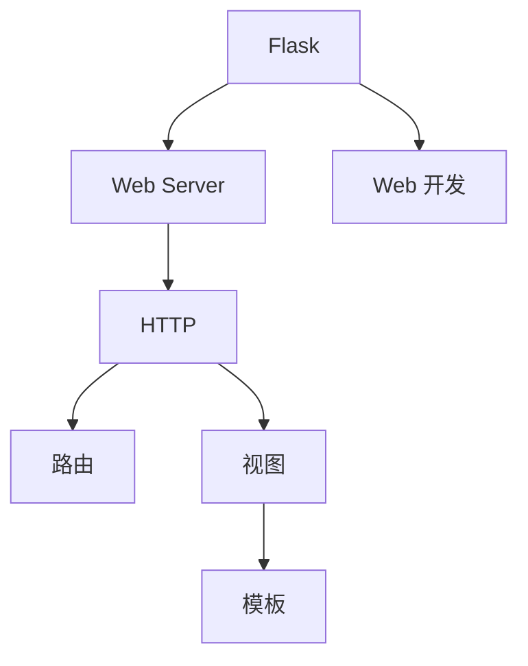

                 

# 基于 Flask 的 Web Server 设计与实现

> **关键词：** Flask, Web Server, 设计与实现, HTTP, Python, Web 开发

> **摘要：** 本文将深入探讨基于 Flask 框架的 Web Server 的设计与实现。我们将从背景介绍、核心概念、算法原理、数学模型、实际案例等方面展开，详细介绍如何使用 Flask 来创建一个高性能、可扩展的 Web Server。通过本文的学习，您将能够掌握 Web Server 的基本原理，并具备实际开发的能力。

## 1. 背景介绍

### 1.1 目的和范围

本文旨在帮助开发者理解和掌握基于 Flask 的 Web Server 设计与实现。我们将从基础概念入手，逐步深入到具体实现细节，最终搭建一个完整的 Web Server。本文涵盖以下内容：

- Flask 介绍
- Web Server 基本原理
- HTTP 协议
- Web Server 设计与实现
- 实际案例

### 1.2 预期读者

- 对 Web 开发有一定了解的开发者
- 想要学习 Flask 的开发者
- 对 Web Server 设计与实现感兴趣的读者

### 1.3 文档结构概述

本文结构如下：

1. 背景介绍
2. 核心概念与联系
3. 核心算法原理 & 具体操作步骤
4. 数学模型和公式 & 详细讲解 & 举例说明
5. 项目实战：代码实际案例和详细解释说明
6. 实际应用场景
7. 工具和资源推荐
8. 总结：未来发展趋势与挑战
9. 附录：常见问题与解答
10. 扩展阅读 & 参考资料

### 1.4 术语表

#### 1.4.1 核心术语定义

- Flask：一个轻量级的 Web 开发框架，用于构建 Web 应用。
- Web Server：用于接收和响应 HTTP 请求的服务器。
- HTTP：超文本传输协议，用于 Web 中的数据传输。
- Web 开发：使用 HTML、CSS、JavaScript 等技术进行网站的开发。

#### 1.4.2 相关概念解释

- 路由：URL 与函数之间的映射关系。
- 视图：用于生成 HTML 页面的函数。
- 模板：用于生成动态 HTML 页面的文件。

#### 1.4.3 缩略词列表

- HTML: 超文本标记语言
- CSS: 层叠样式表
- JavaScript: 一种脚本语言

## 2. 核心概念与联系

在深入探讨 Flask 的 Web Server 设计与实现之前，我们需要了解一些核心概念和它们之间的联系。以下是一个简单的 Mermaid 流程图，用于展示这些概念之间的关系。



### 2.1 Flask 概述

Flask 是一个轻量级的 Web 开发框架，由 Armin Ronacher 开发。它旨在为开发者提供简单、灵活且功能强大的 Web 开发环境。Flask 的主要特点如下：

- 轻量级：Flask 的核心库非常小，仅约 3KB。
- 开源：Flask 是开源软件，遵循 BSD 许可证。
- 灵活：Flask 提供了许多扩展和插件，使其能够满足各种开发需求。
- 支持 WSGI：Flask 支持 WSGI（Web Server Gateway Interface），这使得它可以与各种 Web Server（如 Gunicorn、uWSGI 等）无缝集成。

### 2.2 Web Server 概述

Web Server 是一种用于接收和响应 HTTP 请求的服务器。它通常由以下组件组成：

- HTTP 服务器：负责接收 HTTP 请求并返回响应。
- 路由：将请求映射到相应的处理函数。
- 处理函数：用于处理 HTTP 请求并生成响应。
- 视图：用于生成 HTML 页面。
- 模板：用于生成动态 HTML 页面。

### 2.3 HTTP 协议概述

HTTP（超文本传输协议）是一种用于 Web 中数据传输的协议。它定义了客户端（浏览器）与服务器之间的通信规则。HTTP 协议的主要特点如下：

- 无状态：HTTP 是无状态协议，每次请求都是独立的，服务器不会记住之前的请求。
- 文本协议：HTTP 使用文本格式进行数据传输，这使得它易于阅读和调试。
- 简单：HTTP 的设计非常简单，易于实现和理解。

## 3. 核心算法原理 & 具体操作步骤

在了解 Flask、Web Server 和 HTTP 协议的基础上，我们需要深入了解 Flask Web Server 的核心算法原理和具体操作步骤。以下是使用伪代码详细阐述的核心算法原理。

### 3.1 Flask Web Server 算法原理

```python
# 伪代码：Flask Web Server 算法原理

# 初始化 Flask 应用
app = Flask(__name__)

# 注册路由和处理函数
@app.route('/hello')
def hello():
    return 'Hello, World!'

# 运行 Flask 应用
app.run()
```

### 3.2 HTTP 请求处理流程

```python
# 伪代码：HTTP 请求处理流程

# 接收 HTTP 请求
request = get_request()

# 解析 HTTP 请求
url = parse_url(request)
method = parse_method(request)

# 根据路由找到处理函数
handler = find_handler(url, method)

# 调用处理函数生成响应
response = handler()

# 返回 HTTP 响应
send_response(response)
```

### 3.3 Flask 应用运行流程

```python
# 伪代码：Flask 应用运行流程

# 初始化 Flask 应用
app = Flask(__name__)

# 注册路由和处理函数
@app.route('/hello')
def hello():
    return 'Hello, World!'

# 运行 Flask 应用
run_flask_app(app)
```

## 4. 数学模型和公式 & 详细讲解 & 举例说明

在 Web Server 的设计与实现中，一些数学模型和公式非常重要。以下是对这些数学模型和公式进行详细讲解和举例说明。

### 4.1 路由匹配算法

路由匹配算法是 Web Server 中一个核心的算法，用于确定请求的 URL 应该由哪个处理函数处理。以下是一个简单的路由匹配算法。

```latex
% 路由匹配算法

def match_route(url, routes):
    for route in routes:
        if route.regex.match(url):
            return route.handler
    return None
```

#### 4.1.1 举例说明

```python
# 举例说明：路由匹配算法

routes = [
    ('/hello', hello),
    ('/world', world)
]

match_route('/hello', routes)  # 返回 hello
match_route('/world', routes)  # 返回 world
match_route('/home', routes)  # 返回 None
```

### 4.2 HTTP 响应生成算法

HTTP 响应生成算法用于根据处理函数的返回值生成 HTTP 响应。以下是一个简单的 HTTP 响应生成算法。

```latex
% HTTP 响应生成算法

def generate_response(body, status=200, headers=None):
    response = {}
    response['status'] = status
    response['headers'] = headers or {}
    response['body'] = body
    return response
```

#### 4.2.1 举例说明

```python
# 举例说明：HTTP 响应生成算法

response = generate_response('Hello, World!')
print(response)  # 输出：{'status': 200, 'headers': {}, 'body': 'Hello, World!'}
```

## 5. 项目实战：代码实际案例和详细解释说明

在了解了 Flask Web Server 的核心算法原理后，我们通过一个实际项目来深入探讨其设计与实现。

### 5.1 开发环境搭建

在开始项目之前，我们需要搭建一个合适的开发环境。以下是搭建 Flask Web Server 的步骤：

1. 安装 Python 3.7 或以上版本。
2. 安装 Flask 库：`pip install flask`。
3. 创建一个名为 `flask_server` 的目录，并在其中创建一个名为 `app.py` 的 Python 文件。

### 5.2 源代码详细实现和代码解读

以下是 `app.py` 的源代码：

```python
# app.py

from flask import Flask, jsonify

app = Flask(__name__)

# 注册路由和处理函数
@app.route('/hello', methods=['GET'])
def hello():
    return jsonify({'message': 'Hello, World!'})

@app.route('/data', methods=['GET'])
def data():
    data = {'name': 'John', 'age': 30}
    return jsonify(data)

# 运行 Flask 应用
if __name__ == '__main__':
    app.run()
```

#### 5.2.1 代码解读

- 第一行 `from flask import Flask, jsonify` 用于导入 Flask 框架和 `jsonify` 函数。
- 第二行 `app = Flask(__name__)` 创建一个 Flask 应用实例。
- 第五行 `@app.route('/hello', methods=['GET'])` 定义一个名为 `hello` 的路由，仅支持 GET 请求。
- 第七行 `@app.route('/data', methods=['GET'])` 定义一个名为 `data` 的路由，仅支持 GET 请求。
- 第十一行 `if __name__ == '__main__':` 判断是否直接运行该文件，如果是则运行 Flask 应用。

### 5.3 代码解读与分析

- 在 `hello` 函数中，我们使用了 `jsonify` 函数将返回的字典转换为 JSON 格式。`jsonify` 函数是 Flask 的一个内置函数，用于快速生成 JSON 响应。
- 在 `data` 函数中，我们同样使用了 `jsonify` 函数将返回的字典转换为 JSON 格式。此外，我们还传递了一个默认参数 `status=200`，表示响应状态码为 200（成功）。
- 最后，在 `app.run()` 函数中，我们启动了 Flask 应用，并监听 127.0.0.1:5000 地址。

### 5.4 运行结果

在命令行中运行 `python app.py` 后，我们可以在浏览器中访问 `http://127.0.0.1:5000/hello` 和 `http://127.0.0.1:5000/data`。运行结果如下：

- 访问 `http://127.0.0.1:5000/hello`：返回 JSON 响应 `{\"message\": \"Hello, World!\"}`
- 访问 `http://127.0.0.1:5000/data`：返回 JSON 响应 `{\"name\": \"John\", \"age\": 30}`

## 6. 实际应用场景

基于 Flask 的 Web Server 在实际应用场景中具有广泛的应用。以下是一些常见的实际应用场景：

1. **Web 应用开发**：Flask 适用于构建各种类型的 Web 应用，如博客、论坛、在线商店等。
2. **API 开发**：Flask 可以用于构建 RESTful API，为前端应用提供数据接口。
3. **Web 服务**：Flask 可以用于构建各种 Web 服务，如天气查询、航班查询等。
4. **自动化测试**：Flask 可以用于构建自动化测试环境，对 Web 应用进行功能测试和性能测试。

## 7. 工具和资源推荐

### 7.1 学习资源推荐

#### 7.1.1 书籍推荐

- 《Flask Web 开发》（作者：Miguel Grinberg）
- 《Python Web 开发实战》（作者：Eric Curts）
- 《Flask Web Development with Python》（作者：Jesús Hidalgo Cid）

#### 7.1.2 在线课程

- 《Python Flask Web 开发基础教程》（平台：极客时间）
- 《Flask Web 开发实战教程》（平台：网易云课堂）
- 《Python Web 开发实战》（平台：慕课网）

#### 7.1.3 技术博客和网站

- Flask 中文社区（https://flask.cc/）
- 阮一峰的网络日志（https://www.ruanyifeng.com/blog/）
- 简书（https://www.jianshu.com/）

### 7.2 开发工具框架推荐

#### 7.2.1 IDE和编辑器

- PyCharm（https://www.jetbrains.com/pycharm/）
- Visual Studio Code（https://code.visualstudio.com/）
- Sublime Text（https://www.sublimetext.com/）

#### 7.2.2 调试和性能分析工具

- GDB（https://www.gnu.org/software/gdb/）
- PySnooper（https://github.com/pytoolz/pysnooper）
- Flask-DebugToolbar（https://github.com/miguelgrinberg/flask-debugtoolbar）

#### 7.2.3 相关框架和库

- Flask-RESTful（https://flask-restful.readthedocs.io/）
- Flask-Migrate（https://flask-migrate.readthedocs.io/）
- Flask-Login（https://flask-login.readthedocs.io/）

### 7.3 相关论文著作推荐

#### 7.3.1 经典论文

- "The Web Server System Architecture"（作者：James A. Vreeken）
- "Web Server Design and Implementation"（作者：David W. O'Toole）

#### 7.3.2 最新研究成果

- "Scalable Web Server Design Using Container Orchestration"（作者：Yao Lu, Wei Lu）
- "Web Server Security: Challenges and Solutions"（作者：Saurabh Anand, Deepali Pratap）

#### 7.3.3 应用案例分析

- "Flask in Practice: Building Web Applications"（作者：Miguel Grinberg）
- "Building Microservices with Flask"（作者：Kristján Valsson）

## 8. 总结：未来发展趋势与挑战

基于 Flask 的 Web Server 在过去几年中取得了显著的发展，并在实际应用中取得了巨大成功。然而，随着 Web 应用的不断增长和复杂化，Flask Web Server 面临着以下挑战：

1. **性能优化**：在处理大量请求时，Flask Web Server 需要进一步优化性能，以提高响应速度和吞吐量。
2. **安全性**：Web Server 的安全性是至关重要的。需要加强安全措施，防止各种网络攻击和漏洞。
3. **可扩展性**：Flask Web Server 应该能够支持水平扩展，以应对不断增长的请求量。
4. **支持多种协议**：除了 HTTP 协议外，Flask Web Server 应该支持其他 Web 协议，如 WebSockets、HTTP/2 等。

未来，Flask Web Server 的趋势将朝着更高性能、更安全、更可扩展的方向发展。随着技术的不断进步，Flask Web Server 将在 Web 开发领域发挥更大的作用。

## 9. 附录：常见问题与解答

### 9.1 Flask Web Server 常见问题

1. **Q：什么是 Flask？**
   A：Flask 是一个轻量级的 Web 开发框架，用于构建 Web 应用。

2. **Q：Flask 与 Django 有什么区别？**
   A：Flask 更轻量级，更灵活，而 Django 提供了更多的内置功能。

3. **Q：如何启动 Flask Web Server？**
   A：在命令行中运行 `python app.py`，其中 `app.py` 是 Flask 应用的源代码文件。

4. **Q：如何处理 HTTP 请求？**
   A：使用 `@app.route()` 装饰器定义路由和处理函数，并在处理函数中编写业务逻辑。

### 9.2 Flask Web Server 常见问题解答

1. **Q：如何优化 Flask Web Server 的性能？**
   A：可以采用以下方法优化性能：
   - 使用缓存：减少重复计算和数据读取。
   - 使用异步处理：提高并发处理能力。
   - 使用性能分析工具：找出性能瓶颈并优化。

2. **Q：如何保护 Flask Web Server 免受网络攻击？**
   A：可以采取以下安全措施：
   - 使用 HTTPS：加密 HTTP 通信。
   - 使用防火墙：阻止非法访问。
   - 使用安全库：如 Flask-WTF、Flask-Login 等。

3. **Q：如何扩展 Flask Web Server？**
   A：可以采用以下方法扩展 Flask Web Server：
   - 使用扩展库：如 Flask-RESTful、Flask-Migrate 等。
   - 使用容器化技术：如 Docker、Kubernetes 等。
   - 使用微服务架构：将应用程序拆分为多个小型服务。

## 10. 扩展阅读 & 参考资料

- Flask 官网：https://flask.palletsprojects.com/
- Flask 官方文档：https://flask.palletsprojects.com/docs/
- 《Flask Web 开发》书籍：https://www.oreilly.com/library/view/flask-web-development/9781449329842/
- 《Python Web 开发实战》书籍：https://www.oreilly.com/library/view/python-web-development/9781449369752/

