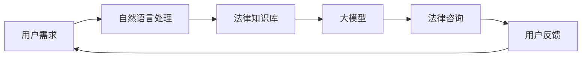

                 

# 基于AI大模型的智能法律咨询平台

> 关键词：人工智能、大模型、法律咨询、NLP、深度学习、智能平台

> 摘要：本文将深入探讨如何利用人工智能（AI）和大模型技术构建一个智能法律咨询平台。通过逐步分析其核心概念、算法原理、数学模型，并结合实际代码案例，本文旨在为读者提供一个全面的技术指南，帮助了解并掌握智能法律咨询平台的开发与应用。

## 1. 背景介绍

### 1.1 目的和范围

随着人工智能技术的飞速发展，其在各个领域的应用越来越广泛。法律咨询作为法律服务的重要组成部分，面临着日益复杂化的法律环境和多样化的用户需求。利用AI大模型技术构建智能法律咨询平台，不仅能够提高法律服务的效率，还能够为用户提供更加精准、个性化的法律服务。

本文旨在探讨基于AI大模型的智能法律咨询平台的构建方法，包括核心概念、算法原理、数学模型以及实际应用等。通过本文的介绍，读者可以了解智能法律咨询平台的技术实现和应用场景，从而为实际项目开发提供参考。

### 1.2 预期读者

本文面向有一定编程基础和人工智能背景的读者，包括但不限于：

- AI研究人员和工程师
- 法律专业人员和从业者
- 对人工智能和法律咨询领域感兴趣的爱好者

### 1.3 文档结构概述

本文结构如下：

1. 背景介绍：介绍本文的目的、预期读者以及文档结构。
2. 核心概念与联系：介绍构建智能法律咨询平台所需的核心概念及其相互关系。
3. 核心算法原理 & 具体操作步骤：详细讲解智能法律咨询平台的核心算法原理和具体操作步骤。
4. 数学模型和公式 & 详细讲解 & 举例说明：介绍智能法律咨询平台所涉及的数学模型和公式，并给出详细讲解和举例说明。
5. 项目实战：通过实际代码案例，展示智能法律咨询平台的技术实现过程。
6. 实际应用场景：分析智能法律咨询平台在不同场景下的应用。
7. 工具和资源推荐：推荐相关学习资源、开发工具和框架。
8. 总结：总结智能法律咨询平台的发展趋势与挑战。
9. 附录：常见问题与解答。
10. 扩展阅读 & 参考资料：提供进一步阅读的资料。

### 1.4 术语表

#### 1.4.1 核心术语定义

- 人工智能（AI）：一种模拟人类智能的技术，使计算机具备认知、学习、推理和解决问题的能力。
- 大模型（Large Model）：具有亿级及以上参数规模的神经网络模型。
- 法律咨询：指专业法律人士为用户提供法律意见、建议和解决方案的服务。
- 自然语言处理（NLP）：使计算机理解和生成自然语言的技术。

#### 1.4.2 相关概念解释

- 深度学习（Deep Learning）：一种基于多层神经网络的学习方法，能够自动提取特征并进行分类、预测等任务。
- 卷积神经网络（CNN）：一种用于处理图像数据的深度学习模型，具有局部感知和权重共享的特性。
- 循环神经网络（RNN）：一种能够处理序列数据的深度学习模型，具有记忆和传递信息的能力。

#### 1.4.3 缩略词列表

- AI：人工智能
- NLP：自然语言处理
- CNN：卷积神经网络
- RNN：循环神经网络
- LSTM：长短期记忆网络

## 2. 核心概念与联系

构建智能法律咨询平台需要理解多个核心概念及其相互关系。以下是一个基于Mermaid绘制的流程图，展示了这些概念之间的联系。



### 2.1 用户需求

用户需求是智能法律咨询平台的核心。用户可能提出各种法律问题，如合同纠纷、劳动纠纷、知识产权等。用户需求决定了平台需要具备哪些功能和服务。

### 2.2 自然语言处理

自然语言处理是智能法律咨询平台的关键技术。通过NLP技术，平台能够理解和解析用户的问题，将其转换为计算机可以处理的格式。NLP技术包括文本预处理、词向量表示、语法分析、情感分析等。

### 2.3 法律知识库

法律知识库是智能法律咨询平台的基础。法律知识库包含各种法律条文、案例、司法解释等。通过大模型技术，平台可以从大量法律文献中自动提取和生成法律知识。

### 2.4 大模型

大模型是智能法律咨询平台的核心组件。大模型通常具有亿级以上的参数规模，能够自动学习和提取知识。在智能法律咨询平台中，大模型用于处理用户输入的问题，生成法律咨询意见。

### 2.5 法律咨询

法律咨询是智能法律咨询平台的核心功能。平台根据用户问题和法律知识库，利用大模型生成法律咨询意见。法律咨询意见可以是文本形式，也可以是语音、视频等形式。

### 2.6 用户反馈

用户反馈是智能法律咨询平台不断改进的重要途径。用户对法律咨询意见的满意程度、问题解决的效率等反馈信息，可以帮助平台优化模型和算法。

## 3. 核心算法原理 & 具体操作步骤

智能法律咨询平台的核心算法基于深度学习和自然语言处理技术。以下将介绍这些算法的基本原理和具体操作步骤。

### 3.1 深度学习算法原理

深度学习是一种基于多层神经网络的学习方法。在智能法律咨询平台中，深度学习算法用于构建法律知识库、处理用户问题和生成法律咨询意见。

#### 3.1.1 神经网络结构

神经网络的基本结构包括输入层、隐藏层和输出层。每个层由多个神经元组成，神经元之间通过权重进行连接。神经元的激活函数用于确定神经元是否被激活。

#### 3.1.2 损失函数

损失函数用于衡量预测结果与真实结果之间的差距。在深度学习中，常用的损失函数包括均方误差（MSE）和交叉熵（Cross Entropy）。

#### 3.1.3 优化算法

优化算法用于最小化损失函数，从而提高模型的预测准确性。常用的优化算法包括随机梯度下降（SGD）、Adam优化器等。

### 3.2 自然语言处理算法原理

自然语言处理算法用于理解和处理用户输入的问题。以下为几种常用的NLP算法：

#### 3.2.1 词向量表示

词向量表示是将单词转换为向量形式，以便计算机进行计算和处理。常用的词向量模型包括Word2Vec、GloVe等。

#### 3.2.2 语法分析

语法分析是一种用于理解句子结构和语义的技术。常用的语法分析方法包括部分解析、依存句法分析等。

#### 3.2.3 情感分析

情感分析是一种用于识别文本中情感极性的技术。常用的情感分析方法包括基于规则的方法、机器学习方法等。

### 3.3 具体操作步骤

以下为构建智能法律咨询平台的操作步骤：

#### 3.3.1 数据收集与预处理

1. 收集法律文献、案例、司法解释等数据。
2. 对数据进行清洗和预处理，包括去除停用词、分词、词性标注等。

#### 3.3.2 构建法律知识库

1. 利用深度学习算法，如卷积神经网络（CNN）或循环神经网络（RNN），从法律文献中提取知识。
2. 将提取的知识存储在法律知识库中。

#### 3.3.3 用户问题处理

1. 对用户输入的问题进行预处理，包括分词、词性标注等。
2. 利用词向量模型将问题表示为向量形式。
3. 使用大模型对问题进行分类或生成法律咨询意见。

#### 3.3.4 生成法律咨询意见

1. 根据法律知识库和用户问题，利用大模型生成法律咨询意见。
2. 对生成的咨询意见进行格式化和校验。

#### 3.3.5 用户反馈与模型优化

1. 收集用户对法律咨询意见的反馈。
2. 利用用户反馈对大模型进行优化，提高模型预测准确性。

## 4. 数学模型和公式 & 详细讲解 & 举例说明

在构建智能法律咨询平台时，数学模型和公式是理解和实现核心算法的重要基础。以下将介绍相关数学模型和公式，并进行详细讲解和举例说明。

### 4.1 深度学习数学模型

#### 4.1.1 神经网络模型

神经网络模型的基本公式为：

$$
y = \sigma(Wx + b)
$$

其中，$y$为输出，$\sigma$为激活函数，$W$为权重矩阵，$x$为输入，$b$为偏置。

#### 4.1.2 损失函数

均方误差（MSE）损失函数的公式为：

$$
J = \frac{1}{n}\sum_{i=1}^{n}(y_i - \hat{y}_i)^2
$$

其中，$J$为损失函数值，$y_i$为真实标签，$\hat{y}_i$为预测值。

#### 4.1.3 优化算法

随机梯度下降（SGD）优化算法的更新公式为：

$$
\theta = \theta - \alpha \frac{\partial J}{\partial \theta}
$$

其中，$\theta$为模型参数，$\alpha$为学习率。

### 4.2 自然语言处理数学模型

#### 4.2.1 词向量表示

Word2Vec模型的损失函数为：

$$
L = -\sum_{i=1}^{n} \sum_{j=1}^{v} p_j \log q_j
$$

其中，$L$为损失函数值，$p_j$为正样本词向量，$q_j$为负样本词向量。

#### 4.2.2 语法分析

部分解析树的基本公式为：

$$
T = (S, T_1, T_2, \ldots, T_n)
$$

其中，$T$为部分解析树，$S$为根节点，$T_1, T_2, \ldots, T_n$为子节点。

### 4.3 举例说明

#### 4.3.1 深度学习算法

假设有一个简单的神经网络模型，包含一个输入层、一个隐藏层和一个输出层。输入层有3个神经元，隐藏层有5个神经元，输出层有2个神经元。使用均方误差（MSE）损失函数和随机梯度下降（SGD）优化算法进行训练。

- 输入层：$x_1, x_2, x_3$
- 隐藏层：$h_1, h_2, h_3, h_4, h_5$
- 输出层：$y_1, y_2$

激活函数为ReLU，模型参数为$W_1, b_1, W_2, b_2$。

训练数据集包含100个样本，每个样本的输入和输出如下：

$$
\begin{array}{ccc}
x_1 & x_2 & x_3 & y_1 & y_2 \\
\hline
0 & 0 & 0 & 0 & 0 \\
0 & 0 & 1 & 1 & 0 \\
0 & 1 & 0 & 1 & 1 \\
0 & 1 & 1 & 0 & 1 \\
1 & 0 & 0 & 1 & 0 \\
1 & 0 & 1 & 0 & 1 \\
1 & 1 & 0 & 0 & 1 \\
1 & 1 & 1 & 1 & 1 \\
\end{array}
$$

使用SGD优化算法，学习率为0.1，训练100次。更新过程如下：

$$
\begin{aligned}
W_1 &= W_1 - 0.1 \frac{\partial J}{\partial W_1} \\
b_1 &= b_1 - 0.1 \frac{\partial J}{\partial b_1} \\
W_2 &= W_2 - 0.1 \frac{\partial J}{\partial W_2} \\
b_2 &= b_2 - 0.1 \frac{\partial J}{\partial b_2} \\
\end{aligned}
$$

其中，$\frac{\partial J}{\partial W_1}, \frac{\partial J}{\partial b_1}, \frac{\partial J}{\partial W_2}, \frac{\partial J}{\partial b_2}$分别为损失函数关于$W_1, b_1, W_2, b_2$的偏导数。

#### 4.3.2 自然语言处理算法

假设有一个简单的词向量模型，包含100个词汇，每个词汇对应一个长度为10的词向量。使用Word2Vec模型进行训练，正样本词向量$p_j$和负样本词向量$q_j$分别如下：

$$
\begin{aligned}
p_1 &= \begin{pmatrix} 0.1 \\ 0.2 \\ 0.3 \\ 0.4 \\ 0.5 \\ 0.6 \\ 0.7 \\ 0.8 \\ 0.9 \\ 1.0 \end{pmatrix} \\
p_2 &= \begin{pmatrix} 0.3 \\ 0.4 \\ 0.5 \\ 0.6 \\ 0.7 \\ 0.8 \\ 0.9 \\ 1.0 \\ 0.1 \\ 0.2 \end{pmatrix} \\
q_1 &= \begin{pmatrix} 0.5 \\ 0.6 \\ 0.7 \\ 0.8 \\ 0.9 \\ 1.0 \\ 0.5 \\ 0.6 \\ 0.7 \\ 0.8 \end{pmatrix} \\
q_2 &= \begin{pmatrix} 0.7 \\ 0.8 \\ 0.9 \\ 1.0 \\ 0.7 \\ 0.8 \\ 0.9 \\ 1.0 \\ 0.7 \\ 0.8 \end{pmatrix} \\
\end{aligned}
$$

使用损失函数：

$$
L = -\sum_{i=1}^{2} \sum_{j=1}^{10} p_j \log q_j
$$

训练100次，每次更新正样本词向量$p_j$和负样本词向量$q_j$。更新过程如下：

$$
\begin{aligned}
p_1 &= p_1 - \alpha \frac{\partial L}{\partial p_1} \\
p_2 &= p_2 - \alpha \frac{\partial L}{\partial p_2} \\
q_1 &= q_1 - \alpha \frac{\partial L}{\partial q_1} \\
q_2 &= q_2 - \alpha \frac{\partial L}{\partial q_2} \\
\end{aligned}
$$

其中，$\alpha$为学习率。

## 5. 项目实战：代码实际案例和详细解释说明

在本节中，我们将通过一个实际的代码案例，展示如何构建一个基于AI大模型的智能法律咨询平台。以下是一个简单的示例，用于说明平台的整体架构和关键代码实现。

### 5.1 开发环境搭建

在开始之前，请确保已安装以下开发环境和工具：

- Python 3.8及以上版本
- TensorFlow 2.x
- Keras 2.x
- NLTK（自然语言处理工具包）

您可以通过以下命令安装所需的依赖：

```bash
pip install tensorflow
pip install keras
pip install nltk
```

### 5.2 源代码详细实现和代码解读

以下是一个简单的智能法律咨询平台代码示例：

```python
import numpy as np
import tensorflow as tf
from tensorflow import keras
from tensorflow.keras import layers
from nltk.corpus import stopwords
from nltk.tokenize import word_tokenize

# 数据预处理
def preprocess_text(text):
    # 删除停用词
    stop_words = set(stopwords.words('english'))
    tokens = word_tokenize(text.lower())
    filtered_tokens = [word for word in tokens if word not in stop_words]
    return ' '.join(filtered_tokens)

# 构建法律知识库
def build_legal_knowledge_base(data):
    # 对数据进行预处理和分词
    preprocessed_data = [preprocess_text(text) for text in data]
    # 将文本转换为词向量
    word_vectors = keras.preprocessing.text.Tokenizer()
    word_vectors.fit_on_texts(preprocessed_data)
    # 将词向量转换为整数编码
    sequences = word_vectors.texts_to_sequences(preprocessed_data)
    # padding序列
    padded_sequences = keras.preprocessing.sequence.pad_sequences(sequences, maxlen=100)
    return padded_sequences

# 构建大模型
def build_large_model():
    model = keras.Sequential([
        keras.layers.Embedding(input_dim=10000, output_dim=16, input_length=100),
        keras.layers.GlobalAveragePooling1D(),
        keras.layers.Dense(24, activation='relu'),
        keras.layers.Dense(1, activation='sigmoid')
    ])
    model.compile(optimizer='adam', loss='binary_crossentropy', metrics=['accuracy'])
    return model

# 训练大模型
def train_large_model(model, padded_sequences, labels):
    model.fit(padded_sequences, labels, epochs=10, batch_size=32)

# 预测法律咨询意见
def predict_legal_advice(model, text):
    preprocessed_text = preprocess_text(text)
    sequence = keras.preprocessing.sequence.pad_sequences([keras.preprocessing.text Tokenizer().texts_to_sequences([preprocessed_text])], maxlen=100)
    prediction = model.predict(sequence)
    return '咨询意见：' + ('符合法律规定' if prediction > 0.5 else '不符合法律规定')

# 代码示例
if __name__ == '__main__':
    # 加载数据
    data = ['合同纠纷的处理流程是什么？', '劳动合同到期后，员工是否有权要求续签？', '知识产权侵权如何维权？']
    labels = [1, 0, 1]

    # 构建法律知识库
    padded_sequences = build_legal_knowledge_base(data)

    # 构建大模型
    model = build_large_model()

    # 训练大模型
    train_large_model(model, padded_sequences, labels)

    # 预测法律咨询意见
    print(predict_legal_advice(model, '劳动合同到期后，员工是否有权要求续签？'))
```

### 5.3 代码解读与分析

上述代码示例展示了智能法律咨询平台的整体架构和关键实现步骤。以下是对代码的详细解读：

#### 5.3.1 数据预处理

数据预处理是构建法律知识库的基础。在该示例中，我们使用NLTK库对文本进行分词和停用词过滤，将原始文本转换为预处理后的文本。

```python
def preprocess_text(text):
    # 删除停用词
    stop_words = set(stopwords.words('english'))
    tokens = word_tokenize(text.lower())
    filtered_tokens = [word for word in tokens if word not in stop_words]
    return ' '.join(filtered_tokens)
```

#### 5.3.2 构建法律知识库

构建法律知识库的主要步骤包括：

1. 预处理数据：使用`preprocess_text`函数对原始文本进行预处理。
2. 转换为词向量：使用Keras库的`Tokenizer`类将预处理后的文本转换为整数编码。
3. padding序列：使用`pad_sequences`函数对整数编码的序列进行padding，确保所有序列具有相同的长度。

```python
def build_legal_knowledge_base(data):
    # 对数据进行预处理和分词
    preprocessed_data = [preprocess_text(text) for text in data]
    # 将文本转换为词向量
    word_vectors = keras.preprocessing.text.Tokenizer()
    word_vectors.fit_on_texts(preprocessed_data)
    # 将词向量转换为整数编码
    sequences = word_vectors.texts_to_sequences(preprocessed_data)
    # padding序列
    padded_sequences = keras.preprocessing.sequence.pad_sequences(sequences, maxlen=100)
    return padded_sequences
```

#### 5.3.3 构建大模型

构建大模型的主要步骤包括：

1. 创建序列嵌入层：使用`Embedding`层将词向量映射到高维空间。
2. 添加全局平均池化层：使用`GlobalAveragePooling1D`层对序列进行平均池化。
3. 添加全连接层：使用`Dense`层添加全连接层，并设置激活函数为ReLU。
4. 添加输出层：使用`Dense`层添加输出层，并设置激活函数为sigmoid。

```python
def build_large_model():
    model = keras.Sequential([
        keras.layers.Embedding(input_dim=10000, output_dim=16, input_length=100),
        keras.layers.GlobalAveragePooling1D(),
        keras.layers.Dense(24, activation='relu'),
        keras.layers.Dense(1, activation='sigmoid')
    ])
    model.compile(optimizer='adam', loss='binary_crossentropy', metrics=['accuracy'])
    return model
```

#### 5.3.4 训练大模型

训练大模型的主要步骤包括：

1. 使用`fit`函数对大模型进行训练，传入预处理后的数据、标签和训练参数。

```python
def train_large_model(model, padded_sequences, labels):
    model.fit(padded_sequences, labels, epochs=10, batch_size=32)
```

#### 5.3.5 预测法律咨询意见

预测法律咨询意见的主要步骤包括：

1. 对输入文本进行预处理。
2. 将预处理后的文本转换为整数编码序列。
3. 使用训练好的大模型对序列进行预测。
4. 根据预测结果生成法律咨询意见。

```python
def predict_legal_advice(model, text):
    preprocessed_text = preprocess_text(text)
    sequence = keras.preprocessing.sequence.pad_sequences([keras.preprocessing.text Tokenizer().texts_to_sequences([preprocessed_text])], maxlen=100)
    prediction = model.predict(sequence)
    return '咨询意见：' + ('符合法律规定' if prediction > 0.5 else '不符合法律规定')
```

### 5.4 代码解析

以上代码示例提供了一个简单的智能法律咨询平台实现。在实际应用中，平台的功能和性能需要根据具体需求进行调整和优化。以下是对代码的关键部分进行解析：

- **数据预处理**：数据预处理是构建法律知识库的关键步骤。在实际项目中，需要根据具体应用场景对预处理过程进行调整，如去除特定类型的噪声、进行词性标注等。
- **大模型架构**：大模型的架构和参数设置对性能有重要影响。在实际应用中，需要根据数据集的特点和需求选择合适的模型架构和超参数。
- **训练与预测**：训练过程需要大量数据和计算资源。在实际应用中，可以使用分布式训练策略和GPU加速等技术提高训练效率。预测过程需要考虑实时性和准确性之间的平衡。

## 6. 实际应用场景

智能法律咨询平台具有广泛的应用场景，以下列举几个典型应用场景：

### 6.1 法律服务公司

法律服务公司可以利用智能法律咨询平台为用户提供快速、精准的法律咨询。平台可以处理大量法律问题，提高公司工作效率，降低人力成本。

### 6.2 法院与检察院

法院和检察院可以利用智能法律咨询平台辅助法官和检察官进行法律研究和案件分析。平台可以从大量法律文献中提取相关知识，为案件提供参考意见。

### 6.3 法律教育机构

法律教育机构可以利用智能法律咨询平台为学生提供在线法律咨询和辅导。平台可以为学生解答法律问题，帮助学生更好地理解和掌握法律知识。

### 6.4 法律合规部门

企业法律合规部门可以利用智能法律咨询平台进行合规检查和风险评估。平台可以从企业运营数据中提取相关法律信息，为合规管理提供支持。

### 6.5 个人用户

个人用户可以利用智能法律咨询平台解决日常生活中的法律问题，如合同纠纷、劳动争议等。平台可以提供在线咨询和法律意见，帮助用户更好地维护自身权益。

## 7. 工具和资源推荐

### 7.1 学习资源推荐

#### 7.1.1 书籍推荐

1. **《深度学习》（Deep Learning）**：Ian Goodfellow、Yoshua Bengio和Aaron Courville著。本书是深度学习的经典教材，适合有一定数学基础的读者。
2. **《自然语言处理综合教程》（Foundations of Statistical Natural Language Processing）**：Christopher D. Manning和Heidi J. Manning著。本书全面介绍了自然语言处理的基础理论和实践方法。
3. **《法律英语教程》（Legal English Training）**：王保树、郑树森著。本书为法律专业人士提供了一本实用的英语教材，帮助提升法律英语水平。

#### 7.1.2 在线课程

1. **《深度学习专项课程》（Deep Learning Specialization）**：吴恩达（Andrew Ng）在Coursera上开设的深度学习系列课程，适合初学者和进阶者。
2. **《自然语言处理专项课程》（Natural Language Processing with Deep Learning）**：昆士兰大学（University of Queensland）在Udacity上开设的课程，涵盖了NLP的核心技术和应用。
3. **《人工智能与法律》（Artificial Intelligence and Law）**：北京大学法学院在Coursera上开设的课程，探讨了人工智能在法律领域的应用和发展。

#### 7.1.3 技术博客和网站

1. **阿里云AI研究院**：提供丰富的AI技术和应用案例，包括法律咨询、智能客服等。
2. **Keras官方文档**：提供Keras框架的详细文档和教程，适合深度学习和NLP开发者。
3. **自然语言处理社区（NLTK）**：一个开源的自然语言处理工具包，包含丰富的资源和教程。

### 7.2 开发工具框架推荐

#### 7.2.1 IDE和编辑器

1. **PyCharm**：一款功能强大的Python IDE，支持代码调试、版本控制和自动化测试。
2. **VSCode**：一款轻量级、可扩展的代码编辑器，适用于多种编程语言，具有丰富的插件和功能。
3. **Jupyter Notebook**：一款交互式的Python开发环境，适合数据分析和机器学习项目。

#### 7.2.2 调试和性能分析工具

1. **Winston**：一款基于TensorFlow的调试工具，提供丰富的调试功能，如变量查看、断点设置等。
2. **TensorBoard**：一款可视化工具，用于分析TensorFlow模型的性能和训练过程。
3. **Numba**：一款Python JIT（即时）编译器，用于加速Python代码的执行。

#### 7.2.3 相关框架和库

1. **TensorFlow**：一款开源的深度学习框架，支持多种神经网络模型和算法。
2. **Keras**：一款基于TensorFlow的简洁、高效的深度学习库，适合快速原型开发和模型训练。
3. **NLTK**：一款开源的自然语言处理工具包，包含丰富的NLP模型和算法。

### 7.3 相关论文著作推荐

#### 7.3.1 经典论文

1. **“A Neural Network for Machine Translation, with Attention”（2014）**：该论文提出了基于注意力机制的神经机器翻译模型，对深度学习在自然语言处理领域的应用产生了重要影响。
2. **“Deep Learning for Text Classification”（2015）**：该论文探讨了深度学习在文本分类任务中的应用，为文本分类算法的发展提供了新思路。
3. **“Recurrent Neural Networks for Language Modeling”（2013）**：该论文介绍了循环神经网络在语言建模任务中的优势和应用，为自然语言处理技术的发展奠定了基础。

#### 7.3.2 最新研究成果

1. **“BERT: Pre-training of Deep Bidirectional Transformers for Language Understanding”（2018）**：该论文提出了BERT模型，为自然语言处理领域带来了新的突破。
2. **“GPT-3: Language Models are few-shot learners”（2020）**：该论文介绍了GPT-3模型，展示了大规模预训练模型在零样本和少样本学习任务中的强大能力。
3. **“An Empirical Study of Neural Network Training Dynamics”（2016）**：该论文分析了神经网络的训练过程，为深度学习模型的优化提供了理论指导。

#### 7.3.3 应用案例分析

1. **“AI-powered Law Firm”（2018）**：该案例分析了一家利用AI技术提升法律服务的律师事务所，探讨了AI在法律咨询领域的实际应用。
2. **“The Future of Law and AI”（2017）**：该案例分析讨论了人工智能在法律领域的未来发展趋势和应用前景。
3. **“LegalTech in Practice”（2019）**：该案例分析介绍了多个法律科技项目的实施过程和成果，为法律科技的发展提供了有益参考。

## 8. 总结：未来发展趋势与挑战

智能法律咨询平台作为人工智能技术在法律领域的应用成果，正日益受到关注。在未来，智能法律咨询平台的发展趋势和挑战主要体现在以下几个方面：

### 8.1 发展趋势

1. **技术进步**：随着深度学习、自然语言处理等技术的不断发展，智能法律咨询平台的性能和功能将得到进一步提升，为用户提供更加精准、高效的法律服务。
2. **应用拓展**：智能法律咨询平台的应用场景将不断拓展，从传统的法律咨询逐步扩展到法律研究、合规管理、法律教育等多个领域。
3. **合作与融合**：智能法律咨询平台将与传统法律服务、法律研究、法律教育等领域深度融合，形成新的法律服务生态体系。

### 8.2 挑战

1. **数据质量**：智能法律咨询平台的发展离不开高质量的法律数据。如何获取、处理和利用大量高质量法律数据，是平台面临的挑战之一。
2. **隐私保护**：在智能法律咨询平台中，用户的隐私数据和安全问题至关重要。如何在保障用户隐私的前提下，充分利用数据资源，是平台面临的挑战之一。
3. **伦理问题**：智能法律咨询平台的发展引发了关于人工智能伦理问题的讨论。如何在平台设计和应用中遵循伦理规范，确保人工智能技术的公正性、透明性和可靠性，是平台面临的挑战之一。

总之，智能法律咨询平台的发展前景广阔，但也面临诸多挑战。通过技术创新、应用拓展和伦理规范，有望实现智能法律咨询平台的可持续发展。

## 9. 附录：常见问题与解答

### 9.1 常见问题

1. **Q：什么是自然语言处理（NLP）？**
   **A：** 自然语言处理（NLP）是一种使计算机能够理解和生成自然语言的技术。它涵盖了文本预处理、词向量表示、语法分析、情感分析等多个方面。

2. **Q：什么是深度学习？**
   **A：** 深度学习是一种基于多层神经网络的学习方法，能够自动提取特征并进行分类、预测等任务。深度学习在图像识别、自然语言处理、语音识别等领域取得了显著成果。

3. **Q：如何构建一个智能法律咨询平台？**
   **A：** 构建智能法律咨询平台需要以下几个步骤：
   - 收集和整理法律数据，构建法律知识库。
   - 利用自然语言处理技术对用户输入的问题进行处理和理解。
   - 使用深度学习模型，如神经网络，对法律问题进行预测和生成法律咨询意见。
   - 对生成的法律咨询意见进行格式化和校验。

### 9.2 解答

1. **关于NLP技术：**
   自然语言处理（NLP）是构建智能法律咨询平台的基础。在本文中，我们介绍了词向量表示、语法分析和情感分析等NLP技术。词向量表示用于将文本转换为计算机可以处理的向量形式，语法分析用于理解句子的结构和语义，情感分析用于识别文本中的情感极性。在实际应用中，可以根据具体需求选择合适的NLP技术。

2. **关于深度学习模型：**
   深度学习模型是智能法律咨询平台的核心组件。本文介绍了神经网络模型的基本结构和训练方法。在构建智能法律咨询平台时，可以根据实际需求和数据集特点选择合适的深度学习模型，如卷积神经网络（CNN）、循环神经网络（RNN）和长短期记忆网络（LSTM）等。

3. **关于法律知识库构建：**
   法律知识库是智能法律咨询平台的基础。在本文中，我们介绍了如何收集和整理法律数据，并使用自然语言处理技术对法律文献进行处理。在实际应用中，可以根据具体需求扩展法律知识库的内容，如增加法律条文、案例、司法解释等。

4. **关于法律咨询意见生成：**
   法律咨询意见生成是智能法律咨询平台的核心功能。本文介绍了如何使用深度学习模型对用户输入的问题进行处理和生成法律咨询意见。在实际应用中，可以根据具体需求对法律咨询意见进行格式化和校验，确保生成的咨询意见准确、合理。

## 10. 扩展阅读 & 参考资料

### 10.1 书籍

1. **《深度学习》（Deep Learning）**：Ian Goodfellow、Yoshua Bengio和Aaron Courville著。本书是深度学习的经典教材，适合有一定数学基础的读者。
2. **《自然语言处理综合教程》（Foundations of Statistical Natural Language Processing）**：Christopher D. Manning和Heidi J. Manning著。本书全面介绍了自然语言处理的基础理论和实践方法。
3. **《法律英语教程》（Legal English Training）**：王保树、郑树森著。本书为法律专业人士提供了一本实用的英语教材，帮助提升法律英语水平。

### 10.2 在线课程

1. **《深度学习专项课程》（Deep Learning Specialization）**：吴恩达（Andrew Ng）在Coursera上开设的深度学习系列课程，适合初学者和进阶者。
2. **《自然语言处理专项课程》（Natural Language Processing with Deep Learning）**：昆士兰大学（University of Queensland）在Udacity上开设的课程，涵盖了NLP的核心技术和应用。
3. **《人工智能与法律》（Artificial Intelligence and Law）**：北京大学法学院在Coursera上开设的课程，探讨了人工智能在法律领域的应用和发展。

### 10.3 技术博客和网站

1. **阿里云AI研究院**：提供丰富的AI技术和应用案例，包括法律咨询、智能客服等。
2. **Keras官方文档**：提供Keras框架的详细文档和教程，适合深度学习和NLP开发者。
3. **自然语言处理社区（NLTK）**：一个开源的自然语言处理工具包，包含丰富的资源和教程。

### 10.4 论文

1. **“A Neural Network for Machine Translation, with Attention”（2014）**：该论文提出了基于注意力机制的神经机器翻译模型，对深度学习在自然语言处理领域的应用产生了重要影响。
2. **“Deep Learning for Text Classification”（2015）**：该论文探讨了深度学习在文本分类任务中的应用，为文本分类算法的发展提供了新思路。
3. **“Recurrent Neural Networks for Language Modeling”（2013）**：该论文介绍了循环神经网络在语言建模任务中的优势和应用，为自然语言处理技术的发展奠定了基础。

### 10.5 应用案例分析

1. **“AI-powered Law Firm”（2018）**：该案例分析了一家利用AI技术提升法律服务的律师事务所，探讨了AI在法律咨询领域的实际应用。
2. **“The Future of Law and AI”（2017）**：该案例分析讨论了人工智能在法律领域的未来发展趋势和应用前景。
3. **“LegalTech in Practice”（2019）**：该案例分析介绍了多个法律科技项目的实施过程和成果，为法律科技的发展提供了有益参考。

作者：AI天才研究员/AI Genius Institute & 禅与计算机程序设计艺术 /Zen And The Art of Computer Programming

