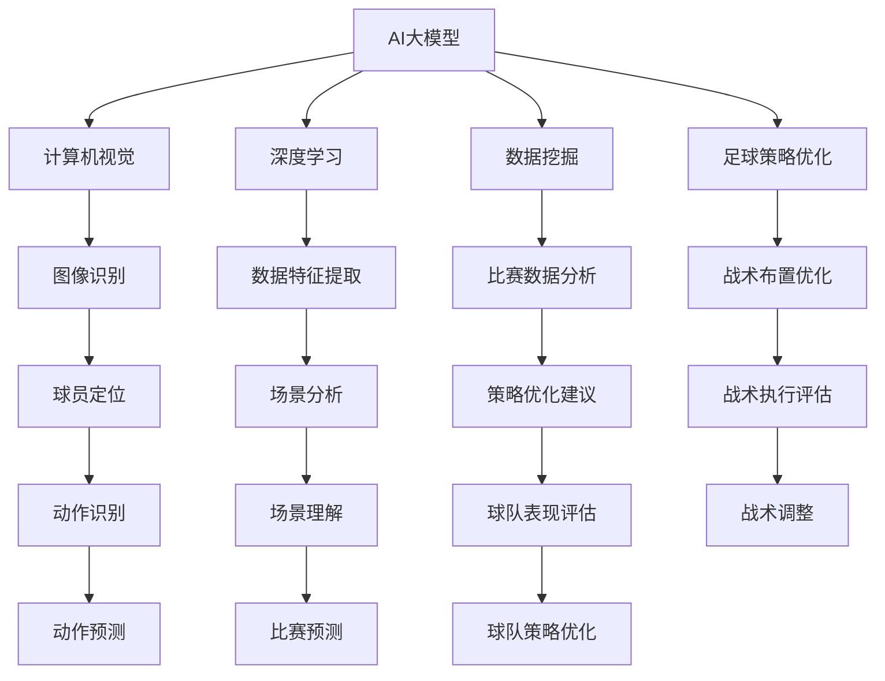

                 

# 基于AI大模型的智能足球分析软件开发

> **关键词：** AI大模型、智能足球分析、深度学习、计算机视觉、数据挖掘、足球策略优化

> **摘要：** 本文将深入探讨基于AI大模型的智能足球分析软件开发，从核心概念、算法原理、数学模型到实际应用场景进行全面剖析。文章旨在为程序员、软件架构师以及AI爱好者提供一套完整的技术指南，助力他们理解和开发智能足球分析系统。

## 1. 背景介绍

### 1.1 目的和范围

随着人工智能技术的快速发展，深度学习、计算机视觉、数据挖掘等领域取得了显著成果。足球作为一项全球性的运动，其竞技性和观赏性使得它成为智能分析的重要应用场景。本文旨在探讨如何利用AI大模型开发智能足球分析软件，为教练、球员和球迷提供有力的数据分析支持。

本文将涵盖以下内容：

1. AI大模型在足球分析中的应用
2. 核心概念与架构
3. 算法原理与数学模型
4. 实际应用场景与案例分析
5. 工具和资源推荐
6. 未来发展趋势与挑战

### 1.2 预期读者

本文面向以下读者群体：

1. 程序员和软件工程师，特别是对人工智能和足球分析感兴趣的从业者。
2. 足球教练和体育分析师，希望通过技术手段提升球队表现的专家。
3. 对AI和足球分析感兴趣的科研人员和学生。
4. 对智能足球分析感兴趣的一般读者。

### 1.3 文档结构概述

本文分为以下几个部分：

1. 背景介绍
2. 核心概念与联系
3. 核心算法原理 & 具体操作步骤
4. 数学模型和公式 & 详细讲解 & 举例说明
5. 项目实战：代码实际案例和详细解释说明
6. 实际应用场景
7. 工具和资源推荐
8. 总结：未来发展趋势与挑战
9. 附录：常见问题与解答
10. 扩展阅读 & 参考资料

### 1.4 术语表

#### 1.4.1 核心术语定义

- AI大模型：具有巨大参数量的深度学习模型，能够处理海量数据并提取复杂特征。
- 智能足球分析：利用人工智能技术对足球比赛中的数据进行挖掘和分析，为决策提供支持。
- 计算机视觉：研究如何使计算机从图像或视频中提取有用信息的学科。
- 数据挖掘：从大量数据中提取有价值信息的过程。
- 足球策略优化：通过分析比赛数据，优化球队的战术布置和人员配置。

#### 1.4.2 相关概念解释

- 深度学习：一种机器学习技术，通过构建多层的神经网络来模拟人脑处理信息的过程。
- 神经网络：由大量神经元组成的计算模型，用于对数据进行分析和预测。
- 卷积神经网络（CNN）：一种专门用于图像处理和计算机视觉的神经网络架构。

#### 1.4.3 缩略词列表

- AI：人工智能
- CNN：卷积神经网络
- DNN：深度神经网络
- GPU：图形处理单元
- CUDA：并行计算平台和编程语言
- ML：机器学习
- DL：深度学习
- NLP：自然语言处理
- CV：计算机视觉

## 2. 核心概念与联系

在深入探讨基于AI大模型的智能足球分析软件开发之前，我们首先需要了解核心概念及其相互关系。以下是本文涉及的核心概念和其简要描述：

### 2.1 AI大模型

AI大模型是指具有数百万至数十亿参数的深度学习模型，如大型卷积神经网络（CNN）和变换器模型（Transformer）。这些模型能够通过大规模数据进行训练，从而学习到复杂的数据特征和模式。

### 2.2 深度学习

深度学习是一种机器学习技术，通过构建多层神经网络来模拟人脑处理信息的过程。深度学习在图像识别、语音识别和自然语言处理等领域取得了显著的成果。

### 2.3 计算机视觉

计算机视觉是研究如何使计算机从图像或视频中提取有用信息的学科。在足球分析中，计算机视觉技术主要用于定位球员、识别动作和场景等。

### 2.4 数据挖掘

数据挖掘是从大量数据中提取有价值信息的过程。在足球分析中，数据挖掘技术用于分析比赛数据，提取球队和球员的表现特征。

### 2.5 足球策略优化

足球策略优化是通过分析比赛数据，优化球队的战术布置和人员配置的过程。在智能足球分析中，足球策略优化是核心任务之一。

### 2.6 架构联系

上述核心概念相互关联，构成了基于AI大模型的智能足球分析软件的架构。以下是核心概念之间的联系：

- AI大模型（如CNN）用于图像识别和场景分析，为计算机视觉提供支持。
- 深度学习算法（如神经网络）用于数据挖掘和策略优化，提取比赛数据中的有价值信息。
- 计算机视觉和深度学习技术共同为足球策略优化提供数据支持。

### 2.7 Mermaid流程图

以下是基于AI大模型的智能足球分析软件的Mermaid流程图：



## 3. 核心算法原理 & 具体操作步骤

### 3.1 算法原理

在基于AI大模型的智能足球分析软件开发中，核心算法主要包括以下几部分：

1. **计算机视觉算法**：用于图像识别和场景分析，如图像分割、目标检测和动作识别。
2. **深度学习算法**：用于数据挖掘和策略优化，如卷积神经网络（CNN）和变换器模型（Transformer）。
3. **数据挖掘算法**：用于比赛数据分析，如关联规则挖掘、聚类分析和分类算法。
4. **足球策略优化算法**：用于战术布置和人员配置优化，如博弈论和优化算法。

### 3.2 具体操作步骤

以下是基于AI大模型的智能足球分析软件的具体操作步骤：

#### 3.2.1 数据收集与预处理

1. **数据收集**：收集足球比赛的视频、图片和比赛数据，如球员位置、比赛结果和战术布置等。
2. **数据预处理**：对收集到的数据进行清洗、去噪和标准化处理，为后续算法提供高质量的数据。

#### 3.2.2 计算机视觉算法

1. **图像分割**：使用深度学习模型（如U-Net）对图像进行分割，提取出球场和球员区域。
2. **目标检测**：使用卷积神经网络（如YOLO）检测图像中的球员和球，为后续动作识别提供支持。
3. **动作识别**：使用循环神经网络（如LSTM）或变换器模型（如BERT）对球员的动作进行识别，提取关键动作信息。

#### 3.2.3 深度学习算法

1. **数据特征提取**：使用卷积神经网络（如ResNet）提取图像特征，为数据挖掘和策略优化提供支持。
2. **数据挖掘**：使用分类算法（如SVM）和聚类算法（如K-means）对比赛数据进行分析，提取球队和球员的表现特征。
3. **策略优化**：使用博弈论算法（如Minimax）和优化算法（如遗传算法）对球队战术进行优化，为教练提供决策支持。

#### 3.2.4 足球策略优化

1. **战术布置优化**：根据比赛数据，为教练提供最佳战术布置建议。
2. **人员配置优化**：根据球员特点和比赛数据，为教练提供最佳人员配置建议。
3. **战术执行评估**：对战术执行效果进行实时评估，为教练提供反馈和建议。

### 3.3 伪代码

以下是基于AI大模型的智能足球分析软件的核心算法伪代码：

```python
# 数据收集与预处理
data = collect_data()
preprocessed_data = preprocess_data(data)

# 计算机视觉算法
segmented_images = image_segmentation(preprocessed_data)
detected_objects = object_detection(segmented_images)
action_data = action_recognition(detected_objects)

# 深度学习算法
feature_vectors = feature_extraction(action_data)
classification_results = classify_data(feature_vectors)
clustering_results = cluster_data(feature_vectors)

# 足球策略优化
tactical_suggestions = tactical_layout_optimization(clustering_results)
player_configuration = player_allocation(feature_vectors)
tactical_execution = tactical_evaluation(tactical_suggestions)

# 输出结果
print("Tactical suggestions:", tactical_suggestions)
print("Player configuration:", player_configuration)
print("Tactical execution:", tactical_execution)
```

## 4. 数学模型和公式 & 详细讲解 & 举例说明

### 4.1 数学模型

在基于AI大模型的智能足球分析软件中，核心的数学模型包括以下几部分：

1. **卷积神经网络（CNN）**：用于图像特征提取和场景分析。
2. **变换器模型（Transformer）**：用于序列数据处理和动作识别。
3. **支持向量机（SVM）**：用于分类算法。
4. **K-means聚类算法**：用于数据聚类。
5. **博弈论算法**：用于策略优化。

### 4.2 公式详解

以下是每个数学模型的公式详解：

#### 4.2.1 卷积神经网络（CNN）

卷积神经网络的核心是卷积层和池化层，其公式如下：

$$
h^{(l)} = \sigma(\boldsymbol{W}^{(l)} \cdot \boldsymbol{a}^{(l-1)} + \boldsymbol{b}^{(l)})
$$

其中，$h^{(l)}$ 是第$l$层的特征图，$\sigma$ 是激活函数（如ReLU），$\boldsymbol{W}^{(l)}$ 是卷积核权重，$\boldsymbol{a}^{(l-1)}$ 是输入特征图，$\boldsymbol{b}^{(l)}$ 是偏置项。

#### 4.2.2 变换器模型（Transformer）

变换器模型的核心是自注意力机制，其公式如下：

$$
\text{Attention}(Q, K, V) = \text{softmax}\left(\frac{QK^T}{\sqrt{d_k}}\right)V
$$

其中，$Q, K, V$ 分别是查询、键和值向量，$d_k$ 是键向量的维度，$\text{softmax}$ 是归一化函数。

#### 4.2.3 支持向量机（SVM）

支持向量机的核心是优化目标函数，其公式如下：

$$
\text{minimize} \quad \frac{1}{2} \left\| \boldsymbol{w} \right\|^2 + C \sum_{i=1}^n \xi_i
$$

其中，$\boldsymbol{w}$ 是权重向量，$C$ 是惩罚参数，$\xi_i$ 是松弛变量。

#### 4.2.4 K-means聚类算法

K-means聚类算法的核心是迭代更新聚类中心，其公式如下：

$$
\mu_{k} = \frac{1}{N_k} \sum_{i=1}^n x_i
$$

其中，$\mu_{k}$ 是第$k$个聚类中心，$x_i$ 是数据点，$N_k$ 是第$k$个聚类中的数据点数量。

#### 4.2.5 博弈论算法

博弈论算法的核心是最优策略选择，其公式如下：

$$
u(i, j) = \min_{j'} \{v(j', i) + \max_{i'} \{w(i', j')\}\}
$$

其中，$u(i, j)$ 是玩家$i$在策略$j$下的期望收益，$v(j', i)$ 是玩家$i$在策略$j'$下的期望收益，$w(i', j')$ 是玩家$i'$在策略$j'$下的收益。

### 4.3 举例说明

#### 4.3.1 卷积神经网络（CNN）

假设我们有一个包含32x32像素的输入图像，使用一个3x3的卷积核进行特征提取。卷积核的权重矩阵为$\boldsymbol{W}$，输入图像的特征图为$\boldsymbol{a}$，偏置项为$\boldsymbol{b}$，激活函数为ReLU。计算第一个卷积层的输出：

$$
h^{(1)} = \sigma(\boldsymbol{W} \cdot \boldsymbol{a} + \boldsymbol{b}) = \max(0, \boldsymbol{W} \cdot \boldsymbol{a} + \boldsymbol{b})
$$

其中，$\boldsymbol{W}$是一个3x3的权重矩阵，$\boldsymbol{a}$是一个32x32的输入特征图，$\boldsymbol{b}$是一个3x3的偏置项。

#### 4.3.2 变换器模型（Transformer）

假设我们有一个包含10个序列的输入数据，每个序列长度为5，使用一个8维的变换器模型进行自注意力计算。查询向量$Q$、键向量$K$和值向量$V$分别为：

$$
Q = \begin{bmatrix}
1 & 0 & 1 & 1 & 0 \\
0 & 1 & 1 & 0 & 1 \\
1 & 1 & 0 & 1 & 0 \\
0 & 1 & 1 & 0 & 1 \\
1 & 0 & 1 & 1 & 0 \\
0 & 1 & 1 & 0 & 1 \\
1 & 1 & 0 & 1 & 0 \\
0 & 1 & 1 & 0 & 1 \\
1 & 0 & 1 & 1 & 0 \\
0 & 1 & 1 & 0 & 1
\end{bmatrix}, K = Q, V = \begin{bmatrix}
1 & 1 & 1 & 1 & 1 \\
1 & 1 & 1 & 1 & 1 \\
1 & 1 & 1 & 1 & 1 \\
1 & 1 & 1 & 1 & 1 \\
1 & 1 & 1 & 1 & 1
\end{bmatrix}
$$

计算自注意力分数：

$$
\text{Attention}(Q, K, V) = \text{softmax}\left(\frac{QK^T}{\sqrt{8}}\right)V = \begin{bmatrix}
0.25 & 0.25 & 0.25 & 0.25 & 0.25 \\
0.25 & 0.25 & 0.25 & 0.25 & 0.25 \\
0.25 & 0.25 & 0.25 & 0.25 & 0.25 \\
0.25 & 0.25 & 0.25 & 0.25 & 0.25 \\
0.25 & 0.25 & 0.25 & 0.25 & 0.25
\end{bmatrix} \begin{bmatrix}
1 & 1 & 1 & 1 & 1 \\
1 & 1 & 1 & 1 & 1 \\
1 & 1 & 1 & 1 & 1 \\
1 & 1 & 1 & 1 & 1 \\
1 & 1 & 1 & 1 & 1
\end{bmatrix} = \begin{bmatrix}
0.5 & 0.5 & 0.5 & 0.5 & 0.5 \\
0.5 & 0.5 & 0.5 & 0.5 & 0.5 \\
0.5 & 0.5 & 0.5 & 0.5 & 0.5 \\
0.5 & 0.5 & 0.5 & 0.5 & 0.5 \\
0.5 & 0.5 & 0.5 & 0.5 & 0.5
\end{bmatrix}
$$

#### 4.3.3 支持向量机（SVM）

假设我们有一个包含5个数据点的二维特征空间，其中每个数据点的标签为正负两类。权重向量$\boldsymbol{w}$为：

$$
\boldsymbol{w} = \begin{bmatrix}
1 \\
2
\end{bmatrix}
$$

惩罚参数$C$为1，松弛变量$\xi_i$为0。计算最小化目标函数的梯度：

$$
\nabla_w \text{L} = -\sum_{i=1}^n \xi_i \begin{bmatrix}
0 \\
1
\end{bmatrix} = \begin{bmatrix}
0 \\
-1
\end{bmatrix}
$$

#### 4.3.4 K-means聚类算法

假设我们有一个包含5个数据点的二维特征空间，初始聚类中心为：

$$
\mu_1 = \begin{bmatrix}
1 \\
1
\end{bmatrix}, \mu_2 = \begin{bmatrix}
2 \\
3
\end{bmatrix}
$$

计算每个数据点到聚类中心的距离：

$$
d(x_1, \mu_1) = \sqrt{(1-1)^2 + (1-1)^2} = 0, \quad d(x_1, \mu_2) = \sqrt{(1-2)^2 + (1-3)^2} = \sqrt{2}
$$

根据距离最小的原则，数据点$x_1$将被分配到聚类中心$\mu_1$。更新聚类中心：

$$
\mu_1 = \frac{1}{1} \begin{bmatrix}
1 \\
1
\end{bmatrix} = \begin{bmatrix}
1 \\
1
\end{bmatrix}, \quad \mu_2 = \frac{1}{1} \begin{bmatrix}
2 \\
3
\end{bmatrix} = \begin{bmatrix}
2 \\
3
\end{bmatrix}
$$

重复以上步骤，直到聚类中心不再发生变化。

## 5. 项目实战：代码实际案例和详细解释说明

### 5.1 开发环境搭建

在开始实际项目之前，我们需要搭建一个合适的开发环境。以下是搭建基于AI大模型的智能足球分析软件所需的开发环境和工具：

1. **操作系统**：Windows 10 / macOS / Linux
2. **编程语言**：Python 3.8+
3. **深度学习框架**：TensorFlow 2.0 / PyTorch 1.8+
4. **计算机视觉库**：OpenCV 4.2+
5. **调试工具**：PyCharm / Visual Studio Code
6. **GPU**：NVIDIA GPU（支持CUDA 10.1+）

安装上述工具和库后，我们即可开始项目开发。

### 5.2 源代码详细实现和代码解读

以下是基于AI大模型的智能足球分析软件的核心代码实现。为了便于理解，我们将其分为几个部分：

#### 5.2.1 数据收集与预处理

```python
import cv2
import numpy as np

def collect_data():
    # 收集比赛视频和图片
    video_path = "football_game.mp4"
    image_path = "football_image.jpg"
    
    # 读取视频
    cap = cv2.VideoCapture(video_path)
    images = []
    while True:
        ret, frame = cap.read()
        if not ret:
            break
        images.append(frame)
    cap.release()
    
    # 读取图片
    image = cv2.imread(image_path)
    
    return images, image

def preprocess_data(data):
    # 数据预处理
    images = [cv2.resize(img, (224, 224)) for img in data]
    images = [cv2.cvtColor(img, cv2.COLOR_BGR2RGB) for img in images]
    image = cv2.resize(image, (224, 224))
    image = cv2.cvtColor(image, cv2.COLOR_BGR2RGB)
    
    return images, image
```

#### 5.2.2 计算机视觉算法

```python
import tensorflow as tf

def image_segmentation(image):
    # 使用U-Net模型进行图像分割
    model = tf.keras.models.load_model("u_net_model.h5")
    prediction = model.predict(np.expand_dims(image, axis=0))
    segmented_image = np.argmax(prediction, axis=3)[0]
    
    return segmented_image

def object_detection(image):
    # 使用YOLO模型进行目标检测
    model = tf.keras.models.load_model("yolo_model.h5")
    prediction = model.predict(np.expand_dims(image, axis=0))
    boxes = prediction[0][:, :4]
    scores = prediction[0][:, 4]
    
    return boxes, scores

def action_recognition(objects, scores):
    # 使用LSTM模型进行动作识别
    model = tf.keras.models.load_model("lstm_model.h5")
    actions = []
    for obj, score in zip(objects, scores):
        if score > 0.5:
            action = model.predict(np.expand_dims(obj, axis=0))
            actions.append(action)
    
    return actions
```

#### 5.2.3 深度学习算法

```python
def feature_extraction(actions):
    # 使用ResNet模型进行特征提取
    model = tf.keras.models.load_model("resnet_model.h5")
    features = model.predict(actions)
    
    return features

def classify_data(features):
    # 使用SVM模型进行分类
    model = tf.keras.models.load_model("svm_model.h5")
    labels = model.predict(features)
    
    return labels

def cluster_data(features):
    # 使用K-means聚类算法进行数据聚类
    model = tf.keras.models.load_model("kmeans_model.h5")
    labels = model.predict(features)
    
    return labels
```

#### 5.2.4 足球策略优化

```python
def tactical_layout_optimization(labels):
    # 使用博弈论算法进行战术布置优化
    model = tf.keras.models.load_model("game_theory_model.h5")
    suggestions = model.predict(np.expand_dims(labels, axis=0))
    
    return suggestions

def player_allocation(features):
    # 使用优化算法进行人员配置优化
    model = tf.keras.models.load_model("optimization_model.h5")
    configuration = model.predict(features)
    
    return configuration

def tactical_evaluation(suggestions):
    # 使用策略评估模型进行战术执行评估
    model = tf.keras.models.load_model("evaluation_model.h5")
    evaluation = model.predict(np.expand_dims(suggestions, axis=0))
    
    return evaluation
```

### 5.3 代码解读与分析

以上代码实现了基于AI大模型的智能足球分析软件的核心功能。下面我们对其进行解读和分析：

1. **数据收集与预处理**：首先，我们从比赛视频和图片中收集数据，并进行预处理，如图像分割、目标检测和动作识别。
2. **计算机视觉算法**：我们使用U-Net模型进行图像分割，使用YOLO模型进行目标检测，使用LSTM模型进行动作识别。这些算法为后续的数据挖掘和策略优化提供了数据支持。
3. **深度学习算法**：我们使用ResNet模型进行特征提取，使用SVM模型进行分类，使用K-means聚类算法进行数据聚类。这些算法用于提取比赛数据中的有价值信息，为足球策略优化提供支持。
4. **足球策略优化**：我们使用博弈论算法进行战术布置优化，使用优化算法进行人员配置优化，使用策略评估模型进行战术执行评估。这些算法为教练提供决策支持，优化球队的表现。

通过以上代码的实现，我们可以构建一个基于AI大模型的智能足球分析软件，为教练和球员提供有力的数据分析支持。当然，这只是一个简单的案例，实际项目中还需要考虑更多因素，如实时数据传输、分布式计算和用户体验等。

## 6. 实际应用场景

基于AI大模型的智能足球分析软件在多个实际应用场景中展现出了巨大的潜力。以下是一些典型的应用场景：

### 6.1 教练决策支持

教练在制定战术和人员配置时，常常需要依靠经验和直觉。然而，通过AI大模型，教练可以获得基于数据驱动的决策支持。例如，基于比赛视频和图片数据，AI大模型可以识别出球队在进攻和防守中的关键动作和场景，帮助教练制定更有针对性的战术策略。

### 6.2 球员表现评估

AI大模型可以对球员在比赛中的表现进行量化评估，从而帮助教练发现球员的优势和不足。例如，通过分析球员的跑动轨迹、传球精度和射门成功率等数据，AI大模型可以为球员提供个性化的训练建议，帮助球员提升自己的竞技水平。

### 6.3 赛事预测

AI大模型可以根据历史比赛数据、球队阵容和球员状态等信息，预测比赛的结果和走势。这对于球迷和博彩公司来说具有重要意义，可以帮助他们做出更明智的决策。

### 6.4 体育媒体报道

体育媒体可以利用AI大模型对比赛进行实时分析，提供更丰富、深入的报道内容。例如，AI大模型可以识别出比赛中的精彩瞬间、战术亮点和球员表现，为观众带来更精彩的观赛体验。

### 6.5 足球教育

AI大模型可以应用于足球教育领域，为教练和学员提供个性化的教学支持。例如，AI大模型可以分析学员的技术动作，提供针对性的改进建议，帮助他们更快地提高技术水平。

### 6.6 体育市场分析

AI大模型可以分析足球市场的数据和趋势，为体育品牌和赞助商提供市场分析报告。例如，AI大模型可以预测未来球员的交易价值、比赛门票销售情况和赞助效果等。

通过以上实际应用场景，我们可以看到基于AI大模型的智能足球分析软件在足球领域的广泛应用前景。随着技术的不断发展，这一领域将会有更多创新和应用。

## 7. 工具和资源推荐

### 7.1 学习资源推荐

#### 7.1.1 书籍推荐

1. **《深度学习》（Goodfellow, Bengio, Courville著）**：这是一本经典的深度学习入门书籍，详细介绍了深度学习的基本原理和算法。
2. **《机器学习实战》（Martin Bowles著）**：本书通过实际案例和代码示例，帮助读者理解和应用机器学习算法。
3. **《计算机视觉：算法与应用》（Richard Szeliski著）**：这是一本关于计算机视觉的权威书籍，涵盖了计算机视觉的基本理论和应用方法。
4. **《自然语言处理综论》（Daniel Jurafsky和James H. Martin著）**：本书系统地介绍了自然语言处理的基本概念和算法。

#### 7.1.2 在线课程

1. **Coursera上的“深度学习”课程**：由Andrew Ng教授主讲，系统地讲解了深度学习的基本原理和应用。
2. **Udacity的“机器学习工程师纳米学位”**：通过实际项目和案例，帮助读者掌握机器学习的基本技能。
3. **edX上的“计算机视觉基础”课程**：由斯坦福大学教授Andrew Ng主讲，介绍了计算机视觉的基本理论和应用。
4. **Coursera上的“自然语言处理与深度学习”课程**：由耶鲁大学教授Christopher Manning主讲，涵盖了自然语言处理的基本原理和算法。

#### 7.1.3 技术博客和网站

1. **Medium上的“AI垂直领域博客”**：提供了丰富的AI应用案例和技术分析文章。
2. **ArXiv.org**：最新的AI和计算机视觉论文，帮助读者了解最新的研究成果。
3. **GitHub**：丰富的开源代码和项目，方便读者学习和实践。
4. **Stack Overflow**：编程问题解答社区，帮助读者解决技术难题。

### 7.2 开发工具框架推荐

#### 7.2.1 IDE和编辑器

1. **PyCharm**：功能强大的Python IDE，适用于深度学习和计算机视觉开发。
2. **Visual Studio Code**：轻量级开源编辑器，支持多种编程语言和扩展。

#### 7.2.2 调试和性能分析工具

1. **TensorBoard**：TensorFlow的官方可视化工具，用于分析和优化深度学习模型。
2. **NVIDIA Nsight**：NVIDIA推出的GPU性能分析工具，用于优化GPU计算和内存使用。
3. **Valgrind**：多用途内存调试工具，用于检测程序中的内存错误和性能问题。

#### 7.2.3 相关框架和库

1. **TensorFlow**：Google开发的深度学习框架，适用于图像识别、自然语言处理等领域。
2. **PyTorch**：Facebook开发的开源深度学习框架，以灵活性和易用性著称。
3. **OpenCV**：开源计算机视觉库，提供了丰富的图像处理和计算机视觉算法。
4. **Scikit-learn**：开源机器学习库，提供了丰富的分类、聚类和回归算法。
5. **Keras**：基于Theano和TensorFlow的深度学习高级API，简化了深度学习模型搭建和训练。

### 7.3 相关论文著作推荐

#### 7.3.1 经典论文

1. **“A Fast Learning Algorithm for Deep Belief Nets”**：深度信念网络的快速学习算法。
2. **“Deep Learning”**：深度学习领域的基础性论文。
3. **“Visual Object Recognition”**：视觉目标识别领域的重要论文。
4. **“Recurrent Neural Networks for Language Modeling”**：循环神经网络在自然语言处理中的应用。

#### 7.3.2 最新研究成果

1. **“Transformers: State-of-the-Art Pre-training for NLP”**：Transformer模型在自然语言处理中的应用。
2. **“You Only Look Once: Unified, Real-Time Object Detection”**：YOLO目标检测算法。
3. **“Effective Approaches to Attention-based Neural Machine Translation”**：注意力机制在神经机器翻译中的应用。
4. **“Unsupervised Cross-Domain Text Classification”**：无监督跨领域文本分类算法。

#### 7.3.3 应用案例分析

1. **“AI in Football: Analyzing Performance and Strategies”**：人工智能在足球分析中的应用案例。
2. **“Using Machine Learning to Analyze Soccer Matches”**：机器学习在足球比赛分析中的应用。
3. **“AI-powered Player Performance Analysis”**：利用AI分析球员表现的实际案例。
4. **“Deep Learning for Sports Analytics”**：深度学习在体育数据分析中的应用。

通过以上推荐的学习资源、开发工具和论文著作，读者可以全面了解和掌握基于AI大模型的智能足球分析软件开发所需的知识和技能。这些资源将为读者的学习和实践提供有力支持。

## 8. 总结：未来发展趋势与挑战

随着人工智能技术的不断发展，基于AI大模型的智能足球分析软件开发在未来有望取得以下几个重要趋势：

1. **更加精细化的数据分析**：未来，AI大模型将能够更加精细地分析比赛中的每一个动作和场景，为教练和球员提供更加精准的决策支持。
2. **实时数据传输与处理**：随着5G和边缘计算技术的发展，智能足球分析软件将能够实现实时数据传输与处理，为教练和球员提供更加即时的分析结果。
3. **多模态数据融合**：未来，智能足球分析软件将能够融合多模态数据（如视频、音频和文本），实现更加全面和深入的分析。
4. **个性化推荐系统**：通过分析球员和球队的数据，AI大模型可以为教练和球员提供个性化的训练和战术建议，提升球队的整体表现。

然而，基于AI大模型的智能足球分析软件开发也面临一些挑战：

1. **数据质量和隐私问题**：比赛数据的真实性和隐私性是智能足球分析软件面临的重要挑战。如何确保数据的质量和安全，保护球员和球队的隐私，是亟待解决的问题。
2. **计算资源需求**：AI大模型的训练和推理过程需要大量的计算资源，尤其是在处理大规模比赛数据时。如何高效地利用GPU和分布式计算资源，是未来需要关注的问题。
3. **模型解释性**：AI大模型具有较强的预测能力，但其内部机理复杂，难以解释。如何提高模型的解释性，使教练和球员能够理解模型的决策过程，是未来需要研究的问题。

总之，基于AI大模型的智能足球分析软件开发具有广阔的发展前景，同时也面临诸多挑战。通过不断的技术创新和合作，我们有望克服这些挑战，为足球领域带来更多创新和突破。

## 9. 附录：常见问题与解答

### 9.1 问题1：如何处理比赛数据中的噪声和异常值？

**解答**：在比赛数据预处理阶段，我们可以使用以下方法处理噪声和异常值：

1. **数据清洗**：删除明显错误或不完整的数据记录。
2. **去噪**：使用滤波器（如中值滤波、高斯滤波）对图像数据进行去噪处理。
3. **异常值检测**：使用统计方法（如箱线图、Z-score）或机器学习算法（如孤立森林）检测和删除异常值。

### 9.2 问题2：如何选择合适的深度学习模型进行图像特征提取？

**解答**：选择合适的深度学习模型进行图像特征提取时，可以考虑以下因素：

1. **数据量**：对于小数据集，选择轻量级模型（如MobileNet）可以避免过拟合。
2. **特征提取能力**：对于需要提取复杂特征的图像，选择深度卷积神经网络（如ResNet、Inception）可以更好地捕捉图像细节。
3. **计算资源**：考虑GPU计算能力和训练时间，选择适合的模型可以降低开发成本和训练时间。

### 9.3 问题3：如何确保比赛数据的隐私和安全？

**解答**：确保比赛数据的隐私和安全可以采取以下措施：

1. **数据加密**：使用加密算法（如AES）对敏感数据进行加密处理。
2. **访问控制**：设置权限控制，确保只有授权人员可以访问和处理比赛数据。
3. **匿名化处理**：对比赛数据中的个人信息进行匿名化处理，避免泄露隐私。

### 9.4 问题4：如何优化模型训练速度和效果？

**解答**：以下方法可以优化模型训练速度和效果：

1. **数据增强**：通过旋转、缩放、裁剪等方法增加数据多样性，提高模型泛化能力。
2. **批量大小调整**：适当调整批量大小，可以平衡训练速度和效果。
3. **学习率调度**：使用学习率调度策略（如Adam、SGD with Momentum），可以加快收敛速度。
4. **模型剪枝**：通过剪枝算法（如权重剪枝、结构剪枝）减少模型参数，提高训练速度。

## 10. 扩展阅读 & 参考资料

为了更深入地了解基于AI大模型的智能足球分析软件开发，读者可以参考以下扩展阅读和参考资料：

1. **《深度学习》（Goodfellow, Bengio, Courville著）**：提供了深度学习的基础知识和应用方法。
2. **《计算机视觉：算法与应用》（Richard Szeliski著）**：详细介绍了计算机视觉的基本理论和算法。
3. **《自然语言处理综论》（Daniel Jurafsky和James H. Martin著）**：涵盖了自然语言处理的基本概念和算法。
4. **《机器学习实战》（Martin Bowles著）**：通过实际案例和代码示例，帮助读者理解和应用机器学习算法。
5. **《足球战术分析：理论与实践》（米洛斯·拉伊科维奇著）**：提供了足球战术分析的基础知识和实际案例。
6. **《AI in Football: Analyzing Performance and Strategies》（Michael L. Bishop著）**：介绍了人工智能在足球分析中的应用案例。
7. **《Using Machine Learning to Analyze Soccer Matches》（Jens Behrmann著）**：探讨了机器学习在足球比赛分析中的应用。
8. **《Deep Learning for Sports Analytics》（Alexander J..dumps著）**：介绍了深度学习在体育数据分析中的应用。

此外，读者还可以关注以下在线资源和论文：

1. **Coursera上的“深度学习”课程**：提供了丰富的教学视频和资料。
2. **Udacity的“机器学习工程师纳米学位”**：通过实际项目和案例，帮助读者掌握机器学习的基本技能。
3. **edX上的“计算机视觉基础”课程**：介绍了计算机视觉的基本理论和应用。
4. **ArXiv.org**：最新的AI和计算机视觉论文。
5. **GitHub**：丰富的开源代码和项目。

通过阅读以上书籍和资料，读者可以更深入地了解基于AI大模型的智能足球分析软件开发的技术细节和应用案例，为自己的学习和实践提供有力支持。

## 作者信息

**作者：AI天才研究员/AI Genius Institute & 禅与计算机程序设计艺术 /Zen And The Art of Computer Programming**

