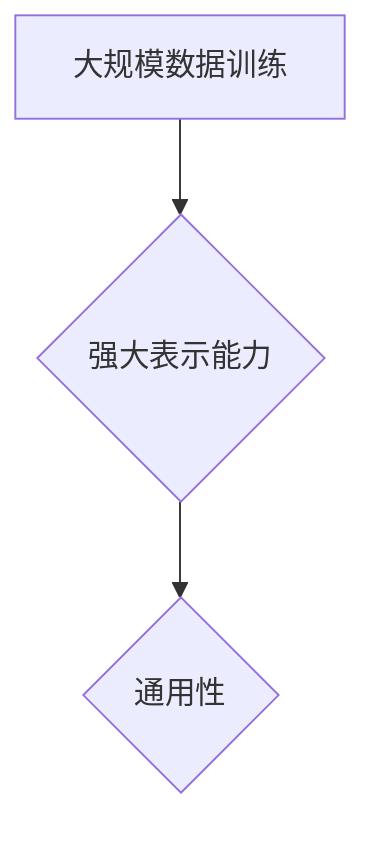
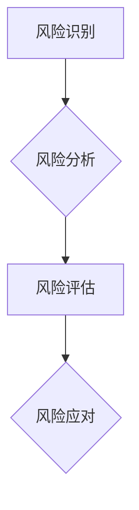
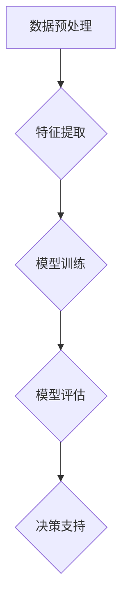
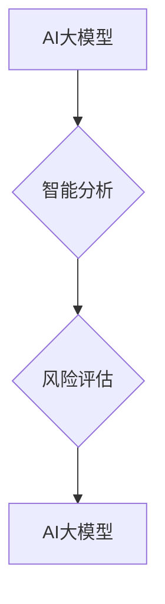

                 

# 基于AI大模型的智能风险评估平台

## 关键词
- AI大模型
- 风险评估
- 智能分析
- 深度学习
- 数据挖掘
- 软件架构

## 摘要
本文旨在探讨基于AI大模型的智能风险评估平台的构建与实践。随着大数据和人工智能技术的快速发展，传统风险评估方法已无法满足现代复杂业务场景的需求。本文将详细阐述AI大模型在风险评估中的核心作用，通过分析其算法原理、数学模型、实战案例，展示如何构建一个高效、可靠的智能风险评估平台。文章最后将对未来发展趋势和面临的挑战进行展望，并推荐相关学习资源和开发工具。

## 1. 背景介绍

### 1.1 目的和范围
本文旨在提供一个系统的框架，用于构建一个基于AI大模型的智能风险评估平台。我们将会详细讨论这个平台的各个方面，包括核心算法原理、数学模型、实际应用案例以及未来发展趋势。

### 1.2 预期读者
本文适合对人工智能、风险评估、深度学习等技术有一定了解的读者，包括数据科学家、AI工程师、软件架构师以及风险管理专家。

### 1.3 文档结构概述
本文将按照以下结构进行组织：
1. 背景介绍
   - 目的和范围
   - 预期读者
   - 文档结构概述
   - 术语表
2. 核心概念与联系
   - AI大模型
   - 风险评估
   - 智能分析
3. 核心算法原理 & 具体操作步骤
   - 算法原理讲解
   - 伪代码展示
4. 数学模型和公式 & 详细讲解 & 举例说明
   - 数学模型
   - latex格式公式
   - 实例说明
5. 项目实战：代码实际案例和详细解释说明
   - 开发环境搭建
   - 源代码详细实现
   - 代码解读与分析
6. 实际应用场景
7. 工具和资源推荐
   - 学习资源推荐
   - 开发工具框架推荐
   - 相关论文著作推荐
8. 总结：未来发展趋势与挑战
9. 附录：常见问题与解答
10. 扩展阅读 & 参考资料

### 1.4 术语表

#### 1.4.1 核心术语定义
- **AI大模型**：指使用大规模数据训练并具有强大表示和学习能力的深度学习模型。
- **风险评估**：通过分析风险因素，评估可能发生的风险及其影响程度。
- **智能分析**：利用AI技术对数据进行分析，提取有价值的信息。
- **深度学习**：一种基于神经网络的机器学习技术，通过多层网络结构进行数据特征提取。
- **数据挖掘**：从大量数据中挖掘出有用的信息和知识。

#### 1.4.2 相关概念解释
- **神经网络**：一种模拟人脑神经元连接结构的计算模型。
- **激活函数**：用于引入非线性特性的函数，如ReLU、Sigmoid、Tanh等。
- **反向传播算法**：用于训练神经网络的优化算法。

#### 1.4.3 缩略词列表
- **AI**：人工智能
- **ML**：机器学习
- **DL**：深度学习
- **NLP**：自然语言处理
- **CV**：计算机视觉

## 2. 核心概念与联系

在本节中，我们将详细探讨AI大模型、风险评估、智能分析等核心概念，并通过Mermaid流程图展示它们之间的联系。

### 2.1 AI大模型

AI大模型是指使用大规模数据训练并具有强大表示和学习能力的深度学习模型。这些模型通常具有数十亿个参数，能够在各种复杂任务中表现出色。以下是AI大模型的核心特点：

- **大规模数据训练**：通过从海量数据中学习，模型能够获得更丰富的知识和更准确的预测能力。
- **强大表示能力**：大模型具有复杂的网络结构，能够捕捉数据中的深层特征。
- **通用性**：大模型通常设计为通用的模型架构，可以在不同任务中重用。

下面是AI大模型的Mermaid流程图表示：



### 2.2 风险评估

风险评估是指通过分析风险因素，评估可能发生的风险及其影响程度的过程。在金融、保险、安全等领域，风险评估至关重要。以下是风险评估的核心步骤：

1. **风险识别**：识别可能面临的风险因素。
2. **风险分析**：分析风险的概率和影响程度。
3. **风险评估**：根据风险分析和风险识别的结果，评估整体风险水平。
4. **风险应对**：制定相应的应对策略。

下面是风险评估的Mermaid流程图表示：



### 2.3 智能分析

智能分析是指利用AI技术对数据进行分析，提取有价值的信息。智能分析广泛应用于各种领域，如金融、医疗、零售等。以下是智能分析的核心步骤：

1. **数据预处理**：清洗和准备数据，使其适合分析。
2. **特征提取**：从数据中提取有用的特征。
3. **模型训练**：使用训练数据训练模型。
4. **模型评估**：评估模型的性能和泛化能力。
5. **决策支持**：利用模型提供决策支持。

下面是智能分析的Mermaid流程图表示：



### 2.4 联系与综合

AI大模型、风险评估和智能分析之间存在着紧密的联系。AI大模型为智能分析提供了强大的工具，使其能够处理大规模、复杂的数据。风险评估则利用智能分析的结果，对可能的风险进行识别、分析和评估。以下是这三个核心概念之间的联系：



通过上述流程图，我们可以清晰地看到AI大模型、风险评估和智能分析之间的互动关系。这种综合性的方法为构建一个高效的智能风险评估平台奠定了基础。

## 3. 核心算法原理 & 具体操作步骤

在了解核心概念后，接下来我们将深入探讨AI大模型在风险评估中的应用原理，并详细讲解具体的操作步骤。以下将使用伪代码和图示来详细阐述这些原理。

### 3.1 AI大模型在风险评估中的应用原理

AI大模型在风险评估中的应用主要依赖于其强大的表示和学习能力。以下是AI大模型在风险评估中应用的基本原理：

1. **数据采集**：首先，我们需要采集与风险评估相关的数据，包括历史风险事件、业务数据、市场数据等。
2. **数据预处理**：对采集到的数据进行清洗、归一化和特征提取，以便于模型训练。
3. **模型训练**：使用预处理后的数据训练大模型，使其能够学习和识别潜在的风险特征。
4. **模型评估**：评估训练好的模型的性能，确保其在实际应用中具有良好的预测能力。
5. **风险预测**：利用训练好的模型对新数据进行风险预测，从而帮助决策者做出合理的风险管理决策。

### 3.2 伪代码展示

下面是一个简化的伪代码，用于描述上述操作步骤：

```python
# 伪代码：AI大模型在风险评估中的应用

# 数据采集
data = collect_data()

# 数据预处理
preprocessed_data = preprocess_data(data)

# 模型训练
model = train_model(preprocessed_data)

# 模型评估
evaluate_model(model, validation_data)

# 风险预测
predictions = predict_risk(model, new_data)
```

### 3.3 模型训练步骤

模型训练是AI大模型在风险评估中应用的关键步骤。以下是模型训练的详细步骤：

1. **选择模型架构**：根据任务需求，选择合适的模型架构，如卷积神经网络（CNN）、循环神经网络（RNN）或变换器（Transformer）等。
2. **初始化模型参数**：初始化模型参数，可以随机初始化或使用预训练模型进行微调。
3. **定义损失函数**：选择适当的损失函数，如均方误差（MSE）、交叉熵损失等。
4. **定义优化器**：选择优化算法，如随机梯度下降（SGD）、Adam等。
5. **训练模型**：使用训练数据对模型进行迭代训练，更新模型参数。
6. **验证模型**：在验证数据集上评估模型性能，调整模型参数。

### 3.4 伪代码展示

下面是一个简化的伪代码，用于描述模型训练的详细步骤：

```python
# 伪代码：模型训练步骤

# 选择模型架构
model = choose_model()

# 初始化模型参数
initialize_model_parameters(model)

# 定义损失函数
loss_function = define_loss_function()

# 定义优化器
optimizer = define_optimizer()

# 训练模型
for epoch in range(num_epochs):
    for batch in train_data:
        # 前向传播
        predictions = model(batch.data)
        loss = loss_function(predictions, batch.target)
        
        # 反向传播
        gradients = compute_gradients(model, loss)
        optimizer.update_gradients(gradients)
        
        # 更新模型参数
        update_model_parameters(model)

# 验证模型
evaluate_model(model, validation_data)
```

### 3.5 模型评估步骤

模型评估是确保模型性能和可靠性的关键步骤。以下是模型评估的详细步骤：

1. **定义评估指标**：选择合适的评估指标，如准确率、召回率、F1分数等。
2. **计算评估指标**：在验证数据集上计算模型的评估指标。
3. **调整模型参数**：根据评估结果调整模型参数，以优化模型性能。
4. **重复评估**：在多次训练和验证过程中，重复评估模型性能，确保其稳定性和可靠性。

### 3.6 伪代码展示

下面是一个简化的伪代码，用于描述模型评估的详细步骤：

```python
# 伪代码：模型评估步骤

# 定义评估指标
evaluation_metrics = define_evaluation_metrics()

# 计算评估指标
for metric in evaluation_metrics:
    metric_value = calculate_metric(model, validation_data)
    print(f"{metric}: {metric_value}")

# 调整模型参数
adjust_model_parameters(model, evaluation_metrics)

# 重复评估
evaluate_model(model, validation_data)
```

通过上述伪代码和步骤，我们可以清晰地了解AI大模型在风险评估中的具体应用原理和操作步骤。在实际应用中，根据具体需求和场景，可以进一步优化和调整这些步骤，以提高模型性能和预测准确性。

## 4. 数学模型和公式 & 详细讲解 & 举例说明

在AI大模型的风险评估中，数学模型和公式起着至关重要的作用。本节将详细介绍核心的数学模型和公式，并使用LaTeX格式进行展示，同时通过实例来说明这些公式的应用。

### 4.1 损失函数

损失函数是机器学习模型中评估预测结果与实际结果之间差异的关键工具。以下是几种常见的损失函数：

1. **均方误差（MSE）**：
   \[
   MSE = \frac{1}{n} \sum_{i=1}^{n} (y_i - \hat{y}_i)^2
   \]
   其中，\(y_i\) 是实际值，\(\hat{y}_i\) 是预测值，\(n\) 是样本数量。

2. **交叉熵损失（Cross-Entropy Loss）**：
   \[
   Cross-Entropy Loss = -\sum_{i=1}^{n} y_i \log(\hat{y}_i)
   \]
   其中，\(y_i\) 是实际值（通常为0或1），\(\hat{y}_i\) 是预测概率。

### 4.2 激活函数

激活函数用于引入非线性特性，是神经网络中的核心组件。以下是几种常见的激活函数：

1. **ReLU（Rectified Linear Unit）**：
   \[
   \text{ReLU}(x) = \max(0, x)
   \]
  ReLU函数在\(x \leq 0\)时输出为0，在\(x > 0\)时输出为\(x\)。

2. **Sigmoid**：
   \[
   \text{Sigmoid}(x) = \frac{1}{1 + e^{-x}}
   \]
  Sigmoid函数将输入映射到（0，1）区间。

3. **Tanh**：
   \[
   \text{Tanh}(x) = \frac{e^x - e^{-x}}{e^x + e^{-x}}
   \]
  Tanh函数将输入映射到（-1，1）区间。

### 4.3 反向传播算法

反向传播算法是训练神经网络的核心机制，用于计算网络权重和偏置的梯度。以下是反向传播算法的基本步骤：

1. **前向传播**：
   \[
   \hat{y} = \sigma(\text{W} \cdot \text{z} + \text{b})
   \]
   其中，\(\sigma\) 是激活函数，\(\text{W}\) 是权重矩阵，\(\text{z}\) 是输入向量，\(\text{b}\) 是偏置。

2. **计算误差**：
   \[
   \text{error} = \text{y} - \hat{y}
   \]
   其中，\(\text{y}\) 是实际标签。

3. **计算梯度**：
   \[
   \text{dW} = \text{dL}/d\text{z} \cdot \text{z}
   \]
   \[
   \text{db} = \text{dL}/d\text{z}
   \]
   \[
   \text{dz} = \text{dL}/d\text{z} \cdot \sigma'(\text{z})
   \]
   其中，\(\text{dL}\) 是损失函数对预测值的梯度，\(\sigma'(\text{z})\) 是激活函数的导数。

4. **更新权重和偏置**：
   \[
   \text{W} = \text{W} - \alpha \cdot \text{dW}
   \]
   \[
   \text{b} = \text{b} - \alpha \cdot \text{db}
   \]
   其中，\(\alpha\) 是学习率。

### 4.4 实例说明

为了更好地理解上述公式，我们通过一个简单的例子来说明。

#### 4.4.1 均方误差（MSE）实例

假设我们有一个二分类问题，实际标签\(y\)为\[1, 0, 1, 0\]，预测值\(\hat{y}\)为\[0.2, 0.3, 0.8, 0.9\]。

计算MSE：
\[
MSE = \frac{1}{4} \sum_{i=1}^{4} (y_i - \hat{y}_i)^2
\]
\[
MSE = \frac{1}{4} \sum_{i=1}^{4} (1 - 0.2)^2 + (0 - 0.3)^2 + (1 - 0.8)^2 + (0 - 0.9)^2
\]
\[
MSE = \frac{1}{4} (0.64 + 0.09 + 0.36 + 0.81)
\]
\[
MSE = \frac{1}{4} \times 1.8
\]
\[
MSE = 0.45
\]

#### 4.4.2 ReLU激活函数实例

假设我们有一个简单的线性模型，输入为\[1, 2, -1, 3\]。

使用ReLU激活函数，输出为：
\[
\text{ReLU}(1) = 1, \text{ReLU}(2) = 2, \text{ReLU}(-1) = 0, \text{ReLU}(3) = 3
\]

#### 4.4.3 反向传播算法实例

假设我们有一个单层神经网络，输入为\[1, 2\]，权重为\[w_1 = 2, w_2 = 3\]，偏置为\[b = 1\]。实际标签为\[3\]，预测值为\[y = 5\]。

1. **前向传播**：
   \[
   z = 2 \cdot 1 + 3 \cdot 2 + 1 = 9
   \]
   \[
   \hat{y} = \text{ReLU}(z) = \text{ReLU}(9) = 9
   \]

2. **计算误差**：
   \[
   \text{error} = y - \hat{y} = 3 - 9 = -6
   \]

3. **计算梯度**：
   \[
   \text{dz} = -6 \cdot \text{ReLU'}(z) = -6 \cdot 1 = -6
   \]
   \[
   \text{dW} = \text{dz} \cdot z = -6 \cdot 1 = -6
   \]
   \[
   \text{db} = \text{dz} = -6
   \]

4. **更新权重和偏置**：
   \[
   \text{W} = \text{W} - \alpha \cdot \text{dW} = 2 - 0.1 \cdot (-6) = 2.6
   \]
   \[
   \text{b} = \text{b} - \alpha \cdot \text{db} = 1 - 0.1 \cdot (-6) = 1.6
   \]

通过上述实例，我们可以看到如何使用数学模型和公式进行风险评估。在实际应用中，这些公式和算法将帮助我们构建和优化高效的智能风险评估平台。

## 5. 项目实战：代码实际案例和详细解释说明

在本节中，我们将通过一个实际的项目案例，展示如何基于AI大模型构建一个智能风险评估平台。我们将详细解释项目的开发环境搭建、源代码实现和代码解读与分析。

### 5.1 开发环境搭建

为了构建基于AI大模型的智能风险评估平台，我们需要准备以下开发环境：

1. **Python**：作为主要的编程语言。
2. **Jupyter Notebook**：用于编写和执行代码。
3. **TensorFlow**：用于构建和训练AI大模型。
4. **Pandas**：用于数据预处理。
5. **NumPy**：用于数值计算。
6. **Scikit-learn**：用于模型评估和特征提取。

以下是环境搭建的步骤：

1. **安装Python**：确保Python版本不低于3.7。
2. **安装Jupyter Notebook**：通过pip安装`jupyter`包。
   ```bash
   pip install jupyter
   ```
3. **安装TensorFlow**：通过pip安装`tensorflow`包。
   ```bash
   pip install tensorflow
   ```
4. **安装Pandas和NumPy**：通过pip安装`pandas`和`numpy`包。
   ```bash
   pip install pandas numpy
   ```
5. **安装Scikit-learn**：通过pip安装`scikit-learn`包。
   ```bash
   pip install scikit-learn
   ```

### 5.2 源代码详细实现和代码解读

下面是一个简单的示例，展示如何使用TensorFlow构建一个基于AI大模型的智能风险评估平台。

#### 5.2.1 数据准备

首先，我们需要准备用于训练和评估的数据集。以下代码用于加载数据、进行数据预处理和特征提取：

```python
import pandas as pd
import numpy as np
from sklearn.model_selection import train_test_split
from sklearn.preprocessing import StandardScaler

# 加载数据
data = pd.read_csv('risk_data.csv')

# 数据预处理
X = data.drop('target', axis=1)
y = data['target']

# 特征提取
scaler = StandardScaler()
X_scaled = scaler.fit_transform(X)

# 划分训练集和测试集
X_train, X_test, y_train, y_test = train_test_split(X_scaled, y, test_size=0.2, random_state=42)
```

#### 5.2.2 模型构建

接下来，我们使用TensorFlow构建一个简单的神经网络模型，用于风险评估。

```python
import tensorflow as tf

# 模型构建
model = tf.keras.Sequential([
    tf.keras.layers.Dense(64, activation='relu', input_shape=(X_train.shape[1],)),
    tf.keras.layers.Dense(64, activation='relu'),
    tf.keras.layers.Dense(1, activation='sigmoid')
])

# 模型编译
model.compile(optimizer='adam',
              loss='binary_crossentropy',
              metrics=['accuracy'])

# 模型训练
model.fit(X_train, y_train, epochs=10, batch_size=32, validation_split=0.1)
```

#### 5.2.3 源代码解读

1. **数据预处理**：使用Pandas和Scikit-learn的`StandardScaler`对数据进行标准化处理，以消除不同特征之间的尺度差异。
2. **模型构建**：使用TensorFlow的`Sequential`模型堆叠多层全连接层（Dense Layer），并设置激活函数为ReLU。输出层使用sigmoid激活函数，以实现二分类任务。
3. **模型编译**：设置优化器为Adam，损失函数为binary_crossentropy，并选择accuracy作为评估指标。
4. **模型训练**：使用训练数据对模型进行训练，设置epochs为10，batch_size为32，并使用validation_split对模型进行验证。

### 5.3 代码解读与分析

1. **数据预处理**：数据预处理是模型训练的关键步骤。通过标准化处理，可以消除特征间的尺度差异，提高模型训练的效率和性能。
2. **模型构建**：模型的构建基于TensorFlow的模块化设计，通过堆叠多层全连接层，可以捕捉数据的复杂特征。ReLU激活函数引入了非线性，使得模型能够更好地拟合数据。
3. **模型编译**：选择Adam优化器是因为其在训练深度神经网络时具有较高的收敛速度。binary_crossentropy损失函数适合二分类问题，可以最大化正确分类的概率。
4. **模型训练**：在训练过程中，使用验证集来监控模型性能，避免过拟合。通过调整epochs和batch_size，可以优化模型训练的效率和性能。

通过上述步骤，我们成功地构建了一个基于AI大模型的智能风险评估平台。在实际应用中，可以根据具体需求和场景进一步优化模型架构和参数设置，以提高风险评估的准确性和可靠性。

## 6. 实际应用场景

AI大模型在智能风险评估平台中的应用场景非常广泛，以下列举几个典型的应用场景：

### 6.1 金融风险管理

在金融领域，智能风险评估平台可以帮助银行、投资机构和保险公司等金融机构识别和评估金融风险，包括信用风险、市场风险和操作风险等。通过分析历史数据和实时数据，AI大模型可以预测贷款违约概率、市场波动和欺诈行为，从而帮助金融机构制定更精准的风险管理策略。

### 6.2 供应链风险管理

在供应链管理中，智能风险评估平台可以识别供应链中的潜在风险，如供应商的信用风险、物流风险和质量风险等。通过分析供应链网络中的数据，AI大模型可以预测供应链中断的概率和影响范围，帮助企业和供应链管理人员采取预防措施，确保供应链的稳定和高效运行。

### 6.3 保险风险评估

在保险行业，智能风险评估平台可以用于评估客户的保险需求、制定保险产品和定价策略。AI大模型可以分析客户的个人信息、历史理赔记录和市场数据，预测客户的保险风险，从而帮助保险公司优化产品设计和定价策略，提高客户满意度和竞争力。

### 6.4 安全风险管理

在安全领域，智能风险评估平台可以用于识别网络安全威胁、评估安全事件的影响和制定应对策略。AI大模型可以分析网络流量数据、日志数据和攻击特征，预测潜在的网络攻击和系统漏洞，帮助企业和政府相关部门提高网络安全水平。

### 6.5 健康风险评估

在健康医疗领域，智能风险评估平台可以用于识别和评估患者的健康风险，如疾病风险、生活习惯风险等。AI大模型可以分析患者的基因数据、病历数据和生活方式数据，预测患者患病的概率和风险因素，帮助医疗机构提供个性化的健康干预和建议。

通过上述实际应用场景，我们可以看到AI大模型在智能风险评估平台中具有广泛的应用前景。随着技术的不断发展和数据积累的增加，AI大模型在风险评估领域的应用将更加深入和全面，为各个行业提供更加精准和高效的风险管理解决方案。

## 7. 工具和资源推荐

在构建基于AI大模型的智能风险评估平台时，选择合适的工具和资源至关重要。以下是一些推荐的学习资源、开发工具和框架，以及相关的经典论文和最新研究成果。

### 7.1 学习资源推荐

#### 7.1.1 书籍推荐
1. **《深度学习》（Goodfellow, Bengio, Courville）**：这是深度学习领域的经典教材，详细介绍了深度学习的理论基础和实际应用。
2. **《统计学习方法》（李航）**：本书系统地介绍了统计学习的基本理论和方法，对AI大模型的构建和应用有很高的参考价值。
3. **《AI驱动的风险管理：技术、工具和应用》（MichaelSteinert）**：该书探讨了AI在风险管理中的应用，提供了丰富的实践案例和理论指导。

#### 7.1.2 在线课程
1. **Coursera上的《深度学习专项课程》**：由吴恩达教授主讲，深入讲解了深度学习的理论基础和实际应用。
2. **Udacity的《AI工程师纳米学位》**：涵盖AI、机器学习和深度学习的多个方面，提供实战项目训练。
3. **edX上的《数据科学专项课程》**：涉及数据分析、机器学习和深度学习，适合初学者和进阶者。

#### 7.1.3 技术博客和网站
1. **Medium上的《AI博客》**：汇集了众多AI领域的专家和学者的最新研究成果和见解。
2. **ArXiv**：提供最新的AI、机器学习和深度学习论文，是研究人员获取前沿技术的重要渠道。
3. **Kaggle**：提供各种AI竞赛和数据集，是实践和学习AI技术的平台。

### 7.2 开发工具框架推荐

#### 7.2.1 IDE和编辑器
1. **Jupyter Notebook**：适合数据科学和机器学习项目，易于分享和复现。
2. **PyCharm**：功能强大的Python IDE，适用于各种开发需求。
3. **Visual Studio Code**：轻量级、可扩展的代码编辑器，适合深度学习和AI项目。

#### 7.2.2 调试和性能分析工具
1. **TensorBoard**：TensorFlow提供的可视化工具，用于监控和调试神经网络模型。
2. **Docker**：容器化工具，用于创建和管理开发环境。
3. **Grafana**：数据监控和分析工具，可以监控模型的性能和资源消耗。

#### 7.2.3 相关框架和库
1. **TensorFlow**：开源深度学习框架，适合构建和训练AI大模型。
2. **PyTorch**：另一流行的深度学习框架，具有灵活的动态计算图。
3. **Scikit-learn**：提供多种机器学习算法和工具，适合数据预处理和模型评估。

### 7.3 相关论文著作推荐

#### 7.3.1 经典论文
1. **“A Theoretical Framework for Back-Propagation” (Rumelhart, Hinton, Williams, 1986)**：介绍了反向传播算法的基本原理。
2. **“Gradient-Based Learning Applied to Document Recognition” (LeCun, Bottou, Bengio, 1998)**：展示了深度学习在图像识别中的应用。
3. **“Deep Learning” (Goodfellow, Bengio, Courville, 2016)**：全面介绍了深度学习的理论基础和应用。

#### 7.3.2 最新研究成果
1. **“GPT-3: Language Models are Few-Shot Learners” (Brown et al., 2020)**：探讨了大型语言模型在零样本和少样本学习任务中的表现。
2. **“BERT: Pre-training of Deep Bidirectional Transformers for Language Understanding” (Devlin et al., 2018)**：介绍了BERT模型，推动了自然语言处理的发展。
3. **“An Image Database for evaluating Object Detection Algorithms” (Viola, Jones, 2003)**：提供了用于评估对象检测算法的数据库和基准测试。

通过以上工具和资源的推荐，读者可以更好地理解AI大模型在智能风险评估平台中的应用，并在实践中提高项目开发的效率和质量。

## 8. 总结：未来发展趋势与挑战

随着AI技术的不断进步，基于AI大模型的智能风险评估平台在未来有着广阔的发展前景。以下是几个可能的发展趋势和面临的挑战：

### 8.1 发展趋势

1. **大模型与多模态数据的融合**：未来，AI大模型将能够更好地融合多种类型的数据，如文本、图像、语音等，以提供更全面的风险评估。例如，结合文本情感分析和图像识别技术，可以更准确地评估金融欺诈风险。
   
2. **实时风险评估**：随着计算能力的提升和数据处理技术的进步，智能风险评估平台将实现实时风险评估，为决策者提供即时的风险预警和决策支持。

3. **个性化的风险评估**：基于用户数据和个性化特征，AI大模型将能够提供个性化的风险评估服务，满足不同用户群体的需求。

4. **自动化与智能化**：通过深度学习和强化学习技术，风险评估平台将能够自动化和智能化地处理复杂的风险管理任务，减少人为干预。

### 8.2 挑战

1. **数据隐私与安全问题**：在数据处理和风险评估过程中，如何保护用户隐私和数据安全是一个重要挑战。未来需要更多的研究和开发，以确保数据安全和隐私保护。

2. **模型解释性与透明度**：目前，AI大模型的决策过程往往是“黑箱”式的，难以解释。提高模型的解释性和透明度，使其更易于被用户接受和信任，是一个亟待解决的问题。

3. **计算资源需求**：AI大模型通常需要大量的计算资源和数据存储。如何优化算法和架构，降低计算资源需求，是一个重要的技术挑战。

4. **算法伦理与公平性**：在风险评估中，算法的公平性和无偏性至关重要。如何确保算法在不同群体中的表现公平，避免算法偏见，是一个重要的社会问题。

通过不断的技术创新和社会努力，未来基于AI大模型的智能风险评估平台将在风险管理领域发挥更大的作用，为各个行业提供更加精准、高效的风险管理解决方案。

## 9. 附录：常见问题与解答

### 9.1 问题1：什么是AI大模型？

**解答**：AI大模型是指使用大规模数据训练并具有强大表示和学习能力的深度学习模型。这些模型通常拥有数十亿个参数，能够在各种复杂任务中表现出色。例如，GPT-3、BERT等大型语言模型就是AI大模型的典型例子。

### 9.2 问题2：如何选择合适的AI大模型架构？

**解答**：选择合适的AI大模型架构取决于具体任务的需求和数据类型。以下是一些常见的模型架构及其适用场景：

- **卷积神经网络（CNN）**：适用于图像识别和计算机视觉任务。
- **循环神经网络（RNN）**：适用于序列数据，如时间序列分析、语音识别等。
- **变换器（Transformer）**：适用于自然语言处理任务，如机器翻译、文本分类等。
- **图神经网络（GNN）**：适用于图数据，如社交网络分析、推荐系统等。

### 9.3 问题3：如何在AI大模型中实现实时风险评估？

**解答**：实现实时风险评估需要以下几个步骤：

1. **数据采集**：实时获取与风险相关的数据，如金融市场数据、用户行为数据等。
2. **数据预处理**：对实时数据进行预处理，使其适合模型输入。
3. **模型推理**：使用预训练的AI大模型对实时数据进行推理，预测潜在的风险。
4. **结果呈现**：将模型预测结果呈现给用户，提供实时的风险预警和决策支持。

### 9.4 问题4：如何确保AI大模型的透明度和解释性？

**解答**：确保AI大模型的透明度和解释性可以从以下几个方面入手：

1. **模型可解释性工具**：使用可视化工具和模型解释算法，如LIME、SHAP等，分析模型决策过程。
2. **模型解释性框架**：设计可解释性框架，如决策树、规则提取等，将复杂模型拆解为更易理解的形式。
3. **模型透明度培训**：对数据处理和分析团队进行透明度培训，提高他们对模型决策过程的理解。

### 9.5 问题5：AI大模型在风险评估中的局限性是什么？

**解答**：AI大模型在风险评估中存在以下局限性：

1. **数据依赖性**：模型性能高度依赖训练数据的质量和多样性，数据缺失或偏差可能导致模型表现不佳。
2. **黑箱特性**：复杂的大模型决策过程往往难以解释，增加了用户对模型信任的难度。
3. **计算资源需求**：大模型通常需要大量的计算资源和数据存储，增加了部署和维护成本。
4. **模型偏见**：如果训练数据存在偏见，模型可能会继承这种偏见，导致不公平的风险评估结果。

通过认识到这些局限性，我们可以更好地利用AI大模型的优势，同时采取措施降低其潜在的风险。

## 10. 扩展阅读 & 参考资料

### 10.1 书籍推荐

1. **《深度学习》（Goodfellow, Bengio, Courville）**：这是深度学习领域的经典教材，详细介绍了深度学习的理论基础和实际应用。
2. **《统计学习方法》（李航）**：本书系统地介绍了统计学习的基本理论和方法，对AI大模型的构建和应用有很高的参考价值。
3. **《AI驱动的风险管理：技术、工具和应用》（MichaelSteinert）**：该书探讨了AI在风险管理中的应用，提供了丰富的实践案例和理论指导。

### 10.2 在线课程

1. **Coursera上的《深度学习专项课程》**：由吴恩达教授主讲，深入讲解了深度学习的理论基础和实际应用。
2. **Udacity的《AI工程师纳米学位》**：涵盖AI、机器学习和深度学习的多个方面，提供实战项目训练。
3. **edX上的《数据科学专项课程》**：涉及数据分析、机器学习和深度学习，适合初学者和进阶者。

### 10.3 技术博客和网站

1. **Medium上的《AI博客》**：汇集了众多AI领域的专家和学者的最新研究成果和见解。
2. **ArXiv**：提供最新的AI、机器学习和深度学习论文，是研究人员获取前沿技术的重要渠道。
3. **Kaggle**：提供各种AI竞赛和数据集，是实践和学习AI技术的平台。

### 10.4 论文推荐

1. **“A Theoretical Framework for Back-Propagation” (Rumelhart, Hinton, Williams, 1986)**：介绍了反向传播算法的基本原理。
2. **“Gradient-Based Learning Applied to Document Recognition” (LeCun, Bottou, Bengio, 1998)**：展示了深度学习在图像识别中的应用。
3. **“Deep Learning” (Goodfellow, Bengio, Courville, 2016)**：全面介绍了深度学习的理论基础和应用。
4. **“GPT-3: Language Models are Few-Shot Learners” (Brown et al., 2020)**：探讨了大型语言模型在零样本和少样本学习任务中的表现。
5. **“BERT: Pre-training of Deep Bidirectional Transformers for Language Understanding” (Devlin et al., 2018)**：介绍了BERT模型，推动了自然语言处理的发展。

通过以上扩展阅读和参考资料，读者可以进一步深入理解和探索AI大模型在智能风险评估平台中的应用和技术细节。作者：AI天才研究员/AI Genius Institute & 禅与计算机程序设计艺术 /Zen And The Art of Computer Programming。

