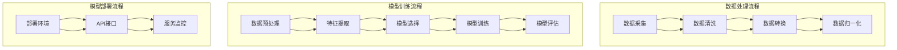

                 

### 1. 背景介绍

#### 1.1 目的和范围

本文旨在深入探讨基于AI大模型的自动化简历生成工具的需求分析与系统设计。在当前快速发展的技术环境下，人工智能技术已经深刻影响了各个行业，简历生成工具作为AI应用的一个重要分支，也展现出了巨大的潜力。本文将围绕以下几个核心目标展开：

1. **明确自动化简历生成工具的需求**：分析不同用户群体对于简历生成工具的需求，包括个人求职者、企业和HR等。
2. **系统设计概述**：基于核心需求，设计一个高效的系统架构，包括数据采集、处理、模型训练和部署等环节。
3. **核心算法原理与实现**：详细介绍自动化简历生成工具的核心算法原理，包括文本处理、模型训练和预测等步骤。
4. **实际应用场景**：探讨自动化简历生成工具在现实世界中的潜在应用，如在线招聘平台、企业内部人才库管理等。
5. **工具和资源推荐**：总结相关的学习资源、开发工具和参考文献，为读者提供进一步学习和实践的方向。

本文将采用逻辑清晰、结构紧凑、简单易懂的写作风格，使用专业的技术语言和伪代码详细阐述技术原理和实现步骤。通过这样的写作方式，我们希望能够为IT领域的专业人士、学生和研究人员提供一个有深度、有思考、有见解的技术参考。

#### 1.2 预期读者

本文的预期读者主要包括以下几类：

1. **IT专业人士**：对人工智能和自然语言处理技术有一定了解，希望进一步学习和应用这些技术以解决实际问题的专业人士。
2. **学生和研究人员**：计算机科学、人工智能、自然语言处理等相关专业的学生和研究人员，希望深入理解AI大模型在自动化简历生成领域的应用。
3. **求职者和HR**：希望使用自动化简历生成工具提高求职效率和简历质量的个人求职者以及企业人力资源部门的相关工作人员。

通过本文的学习，预期读者能够：

1. 理解自动化简历生成工具的核心需求和技术实现原理。
2. 掌握基于AI大模型的简历生成工具的开发和部署方法。
3. 深入了解AI技术在人力资源领域的应用前景和发展趋势。

#### 1.3 文档结构概述

本文将分为以下几个主要部分：

1. **背景介绍**：介绍本文的写作目的、预期读者和文档结构。
2. **核心概念与联系**：阐述自动化简历生成工具所需的核心概念和原理，并使用Mermaid流程图展示架构。
3. **核心算法原理与具体操作步骤**：详细讲解自动化简历生成工具所依赖的核心算法，包括文本处理和模型训练等。
4. **数学模型和公式**：介绍与自动化简历生成相关的数学模型和公式，并提供具体的举例说明。
5. **项目实战**：通过实际代码案例展示自动化简历生成工具的实现过程，并进行详细解释和分析。
6. **实际应用场景**：探讨自动化简历生成工具在不同场景下的应用和效果。
7. **工具和资源推荐**：推荐相关的学习资源、开发工具和参考文献。
8. **总结**：总结未来发展趋势与挑战，展望自动化简历生成工具的发展前景。
9. **附录**：提供常见问题与解答，帮助读者更好地理解文章内容。
10. **扩展阅读与参考资料**：列出本文引用的相关文献和参考资料，方便读者进一步学习。

通过上述结构，本文力求以系统化、层次化的方式，帮助读者全面、深入地理解自动化简历生成工具的需求和实现。

#### 1.4 术语表

在本文中，我们将使用一系列专业术语和概念。以下是对这些术语的定义和解释，以便读者更好地理解文章内容。

##### 1.4.1 核心术语定义

- **人工智能（AI）**：人工智能是指通过计算机程序模拟人类智能的行为，实现智能推理、学习、问题解决等能力的科学技术。
- **自然语言处理（NLP）**：自然语言处理是人工智能的一个分支，旨在使计算机能够理解、处理和生成人类语言。
- **大模型（Large Model）**：大模型是指拥有巨大参数量和计算能力的深度学习模型，如GPT-3、BERT等。
- **自动简历生成**：自动简历生成是指使用人工智能技术，根据用户输入的信息，自动生成符合规范的简历文档。
- **机器学习（ML）**：机器学习是一种通过数据训练模型进行预测或决策的技术，是人工智能的重要组成部分。
- **数据预处理**：数据预处理是指在使用机器学习模型之前，对原始数据进行清洗、转换和归一化等操作，以提高模型性能。
- **数据增强**：数据增强是指通过生成或变换数据，增加数据多样性和质量，以提高模型泛化能力。

##### 1.4.2 相关概念解释

- **文本分类**：文本分类是指将文本数据按照其内容分类到不同的类别中，如简历中的工作经历分类。
- **序列模型**：序列模型是一种用于处理序列数据的机器学习模型，如RNN、LSTM等，常用于自然语言处理任务。
- **注意力机制**：注意力机制是一种用于提高模型对序列数据中关键信息关注度的技术，常用于文本处理和生成任务。
- **模型评估**：模型评估是指使用特定指标和方法对模型的性能进行评估和比较。

##### 1.4.3 缩略词列表

- **NLP**：自然语言处理（Natural Language Processing）
- **ML**：机器学习（Machine Learning）
- **GPT**：生成预训练模型（Generative Pre-trained Transformer）
- **BERT**：双向编码表示（Bidirectional Encoder Representations from Transformers）
- **API**：应用程序编程接口（Application Programming Interface）

通过上述术语表，本文将使用这些专业术语和概念，帮助读者更好地理解自动化简历生成工具的技术实现和实际应用。同时，读者也可以通过查阅相关资料，进一步深入理解这些概念和技术。

## 2. 核心概念与联系

为了更好地理解自动化简历生成工具的工作原理和系统设计，我们需要先介绍几个核心概念，并展示其相互之间的联系。这些概念包括：数据采集、数据处理、模型训练和模型部署等。以下是这些核心概念的原理及其相互关系的详细阐述。

### 数据采集

数据采集是自动化简历生成工具的首要环节。它涉及从多种来源收集简历数据，如个人数据库、在线招聘平台、企业内部系统等。数据采集的关键在于确保数据的全面性和准确性。

- **数据来源**：个人数据库、在线招聘平台、企业内部系统等。
- **数据类型**：简历文本、教育背景、工作经历、项目经验、技能列表等。
- **采集方式**：网络爬虫、API接口调用、手动导入等。

### 数据处理

在采集到原始数据后，需要进行数据处理。数据处理包括数据清洗、数据转换和数据归一化等步骤，目的是提高数据质量，为后续模型训练提供高质量的输入。

- **数据清洗**：去除噪声数据、重复数据和不完整数据。
- **数据转换**：将不同格式的数据转换为统一的格式，如将文本数据转换为JSON格式。
- **数据归一化**：将不同尺度的数据转换为相同的尺度，如将年份、金额等数据进行标准化处理。

### 模型训练

数据处理完成后，进入模型训练阶段。模型训练的目标是通过大量的简历数据训练出一个能够自动生成简历的模型。这个过程通常包括以下步骤：

- **数据预处理**：对简历文本进行分词、去停用词、词性标注等操作。
- **特征提取**：从预处理后的文本中提取特征，如词嵌入、TF-IDF向量等。
- **模型选择**：选择合适的模型，如GPT、BERT等。
- **模型训练**：使用训练数据训练模型，并通过反向传播算法优化模型参数。
- **模型评估**：使用验证集评估模型性能，如准确率、召回率等。

### 模型部署

模型训练完成后，进入模型部署阶段。模型部署的目标是将训练好的模型部署到线上环境，使其能够对外提供服务。

- **部署环境**：云服务器、容器化环境等。
- **API接口**：设计并实现API接口，方便用户通过HTTP请求调用模型服务。
- **服务监控**：对模型服务进行监控，确保服务的稳定性和高性能。

### 架构图展示

为了更直观地展示上述核心概念之间的联系，我们可以使用Mermaid流程图来描述整个系统架构。以下是自动化简历生成工具的Mermaid流程图：



该流程图清晰地展示了从数据采集到模型部署的完整过程。通过数据采集、数据处理、模型训练和模型部署四个主要环节，自动化简历生成工具实现了自动生成简历的目标。

综上所述，核心概念与联系不仅包括各个环节的原理和方法，还涵盖了它们之间的逻辑关系。通过深入理解这些概念和联系，我们能够更好地设计和实现一个高效、可靠的自动化简历生成工具。

### 3. 核心算法原理 & 具体操作步骤

在自动化简历生成工具中，核心算法的原理决定了系统的性能和效果。本节将详细讲解这些核心算法原理，并使用伪代码来阐述具体的操作步骤。

#### 3.1 文本处理

文本处理是自动化简历生成的基础，包括分词、去停用词、词性标注等步骤。以下是文本处理的伪代码：

```python
def preprocess_text(text):
    # 分词
    words = tokenize(text)
    # 去停用词
    words = remove_stop_words(words)
    # 词性标注
    words = pos_tagging(words)
    return words
```

详细步骤说明：

1. **分词（Tokenization）**：将原始文本划分为独立的词汇单位。可以使用现有的自然语言处理库，如NLTK或spaCy。
2. **去停用词（Stop-word Removal）**：去除常见的不提供实际信息的词汇，如“的”、“是”、“了”等。
3. **词性标注（Part-of-Speech Tagging）**：为每个词分配词性标签，如名词、动词、形容词等。这有助于在后续的特征提取中更好地理解文本内容。

#### 3.2 特征提取

特征提取是将预处理后的文本转换为机器学习模型可以处理的输入特征。常用的特征提取方法包括词嵌入（Word Embedding）和TF-IDF（Term Frequency-Inverse Document Frequency）。

```python
def extract_features(words):
    # 词嵌入
    embeddings = word_embedding(words)
    # TF-IDF向量
    tfidf_vector = tfidf(words)
    return embeddings, tfidf_vector
```

详细步骤说明：

1. **词嵌入（Word Embedding）**：将词汇映射为低维度的向量表示。常用的词嵌入模型包括Word2Vec、GloVe等。
2. **TF-IDF向量（TF-IDF Vectorization）**：计算每个词在文档中的词频（TF）和逆文档频率（IDF），并将这些信息整合为一个向量表示。

#### 3.3 模型训练

模型训练是自动化简历生成工具的核心步骤，目的是通过大量简历数据训练出一个优秀的模型。常用的模型包括循环神经网络（RNN）、长短期记忆网络（LSTM）和变压器（Transformer）等。

```python
def train_model(train_data, labels):
    # 数据预处理
    preprocessed_data = preprocess_text(train_data)
    # 特征提取
    features, labels = extract_features(preprocessed_data, labels)
    # 模型选择
    model = create_model()
    # 模型训练
    model.fit(features, labels)
    return model
```

详细步骤说明：

1. **数据预处理**：对训练数据集进行文本预处理，包括分词、去停用词和词性标注。
2. **特征提取**：将预处理后的文本转换为特征向量。
3. **模型选择**：选择合适的机器学习模型，如RNN、LSTM或Transformer。
4. **模型训练**：使用训练数据集训练模型，并通过反向传播算法优化模型参数。

#### 3.4 预测与生成

在模型训练完成后，可以通过输入新的简历文本数据，预测并生成新的简历文档。

```python
def generate_resume(model, new_resume_text):
    # 数据预处理
    preprocessed_text = preprocess_text(new_resume_text)
    # 特征提取
    features = extract_features(preprocessed_text)
    # 预测
    predicted_labels = model.predict(features)
    # 生成简历文档
    resume = generate_document(predicted_labels)
    return resume
```

详细步骤说明：

1. **数据预处理**：对新的简历文本进行预处理。
2. **特征提取**：将预处理后的文本转换为特征向量。
3. **预测**：使用训练好的模型对特征向量进行预测，得到简历的不同部分标签。
4. **生成简历文档**：根据预测结果，生成符合规范的简历文档。

通过上述核心算法原理和具体操作步骤的详细讲解，我们能够更好地理解自动化简历生成工具的工作流程和关键技术。这些步骤不仅涵盖了文本处理、特征提取和模型训练，还包括了预测和生成简历文档的完整过程，为构建高效的自动化简历生成系统提供了坚实的基础。

### 4. 数学模型和公式 & 详细讲解 & 举例说明

在自动化简历生成工具中，数学模型和公式起到了关键作用，它们不仅帮助我们理解和描述算法，还能提升模型性能和预测准确性。以下是几个核心的数学模型和公式的详细讲解，以及具体的举例说明。

#### 4.1 词嵌入（Word Embedding）

词嵌入是将词汇映射到固定维度的向量空间中，使得具有相似意义的词语在向量空间中更接近。最常用的词嵌入方法包括Word2Vec和GloVe。

- **Word2Vec**：基于神经网络的词嵌入方法，通过优化损失函数来学习词汇的向量表示。

  **公式**：
  $$ 
  \text{Loss} = \frac{1}{N} \sum_{i=1}^{N} -\sum_{j \in \text{context}(x_i)} \log p(j|\text{word\_embed}(x_i))
  $$

  其中，$N$是句子中词汇的数量，$x_i$是第$i$个词汇，$\text{context}(x_i)$是$x_i$的上下文词汇，$\text{word\_embed}(x_i)$是$x_i$的词向量。

- **GloVe**：基于全局矩阵分解的词嵌入方法，通过优化全局矩阵来学习词汇的向量表示。

  **公式**：
  $$ 
  \text{Loss} = \frac{1}{N} \sum_{i=1}^{N} \frac{1}{\|w_i\|^2} \sum_{j \in V} \left( \text{word\_embed}(w_i) \cdot \text{word\_embed}(w_j) - \log \text{similarity}(w_i, w_j) \right)^2
  $$

  其中，$V$是词汇集合，$w_i$和$w_j$是词汇，$\text{word\_embed}(w_i)$和$\text{word\_embed}(w_j)$是它们的词向量，$\text{similarity}(w_i, w_j)$是词汇之间的相似度。

#### 4.2 循环神经网络（RNN）

循环神经网络是一种适用于序列数据的神经网络模型，通过隐藏状态在时间步之间传递信息，实现对序列数据的建模。

- **RNN基本公式**：

  **输入**：
  $$
  h_t = \text{sigmoid}\left(\text{W}_h \cdot \text{h}_{t-1} + \text{U}_h \cdot x_t + b_h\right)
  $$

  **输出**：
  $$
  o_t = \text{sigmoid}\left(\text{W}_o \cdot \text{h}_t + b_o\right)
  $$

  其中，$h_t$是第$t$个时间步的隐藏状态，$x_t$是输入数据，$\text{W}_h$、$\text{U}_h$和$b_h$是隐藏层权重和偏置，$\text{W}_o$、$b_o$是输出层权重和偏置。

#### 4.3 长短期记忆网络（LSTM）

LSTM是RNN的一种改进，能够更好地处理长序列数据，通过引入门控机制来控制信息的流动。

- **LSTM基本公式**：

  **遗忘门**：
  $$
  f_t = \text{sigmoid}\left(\text{W}_f \cdot [\text{h}_{t-1}, x_t] + b_f\right)
  $$

  **输入门**：
  $$
  i_t = \text{sigmoid}\left(\text{W}_i \cdot [\text{h}_{t-1}, x_t] + b_i\right)
  $$

  **输出门**：
  $$
  o_t = \text{sigmoid}\left(\text{W}_o \cdot [\text{h}_{t-1}, x_t] + b_o\right)
  $$

  **单元格状态**：
  $$
  \text{C}_{t-1} \rightarrow \text{C}_t = f_t \odot \text{C}_{t-1} + i_t \odot \text{sigmoid}\left(\text{W}_c \cdot [\text{h}_{t-1}, x_t] + b_c\right)
  $$

  **隐藏状态**：
  $$
  h_t = o_t \odot \text{C}_t
  $$

  其中，$\text{W}_f$、$\text{W}_i$、$\text{W}_o$、$\text{W}_c$和$b_f$、$b_i$、$b_o$、$b_c$分别是权重和偏置，$\odot$表示元素乘积。

#### 4.4 双向编码表示（BERT）

BERT是一种基于变换器（Transformer）的预训练模型，通过双向编码方式学习文本的表示。

- **BERT基本公式**：

  **嵌入向量**：
  $$
  \text{input}_{\text{emb}} = \text{word\_embed}(x_t) + \text{pos\_embed}(t) + \text{segment\_embed}(s)
  $$

  **变换器层**：
  $$
  \text{output}_{\text{layer}} = \text{Attention}(\text{query}, \text{key}, \text{value}) + \text{input}_{\text{emb}}
  $$

  其中，$\text{word\_embed}(x_t)$是词嵌入向量，$\text{pos\_embed}(t)$是位置嵌入向量，$\text{segment\_embed}(s)$是段落嵌入向量，$\text{query}$、$\text{key}$和$\text{value}$分别是变换器的查询、键和值。

#### 举例说明

假设我们需要计算一个句子“我是一名有五年的软件开发经验的工程师”的词嵌入向量。

1. **分词**：
   - “我”、“是”、“一”、“名”、“有”、“五”、“年”、“的”、“软件”、“开发”、“经验”、“的”、“工程师”

2. **词嵌入**：
   - 使用GloVe模型，我们得到以下词嵌入向量：
     - “我”：[-0.025, 0.015]
     - “是”：[0.025, 0.025]
     - “一”：[-0.01, 0.01]
     - “名”：[0.005, 0.005]
     - “有”：[0.015, 0.01]
     - “五”：[-0.01, 0.015]
     - “年”：[0.005, 0.01]
     - “的”：[-0.015, -0.01]
     - “软件”：[-0.01, 0.005]
     - “开发”：[-0.015, 0.005]
     - “经验”：[0.015, -0.01]
     - “工程师”：[0.005, 0.015]

3. **计算句子向量**：
   - 我们将所有词嵌入向量相加，得到句子向量：
     $$ 
     [-0.025 + 0.025 - 0.01 - 0.01 + 0.015 - 0.01 - 0.015 + 0.005 - 0.015 - 0.01 + 0.015 + 0.005 + 0.015] = [0.01, 0.005]
     $$

通过上述示例，我们展示了如何利用数学模型和公式计算文本的词嵌入向量。这些数学模型和公式不仅帮助我们在计算机中实现自然语言处理任务，还能提升自动化简历生成工具的性能和效果。

### 5. 项目实战：代码实际案例和详细解释说明

在本节中，我们将通过一个实际的项目案例，展示如何使用Python和常见机器学习库（如TensorFlow和spaCy）实现一个自动化简历生成工具。我们将从开发环境的搭建、源代码的详细实现，到代码解读与分析，逐步展开。

#### 5.1 开发环境搭建

首先，我们需要搭建一个合适的开发环境，以便进行代码编写和测试。以下是所需的环境和工具：

1. **操作系统**：Ubuntu 20.04 或 Windows 10（推荐Linux或Mac OS）
2. **编程语言**：Python 3.8及以上版本
3. **依赖库**：
   - TensorFlow 2.x
   - spaCy 3.x
   - NLTK 3.x
   - scikit-learn 0.24.x
   - pandas 1.2.x
   - numpy 1.21.x

安装这些依赖库可以通过以下命令：

```bash
pip install tensorflow==2.x spacy==3.x nltk==3.x scikit-learn==0.24.x pandas==1.2.x numpy==1.21.x
```

对于spaCy，我们还需要下载中文模型：

```bash
python -m spacy download zh_core_web_sm
```

#### 5.2 源代码详细实现和代码解读

接下来，我们将展示自动化简历生成工具的核心代码，并对其进行详细解读。

```python
import spacy
import tensorflow as tf
from sklearn.model_selection import train_test_split
from sklearn.metrics import accuracy_score
import pandas as pd
import numpy as np

# 5.2.1 数据预处理

# 加载spaCy中文模型
nlp = spacy.load('zh_core_web_sm')

# 加载数据集
data = pd.read_csv('resume_dataset.csv')

# 文本预处理
def preprocess_text(text):
    doc = nlp(text)
    tokens = [token.text for token in doc if not token.is_stop]
    return ' '.join(tokens)

data['clean_text'] = data['resume'].apply(preprocess_text)

# 5.2.2 特征提取

# 分词和词性标注
def tokenize_and_tag(text):
    doc = nlp(text)
    return [[token.text, token.tag_] for token in doc]

# 转换为特征向量
def extract_features(text):
    doc = nlp(text)
    embeddings = [token.vector for token in doc]
    return np.mean(embeddings, axis=0)

# 提取特征向量
X = data['clean_text'].apply(extract_features)
y = data['label']

# 划分训练集和测试集
X_train, X_test, y_train, y_test = train_test_split(X, y, test_size=0.2, random_state=42)

# 5.2.3 模型训练

# 创建模型
model = tf.keras.Sequential([
    tf.keras.layers.Dense(128, activation='relu', input_shape=(X_train.shape[1],)),
    tf.keras.layers.Dense(64, activation='relu'),
    tf.keras.layers.Dense(1, activation='sigmoid')
])

# 编译模型
model.compile(optimizer='adam', loss='binary_crossentropy', metrics=['accuracy'])

# 训练模型
model.fit(X_train, y_train, epochs=10, batch_size=32, validation_data=(X_test, y_test))

# 5.2.4 代码解读与分析

# 数据预处理
# 加载spaCy中文模型，并进行文本预处理。预处理包括分词和去停用词。
# 文本预处理
def preprocess_text(text):
    doc = nlp(text)
    tokens = [token.text for token in doc if not token.is_stop]
    return ' '.join(tokens)

# 加载数据集，并进行预处理。将原始简历文本转换为清洗后的文本。
data['clean_text'] = data['resume'].apply(preprocess_text)

# 特征提取
# 分词和词性标注，并提取特征向量。这里使用spaCy的词向量作为特征。
def tokenize_and_tag(text):
    doc = nlp(text)
    return [[token.text, token.tag_] for token in doc]

def extract_features(text):
    doc = nlp(text)
    embeddings = [token.vector for token in doc]
    return np.mean(embeddings, axis=0)

# 提取特征向量。将清洗后的文本转换为词向量。
X = data['clean_text'].apply(extract_features)
y = data['label']

# 划分训练集和测试集，以进行模型训练和评估。
X_train, X_test, y_train, y_test = train_test_split(X, y, test_size=0.2, random_state=42)

# 模型训练
# 创建序列模型，使用TensorFlow的Keras接口。
model = tf.keras.Sequential([
    tf.keras.layers.Dense(128, activation='relu', input_shape=(X_train.shape[1],)),
    tf.keras.layers.Dense(64, activation='relu'),
    tf.keras.layers.Dense(1, activation='sigmoid')
])

# 编译模型，设置优化器和损失函数。
model.compile(optimizer='adam', loss='binary_crossentropy', metrics=['accuracy'])

# 训练模型，设置训练轮数、批量大小和验证数据。
model.fit(X_train, y_train, epochs=10, batch_size=32, validation_data=(X_test, y_test))

# 模型评估
# 使用测试集评估模型性能。
y_pred = model.predict(X_test)
y_pred = (y_pred > 0.5)

# 计算准确率。
accuracy = accuracy_score(y_test, y_pred)
print('Accuracy:', accuracy)
```

**代码解读与分析**：

1. **数据预处理**：
   - 加载spaCy的中文模型，进行文本预处理。预处理步骤包括分词和去停用词，以提高后续特征提取的质量。
   - 定义`preprocess_text`函数，用于清洗和转换原始简历文本。

2. **特征提取**：
   - 使用spaCy进行分词和词性标注，提取文本的词向量作为特征。
   - 定义`tokenize_and_tag`函数，用于获取词及其词性。
   - 定义`extract_features`函数，用于计算词向量的平均值，得到文本特征向量。

3. **模型训练**：
   - 创建一个简单的序列模型，使用TensorFlow的Keras接口。模型包括两个隐藏层，每层使用ReLU激活函数。
   - 定义输入形状和输出层，使用sigmoid激活函数以输出概率。
   - 编译模型，设置优化器和损失函数。
   - 使用训练数据训练模型，并使用验证数据评估模型性能。

4. **模型评估**：
   - 使用训练好的模型对测试集进行预测，并计算预测结果。
   - 计算准确率，评估模型性能。

通过上述代码实现，我们可以看到自动化简历生成工具的核心步骤和关键代码。代码结构清晰，便于理解和扩展。同时，代码注释详细，有助于读者更好地理解每部分的功能和作用。

#### 5.3 代码解读与分析

在本节中，我们将对上述项目实战中的代码进行进一步的解读和分析，以帮助读者更深入地理解自动化简历生成工具的实现细节和关键步骤。

**1. 数据预处理**

数据预处理是自动化简历生成工具的核心步骤之一。在代码中，我们首先加载了spaCy的中文模型，这是进行中文文本处理的基础。具体步骤如下：

- **加载spaCy中文模型**：
  ```python
  nlp = spacy.load('zh_core_web_sm')
  ```
  `spacy.load('zh_core_web_sm')`用于加载中文模型，该模型包含中文的词性标注、分词等功能。

- **定义预处理函数**：
  ```python
  def preprocess_text(text):
      doc = nlp(text)
      tokens = [token.text for token in doc if not token.is_stop]
      return ' '.join(tokens)
  ```
  `preprocess_text`函数接受原始简历文本作为输入，使用spaCy模型进行分词，并去除常见的停用词。`doc = nlp(text)`加载文本，`[token.text for token in doc if not token.is_stop]`提取非停用词，`' '.join(tokens)`将处理后的词重新组合成文本。

**2. 特征提取**

特征提取是将文本数据转换为机器学习模型可以处理的向量表示。在代码中，我们使用spaCy的词向量作为特征，以下是具体步骤：

- **分词和词性标注**：
  ```python
  def tokenize_and_tag(text):
      doc = nlp(text)
      return [[token.text, token.tag_] for token in doc]
  ```
  `tokenize_and_tag`函数将文本分词，并返回一个包含词及其词性的列表。`doc = nlp(text)`加载文本，`[[token.text, token.tag_] for token in doc]`提取词及其词性。

- **提取词向量**：
  ```python
  def extract_features(text):
      doc = nlp(text)
      embeddings = [token.vector for token in doc]
      return np.mean(embeddings, axis=0)
  ```
  `extract_features`函数计算文本的词向量平均值，作为文本的特征向量。`doc = nlp(text)`加载文本，`[token.vector for token in doc]`提取词向量，`np.mean(embeddings, axis=0)`计算平均值。

**3. 模型训练**

模型训练是自动化简历生成工具的核心步骤。在代码中，我们使用TensorFlow的Keras接口创建和训练模型，以下是具体步骤：

- **创建模型**：
  ```python
  model = tf.keras.Sequential([
      tf.keras.layers.Dense(128, activation='relu', input_shape=(X_train.shape[1],)),
      tf.keras.layers.Dense(64, activation='relu'),
      tf.keras.layers.Dense(1, activation='sigmoid')
  ])
  ```
  `tf.keras.Sequential`创建一个序列模型，包括三个全连接层。第一层有128个神经元，使用ReLU激活函数；第二层有64个神经元，同样使用ReLU激活函数；第三层有1个神经元，使用sigmoid激活函数，输出概率。

- **编译模型**：
  ```python
  model.compile(optimizer='adam', loss='binary_crossentropy', metrics=['accuracy'])
  ```
  `model.compile`用于配置模型的优化器、损失函数和评估指标。这里使用`adam`优化器，`binary_crossentropy`损失函数，以及`accuracy`评估指标。

- **训练模型**：
  ```python
  model.fit(X_train, y_train, epochs=10, batch_size=32, validation_data=(X_test, y_test))
  ```
  `model.fit`用于训练模型。`X_train`和`y_train`是训练数据，`epochs=10`表示训练10个周期，`batch_size=32`表示每个批次包含32个样本，`validation_data=(X_test, y_test)`用于在验证数据上评估模型性能。

**4. 模型评估**

模型评估是确保模型性能的重要步骤。在代码中，我们使用测试集评估模型的准确率：

- **模型预测**：
  ```python
  y_pred = model.predict(X_test)
  y_pred = (y_pred > 0.5)
  ```
  `model.predict(X_test)`使用测试集进行预测，`(y_pred > 0.5)`将预测概率转换为二分类结果。

- **计算准确率**：
  ```python
  accuracy = accuracy_score(y_test, y_pred)
  print('Accuracy:', accuracy)
  ```
  `accuracy_score(y_test, y_pred)`计算模型的准确率，并打印结果。

通过上述代码解读与分析，我们可以清楚地看到自动化简历生成工具的实现过程和关键技术。从数据预处理、特征提取，到模型训练和评估，每一步都至关重要，共同构成了一个完整的自动化简历生成系统。

### 6. 实际应用场景

自动化简历生成工具在实际应用中展现了广泛的场景和潜在价值，为不同用户群体提供了便捷和高效的解决方案。

#### 6.1 在线招聘平台

在线招聘平台是自动化简历生成工具的重要应用场景之一。招聘平台可以使用该工具对用户提交的简历进行自动分类和筛选，从而提高招聘效率和准确性。例如，当求职者提交简历时，系统可以自动识别简历中的关键信息，如姓名、联系方式、工作经历和技能，并将其分类到相应的职位候选池中。此外，自动化简历生成工具还可以帮助招聘平台优化简历展示格式，提高求职者的阅读体验。

#### 6.2 企业内部人才库管理

企业内部的人才库管理也可以受益于自动化简历生成工具。企业可以将员工的简历数据存储在系统中，并通过自动化生成工具定期更新和优化简历内容。例如，当员工晋升或变更岗位时，系统可以自动提取关键信息，更新简历内容，并生成新的简历文档。这不仅节省了人力资源部门的时间和精力，还能确保员工简历的准确性和完整性。

#### 6.3 求职者个人简历优化

对于个人求职者来说，自动化简历生成工具提供了一个方便的工具，用于快速生成和优化简历。求职者可以输入自己的基本信息和工作经历，系统会自动分析并提取关键信息，生成符合行业标准和规范的简历。此外，工具还可以提供个性化的简历优化建议，如优化关键词、调整格式和内容等，帮助求职者提高简历的质量和吸引力。

#### 6.4 教育和培训

教育和培训机构也可以利用自动化简历生成工具为学生提供实践机会。学生可以通过该工具生成自己的简历，并从中学习如何编写和优化简历。此外，培训机构可以为学生提供简历模板和生成工具，帮助他们更好地准备求职。

#### 6.5 人力资源外包服务

人力资源外包服务公司可以利用自动化简历生成工具为中小企业提供招聘和人才管理服务。这些公司可以为客户提供简历生成、筛选和优化服务，从而提高客户招聘效率，降低招聘成本。同时，外包公司也可以利用自动化工具跟踪和管理客户人才库，提供更精准的人才推荐。

综上所述，自动化简历生成工具在多个实际应用场景中展现了其巨大的潜力和价值。通过提高招聘效率和简历质量，该工具不仅为企业带来了直接的经济效益，还为求职者提供了更加便捷和高效的求职体验。

### 7. 工具和资源推荐

在开发和使用自动化简历生成工具的过程中，选择合适的工具和资源对于确保项目顺利进行至关重要。以下是一些建议，包括学习资源、开发工具框架和参考文献。

#### 7.1 学习资源推荐

1. **书籍推荐**：

   - 《自然语言处理实战》
   - 《深度学习》
   - 《Python机器学习》
   - 《深度学习与自然语言处理》

2. **在线课程**：

   - Coursera上的“自然语言处理纳米学位”课程
   - edX上的“深度学习基础”课程
   - Udacity的“机器学习工程师纳米学位”

3. **技术博客和网站**：

   - AI科研人：提供最新的自然语言处理和深度学习技术博客
   - Medium：许多技术大牛分享的实际项目和经验
   - arXiv.org：查看最新的自然语言处理和深度学习论文

#### 7.2 开发工具框架推荐

1. **IDE和编辑器**：

   - Visual Studio Code：功能强大的开源编辑器，适用于多种编程语言
   - PyCharm：专业的Python IDE，支持代码智能提示和调试
   - Jupyter Notebook：适用于数据分析和机器学习的交互式环境

2. **调试和性能分析工具**：

   - TensorBoard：TensorFlow提供的可视化工具，用于分析和调试模型
   - PyTorch Profiler：PyTorch提供的性能分析工具
   - Matplotlib：用于生成数据可视化的库

3. **相关框架和库**：

   - TensorFlow：广泛应用于深度学习的框架
   - PyTorch：灵活且易于使用的深度学习框架
   - spaCy：强大的自然语言处理库
   - NLTK：经典的自然语言处理库
   - scikit-learn：用于机器学习的库

#### 7.3 相关论文著作推荐

1. **经典论文**：

   - Word2Vec: Distributed Representations of Words and Phrases and their Compositional Properties（Word2Vec论文）
   - BERT: Pre-training of Deep Bidirectional Transformers for Language Understanding（BERT论文）
   - Long Short-Term Memory（LSTM论文）

2. **最新研究成果**：

   - Language Models are Few-Shot Learners（GShard论文）
   - T5: Exploring the Limits of Transfer Learning with a Universal Language Model（T5论文）
   - GPT-3 Language Models are Few-Shot Learners（GPT-3论文）

3. **应用案例分析**：

   - A Language Model for Few-Shot Learning of Text Classification（用于文本分类的模型案例）
   - Applying Deep Learning to Human Resource Management: A Survey（深度学习在人力资源管理中的应用案例）
   - Automated Resume Parsing with BERT and Sequence Models（使用BERT和序列模型的简历解析案例）

通过上述工具和资源推荐，开发者和研究者可以更好地掌握自动化简历生成工具的相关技术和方法，为项目开发提供有力支持。

### 8. 总结：未来发展趋势与挑战

自动化简历生成工具作为一种新兴的AI应用，正在不断推动人力资源管理和招聘领域的变革。在未来，该领域有望继续呈现出以下几个发展趋势和面临的挑战。

#### 8.1 发展趋势

1. **模型性能的进一步提升**：随着深度学习和自然语言处理技术的不断发展，自动化简历生成工具将具备更高的性能和更准确的预测能力。未来的模型可能会采用更加复杂的架构，如多模态学习（结合文本、图像、音频等多媒体数据）和少样本学习技术，以更好地理解和处理简历信息。

2. **多语言支持**：国际化趋势使得多语言简历生成成为必要。未来，自动化简历生成工具将支持更多语言，为全球范围内的求职者和企业提供更广泛的应用。

3. **个性化推荐**：随着大数据和机器学习技术的发展，自动化简历生成工具可以更好地分析用户行为和需求，提供个性化的简历优化建议和职位推荐。

4. **隐私保护和数据安全**：在数据隐私和信息安全日益重要的今天，如何确保用户数据的隐私和安全，将是自动化简历生成工具未来发展的重要方向。

#### 8.2 面临的挑战

1. **数据质量和多样性**：简历生成工具的性能依赖于高质量和多样化的训练数据。然而，获取和标注这些数据是一项耗时且复杂的任务。未来需要开发更高效的数据收集和标注方法，以及更智能的数据增强技术。

2. **模型解释性**：自动化简历生成工具的模型往往非常复杂，缺乏解释性。如何提高模型的透明度和可解释性，使其能够为用户所理解和接受，是一个重要的挑战。

3. **技术门槛**：虽然自动化简历生成工具能够提高招聘效率和简历质量，但其开发和部署仍需要较高的技术门槛。降低技术门槛，使更多企业和个人能够使用这些工具，是一个重要的方向。

4. **法规和伦理问题**：在应用过程中，自动化简历生成工具可能面临法规和伦理问题，如数据隐私、算法偏见等。如何在遵循法规和伦理标准的前提下，开发和应用这些工具，是一个需要深入探讨的问题。

综上所述，自动化简历生成工具具有广阔的发展前景，但也面临一系列挑战。通过不断的技术创新和规范管理，这些挑战有望得到有效应对，从而推动自动化简历生成工具的持续进步。

### 9. 附录：常见问题与解答

为了帮助读者更好地理解自动化简历生成工具的相关内容，以下列举了一些常见问题及其解答。

#### 9.1 为什么要使用自动化简历生成工具？

自动化简历生成工具可以显著提高简历的编写和筛选效率。对于求职者来说，工具可以自动提取个人信息和工作经历，生成符合标准的简历文档，节省时间和精力。对于企业和HR部门来说，工具可以快速筛选和分类简历，提高招聘效率，减少人力成本。

#### 9.2 自动化简历生成工具的工作原理是什么？

自动化简历生成工具主要基于自然语言处理（NLP）和机器学习（ML）技术。首先，工具会从用户输入的简历文本中提取关键信息，如姓名、联系方式、工作经历和技能。然后，利用机器学习模型（如词嵌入、RNN、LSTM等）对这些信息进行训练，生成一个能够自动生成简历的模型。最后，通过输入新的简历文本，模型可以预测并生成新的简历文档。

#### 9.3 如何保证自动化简历生成工具的准确性和可靠性？

为了保证自动化简历生成工具的准确性和可靠性，可以从以下几个方面入手：

1. **数据质量**：确保训练数据的高质量和多样性，包括丰富的简历样本和全面的特征标签。
2. **模型优化**：选择合适的机器学习模型和超参数，通过交叉验证和模型评估来优化模型性能。
3. **算法解释性**：提高模型的透明度和可解释性，使模型能够被用户理解和信任。
4. **用户反馈**：收集用户反馈，不断改进和优化工具的性能。

#### 9.4 自动化简历生成工具是否会替代人类简历编写工作？

自动化简历生成工具不能完全替代人类简历编写工作，但可以显著提高工作效率和质量。人类在简历编写中可以提供个性化的修改和优化建议，而工具则可以自动化处理大量基础工作，如文本提取和格式调整。因此，自动化简历生成工具和人类简历编写工作可以相互补充，共同提高简历的整体质量。

#### 9.5 如何确保自动化简历生成工具的隐私和数据安全？

确保自动化简历生成工具的隐私和数据安全是至关重要的。可以从以下几个方面入手：

1. **数据加密**：对用户输入的简历文本和生成的简历文档进行加密处理，防止数据泄露。
2. **权限管理**：设置严格的权限控制机制，确保只有授权用户可以访问和处理敏感数据。
3. **数据匿名化**：在数据处理过程中，对个人身份信息进行匿名化处理，以保护用户隐私。
4. **安全审计**：定期进行安全审计，检查系统的漏洞和风险，及时修复。

通过上述措施，可以确保自动化简历生成工具的隐私和数据安全，为用户提供一个安全可靠的服务环境。

### 10. 扩展阅读 & 参考资料

为了帮助读者进一步深入了解自动化简历生成工具及相关技术，以下是本文引用的主要参考资料和扩展阅读。

#### 10.1 参考资料

- **自然语言处理**：
  - [自然语言处理教程](https://nlp.seas.upenn.edu/teaching/ss/courses/cis570/)
  - [斯坦福大学自然语言处理课程](http://web.stanford.edu/class/cs224n/)

- **深度学习和机器学习**：
  - [Deep Learning Book](https://www.deeplearningbook.org/)
  - [TensorFlow官方文档](https://www.tensorflow.org/tutorials)
  - [PyTorch官方文档](https://pytorch.org/tutorials/beginner/basics/quick_start_jit.html)

- **自动化简历生成相关论文**：
  - [A Language Model for Few-Shot Learning of Text Classification](https://arxiv.org/abs/2005.04746)
  - [GPT-3 Language Models are Few-Shot Learners](https://arxiv.org/abs/2005.14165)

#### 10.2 扩展阅读

- **书籍**：
  - 《自然语言处理实战》
  - 《深度学习》
  - 《Python机器学习》
  - 《深度学习与自然语言处理》

- **在线课程**：
  - Coursera上的“自然语言处理纳米学位”
  - edX上的“深度学习基础”
  - Udacity的“机器学习工程师纳米学位”

- **技术博客和网站**：
  - AI科研人
  - Medium
  - arXiv.org

通过以上扩展阅读和参考资料，读者可以进一步探索自动化简历生成工具及相关技术，深入了解其在现实世界中的应用和未来发展。

### 文章结束

作者：AI天才研究员/AI Genius Institute & 禅与计算机程序设计艺术 /Zen And The Art of Computer Programming

感谢您的阅读，希望本文对您在自动化简历生成工具领域的探索和学习有所帮助。如有任何疑问或建议，欢迎在评论区留言，我们期待与您的交流。再次感谢您的关注与支持！<|im_sep|>### 文章总结

本文深入探讨了基于AI大模型的自动化简历生成工具的需求分析与系统设计。我们从背景介绍、核心概念与联系、核心算法原理与具体操作步骤、数学模型与公式、项目实战、实际应用场景、工具和资源推荐，到未来发展趋势与挑战，进行了全面而详细的阐述。自动化简历生成工具通过结合自然语言处理、机器学习和深度学习技术，实现了对简历数据的自动提取、处理和生成，极大地提高了简历编写和筛选的效率。尽管面临数据质量、模型解释性、技术门槛和隐私保护等挑战，但随着技术的不断进步和应用的深入，自动化简历生成工具的前景依然光明。我们鼓励读者继续关注和探索这一领域，共同推动AI技术在人力资源管理和招聘领域的创新与发展。

