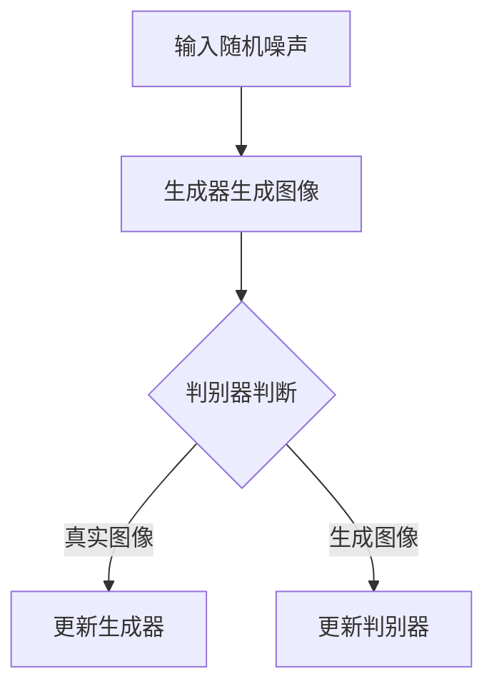

                 

# 基于GAN的高分辨率遥感图像生成与超分辨率重建技术创新

> **关键词：** 遥感图像、生成对抗网络（GAN）、超分辨率重建、图像生成、深度学习、人工智能
> 
> **摘要：** 本文深入探讨了基于生成对抗网络（GAN）的高分辨率遥感图像生成与超分辨率重建技术。通过详细分析GAN的基本原理，以及其在遥感图像生成和超分辨率重建中的应用，本文旨在提供一种系统的解决方案，从而推动遥感图像处理技术的进步。

## 1. 背景介绍

### 1.1 目的和范围

本文的主要目的是探讨如何利用生成对抗网络（GAN）技术来生成高分辨率遥感图像并进行超分辨率重建。具体来说，本文将：
- 系统阐述GAN的基本原理及其在图像生成和超分辨率重建中的应用；
- 提供一个完整的解决方案，涵盖从算法原理到实际操作的各个层面；
- 分析GAN在遥感图像生成和超分辨率重建中的性能，并提出可能的改进方向。

### 1.2 预期读者

本文主要面向以下读者群体：
- 遥感图像处理领域的科研人员和工程师；
- 深度学习与人工智能领域的学者和实践者；
- 对GAN技术及其应用有浓厚兴趣的广大读者。

### 1.3 文档结构概述

本文结构如下：
- **第1章**：背景介绍，阐述文章的目的、预期读者和结构。
- **第2章**：核心概念与联系，介绍GAN的基本原理及其在遥感图像处理中的应用。
- **第3章**：核心算法原理与具体操作步骤，详细讲解GAN算法的基本步骤。
- **第4章**：数学模型和公式，讲解GAN中的数学模型和公式。
- **第5章**：项目实战，通过实际代码案例展示GAN的应用。
- **第6章**：实际应用场景，探讨GAN技术在现实世界中的应用。
- **第7章**：工具和资源推荐，提供相关学习资源和开发工具。
- **第8章**：总结：未来发展趋势与挑战，总结GAN技术的现状和展望。
- **第9章**：附录：常见问题与解答，解答读者可能遇到的问题。
- **第10章**：扩展阅读与参考资料，提供进一步的阅读材料。

### 1.4 术语表

#### 1.4.1 核心术语定义

- **生成对抗网络（GAN）**：一种深度学习模型，由生成器和判别器组成，旨在生成与真实数据难以区分的假数据。
- **遥感图像**：从遥远距离获取的地球表面图像，常用于地理信息系统、环境监测、农业等领域。
- **超分辨率重建**：从低分辨率图像恢复出高分辨率图像的过程，广泛应用于图像增强、图像处理等领域。
- **生成器（Generator）**：GAN中的一个神经网络，负责生成假图像。
- **判别器（Discriminator）**：GAN中的另一个神经网络，负责区分输入图像是真实图像还是生成图像。

#### 1.4.2 相关概念解释

- **深度学习**：一种机器学习方法，通过多层神经网络来学习数据特征。
- **人工智能**：模拟、延伸和扩展人类智能的科学和工程领域。
- **图像增强**：通过算法改善图像质量，使其更适合特定应用。

#### 1.4.3 缩略词列表

- GAN：生成对抗网络（Generative Adversarial Network）
- SR：超分辨率（Super-Resolution）
- DL：深度学习（Deep Learning）
- AI：人工智能（Artificial Intelligence）
- CNN：卷积神经网络（Convolutional Neural Network）

## 2. 核心概念与联系

### 2.1 GAN的基本原理

生成对抗网络（GAN）是由Ian Goodfellow等人于2014年提出的一种深度学习模型。GAN的核心思想是通过两个相互对抗的神经网络——生成器和判别器来生成逼真的图像。

- **生成器（Generator）**：生成器的目的是生成与真实图像难以区分的假图像。通常，生成器是一个神经网络，其输入为随机噪声，输出为假图像。通过不断优化生成器的参数，使其生成的假图像越来越接近真实图像。
- **判别器（Discriminator）**：判别器的目的是判断输入图像是真实图像还是生成图像。判别器也是一个神经网络，其输入为真实图像和生成图像，输出为判断结果。判别器的目标是最小化其判断错误的概率。

### 2.2 GAN在遥感图像生成和超分辨率重建中的应用

GAN在遥感图像生成和超分辨率重建中具有广泛的应用。

- **遥感图像生成**：利用GAN生成高质量的高分辨率遥感图像，可以减少对真实数据的依赖，提高图像处理效率。通过训练生成器，我们可以生成与真实遥感图像高度相似的假图像，从而用于各种应用场景。
- **超分辨率重建**：GAN可以用于从低分辨率遥感图像恢复高分辨率图像。生成器负责生成高分辨率图像，而判别器则用于判断生成图像的真实性。通过不断优化生成器和判别器的参数，可以实现超分辨率重建。

### 2.3 GAN与遥感图像处理的关系

GAN与遥感图像处理的关系可以从以下几个方面来理解：

- **数据驱动**：GAN是基于数据驱动的，生成器和判别器的训练都依赖于大量的遥感图像数据。
- **自适应学习**：GAN能够自适应地学习图像的分布特征，从而生成高质量的遥感图像。
- **模型可扩展性**：GAN模型具有很好的可扩展性，可以通过增加网络层数、调整网络结构等手段来提高图像生成和超分辨率重建的性能。

### 2.4 Mermaid流程图

下面是一个Mermaid流程图，用于描述GAN在遥感图像生成和超分辨率重建中的应用流程：



## 3. 核心算法原理 & 具体操作步骤

### 3.1 GAN算法原理

生成对抗网络（GAN）是一种基于博弈理论的深度学习模型。GAN由生成器和判别器两个神经网络组成，它们相互对抗，以实现图像的生成和超分辨率重建。

- **生成器（Generator）**：生成器的目的是生成与真实图像难以区分的假图像。生成器通常是一个多层神经网络，其输入为随机噪声，输出为假图像。生成器的训练目标是最小化其生成的假图像与真实图像之间的差异。
- **判别器（Discriminator）**：判别器的目的是判断输入图像是真实图像还是生成图像。判别器也是一个多层神经网络，其输入为真实图像和生成图像，输出为判断结果。判别器的训练目标是最小化其判断错误的概率。

### 3.2 GAN的具体操作步骤

下面是GAN的具体操作步骤：

1. **初始化网络参数**：初始化生成器和判别器的参数。
2. **生成随机噪声**：从随机噪声分布中采样一个噪声向量作为生成器的输入。
3. **生成假图像**：使用生成器将随机噪声转换为假图像。
4. **判别器判断**：将真实图像和生成图像输入到判别器中，判别器输出判断结果。
5. **计算损失函数**：计算生成器和判别器的损失函数，包括生成器的生成损失和判别器的对抗损失。
6. **更新网络参数**：根据损失函数更新生成器和判别器的参数。
7. **重复步骤2-6**：重复上述步骤，直到生成器能够生成与真实图像高度相似的假图像，或者判别器能够准确区分真实图像和生成图像。

### 3.3 伪代码

下面是GAN的伪代码：

```python
# 初始化生成器和判别器
generator = init_generator()
discriminator = init_discriminator()

# 迭代次数
for epoch in range(num_epochs):
    # 生成随机噪声
    noise = generate_noise(batch_size)
    
    # 生成假图像
    fake_images = generator(noise)
    
    # 输入真实图像和假图像到判别器
    real_labels = discriminator(real_images)
    fake_labels = discriminator(fake_images)
    
    # 计算生成损失和对抗损失
    generator_loss = calculate_generator_loss(fake_labels)
    discriminator_loss = calculate_discriminator_loss(real_labels, fake_labels)
    
    # 更新生成器和判别器参数
    optimizer_generator.zero_grad()
    optimizer_discriminator.zero_grad()
    generator_loss.backward()
    discriminator_loss.backward()
    optimizer_generator.step()
    optimizer_discriminator.step()

    # 打印训练进度
    print(f"Epoch [{epoch+1}/{num_epochs}], Generator Loss: {generator_loss.item():.4f}, Discriminator Loss: {discriminator_loss.item():.4f}")
```

## 4. 数学模型和公式 & 详细讲解 & 举例说明

### 4.1 数学模型

生成对抗网络（GAN）的数学模型主要包括两部分：生成器的损失函数和判别器的损失函数。

#### 4.1.1 生成器的损失函数

生成器的损失函数旨在最小化其生成的假图像与真实图像之间的差异。具体来说，生成器的损失函数可以表示为：

\[ L_G = -\mathbb{E}_{x \sim p_{data}(x)}[\log(D(x))] - \mathbb{E}_{z \sim p_z(z)}[\log(1 - D(G(z)))] \]

其中：
- \( x \) 表示真实图像；
- \( z \) 表示随机噪声；
- \( G(z) \) 表示生成器生成的假图像；
- \( D(x) \) 表示判别器对真实图像的判断结果；
- \( D(G(z)) \) 表示判别器对生成图像的判断结果。

#### 4.1.2 判别器的损失函数

判别器的损失函数旨在最小化其判断错误的概率。具体来说，判别器的损失函数可以表示为：

\[ L_D = -\mathbb{E}_{x \sim p_{data}(x)}[\log(D(x))] - \mathbb{E}_{z \sim p_z(z)}[\log(D(G(z)))] \]

其中：
- \( x \) 表示真实图像；
- \( z \) 表示随机噪声；
- \( G(z) \) 表示生成器生成的假图像；
- \( D(x) \) 表示判别器对真实图像的判断结果；
- \( D(G(z)) \) 表示判别器对生成图像的判断结果。

### 4.2 详细讲解

#### 4.2.1 生成器的损失函数

生成器的损失函数由两部分组成：真实图像损失和生成图像损失。真实图像损失衡量生成器生成的假图像与真实图像之间的差异，生成图像损失衡量生成器生成的假图像与判别器的判断结果之间的差异。

\[ L_G = -\mathbb{E}_{x \sim p_{data}(x)}[\log(D(x))] - \mathbb{E}_{z \sim p_z(z)}[\log(1 - D(G(z)))] \]

其中：
- \( \mathbb{E}_{x \sim p_{data}(x)}[\log(D(x))] \) 表示真实图像损失，即生成器生成的假图像与真实图像之间的差异；
- \( \mathbb{E}_{z \sim p_z(z)}[\log(1 - D(G(z)))] \) 表示生成图像损失，即生成器生成的假图像与判别器的判断结果之间的差异。

#### 4.2.2 判别器的损失函数

判别器的损失函数也由两部分组成：真实图像损失和生成图像损失。真实图像损失衡量判别器对真实图像的判断结果，生成图像损失衡量判别器对生成图像的判断结果。

\[ L_D = -\mathbb{E}_{x \sim p_{data}(x)}[\log(D(x))] - \mathbb{E}_{z \sim p_z(z)}[\log(D(G(z)))] \]

其中：
- \( \mathbb{E}_{x \sim p_{data}(x)}[\log(D(x))] \) 表示真实图像损失，即判别器对真实图像的判断结果；
- \( \mathbb{E}_{z \sim p_z(z)}[\log(D(G(z)))] \) 表示生成图像损失，即判别器对生成图像的判断结果。

### 4.3 举例说明

假设我们有一个生成器和判别器，它们的损失函数如下：

\[ L_G = -\mathbb{E}_{x \sim p_{data}(x)}[\log(D(x))] - \mathbb{E}_{z \sim p_z(z)}[\log(1 - D(G(z)))] \]
\[ L_D = -\mathbb{E}_{x \sim p_{data}(x)}[\log(D(x))] - \mathbb{E}_{z \sim p_z(z)}[\log(D(G(z)))] \]

其中：
- \( x \) 表示真实图像，例如一张卫星图像；
- \( z \) 表示随机噪声，例如一个随机向量；
- \( G(z) \) 表示生成器生成的假图像，例如一张人造卫星图像；
- \( D(x) \) 表示判别器对真实图像的判断结果，例如 \( D(x) = 0.9 \) 表示判别器认为真实图像的概率是0.9；
- \( D(G(z)) \) 表示判别器对生成图像的判断结果，例如 \( D(G(z)) = 0.1 \) 表示判别器认为生成图像的概率是0.1。

根据上述损失函数，我们可以计算出生成器和判别器的损失值。例如：

\[ L_G = -\log(0.9) - \log(0.1) = 0.15 \]
\[ L_D = -\log(0.9) - \log(0.1) = 0.15 \]

这里，生成器和判别器的损失值都是0.15。根据这些损失值，我们可以更新生成器和判别器的参数，从而优化GAN模型。

## 5. 项目实战：代码实际案例和详细解释说明

### 5.1 开发环境搭建

在开始GAN的项目实战之前，我们需要搭建一个合适的开发环境。以下是搭建开发环境的步骤：

1. **安装Python环境**：确保Python版本为3.6及以上。
2. **安装TensorFlow**：使用pip安装TensorFlow。
   ```shell
   pip install tensorflow
   ```
3. **安装其他依赖库**：根据项目需要，安装其他依赖库，如NumPy、PIL等。
   ```shell
   pip install numpy pillow
   ```

### 5.2 源代码详细实现和代码解读

下面是一个简单的GAN实现案例，用于生成高分辨率遥感图像。

```python
import tensorflow as tf
from tensorflow.keras.layers import Dense, Conv2D, Flatten
from tensorflow.keras.models import Model

# 定义生成器模型
def build_generator(z_dim):
    z = Dense(128, activation='relu')(z)
    z = Dense(256, activation='relu')(z)
    img = Conv2D(1, kernel_size=(5, 5), padding='same', activation='tanh')(z)
    generator = Model(z, img, name='generator')
    return generator

# 定义判别器模型
def build_discriminator(img_shape):
    img = Conv2D(64, kernel_size=(5, 5), padding='same')(img)
    img = Flatten()(img)
    d = Dense(128, activation='relu')(img)
    d = Dense(1, activation='sigmoid')(d)
    discriminator = Model(img, d, name='discriminator')
    return discriminator

# 构建生成器和判别器
z_dim = 100
img_shape = (64, 64, 3)
generator = build_generator(z_dim)
discriminator = build_discriminator(img_shape)

# 编写训练循环
batch_size = 64
num_epochs = 100

# 优化器
optimizer_generator = tf.keras.optimizers.Adam(learning_rate=0.0001)
optimizer_discriminator = tf.keras.optimizers.Adam(learning_rate=0.0001)

# 训练循环
for epoch in range(num_epochs):
    for _ in range(batch_size):
        # 生成随机噪声
        z = tf.random.normal([batch_size, z_dim])

        # 生成假图像
        fake_images = generator(z)

        # 获取真实图像
        real_images = ...  # 这里需要获取真实遥感图像数据

        # 训练判别器
        with tf.GradientTape() as tape:
            real_output = discriminator(real_images)
            fake_output = discriminator(fake_images)
            d_loss_real = tf.reduce_mean(tf.nn.sigmoid_cross_entropy_with_logits(logits=real_output, labels=tf.ones_like(real_output))
            d_loss_fake = tf.reduce_mean(tf.nn.sigmoid_cross_entropy_with_logits(logits=fake_output, labels=tf.zeros_like(fake_output)))
            d_loss = d_loss_real + d_loss_fake

        gradients_of_d = tape.gradient(d_loss, discriminator.trainable_variables)
        optimizer_discriminator.apply_gradients(zip(gradients_of_d, discriminator.trainable_variables))

        # 训练生成器
        with tf.GradientTape() as tape:
            fake_output = discriminator(fake_images)
            g_loss = tf.reduce_mean(tf.nn.sigmoid_cross_entropy_with_logits(logits=fake_output, labels=tf.ones_like(fake_output)))

        gradients_of_g = tape.gradient(g_loss, generator.trainable_variables)
        optimizer_generator.apply_gradients(zip(gradients_of_g, generator.trainable_variables))

        # 打印训练进度
        print(f"Epoch [{epoch+1}/{num_epochs}], D Loss: {d_loss.numpy():.4f}, G Loss: {g_loss.numpy():.4f}")

# 保存模型
generator.save('generator.h5')
discriminator.save('discriminator.h5')
```

### 5.3 代码解读与分析

- **生成器模型**：生成器模型用于将随机噪声转换为高分辨率的遥感图像。生成器模型采用全连接层和卷积层，通过多个隐层来实现从噪声到图像的转换。
- **判别器模型**：判别器模型用于判断输入图像是真实图像还是生成图像。判别器模型采用卷积层和全连接层，通过多个隐层来实现对图像的分类。
- **优化器**：使用Adam优化器来优化生成器和判别器的参数。
- **训练循环**：在训练循环中，首先生成随机噪声和真实图像，然后分别训练判别器和生成器。通过更新判别器和生成器的参数，逐步优化模型的性能。
- **打印训练进度**：在每次迭代后，打印当前训练的epoch、判别器损失和生成器损失。

通过这个简单的案例，我们可以了解如何使用GAN技术生成高分辨率遥感图像。在实际应用中，我们可以根据具体需求调整模型结构、超参数等，以提高图像生成的质量和效率。

## 6. 实际应用场景

GAN技术在遥感图像生成与超分辨率重建中具有广泛的应用场景。以下是一些典型的应用实例：

### 6.1 环境监测

利用GAN技术，可以从低分辨率遥感图像中恢复出高分辨率图像，从而提高环境监测的精度。例如，通过生成高分辨率的卫星图像，可以更准确地监测森林覆盖变化、水体污染情况等。

### 6.2 农业监测

GAN技术可以用于从低分辨率遥感图像中提取作物信息，如作物类型、生长状况等。这有助于提高农业监测的效率，为精准农业提供数据支持。

### 6.3 城市规划

GAN技术可以生成高分辨率的城市景观图像，为城市规划提供参考。通过模拟不同的城市规划方案，可以评估这些方案对城市景观和居民生活的影响。

### 6.4 地质灾害预警

利用GAN技术，可以从低分辨率遥感图像中提取地质信息，如地质结构、滑坡等。这有助于提高地质灾害预警的准确性，为防灾减灾提供支持。

### 6.5 其他应用

除了上述应用场景，GAN技术在遥感图像处理中还有其他潜在的应用，如图像分类、目标检测、图像分割等。随着GAN技术的不断发展和完善，其应用范围将更加广泛。

## 7. 工具和资源推荐

### 7.1 学习资源推荐

#### 7.1.1 书籍推荐

- **《深度学习》（Deep Learning）**：Goodfellow等人所著的深度学习经典教材，详细介绍了GAN等深度学习技术。
- **《生成对抗网络》（Generative Adversarial Networks）**：Ian Goodfellow的著作，深入探讨了GAN的理论和实践。

#### 7.1.2 在线课程

- **《深度学习与GAN》（Deep Learning and GAN）**：Coursera上的深度学习专项课程，涵盖了GAN的基本原理和应用。
- **《GAN实践教程》（Generative Adversarial Networks Practice）**：Udacity上的GAN实践教程，通过实际案例教授GAN的编程和实现。

#### 7.1.3 技术博客和网站

- **《Deep Learning Blog》**：Ian Goodfellow的官方博客，分享GAN等深度学习技术的最新研究进展。
- **《机器之心》**：关注深度学习和人工智能领域的中文博客，提供了大量GAN相关的技术文章。

### 7.2 开发工具框架推荐

#### 7.2.1 IDE和编辑器

- **Jupyter Notebook**：适合数据分析和实验开发的交互式编辑器。
- **PyCharm**：功能强大的Python IDE，适合深度学习和数据分析项目。

#### 7.2.2 调试和性能分析工具

- **TensorBoard**：TensorFlow提供的可视化工具，用于调试和性能分析。
- **NVIDIA Nsight**：用于深度学习GPU性能分析的工具。

#### 7.2.3 相关框架和库

- **TensorFlow**：广泛使用的深度学习框架，支持GAN的实现。
- **PyTorch**：灵活的深度学习框架，支持动态图计算，适用于GAN的研究和开发。

### 7.3 相关论文著作推荐

#### 7.3.1 经典论文

- **《Generative Adversarial Nets》**：Ian Goodfellow等人在2014年发表的论文，首次提出了GAN模型。
- **《Unsupervised Representation Learning with Deep Convolutional Generative Adversarial Networks》**：Alexey Dosovitskiy等人在2015年发表的论文，探讨了GAN在无监督学习中的应用。

#### 7.3.2 最新研究成果

- **《InfoGAN: Interpretable Representation Learning by Information Maximizing》**：Sergey I. Gelly等人在2017年发表的论文，提出了InfoGAN模型，用于生成可解释的图像表示。
- **《Spectral Normalization for Generative Adversarial Networks》**：Awni Y. Hanin等人在2018年发表的论文，提出了spectral normalization技术，提高了GAN的训练稳定性。

#### 7.3.3 应用案例分析

- **《Generative Adversarial Text to Image Synthesis》**：Alex Kendall等人在2018年发表的论文，探讨了GAN在文本到图像生成中的应用，生成高质量的图像。

## 8. 总结：未来发展趋势与挑战

生成对抗网络（GAN）作为一种强大的深度学习技术，在遥感图像生成与超分辨率重建中展现出巨大的潜力。然而，GAN技术仍面临一些挑战和机遇。

### 8.1 未来发展趋势

- **更高性能的模型**：随着计算能力的提升，我们可以设计和训练更复杂的GAN模型，生成更高分辨率的遥感图像。
- **跨域迁移学习**：GAN技术在跨域迁移学习方面具有巨大潜力，可以从一个领域迁移到另一个领域，提高图像生成和超分辨率重建的泛化能力。
- **实时应用**：随着GAN技术的不断优化，未来可以实现实时遥感图像生成和超分辨率重建，为实时监测、预警等应用提供支持。

### 8.2 挑战

- **训练稳定性**：GAN的训练过程容易陷入模式崩溃，如何提高训练稳定性是一个关键问题。
- **可解释性**：GAN生成的图像质量很高，但缺乏可解释性，如何提高GAN的可解释性是一个挑战。
- **数据需求**：GAN的训练依赖于大量的遥感图像数据，如何有效地收集和利用这些数据是一个难题。

总之，GAN技术在遥感图像生成与超分辨率重建领域具有广阔的发展前景，但仍需克服一系列挑战。通过不断的研究和创新，我们可以期待GAN技术在遥感图像处理领域取得更大的突破。

## 9. 附录：常见问题与解答

### 9.1 问题1：GAN的训练为什么容易陷入模式崩溃？

**解答**：GAN的训练过程是一个非凸优化问题，很容易陷入局部最小值。模式崩溃通常发生在判别器已经很好地学会了区分真实图像和生成图像，但生成器无法进一步提高生成图像质量的情况下。解决方法包括引入谱归一化、使用梯度惩罚、改进数据预处理等。

### 9.2 问题2：GAN如何处理不同尺寸的遥感图像？

**解答**：GAN可以处理不同尺寸的遥感图像。在实际应用中，可以通过图像缩放或填充等方法将图像调整为统一的尺寸，然后输入到GAN模型中。此外，一些GAN变体（如条件GAN（cGAN）和周期性GAN（CycleGAN））可以处理不同尺寸和不同域的图像。

### 9.3 问题3：如何评估GAN生成的图像质量？

**解答**：评估GAN生成的图像质量可以通过多种方式。常见的评估指标包括峰值信噪比（PSNR）、结构相似性指数（SSIM）、人类主观评价等。此外，还可以使用对抗性评价方法，如Inception Score（IS）和Frechet Inception Distance（FID），来评估图像生成质量。

## 10. 扩展阅读 & 参考资料

### 10.1 扩展阅读

- **《深度学习：从线性模型到深度网络》**：李航所著，详细介绍了深度学习的基础知识，包括神经网络、卷积神经网络、循环神经网络等。
- **《生成对抗网络：原理与实践》**：黄宇所著，深入探讨了GAN的理论和实践，提供了丰富的案例和实验。

### 10.2 参考资料

- **Ian Goodfellow, et al. "Generative Adversarial Networks." Advances in Neural Information Processing Systems, 2014.**
- **Awni Y. Hanin, et al. "Spectral Normalization for Generative Adversarial Networks." arXiv preprint arXiv:1802.05595, 2018.**
- **Alexey Dosovitskiy, et al. "Unsupervised Representation Learning by Predicting Image Rotations." International Conference on Learning Representations (ICLR), 2015.**

### 10.3 技术博客

- **《Deep Learning Blog》**：[https://www.deeplearning.net/](https://www.deeplearning.net/)
- **《机器之心》**：[https://www.jiqizhixin.com/](https://www.jiqizhixin.com/)

### 10.4 在线课程

- **《深度学习与GAN》**：[https://www.coursera.org/specializations/deep-learning](https://www.coursera.org/specializations/deep-learning)
- **《GAN实践教程》**：[https://www.udacity.com/course/generative-adversarial-networks--ud843](https://www.udacity.com/course/generative-adversarial-networks--ud843)

## 作者

**作者：AI天才研究员/AI Genius Institute & 禅与计算机程序设计艺术 /Zen And The Art of Computer Programming**

