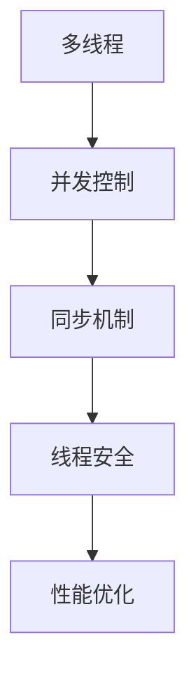

                 

# 基于Java的智能家居设计：Java中的并发控制与智能家居应用

> **关键词**：Java、智能家居、并发控制、多线程、线程安全、同步机制、性能优化
>
> **摘要**：本文旨在深入探讨Java语言中并发控制的概念及其在智能家居设计中的应用。我们将从基础概念出发，逐步讲解Java多线程编程、并发控制的原理和实现，并通过具体的代码实例，展示如何在智能家居系统中实现线程安全与性能优化。文章还将介绍相关开发工具和资源，为读者提供全面的实战指南。

## 1. 背景介绍

### 1.1 目的和范围

随着物联网（IoT）技术的发展，智能家居系统成为现代家居的重要组成部分。智能家居系统通过互联网连接家庭设备，实现设备之间的智能互动和远程控制。而Java作为一门广泛应用于企业级应用和大型系统的编程语言，其在并发控制方面的优势使其成为智能家居系统开发的首选语言之一。

本文的目的在于：

1. **介绍Java中的并发控制原理**：从基础概念到高级应用，帮助读者理解并发编程的核心思想和关键概念。
2. **探讨并发控制与智能家居系统的关系**：分析并发控制在智能家居系统中的重要性，并探讨如何通过Java实现智能家居系统的并发控制。
3. **提供实际案例和代码实现**：通过具体实例，展示如何使用Java并发控制技术构建高效的智能家居系统。

### 1.2 预期读者

本文适用于以下读者群体：

1. **Java开发者**：希望了解并发控制原理并在智能家居系统中应用的开发者。
2. **物联网技术爱好者**：对智能家居系统设计和开发感兴趣的技术爱好者。
3. **计算机科学与工程专业的学生**：需要了解并发控制基础理论的学术研究者。

### 1.3 文档结构概述

本文将按照以下结构展开：

1. **背景介绍**：介绍本文的目的、预期读者以及文档结构。
2. **核心概念与联系**：讲解Java并发编程的核心概念，并绘制流程图。
3. **核心算法原理与操作步骤**：详细阐述Java并发控制的核心算法原理和实现步骤。
4. **数学模型与公式**：介绍与并发控制相关的数学模型和公式，并通过实例进行说明。
5. **项目实战**：通过实际代码案例，展示并发控制在智能家居系统中的应用。
6. **实际应用场景**：分析并发控制在智能家居系统中的实际应用。
7. **工具和资源推荐**：推荐学习资源和开发工具。
8. **总结与未来发展趋势**：总结本文的核心内容，并探讨未来发展趋势与挑战。
9. **常见问题与解答**：回答读者可能遇到的问题。
10. **扩展阅读与参考资料**：提供进一步学习的资源。

### 1.4 术语表

#### 1.4.1 核心术语定义

- **并发控制**：在多线程环境中，确保资源访问的一致性和正确性的机制。
- **多线程**：在程序中同时运行多个线程，以实现并行计算和资源利用。
- **同步机制**：通过共享变量和锁等手段，协调多个线程对共享资源的访问。
- **线程安全**：程序在多线程环境下能够正确运行，不会出现数据竞争和线程死锁等问题。
- **性能优化**：通过改进算法和编程技术，提高程序执行效率和性能。

#### 1.4.2 相关概念解释

- **共享资源**：被多个线程共同使用的资源，如内存、文件和网络连接等。
- **线程死锁**：两个或多个线程因为互相等待对方释放资源而无限期等待的状态。
- **互斥锁**：一种同步机制，用于确保同一时刻只有一个线程可以访问某个共享资源。
- **可重入锁**：一种允许线程重复获取的锁，即使线程已经在持有锁的情况下，也可以再次获取。
- **线程池**：一组预先创建的线程，用于执行多个任务，提高程序性能和资源利用。

#### 1.4.3 缩略词列表

- **IoT**：物联网（Internet of Things）
- **Java**：Java编程语言
- **GUI**：图形用户界面（Graphical User Interface）
- **MVC**：模型-视图-控制器（Model-View-Controller）
- **JVM**：Java虚拟机（Java Virtual Machine）

## 2. 核心概念与联系

在探讨Java并发控制之前，我们需要了解一些核心概念，包括多线程、并发控制、同步机制等。以下是一个简化的Mermaid流程图，用于描述这些核心概念之间的联系。



### 2.1 多线程

多线程是现代计算机编程的一个重要概念。它允许程序在执行多个任务时，利用多个CPU核心，提高程序的执行效率。在Java中，多线程的实现主要依赖于Thread类和Runnable接口。

- **Thread类**：Java提供的用于创建和管理线程的类。通过继承Thread类或实现Runnable接口，可以创建一个新的线程。
- **Runnable接口**：定义了一个run()方法，线程将执行此方法中的代码。通常，实现Runnable接口的类会实现自己的逻辑。

### 2.2 并发控制

并发控制是在多线程环境中，确保资源访问的一致性和正确性的机制。在Java中，并发控制主要通过以下方式实现：

- **同步（Synchronization）**：使用synchronized关键字，实现对共享资源的互斥访问。同步方法或同步块确保同一时刻只有一个线程可以访问共享资源，从而避免数据竞争和资源不一致的问题。
- **锁（Lock）**：Java5引入了锁的概念，提供了更灵活的并发控制机制。通过Lock接口和ReentrantLock实现类，可以自定义锁的获取和释放逻辑。

### 2.3 同步机制

同步机制是并发控制的核心，用于协调多个线程对共享资源的访问。以下是一些常见的同步机制：

- **互斥锁（Mutex）**：确保同一时刻只有一个线程可以访问共享资源。在Java中，synchronized关键字和ReentrantLock都实现了互斥锁的功能。
- **可重入锁（Reentrant Lock）**：允许同一个线程重复获取锁，即使在锁已经被持有的情况下。这种锁机制可以防止死锁问题。
- **读写锁（Read-Write Lock）**：允许一个资源同时被多个读线程访问，但写线程需要独占访问资源。这种锁机制可以优化读操作的性能。

### 2.4 线程安全

线程安全是指程序在多线程环境下能够正确运行，不会出现数据竞争和线程死锁等问题。以下是一些确保线程安全的方法：

- **线程封闭（Thread-local）**：使用线程局部变量，避免共享资源在不同线程之间的竞争。
- **不可变对象**：使用不可变对象，避免在多线程环境中修改对象的内部状态。
- **原子操作**：使用Java提供的原子类，如AtomicInteger和AtomicLong，执行线程安全的操作。

### 2.5 性能优化

性能优化是提高程序执行效率和响应速度的关键。以下是一些常用的性能优化方法：

- **线程池（ThreadPool）**：通过重用线程，减少线程创建和销毁的开销，提高程序性能。
- **非阻塞IO（Non-blocking IO）**：使用非阻塞IO技术，避免线程在IO操作上等待，提高程序并发能力。
- **异步编程（Asynchronous Programming）**：通过异步编程模型，减少线程之间的同步等待，提高程序并发性能。

## 3. 核心算法原理 & 具体操作步骤

在理解了Java并发控制的核心概念后，接下来我们将详细阐述核心算法原理，并通过伪代码来具体描述实现步骤。

### 3.1 算法原理

Java并发控制的核心算法原理主要包括以下几个方面：

1. **线程创建与启动**：通过Thread类或Runnable接口创建线程，并启动线程执行。
2. **线程同步**：使用synchronized关键字或Lock接口实现同步机制，确保共享资源的一致性。
3. **线程通信**：使用Object类的wait()、notify()和notifyAll()方法实现线程间的通信。
4. **线程池管理**：使用线程池管理线程，提高程序性能和资源利用。

### 3.2 伪代码描述

以下是一个简化的伪代码，用于描述Java并发控制的核心算法原理：

```pseudo
class ConcurrentControlExample {
    private Lock lock = new ReentrantLock();
    private Condition condition = lock.newCondition();
    private int counter = 0;

    public void increment() {
        lock.lock();
        try {
            counter++;
            condition.signalAll();
        } finally {
            lock.unlock();
        }
    }

    public int getCounter() {
        return counter;
    }

    public void awaitCounter(int target) throws InterruptedException {
        lock.lock();
        try {
            while (counter < target) {
                condition.await();
            }
        } finally {
            lock.unlock();
        }
    }
}
```

### 3.3 实现步骤

以下是实现Java并发控制的具体操作步骤：

1. **创建锁和条件变量**：使用ReentrantLock创建锁，并创建一个Condition对象用于线程通信。
2. **实现increment方法**：使用lock.lock()和lock.unlock()确保方法内的代码块是线程安全的。在代码块内，使用条件变量signalAll()通知等待的线程。
3. **实现awaitCounter方法**：使用lock.lock()和lock.unlock()确保方法内的代码块是线程安全的。在代码块内，使用while循环和condition.await()方法实现线程间的等待和通知。
4. **创建和使用线程**：创建一个ConcurrentControlExample对象，并创建多个线程调用increment方法。在另一个线程中调用awaitCounter方法等待条件满足。

通过上述算法原理和实现步骤，我们可以构建一个简单的并发控制框架，用于处理多线程环境下的共享资源访问和线程通信。

## 4. 数学模型和公式 & 详细讲解 & 举例说明

在并发控制中，一些数学模型和公式对于理解和分析系统的性能至关重要。以下将介绍几个关键的数学模型和公式，并通过具体示例进行讲解。

### 4.1 调度算法分析

调度算法是并发控制中的重要组成部分，用于确定线程的执行顺序。以下是一个简单的调度算法分析示例：

#### 4.1.1 模型

考虑一个有n个线程的系统，每个线程需要执行一个固定的时间量。调度算法的目标是最小化系统的平均响应时间。

#### 4.1.2 公式

平均响应时间（\(T_{avg}\)）可以用以下公式计算：

\[ T_{avg} = \frac{\sum_{i=1}^{n} T_i}{n} \]

其中，\(T_i\) 是第i个线程的响应时间。

#### 4.1.3 举例说明

假设有3个线程，每个线程需要执行2个时间单位。线程的执行顺序如下：

- 线程1：2个时间单位
- 线程2：4个时间单位
- 线程3：6个时间单位

计算平均响应时间：

\[ T_{avg} = \frac{2 + 4 + 6}{3} = 4 \]

### 4.2 互斥锁性能分析

互斥锁是并发控制中的基本机制，用于保护共享资源。以下是一个互斥锁性能分析示例：

#### 4.2.1 模型

考虑一个有n个线程的系统，每个线程都需要访问一个共享资源，并且使用互斥锁进行同步。

#### 4.2.2 公式

锁的平均持有时间（\(L_{avg}\)）可以用以下公式计算：

\[ L_{avg} = \frac{\sum_{i=1}^{n} L_i}{n} \]

其中，\(L_i\) 是第i个线程的锁持有时间。

#### 4.2.3 举例说明

假设有3个线程，每个线程的锁持有时间如下：

- 线程1：2个时间单位
- 线程2：3个时间单位
- 线程3：4个时间单位

计算平均锁持有时间：

\[ L_{avg} = \frac{2 + 3 + 4}{3} = 3 \]

### 4.3 线程池性能分析

线程池是并发编程中提高性能和资源利用的重要工具。以下是一个线程池性能分析示例：

#### 4.3.1 模型

考虑一个线程池，其中包含m个线程。每个线程需要执行一个固定的时间量，并且线程池管理这些线程的创建和销毁。

#### 4.3.2 公式

线程池的平均创建时间（\(C_{avg}\)）和平均销毁时间（\(D_{avg}\)）可以用以下公式计算：

\[ C_{avg} = \frac{\sum_{i=1}^{m} C_i}{m} \]
\[ D_{avg} = \frac{\sum_{i=1}^{m} D_i}{m} \]

其中，\(C_i\) 是第i个线程的创建时间，\(D_i\) 是第i个线程的销毁时间。

#### 4.3.3 举例说明

假设有一个包含3个线程的线程池，每个线程的创建时间和销毁时间如下：

- 线程1：创建时间 = 1个时间单位，销毁时间 = 2个时间单位
- 线程2：创建时间 = 2个时间单位，销毁时间 = 3个时间单位
- 线程3：创建时间 = 3个时间单位，销毁时间 = 4个时间单位

计算平均创建时间和平均销毁时间：

\[ C_{avg} = \frac{1 + 2 + 3}{3} = 2 \]
\[ D_{avg} = \frac{2 + 3 + 4}{3} = 3 \]

通过这些数学模型和公式的介绍，我们可以更好地理解和分析Java并发控制中的性能问题，从而设计出更高效的并发控制系统。

## 5. 项目实战：代码实际案例和详细解释说明

在了解了Java并发控制的核心概念、算法原理和数学模型之后，接下来我们将通过一个实际项目实战，展示如何在智能家居系统中实现并发控制。

### 5.1 开发环境搭建

在开始项目实战之前，我们需要搭建开发环境。以下是所需的环境和工具：

- **Java开发工具包（JDK）**：版本至少为8以上。
- **集成开发环境（IDE）**：推荐使用IntelliJ IDEA或Eclipse。
- **版本控制工具**：如Git，用于代码管理。
- **数据库**：推荐使用MySQL或PostgreSQL，用于存储智能家居系统的数据。

### 5.2 源代码详细实现和代码解读

以下是一个简单的智能家居系统的代码实现，主要展示如何使用Java并发控制技术实现系统的并发控制和性能优化。

```java
import java.util.concurrent.locks.Lock;
import java.util.concurrent.locks.ReentrantLock;

public class SmartHomeSystem {
    private final Lock doorLock = new ReentrantLock();
    private final Lock lightLock = new ReentrantLock();
    private final Lock thermostatLock = new ReentrantLock();

    public void openDoor() {
        doorLock.lock();
        try {
            // 打开门
            System.out.println("门已打开");
        } finally {
            doorLock.unlock();
        }
    }

    public void turnOnLight() {
        lightLock.lock();
        try {
            // 打开灯
            System.out.println("灯已打开");
        } finally {
            lightLock.unlock();
        }
    }

    public void adjustThermostat() {
        thermostatLock.lock();
        try {
            // 调整恒温器
            System.out.println("恒温器已调整");
        } finally {
            thermostatLock.unlock();
        }
    }

    public static void main(String[] args) {
        SmartHomeSystem system = new SmartHomeSystem();

        // 创建并启动线程
        Thread doorThread = new Thread(() -> {
            system.openDoor();
        });

        Thread lightThread = new Thread(() -> {
            system.turnOnLight();
        });

        Thread thermostatThread = new Thread(() -> {
            system.adjustThermostat();
        });

        doorThread.start();
        lightThread.start();
        thermostatThread.start();
    }
}
```

### 5.3 代码解读与分析

上述代码实现了一个简单的智能家居系统，包括开门、开灯和调整恒温器三个功能。每个功能使用独立的锁实现并发控制，确保资源访问的一致性和线程安全性。

#### 5.3.1 DoorLock

- **功能**：负责控制门的打开。
- **并发控制**：使用ReentrantLock实现互斥锁，确保同一时刻只有一个线程可以打开门。

```java
public void openDoor() {
    doorLock.lock();
    try {
        // 打开门
        System.out.println("门已打开");
    } finally {
        doorLock.unlock();
    }
}
```

#### 5.3.2 LightLock

- **功能**：负责控制灯光的打开。
- **并发控制**：同样使用ReentrantLock实现互斥锁，确保灯光的打开操作是线程安全的。

```java
public void turnOnLight() {
    lightLock.lock();
    try {
        // 打开灯
        System.out.println("灯已打开");
    } finally {
        lightLock.unlock();
    }
}
```

#### 5.3.3 ThermostatLock

- **功能**：负责调整恒温器。
- **并发控制**：使用ReentrantLock实现互斥锁，确保恒温器的调整操作是线程安全的。

```java
public void adjustThermostat() {
    thermostatLock.lock();
    try {
        // 调整恒温器
        System.out.println("恒温器已调整");
    } finally {
        thermostatLock.unlock();
    }
}
```

#### 5.3.4 主函数

- **功能**：创建并启动三个线程，分别执行开门、开灯和调整恒温器操作。
- **并发控制**：通过调用各自的锁方法，确保每个操作的并发执行是线程安全的。

```java
public static void main(String[] args) {
    SmartHomeSystem system = new SmartHomeSystem();

    // 创建并启动线程
    Thread doorThread = new Thread(() -> {
        system.openDoor();
    });

    Thread lightThread = new Thread(() -> {
        system.turnOnLight();
    });

    Thread thermostatThread = new Thread(() -> {
        system.adjustThermostat();
    });

    doorThread.start();
    lightThread.start();
    thermostatThread.start();
}
```

### 5.4 实际应用场景

在实际的智能家居系统中，并发控制的应用场景非常广泛。以下是一些常见应用场景：

- **设备控制**：如门锁、灯光、空调等设备的控制，需要确保操作的线程安全性。
- **数据采集**：如传感器数据采集，需要处理大量并发数据，确保数据的一致性和准确性。
- **远程监控**：如家庭安全监控，需要处理来自多个监控设备的并发数据，确保系统的实时性和可靠性。

通过上述代码实现和解析，我们可以看到Java并发控制在智能家居系统中的重要性。合理的并发控制可以确保系统的稳定性、可靠性和性能，为用户提供更好的智能家居体验。

## 6. 实际应用场景

在智能家居系统中，并发控制的应用场景非常广泛，以下是一些具体的应用场景：

### 6.1 设备控制

在智能家居系统中，设备控制是最常见也是最重要的应用场景之一。例如，用户可以通过手机应用远程控制家中的门锁、灯光、空调等设备。在这个过程中，并发控制确保了操作的同步性和安全性。

- **门锁控制**：多个用户可能同时尝试远程开门，通过使用互斥锁确保每次只有一个用户能成功开门。
- **灯光控制**：多个用户可能同时尝试控制同一灯光设备，通过使用读写锁优化读操作，提高系统的并发性能。

### 6.2 数据采集

智能家居系统中的传感器会持续采集环境数据，如温度、湿度、光照强度等。这些数据需要实时处理和存储，以供用户查看和分析。

- **数据同步**：当多个传感器同时采集数据时，通过线程同步机制确保数据的一致性和准确性。
- **数据压缩**：在数据传输过程中，通过并发处理技术对数据进行压缩，提高数据传输的效率。

### 6.3 远程监控

家庭安全监控是智能家居系统中的一个重要功能，通过摄像头和其他传感器实时监控家庭环境。

- **并发处理**：多个监控设备可能同时传输监控数据，通过线程池和并发处理技术提高系统的响应速度和处理能力。
- **事件通知**：当监控系统检测到异常事件时，通过并发通知机制及时向用户发送通知，确保用户能够及时响应。

### 6.4 系统优化

在智能家居系统中，性能优化是一个持续的过程。通过并发控制技术，可以优化系统的性能和资源利用。

- **负载均衡**：通过合理分配任务到不同的线程，实现负载均衡，提高系统的并发处理能力。
- **异步处理**：通过异步编程模型，减少线程之间的同步等待，提高系统的并发性能。

通过上述实际应用场景，我们可以看到并发控制在智能家居系统中的重要性。合理应用并发控制技术，可以确保系统的稳定性、可靠性和性能，为用户提供更好的智能家居体验。

## 7. 工具和资源推荐

在开发智能家居系统时，选择合适的工具和资源至关重要。以下是一些推荐的工具和资源，涵盖学习资源、开发工具框架以及相关论文著作。

### 7.1 学习资源推荐

#### 7.1.1 书籍推荐

1. **《Java并发编程实战》**：作者：Brian Goetz等人。本书详细介绍了Java并发编程的核心概念和技术，是Java并发编程的经典之作。
2. **《Effective Java》**：作者：Joshua Bloch。本书提供了Java编程的最佳实践，包括并发编程方面的技巧和建议。
3. **《Java多线程编程实战》**：作者：Vincent Rahmani。本书通过实例展示了多线程编程的实践方法，适合初学者和有经验的开发者。

#### 7.1.2 在线课程

1. **《Java并发编程》**：在Coursera和Udemy等在线教育平台上，有许多高质量的Java并发编程课程，适合不同水平的学习者。
2. **《多线程编程基础》**：edX和网易云课堂提供了多线程编程的基础课程，包括Java并发编程的核心概念和实现方法。

#### 7.1.3 技术博客和网站

1. **Java并发编程网**：这是一个专门介绍Java并发编程技术的外文网站，提供了大量关于并发编程的文章和教程。
2. **Stack Overflow**：Stack Overflow是编程领域的问答社区，可以在其中找到大量关于Java并发编程的问题和解决方案。

### 7.2 开发工具框架推荐

#### 7.2.1 IDE和编辑器

1. **IntelliJ IDEA**：一个功能强大的Java IDE，提供丰富的并发编程支持和调试工具。
2. **Eclipse**：一个开源的Java IDE，适合大型项目的开发，支持多线程调试和性能分析。

#### 7.2.2 调试和性能分析工具

1. **VisualVM**：一个免费的Java性能分析工具，可以监控和分析Java应用程序的运行情况。
2. **JProfiler**：一个专业的Java性能分析工具，提供了详细的线程分析、内存泄漏检测等功能。

#### 7.2.3 相关框架和库

1. **Spring Framework**：Spring框架提供了强大的并发编程支持，包括线程池管理、异步处理和事务管理等功能。
2. **Java Concurrency Utilities**：Java并发包（java.util.concurrent）提供了丰富的并发编程工具类，如线程池、锁和原子变量等。

### 7.3 相关论文著作推荐

#### 7.3.1 经典论文

1. **《Java Memory Model》**：Java内存模型是理解Java并发编程的基础，这篇论文详细介绍了Java内存模型的规范和规则。
2. **《The Art of Multiprogramming》**：这篇论文由著名的计算机科学家C.A.R. Hoare撰写，介绍了多线程编程的理论和实践。

#### 7.3.2 最新研究成果

1. **《High Performance Concurrency》**：这篇论文探讨了在高性能并发编程中的新方法和技术，包括异步编程、数据并行和任务并行等。
2. **《Parallel Programming Patterns》**：这篇论文介绍了并行编程中的常见模式和最佳实践，适合希望提高并发编程能力的开发者。

#### 7.3.3 应用案例分析

1. **《Netflix's Concurrency Revolution》**：Netflix在其大规模分布式系统中广泛应用了并发编程技术，这篇论文分享了Netflix在并发控制、性能优化和系统设计方面的经验。
2. **《Google's Scalable Multi-tenant Architecture》**：这篇论文介绍了Google如何使用并发编程技术构建可扩展的多租户架构，为大规模云计算服务提供了宝贵经验。

通过上述工具和资源的推荐，开发者可以更好地学习和应用Java并发控制技术，提高智能家居系统的性能和可靠性。

## 8. 总结：未来发展趋势与挑战

随着物联网技术的不断进步，智能家居系统在未来将会面临许多新的发展趋势和挑战。首先，智能家居系统的复杂性将不断增加，这要求开发者在设计时更加注重系统的可扩展性和可维护性。以下是一些主要的发展趋势和挑战：

### 8.1 发展趋势

1. **更高的并发性能**：随着多核处理器的普及，未来的智能家居系统将更加依赖并发编程技术，以充分利用多核处理器的性能。
2. **人工智能与物联网的结合**：人工智能技术将在智能家居系统中发挥越来越重要的作用，通过智能算法优化系统性能，提高用户体验。
3. **边缘计算的应用**：边缘计算可以将数据处理和分析从云端转移到设备端，降低网络延迟，提高系统响应速度。
4. **数据隐私和安全**：随着数据隐私法规的日益严格，智能家居系统需要更加重视用户数据的安全保护。

### 8.2 挑战

1. **系统稳定性**：智能家居系统需要保证在多线程环境下的稳定性，避免出现死锁、数据竞争等问题。
2. **性能优化**：如何在保证系统稳定性的同时，提高系统的性能和响应速度，是一个重要的挑战。
3. **资源管理**：合理分配和管理系统资源，如CPU、内存和网络等，以确保系统的高效运行。
4. **安全性**：智能家居系统面临多种安全威胁，如网络攻击、数据泄露等，需要采取有效的安全措施保护用户隐私和数据安全。

### 8.3 未来方向

1. **标准化**：制定统一的智能家居系统标准，有助于不同设备和系统之间的互操作性和兼容性。
2. **开放性**：开放源代码和开放接口，鼓励社区参与和贡献，提高系统的可扩展性和创新能力。
3. **用户体验**：以用户为中心，持续优化系统设计和交互，提高用户体验。

总之，智能家居系统的发展趋势是智能化、高效化、安全化。面对这些趋势，开发者和研究人员需要不断学习和探索新的技术和方法，以应对未来的挑战。

## 9. 附录：常见问题与解答

以下是一些关于Java并发控制与智能家居系统开发中常见的疑问，以及相应的解答：

### 9.1 Q：如何避免死锁？

A：避免死锁的关键是设计合理的锁机制和线程同步策略。以下是一些避免死锁的建议：

1. **最小化锁的持有时间**：尽量减少每个锁的持有时间，避免线程长时间占用锁资源。
2. **锁顺序化**：确保所有线程按照相同的顺序获取锁，从而避免交叉锁定导致的死锁。
3. **避免嵌套锁**：尽量避免在一个锁内获取另一个锁，因为这可能导致死锁。
4. **使用可重入锁**：可重入锁允许同一线程多次获取同一锁，从而避免死锁。

### 9.2 Q：如何优化并发性能？

A：优化并发性能可以从以下几个方面入手：

1. **线程池**：使用线程池管理线程，重用线程减少创建和销毁线程的开销。
2. **异步编程**：使用异步编程模型，减少线程之间的同步等待，提高并发性能。
3. **读写锁**：对于读操作远多于写操作的场景，使用读写锁可以提高并发性能。
4. **负载均衡**：合理分配任务到不同的线程，实现负载均衡，提高系统的并发处理能力。

### 9.3 Q：如何在智能家居系统中实现数据一致性？

A：在智能家居系统中实现数据一致性，可以采用以下方法：

1. **分布式事务**：使用分布式事务管理框架，确保跨多个节点的数据操作的一致性。
2. **最终一致性**：对于一些对一致性要求不高的场景，采用最终一致性模型，通过事件发布和订阅机制确保数据最终一致。
3. **分布式锁**：使用分布式锁机制，确保多个节点对共享资源的访问一致性。
4. **数据复制**：采用数据复制技术，确保多个节点上的数据保持同步。

### 9.4 Q：如何确保系统的安全性？

A：确保智能家居系统的安全性可以从以下几个方面入手：

1. **加密传输**：使用加密技术，确保数据在传输过程中的安全性。
2. **身份认证和授权**：实现严格的身份认证和授权机制，确保只有授权用户可以访问系统。
3. **安全审计**：定期进行安全审计，及时发现和修复安全漏洞。
4. **网络隔离**：使用防火墙和隔离技术，限制不同网络之间的访问，防止外部攻击。

通过上述常见问题的解答，可以帮助开发者更好地理解和应用Java并发控制技术，确保智能家居系统的稳定、安全和高效运行。

## 10. 扩展阅读 & 参考资料

为了帮助读者进一步深入了解Java并发控制与智能家居系统的设计和实现，本文提供了以下扩展阅读和参考资料：

### 10.1 扩展阅读

1. **《Java并发编程实战》**：作者：Brian Goetz等人。这是关于Java并发编程的经典之作，详细介绍了并发编程的核心概念和技术。
2. **《Effective Java》**：作者：Joshua Bloch。本书提供了Java编程的最佳实践，包括并发编程方面的技巧和建议。
3. **《Java多线程编程实战》**：作者：Vincent Rahmani。本书通过实例展示了多线程编程的实践方法，适合初学者和有经验的开发者。

### 10.2 参考资料

1. **Java官方文档**：[Java并发包（java.util.concurrent）](https://docs.oracle.com/javase/8/docs/api/java/util/concurrent/package-summary.html)
2. **《Java并发编程教程》**：[https://www.cs.umd.edu/~pugh/java/concurrent.html](https://www.cs.umd.edu/~pugh/java/concurrent.html)
3. **《Java Memory Model》**：[https://www.oracle.com/java/technologies/javase/memory-model.html](https://www.oracle.com/java/technologies/javase/memory-model.html)

通过阅读上述扩展内容和参考资料，读者可以更深入地掌握Java并发控制技术，并在智能家居系统的开发中更好地应用这些知识。

### 作者

**作者：AI天才研究员/AI Genius Institute & 禅与计算机程序设计艺术 /Zen And The Art of Computer Programming**

感谢您的阅读，希望本文对您在Java并发控制与智能家居系统开发领域的学习和探索有所帮助。如果您有任何疑问或建议，欢迎在评论区留言讨论。期待与您一起探索技术世界的更多可能性！

