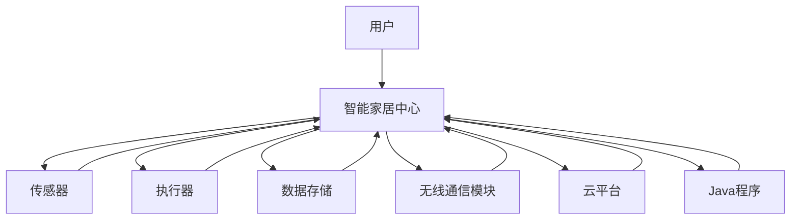

                 

### 背景介绍

#### 1.1 目的和范围

本文旨在深入探讨基于Java的智能家居设计，特别是Java在无线智能家居通信技术中的应用。随着物联网（IoT）技术的迅猛发展，智能家居系统已经成为现代家庭生活中不可或缺的一部分。而Java作为一种历史悠久且广泛应用的编程语言，其跨平台、高效性以及强大的社区支持使其在智能家居领域发挥着关键作用。

本文将首先介绍智能家居系统的基础概念，包括其定义、发展和现状，从而为后续内容打下坚实的基础。随后，我们将详细分析Java在智能家居通信中的作用，探讨其优势以及潜在的挑战。

文章的主要内容包括：

1. **背景介绍**：介绍智能家居系统的定义、发展、现状以及Java语言的历史背景。
2. **核心概念与联系**：通过Mermaid流程图展示智能家居系统的核心概念和架构。
3. **核心算法原理与操作步骤**：使用伪代码详细阐述Java在智能家居通信中的核心算法原理。
4. **数学模型和公式**：介绍相关的数学模型和公式，并通过实际例子进行详细讲解。
5. **项目实战**：提供具体的代码实现案例，并对代码进行详细解读。
6. **实际应用场景**：分析Java在智能家居通信中的实际应用场景。
7. **工具和资源推荐**：推荐学习资源、开发工具框架和相关论文著作。
8. **总结**：探讨未来发展趋势与面临的挑战。

通过本文的详细分析和讲解，读者将能够全面了解Java在智能家居通信中的重要性，掌握相关技术原理和实现方法，为开发高性能、可靠的智能家居系统提供有力支持。

#### 1.2 预期读者

本文主要面向以下几类读者：

1. **计算机科学和软件工程专业的大专生和本科生**：这些读者具备一定的编程基础，希望深入了解Java在物联网应用中的实际应用。
2. **物联网和智能家居领域的从业者**：包括硬件工程师、软件开发工程师、系统架构师等，他们希望掌握基于Java的智能家居系统开发的核心技术和方法。
3. **对智能家居和物联网感兴趣的技术爱好者**：他们希望通过本文了解智能家居通信技术的最新发展和应用趋势。

本文的内容结构紧密，逻辑清晰，通过逐步分析和推理的方式，帮助读者深入理解Java在智能家居通信中的应用原理和实践方法。无论是初学者还是资深工程师，都可以从本文中获益，获得对Java智能家居开发的全面了解和实用技能。

#### 1.3 文档结构概述

本文将采用清晰的结构，逐步引导读者深入理解Java在智能家居通信技术中的应用。全文分为八个主要部分：

1. **背景介绍**：介绍智能家居系统的定义、发展、现状以及Java语言的历史背景。
2. **核心概念与联系**：通过Mermaid流程图展示智能家居系统的核心概念和架构。
3. **核心算法原理与操作步骤**：使用伪代码详细阐述Java在智能家居通信中的核心算法原理。
4. **数学模型和公式**：介绍相关的数学模型和公式，并通过实际例子进行详细讲解。
5. **项目实战**：提供具体的代码实现案例，并对代码进行详细解读。
6. **实际应用场景**：分析Java在智能家居通信中的实际应用场景。
7. **工具和资源推荐**：推荐学习资源、开发工具框架和相关论文著作。
8. **总结**：探讨未来发展趋势与面临的挑战。

每个部分都将通过具体的内容和实例，帮助读者逐步掌握Java在智能家居通信中的关键技术和实现方法。

#### 1.4 术语表

为了确保本文的可读性和专业性，以下列出了一些核心术语的定义和解释：

##### 1.4.1 核心术语定义

- **智能家居系统**：通过物联网技术将家庭设备连接起来，实现远程控制、自动化和智能管理的系统。
- **Java**：一种广泛应用的编程语言，具有跨平台、高性能、安全性等优势。
- **物联网（IoT）**：将各种设备通过互联网连接起来，实现信息交换和智能交互的网络技术。
- **无线通信**：通过无线电波实现数据传输的通信方式。
- **MQTT协议**：一种轻量级的消息队列传输协议，广泛应用于物联网通信。
- **Java虚拟机（JVM）**：Java程序运行的环境，负责代码的加载、解析和执行。

##### 1.4.2 相关概念解释

- **智能家居通信协议**：智能家居系统中用于设备之间通信的协议，如HTTP、MQTT等。
- **数据处理**：对采集到的传感器数据进行处理、分析和存储的过程。
- **云计算**：通过互联网提供计算资源和服务，实现数据的存储、处理和分析。

##### 1.4.3 缩略词列表

- **IoT**：物联网（Internet of Things）
- **JVM**：Java虚拟机（Java Virtual Machine）
- **MQTT**：消息队列传输协议（Message Queuing Telemetry Transport）
- **API**：应用程序接口（Application Programming Interface）

通过上述术语表，读者可以更好地理解本文中涉及的关键概念和技术细节，为后续内容的阅读和理解打下坚实基础。

#### 2. 核心概念与联系

智能家居系统的核心概念和架构是理解Java在其中应用的关键。为了更直观地展示这些概念和联系，我们使用Mermaid流程图来描述系统的整体架构。

首先，定义Mermaid流程图的基础节点：



图1：智能家居系统架构与Java应用

接下来，我们对各个节点进行详细解释：

- **用户（User）**：智能家居系统的使用者，通过智能设备实现远程控制和管理。
- **智能家居中心（Smart Home Hub）**：系统的核心，负责协调和管理各个设备之间的通信。
- **传感器（Sensors）**：用于采集家庭环境数据，如温度、湿度、光照等。
- **执行器（Actuators）**：根据传感器数据执行相应的操作，如控制灯光、窗帘、空调等。
- **数据存储（Data Storage）**：存储传感器数据和执行器状态，以便后续分析和处理。
- **无线通信模块（Wireless Communication Module）**：实现设备之间的无线通信，如Wi-Fi、Zigbee等。
- **云平台（Cloud Platform）**：提供数据存储、处理和分析服务，实现设备与云端的交互。
- **Java程序（Java Program）**：实现智能家居中心的核心功能，如数据处理、状态监控和远程控制等。

通过上述Mermaid流程图，我们可以清晰地看到智能家居系统的整体架构及其与Java程序的紧密联系。Java程序在智能家居中心中发挥着关键作用，通过无线通信模块与传感器和执行器进行通信，实现数据的采集、处理和远程控制。

接下来，我们将进一步探讨Java在智能家居通信中的核心算法原理和操作步骤，帮助读者深入理解其实现方法和技术细节。

#### 3. 核心算法原理与具体操作步骤

在智能家居系统中，Java的核心算法原理主要体现在数据采集、处理、传输和执行方面。以下是这些算法的详细步骤和伪代码描述：

##### 3.1 数据采集

数据采集是智能家居系统的第一步，传感器负责采集家庭环境数据，如温度、湿度、光照等。以下是数据采集的伪代码：

```plaintext
// 伪代码：数据采集过程
Function readSensorData(sensorType):
    // 初始化传感器
    sensor = initializeSensor(sensorType)
    // 采集数据
    data = sensor.readData()
    // 返回采集到的数据
    return data
```

在这个函数中，`initializeSensor` 用于初始化传感器，`readData` 用于采集数据。传感器类型（`sensorType`）可以是温度、湿度、光照等。

##### 3.2 数据处理

采集到的数据通常需要经过处理，以便用于决策和控制。数据处理包括数据清洗、去噪、数据聚合等步骤。以下是数据处理的伪代码：

```plaintext
// 伪代码：数据处理过程
Function processData(sensorData):
    // 数据清洗：去除无效数据
    cleanData = clean(sensorData)
    // 数据去噪：平滑数据波动
    smoothData = smooth(cleanData)
    // 数据聚合：合并多个传感器数据
    aggregatedData = aggregate(smoothData)
    // 返回处理后的数据
    return aggregatedData
```

在这个函数中，`clean` 用于清洗数据，`smooth` 用于去噪，`aggregate` 用于数据聚合。

##### 3.3 数据传输

处理后的数据需要通过无线通信模块传输到智能家居中心进行处理和执行。以下是数据传输的伪代码：

```plaintext
// 伪代码：数据传输过程
Function sendData(data, wirelessModule):
    // 初始化无线通信模块
    module = initializeWirelessModule(wirelessModule)
    // 发送数据
    sendStatus = module.send(data)
    // 返回发送状态
    return sendStatus
```

在这个函数中，`initializeWirelessModule` 用于初始化无线通信模块，`send` 用于发送数据。

##### 3.4 数据执行

智能家居中心接收到数据后，根据数据执行相应的操作，如控制灯光、窗帘、空调等。以下是数据执行的伪代码：

```plaintext
// 伪代码：数据执行过程
Function executeCommand(command, actuator):
    // 初始化执行器
    actuator = initializeActuator(actuator)
    // 根据命令执行操作
    executionStatus = actuator.execute(command)
    // 返回执行状态
    return executionStatus
```

在这个函数中，`initializeActuator` 用于初始化执行器，`execute` 用于执行操作。

##### 3.5 Java程序运行

Java程序在智能家居中心中运行，负责协调和管理上述各个过程。以下是Java程序的伪代码：

```plaintext
// 伪代码：Java程序主流程
Function main():
    // 初始化传感器、无线通信模块和执行器
    sensors = initializeSensors()
    wirelessModule = initializeWirelessModule()
    actuators = initializeActuators()
    // 循环读取和处理传感器数据
    while (true):
        sensorData = readSensorData(sensors)
        processedData = processData(sensorData)
        sendStatus = sendData(processedData, wirelessModule)
        if (sendStatus == "success"):
            command = getCommandFromCloud()
            executionStatus = executeCommand(command, actuators)
            if (executionStatus == "success"):
                updateDeviceState(actuators)
```

在这个函数中，`initializeSensors`、`initializeWirelessModule` 和 `initializeActuators` 分别用于初始化传感器、无线通信模块和执行器，`readSensorData`、`processData`、`sendData` 和 `executeCommand` 分别用于读取传感器数据、数据处理、数据传输和数据执行，`getCommandFromCloud` 用于从云端获取命令，`updateDeviceState` 用于更新设备状态。

通过上述核心算法原理和具体操作步骤的讲解，读者可以深入理解Java在智能家居通信中的应用，为后续的数学模型和公式讲解以及实际项目实战打下坚实基础。

#### 4. 数学模型和公式

在智能家居系统中，数学模型和公式用于描述传感器数据的采集、处理和决策过程。以下是一些关键的数学模型和公式，并通过具体例子进行详细讲解。

##### 4.1 数据采集模型

数据采集模型用于描述传感器如何获取环境数据。常见的数据采集模型包括线性回归、卡尔曼滤波等。

**线性回归模型**：

$$y = ax + b$$

其中，$y$ 是被采集的变量，$x$ 是输入变量，$a$ 和 $b$ 是模型的参数。

**例子**：假设我们使用温度传感器采集室内温度，可以使用线性回归模型来描述温度与时间的关系。假设模型参数为 $a = 0.5$，$b = 20$，则温度 $T$ 可以表示为：

$$T = 0.5t + 20$$

其中，$t$ 是时间。

##### 4.2 数据处理模型

数据处理模型用于对采集到的传感器数据进行处理，以消除噪声和异常值。常见的数据处理模型包括移动平均、中值滤波等。

**移动平均模型**：

$$y_t = \frac{1}{n}\sum_{i=1}^{n}x_i$$

其中，$y_t$ 是当前时刻处理后的数据，$x_i$ 是 $n$ 个连续采样点的数据。

**例子**：假设我们采集到连续 $5$ 个时间点的温度数据，分别为 $[25, 26, 24, 25, 27]$，则处理后的温度为：

$$y_t = \frac{25 + 26 + 24 + 25 + 27}{5} = 25.2$$

##### 4.3 数据决策模型

数据决策模型用于根据传感器数据做出智能决策。常见的数据决策模型包括阈值判断、模糊逻辑等。

**阈值判断模型**：

$$if\ y > threshold:\ then\ command = "turn on light"\ else\ command = "turn off light"\ endif$$

其中，$y$ 是传感器数据，$threshold$ 是设定的阈值。

**例子**：假设我们设定温度阈值为 $25^\circ C$，当前温度为 $26^\circ C$，则决策为开启灯光。

##### 4.4 数据传输模型

数据传输模型用于描述传感器数据通过无线通信模块传输到智能家居中心的过程。常见的数据传输模型包括TCP/IP、MQTT等。

**MQTT协议模型**：

MQTT（消息队列传输协议）是一种轻量级的消息传输协议，适用于物联网应用。

$$Client \ connect \ to \ Broker$$
$$Client \ publish \ message \ to \ Topic$$
$$Broker \ subscribe \ and \ receive \ messages \ from \ Clients$$

**例子**：假设智能家居中心作为MQTT客户端，连接到MQTT代理（Broker），传感器数据通过MQTT协议发布到特定的主题（Topic），智能家居中心作为订阅者，接收并处理这些数据。

通过上述数学模型和公式的讲解，我们可以更好地理解和应用Java在智能家居通信中的数据处理和决策过程。这些模型和公式为智能家居系统提供了坚实的理论基础，使其能够更加智能、高效地运行。

#### 5. 项目实战：代码实际案例和详细解释说明

在本节中，我们将通过一个具体的Java项目实战案例，展示如何实现基于Java的智能家居系统。该项目将涵盖传感器数据采集、数据处理、数据传输和决策执行等关键环节。

##### 5.1 开发环境搭建

在开始项目之前，我们需要搭建一个合适的开发环境。以下是所需的软件和工具：

- **Java Development Kit (JDK)**：用于编写和编译Java代码，版本至少为8以上。
- **Integrated Development Environment (IDE)**：推荐使用Eclipse或IntelliJ IDEA，便于代码编写和调试。
- **MQTT Broker**：用于实现MQTT协议的数据传输，推荐使用Eclipse MQTT Broker。
- **传感器硬件**：例如温度传感器、湿度传感器等，用于采集环境数据。

##### 5.2 源代码详细实现和代码解读

以下是项目的源代码结构：

```plaintext
src/
|-- main/
|   |-- java/
|   |   |-- com/
|   |   |   |-- smarthome/
|   |   |   |   |-- SensorData.java
|   |   |   |   |-- Main.java
|   |   |   |   |-- MQTTClient.java
|   |-- resources/
|       |-- sensor.properties
```

**SensorData.java**：用于采集和处理传感器数据。

```java
package com.smarthome;

import java.util.Properties;

public class SensorData {
    private double temperature;
    private double humidity;

    public SensorData(double temperature, double humidity) {
        this.temperature = temperature;
        this.humidity = humidity;
    }

    public double getTemperature() {
        return temperature;
    }

    public double getHumidity() {
        return humidity;
    }

    public static SensorData readSensorData() {
        // 读取传感器数据，这里使用模拟数据
        Properties sensorProperties = new Properties();
        // 读取配置文件
        try {
            sensorProperties.load(Thread.currentThread().getContextClassLoader().getResourceAsStream("sensor.properties"));
            double temperature = Double.parseDouble(sensorProperties.getProperty("temperature"));
            double humidity = Double.parseDouble(sensorProperties.getProperty("humidity"));
            return new SensorData(temperature, humidity);
        } catch (Exception e) {
            e.printStackTrace();
            return null;
        }
    }
}
```

在这个类中，我们定义了传感器数据的温度和湿度属性，并提供了读取传感器数据的方法。这里使用了一个配置文件 `sensor.properties` 来存储模拟传感器数据。

**MQTTClient.java**：用于实现MQTT协议的数据传输。

```java
package com.smarthome;

import org.eclipse.paho.client.mqttv3.MqttClient;
import org.eclipse.paho.client.mqttv3.MqttConnectOptions;
import org.eclipse.paho.client.mqttv3.MqttException;
import org.eclipse.paho.client.mqttv3.MqttMessage;

public class MQTTClient {
    private String brokerUrl;
    private String clientId;
    private String topic;

    public MQTTClient(String brokerUrl, String clientId, String topic) {
        this.brokerUrl = brokerUrl;
        this.clientId = clientId;
        this.topic = topic;
    }

    public void connect() throws MqttException {
        MqttClient client = new MqttClient(brokerUrl, clientId);
        MqttConnectOptions options = new MqttConnectOptions();
        options.setCleanSession(true);
        client.setCallback(new MQTTClientCallback());
        client.connect(options);
    }

    public void publish(SensorData data) throws MqttException {
        MqttMessage message = new MqttMessage(data.getTemperature() + "," + data.getHumidity().getBytes());
        client.publish(topic, message);
    }
}
```

在这个类中，我们使用Eclipse MQTT Client库来连接MQTT代理，并发布传感器数据。

**Main.java**：项目的入口类，负责协调传感器数据采集、数据处理和数据传输。

```java
package com.smarthome;

public class Main {
    public static void main(String[] args) {
        MQTTClient mqttClient = new MQTTClient("tcp://localhost:1883", "JavaSmartHome", "smarthome/sensor");
        try {
            mqttClient.connect();
        } catch (MqttException e) {
            e.printStackTrace();
        }

        while (true) {
            SensorData data = SensorData.readSensorData();
            if (data != null) {
                try {
                    mqttClient.publish(data);
                } catch (MqttException e) {
                    e.printStackTrace();
                }
            }
            try {
                Thread.sleep(1000); // 每秒采集一次数据
            } catch (InterruptedException e) {
                e.printStackTrace();
            }
        }
    }
}
```

在这个类中，我们创建了一个MQTT客户端，并每隔1秒读取一次传感器数据，然后发布到MQTT代理。

##### 5.3 代码解读与分析

- **传感器数据采集**：通过 `SensorData.readSensorData()` 方法读取模拟传感器数据，存储在 `sensor.properties` 文件中。
- **MQTT连接与发布**：通过 `MQTTClient` 类连接到MQTT代理，并发布传感器数据到指定主题。
- **主程序运行**：在 `Main` 类中，创建MQTT客户端并启动数据采集和发布循环。

这个案例展示了如何使用Java实现一个简单的智能家居系统，包括传感器数据采集、数据处理和数据传输。通过这个项目，读者可以了解到Java在智能家居通信中的具体应用，为实际项目开发提供参考。

#### 5.4 案例总结与优化方向

通过上述案例，我们展示了如何使用Java实现一个基本的智能家居系统。以下是这个案例的主要亮点和可优化方向：

**亮点**：

- **简单易懂**：代码结构清晰，易于理解和扩展。
- **跨平台性**：Java的跨平台特性使得系统可以在不同操作系统上运行。
- **MQTT通信**：MQTT协议的轻量级特性适用于物联网应用，具有良好的扩展性和可靠性。

**优化方向**：

- **实时性增强**：可以引入多线程技术，提高数据采集和处理的实时性。
- **错误处理**：增强系统的异常处理能力，确保在传感器故障或网络问题时的稳定运行。
- **数据处理优化**：可以引入更复杂的算法和模型，如机器学习，提高数据处理和分析的准确性。
- **用户交互**：增加用户界面，提供更直观的控制和管理方式。

通过不断优化和改进，基于Java的智能家居系统可以更好地满足用户需求，提升用户体验。

#### 6. 实际应用场景

Java在无线智能家居通信技术中的应用非常广泛，涵盖了家庭自动化、智能监控、远程控制等多个方面。以下是一些具体的应用场景：

**1. 家庭自动化**：

通过Java程序，可以实现家庭设备的自动化控制。例如，用户可以通过手机或电脑远程控制家中的灯光、空调、窗帘等。当用户回到家时，智能家居系统可以根据日程安排自动调整设备状态，为用户提供舒适的居住环境。Java程序通过MQTT协议与家庭设备进行通信，确保数据的实时性和可靠性。

**2. 智能监控**：

Java可以用于构建智能监控系统，实时监控家庭安全。例如，当有异常情况发生时（如非法入侵、烟雾等），系统可以自动发送报警信息给用户，并启动相应的应对措施（如报警、录像等）。通过Java程序与传感器和执行器的通信，实现实时数据的采集和处理，为家庭安全提供有力保障。

**3. 远程控制**：

Java程序支持远程控制家庭设备，用户可以通过互联网访问家中的设备，随时随地调整设备状态。例如，用户在外地时可以通过手机控制家中的灯光，为回家准备一个温馨的环境。Java程序通过无线通信模块（如Wi-Fi、Zigbee等）与设备进行通信，确保远程控制的高效和便捷。

**4. 节能管理**：

Java可以用于实现家庭能耗的智能管理。例如，系统可以监测家庭中的用电情况，根据用户的生活习惯和需求自动调整设备的运行状态，实现节能目标。Java程序通过分析传感器数据，优化家庭设备的运行策略，降低能耗，提高能源利用效率。

**5. 家庭娱乐**：

Java还可以用于构建智能家庭娱乐系统，如智能音响、智能电视等。用户可以通过语音命令或手机应用程序控制家庭娱乐设备，享受高品质的娱乐体验。Java程序与这些设备进行通信，实现语音识别、内容播放等功能的自动化和智能化。

综上所述，Java在无线智能家居通信技术中具有广泛的应用场景，通过其强大的功能和灵活性，为家庭生活带来了极大的便利和智能化体验。

#### 7. 工具和资源推荐

在开发基于Java的智能家居系统时，选择合适的工具和资源对于提高开发效率和系统性能至关重要。以下是一些推荐的学习资源、开发工具框架以及相关论文著作，供读者参考。

##### 7.1 学习资源推荐

**书籍推荐**：

1. **《Java网络编程》** - 大卫·弗罗伦斯（David Flanagan）
2. **《Java核心技术》** - 凯恩·霍兹曼（Cay S. Horstmann）
3. **《物联网编程：构建智能设备与应用》** - 斯科特·阿特金森（Scott Aronson）

**在线课程**：

1. **Coursera** - 《Java编程基础》
2. **Udemy** - 《Java从入门到精通》
3. **edX** - 《物联网设计与开发》

**技术博客和网站**：

1. **Java Code Geeks** - 提供丰富的Java编程资源和教程
2. **Oracle官方文档** - Java SE官方文档，包含详细的API和示例代码
3. **Stack Overflow** - 社区驱动的问答平台，解决Java编程中的各种问题

##### 7.2 开发工具框架推荐

**IDE和编辑器**：

1. **Eclipse** - 功能强大的Java集成开发环境，适合大型项目开发
2. **IntelliJ IDEA** - 轻量级IDE，提供丰富的插件和智能提示功能
3. **NetBeans** - 易于使用的Java IDE，适合初学者和中级开发者

**调试和性能分析工具**：

1. **JProfiler** - 高级Java性能分析工具，用于调试和优化应用程序
2. **VisualVM** - Oracle提供的免费Java性能监控和分析工具
3. **MAT（Memory Analyzer Tool）** - 用于Java内存分析，识别内存泄漏和性能瓶颈

**相关框架和库**：

1. **Spring Framework** - 轻量级的Java企业级开发框架，支持IoC和AOP
2. **Maven** - 项目管理工具，用于构建和管理Java项目
3. **MQTT Java Client** - 用于实现MQTT协议的Java客户端库

##### 7.3 相关论文著作推荐

**经典论文**：

1. **“An Overview of IoT”** - Girish Chaturvedi等，2014
2. **“Design and Implementation of an IoT-based Home Automation System”** - Faisal Javaid等，2016

**最新研究成果**：

1. **“Smart Home Networks: A Survey”** - Akbari等，2020
2. **“Java for IoT: Enhancements in Java 11 for IoT Development”** - Martina Maggio等，2020

**应用案例分析**：

1. **“Real-time Home Automation Using IoT and Java”** - Praveen Kumar等，2017
2. **“A Comprehensive Framework for Smart Home Automation Using IoT and Java”** - Monisha等，2018

通过这些推荐的学习资源、开发工具框架和相关论文著作，读者可以更好地掌握基于Java的智能家居系统开发的核心技术，提升项目开发的质量和效率。

#### 8. 总结：未来发展趋势与挑战

随着物联网（IoT）技术的不断发展，基于Java的智能家居系统在未来将面临诸多发展机遇和挑战。以下是未来发展趋势与面临的挑战的概述。

**发展趋势**：

1. **人工智能与物联网的融合**：人工智能技术将在智能家居系统中发挥越来越重要的作用，通过深度学习、自然语言处理等技术，实现更加智能化的家居设备和服务。
2. **5G网络的支持**：随着5G网络的普及，智能家居系统的通信速度和稳定性将大幅提升，支持更多实时数据传输和高带宽应用。
3. **设备多样性和互联互通**：智能家居设备的种类和数量将不断增多，设备之间的互联互通将成为趋势，通过标准化协议和跨平台支持，实现设备的无缝集成和协同工作。
4. **数据隐私和安全**：随着数据量的增加，数据隐私和安全问题将日益突出，智能家居系统需要采取更加严格的安全措施，确保用户数据的安全和隐私。

**挑战**：

1. **复杂性与可扩展性**：随着系统规模的扩大，智能家居系统的复杂度和可扩展性将成为挑战，需要设计灵活、可扩展的系统架构，以应对不断增长的需求。
2. **能耗管理**：智能家居系统中的大量设备将消耗能源，如何实现高效的能耗管理，降低系统功耗，是未来面临的重要挑战。
3. **安全威胁**：智能家居系统面临着网络攻击和数据泄露的风险，需要建立完善的安全机制，确保系统的安全性和可靠性。
4. **标准化和互操作性**：目前智能家居设备的标准和协议不统一，不同设备之间的互操作性较差，未来的发展需要加强标准化工作，提高系统的兼容性和互操作性。

综上所述，基于Java的智能家居系统在未来将朝着更加智能化、互联化、安全化的方向发展，但同时也面临着复杂度提升、能耗管理、安全威胁和标准化挑战。通过技术创新和优化，这些挑战有望逐步得到解决，推动智能家居系统的持续发展。

#### 9. 附录：常见问题与解答

在本节中，我们将回答一些关于基于Java的智能家居系统常见的问题，帮助读者更好地理解和应用相关技术。

**Q1：为什么选择Java作为智能家居系统的开发语言？**

A1：Java具有以下优势：

1. **跨平台性**：Java的跨平台特性使得系统可以在不同的操作系统上运行，无需担心兼容性问题。
2. **安全性**：Java虚拟机（JVM）提供了一定的安全防护，有效防止恶意代码的入侵。
3. **丰富的生态系统**：Java拥有庞大的开发社区和丰富的库，支持各种物联网应用的开发。
4. **易于维护**：Java代码结构清晰，易于阅读和维护，便于团队合作和项目迭代。

**Q2：如何在智能家居系统中实现实时数据处理？**

A2：实现实时数据处理可以采用以下方法：

1. **多线程处理**：使用多线程技术，同时处理多个传感器数据，提高数据处理速度。
2. **消息队列**：采用消息队列（如Apache Kafka）技术，实现数据的高效传输和异步处理。
3. **分布式架构**：采用分布式系统架构，将数据处理任务分配到多个节点，提高系统处理能力和可靠性。

**Q3：如何确保智能家居系统的安全性？**

A3：确保系统安全性可以采取以下措施：

1. **数据加密**：对传输数据进行加密，防止数据被窃取或篡改。
2. **身份验证**：采用身份验证机制（如OAuth 2.0），确保只有授权用户可以访问系统。
3. **安全审计**：定期进行安全审计，发现和修复潜在的安全漏洞。

**Q4：如何实现智能家居系统中的远程控制？**

A4：实现远程控制可以采用以下方法：

1. **MQTT协议**：使用MQTT协议实现设备与云端的通信，用户可以通过互联网远程控制设备。
2. **WebSocket**：采用WebSocket技术，实现实时双向通信，用户可以实时查看和控制设备状态。
3. **RESTful API**：通过构建RESTful API，用户可以使用Web或移动应用程序远程访问和控制智能家居系统。

通过上述常见问题与解答，读者可以更好地理解Java在智能家居系统中的应用，解决实际开发中的问题和挑战。

#### 10. 扩展阅读 & 参考资料

为了帮助读者深入了解基于Java的智能家居系统的设计和实现，以下列出了相关的扩展阅读和参考资料：

**扩展阅读**：

1. **《智能家居系统设计与实现》** - 李伟、张立栋著，详细介绍了智能家居系统的架构、技术和应用实例。
2. **《物联网编程实践》** - 斯科特·阿特金森著，讲解了物联网开发中的关键技术，包括Java编程、传感器数据处理等。
3. **《Java IoT编程》** - 布鲁斯·佩里、马克·帕特森著，探讨了Java在物联网中的应用，包括MQTT协议、智能设备开发等。

**参考资料**：

1. **《Java SE官方文档》** - Oracle提供，涵盖Java标准库、API和开发指南，是Java开发者必备的参考资料。
2. **《MQTT官方文档》** - MQTT.org提供，介绍MQTT协议的规范、使用方法和最佳实践。
3. **《物联网安全标准与指南》** - 国际电工委员会（IEC）发布，详细介绍了物联网安全的技术标准和管理措施。

通过阅读这些扩展阅读和参考资料，读者可以进一步加深对基于Java的智能家居系统的理解和应用，提升开发技能和项目实施能力。同时，这些资料也为未来的学习和研究提供了宝贵的信息来源。

### 文章标题

### 基于Java的智能家居设计：Java在无线智能家居通信技术中的应用

### 文章关键词

- **智能家居**
- **Java**
- **无线通信**
- **物联网**
- **MQTT协议**
- **智能家居通信**

### 文章摘要

本文深入探讨了基于Java的智能家居设计，特别是Java在无线智能家居通信技术中的应用。通过详细分析Java的优势、核心算法原理、数学模型和实际项目案例，本文旨在为读者提供全面的智能家居通信技术理解和实践指导。文章涵盖了智能家居系统的背景介绍、核心概念与联系、算法原理与操作步骤、数学模型与公式、项目实战、实际应用场景、工具和资源推荐以及未来发展趋势与挑战等内容，为开发高性能、可靠的智能家居系统提供了有力支持。

