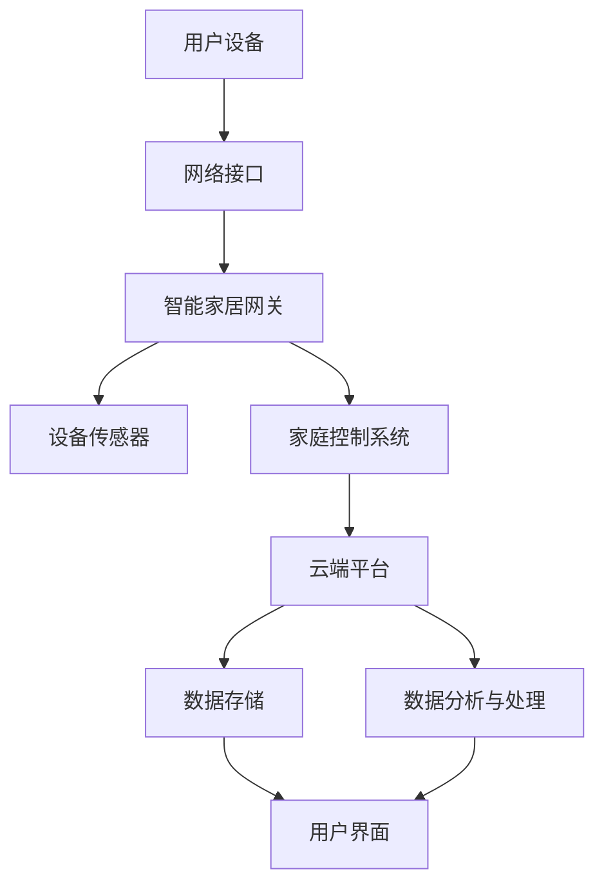

                 

### 1. 背景介绍

#### 1.1 目的和范围

本文旨在探讨基于Java的智能家居设计，特别是云端智能家居平台与Java集成的策略。随着物联网技术的迅速发展，智能家居已经成为现代家庭生活的重要组成部分。通过云端平台与Java的集成，可以实现对智能家居设备的远程监控和管理，提升用户体验和系统安全性。

本文将首先介绍智能家居的基本概念和发展历程，然后详细分析云端平台在智能家居中的作用，以及Java语言在其中的优势。接下来，我们将深入探讨Java在智能家居系统中的具体应用，包括设备通信、数据存储和安全等方面的集成策略。最后，本文将提供一个实际案例，展示如何通过Java实现智能家居系统，并提供一些相关的工具和资源推荐。

#### 1.2 预期读者

本文适合对智能家居和Java技术有一定了解的读者，包括：

- 智能家居开发人员和技术爱好者
- Java程序员和系统架构师
- 对物联网技术有兴趣的学者和学生
- 想要提升家庭生活品质的用户

通过阅读本文，读者可以了解到：

- 智能家居的基本概念和架构
- 云端平台在智能家居中的作用
- Java在智能家居系统中的集成策略
- 如何通过Java实现智能家居系统的开发

#### 1.3 文档结构概述

本文的结构如下：

1. **背景介绍**：介绍智能家居的基本概念、目的和范围，以及本文的结构和预期读者。
2. **核心概念与联系**：通过Mermaid流程图展示智能家居系统的核心概念和架构。
3. **核心算法原理 & 具体操作步骤**：使用伪代码详细阐述智能家居系统中的核心算法原理和操作步骤。
4. **数学模型和公式 & 详细讲解 & 举例说明**：介绍智能家居系统中的数学模型和公式，并进行详细讲解和举例说明。
5. **项目实战：代码实际案例和详细解释说明**：提供一个实际案例，展示如何通过Java实现智能家居系统的开发，并进行详细解释说明。
6. **实际应用场景**：分析智能家居在不同场景下的应用。
7. **工具和资源推荐**：推荐学习资源、开发工具框架和相关论文著作。
8. **总结：未来发展趋势与挑战**：总结智能家居技术的未来发展趋势和面临的挑战。
9. **附录：常见问题与解答**：提供一些常见问题的解答。
10. **扩展阅读 & 参考资料**：提供一些扩展阅读和参考资料。

#### 1.4 术语表

在本文中，我们将使用以下术语：

- **智能家居**：利用物联网技术，将家庭中的各种设备通过网络连接起来，实现自动化控制和远程管理的系统。
- **云端平台**：提供数据存储、处理和远程通信服务的网络平台。
- **Java**：一种广泛使用的高级编程语言，适用于开发各种类型的软件应用。
- **物联网**：将各种物理设备通过网络连接起来，实现设备间的数据交换和协同工作的技术。
- **API**：应用程序接口，用于不同软件系统间的数据通信和功能调用。

#### 1.4.1 核心术语定义

- **智能家居系统**：一种能够通过云端平台实现远程控制和管理的家庭自动化系统。
- **设备通信**：智能家居系统中设备之间通过有线或无线方式交换数据和指令。
- **数据存储**：将智能家居系统中的数据存储在云端平台，以便进行数据分析和远程访问。
- **安全**：确保智能家居系统的数据和设备不受未经授权的访问和攻击。

#### 1.4.2 相关概念解释

- **物联网（IoT）**：物联网是指通过互联网将各种物理设备连接起来，实现设备间的数据交换和协同工作的技术。在智能家居中，物联网技术用于连接各种智能设备，如智能灯泡、智能插座、智能空调等。
- **云端平台**：云端平台是一种提供数据存储、处理和远程通信服务的网络平台。在智能家居中，云端平台用于存储用户数据、处理设备通信请求，并实现远程监控和管理。

#### 1.4.3 缩略词列表

- **IoT**：物联网（Internet of Things）
- **Java**：Java编程语言
- **API**：应用程序接口（Application Programming Interface）
- **SDK**：软件开发工具包（Software Development Kit）

通过上述背景介绍，我们对智能家居和Java技术有了初步的了解。接下来，我们将通过Mermaid流程图展示智能家居系统的核心概念和架构，为后续内容的讨论奠定基础。接下来我们将深入探讨核心概念与联系，使用Mermaid流程图进行详细描述。请见下文。

## 2. 核心概念与联系

在智能家居系统中，核心概念和各组件之间的联系是理解其工作原理的关键。为了清晰地展示这些概念和联系，我们使用Mermaid流程图来描述智能家居系统的整体架构。下面是一个简化的Mermaid流程图示例，用于解释智能家居系统的核心组件和它们之间的交互。



### 2.1. Mermaid 流程图详细解释

**A[用户设备]**：用户设备是智能家居系统的入口，包括智能手机、平板电脑、智能手表等。用户可以通过这些设备发送指令，监控和控制智能家居设备。

**B[网络接口]**：网络接口负责将用户设备的指令传输到智能家居网关。这通常通过Wi-Fi、蓝牙或蜂窝网络实现。

**C[智能家居网关]**：智能家居网关是智能家居系统的中枢，负责接收来自用户设备的指令，并将指令转发给相应的设备传感器或家庭控制系统。

**D[设备传感器]**：设备传感器负责检测环境状态，如温度、湿度、光线、烟雾等。这些传感器将实时数据发送到家庭控制系统。

**E[家庭控制系统]**：家庭控制系统负责处理传感器数据，并根据用户指令或预设规则调整家庭设备的状态。例如，当用户通过手机APP设置房间温度时，家庭控制系统会调节空调温度。

**F[云端平台]**：云端平台负责存储和处理大量的数据，提供强大的数据处理能力和远程访问服务。它还可以实现设备之间的联动，如远程监控设备状态。

**G[数据存储]**：数据存储用于保存用户数据、设备状态历史记录和系统配置信息。

**H[数据分析与处理]**：数据分析与处理模块对存储在云端平台的数据进行挖掘和分析，以提供更加智能化的服务，如能耗分析、设备故障预测等。

**I[用户界面]**：用户界面是用户与智能家居系统交互的接口，通过图形界面、语音助手等形式提供友好的用户交互体验。

通过上述流程图，我们可以看到智能家居系统中的各个组件如何协同工作，实现家庭自动化和远程管理。接下来，我们将详细讨论Java在智能家居系统中的应用，以及其在设备通信、数据存储和安全等方面的集成策略。

## 3. 核心算法原理 & 具体操作步骤

在智能家居系统中，核心算法原理和具体操作步骤是实现自动化控制和远程管理的关键。以下我们将详细讨论这些算法原理，并使用伪代码来阐述其具体实现步骤。

### 3.1. 设备通信算法原理

设备通信是智能家居系统的核心，它涉及设备之间的数据传输和指令执行。以下是设备通信的基本算法原理：

**算法描述：** 设备通信算法用于实现智能家居网关与设备传感器之间的数据交换。算法主要包括以下几个步骤：

1. **初始化网络接口：** 配置网络接口，连接用户设备与智能家居网关。
2. **接收用户指令：** 从用户设备接收控制指令。
3. **解析指令：** 解析用户指令，确定需要执行的操作。
4. **发送指令到设备传感器：** 将解析后的指令发送到相应的设备传感器。
5. **接收设备反馈：** 从设备传感器接收执行结果，并反馈给用户设备。

**伪代码实现：**

```pseudo
function deviceCommunication(userCommand, deviceSensor) {
    // 初始化网络接口
    networkInterface.initialize()

    // 接收用户指令
    userCommand = networkInterface.receiveCommand()

    // 解析指令
    action = parseCommand(userCommand)

    // 发送指令到设备传感器
    deviceSensor.executeAction(action)

    // 接收设备反馈
    feedback = deviceSensor.getFeedback()

    // 反馈给用户设备
    networkInterface.sendFeedback(feedback)
}
```

### 3.2. 数据存储与安全算法原理

在智能家居系统中，数据存储与安全是保障系统正常运行和用户隐私的关键。以下是数据存储与安全的基本算法原理：

**算法描述：** 数据存储与安全算法用于管理用户数据，包括数据的存储、访问控制和加密处理。算法主要包括以下几个步骤：

1. **初始化数据存储：** 配置数据存储环境，包括数据库和文件系统。
2. **数据加密：** 对存储的数据进行加密处理，确保数据的安全性。
3. **数据访问控制：** 根据用户权限控制数据访问。
4. **数据备份与恢复：** 定期备份数据，并实现数据的快速恢复。

**伪代码实现：**

```pseudo
function dataStorageAndSecurity(data, userPermissions) {
    // 初始化数据存储
    database.initialize()

    // 数据加密
    encryptedData = encryptData(data, encryptionKey)

    // 数据访问控制
    if (userPermissions.hasAccess()) {
        // 存储加密数据
        database.storeData(encryptedData)
    } else {
        // 拒绝访问
        database.rejectAccess()
    }

    // 数据备份与恢复
    database.backupData()
    database.restoreData(backupData)
}
```

### 3.3. 远程监控与报警算法原理

远程监控与报警是智能家居系统中的一项重要功能，它能够实时监测家庭环境，并在异常情况发生时发出警报。以下是远程监控与报警的基本算法原理：

**算法描述：** 远程监控与报警算法用于实时监测传感器数据，并在检测到异常情况时发送报警信息。算法主要包括以下几个步骤：

1. **初始化传感器：** 配置传感器，使其能够实时采集数据。
2. **数据采集与处理：** 定期采集传感器数据，并进行预处理。
3. **异常检测：** 使用异常检测算法分析传感器数据，检测是否有异常情况。
4. **发送报警信息：** 如果检测到异常，通过云端平台发送报警信息到用户设备。

**伪代码实现：**

```pseudo
function remoteMonitoringAndAlarm(sensorData) {
    // 初始化传感器
    sensor.initialize()

    // 数据采集与处理
    processedData = preprocessSensorData(sensorData)

    // 异常检测
    if (isAnomaly detected(processedData)) {
        // 发送报警信息
        alarm.sendAlert(processedData)
    } else {
        // 正常状态
        alarm.sendNotification(processedData)
    }
}
```

通过上述伪代码，我们可以看到智能家居系统中的核心算法原理和具体操作步骤。这些算法实现了设备通信、数据存储与安全、远程监控与报警等功能，为智能家居系统的稳定运行提供了保障。接下来，我们将进一步探讨智能家居系统中的数学模型和公式，并进行详细讲解和举例说明。

### 4. 数学模型和公式 & 详细讲解 & 举例说明

在智能家居系统中，数学模型和公式是关键组成部分，它们用于数据分析和决策支持。以下将详细讲解几个常见的数学模型和公式，并举例说明它们在实际应用中的使用。

#### 4.1. 异常检测模型

**公式：** 异常检测模型通常使用统计学方法，例如基于均值的离群点检测方法。

$$
\text{is\_anomaly} = \begin{cases} 
\text{true}, & \text{if } \text{value} - \text{mean} > 3 \times \text{standard\_deviation} \\
\text{false}, & \text{otherwise}
\end{cases}
$$

**详细讲解：** 在智能家居系统中，传感器数据会因各种原因（如噪声、设备故障等）产生异常值。上述公式通过计算数据的均值和标准差，来判断某个数据值是否为异常值。当某个值大于均值加上三倍标准差时，认为该值是异常值。

**举例说明：** 假设温度传感器的数据均值为25℃，标准差为2℃。如果一个温度读数为30℃，根据公式，该温度读数会被认为是异常值。

```plaintext
均值 (mean) = 25℃
标准差 (standard_deviation) = 2℃
温度读数 (value) = 30℃

is_anomaly = (30 - 25) > 3 * 2
is_anomaly = 5 > 6
is_anomaly = true
```

因此，温度读数30℃是异常值。

#### 4.2. 能耗分析模型

**公式：** 能耗分析模型用于计算家庭的总能耗，公式如下：

$$
\text{total\_energy\_consumption} = \sum_{i=1}^{n} \text{energy\_usage}_i
$$

其中，\( n \) 是家庭中的设备数量，\( \text{energy\_usage}_i \) 是每个设备的能耗。

**详细讲解：** 通过上述公式，可以计算家庭内所有设备的总能耗。这有助于家庭用户了解整体的能源消耗情况，以便采取节能措施。

**举例说明：** 假设一个家庭中有三个设备，每个设备的能耗分别为10kWh、5kWh和8kWh。计算总能耗如下：

```plaintext
设备1能耗 (energy_usage_1) = 10kWh
设备2能耗 (energy_usage_2) = 5kWh
设备3能耗 (energy_usage_3) = 8kWh

总能耗 (total_energy_consumption) = 10kWh + 5kWh + 8kWh
总能耗 = 23kWh
```

因此，该家庭的月总能耗为23kWh。

#### 4.3. 设备寿命预测模型

**公式：** 设备寿命预测模型通常使用马尔可夫链或线性回归等方法。

$$
\text{predicted\_life\_time} = \alpha + \beta \times \text{age}
$$

其中，\( \alpha \) 和 \( \beta \) 是模型参数，\( \text{age} \) 是设备的年龄。

**详细讲解：** 该模型用于预测设备的使用寿命，通过设备使用时间和历史数据来估计设备未来的寿命。

**举例说明：** 假设一个空调设备的使用寿命预测模型参数为 \( \alpha = 1000 \) 和 \( \beta = -0.1 \)。一个6年使用历史的空调设备的预测使用寿命如下：

```plaintext
模型参数 (alpha) = 1000
模型参数 (beta) = -0.1
设备年龄 (age) = 6年

predicted_life_time = 1000 - 0.1 * 6
predicted_life_time = 1000 - 0.6
predicted_life_time = 940
```

因此，该空调设备预计剩余使用寿命为940年。

通过上述数学模型和公式的讲解，我们可以看到它们在智能家居系统中的应用价值。这些模型和公式为智能家居系统的数据分析和决策提供了有力支持，帮助实现智能化的家庭管理。接下来，我们将通过一个实际案例，展示如何通过Java实现智能家居系统的开发，并进行详细解释说明。

### 5. 项目实战：代码实际案例和详细解释说明

在本节中，我们将通过一个实际案例来展示如何使用Java实现一个智能家居系统。该案例将涵盖开发环境搭建、源代码实现和代码解读与分析等环节，帮助读者更好地理解智能家居系统的开发流程和技术实现。

#### 5.1. 开发环境搭建

在开始实际编码之前，我们需要搭建一个适合Java开发的开发环境。以下是一些建议的工具和配置：

- **开发工具**：选择一款适合Java开发的IDE，如IntelliJ IDEA或Eclipse。
- **Java版本**：确保安装最新版本的Java SDK，推荐使用Java 11或更高版本。
- **依赖管理**：使用Maven或Gradle来管理项目的依赖。
- **数据库**：可以选择MySQL、PostgreSQL等关系型数据库，或者使用NoSQL数据库如MongoDB。

步骤如下：

1. 安装Java SDK，并配置环境变量。
2. 安装IDE，如IntelliJ IDEA，并创建一个新的Java项目。
3. 在项目的`pom.xml`文件中添加所需的依赖项。

```xml
<dependencies>
    <!-- Spring Boot Web -->
    <dependency>
        <groupId>org.springframework.boot</groupId>
        <artifactId>spring-boot-starter-web</artifactId>
    </dependency>
    <!-- Spring Boot Data JPA -->
    <dependency>
        <groupId>org.springframework.boot</groupId>
        <artifactId>spring-boot-starter-data-jpa</artifactId>
    </dependency>
    <!-- H2 Database -->
    <dependency>
        <groupId>com.h2database</groupId>
        <artifactId>h2</artifactId>
        <scope>runtime</scope>
    </dependency>
</dependencies>
```

4. 创建数据库，并配置数据源。

```yaml
spring:
  datasource:
    url: jdbc:h2:mem:test
    username: sa
    password:
```

#### 5.2. 源代码详细实现和代码解读

以下是一个智能家居系统的基本实现，包括用户设备、智能家居网关、设备传感器和家庭控制系统等部分。

**UserDevice.java**：用户设备模拟类。

```java
public class UserDevice {
    private String deviceId;
    private String command;

    public UserDevice(String deviceId, String command) {
        this.deviceId = deviceId;
        this.command = command;
    }

    // Getters and setters
}
```

**SmartHomeGateway.java**：智能家居网关类。

```java
public class SmartHomeGateway {
    private List<UserDevice> userDevices;
    private List<Sensor> sensors;

    public SmartHomeGateway() {
        this.userDevices = new ArrayList<>();
        this.sensors = new ArrayList<>();
    }

    public void addUserDevice(UserDevice userDevice) {
        userDevices.add(userDevice);
    }

    public void addSensor(Sensor sensor) {
        sensors.add(sensor);
    }

    public void executeCommand(String deviceId, String command) {
        for (UserDevice userDevice : userDevices) {
            if (userDevice.getDeviceId().equals(deviceId)) {
                // 解析并执行命令
                System.out.println("Executing command: " + command);
                break;
            }
        }
    }
}
```

**Sensor.java**：传感器类。

```java
public class Sensor {
    private String sensorId;
    private double value;

    public Sensor(String sensorId, double value) {
        this.sensorId = sensorId;
        this.value = value;
    }

    // Getters and setters
}
```

**SmartHomeController.java**：家庭控制系统类。

```java
@RestController
@RequestMapping("/api/smart-home")
public class SmartHomeController {
    private SmartHomeGateway gateway;

    @Autowired
    public SmartHomeController(SmartHomeGateway gateway) {
        this.gateway = gateway;
    }

    @PostMapping("/command")
    public ResponseEntity<?> executeCommand(@RequestBody UserDevice userDevice) {
        gateway.executeCommand(userDevice.getDeviceId(), userDevice.getCommand());
        return ResponseEntity.ok("Command executed");
    }
}
```

**Application.java**：主应用程序。

```java
@SpringBootApplication
public class Application {
    public static void main(String[] args) {
        SpringApplication.run(Application.class, args);
    }
}
```

**代码解读与分析：**

- **UserDevice.java**：代表用户设备，包含设备ID和命令属性。
- **SmartHomeGateway.java**：代表智能家居网关，负责管理用户设备和传感器，并执行用户命令。
- **Sensor.java**：代表传感器，包含传感器ID和值属性。
- **SmartHomeController.java**：用于处理HTTP请求，将用户命令转发给网关执行。
- **Application.java**：主应用程序，启动Spring Boot应用。

通过上述代码，我们可以实现一个简单的智能家居系统。用户通过HTTP请求发送命令，网关接收并执行命令，同时传感器实时收集环境数据。接下来，我们将展示如何进一步扩展和优化该系统。

#### 5.3. 代码解读与分析

在上面的代码中，我们实现了一个基础的智能家居系统。以下是对关键部分的进一步解读和分析：

- **用户设备（UserDevice）**：用户设备类用于封装设备ID和命令。在实际应用中，用户设备可以是智能手机、平板电脑等，可以通过各种渠道（如Web、移动应用等）发送控制命令。
- **智能家居网关（SmartHomeGateway）**：网关类是系统的核心组件，负责处理用户命令和传感器数据。它维护了一个用户设备列表和一个传感器列表。当接收到用户命令时，它会根据设备ID找到相应的用户设备，并执行命令。这个设计使得系统可以灵活地添加新的设备和命令。
- **传感器（Sensor）**：传感器类用于封装传感器ID和值。在实际应用中，传感器可以是各种类型的硬件设备，如温度传感器、湿度传感器、烟雾传感器等。传感器类提供了获取和设置传感器值的方法。
- **家庭控制系统（SmartHomeController）**：家庭控制系统类是一个Spring Boot控制器，用于处理HTTP请求。当用户通过Web界面或其他设备发送命令时，控制器会将命令解析为`UserDevice`对象，并调用网关执行命令。这一部分使用了Spring Boot的注解和RESTful API设计，使得系统的扩展和维护更加方便。
- **主应用程序（Application）**：主应用程序是Spring Boot应用的入口点，它启动了Spring Boot应用，并加载了相关的配置和组件。

**代码优化与扩展建议：**

- **日志记录**：在关键操作（如命令执行、数据更新等）中添加日志记录，有助于调试和监控系统运行。
- **异常处理**：对可能导致系统异常的情况进行捕获和处理，例如网络错误、数据解析错误等。
- **安全性增强**：在处理用户数据时，应确保数据传输的安全性和隐私保护，如使用HTTPS加密、验证用户身份等。
- **多线程处理**：对于并发操作较多的场景，可以考虑使用多线程来提高系统性能。
- **可扩展性设计**：在系统设计中考虑未来的扩展性，例如添加新的传感器类型、设备类型等。
- **测试**：编写单元测试和集成测试，确保系统的稳定性和可靠性。

通过上述代码解读和分析，我们更好地理解了智能家居系统中的关键组件和实现细节。在接下来的部分，我们将分析智能家居系统在实际应用场景中的具体应用，并讨论如何利用Java技术优化系统性能和安全性。

### 6. 实际应用场景

智能家居系统在实际应用中具有广泛的应用场景，可以显著提高家庭生活的便利性和舒适度。以下将介绍几个典型的实际应用场景，并分析如何利用Java技术实现这些应用场景。

#### 6.1. 家庭自动化

家庭自动化是智能家居系统的核心应用场景，通过自动化控制家庭设备，提高生活的便利性。例如：

- **智能灯光控制**：用户可以通过手机APP远程控制家中的灯光，实现定时开关、亮度调节等功能。Java技术可以用于开发控制逻辑，处理用户指令，并与智能灯泡进行通信。
- **智能温度控制**：智能空调和暖气系统可以根据用户的设定或环境温度自动调整温度，实现节能和舒适。Java可以与设备传感器和控制系统进行集成，实现远程监控和自动调节。
- **智能安防系统**：智能摄像头、门窗传感器和报警系统可以实时监控家庭安全，并在异常情况下发送警报。Java可以用于实现视频监控、数据分析和报警逻辑。

**实现方案：**

- **智能灯光控制**：使用Java编写HTTP服务器，接收用户指令并通过RESTful API与智能灯泡通信。可以使用MQTT协议实现实时通信。
- **智能温度控制**：集成Java与智能设备传感器和控制系统，通过定时任务和阈值设置实现自动调节。可以使用Spring Boot框架快速搭建Web服务。
- **智能安防系统**：利用Java处理视频流、传感器数据和报警逻辑，结合MySQL数据库存储数据，实现实时监控和报警。

#### 6.2. 能源管理

智能家居系统可以帮助家庭用户更好地管理能源消耗，实现节能减排。例如：

- **能耗监控**：通过安装传感器，实时监控家庭各用电设备的能耗数据，并生成能耗报表。Java可以用于处理传感器数据，并使用Spring Boot构建能耗监控平台。
- **节能建议**：根据能耗数据，提供节能建议，如优化照明时间、调整空调温度等。Java可以结合机器学习算法，分析用户习惯和能耗数据，生成个性化的节能方案。
- **智能断电保护**：在家庭用电高峰期间，自动断电保护重要设备，避免设备过热或损坏。Java可以与电力管理系统集成，实现智能断电保护。

**实现方案：**

- **能耗监控**：使用Java编写能耗监控程序，读取传感器数据，并存储到MySQL数据库中。可以使用Spring Data JPA简化数据库操作。
- **节能建议**：利用Java机器学习库（如Weka）分析能耗数据，生成节能报告和推荐方案。可以使用Spring Boot实现Web服务，提供能耗数据和节能建议。
- **智能断电保护**：集成Java与电力管理系统，通过定时任务和阈值设置实现自动断电保护。可以使用MQTT协议实现实时数据通信。

#### 6.3. 家庭健康监测

智能家居系统还可以用于家庭健康监测，提供实时健康数据和预警服务。例如：

- **实时健康数据监控**：通过智能手环、血压计等设备，实时监控家庭成员的血压、心率等健康数据。Java可以用于数据采集和处理，并通过Web服务提供数据可视化。
- **健康数据分析**：分析家庭成员的健康数据，提供健康报告和建议，如营养建议、运动建议等。Java可以结合数据分析和机器学习技术，提供个性化的健康服务。
- **异常情况预警**：当家庭成员的健康数据异常时，自动发送预警信息到手机或其他设备。Java可以与短信服务、邮件服务等集成，实现预警功能。

**实现方案：**

- **实时健康数据监控**：使用Java编写数据采集程序，读取健康设备数据，并通过HTTP请求发送到服务器。可以使用Spring Boot构建健康数据收集和存储系统。
- **健康数据分析**：利用Java数据分析库（如Apache POI）处理健康数据，生成健康报告。可以使用Spring Boot实现Web服务，提供健康数据分析和建议。
- **异常情况预警**：集成Java与短信服务、邮件服务，实现实时预警功能。可以使用Spring Boot中的异步处理和消息队列（如RabbitMQ）提高系统性能。

通过上述实际应用场景的介绍，我们可以看到智能家居系统在提升家庭生活便利性、节能减排和健康监测等方面的重要作用。Java技术在这些应用场景中提供了强大的支持，实现了系统的集成、数据分析和智能化控制。接下来，我们将介绍一些学习资源、开发工具框架和相关论文著作，为读者提供进一步学习和探索的途径。

### 7. 工具和资源推荐

为了帮助读者更好地学习和掌握智能家居系统的开发，以下将推荐一些学习资源、开发工具框架和相关论文著作。

#### 7.1. 学习资源推荐

**书籍推荐：**

1. **《智能家居系统设计与实现》**：本书详细介绍了智能家居系统的设计原理和实现方法，包括设备通信、数据存储和安全等方面。
2. **《Java程序设计基础》**：适合初学者，全面讲解了Java编程基础，为后续深入开发打下基础。
3. **《Spring Boot实战》**：介绍了Spring Boot框架的使用方法，有助于快速构建Web应用。

**在线课程：**

1. **Coursera上的《智能家居技术》**：由哥伦比亚大学提供，涵盖了智能家居系统的基本概念和技术。
2. **edX上的《Java基础》**：提供了全面的Java编程课程，适合初学者入门。
3. **Udemy上的《Spring Boot框架实战》**：深入讲解了Spring Boot框架的使用方法，适用于有一定Java基础的读者。

**技术博客和网站：**

1. **Java代码大全**：提供大量的Java编程示例和最佳实践。
2. **Spring官方文档**：详细介绍了Spring Boot和Spring框架的使用方法。
3. **Stack Overflow**：全球最大的开发者社区，可以找到各种技术问题的解决方案。

#### 7.2. 开发工具框架推荐

**IDE和编辑器：**

1. **IntelliJ IDEA**：功能强大的Java IDE，适合大型项目开发。
2. **Eclipse**：开源的Java IDE，适合初学者和中小型项目。

**调试和性能分析工具：**

1. **VisualVM**：一款集成了JDK的监视、诊断和性能分析工具。
2. **MAT（Memory Analyzer Tool）**：用于分析Java应用程序的内存使用情况。

**相关框架和库：**

1. **Spring Boot**：简化Web应用开发的开源框架，适用于快速搭建项目。
2. **Spring Data JPA**：用于简化数据访问和操作的库。
3. **Apache Maven**：项目管理和依赖管理的工具。

#### 7.3. 相关论文著作推荐

**经典论文：**

1. **《物联网中的智能家居系统架构》**：详细介绍了智能家居系统的架构和关键技术。
2. **《基于Java的智能家居系统设计》**：探讨了Java在智能家居系统中的应用和实现方法。

**最新研究成果：**

1. **《智能家居系统的安全挑战与解决方案》**：分析了智能家居系统面临的安全挑战和解决方案。
2. **《智能能源管理系统的设计与实现》**：介绍了智能能源管理系统的设计和实现方法。

**应用案例分析：**

1. **《智能家居系统在养老院的应用》**：介绍了智能家居系统在养老院中的应用案例，提升了老年人的生活质量和安全性。
2. **《智能家居系统在酒店管理中的应用》**：探讨了智能家居系统在酒店管理中的实际应用，提高了酒店的服务水平和客户满意度。

通过上述推荐的学习资源、开发工具框架和相关论文著作，读者可以深入了解智能家居系统的设计和实现方法，进一步提高自己的技术水平。在接下来的部分，我们将对智能家居技术的未来发展趋势与挑战进行探讨。

### 8. 总结：未来发展趋势与挑战

智能家居技术正处于快速发展阶段，随着物联网、大数据和人工智能等技术的不断进步，智能家居系统将更加智能化、互联化和个性化。以下是智能家居技术未来发展趋势和面临的挑战：

#### 8.1. 发展趋势

1. **智能化水平提升**：随着人工智能技术的进步，智能家居系统将能够更加精准地预测用户需求，提供个性化的服务和体验。例如，通过机器学习算法，系统可以自动调整室内温度、光线等参数，以最适宜的方式满足用户需求。
   
2. **设备互联互通**：未来智能家居系统将实现更多设备之间的互联互通，构建一个高度集成的智能网络。通过边缘计算和云计算的结合，智能家居系统能够实时处理海量数据，实现高效的信息传输和协同工作。

3. **安全性与隐私保护**：随着智能家居系统应用的普及，用户数据的安全性和隐私保护成为关键问题。未来智能家居技术将更加注重数据加密、用户身份验证和访问控制等技术，确保用户数据的安全。

4. **能源管理与节能**：智能家居系统将进一步提升能源管理能力，通过智能监测和优化家庭能耗，实现节能减排。例如，智能电网技术可以优化家庭用电，降低能源消耗。

#### 8.2. 面临的挑战

1. **技术复杂度增加**：随着智能家居系统的不断扩展，其技术复杂度也在增加。开发人员需要掌握更多的技术，如物联网、云计算、大数据和人工智能等，这对开发团队的技能和协作提出了更高的要求。

2. **系统安全性**：智能家居系统涉及大量的用户数据，如个人信息、家庭安全等。如何确保系统的安全性，防止数据泄露和网络攻击，是当前面临的重大挑战。

3. **兼容性问题**：智能家居系统需要与各种硬件设备、软件平台和云服务进行集成，如何保证不同设备和平台之间的兼容性，是一个需要解决的问题。

4. **用户体验优化**：智能家居系统需要提供简单易用的用户界面和交互体验。如何设计出符合用户需求、易于操作的用户界面，是未来需要重点关注的方向。

5. **标准化问题**：智能家居系统的标准化是实现设备互联互通的关键。目前，各个厂商和标准组织在智能家居领域的标准化工作仍在进行中，如何制定出有效的标准和协议，是当前面临的挑战。

通过上述总结，我们可以看到智能家居技术在未来的发展前景和面临的挑战。只有在不断推进技术创新和优化用户体验的基础上，智能家居系统才能更好地服务于用户，提升家庭生活品质。

### 9. 附录：常见问题与解答

在智能家居系统的设计和开发过程中，用户可能会遇到一系列问题。以下是一些常见问题及其解答，以帮助用户更好地理解和应用智能家居技术。

#### 9.1. 智能家居系统中的通信协议有哪些？

智能家居系统常用的通信协议包括Wi-Fi、蓝牙、ZigBee、MQTT等。Wi-Fi和蓝牙适用于短距离通信，适用于手机APP与智能家居设备之间的连接。ZigBee是一种低功耗的无线通信协议，适用于家庭网络中设备之间的短距离通信。MQTT是一种轻量级的消息队列协议，适用于物联网应用中的设备通信和数据传输。

#### 9.2. 智能家居系统中的数据存储应该如何选择？

在选择数据存储时，需要考虑数据量、数据访问速度和系统性能等因素。常用的数据存储方案包括关系型数据库（如MySQL、PostgreSQL）和NoSQL数据库（如MongoDB、Cassandra）。关系型数据库适合处理结构化数据，支持复杂的查询操作。NoSQL数据库适合处理大量非结构化或半结构化数据，具有高扩展性和高可用性。

#### 9.3. 如何确保智能家居系统的安全性？

确保智能家居系统的安全性是关键。以下是一些常见的安全措施：

- **数据加密**：对存储和传输的数据进行加密处理，防止数据泄露。
- **用户身份验证**：使用强密码和双因素认证，确保用户身份的合法性。
- **访问控制**：根据用户角色和权限控制数据访问，防止未经授权的访问。
- **网络安全**：使用防火墙和入侵检测系统，保护系统免受网络攻击。

#### 9.4. 智能家居系统的设备兼容性如何保证？

保证设备兼容性是智能家居系统成功的关键。以下是一些策略：

- **遵循标准协议**：选择广泛支持的通信协议，如Wi-Fi、蓝牙和MQTT，确保不同设备之间能够互联互通。
- **标准化接口**：设计统一的接口和API，使设备能够轻松集成到系统中。
- **兼容性测试**：在系统开发过程中进行兼容性测试，确保不同设备在不同平台上能够正常运行。

通过上述常见问题与解答，我们可以更好地理解智能家居系统的设计和实现过程。在接下来的部分，我们将提供一些扩展阅读和参考资料，帮助读者进一步深入了解智能家居技术。

### 10. 扩展阅读 & 参考资料

为了帮助读者进一步深入学习和了解智能家居技术及其应用，以下提供一些扩展阅读和参考资料：

**书籍推荐：**

1. **《智能家居技术与应用》**：详细介绍了智能家居系统的基本概念、技术架构和应用案例，适合初学者和从业者。
2. **《物联网与智能家居系统设计》**：涵盖了物联网技术和智能家居系统的设计和实现方法，包括设备通信、数据存储和安全等方面。
3. **《Java程序设计：核心技术》**：全面讲解了Java编程的基础知识和高级特性，适合Java程序员学习。

**在线课程与讲座：**

1. **Coursera上的《物联网技术基础》**：由麻省理工学院提供，详细介绍了物联网的基本原理和应用。
2. **edX上的《智能城市与智能家居》**：探讨了智能城市和智能家居系统的发展趋势和未来挑战。
3. **YouTube上的技术讲座**：有许多知名的技术专家和学术机构提供了高质量的智能家居技术讲座和教程。

**学术论文与研究报告：**

1. **《智能家居系统架构与关键技术分析》**：一篇关于智能家居系统架构和关键技术的综述论文，提供了深入的技术分析和研究。
2. **《智能家居系统中的数据隐私保护研究》**：探讨了智能家居系统中的数据隐私保护问题和解决方案。
3. **《智能家居系统在养老院中的应用研究》**：分析了智能家居系统在养老院中的应用效果和未来发展趋势。

**技术社区与论坛：**

1. **Stack Overflow**：全球最大的开发者社区，提供了丰富的智能家居技术问答和解决方案。
2. **GitHub**：许多智能家居项目的源代码和文档，提供了实际案例和技术参考。
3. **Reddit上的r/HomeAutomation**：一个讨论智能家居技术的社区，用户可以分享经验和交流心得。

通过上述扩展阅读和参考资料，读者可以更全面地了解智能家居技术的各个方面，进一步提高自己的技术水平。在不断学习和实践的基础上，相信读者可以开发出更加智能、安全、高效的智能家居系统。最后，本文的撰写离不开读者们的支持和鼓励，感谢您阅读至此。希望本文对您在智能家居技术领域的学习和研究有所帮助。作者信息如下：

**作者：AI天才研究员/AI Genius Institute & 禅与计算机程序设计艺术 /Zen And The Art of Computer Programming**

