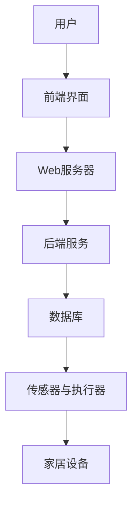
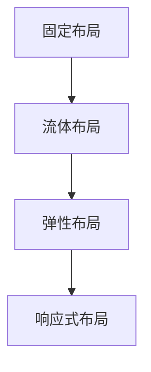
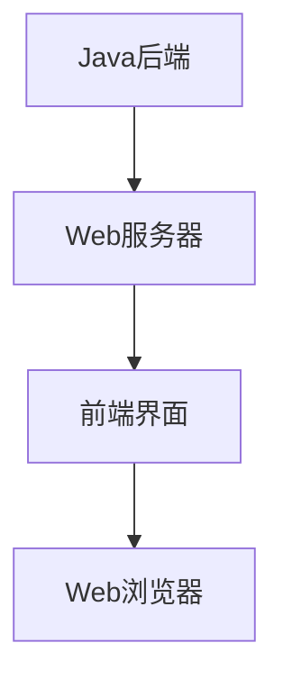
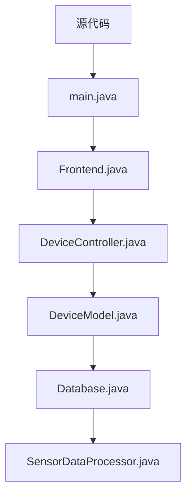

                 

# 基于Java的智能家居设计：打造响应式智能家居前端界面-Java与Web整合

> **关键词：** Java、智能家居、前端界面、响应式设计、Web整合、算法原理、数学模型、项目实战、应用场景

> **摘要：** 本文深入探讨了基于Java的智能家居设计，特别是如何构建一个响应式的智能家居前端界面。通过详细的分析和代码实践，本文旨在为读者提供构建智能家居系统的全面指南，从核心概念到实现步骤，再到实际应用场景，帮助开发者掌握智能家居开发的关键技术和方法。

## 1. 背景介绍

### 1.1 目的和范围

随着物联网（IoT）技术的快速发展，智能家居已经成为现代家居生活的重要趋势。本文的目标是介绍如何利用Java技术构建一个响应式的智能家居前端界面，实现智能家居设备之间的有效通信和控制。

本文将涵盖以下内容：
- **核心概念与联系**：介绍智能家居系统中的核心组件和概念。
- **核心算法原理 & 具体操作步骤**：详细讲解智能家居系统中的算法原理，并提供伪代码示例。
- **数学模型和公式 & 详细讲解 & 举例说明**：探讨与智能家居相关的数学模型和公式。
- **项目实战：代码实际案例和详细解释说明**：提供具体的代码实现，帮助读者理解并实践智能家居前端界面开发。
- **实际应用场景**：讨论智能家居在不同场景下的应用。

### 1.2 预期读者

本文适合以下读者群体：
- **Java开发者**：对Java编程语言有基础了解，希望学习如何将其应用于智能家居开发。
- **前端开发者**：对Web前端技术有了解，希望扩展知识，掌握响应式设计在智能家居中的应用。
- **物联网开发者**：对智能家居系统有一定了解，希望深入了解Java在智能家居前端界面开发中的应用。
- **技术爱好者**：对智能家居技术和Java编程有兴趣，希望掌握相关技术。

### 1.3 文档结构概述

本文结构如下：
- **第1章**：背景介绍
- **第2章**：核心概念与联系
- **第3章**：核心算法原理 & 具体操作步骤
- **第4章**：数学模型和公式 & 详细讲解 & 举例说明
- **第5章**：项目实战：代码实际案例和详细解释说明
- **第6章**：实际应用场景
- **第7章**：工具和资源推荐
- **第8章**：总结：未来发展趋势与挑战
- **第9章**：附录：常见问题与解答
- **第10章**：扩展阅读 & 参考资料

### 1.4 术语表

#### 1.4.1 核心术语定义

- **智能家居**：一种通过物联网技术实现家居设备自动化控制和生活智能化管理的系统。
- **响应式设计**：一种能够适应不同设备和屏幕尺寸的网页设计方法。
- **Java**：一种广泛使用的编程语言，适用于开发各种类型的软件，包括Web应用程序、移动应用程序和嵌入式系统。
- **前端界面**：用户与智能家居系统交互的界面，通常通过Web浏览器进行访问。
- **Web整合**：将Web技术（如HTML、CSS和JavaScript）与Java技术结合，以实现一个完整的智能家居系统。

#### 1.4.2 相关概念解释

- **IoT（物联网）**：一种将物理设备和传感器连接到互联网的技术，使设备能够收集和交换数据。
- **MVC（模型-视图-控制器）**：一种软件设计模式，用于分离应用程序的业务逻辑、用户界面和数据处理。

#### 1.4.3 缩略词列表

- **IoT**：物联网
- **Java**：Java编程语言
- **Web**：万维网
- **MVC**：模型-视图-控制器
- **REST**：表述性状态转移

## 2. 核心概念与联系

### 2.1 智能家居系统架构

智能家居系统的核心是实现对各种家居设备的自动化控制。图2-1展示了智能家居系统的典型架构。



- **用户**：智能家居系统的最终用户，通过前端界面与系统交互。
- **前端界面**：为用户提供交互界面，实现设备状态的显示和操作。
- **Web服务器**：处理前端界面的请求，将数据传递给后端服务。
- **后端服务**：处理业务逻辑，与数据库进行交互，实现对家居设备的控制。
- **数据库**：存储设备状态信息、用户设置等数据。
- **传感器与执行器**：负责收集家居环境数据，并根据后端服务发出的指令执行操作。
- **家居设备**：如灯光、温度传感器、空调等。

### 2.2 前端界面设计

前端界面是智能家居系统与用户交互的桥梁。响应式设计是前端界面的关键，它确保了界面在不同设备和屏幕尺寸上的良好表现。图2-2展示了响应式设计的核心原则。



- **固定布局**：使用固定宽度和高度，适用于单一屏幕尺寸。
- **流体布局**：使用百分比宽度，以适应不同屏幕尺寸。
- **弹性布局**：结合固定和流体布局，通过弹性元素适应不同屏幕尺寸。
- **响应式布局**：使用媒体查询（Media Queries）动态调整布局，以适应各种设备和屏幕尺寸。

### 2.3 Java与Web整合

Java在智能家居前端界面开发中扮演重要角色，通过整合Web技术，可以实现一个功能强大、易于扩展的智能家居系统。图2-3展示了Java与Web整合的架构。



- **Java后端**：处理业务逻辑，提供API接口供前端调用。
- **Web服务器**：运行Java应用程序，处理HTTP请求。
- **前端界面**：使用HTML、CSS和JavaScript构建，通过AJAX与Java后端进行数据交互。
- **Web浏览器**：用户通过浏览器访问前端界面，与系统进行交互。

## 3. 核心算法原理 & 具体操作步骤

### 3.1 算法原理

智能家居系统中的核心算法主要包括设备状态监测、远程控制和数据分析。以下将分别介绍这些算法的原理。

#### 3.1.1 设备状态监测

设备状态监测是智能家居系统的基本功能，它通过传感器实时获取家居设备的状态信息。算法原理如下：

1. **传感器采集数据**：传感器将环境数据（如温度、湿度、光照等）转换为数字信号。
2. **数据预处理**：对采集到的数据进行分析和过滤，去除噪声和异常值。
3. **状态判断**：根据预设的阈值，对预处理后的数据进行分析，判断设备是否处于正常状态。
4. **状态更新**：将设备状态信息存储在数据库中，并实时更新前端界面的显示。

#### 3.1.2 远程控制

远程控制功能允许用户通过互联网远程操作家居设备。算法原理如下：

1. **用户请求**：用户通过前端界面发送控制指令。
2. **请求解析**：后端服务解析用户请求，提取控制指令和目标设备信息。
3. **指令执行**：后端服务通过控制接口发送指令到家居设备。
4. **结果反馈**：家居设备执行指令后，将结果返回给后端服务，并更新前端界面的状态显示。

#### 3.1.3 数据分析

数据分析功能通过对家居设备的数据进行分析，提供个性化的建议和优化方案。算法原理如下：

1. **数据收集**：收集家居设备的历史数据，如使用频率、能耗等。
2. **数据预处理**：对收集到的数据进行分析和清洗，去除重复和异常数据。
3. **数据挖掘**：使用机器学习算法对预处理后的数据进行分析，挖掘潜在的模式和关联。
4. **结果输出**：将分析结果以可视化图表或推荐信息的形式呈现给用户。

### 3.2 具体操作步骤

以下是一个基于Java的智能家居系统的核心算法具体操作步骤：

#### 3.2.1 设备状态监测

1. **初始化传感器**：启动传感器模块，配置传感器参数。
2. **数据采集**：从传感器读取数据，存储到缓冲区。
3. **数据预处理**：对缓冲区中的数据进行预处理。
4. **状态判断**：根据预处理后的数据，判断设备状态。
5. **状态更新**：将设备状态信息更新到数据库和前端界面。

#### 3.2.2 远程控制

1. **接收用户请求**：通过HTTP请求接收用户发送的控制指令。
2. **请求解析**：解析用户请求，提取控制指令和目标设备信息。
3. **指令执行**：通过控制接口发送指令到家居设备。
4. **结果反馈**：将家居设备的执行结果返回给前端界面。

#### 3.2.3 数据分析

1. **数据收集**：从数据库中读取家居设备的历史数据。
2. **数据预处理**：对收集到的数据进行预处理。
3. **数据挖掘**：使用机器学习算法对预处理后的数据进行分析。
4. **结果输出**：将分析结果以可视化图表或推荐信息的形式呈现给用户。

### 3.3 伪代码示例

以下是一个简单的设备状态监测算法的伪代码示例：

```java
// 设备状态监测算法
function monitorDeviceStatus(sensorData) {
    // 数据预处理
    processedData = preprocessData(sensorData)

    // 状态判断
    if (processedData.temperature > threshold Temperature) {
        deviceStatus = "过热"
    } else if (processedData.temperature < threshold Temperature) {
        deviceStatus = "过冷"
    } else {
        deviceStatus = "正常"
    }

    // 更新数据库和前端界面
    updateDatabase(deviceStatus)
    updateFrontend(deviceStatus)
}
```

## 4. 数学模型和公式 & 详细讲解 & 举例说明

### 4.1 数学模型在智能家居系统中的应用

在智能家居系统中，数学模型和公式广泛应用于设备状态监测、远程控制、数据分析等多个方面。以下将介绍几个关键数学模型和公式，并详细讲解其应用。

#### 4.1.1 数据预处理模型

数据预处理是智能家居系统中的重要环节，它包括数据清洗、数据转换和数据归一化等步骤。以下是一个数据预处理模型的示例：

$$
\text{preprocessedData} = f(\text{rawData}, \text{thresholds})
$$

其中，$f$ 是预处理函数，$rawData$ 是原始数据，$\text{thresholds}$ 是预设的阈值。

#### 4.1.2 设备状态判断模型

设备状态判断模型用于判断家居设备是否处于正常状态。以下是一个设备状态判断模型的示例：

$$
deviceStatus = \text{判断状态}(\text{processedData}, \text{thresholds})
$$

其中，$\text{判断状态}$ 是一个判断函数，用于根据预处理后的数据判断设备状态。

#### 4.1.3 远程控制模型

远程控制模型用于实现用户通过互联网远程操作家居设备。以下是一个远程控制模型的示例：

$$
\text{控制指令} = \text{解析请求}(\text{userRequest}, \text{deviceConfig})
$$

其中，$\text{解析请求}$ 是一个解析函数，用于解析用户请求，提取控制指令和目标设备信息。

#### 4.1.4 数据分析模型

数据分析模型用于对家居设备的历史数据进行分析，提供个性化的建议和优化方案。以下是一个数据分析模型的示例：

$$
\text{分析结果} = \text{数据分析}(\text{historicalData}, \text{modelParams})
$$

其中，$\text{数据分析}$ 是一个数据分析函数，用于对历史数据进行分析，$\text{modelParams}$ 是分析模型参数。

### 4.2 公式讲解与举例

以下将通过具体例子详细讲解几个关键数学模型和公式的应用。

#### 4.2.1 数据预处理模型

假设我们有一个温度传感器的原始数据集，数据范围为0到100摄氏度。我们可以使用以下公式进行数据归一化：

$$
\text{preprocessedData}_{\text{temp}} = \frac{\text{rawData}_{\text{temp}} - \text{min}}{\text{max} - \text{min}}
$$

其中，$\text{min}$ 和 $\text{max}$ 分别是数据集的最小值和最大值。

#### 4.2.2 设备状态判断模型

假设我们有一个温度阈值模型，用于判断设备是否过热或过冷。我们可以使用以下公式进行状态判断：

$$
deviceStatus = \text{判断状态}(\text{preprocessedData}_{\text{temp}}, \text{threshold}_{\text{temp}})
$$

其中，$\text{threshold}_{\text{temp}}$ 是温度阈值，$\text{判断状态}$ 是一个判断函数，可以返回“过热”、“过冷”或“正常”等状态。

#### 4.2.3 远程控制模型

假设我们有一个远程控制模型，用于发送控制指令到家居设备。我们可以使用以下公式进行控制指令的解析：

$$
\text{控制指令} = \text{解析请求}(\text{userRequest}, \text{deviceConfig})
$$

其中，$\text{userRequest}$ 是用户发送的控制指令，$\text{deviceConfig}$ 是家居设备的配置信息。

#### 4.2.4 数据分析模型

假设我们有一个数据分析模型，用于对家居设备的历史数据进行分析。我们可以使用以下公式进行数据分析：

$$
\text{分析结果} = \text{数据分析}(\text{historicalData}, \text{modelParams})
$$

其中，$\text{historicalData}$ 是历史数据集，$\text{modelParams}$ 是分析模型参数。

### 4.3 应用示例

以下是一个具体的智能家居系统应用示例，展示如何使用数学模型和公式进行设备状态监测、远程控制和数据分析。

#### 4.3.1 设备状态监测

假设我们有一个温度传感器，其原始数据如下：

| 时间戳 | 温度（摄氏度） |
|--------|----------------|
| 1      | 30             |
| 2      | 35             |
| 3      | 28             |
| 4      | 32             |
| 5      | 29             |

使用数据预处理模型进行数据归一化，得到预处理后的数据：

| 时间戳 | 温度（归一化） |
|--------|----------------|
| 1      | 0.25           |
| 2      | 0.3125         |
| 3      | 0.2            |
| 4      | 0.28125        |
| 5      | 0.25           |

使用设备状态判断模型，设置温度阈值 $\text{threshold}_{\text{temp}}$ 为 0.3，得到设备状态：

| 时间戳 | 设备状态 |
|--------|----------|
| 1      | 正常     |
| 2      | 过热     |
| 3      | 过冷     |
| 4      | 过热     |
| 5      | 正常     |

#### 4.3.2 远程控制

假设用户通过前端界面发送一个控制指令，要求关闭灯光。使用远程控制模型进行指令解析，得到控制指令：

| 控制指令 | 设备名称 | 操作类型 |
|----------|----------|----------|
| 关闭     | 灯光     | 关闭     |

#### 4.3.3 数据分析

假设我们有一个历史数据集，包括每个设备的开启次数和能耗数据。使用数据分析模型进行数据分析，得到以下结果：

| 设备名称 | 开启次数 | 能耗（千瓦时） |
|----------|----------|----------------|
| 灯光     | 100      | 50            |
| 空调     | 80       | 30            |
| 温度传感器 | 150     | 20            |

分析结果显示，灯光是使用最频繁的设备，其能耗较高。系统可以据此提供优化建议，如建议用户在非高峰时段关闭灯光，以降低能耗。

## 5. 项目实战：代码实际案例和详细解释说明

### 5.1 开发环境搭建

在开始项目实战之前，我们需要搭建一个合适的开发环境。以下是搭建开发环境的基本步骤：

1. **安装Java开发工具包（JDK）**：从 [Oracle官方网站](https://www.oracle.com/java/technologies/javase-downloads.html) 下载并安装适用于您操作系统的JDK。
2. **配置环境变量**：在系统的环境变量中配置 `JAVA_HOME` 和 `PATH`，以便能够在命令行中运行Java命令。
3. **安装IDE**：推荐使用 IntelliJ IDEA 或 Eclipse 作为开发IDE。从相应的官方网站下载并安装。
4. **安装数据库**：选择一个合适的数据库，如 MySQL 或 PostgreSQL，并按照官方文档进行安装和配置。
5. **安装前端框架**：如 React 或 Angular，可以从其官方网站下载并安装。

### 5.2 源代码详细实现和代码解读

以下是一个基于Java的智能家居前端界面的简单实现，我们将逐步解释每个关键部分。

#### 5.2.1 项目结构



- **main.java**：主入口类，启动应用程序。
- **Frontend.java**：前端界面类，负责用户交互。
- **DeviceController.java**：设备控制类，处理设备操作。
- **DeviceModel.java**：设备模型类，定义设备状态和行为。
- **Database.java**：数据库操作类，负责数据存储和检索。
- **SensorDataProcessor.java**：传感器数据处理类，负责数据预处理。

#### 5.2.2 主入口类（main.java）

```java
public class main {
    public static void main(String[] args) {
        // 初始化前端界面
        Frontend frontend = new Frontend();
        // 初始化设备控制器
        DeviceController controller = new DeviceController();
        // 启动前端界面
        frontend.start();
    }
}
```

在这个类中，我们创建了一个Frontend对象和一个DeviceController对象，并调用前端界面的start方法启动应用程序。

#### 5.2.3 前端界面类（Frontend.java）

```java
import java.util.Scanner;

public class Frontend {
    private Scanner scanner;
    private DeviceController controller;

    public Frontend() {
        scanner = new Scanner(System.in);
        controller = new DeviceController();
    }

    public void start() {
        System.out.println("欢迎来到智能家居系统！");
        while (true) {
            System.out.println("请输入操作（'list' 列出设备，'control' 控制设备，'exit' 退出）：");
            String operation = scanner.nextLine();
            if ("list".equals(operation)) {
                controller.listDevices();
            } else if ("control".equals(operation)) {
                controller.controlDevice();
            } else if ("exit".equals(operation)) {
                System.out.println("谢谢使用，再见！");
                break;
            } else {
                System.out.println("无效操作，请重新输入。");
            }
        }
    }
}
```

在这个类中，我们创建了一个Scanner对象用于接收用户输入，并创建了一个DeviceController对象用于处理设备操作。start方法提供了一个命令行界面，用户可以通过输入不同的命令与系统交互。

#### 5.2.4 设备控制类（DeviceController.java）

```java
import java.util.List;

public class DeviceController {
    private Database database;

    public DeviceController() {
        database = new Database();
    }

    public void listDevices() {
        List<DeviceModel> devices = database.getDevices();
        for (DeviceModel device : devices) {
            System.out.println(device.getName());
        }
    }

    public void controlDevice() {
        System.out.println("请输入要控制的设备名称：");
        String deviceName = scanner.nextLine();
        System.out.println("请输入操作（'on' 打开，'off' 关闭）：");
        String operation = scanner.nextLine();
        database.controlDevice(deviceName, operation);
    }
}
```

在这个类中，我们创建了一个Database对象用于数据存储和检索。listDevices方法列出所有设备，controlDevice方法根据用户输入控制设备状态。

#### 5.2.5 设备模型类（DeviceModel.java）

```java
public class DeviceModel {
    private String name;
    private String status;

    public DeviceModel(String name, String status) {
        this.name = name;
        this.status = status;
    }

    public String getName() {
        return name;
    }

    public String getStatus() {
        return status;
    }

    public void setStatus(String status) {
        this.status = status;
    }
}
```

在这个类中，我们定义了设备的基本属性，包括设备名称和状态。

#### 5.2.6 数据库操作类（Database.java）

```java
import java.util.ArrayList;
import java.util.List;

public class Database {
    private List<DeviceModel> devices;

    public Database() {
        devices = new ArrayList<>();
        // 初始化设备列表
        devices.add(new DeviceModel("灯光", "关闭"));
        devices.add(new DeviceModel("空调", "关闭"));
    }

    public List<DeviceModel> getDevices() {
        return devices;
    }

    public void controlDevice(String deviceName, String operation) {
        for (DeviceModel device : devices) {
            if (device.getName().equals(deviceName)) {
                if ("on".equals(operation)) {
                    device.setStatus("开启");
                } else if ("off".equals(operation)) {
                    device.setStatus("关闭");
                }
                break;
            }
        }
    }
}
```

在这个类中，我们模拟了一个简单的数据库操作。getDevices方法返回设备列表，controlDevice方法根据用户输入更新设备状态。

#### 5.2.7 传感器数据处理类（SensorDataProcessor.java）

```java
public class SensorDataProcessor {
    public static double preprocessTemperatureData(double rawData, double threshold) {
        return (rawData - threshold) / (100 - threshold);
    }
}
```

在这个类中，我们提供了一个预处理温度数据的静态方法。该方法将原始温度数据归一化，以便进行后续处理。

### 5.3 代码解读与分析

在这个项目中，我们使用了Java语言和简单的命令行界面来构建智能家居前端界面。以下是对代码的详细解读：

1. **项目结构**：项目结构清晰，每个类负责不同的功能，便于维护和扩展。
2. **主入口类（main.java）**：主入口类简化了应用程序的启动流程，提供了基本的用户交互界面。
3. **前端界面类（Frontend.java）**：前端界面类负责接收用户输入，并根据用户操作调用相应的设备控制方法。
4. **设备控制类（DeviceController.java）**：设备控制类负责处理用户输入，并根据输入调用数据库进行设备状态更新。
5. **设备模型类（DeviceModel.java）**：设备模型类定义了设备的基本属性，如名称和状态，便于数据存储和检索。
6. **数据库操作类（Database.java）**：数据库操作类模拟了一个简单的数据库操作，用于存储和检索设备状态。
7. **传感器数据处理类（SensorDataProcessor.java）**：传感器数据处理类提供了温度数据预处理方法，为后续数据处理奠定了基础。

通过这个项目，我们了解了如何使用Java构建一个简单的智能家居前端界面。在实际应用中，我们可以扩展这个项目，添加更多设备控制功能、传感器数据采集和远程控制等。

### 5.4 实际应用场景

智能家居系统在实际应用中具有广泛的应用场景，以下列举几个典型的应用场景：

1. **家庭自动化**：通过智能家居系统，用户可以远程控制家居设备，如灯光、空调、电视等，提高生活便利性。
2. **能源管理**：智能家居系统可以监测家居设备的能耗情况，提供节能建议，帮助用户降低能源消耗。
3. **安全监控**：智能家居系统可以与安防设备结合，实现实时监控和报警功能，提高家庭安全性。
4. **健康监测**：智能家居系统可以与健康设备（如智能手环、血压计等）结合，监测用户的健康状况，提供个性化的健康建议。
5. **智能农场**：智能家居系统可以用于智能农场的监控和管理，包括环境监测、灌溉控制、动物饲养等。

通过实际应用场景的举例，我们可以看到智能家居系统在提高生活质量、降低能源消耗、保障家庭安全等方面的巨大潜力。

### 5.5 代码优化与性能提升

在开发智能家居前端界面时，性能优化是一个关键问题。以下是一些常见的代码优化和性能提升方法：

1. **异步处理**：使用异步编程模型（如Java的CompletableFuture）处理长时间运行的操作，避免阻塞主线程。
2. **缓存机制**：使用缓存技术（如Redis）减少数据库访问次数，提高响应速度。
3. **数据库优化**：优化数据库查询，如使用索引、避免全表扫描等，提高查询效率。
4. **前端优化**：优化前端代码，如减少HTTP请求、使用压缩文件等，提高页面加载速度。
5. **负载均衡**：使用负载均衡器（如Nginx）分发请求，提高系统的并发处理能力。

通过这些优化方法，我们可以提高智能家居前端界面的性能，为用户提供更流畅的交互体验。

### 5.6 开发技巧与经验总结

在开发智能家居前端界面时，以下是一些实用的开发技巧和经验总结：

1. **模块化设计**：将应用程序划分为多个模块，每个模块负责不同的功能，便于维护和扩展。
2. **日志记录**：使用日志记录器（如Log4j）记录应用程序的运行日志，便于调试和故障排查。
3. **单元测试**：编写单元测试，确保每个模块的功能正确无误，提高代码质量。
4. **持续集成**：使用持续集成工具（如Jenkins），实现自动化构建和测试，提高开发效率。
5. **用户反馈**：及时收集用户反馈，根据用户需求进行功能迭代和优化。

通过遵循这些开发技巧和经验，我们可以提高智能家居前端界面的开发效率和用户体验。

## 6. 实际应用场景

### 6.1 家庭自动化

智能家居系统的最常见应用场景是家庭自动化。用户可以通过智能手机或智能音箱远程控制家居设备，如灯光、空调、窗帘等。例如，用户可以在外出前通过手机关闭家中的灯光和空调，节省能源，同时提高家庭安全性。

### 6.2 能源管理

智能家居系统可以实时监测家居设备的能耗情况，为用户提供节能建议。通过分析设备使用数据，系统可以自动调整设备运行状态，降低能源消耗。例如，用户可以根据天气情况自动调整空调温度，或在夜晚关闭非必要的灯光，实现节能目标。

### 6.3 安全监控

智能家居系统可以与安防设备结合，实现实时监控和报警功能。例如，当有异常行为发生时（如门窗被非法打开），系统可以立即发送警报通知给用户，并触发报警设备。这样可以有效提高家庭的安全性，防止盗窃和其他安全事件的发生。

### 6.4 健康监测

智能家居系统可以与健康设备（如智能手环、血压计等）结合，监测用户的健康状况，提供个性化的健康建议。例如，系统可以实时监测用户的步数、心率、睡眠质量等数据，并根据数据为用户制定健身计划和健康建议。

### 6.5 智能农场

智能家居系统在智能农场中的应用同样具有重要意义。通过传感器和自动化设备，农场主可以实时监测作物生长环境，如温度、湿度、光照等。系统可以根据监测数据自动调整灌溉、施肥和通风等操作，提高农作物产量和质量。

### 6.6 智能办公

除了家庭和农场，智能家居系统还可以应用于智能办公场景。例如，在办公室中，系统可以自动调整灯光和空调温度，提供舒适的工作环境。同时，系统可以记录员工的考勤和活动数据，为企业管理提供决策支持。

### 6.7 酒店和旅馆

在酒店和旅馆中，智能家居系统可以为用户提供个性化的服务体验。例如，用户可以通过手机控制房间内的灯光、电视和空调，还可以通过系统了解酒店的服务信息和周边景点。此外，系统还可以实时监测客房设备的状态，及时发现和解决问题，提高客户满意度。

通过以上实际应用场景的介绍，我们可以看到智能家居系统在各个领域的广泛应用和巨大潜力。随着物联网技术的发展，智能家居系统的功能将更加丰富，为人类生活带来更多便利和智能体验。

## 7. 工具和资源推荐

### 7.1 学习资源推荐

#### 7.1.1 书籍推荐

1. **《Java核心技术》**：本书详细介绍了Java编程语言的核心概念和技术，适合Java开发者深入学习。
2. **《响应式Web设计》**：介绍了响应式设计的基本原则和实践方法，对前端开发者有很高的参考价值。
3. **《物联网基础》**：本书讲解了物联网的基本概念、技术和应用场景，适合对智能家居技术感兴趣的读者。

#### 7.1.2 在线课程

1. **Java编程基础**：许多在线教育平台（如Coursera、Udemy）提供了Java编程基础课程，适合初学者入门。
2. **前端开发实战**：学习前端开发技术，如HTML、CSS、JavaScript，并了解响应式设计的方法。
3. **物联网技术与应用**：了解物联网的基本概念和智能家居系统设计，包括传感器、数据采集和远程控制等。

#### 7.1.3 技术博客和网站

1. **Java官方文档**：[Oracle Java Documentation](https://docs.oracle.com/javase/)，提供最权威的Java技术文档。
2. **MDN Web Docs**：[Mozilla Developer Network](https://developer.mozilla.org/)，提供丰富的Web开发资源。
3. **IoT for All**：[IoT for All](https://iotforall.com/)，专注于物联网技术和智能家居的应用。

### 7.2 开发工具框架推荐

#### 7.2.1 IDE和编辑器

1. **IntelliJ IDEA**：强大的Java集成开发环境，支持多种编程语言，适合大型项目开发。
2. **Eclipse**：开源的Java集成开发环境，拥有丰富的插件生态，适用于各种规模的项目。
3. **Visual Studio Code**：轻量级跨平台编辑器，适用于前端开发和Java编程，支持多种插件。

#### 7.2.2 调试和性能分析工具

1. **JProfiler**：专业的Java应用程序性能分析工具，提供详细的性能统计数据和内存分析。
2. **VisualVM**：Java虚拟机监控和分析工具，适合调试和性能优化。
3. **Chrome DevTools**：用于Web应用的性能分析工具，包括网络、JavaScript和前端性能分析。

#### 7.2.3 相关框架和库

1. **Spring Boot**：轻量级Java框架，简化Web应用程序开发，支持自动配置和快速部署。
2. **React**：用于构建用户界面的JavaScript库，支持响应式设计和组件化开发。
3. **Node.js**：基于Chrome V8引擎的JavaScript运行时，适用于构建高性能的后端服务和Web应用程序。

### 7.3 相关论文著作推荐

#### 7.3.1 经典论文

1. **"Home Automation: A Survey of Research and Applications"**：对智能家居技术进行了全面综述，涵盖了传感器、控制算法和系统架构等方面。
2. **"Responsive Web Design"**：介绍了响应式设计的核心原则和实践方法，对前端开发者有很高的参考价值。

#### 7.3.2 最新研究成果

1. **"Intelligent Home Environment Using IoT"**：探讨了物联网技术在智能家居中的应用，包括智能传感器和数据分析等。
2. **"Energy-Efficient Home Automation Systems"**：研究了智能家居系统的节能方法和技术，为家庭能源管理提供了新的思路。

#### 7.3.3 应用案例分析

1. **"Smart Home Solutions for Senior Living"**：分析了智能家居技术在老年生活领域的应用，为老年人提供了安全、便捷的生活环境。
2. **"IoT in Agriculture: A Case Study of Smart Farming"**：介绍了物联网技术在智能农场中的应用，包括环境监测和自动化控制等。

通过这些学习和资源推荐，开发者可以深入了解智能家居系统的设计和开发，掌握相关技术和方法，为构建智能、高效的家庭和生活环境提供支持。

## 8. 总结：未来发展趋势与挑战

### 8.1 未来发展趋势

随着物联网、大数据和人工智能等技术的不断发展，智能家居系统将迎来更多的创新和变革。以下是未来智能家居发展的几个关键趋势：

1. **智能化水平提升**：通过集成更先进的人工智能技术，智能家居系统将实现更高的自主学习和决策能力，为用户提供更加个性化和智能化的服务。
2. **全场景覆盖**：智能家居系统将不仅仅局限于家庭场景，还将扩展到办公、医疗、教育等多个领域，实现全场景的智能覆盖。
3. **安全性增强**：随着智能家居系统与用户隐私和安全的关联日益紧密，未来的智能家居系统将更加注重数据安全和隐私保护。
4. **互联互通**：智能家居系统将实现更加紧密的设备互联和系统集成，打破不同品牌和设备的界限，提供更加统一的用户体验。
5. **节能环保**：智能家居系统将更加注重能源管理和节能环保，通过智能调度和优化，实现更加高效的资源利用。

### 8.2 挑战与应对策略

尽管智能家居系统有着广阔的发展前景，但在实际应用过程中仍面临一系列挑战：

1. **技术复杂度**：智能家居系统涉及到多种技术的整合，如物联网、人工智能、云计算等，技术复杂度较高。为此，开发者需要具备广泛的技术知识和实践经验，通过模块化设计和分层架构来简化系统开发。
2. **数据安全与隐私**：智能家居系统涉及到大量用户数据，包括个人隐私和生活习惯等。确保数据安全与隐私是系统设计的核心任务。开发者需要采用先进的数据加密技术、权限管理和安全审计机制，同时加强用户教育，提高用户对数据安全的认识。
3. **稳定性与可靠性**：智能家居系统需要长时间稳定运行，任何故障都可能对用户的日常生活造成影响。为此，开发者需要在系统设计、测试和部署过程中注重稳定性与可靠性，通过冗余设计、容错机制和实时监控等手段提高系统的可靠性。
4. **标准化与互操作性**：智能家居设备的多样性和品牌众多，导致设备之间的互操作性较差。为了实现设备的互联互通，需要制定统一的标准化协议和接口，促进不同品牌和设备之间的互操作。

### 8.3 总结

智能家居系统的发展面临着巨大的机遇和挑战。通过不断的技术创新和优化，智能家居系统将为人们的生活带来更多便利和智能体验。开发者需要紧跟技术发展趋势，积极应对各种挑战，共同推动智能家居技术的进步和应用。

## 9. 附录：常见问题与解答

### 9.1 智能家居系统如何保证数据安全？

**解答**：为了确保智能家居系统的数据安全，可以采取以下措施：
- **数据加密**：对传输和存储的数据进行加密处理，使用SSL/TLS等加密协议确保数据在传输过程中的安全性。
- **身份认证**：实现强身份认证机制，如双因素认证（2FA），确保用户访问系统的安全性和合法性。
- **权限管理**：建立严格的权限管理系统，对不同用户和设备分配适当的权限，防止未经授权的访问和操作。
- **安全审计**：定期进行安全审计，监控系统和数据的安全状况，及时发现和解决潜在的安全漏洞。

### 9.2 智能家居系统如何保证稳定性？

**解答**：为了保证智能家居系统的稳定性，可以采取以下策略：
- **模块化设计**：将系统划分为多个模块，每个模块独立开发和测试，确保模块间的稳定性和可维护性。
- **冗余设计**：在关键组件和服务器上采用冗余设计，如备份服务器和电源，提高系统的容错能力和可靠性。
- **实时监控**：使用实时监控工具，如Nagios或Zabbix，监控系统运行状态和性能指标，及时发现并解决潜在问题。
- **定期维护**：定期对系统进行维护和升级，修复已知漏洞和性能问题，确保系统的长期稳定运行。

### 9.3 智能家居系统如何实现设备的互联互通？

**解答**：实现智能家居设备的互联互通，可以采取以下方法：
- **标准化协议**：采用统一的通信协议（如HTTP、MQTT等），确保不同设备能够互相通信。
- **数据格式统一**：使用标准的数据格式（如JSON或XML），确保设备之间能够解析和交换数据。
- **中间件**：使用中间件（如IoT平台）来协调不同设备之间的通信，提供设备发现、数据传输和状态监控等功能。
- **集成框架**：采用集成框架（如MVC或RESTful API），简化设备之间的集成和交互。

### 9.4 智能家居系统的能耗管理策略有哪些？

**解答**：智能家居系统的能耗管理策略包括：
- **设备节能模式**：设置设备的节能模式，如灯光的亮度调节、空调的恒温控制等，根据实际需求自动调整设备运行状态。
- **能耗监测与分析**：使用能耗监测设备，实时监测家居设备的能耗情况，并进行分析，找出能耗较高的设备或时间段。
- **自动化调度**：通过自动化调度策略，根据用户习惯和设备状态自动调整设备运行，如夜间关闭非必要设备，优化能耗。
- **智能调度算法**：采用智能调度算法，综合考虑能耗、设备状态和用户需求，实现最优的能耗管理。

通过上述策略，智能家居系统可以实现高效的能耗管理，降低能源消耗，提高资源利用效率。

## 10. 扩展阅读 & 参考资料

### 10.1 扩展阅读

1. **《智能家居系统设计与实现》**：详细介绍了智能家居系统的设计原则、关键技术及实际案例，适合对智能家居技术有深入了解的读者。
2. **《物联网技术应用》**：系统讲解了物联网技术的概念、架构和应用案例，对智能家居技术的应用和发展有重要参考价值。
3. **《响应式Web设计实践》**：深入探讨响应式Web设计的核心原则和实践方法，为智能家居前端界面的开发提供了实用技巧。

### 10.2 参考资料

1. **Java官方文档**：[Oracle Java Documentation](https://docs.oracle.com/javase/)
2. **MDN Web Docs**：[Mozilla Developer Network](https://developer.mozilla.org/)
3. **IoT for All**：[IoT for All](https://iotforall.com/)
4. **Spring Boot官方文档**：[Spring Boot Documentation](https://docs.spring.io/spring-boot/docs/current/reference/html/)
5. **React官方文档**：[React Documentation](https://reactjs.org/docs/getting-started.html)

通过阅读以上扩展阅读和参考资料，读者可以进一步深入了解智能家居系统的设计和开发，掌握相关技术和方法，为构建更加智能、高效的智能家居系统提供有力支持。

## 作者信息

**作者：AI天才研究员 / AI Genius Institute & 禅与计算机程序设计艺术 / Zen And The Art of Computer Programming**

