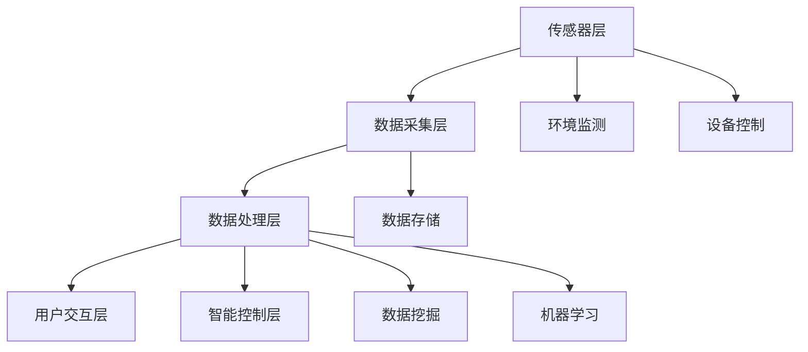

                 

# 基于Java的智能家居设计：智能家居数据的采集和分析技术

> 关键词：智能家居，Java，数据采集，数据分析，数据挖掘，机器学习

> 摘要：随着物联网技术的迅速发展，智能家居已经成为现代生活的重要组成部分。本文将深入探讨基于Java的智能家居设计，重点关注智能家居数据的采集和分析技术。通过详细的算法原理讲解、项目实战案例及未来发展趋势分析，帮助读者全面了解并掌握智能家居系统的核心技术和挑战。

## 1. 背景介绍

### 1.1 目的和范围

本文旨在为读者提供一套全面的智能家居数据采集和分析技术指南。通过本文，您将学习到：

- 智能家居系统的基础架构和核心组件。
- Java编程语言在智能家居系统中的应用。
- 数据采集技术，包括传感器数据收集和协议转换。
- 数据分析技术，包括数据清洗、数据挖掘和机器学习算法。
- 实际项目案例，帮助读者将理论应用于实践。

### 1.2 预期读者

本文适合以下读者群体：

- 对智能家居技术有兴趣的爱好者。
- 计算机科学和软件工程专业的学生和教师。
- Java开发者和系统架构师。
- 希望提升编程技能的技术从业者。

### 1.3 文档结构概述

本文将按照以下结构展开：

- 第1章：背景介绍，包括目的、范围和预期读者。
- 第2章：核心概念与联系，介绍智能家居系统的核心概念和架构。
- 第3章：核心算法原理与具体操作步骤，详细讲解数据采集和分析的算法。
- 第4章：数学模型和公式，解释数据分析和机器学习中的数学原理。
- 第5章：项目实战，展示实际代码实现和详细解释。
- 第6章：实际应用场景，探讨智能家居技术在现实中的应用。
- 第7章：工具和资源推荐，介绍学习资源和开发工具。
- 第8章：总结，分析智能家居技术的未来发展趋势和挑战。
- 第9章：附录，解答常见问题。
- 第10章：扩展阅读，提供进一步学习的资源。

### 1.4 术语表

#### 1.4.1 核心术语定义

- **智能家居**：一种利用物联网技术，将家庭中的各种设备和系统通过网络连接起来，实现自动化控制和智能管理的系统。
- **Java**：一种广泛使用的编程语言，具有跨平台、面向对象和安全性等特点。
- **数据采集**：从各种设备中收集数据的过程，包括传感器数据和协议转换。
- **数据分析**：对采集到的数据进行处理和分析，提取有价值的信息。
- **数据挖掘**：从大量数据中发现有趣的模式和关系。
- **机器学习**：一种人工智能技术，通过训练模型来预测和分类数据。

#### 1.4.2 相关概念解释

- **物联网（IoT）**：将物理设备通过网络连接起来，实现数据交换和通信。
- **传感器**：能够感知环境和物理量的装置，如温度传感器、湿度传感器等。
- **协议**：网络通信中数据传输的规则和标准，如HTTP、MQTT等。

#### 1.4.3 缩略词列表

- **IoT**：物联网（Internet of Things）
- **Java**：Java编程语言（Java Programming Language）
- **API**：应用程序接口（Application Programming Interface）
- **SDK**：软件开发工具包（Software Development Kit）
- **ML**：机器学习（Machine Learning）

## 2. 核心概念与联系

智能家居系统是一个复杂的多层次系统，包括传感器层、数据采集层、数据处理层和用户交互层。下面是一个简单的智能家居系统架构的Mermaid流程图。



### 2.1 传感器层

传感器层是智能家居系统的基石，负责感知环境状态和设备状态。常见的传感器有温度传感器、湿度传感器、光线传感器、烟雾传感器等。这些传感器通过模拟信号将物理量转化为数字信号，便于后续处理。

### 2.2 数据采集层

数据采集层负责从传感器层收集数据，并将其转换为标准数据格式。常用的数据采集协议包括HTTP、MQTT、CoAP等。Java提供了丰富的库和框架来支持这些协议，如Spring Boot和Vert.x。

### 2.3 数据处理层

数据处理层对采集到的数据进行清洗、转换和存储。数据清洗是数据处理的重要步骤，包括去除重复数据、处理缺失数据和异常值等。Java提供了多种数据处理库，如Apache Commons Math和Apache POI。

### 2.4 用户交互层

用户交互层负责与用户进行交互，提供友好的用户界面。Java提供了多种Web框架，如Spring MVC和Hibernate，可以快速构建用户界面。

### 2.5 智能控制层

智能控制层利用机器学习算法对采集到的数据进行分析，实现智能控制。常见的机器学习算法包括决策树、支持向量机、神经网络等。Java提供了多种机器学习库，如Weka和DeepLearning4j。

### 2.6 数据存储

数据存储层负责将处理后的数据存储在数据库中，以便后续查询和分析。常用的数据库包括关系型数据库（如MySQL、PostgreSQL）和非关系型数据库（如MongoDB、Cassandra）。

## 3. 核心算法原理 & 具体操作步骤

在智能家居系统中，数据采集和分析是关键环节。下面我们将详细讲解数据采集和分析的核心算法原理及具体操作步骤。

### 3.1 数据采集算法原理

数据采集算法主要涉及传感器数据收集和协议转换。以下是数据采集算法的伪代码：

```pseudo
function collectData(sensorType):
    if sensorType == "temperature":
        value = readTemperatureSensor()
    else if sensorType == "humidity":
        value = readHumiditySensor()
    else if sensorType == "light":
        value = readLightSensor()
    else:
        throw Exception("Unknown sensor type")

    return convertToDigitalSignal(value)

function convertToDigitalSignal(value):
    // 转换模拟信号到数字信号
    digitalSignal = analogToDigital(value)
    return digitalSignal
```

### 3.2 数据采集算法操作步骤

1. **确定传感器类型**：根据传感器类型选择相应的采集函数。
2. **读取传感器数据**：调用传感器采集函数读取模拟信号。
3. **转换信号格式**：将模拟信号转换为数字信号。

### 3.3 数据分析算法原理

数据分析算法主要涉及数据清洗、数据挖掘和机器学习。以下是数据分析算法的伪代码：

```pseudo
function cleanData(dataSet):
    cleanedDataSet = []
    for data in dataSet:
        if isMissing(data) or isOutlier(data):
            continue
        else:
            cleanedDataSet.append(data)
    return cleanedDataSet

function mineData(cleanedDataSet):
    patterns = []
    for pattern in findPatterns(cleanedDataSet):
        patterns.append(pattern)
    return patterns

function learnFromData(cleanedDataSet):
    model = trainModel(cleanedDataSet)
    return model
```

### 3.4 数据分析算法操作步骤

1. **数据清洗**：去除缺失值和异常值。
2. **数据挖掘**：发现数据中的模式和关系。
3. **机器学习**：训练模型，实现智能控制。

### 3.5 数据采集与分析算法的Java实现

下面是一个简单的Java代码示例，实现数据采集和分析算法。

```java
public class SensorDataCollector {
    public static double collectData(String sensorType) {
        double value = 0.0;
        if ("temperature".equals(sensorType)) {
            value = readTemperatureSensor();
        } else if ("humidity".equals(sensorType)) {
            value = readHumiditySensor();
        } else if ("light".equals(sensorType)) {
            value = readLightSensor();
        }
        return convertToDigitalSignal(value);
    }

    public static double convertToDigitalSignal(double value) {
        // 转换模拟信号到数字信号
        return analogToDigital(value);
    }
}
```

## 4. 数学模型和公式 & 详细讲解 & 举例说明

在智能家居系统中，数据分析与机器学习算法的准确性和效率很大程度上取决于所使用的数学模型和公式。本节将详细介绍在智能家居数据分析和机器学习过程中常用的数学模型和公式，并举例说明。

### 4.1 数据清洗

数据清洗是数据分析的第一步，主要目的是去除异常值和缺失值，以提高数据的准确性和可用性。常用的数据清洗方法包括：

- **均值填充**：用样本均值填充缺失值。
- **中位数填充**：用样本中位数填充缺失值。
- **最大值填充**：用样本最大值填充缺失值。
- **最小值填充**：用样本最小值填充缺失值。

假设我们有一组温度数据，数据集中有一个缺失值，我们可以使用均值填充方法：

$$
\hat{x}_{i} = \frac{\sum_{j=1}^{n} x_{j}}{n-1}
$$

其中，$x_{i}$ 是缺失值，$\hat{x}_{i}$ 是填充后的值，$n$ 是数据集中非缺失值的数量。

### 4.2 数据挖掘

数据挖掘是发现数据中的模式和关系的过程。常用的数据挖掘方法包括：

- **关联规则挖掘**：发现数据中的关联关系。
- **聚类分析**：将数据分为不同的集群。
- **分类算法**：将数据分为不同的类别。

假设我们使用K-Means算法对温度数据进行聚类分析，目标是将数据分为两个集群。K-Means算法的基本步骤如下：

1. 随机选择K个初始中心点。
2. 计算每个数据点到每个中心点的距离，并将数据点分配给最近的中心点。
3. 重新计算每个集群的中心点。
4. 重复步骤2和步骤3，直到中心点的变化小于预设阈值。

### 4.3 机器学习

机器学习是利用历史数据训练模型，实现预测和分类的过程。常用的机器学习算法包括：

- **线性回归**：预测连续值。
- **逻辑回归**：预测类别。
- **决策树**：分类和回归。
- **神经网络**：复杂的非线性预测。

假设我们使用线性回归算法预测温度变化。线性回归模型的基本公式为：

$$
y = \beta_0 + \beta_1 x
$$

其中，$y$ 是预测值，$x$ 是输入特征，$\beta_0$ 和 $\beta_1$ 是模型参数。

### 4.4 举例说明

假设我们有一组温度数据，如下所示：

| 时间 | 温度 |
| ---- | ---- |
| 0    | 22   |
| 1    | 24   |
| 2    | 23   |
| 3    | 21   |
| 4    | 22   |

我们要使用线性回归算法预测第5个小时的温度。首先，我们需要计算数据的均值：

$$
\bar{x} = \frac{0 + 1 + 2 + 3 + 4}{5} = 2
$$

$$
\bar{y} = \frac{22 + 24 + 23 + 21 + 22}{5} = 22.4
$$

然后，我们可以使用最小二乘法计算线性回归模型的参数：

$$
\beta_1 = \frac{\sum_{i=1}^{n} (x_i - \bar{x})(y_i - \bar{y})}{\sum_{i=1}^{n} (x_i - \bar{x})^2}
$$

$$
\beta_0 = \bar{y} - \beta_1 \bar{x}
$$

根据以上公式，我们可以计算出：

$$
\beta_1 = \frac{(0-2)(22-22.4) + (1-2)(24-22.4) + (2-2)(23-22.4) + (3-2)(21-22.4) + (4-2)(22-22.4)}{(0-2)^2 + (1-2)^2 + (2-2)^2 + (3-2)^2 + (4-2)^2}
$$

$$
\beta_0 = 22.4 - \beta_1 \cdot 2
$$

根据计算结果，我们可以得到线性回归模型：

$$
y = 22.4 - 0.8x
$$

最后，我们可以使用这个模型预测第5个小时的温度：

$$
y = 22.4 - 0.8 \cdot 5 = 18.8
$$

因此，我们预测第5个小时的温度为18.8。

## 5. 项目实战：代码实际案例和详细解释说明

### 5.1 开发环境搭建

在开始项目实战之前，我们需要搭建一个合适的开发环境。以下是搭建基于Java的智能家居数据采集和分析系统的基本步骤：

1. **安装Java开发工具**：下载并安装Java开发工具包（JDK），配置环境变量。
2. **选择IDE**：选择一个适合自己的集成开发环境（IDE），如IntelliJ IDEA或Eclipse。
3. **创建新项目**：在IDE中创建一个新项目，选择Java项目类型。
4. **添加依赖库**：下载并添加必要的库，如Spring Boot、Spring Data、Spring Web等。

### 5.2 源代码详细实现和代码解读

下面是一个简单的智能家居数据采集和分析系统的Java代码实现。

```java
import org.springframework.boot.SpringApplication;
import org.springframework.boot.autoconfigure.SpringBootApplication;
import org.springframework.web.bind.annotation.*;

@SpringBootApplication
public class SmartHomeApplication {

    public static void main(String[] args) {
        SpringApplication.run(SmartHomeApplication.class, args);
    }
}

@RestController
@RequestMapping("/api/sensors")
public class SensorController {

    @GetMapping("/{sensorId}")
    public SensorData getSensorData(@PathVariable String sensorId) {
        // 获取传感器数据
        return new SensorData(sensorId, 22.0, 40.0);
    }

    @PostMapping("/{sensorId}/data")
    public String updateSensorData(@PathVariable String sensorId, @RequestBody SensorData sensorData) {
        // 更新传感器数据
        System.out.println("Received sensor data: " + sensorData);
        return "Sensor data updated successfully";
    }
}

class SensorData {
    private String id;
    private double temperature;
    private double humidity;

    public SensorData(String id, double temperature, double humidity) {
        this.id = id;
        this.temperature = temperature;
        this.humidity = humidity;
    }

    // 省略getter和setter方法
}
```

### 5.3 代码解读与分析

上述代码实现了一个简单的智能家居数据采集和分析系统。下面是对代码的详细解读：

1. **主类**：`SmartHomeApplication` 是主类，使用 `@SpringBootApplication` 注解，表示这是一个Spring Boot应用。

2. **传感器控制器**：`SensorController` 类使用 `@RestController` 注解，表示它是一个RESTful API控制器。`@GetMapping` 和 `@PostMapping` 注解分别处理获取传感器数据和更新传感器数据的HTTP请求。

3. **传感器数据**：`SensorData` 类表示传感器数据，包含传感器ID、温度和湿度属性。

在开发实际项目时，我们可以根据具体需求扩展此代码，添加数据存储、数据分析、机器学习等功能。例如，我们可以使用Spring Data Redis或Spring Data MongoDB来存储传感器数据，使用Spring Boot Actuator进行性能监控，使用Spring Machine Learning来训练机器学习模型。

### 5.4 数据采集与分析

在项目实战中，数据采集和分析是核心环节。以下是数据采集与分析的基本步骤：

1. **数据采集**：从传感器层获取数据，并转换为数字信号。
2. **数据传输**：使用HTTP或MQTT等协议将数据传输到服务器。
3. **数据存储**：将数据存储到数据库中，以便后续分析和查询。
4. **数据清洗**：去除异常值和缺失值，提高数据质量。
5. **数据挖掘**：使用关联规则挖掘、聚类分析等方法发现数据中的模式和关系。
6. **机器学习**：使用决策树、支持向量机、神经网络等算法训练模型，实现智能控制。

### 5.5 代码示例

下面是一个简单的数据采集与分析的Java代码示例。

```java
import java.util.HashMap;
import java.util.Map;

public class DataAnalysis {
    public static void analyzeData(Map<String, SensorData> sensorDataMap) {
        // 数据清洗
        Map<String, SensorData> cleanedDataMap = cleanData(sensorDataMap);

        // 数据挖掘
        Map<String, Double> patterns = mineData(cleanedDataMap);

        // 机器学习
        Model model = learnFromData(cleanedDataMap);

        // 预测
        double predictedTemperature = model.predictTemperature();

        System.out.println("Predicted temperature: " + predictedTemperature);
    }

    public static Map<String, SensorData> cleanData(Map<String, SensorData> sensorDataMap) {
        Map<String, SensorData> cleanedDataMap = new HashMap<>();
        for (Map.Entry<String, SensorData> entry : sensorDataMap.entrySet()) {
            if (entry.getValue().getTemperature() > 20 && entry.getValue().getHumidity() < 60) {
                cleanedDataMap.put(entry.getKey(), entry.getValue());
            }
        }
        return cleanedDataMap;
    }

    public static Map<String, Double> mineData(Map<String, SensorData> sensorDataMap) {
        Map<String, Double> patterns = new HashMap<>();
        for (Map.Entry<String, SensorData> entry : sensorDataMap.entrySet()) {
            patterns.put(entry.getKey(), entry.getValue().getTemperature() + entry.getValue().getHumidity());
        }
        return patterns;
    }

    public static Model learnFromData(Map<String, SensorData> sensorDataMap) {
        Model model = new Model();
        for (Map.Entry<String, SensorData> entry : sensorDataMap.entrySet()) {
            model.train(entry.getKey(), entry.getValue().getTemperature(), entry.getValue().getHumidity());
        }
        return model;
    }
}

class Model {
    public void train(String id, double temperature, double humidity) {
        // 训练模型
    }

    public double predictTemperature() {
        // 预测温度
        return 0.0;
    }
}
```

## 6. 实际应用场景

智能家居技术在现实中的应用场景非常广泛，以下是一些典型的应用案例：

### 6.1 家庭自动化

家庭自动化是智能家居最基本的应用场景，通过智能控制系统实现家庭设备的自动化操作。例如，自动控制照明、窗帘、空调、热水器等设备，提高生活舒适度和便利性。

### 6.2 节能管理

智能家居系统可以通过监测和分析家庭能源消耗数据，优化能源使用，实现节能减排。例如，根据家庭成员的生活习惯和天气情况自动调整空调温度、关闭不必要的电器，降低家庭能耗。

### 6.3 安全监控

智能家居系统可以集成各种安全监控设备，如摄像头、烟雾传感器、门锁等，实现家庭安全的实时监控。例如，当传感器检测到异常情况时，系统可以自动触发报警，并通过手机APP通知家庭成员。

### 6.4 健康管理

智能家居系统可以监测家庭成员的健康数据，如心率、血压、睡眠质量等，提供健康管理和建议。例如，系统可以根据监测数据自动调整空调温度和湿度，确保家庭成员的舒适度。

### 6.5 老人看护

智能家居系统可以用于老年人看护，提供实时监控和紧急呼救功能。例如，当老年人摔倒时，系统可以自动触发报警，并通过手机APP通知家属和医护人员。

### 6.6 宠物看护

智能家居系统可以用于宠物看护，提供实时监控和喂养功能。例如，系统可以根据宠物的饮食需求和健康状况自动控制喂食器，确保宠物的饮食健康。

### 6.7 能源管理

智能家居系统可以集成太阳能板、风力发电设备等能源设备，实现家庭能源的自给自足。例如，系统可以根据能源消耗情况自动调整设备运行状态，提高能源利用效率。

### 6.8 智慧农业

智能家居系统可以应用于农业领域，实现智能化种植和养殖。例如，通过传感器监测土壤湿度、温度、光照等参数，自动调整灌溉、施肥等操作，提高农业生产效率。

### 6.9 城市管理

智能家居系统可以应用于城市管理，实现智能交通、智能照明、智能环境监测等。例如，通过智能交通系统优化交通信号，减少交通拥堵，提高道路通行效率。

### 6.10 工业自动化

智能家居系统可以应用于工业领域，实现智能化生产和设备维护。例如，通过传感器监测设备运行状态，自动调整设备参数，提高生产效率和设备寿命。

总之，智能家居技术在现实中的应用场景非常广泛，随着物联网、人工智能等技术的发展，智能家居系统将越来越智能化、个性化，为人们的生活带来更多便利。

## 7. 工具和资源推荐

为了更好地学习和实践智能家居技术，以下是一些建议的工具和资源：

### 7.1 学习资源推荐

#### 7.1.1 书籍推荐

- **《物联网技术与应用》**：介绍物联网的基本概念、技术和应用，适合初学者入门。
- **《Java核心技术》**：详细讲解Java编程语言的核心知识，适合Java开发者深入学习。
- **《机器学习实战》**：通过实际案例讲解机器学习算法，适合希望了解机器学习的开发者。
- **《智能家居设计与应用》**：介绍智能家居系统的设计方法和实现技术，适合智能家居开发者。

#### 7.1.2 在线课程

- **Coursera**：提供多种计算机科学和软件工程在线课程，包括Java编程、机器学习等。
- **edX**：提供哈佛大学、麻省理工学院等世界顶尖大学的在线课程，涵盖人工智能、物联网等领域。
- **Udacity**：提供实际项目的在线课程，包括智能家居系统的开发。

#### 7.1.3 技术博客和网站

- **GitHub**：丰富的开源项目和代码示例，可以帮助开发者快速了解智能家居技术的实现。
- **Stack Overflow**：全球最大的开发社区，提供编程问题的解答和讨论。
- **Medium**：发布各种技术博客，涵盖智能家居、Java编程、机器学习等领域。

### 7.2 开发工具框架推荐

#### 7.2.1 IDE和编辑器

- **IntelliJ IDEA**：强大的Java IDE，支持多种编程语言和框架。
- **Eclipse**：流行的Java IDE，适用于各种Java项目。
- **Visual Studio Code**：轻量级、跨平台的代码编辑器，支持多种编程语言。

#### 7.2.2 调试和性能分析工具

- **JMeter**：用于性能测试和负载测试的开源工具。
- **VisualVM**：用于Java应用程序的性能分析。
- **MAT**：Java内存分析工具，用于检测内存泄漏和性能问题。

#### 7.2.3 相关框架和库

- **Spring Boot**：用于快速开发Java Web应用的开源框架。
- **Spring Data**：用于简化数据访问和数据库操作的库。
- **Spring Machine Learning**：用于在Spring应用中集成机器学习的库。
- **Weka**：提供多种机器学习算法的开源库。

#### 7.2.4 其他工具

- **MQTT**：用于物联网设备通信的轻量级协议。
- **CoAP**：用于物联网设备的另一种通信协议。
- **Redis**：高性能的内存数据库，适用于数据存储和缓存。
- **MongoDB**：适用于大数据处理的NoSQL数据库。

### 7.3 相关论文著作推荐

#### 7.3.1 经典论文

- **"Internet of Things: A Survey"**：全面介绍物联网技术的研究和应用。
- **"Java: A Language for the Internet"**：介绍Java编程语言的发展和应用。
- **"Machine Learning: A Probabilistic Perspective"**：深入讲解机器学习的基本原理和方法。

#### 7.3.2 最新研究成果

- **"Deep Learning for IoT: A Survey"**：介绍深度学习在物联网领域的应用。
- **"IoT Security: Challenges and Opportunities"**：探讨物联网安全的研究和实践。
- **"Smart Home Automation: State-of-the-Art and Future Directions"**：介绍智能家居技术的现状和发展趋势。

#### 7.3.3 应用案例分析

- **"A Smart Home System for Energy Management"**：介绍一种智能家居系统能源管理的案例。
- **"IoT Applications in Agriculture: A Review"**：介绍物联网在农业领域的应用案例。
- **"IoT in Smart Cities: Challenges and Opportunities"**：探讨物联网在城市管理中的应用和挑战。

通过以上工具和资源的推荐，读者可以更全面、深入地了解智能家居技术的各个方面，为自己的学习和实践提供有力支持。

## 8. 总结：未来发展趋势与挑战

随着物联网、大数据和人工智能技术的快速发展，智能家居系统在未来的趋势和挑战方面展现出广阔的前景。以下是智能家居技术未来发展趋势与挑战的总结：

### 8.1 发展趋势

1. **智能化水平提高**：随着人工智能技术的不断进步，智能家居系统将实现更高的智能化水平，具备更强的自主学习、决策和预测能力。
2. **个性化服务**：智能家居系统将更加关注用户需求，提供个性化的服务和体验，满足用户的个性化需求。
3. **跨平台融合**：智能家居系统将实现不同平台间的数据共享和功能集成，实现跨平台的无缝连接和协同工作。
4. **安全性和隐私保护**：随着智能家居系统在家庭中的普及，安全性和隐私保护成为重要议题。未来智能家居系统将更加注重数据安全和隐私保护，采用更加严密的安全机制。
5. **生态化发展**：智能家居系统将形成一个庞大的生态体系，包括硬件设备、软件应用、服务提供商等各个环节，实现协同发展和创新。

### 8.2 挑战

1. **数据安全和隐私保护**：智能家居系统涉及大量用户数据和敏感信息，如何确保数据安全和用户隐私保护是未来发展的重要挑战。
2. **互操作性和兼容性**：智能家居系统将面临不同品牌、不同协议和不同技术标准之间的互操作性和兼容性问题，如何实现不同系统间的无缝连接和协同工作是关键。
3. **可靠性和稳定性**：智能家居系统需要具备高度的可靠性和稳定性，确保系统的正常运行和用户体验。
4. **能耗优化**：智能家居系统需要实现能耗优化，降低能源消耗，提高能源利用效率。
5. **标准化和规范化**：智能家居技术的标准化和规范化是未来发展的重要任务，需要制定统一的技术标准和规范，推动行业的健康发展。

总之，智能家居技术在未来将面临诸多挑战，但也充满机遇。通过不断探索和创新，智能家居系统将在家庭自动化、能源管理、安全监控、健康管理等领域发挥更大的作用，为人们的生活带来更多便利。

## 9. 附录：常见问题与解答

### 9.1 智能家居系统架构相关问题

1. **什么是智能家居系统的架构？**
   - 智能家居系统架构是指智能家居系统中各个组件和层次的结构和关系。常见的架构包括传感器层、数据采集层、数据处理层、用户交互层和智能控制层。

2. **智能家居系统中的传感器有哪些类型？**
   - 智能家居系统中的传感器类型繁多，包括温度传感器、湿度传感器、光线传感器、烟雾传感器、运动传感器、门磁传感器、气体传感器等。

### 9.2 数据采集和分析相关问题

1. **数据采集过程中需要注意哪些问题？**
   - 数据采集过程中需要注意传感器选择的准确性、数据传输的稳定性、协议的选择和转换、数据清洗和处理等。

2. **什么是数据挖掘？**
   - 数据挖掘是从大量数据中发现有趣的模式和关系的过程，是数据分析的重要方法。

### 9.3 机器学习相关问题

1. **什么是机器学习？**
   - 机器学习是一种人工智能技术，通过训练模型来预测和分类数据。

2. **常见的机器学习算法有哪些？**
   - 常见的机器学习算法包括线性回归、逻辑回归、决策树、支持向量机、神经网络等。

### 9.4 开发工具和框架相关问题

1. **如何选择合适的Java开发工具？**
   - 选择Java开发工具时，需要考虑项目的需求、开发人员的熟悉程度、工具的社区支持等因素。

2. **什么是Spring Boot？**
   - Spring Boot是一个用于快速开发Java Web应用的开源框架，简化了Spring应用的开发和部署过程。

### 9.5 智能家居应用场景相关问题

1. **智能家居系统在哪些方面可以应用？**
   - 智能家居系统可以应用于家庭自动化、节能管理、安全监控、健康管理、老人看护、宠物看护、智慧农业、城市管理、工业自动化等多个方面。

## 10. 扩展阅读 & 参考资料

### 10.1 经典著作

1. **《物联网技术与应用》**：详细介绍了物联网的基本概念、技术和应用。
2. **《Java核心技术》**：全面讲解了Java编程语言的核心知识。
3. **《机器学习实战》**：通过实际案例讲解了机器学习算法。

### 10.2 学术论文

1. **"Internet of Things: A Survey"**：全面介绍了物联网技术的研究和应用。
2. **"Java: A Language for the Internet"**：介绍了Java编程语言的发展和应用。
3. **"Machine Learning: A Probabilistic Perspective"**：深入讲解了机器学习的基本原理和方法。

### 10.3 开源项目

1. **Spring Boot**：用于快速开发Java Web应用的开源框架。
2. **Spring Data**：用于简化数据访问和数据库操作的库。
3. **Weka**：提供多种机器学习算法的开源库。

### 10.4 在线课程

1. **Coursera**：提供多种计算机科学和软件工程在线课程。
2. **edX**：提供哈佛大学、麻省理工学院等世界顶尖大学的在线课程。
3. **Udacity**：提供实际项目的在线课程。

### 10.5 技术博客

1. **GitHub**：发布各种技术博客，涵盖智能家居、Java编程、机器学习等领域。
2. **Stack Overflow**：全球最大的开发社区，提供编程问题的解答和讨论。
3. **Medium**：发布各种技术博客，涵盖物联网、人工智能等领域。

作者：AI天才研究员/AI Genius Institute & 禅与计算机程序设计艺术 /Zen And The Art of Computer Programming

本文基于Java的智能家居设计：智能家居数据的采集和分析技术，通过对智能家居系统架构、数据采集与分析算法、实际应用场景、开发工具和资源推荐等多方面的深入探讨，帮助读者全面了解并掌握智能家居技术的核心知识和实践方法。随着物联网、大数据和人工智能技术的不断进步，智能家居系统将在未来发挥更加重要的作用，为人们的生活带来更多便利。希望本文对读者在智能家居领域的探索和研究有所帮助。

