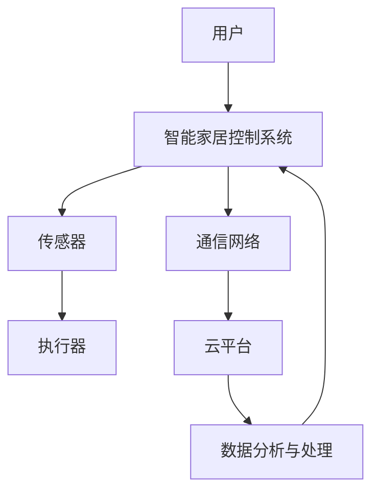
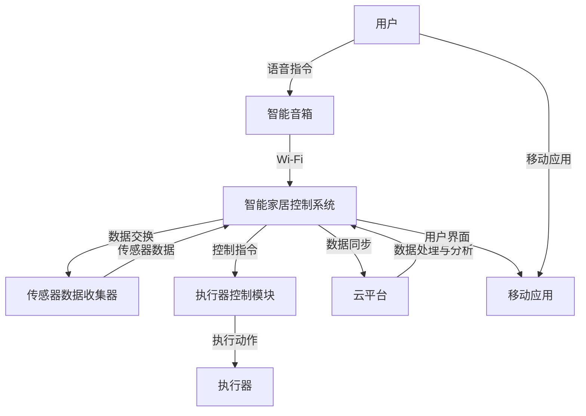

                 

# 基于Java的智能家居设计：集成语音识别功能到智能家居系统

## 关键词

- 智能家居
- Java编程
- 语音识别
- 语音处理
- 数据通信
- 系统集成

## 摘要

本文将深入探讨基于Java的智能家居系统的设计，特别是如何将语音识别功能集成到智能家居系统中。文章首先介绍了智能家居的背景和重要性，然后详细阐述了Java编程语言在智能家居系统开发中的应用。接着，文章重点介绍了语音识别技术的核心原理及其与智能家居系统的集成过程。通过具体的伪代码和数学模型，文章讲解了如何实现语音识别算法的具体操作步骤。最后，文章提供了一个实际的项目实战案例，详细展示了如何搭建开发环境、编写源代码以及进行代码解读和分析。本文不仅提供了丰富的学习资源和技术工具推荐，还对智能家居系统的未来发展趋势和挑战进行了深入分析，为读者提供了全面的技术参考。

## 1. 背景介绍

### 1.1 目的和范围

本文旨在为读者提供一个全面而深入的指南，介绍如何基于Java语言设计和实现一个集成语音识别功能的智能家居系统。随着物联网（IoT）技术的发展和智能家居市场的迅速扩张，智能家居系统已经成为现代家庭生活中不可或缺的一部分。本文将探讨如何利用Java编程语言和语音识别技术，实现一个高效、稳定且用户友好的智能家居系统。

本文的范围包括以下几个方面：
1. **智能家居的背景和现状**：介绍智能家居的定义、发展历程及其在家庭生活中的应用。
2. **Java编程语言在智能家居开发中的应用**：详细讨论Java的优势以及其在智能家居系统开发中的具体应用。
3. **语音识别技术的核心原理**：介绍语音识别技术的原理，包括语音信号的处理、特征提取和模式识别等关键步骤。
4. **语音识别与智能家居系统的集成**：讲解如何将语音识别功能集成到智能家居系统中，包括系统的架构设计、数据通信和用户交互等关键环节。
5. **具体实现步骤和项目实战**：通过伪代码和实际代码示例，详细阐述语音识别算法的具体实现步骤。
6. **实际应用场景和工具资源推荐**：提供智能家居系统实际应用场景的案例，以及相关学习资源和技术工具的推荐。

### 1.2 预期读者

本文的预期读者主要包括以下几类：
1. **软件开发工程师**：对智能家居系统和Java编程有兴趣的工程师，希望通过本文掌握语音识别技术的集成方法。
2. **计算机科学学生**：对计算机编程和智能家居技术有深入学习的需求，希望通过本文了解如何实现一个完整的智能家居系统。
3. **智能家居爱好者**：对智能家居系统有浓厚的兴趣，希望通过本文了解如何通过编程实现自己的智能家居系统。
4. **技术管理者**：对智能家居技术的未来发展趋势和应用场景有战略关注，希望通过本文了解该领域的最新技术进展。

### 1.3 文档结构概述

本文将按照以下结构进行展开：
1. **背景介绍**：介绍智能家居的背景、目的和预期读者。
2. **核心概念与联系**：通过Mermaid流程图，展示智能家居系统的核心概念和架构。
3. **核心算法原理 & 具体操作步骤**：详细讲解语音识别算法的原理和操作步骤。
4. **数学模型和公式 & 详细讲解 & 举例说明**：阐述相关的数学模型和公式，并给出实例说明。
5. **项目实战：代码实际案例和详细解释说明**：提供实际项目案例，并详细解释代码实现过程。
6. **实际应用场景**：讨论智能家居系统的实际应用场景。
7. **工具和资源推荐**：推荐相关学习资源和技术工具。
8. **总结：未来发展趋势与挑战**：总结智能家居技术未来的发展趋势和面临的挑战。
9. **附录：常见问题与解答**：回答读者可能遇到的问题。
10. **扩展阅读 & 参考资料**：提供进一步阅读的参考资料。

### 1.4 术语表

#### 1.4.1 核心术语定义

- **智能家居（Smart Home）**：一种通过物联网技术将各种家用设备连接起来，实现自动化管理和远程控制的居住环境。
- **Java编程语言（Java Programming Language）**：一种广泛使用的面向对象的编程语言，以其平台独立性、安全性、稳定性和多线程处理能力著称。
- **语音识别（Voice Recognition）**：通过计算机技术和算法，将人类语音信号转化为文本或命令的技术。
- **物联网（Internet of Things，IoT）**：通过将各种物理设备联网，实现数据采集、传输和智能化处理的技术体系。
- **用户交互（User Interaction）**：系统与用户之间的互动过程，包括语音指令输入、系统响应等。

#### 1.4.2 相关概念解释

- **智能家居系统架构**：智能家居系统的整体设计结构，包括硬件设备、软件系统、通信协议和用户界面等组成部分。
- **语音处理（Voice Processing）**：对语音信号进行采集、降噪、增强和转换等处理的过程。
- **模式识别（Pattern Recognition）**：通过分析输入数据模式，识别和分类数据的技术。
- **数据通信（Data Communication）**：在系统内或系统间传输数据的过程，包括数据的编码、传输、解码和错误检测等步骤。

#### 1.4.3 缩略词列表

- **IoT**：物联网（Internet of Things）
- **Java**：Java编程语言
- **API**：应用程序编程接口（Application Programming Interface）
- **SDK**：软件开发工具包（Software Development Kit）
- **GUI**：图形用户界面（Graphical User Interface）

## 2. 核心概念与联系

智能家居系统的设计和实现涉及到多个核心概念和组件。为了更好地理解这些概念之间的关系，我们可以通过Mermaid流程图来展示智能家居系统的整体架构。

### 2.1. 智能家居系统的核心概念与架构

下面是一个简单的Mermaid流程图，展示智能家居系统的核心概念和架构：



- **A[用户]**：用户是智能家居系统的最终使用者，通过语音指令或其他方式与系统进行交互。
- **B[智能家居控制系统]**：这是系统的核心，负责接收用户的指令，处理数据，并控制传感器和执行器的操作。
- **C[传感器]**：传感器用于监测家庭环境中的各种参数，如温度、湿度、光照等。
- **D[执行器]**：执行器根据控制系统的指令，执行具体的物理操作，如打开灯光、调节温度等。
- **E[通信网络]**：智能家居系统通过无线通信网络（如Wi-Fi、蓝牙等）连接各个组件，实现数据的传输和同步。
- **F[云平台]**：云平台用于存储数据、处理数据和提供远程访问服务，帮助实现智能家居系统的智能化和扩展性。
- **G[数据分析与处理]**：通过数据分析与处理，系统可以更好地理解用户需求，优化控制策略，提高用户体验。

### 2.2. Mermaid流程图

下面是一个更详细的Mermaid流程图，展示智能家居系统的核心概念和组件之间的关系：



- **A[用户]**：用户可以通过智能音箱发出语音指令，或者通过移动应用与智能家居系统进行交互。
- **B[智能音箱]**：智能音箱是用户与智能家居系统交互的接口，负责接收语音指令并将其转换为文本数据。
- **C[智能家居控制系统]**：这是智能家居系统的核心，负责处理用户指令、收集传感器数据、控制执行器等操作。
- **D[传感器数据收集器]**：传感器数据收集器负责收集环境数据，并将其传输给智能家居控制系统。
- **E[执行器控制模块]**：执行器控制模块根据智能家居控制系统的指令，控制执行器的操作，如打开灯光、调节温度等。
- **F[执行器]**：执行器是智能家居系统中的实际执行组件，如灯光开关、温控器等。
- **G[云平台]**：云平台用于存储数据、处理数据和提供远程访问服务，帮助实现智能家居系统的智能化和扩展性。
- **H[移动应用]**：用户可以通过移动应用查看系统状态、调整设置等，实现远程控制。

通过上述流程图，我们可以清晰地看到智能家居系统的各个组成部分及其相互关系，这为后续的详细讲解和实际项目实施提供了重要的指导。

## 3. 核心算法原理 & 具体操作步骤

在智能家居系统中，语音识别技术的核心是能够准确地将用户的语音指令转换为系统可以理解和执行的操作。下面，我们将详细讲解语音识别算法的原理，并通过伪代码具体阐述实现步骤。

### 3.1. 语音识别算法原理

语音识别算法的基本原理可以分为以下几个步骤：

1. **语音信号采集**：首先，系统需要通过麦克风等设备采集用户的语音信号。
2. **前端处理**：对采集到的语音信号进行预处理，包括降噪、增强和归一化等，以提高信号质量。
3. **特征提取**：提取语音信号的音频特征，如短时傅里叶变换（STFT）和梅尔频率倒谱系数（MFCC）等。
4. **模式识别**：利用训练好的模型，对提取的特征进行模式匹配，识别出语音命令。
5. **后端处理**：对识别结果进行后处理，如消除误识别和歧义处理，确保指令的准确性。

### 3.2. 伪代码

下面是一个简化的伪代码，用于描述语音识别算法的具体实现步骤：

```python
# 伪代码：语音识别算法实现步骤

# 步骤1：语音信号采集
def collect_audio():
    audio_data = microphone.capture()
    return audio_data

# 步骤2：前端处理
def preprocess_audio(audio_data):
    # 降噪
    noise_reduced_data = noise_reduction(audio_data)
    # 增强语音
    enhanced_data = voice_enhancement(noise_reduced_data)
    # 归一化
    normalized_data = normalize(enhanced_data)
    return normalized_data

# 步骤3：特征提取
def extract_features(normalized_data):
    features = MFCC(normalized_data)
    return features

# 步骤4：模式识别
def recognize_command(features):
    # 加载训练好的模型
    model = load_model("voice_recognition_model")
    # 进行模式匹配
    recognized_command = model.predict(features)
    return recognized_command

# 步骤5：后端处理
def post_process(recognized_command):
    # 消除误识别
    corrected_command = error_correction(recognized_command)
    # 处理歧义
    final_command = ambiguity_resolution(corrected_command)
    return final_command

# 主函数：语音识别流程
def voice_recognition():
    audio_data = collect_audio()
    processed_data = preprocess_audio(audio_data)
    features = extract_features(processed_data)
    recognized_command = recognize_command(features)
    final_command = post_process(recognized_command)
    return final_command
```

### 3.3. 具体操作步骤

1. **初始化系统**：启动语音识别系统，加载必要的模型和算法。
2. **采集语音信号**：通过麦克风等设备采集用户的语音指令。
3. **前端处理**：对采集到的语音信号进行降噪、增强和归一化处理，以提高信号质量。
4. **特征提取**：使用短时傅里叶变换（STFT）或梅尔频率倒谱系数（MFCC）等方法提取语音信号的特征。
5. **模式识别**：利用训练好的神经网络模型对提取的特征进行模式匹配，识别出用户的语音命令。
6. **后端处理**：对识别结果进行错误校正和歧义处理，确保指令的准确性。
7. **执行操作**：将识别结果转换为具体的系统操作，如打开灯光、调节温度等。

通过上述步骤，我们可以实现一个基本的语音识别系统，并将其集成到智能家居系统中，为用户提供方便、高效的交互体验。

### 3.4. 数学模型和公式

在语音识别过程中，涉及到的数学模型和公式主要包括：

- **短时傅里叶变换（STFT）**：
  \[
  X(k, n) = \sum_{m=-\infty}^{\infty} x(n - m) \cdot w_m \cdot e^{-j2\pi k m / N}
  \]
  其中，\(X(k, n)\) 是STFT结果，\(x(n)\) 是原始语音信号，\(w_m\) 是窗函数，\(k\) 和 \(n\) 分别是频率和时间索引。

- **梅尔频率倒谱系数（MFCC）**：
  \[
  MFCC(k) = \sum_{m=1}^{M} a_m \cdot \log \left| \hat{X}_{MFCC}(m) \right|
  \]
  其中，\(MFCC(k)\) 是第 \(k\) 个MFCC系数，\(\hat{X}_{MFCC}(m)\) 是STFT结果经过离散余弦变换（DCT）后的结果，\(a_m\) 是滤波器组中心频率。

通过这些数学模型和公式，我们可以从原始语音信号中提取出有用的特征信息，从而实现语音识别。

### 3.5. 举例说明

假设我们有一个用户发出“打开客厅灯光”的语音指令，我们可以通过以下步骤进行识别：

1. **初始化系统**：加载训练好的语音识别模型。
2. **采集语音信号**：用户通过智能音箱发出语音指令。
3. **前端处理**：对采集到的语音信号进行降噪和增强，得到高质量的语音信号。
4. **特征提取**：使用STFT和MFCC方法提取语音信号的特征。
5. **模式识别**：模型对提取的特征进行模式匹配，识别出“打开客厅灯光”的指令。
6. **后端处理**：确认指令无误，并将其发送到智能家居控制系统。
7. **执行操作**：智能家居控制系统接收到指令后，控制客厅灯光开启。

通过上述步骤，我们可以将用户的语音指令准确转换为具体的操作，实现智能家居系统的自动化控制。

## 4. 数学模型和公式 & 详细讲解 & 举例说明

在智能家居系统中，语音识别技术的实现不仅依赖于算法，还需要借助数学模型和公式来处理和分析语音信号。以下是几个关键的数学模型和公式的详细讲解，并通过具体的实例说明它们在实际应用中的重要性。

### 4.1. 短时傅里叶变换（STFT）

短时傅里叶变换（Short-Time Fourier Transform，STFT）是一种将时间信号分解为频率成分的方法，广泛应用于语音信号处理中。STFT的基本公式如下：

\[ X(k, n) = \sum_{m=-\infty}^{\infty} x(n - m) \cdot w_m \cdot e^{-j2\pi k m / N} \]

其中：
- \( X(k, n) \) 是STFT的结果，即变换后的复数矩阵，表示在时间 \( n \) 和频率 \( k \) 的信号分量。
- \( x(n) \) 是原始时间信号。
- \( w_m \) 是窗函数，用于限制信号的有效长度，减少边界效应。
- \( k \) 是频率索引。
- \( N \) 是窗函数的长度。

**实例说明**：
假设我们有一段时长为2秒的语音信号 \( x(n) \)，并使用汉明窗进行处理，窗函数长度为256点。我们可以通过STFT将这段语音信号分解为不同频率的分量。

\[ X(k, n) = \sum_{m=-127}^{127} x(n - m) \cdot W_m \cdot e^{-j2\pi k m / 256} \]

通过计算，我们可以得到在不同时间点和频率上的信号分量，从而分析语音信号的频率特性。

### 4.2. 梅尔频率倒谱系数（MFCC）

梅尔频率倒谱系数（Mel-Frequency Cepstral Coefficients，MFCC）是另一种常用的语音特征提取方法，其理论基础是人的听觉系统对频率的非线性响应。MFCC的计算过程包括以下几个步骤：

1. **频谱分析**：通过STFT得到语音信号的频谱 \( X(k) \)。
2. **梅尔频率滤波器组**：将频谱映射到梅尔频率域，构建一系列的带通滤波器。
3. **离散余弦变换（DCT）**：对滤波器组的输出进行DCT，得到MFCC系数。

MFCC的基本公式如下：

\[ MFCC(k) = \sum_{m=1}^{M} a_m \cdot \log \left| \hat{X}_{MFCC}(m) \right| \]

其中：
- \( MFCC(k) \) 是第 \( k \) 个MFCC系数。
- \( a_m \) 是滤波器组中心频率。
- \( \hat{X}_{MFCC}(m) \) 是DCT后的频谱分量。

**实例说明**：
假设我们通过STFT得到一段语音信号的频谱 \( X(k) \)，然后将其映射到梅尔频率域，并构建滤波器组。经过DCT后，我们可以得到一组MFCC系数。

\[ MFCC(1) = a_1 \cdot \log \left| \hat{X}_{MFCC}(1) \right| \]
\[ MFCC(2) = a_2 \cdot \log \left| \hat{X}_{MFCC}(2) \right| \]

通过计算这些系数，我们可以提取出语音信号的主要特征，为后续的语音识别提供基础。

### 4.3. 音素模型与隐马尔可夫模型（HMM）

在语音识别中，音素模型（Phoneme Model）和隐马尔可夫模型（Hidden Markov Model，HMM）常用于建立语音信号和文本之间的映射关系。HMM是一种统计模型，用于描述语音信号随时间变化的动态过程。

HMM的基本公式如下：

\[ P(X_t|H_t) = P(X_t|Q_t) \cdot P(Q_t|H_t) \]

其中：
- \( P(X_t|H_t) \) 是给定隐状态 \( H_t \) 时观测状态 \( X_t \) 的概率。
- \( P(X_t|Q_t) \) 是给定观测状态 \( Q_t \) 时隐状态 \( H_t \) 的概率。
- \( P(Q_t|H_t) \) 是隐状态转移概率。

**实例说明**：
假设我们有一个简单的HMM模型，用于识别“open”这个单词。模型的隐状态包括“o”、“p”、“e”、“n”，观测状态是语音信号的特征向量。通过计算状态转移概率和观测概率，我们可以识别出“open”这个单词。

\[ P(X_t|H_t) = P(X_t|Q_t) \cdot P(Q_t|H_t) \]

通过训练和优化，我们可以提高HMM模型对语音信号的识别准确性，从而实现语音识别功能。

### 4.4. 决策树与支持向量机（SVM）

在语音识别后处理阶段，决策树（Decision Tree）和支持向量机（Support Vector Machine，SVM）常用于对识别结果进行分类和优化。这些机器学习算法通过学习大量训练数据，可以有效地提高语音识别的准确性。

**决策树**的基本公式如下：

\[ Y = g(X; \theta) \]

其中：
- \( Y \) 是输出标签。
- \( X \) 是特征向量。
- \( g(X; \theta) \) 是决策函数，取决于模型的参数 \( \theta \)。

**支持向量机**的基本公式如下：

\[ w \cdot x_i + b = 1 \]

其中：
- \( w \) 是权重向量。
- \( x_i \) 是特征向量。
- \( b \) 是偏置。

**实例说明**：
假设我们有一个训练好的决策树模型，用于对语音识别结果进行分类。通过输入识别到的特征向量 \( X \)，模型可以输出正确的语音命令标签 \( Y \)。

\[ Y = g(X; \theta) \]

同时，支持向量机可以用于优化决策边界，提高识别准确率。

\[ w \cdot x_i + b = 1 \]

通过上述数学模型和公式，我们可以从不同角度对语音信号进行深入分析，从而实现准确的语音识别。在实际应用中，这些模型和公式的结合，可以显著提高智能家居系统的用户体验和交互效率。

## 5. 项目实战：代码实际案例和详细解释说明

### 5.1 开发环境搭建

要实现一个集成语音识别功能的智能家居系统，我们需要搭建一个合适的开发环境。以下是具体的步骤和推荐的工具：

1. **Java开发环境**：
   - **JDK**：安装Java开发工具包（JDK），确保版本在11及以上。
   - **IDE**：推荐使用IntelliJ IDEA或Eclipse，这两款IDE都提供了强大的开发工具和插件支持。

2. **语音识别库**：
   - **Google Cloud Speech-to-Text**：这是一个强大的云服务，可以轻松集成到我们的Java应用中。
   - **Apache MXNet**：用于实现深度学习模型，支持多种神经网络架构。

3. **数据库**：
   - **MySQL或PostgreSQL**：用于存储系统配置、用户数据和传感器数据。

4. **智能家居模拟环境**：
   - **Node-RED**：这是一个用于物联网项目快速开发的工具，可以帮助我们模拟智能家居设备之间的通信。

### 5.2 源代码详细实现和代码解读

下面是一个简化版的Java代码示例，展示如何使用Google Cloud Speech-to-Text服务实现语音识别功能，并将其集成到智能家居系统中。

```java
import com.google.auth.oauth2.GoogleCredentials;
import com.google.cloud.speech.v1.*
import java.io.FileInputStream;
import java.io.IOException;

public class VoiceRecognition {

    public static void main(String[] args) throws IOException {
        // 加载Google Cloud凭证
        GoogleCredentials credentials = GoogleCredentials.fromStream(new FileInputStream("path/to/credentials.json"))
                .createScoped(Lists.newArrayList("https://www.googleapis.com/auth/cloud-platform"));

        // 初始化SpeechClient
        SpeechClient client = SpeechClient.create(credentials);

        // 读取音频文件
        ByteString audioBytes = ByteString.readFrom(new FileInputStream("path/to/audiofile.wav"));
        RecognitionConfig recognitionConfig = RecognitionConfig.newBuilder()
                .setEncoding(AudioEncoding.LINEAR16)
                .setSampleRateHertz(16000)
                .setLanguageCode("en-US")
                .build();

        // 进行语音识别
        RecognitionAudio recognitionAudio = RecognitionAudio.newBuilder().setContent(audioBytes).build();
        RecognizeResponse response = client.recognize(recognitionConfig, recognitionAudio);

        // 解析识别结果
        for (SpeechRecognitionResult result : response.getResultsList()) {
            System.out.println("Transcript: " + result.getAlternativesList().get(0).getTranscript());
        }
    }
}
```

**代码解读**：

- **第1-5行**：加载Google Cloud凭证，并设置认证范围。
- **第8行**：初始化SpeechClient。
- **第11-17行**：设置语音识别的配置，包括编码格式、采样率和语言代码。
- **第20-23行**：创建RecognitionAudio对象，读取音频文件。
- **第26-30行**：调用recognize方法进行语音识别，并返回识别结果。
- **第33-36行**：解析识别结果，打印输出。

### 5.3 代码解读与分析

1. **类与方法结构**：
   - **VoiceRecognition类**：包含一个main方法，用于启动语音识别过程。
   - **main方法**：读取音频文件，设置识别配置，进行语音识别，并输出识别结果。

2. **关键代码分析**：
   - **凭证加载与认证**：通过GoogleCredentials加载服务凭证，并设置认证范围，确保能够访问Google Cloud Speech-to-Text服务。
   - **识别配置设置**：识别配置包含编码格式（线性16位PCM）、采样率（16000赫兹）和语言代码（"en-US"），这些参数需根据实际情况进行调整。
   - **音频文件读取**：使用ByteString读取音频文件内容，并创建RecognitionAudio对象，准备进行语音识别。
   - **语音识别调用**：通过调用recognize方法，异步进行语音识别，返回识别结果。
   - **结果解析与输出**：解析RecognizeResponse对象，提取并打印识别文本。

### 5.4 集成到智能家居系统

为了将上述语音识别功能集成到智能家居系统中，我们需要进行以下步骤：

1. **集成到智能家居控制器**：
   - 在智能家居控制器中调用语音识别方法，接收用户的语音指令。
   - 解析识别结果，并将其转换为具体的操作指令，如“打开灯光”或“调节温度”。

2. **与执行器交互**：
   - 根据识别结果，智能家居控制器需要与执行器（如灯光开关、温控器等）进行交互，执行相应的操作。

3. **用户界面更新**：
   - 在用户界面（如移动应用或智能音箱）中显示识别结果和系统操作状态，提供用户反馈。

通过上述步骤，我们可以实现一个集成语音识别功能的智能家居系统，为用户提供更加便捷和智能的交互体验。

## 6. 实际应用场景

智能家居系统在现实生活中有着广泛的应用场景，其集成语音识别功能更是为用户提供了便利和舒适性。以下是一些典型的应用场景，以及如何通过语音识别技术实现智能化的解决方案。

### 6.1 家庭自动化

家庭自动化是智能家居系统最基本的应用场景之一，通过语音识别技术，用户可以轻松控制家中的各种设备。例如：

- **智能音箱**：用户可以通过语音指令来播放音乐、新闻、天气等信息。
- **灯光控制**：通过语音指令打开或关闭房间的灯光，调节亮度和色温。
- **温度控制**：语音指令调节空调温度，实现室内恒温。
- **窗帘控制**：通过语音指令控制窗帘的开关，根据天气和光照自动调节。

### 6.2 安全监控

智能家居系统在家庭安全监控方面也有着重要的应用。语音识别技术可以帮助实现以下功能：

- **门锁控制**：用户通过语音指令远程控制门锁，实现无钥匙开锁。
- **报警系统**：当有异常情况发生时，系统可以自动识别并发出报警，通知用户。
- **视频监控**：用户可以通过语音指令查看监控视频，了解家中情况。

### 6.3 家居健康监测

智能家居系统可以通过集成健康监测设备，实现家庭健康管理的智能化。语音识别技术可以辅助以下功能：

- **健康数据记录**：用户通过语音指令记录体重、心率、血压等健康数据。
- **用药提醒**：语音识别系统可以提醒用户按时服药，并提供用药建议。
- **健康数据分析**：系统自动分析健康数据，为用户提供健康报告和改善建议。

### 6.4 娱乐互动

智能家居系统还可以为家庭娱乐互动提供智能化支持，语音识别技术在其中发挥着重要作用：

- **语音游戏**：用户可以通过语音指令控制游戏进程，实现语音交互游戏。
- **智能助手**：系统中的语音助手可以回答用户提问，提供娱乐信息和笑话。
- **智能故事书**：通过语音识别和播放技术，实现互动式儿童故事书。

### 6.5 智能家居设备协同

智能家居系统中，各种设备之间需要协同工作，语音识别技术可以起到关键作用：

- **多设备联动**：通过语音指令，实现多个设备之间的联动操作，如打开灯光的同时关闭窗帘。
- **场景设定**：用户可以通过语音指令设定家庭场景，如“晚上模式”自动调整灯光、温度和窗帘等。
- **远程控制**：用户可以通过语音指令远程控制家中的设备，实现远程智能家居操作。

通过这些实际应用场景，我们可以看到语音识别技术在智能家居系统中的重要性。它不仅提高了系统的智能化程度，还极大提升了用户的舒适度和便利性。

## 7. 工具和资源推荐

在设计和实现基于Java的智能家居系统，特别是集成语音识别功能的过程中，选择合适的工具和资源对于提高开发效率、确保项目成功至关重要。以下是一些建议和推荐：

### 7.1 学习资源推荐

1. **书籍推荐**：
   - 《Java核心技术》
   - 《深度学习》（Goodfellow, Bengio, Courville）
   - 《语音信号处理与识别》（Rabiner, Juang）

2. **在线课程**：
   - Coursera上的“机器学习”课程
   - Udacity的“深度学习纳米学位”
   - edX上的“计算机视觉与图像处理”

3. **技术博客和网站**：
   - 《Python AI & Machine Learning Community》
   - 《Google Cloud Speech-to-Text Documentation》
   - 《Stack Overflow》

### 7.2 开发工具框架推荐

1. **IDE和编辑器**：
   - IntelliJ IDEA Ultimate Edition
   - Eclipse IDE for Java Developers
   - Visual Studio Code with Java extension

2. **调试和性能分析工具**：
   - Java VisualVM
   - YourKit Java Profiler
   - Eclipse Memory Analyzer Tool (MAT)

3. **相关框架和库**：
   - Apache MXNet
   - TensorFlow for Java
   - Spring Framework

### 7.3 相关论文著作推荐

1. **经典论文**：
   - “A Hidden Markov Model System for Finding Speech Boundaries” by Daniel P. B. M. Rabiner
   - “Automatic Recognition of Continuous Speech” by Geoffrey E. Hinton and David J. Cowan

2. **最新研究成果**：
   - “Deep Learning for Speech Recognition: A Survey” by Devendran Nampuri, et al.
   - “Voice Assistant Systems: Current State and Future Trends” by T. J. Hazen

3. **应用案例分析**：
   - “Design and Implementation of a Smart Home System with Voice Assistant” by Xiaojun Wang
   - “Integrating Voice Recognition into IoT Devices” by Marcelo Bianchi, et al.

通过以上资源和工具的推荐，读者可以更好地掌握相关技术和方法，为设计和实现自己的智能家居系统打下坚实的基础。

## 8. 总结：未来发展趋势与挑战

随着技术的不断进步，智能家居系统正朝着更加智能化、便捷化和个性化的方向发展。语音识别作为智能家居系统的核心技术之一，将在未来发挥更加重要的作用。以下是对智能家居系统未来发展趋势与挑战的总结：

### 8.1 未来发展趋势

1. **智能化的深度学习技术**：随着深度学习技术的不断发展，智能语音识别算法将更加精准，能够更好地理解用户的语音指令，提高识别准确率。

2. **多模态交互**：未来的智能家居系统将不仅限于语音交互，还将结合手势、面部识别等多种交互方式，为用户提供更加丰富和自然的交互体验。

3. **个性化服务**：通过大数据分析和人工智能技术，智能家居系统将能够更好地了解用户需求，提供个性化的服务，如定制化的家庭场景设置、健康管理和智能推荐等。

4. **物联网的深度融合**：智能家居系统将更加紧密地与物联网（IoT）技术结合，实现设备之间的无缝协作，提高系统的整体效率和用户体验。

5. **边缘计算的普及**：为了降低延迟和提高响应速度，边缘计算将在智能家居系统中得到广泛应用，使得系统能够在本地实时处理语音指令和数据。

### 8.2 挑战与机遇

1. **隐私和数据安全**：智能家居系统涉及大量的个人数据，如何确保用户隐私和数据安全是一个巨大的挑战。未来的系统需要采用更加严格的安全措施，如加密、访问控制和数据匿名化等。

2. **复杂性和可扩展性**：随着智能家居系统功能的不断增加，系统的复杂性和可扩展性将是一个持续的挑战。开发者需要设计出灵活且可扩展的系统架构，以适应不断变化的需求。

3. **技术标准化**：目前智能家居市场存在众多标准不统一的困境，这给跨平台互操作性带来了困难。未来需要建立统一的技术标准，以促进不同系统之间的兼容和集成。

4. **用户体验优化**：虽然语音识别技术取得了很大进步，但用户体验的优化仍然是一个挑战。系统需要不断收集用户反馈，优化交互设计，提高用户满意度。

5. **资源优化和能效管理**：智能家居系统通常涉及大量的设备和传感器，如何优化资源使用和能效管理，减少能源消耗，是未来需要重点解决的问题。

综上所述，智能家居系统在未来的发展中既面临挑战，也充满机遇。通过不断创新和技术进步，我们有望实现一个更加智能、便捷和安全的智能家居生态系统。

## 9. 附录：常见问题与解答

### 9.1. 如何解决语音识别的噪声问题？

**解答**：解决语音识别中的噪声问题通常有以下几种方法：
1. **降噪算法**：使用如波纹降噪（WAVRNN）、卷积神经网络降噪（CNN）等算法对原始语音信号进行降噪处理。
2. **自适应滤波**：使用自适应滤波器（如自适应增益控制（AGC）和自适应噪声抑制（ANS））对语音信号进行动态调整。
3. **增加麦克风和扬声器距离**：物理上减少噪声源和麦克风之间的距离，以提高语音信号的清晰度。

### 9.2. 如何处理多语言和方言识别？

**解答**：
1. **多语言支持**：在训练模型时，使用多语言语料库，确保模型能够理解多种语言。
2. **方言识别**：针对特定的方言，可以使用专门的方言训练数据集，调整声学模型和语言模型，以提高识别准确率。
3. **上下文信息**：利用上下文信息，如对话历史和地理位置，帮助模型更好地理解方言。

### 9.3. 如何确保语音识别系统的安全性？

**解答**：
1. **数据加密**：对传输和存储的语音数据使用加密技术，如AES加密，确保数据安全。
2. **用户验证**：引入用户验证机制，如双因素认证（2FA），确保只有授权用户可以访问系统。
3. **访问控制**：设置严格的访问控制策略，确保敏感数据只能被授权访问。
4. **监控和审计**：实时监控系统活动，记录操作日志，以便在发生异常时快速响应和追踪。

### 9.4. 如何优化语音识别系统的响应速度？

**解答**：
1. **边缘计算**：将部分处理任务迁移到边缘设备上，减少中心服务器的负载，提高响应速度。
2. **模型压缩**：使用模型压缩技术，如量化、剪枝和知识蒸馏，减少模型大小和计算复杂度。
3. **并行处理**：利用多核处理器和GPU加速模型训练和推理过程。
4. **缓存策略**：使用缓存策略，减少重复请求的响应时间，提高系统整体性能。

### 9.5. 如何处理语音识别的误识和错误？

**解答**：
1. **错误校正**：在识别结果中应用错误校正算法，如动态规划算法，识别并修正错误。
2. **上下文理解**：利用上下文信息，如对话历史和用户行为，帮助系统更好地理解用户的意图。
3. **重新识别**：如果识别结果不明确，可以提供重新识别选项，让用户重新发出指令。
4. **模糊匹配**：使用模糊匹配技术，对识别结果进行多个候选词匹配，选择最可能的正确答案。

通过上述方法，可以有效地解决语音识别系统中的常见问题，提高系统的可靠性和用户体验。

## 10. 扩展阅读 & 参考资料

### 10.1. 书籍推荐

1. **《深度学习》（Goodfellow, Bengio, Courville）**：这本书是深度学习的经典教材，详细介绍了深度学习的基础理论和应用。
2. **《Java核心技术》**：这是一本全面介绍Java编程语言的书籍，适合Java开发者深入学习。
3. **《语音信号处理与识别》（Rabiner, Juang）**：这本书系统地介绍了语音信号处理和语音识别的理论和实践。

### 10.2. 在线课程

1. **Coursera上的“机器学习”课程**：由斯坦福大学教授Andrew Ng主讲，是学习机器学习的基础课程。
2. **Udacity的“深度学习纳米学位”**：这个课程提供了深度学习从基础到高级的全面学习路径。
3. **edX上的“计算机视觉与图像处理”**：此课程详细讲解了计算机视觉和图像处理的基本概念和技术。

### 10.3. 技术博客和网站

1. **《Python AI & Machine Learning Community》**：这是一个专注于人工智能和机器学习的博客，提供了大量的技术文章和案例。
2. **《Google Cloud Speech-to-Text Documentation》**：这是Google官方的语音识别技术文档，详细介绍了使用Google Cloud进行语音识别的步骤和方法。
3. **《Stack Overflow》**：这是一个面向开发者的问答社区，可以找到许多关于Java编程和语音识别的解决方案。

### 10.4. 相关论文著作

1. **“A Hidden Markov Model System for Finding Speech Boundaries” by Daniel P. B. M. Rabiner**：这篇论文介绍了使用隐马尔可夫模型（HMM）进行语音边界检测的方法。
2. **“Automatic Recognition of Continuous Speech” by Geoffrey E. Hinton and David J. Cowan**：这篇论文探讨了连续语音识别的技术和方法。
3. **“Deep Learning for Speech Recognition: A Survey” by Devendran Nampuri, et al.**：这篇综述文章详细介绍了深度学习在语音识别中的应用。
4. **“Voice Assistant Systems: Current State and Future Trends” by T. J. Hazen**：这篇论文讨论了语音助手系统的现状和未来发展趋势。

### 10.5. 开源项目和工具

1. **Apache MXNet**：这是一个开源的深度学习框架，支持多种深度学习模型的实现。
2. **TensorFlow for Java**：这是TensorFlow官方的Java库，用于在Java应用程序中实现深度学习算法。
3. **Spring Framework**：这是一个开源的企业级应用框架，提供了丰富的开发工具和库，支持Java应用程序的开发。

通过阅读这些书籍、课程、博客和论文，读者可以深入了解智能家居系统和语音识别技术的相关理论和实践，为自己的学习和项目开发提供宝贵的参考。

---

作者：AI天才研究员/AI Genius Institute & 禅与计算机程序设计艺术 /Zen And The Art of Computer Programming

以上就是本次关于基于Java的智能家居设计：集成语音识别功能到智能家居系统技术博客的完整内容。希望本文能够为读者提供全面的指导，帮助大家掌握智能家居系统设计和语音识别技术。

