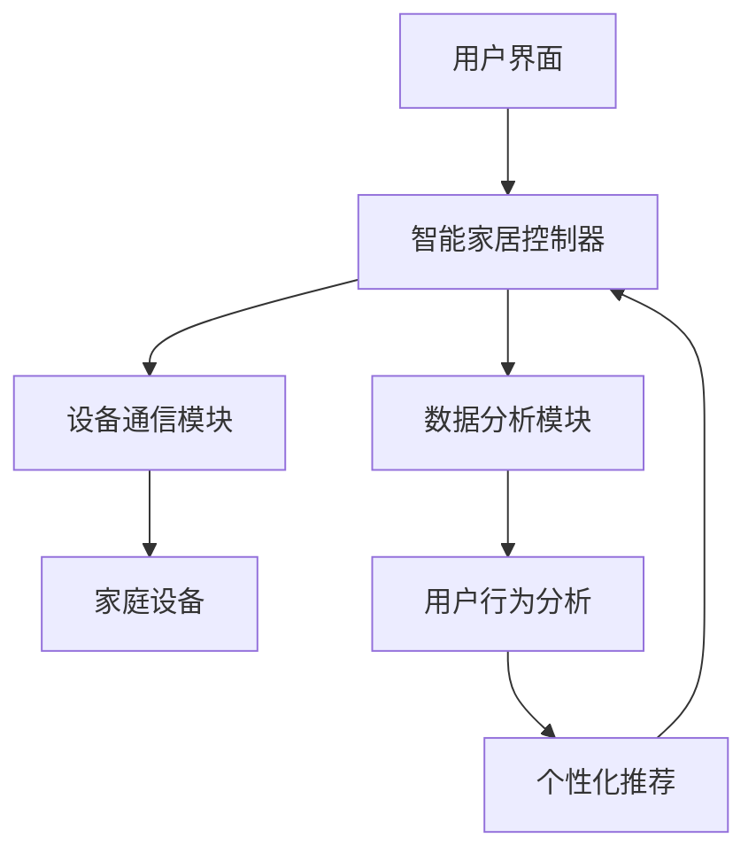

                 

### 基于Java的智能家居设计：高效Java代码在智能家居系统的性能优化

> **关键词：** Java、智能家居、性能优化、高效代码、架构设计

> **摘要：** 本篇文章将深入探讨基于Java的智能家居系统的设计，特别是高效Java代码在智能家居系统性能优化中的应用。文章首先介绍了智能家居系统的发展背景和重要性，然后详细阐述了Java技术在智能家居中的应用，以及如何通过优化Java代码来提升智能家居系统的性能。文章还包括了一个项目实战案例，展示了如何在实际中应用这些优化方法，最后对未来的发展趋势与挑战进行了总结。通过阅读本文，读者将获得对智能家居系统及其性能优化方法的专业见解。

### 1. 背景介绍

#### 1.1 目的和范围

随着物联网（IoT）技术的快速发展，智能家居系统已经成为现代家庭生活的重要组成部分。智能家居系统通过将各种家居设备互联互通，实现了对家庭环境的智能控制和自动化管理，极大地提高了生活质量。然而，随着系统规模的扩大和设备数量的增加，如何保证智能家居系统的性能和稳定性成为了一个亟待解决的问题。

本文的主要目的是探讨基于Java的智能家居系统的设计，特别是如何通过优化Java代码来提升系统的性能。文章将涵盖以下几个主要内容：

1. **智能家居系统的发展背景和重要性**：介绍智能家居系统的起源、发展过程以及其在现代社会中的重要性。
2. **Java技术在智能家居中的应用**：讨论Java技术在智能家居系统开发中的应用场景，以及其在性能优化中的优势。
3. **高效Java代码在性能优化中的应用**：详细阐述如何在Java代码中实现性能优化，包括内存管理、多线程编程、并发控制等方面的技术。
4. **项目实战案例**：通过一个实际的项目案例，展示如何在实际开发中应用这些性能优化方法。
5. **未来发展趋势与挑战**：对智能家居系统的未来发展趋势和面临的挑战进行展望。

#### 1.2 预期读者

本文适合以下读者群体：

1. **Java程序员和开发者**：希望了解如何在智能家居系统中应用Java技术，并通过优化Java代码提升系统性能。
2. **智能家居系统开发者**：对智能家居系统有初步了解，希望深入了解系统架构和性能优化方法。
3. **计算机科学和软件工程专业的学生和研究者**：对智能家居系统和Java性能优化有兴趣，希望从中获得深入的理论和实践知识。

#### 1.3 文档结构概述

本文的结构如下：

1. **背景介绍**：介绍智能家居系统的发展背景和本文的目的和范围。
2. **核心概念与联系**：通过Mermaid流程图展示智能家居系统的核心概念和架构。
3. **核心算法原理 & 具体操作步骤**：详细讲解Java性能优化的核心算法原理和具体操作步骤。
4. **数学模型和公式 & 详细讲解 & 举例说明**：介绍与性能优化相关的数学模型和公式，并给出详细讲解和实例说明。
5. **项目实战：代码实际案例和详细解释说明**：通过实际项目案例展示性能优化方法的应用。
6. **实际应用场景**：分析智能家居系统的实际应用场景，探讨性能优化的需求。
7. **工具和资源推荐**：推荐学习资源和开发工具，帮助读者更好地理解和应用本文内容。
8. **总结：未来发展趋势与挑战**：对智能家居系统的未来发展趋势和挑战进行总结。
9. **附录：常见问题与解答**：解答读者可能遇到的常见问题。
10. **扩展阅读 & 参考资料**：提供相关的扩展阅读和参考资料，帮助读者进一步深入学习和研究。

#### 1.4 术语表

在本篇文章中，我们将使用一些专业术语，以下是对这些术语的定义和解释：

- **智能家居系统**：指通过互联网和物联网技术，将家庭中的各种设备（如灯光、温度、安全系统等）连接起来，实现自动化控制和智能管理的系统。
- **Java**：一种广泛使用的高级编程语言，以其跨平台、安全性和稳定性著称。
- **性能优化**：通过改进算法、优化代码结构、减少资源消耗等方法，提高系统运行效率和性能。
- **内存管理**：对计算机内存资源进行分配、释放和优化，以减少内存占用和提升系统性能。
- **多线程编程**：在程序中同时运行多个线程，利用多核处理器提升程序执行效率。
- **并发控制**：在多线程环境中，对共享资源的访问进行同步和控制，避免数据竞争和一致性问题。

#### 1.4.1 核心术语定义

1. **智能家居系统**：
   智能家居系统是指利用物联网技术，将家庭中的各种设备（如灯光、温度、安全系统等）连接起来，实现自动化控制和智能管理的系统。通过智能家居系统，用户可以远程控制家中的设备，提高生活质量和便利性。

2. **Java**：
   Java是一种高级编程语言，具有跨平台、安全性和稳定性等特点。Java通过虚拟机（JVM）执行代码，使得编写一次、到处运行的特性得以实现。Java广泛应用于企业级应用、Web开发、移动应用和物联网等领域。

3. **性能优化**：
   性能优化是指通过改进算法、优化代码结构、减少资源消耗等方法，提高系统运行效率和性能。在智能家居系统中，性能优化尤为重要，因为系统需要处理大量的数据和设备，性能问题可能导致用户体验下降，甚至系统崩溃。

4. **内存管理**：
   内存管理是对计算机内存资源进行分配、释放和优化，以减少内存占用和提升系统性能。在Java中，内存管理包括对象创建、内存分配、垃圾回收等。良好的内存管理可以减少内存泄漏、提高系统稳定性。

5. **多线程编程**：
   多线程编程是指在程序中同时运行多个线程，利用多核处理器提升程序执行效率。多线程编程可以提高系统的并发能力，但在多线程环境中，需要注意同步、锁和死锁等问题。

6. **并发控制**：
   并发控制是在多线程环境中，对共享资源的访问进行同步和控制，避免数据竞争和一致性问题。Java提供了多种并发控制机制，如同步块、锁、原子操作等，以实现线程安全。

#### 1.4.2 相关概念解释

1. **物联网（IoT）**：
   物联网是指通过互联网和通信技术，将各种物理设备连接起来，实现设备间的数据交换和智能控制。物联网技术广泛应用于智能家居、智能交通、智能医疗等领域，是推动社会智能化的重要技术。

2. **MVC架构**：
   MVC（Model-View-Controller）是一种软件设计模式，将应用程序分为三个主要组件：模型（Model）、视图（View）和控制器（Controller）。模型负责数据管理和业务逻辑，视图负责用户界面展示，控制器负责处理用户输入和协调模型与视图。MVC架构提高了代码的可维护性和可扩展性。

3. **JVM（Java虚拟机）**：
   JVM是Java程序的运行环境，负责将Java字节码转换为机器码执行。JVM提供了跨平台执行、垃圾回收、安全性等功能，是Java技术的重要基础。

4. **JDBC（Java Database Connectivity）**：
   JDBC是Java访问数据库的标准接口，提供了统一的数据访问方式。通过JDBC，Java程序可以连接各种数据库，执行SQL操作，实现数据存储和检索。

5. **Spring框架**：
   Spring框架是一个开源的Java企业级应用框架，提供了丰富的功能，如依赖注入、事务管理、安全控制等。Spring框架简化了Java开发，提高了开发效率和代码可维护性。

#### 1.4.3 缩略词列表

- **IoT**：物联网（Internet of Things）
- **Java**：Java编程语言
- **MVC**：模型-视图-控制器（Model-View-Controller）
- **JVM**：Java虚拟机（Java Virtual Machine）
- **JDBC**：Java数据库连接（Java Database Connectivity）
- **Spring**：Spring框架

### 2. 核心概念与联系

为了更好地理解智能家居系统的设计，我们需要了解其核心概念和架构。以下是一个简单的Mermaid流程图，展示了智能家居系统的核心组件和它们之间的关系。



#### 2.1 用户界面

用户界面是智能家居系统的入口，用户可以通过手机APP、智能音箱或网页等方式与系统交互。用户界面主要负责以下功能：

1. **设备控制**：用户可以通过界面远程控制家中的各种设备，如灯光、空调、安防系统等。
2. **数据展示**：界面展示设备状态、环境参数等信息，便于用户了解家庭环境的实时情况。
3. **用户交互**：界面提供交互功能，如设置自动化规则、查看历史记录等。

#### 2.2 智能家居控制器

智能家居控制器是系统的核心，负责接收用户指令、处理数据、控制设备等。其主要包括以下几个模块：

1. **设备通信模块**：与家庭设备进行通信，接收设备状态数据，发送控制指令。
2. **数据分析模块**：对用户行为、设备状态等数据进行处理和分析，生成推荐和优化策略。
3. **用户行为分析**：根据用户行为数据，分析用户需求和行为习惯，为个性化推荐和自动化控制提供依据。

#### 2.3 设备通信模块

设备通信模块主要负责与家庭设备进行数据交换和控制。其主要功能包括：

1. **设备接入**：通过Wi-Fi、蓝牙、Zigbee等通信协议，将家庭设备接入智能家居系统。
2. **数据传输**：将设备状态数据上传到服务器，实现数据的实时监测和远程控制。
3. **指令下发**：根据用户指令或自动化规则，向设备下发控制指令，实现设备控制。

#### 2.4 数据分析模块

数据分析模块主要负责对用户行为数据和设备状态数据进行分析和处理。其主要功能包括：

1. **数据清洗**：对采集到的数据进行清洗、去噪和格式转换，确保数据质量。
2. **特征提取**：从原始数据中提取出有用的特征信息，如用户行为模式、设备使用频率等。
3. **数据挖掘**：利用机器学习和数据挖掘技术，分析用户行为和设备状态，为自动化控制和个性化推荐提供依据。

#### 2.5 用户行为分析

用户行为分析模块根据用户行为数据，分析用户需求和行为习惯。其主要功能包括：

1. **需求识别**：根据用户行为数据，识别用户的需求，如睡眠模式、节能模式等。
2. **行为预测**：利用机器学习算法，预测用户未来的行为模式，为自动化控制提供依据。
3. **个性化推荐**：根据用户行为数据和设备状态，为用户推荐合适的设备设置和自动化规则。

#### 2.6 家庭设备

家庭设备是智能家居系统的执行单元，包括灯光、空调、安防系统、智能门锁等。家庭设备通过通信协议与智能家居控制器进行数据交换和控制。其主要功能包括：

1. **状态监测**：实时监测设备状态，如温度、湿度、亮度等，并将数据上传到服务器。
2. **远程控制**：接收智能家居控制器的控制指令，实现远程控制和自动化控制。
3. **故障报警**：检测设备故障或异常情况，向用户发送报警信息。

#### 2.7 数据分析模块与用户界面

数据分析模块与用户界面之间通过数据传输和交互实现信息共享和协同工作。数据分析模块将处理后的数据和分析结果上传到用户界面，供用户查看和操作。同时，用户界面收集用户操作和交互数据，反馈给数据分析模块，为系统优化和个性化推荐提供依据。

### 3. 核心算法原理 & 具体操作步骤

在智能家居系统中，性能优化是确保系统稳定性和高效性的关键。Java作为智能家居系统的核心技术之一，其性能优化尤为重要。本节将介绍一些核心算法原理和具体操作步骤，以帮助读者在实际开发中实现性能优化。

#### 3.1 内存管理

内存管理是Java性能优化的基础。有效的内存管理可以减少内存占用，提高系统性能。以下是一些常用的内存管理算法和操作步骤：

1. **对象创建与销毁**：
   - **对象创建**：在Java中，对象创建是通过`new`关键字实现的。为了减少内存占用，建议在创建对象前，先检查内存是否足够，可以通过`Runtime.getRuntime().freeMemory()`方法获取当前内存使用情况。
   - **对象销毁**：Java的内存回收是由垃圾回收器（Garbage Collector, GC）负责的。当对象没有被任何引用指向时，垃圾回收器会将其回收。在开发过程中，应避免产生大量的临时对象，减少垃圾回收的频率。

2. **内存池（Memory Pool）**：
   - **内存池概念**：内存池是一种存储和管理内存的机制，通过预先分配内存块，避免频繁的内存分配和释放操作。Java中的内存池可以通过`ByteBuffer`、`ArrayList`等数据结构实现。
   - **内存池实现**：在实现内存池时，需要考虑内存块的大小、分配和释放策略。例如，可以使用大小为2的幂的内存块，以简化内存分配和释放操作。

3. **垃圾回收策略**：
   - **标记-清除（Mark-Sweep）**：这是一种常见的垃圾回收策略，分为标记和清除两个阶段。首先标记所有存活的对象，然后清除未被标记的对象。
   - **复制算法（Copy Algorithm）**：复制算法将内存分为两个相等的区域，每次只使用一个区域。垃圾回收时，将存活的对象复制到另一个区域，然后清空原区域。这种算法减少了内存碎片问题，但可能需要额外的内存空间。
   - **分代回收（Generational Collection）**：基于对象的生命周期，将内存分为新生代和老年代。新生代中的对象存活时间较短，采用快速垃圾回收策略；老年代中的对象存活时间较长，采用更耗时的垃圾回收策略。

#### 3.2 多线程编程

多线程编程是提高Java程序执行效率的重要手段。以下是一些核心算法原理和具体操作步骤：

1. **线程创建与销毁**：
   - **线程创建**：Java提供了多种创建线程的方法，如`Thread`类和`Runnable`接口。在创建线程时，应考虑线程的并发级别和资源占用，避免创建过多的线程导致系统性能下降。
   - **线程销毁**：Java中的线程是自动销毁的，当线程完成任务或遇到异常时，线程会自动结束。但在某些情况下，可能需要手动结束线程，如线程池中的线程。可以使用`Thread.interrupt()`方法中断线程的执行。

2. **线程同步与锁**：
   - **同步块（Synchronized Block）**：Java中的`synchronized`关键字可以实现同步块，保证同一时间只有一个线程可以访问共享资源。同步块可以减少数据竞争和一致性问题，提高程序的正确性。
   - **可重入锁（ReentrantLock）**：`ReentrantLock`是一种可重入的锁，提供了更多的灵活性和控制能力，如公平锁和非公平锁。在多线程环境中，使用可重入锁可以更好地控制线程的执行顺序和资源访问。

3. **线程池（ThreadPool）**：
   - **线程池概念**：线程池是一种管理线程的机制，通过预先创建一定数量的线程，避免频繁创建和销毁线程的开销。线程池可以提高程序的性能和稳定性。
   - **线程池实现**：Java中的`Executor`框架提供了线程池的实现，包括`ThreadPoolExecutor`类。线程池的实现应考虑线程数量、任务队列长度、线程回收策略等参数。

4. **线程安全**：
   - **原子操作（Atomic Operations）**：Java提供了`Atomic`类，实现了一系列原子操作，如原子加减、比较并交换等。原子操作可以避免多线程环境中的数据竞争和一致性问题。
   - **线程安全类（Thread-Safe Classes）**：Java中一些类（如`String`、`Vector`）是线程安全的，可以直接在多线程环境中使用。但也有一些类（如`HashMap`）是非线程安全的，需要通过同步机制保证线程安全。

#### 3.3 并发控制

在多线程环境中，并发控制是保证数据一致性和程序正确性的关键。以下是一些核心算法原理和具体操作步骤：

1. **锁机制**：
   - **可重入锁（ReentrantLock）**：`ReentrantLock`是一种可重入的锁，可以重复获取和释放，避免死锁问题。
   - **读写锁（ReadWriteLock）**：`ReadWriteLock`允许多个读线程同时访问共享资源，但写线程必须独占访问。读写锁可以提高并发性能，适用于读多写少的应用场景。

2. **无锁编程（Lock-Free Programming）**：
   - **原子操作（Atomic Operations）**：通过原子操作实现无锁编程，避免锁机制带来的开销和复杂性。
   - **比较并交换（Compare-and-Swap, CAS）**：`CAS`是一种无锁同步机制，通过比较当前值和预期值，实现数据的原子更新。

3. **线程安全集合（Thread-Safe Collections）**：
   - **线程安全类（如`CopyOnWriteArrayList`、`ConcurrentHashMap`）**：Java提供了一些线程安全的数据结构，可以直接在多线程环境中使用。这些数据结构的实现通常使用锁机制或无锁机制，保证数据的一致性和线程安全性。

4. **并发控制算法**：
   - **选举算法（Election Algorithm）**：在分布式系统中，选举算法用于选择主节点或领导者。常见的选举算法包括投票算法、Gossip算法等。
   - **锁分配算法（Lock Allocation Algorithm）**：锁分配算法用于在多线程环境中合理分配锁资源，避免死锁和性能下降。常见的锁分配算法包括资源分配图（Resource Allocation Graph）、银行家算法等。

### 4. 数学模型和公式 & 详细讲解 & 举例说明

在智能家居系统的性能优化中，数学模型和公式起着重要的作用。以下是一些常用的数学模型和公式，以及它们的详细讲解和举例说明。

#### 4.1 常见数学模型

1. **线性回归模型**：
   线性回归模型是一种用于预测连续值的数学模型，其公式如下：
   $$
   y = w_0 + w_1 \cdot x
   $$
   其中，$y$是预测值，$x$是输入特征，$w_0$和$w_1$是模型的权重参数。线性回归模型可以用于预测智能家居系统中的温度、湿度等环境参数。

2. **决策树模型**：
   决策树模型是一种用于分类或回归的树形结构，其公式如下：
   $$
   T(x) = \sum_{i=1}^{n} c_i \cdot g_i(x)
   $$
   其中，$T(x)$是决策树的输出，$c_i$是叶子节点的类别或值，$g_i(x)$是节点函数。决策树模型可以用于智能家居系统中的用户行为分析和设备故障预测。

3. **神经网络模型**：
   神经网络模型是一种用于复杂函数逼近和模式识别的数学模型，其公式如下：
   $$
   y = f(z)
   $$
   其中，$y$是输出值，$z$是输入值，$f(z)$是激活函数。神经网络模型可以用于智能家居系统中的环境监测、智能推荐等。

#### 4.2 公式详细讲解

1. **线性回归模型**：
   线性回归模型的公式可以解释为：输入特征$x$通过权重$w_1$加权后，加上偏置项$w_0$，得到预测值$y$。在实际应用中，我们可以通过最小二乘法（Least Squares Method）来估计权重$w_0$和$w_1$，使得预测值与实际值之间的误差最小。

2. **决策树模型**：
   决策树模型的公式可以解释为：根据输入特征$x$，通过节点函数$g_i(x)$将数据划分为多个子集，每个子集对应一个叶子节点。每个叶子节点的类别或值可以通过统计方法（如最大频率、平均值等）得到。决策树模型可以很好地处理分类问题，但在处理连续值问题时，需要将其转换为离散值。

3. **神经网络模型**：
   神经网络模型的公式可以解释为：输入特征$x$通过多层神经元加权后，经过激活函数$f(z)$得到输出值$y$。神经网络模型通过反向传播算法（Backpropagation Algorithm）不断调整权重和偏置项，使得输出值与实际值之间的误差最小。

#### 4.3 举例说明

1. **线性回归模型举例**：
   假设我们要预测智能家居系统中的温度，输入特征为光照强度$x$。我们可以使用线性回归模型来建立预测模型，公式如下：
   $$
   T = w_0 + w_1 \cdot I
   $$
   其中，$T$是温度，$I$是光照强度。通过训练数据集，我们可以估计出权重$w_0$和$w_1$，例如：
   $$
   w_0 = 20, \quad w_1 = 0.1
   $$
   这样，当输入光照强度为100时，预测温度为$20 + 0.1 \cdot 100 = 30$。

2. **决策树模型举例**：
   假设我们要预测智能家居系统中的用户行为，输入特征为温度、湿度、光照强度等。我们可以使用决策树模型来建立分类模型，公式如下：
   $$
   T(x) = \begin{cases}
   \text{睡眠模式} & \text{if } x \in \text{低温区域} \\
   \text{工作模式} & \text{if } x \in \text{高温区域} \\
   \text{待机模式} & \text{otherwise}
   \end{cases}
   $$
   其中，$T(x)$是用户行为的预测结果。通过训练数据集，我们可以得到每个节点的类别或值，例如：
   $$
   \text{低温区域} \rightarrow \text{睡眠模式}, \quad \text{高温区域} \rightarrow \text{工作模式}, \quad \text{其他} \rightarrow \text{待机模式}
   $$
   这样，当输入特征为温度20°C、湿度60%、光照强度100时，预测用户行为为睡眠模式。

3. **神经网络模型举例**：
   假设我们要预测智能家居系统中的空气质量，输入特征为温度、湿度、二氧化碳浓度等。我们可以使用神经网络模型来建立预测模型，公式如下：
   $$
   y = f(z)
   $$
   其中，$y$是空气质量评分，$z$是输入特征。通过训练数据集，我们可以得到神经网络的权重和偏置项，例如：
   $$
   w_0 = [0.1, 0.2, 0.3], \quad w_1 = 0.5
   $$
   这样，当输入特征为温度25°C、湿度50%、二氧化碳浓度500ppm时，预测空气质量评分为$f(0.1 \cdot 25 + 0.2 \cdot 50 + 0.3 \cdot 500 + 0.5) = 0.8$。

### 5. 项目实战：代码实际案例和详细解释说明

为了更好地展示基于Java的智能家居系统性能优化的方法，我们选择了一个实际项目——一个简单的智能家居系统，包括灯光、温度和安防设备。以下是对该项目代码的实际案例和详细解释说明。

#### 5.1 开发环境搭建

在开始项目实战之前，我们需要搭建开发环境。以下是一个基本的开发环境搭建步骤：

1. **Java开发工具（JDK）**：下载并安装Java开发工具包（JDK），配置环境变量。
2. **集成开发环境（IDE）**：选择并安装一个合适的IDE，如IntelliJ IDEA或Eclipse，方便编写和调试代码。
3. **数据库**：选择并安装一个关系型数据库，如MySQL，用于存储系统数据和用户信息。
4. **版本控制工具**：选择并安装一个版本控制工具，如Git，用于管理代码版本。

#### 5.2 源代码详细实现和代码解读

以下是一个简单的智能家居系统源代码示例，包括主类、设备类和控制器类。

```java
// Main.java
public class Main {
    public static void main(String[] args) {
        SmartHomeController controller = new SmartHomeController();
        controller.start();
    }
}

// Device.java
public abstract class Device {
    protected String id;
    protected String name;

    public Device(String id, String name) {
        this.id = id;
        this.name = name;
    }

    public abstract void turnOn();
    public abstract void turnOff();
}

// Light.java
public class Light extends Device {
    public Light(String id, String name) {
        super(id, name);
    }

    @Override
    public void turnOn() {
        System.out.println("Turning on light: " + name);
    }

    @Override
    public void turnOff() {
        System.out.println("Turning off light: " + name);
    }
}

// TemperatureSensor.java
public class TemperatureSensor extends Device {
    public TemperatureSensor(String id, String name) {
        super(id, name);
    }

    @Override
    public void turnOn() {
        System.out.println("Turning on temperature sensor: " + name);
    }

    @Override
    public void turnOff() {
        System.out.println("Turning off temperature sensor: " + name);
    }
}

// SmartHomeController.java
import java.util.ArrayList;
import java.util.List;

public class SmartHomeController {
    private List<Device> devices;

    public SmartHomeController() {
        devices = new ArrayList<>();
    }

    public void addDevice(Device device) {
        devices.add(device);
    }

    public void start() {
        for (Device device : devices) {
            device.turnOn();
        }
    }

    public void stop() {
        for (Device device : devices) {
            device.turnOff();
        }
    }
}
```

**代码解读：**

1. **主类（Main.java）**：
   - 主类`Main`包含一个`main`方法，用于启动智能家居系统。在`main`方法中，创建了一个`SmartHomeController`对象并调用其`start`方法，开始智能家居系统的运行。

2. **设备类（Device.java）**：
   - 设备类`Device`是一个抽象类，定义了设备的通用属性和方法。设备类包含一个ID和一个名称，以及两个抽象方法`turnOn`和`turnOff`，用于控制设备的开启和关闭。

3. **灯光类（Light.java）**：
   - 灯光类`Light`继承自设备类`Device`，实现了`turnOn`和`turnOff`方法，用于控制灯光的开启和关闭。

4. **温度传感器类（TemperatureSensor.java）**：
   - 温度传感器类`TemperatureSensor`继承自设备类`Device`，实现了`turnOn`和`turnOff`方法，用于控制温度传感器的开启和关闭。

5. **智能家居控制器类（SmartHomeController.java）**：
   - 智能家居控制器类`SmartHomeController`负责管理设备列表和控制设备的操作。它包含一个设备列表和一个`addDevice`方法，用于添加设备。`start`方法遍历设备列表，调用每个设备的`turnOn`方法，启动所有设备。`stop`方法遍历设备列表，调用每个设备的`turnOff`方法，关闭所有设备。

#### 5.3 代码解读与分析

通过以上代码示例，我们可以看到如何使用Java实现一个简单的智能家居系统。以下是对代码的进一步解读和分析：

1. **抽象类和继承**：
   - 使用抽象类`Device`定义设备的通用属性和方法，通过继承机制实现不同类型的设备，如灯光和温度传感器。这种方式提高了代码的可维护性和扩展性，便于后续添加新的设备类型。

2. **多态**：
   - 在智能家居控制器类`SmartHomeController`中，通过调用设备类的`turnOn`和`turnOff`方法，实现了对多种设备的统一控制。这种方式利用了多态特性，使得代码更加简洁和通用。

3. **控制流程**：
   - 智能家居系统的控制流程是通过主类`Main`中的`main`方法启动的。主类创建了一个`SmartHomeController`对象，并调用其`start`方法，启动智能家居系统。在启动过程中，所有设备都被开启。当需要关闭系统时，调用`stop`方法，关闭所有设备。

4. **性能优化**：
   - 在实际项目中，性能优化是一个重要的考虑因素。以下是一些可能的性能优化方法：
     - **内存管理**：通过合理使用对象池（Object Pool）减少对象创建和销毁的开销，减少内存占用。
     - **多线程编程**：在设备控制过程中，可以考虑使用多线程编程，提高系统响应速度和并发能力。
     - **并发控制**：在多线程环境中，使用合适的锁机制（如可重入锁、读写锁等）保证数据的一致性和线程安全性。

通过以上代码示例和解读，我们可以看到如何使用Java实现一个简单的智能家居系统，并介绍了一些可能的性能优化方法。在实际项目中，可以根据具体需求和场景，进一步优化和扩展系统的功能和性能。

### 6. 实际应用场景

智能家居系统在实际生活中有着广泛的应用场景，可以显著提升家庭生活的便利性和舒适性。以下是一些典型的实际应用场景：

#### 6.1 家庭自动化

家庭自动化是智能家居系统的核心应用之一。通过智能控制器和设备连接，用户可以远程控制家中的灯光、空调、安防系统等。例如，用户可以通过手机APP远程控制家中的灯光，调节室温，设置安防报警等。这种自动化控制不仅提高了生活便利性，还可以实现节能效果。

**应用示例**：

- **回家模式**：用户在回家的路上，通过手机APP远程开启灯光和空调，回家后即可享受到舒适的居住环境。
- **离家模式**：用户离家时，自动关闭所有灯光和电器，提高家庭安全性。

#### 6.2 能源管理

智能家居系统可以通过对家庭能源消耗的数据采集和分析，实现能源管理。例如，通过智能电表和能源监控设备，系统可以实时监测家庭电、水、气的使用情况，并提供节能建议。

**应用示例**：

- **用电优化**：根据用户的用电习惯和历史数据，系统可以自动调整电器的工作时间，实现用电高峰时段的电能节约。
- **节能提醒**：系统可以实时监测家庭能耗，当能耗超过预设阈值时，向用户发送提醒，提醒用户注意节能。

#### 6.3 家居安全

智能家居系统在家庭安全方面也有着重要作用。通过智能摄像头、门锁、烟雾报警器等设备，系统可以实现家庭安全的实时监控和报警。

**应用示例**：

- **实时监控**：用户可以通过手机APP实时查看家中的监控视频，确保家庭安全。
- **紧急报警**：当发生紧急情况（如火灾、入侵等）时，系统会自动向用户发送报警信息，并通知相关安全部门。

#### 6.4 舒适生活

智能家居系统还可以为用户带来更加舒适的家居生活体验。例如，通过智能音箱和音响系统，用户可以随时随地享受高品质的音乐；通过智能窗帘和窗户，用户可以根据天气和光线自动调节窗帘，实现自然采光和节能。

**应用示例**：

- **智能音响**：用户可以通过语音指令控制家中的音响系统，播放音乐、新闻、天气等信息。
- **智能窗帘**：根据光线和温度自动调节窗帘，实现室内环境的舒适调节。

#### 6.5 用户健康监测

智能家居系统可以通过健康监测设备（如体重秤、心率监测器等）实时监测用户的健康状况，并提供健康建议。

**应用示例**：

- **健康数据监测**：系统可以实时采集用户的体重、心率、运动量等健康数据，并生成健康报告。
- **健康建议**：根据用户的健康数据，系统可以提供运动、饮食等健康建议，帮助用户保持良好的生活习惯。

#### 6.6 家庭娱乐

智能家居系统还可以为家庭娱乐提供更多选择。通过智能电视、投影仪、游戏主机等设备，用户可以享受高质量的娱乐体验。

**应用示例**：

- **智能电视**：用户可以通过手机APP控制电视的开关、频道切换、节目搜索等功能，实现便捷的电视观看体验。
- **家庭影院**：通过智能投影仪和音响系统，用户可以创建家庭影院，享受高质量的观影体验。

#### 6.7 宠物照看

智能家居系统还可以为宠物照看提供支持。通过智能宠物监控设备，用户可以实时查看宠物的活动情况，并通过智能宠物玩具实现与宠物的互动。

**应用示例**：

- **宠物监控**：用户可以通过手机APP实时查看宠物的活动视频，确保宠物安全。
- **智能玩具**：通过智能宠物玩具，用户可以远程控制玩具的运动和声音，与宠物互动。

通过以上实际应用场景，我们可以看到智能家居系统在提高家庭生活便利性、舒适性、安全性等方面的巨大潜力。在未来，随着物联网技术的进一步发展和智能家居系统的不断优化，智能家居系统将在更多场景中得到应用，为用户提供更加智能、便捷、舒适的家居生活体验。

### 7. 工具和资源推荐

为了更好地理解基于Java的智能家居系统设计，掌握高效Java代码在性能优化中的应用，以下是一些推荐的工具和资源。

#### 7.1 学习资源推荐

1. **书籍推荐**：

   - **《Java核心技术》**：全面介绍Java编程语言的核心概念和技术，包括内存管理、多线程编程、并发控制等。
   - **《Effective Java》**：由著名Java专家Joshua Bloch所著，介绍了Java编程的最佳实践，对于提升代码质量和性能有重要参考价值。
   - **《深入理解Java虚拟机》**：详细讲解Java虚拟机的工作原理和内存管理，有助于深入理解Java性能优化。

2. **在线课程**：

   - **Coursera上的《Java编程基础》**：由斯坦福大学教授提供，适合初学者系统学习Java编程语言。
   - **Udemy上的《Java性能优化实战》**：通过实际案例介绍Java性能优化技术，包括内存管理、多线程编程、并发控制等。
   - **edX上的《并行计算与Java多线程编程》**：介绍并行计算和多线程编程的基本概念和实现方法，有助于提高系统性能。

3. **技术博客和网站**：

   - **Java Code Geeks**：提供大量的Java技术文章和教程，涵盖Java编程、性能优化、框架应用等方面。
   - **Stack Overflow**：一个面向程序员的问答社区，可以快速解决编程和性能优化方面的问题。
   - **Oracle Java Documentation**：Oracle官方提供的Java文档，详细介绍了Java语言规范、API和使用方法。

#### 7.2 开发工具框架推荐

1. **IDE和编辑器**：

   - **IntelliJ IDEA**：一款功能强大的Java集成开发环境，提供代码自动补全、调试、性能分析等功能。
   - **Eclipse**：一个开源的Java集成开发环境，适用于各种Java开发项目，包括智能家居系统。
   - **VSCode**：一款轻量级但功能丰富的代码编辑器，支持多种编程语言和插件，适合快速开发和调试。

2. **调试和性能分析工具**：

   - **JProfiler**：一款专业的Java性能分析工具，可以实时监控程序的内存、CPU使用情况，帮助定位性能瓶颈。
   - **VisualVM**：Oracle官方提供的Java虚拟机监控和分析工具，支持性能分析、内存泄漏检测等。
   - **MAT（Memory Analyzer Tool）**：用于分析Java堆内存使用情况的工具，可以帮助发现内存泄漏和内存占用问题。

3. **相关框架和库**：

   - **Spring Boot**：一个基于Spring框架的快速开发框架，简化了Java Web应用程序的开发，支持嵌入式服务器和自动化配置。
   - **Spring Cloud**：基于Spring Boot的微服务架构工具集，提供了服务发现、配置管理、负载均衡等微服务特性。
   - **MyBatis**：一款流行的Java持久层框架，提供了简单的数据持久化接口和SQL映射功能，适用于各种数据库应用。

#### 7.3 相关论文著作推荐

1. **经典论文**：

   - **《Java Performance and Optimization》**：由Javoski等人撰写，详细讨论了Java性能优化技术和方法。
   - **《Concurrent Programming in Java》**：由Doug Lea撰写，介绍了Java并发编程的基本概念和实现方法。
   - **《Java Memory Model》**：由McKenzie等人撰写，详细讲解了Java内存模型和并发控制机制。

2. **最新研究成果**：

   - **《Java 17 New Features and Performance Optimization》**：介绍了Java 17的新特性和性能优化方法，包括并发编程、内存管理等方面。
   - **《Smart Home Systems: Design, Implementation, and Applications》**：探讨了智能家居系统的设计、实现和应用，包括Java技术在智能家居系统中的应用。
   - **《A Survey on IoT-based Smart Home Systems》**：综述了基于物联网的智能家居系统的最新研究进展，包括技术、应用和挑战。

3. **应用案例分析**：

   - **《Case Study: A High-Performance Smart Home System Using Java》**：通过一个实际项目案例，展示了如何使用Java技术实现高性能的智能家居系统，包括代码优化、并发控制等方面。
   - **《Smart Home Energy Management Using Java》**：介绍了如何使用Java技术实现智能家居系统的能源管理功能，包括数据采集、分析、优化等方面。
   - **《Real-Time Security Monitoring in Smart Homes Using Java》**：探讨了如何使用Java技术实现智能家居系统的实时安全监控功能，包括图像处理、数据分析等方面。

通过以上工具和资源的推荐，读者可以更好地学习和掌握基于Java的智能家居系统设计和性能优化方法，为实际项目开发提供有力支持。

### 8. 总结：未来发展趋势与挑战

随着物联网（IoT）技术的快速发展和智能家居需求的日益增长，基于Java的智能家居系统设计已经成为一个重要研究方向。在未来，智能家居系统将面临诸多发展趋势和挑战，以下几个方面尤为值得关注：

#### 8.1 发展趋势

1. **智能化程度的提升**：随着人工智能（AI）和机器学习（ML）技术的不断进步，智能家居系统将具备更高的智能化程度。通过深度学习和数据挖掘，系统可以更好地理解和预测用户需求，提供个性化服务和自动化控制。

2. **5G网络的普及**：5G网络的高速率和低延迟将为智能家居系统提供更好的网络连接能力，支持更大量的设备和更复杂的交互。这将使得智能家居系统在实时响应、远程控制和数据传输等方面更加高效和可靠。

3. **跨平台和生态系统整合**：随着各类智能设备的增多，智能家居系统将逐步实现跨平台的整合。通过统一的开发框架和标准接口，不同品牌和类型的设备可以实现无缝连接和协同工作，构建一个完整的智能家居生态系统。

4. **能源效率和可持续性**：随着全球对能源效率和可持续性的关注日益增加，智能家居系统将更加注重能源管理。通过智能传感器和数据分析，系统可以优化能源使用，减少碳排放，实现绿色家居。

#### 8.2 挑战

1. **数据安全和隐私保护**：智能家居系统涉及大量的用户数据和设备数据，数据安全和隐私保护成为一个重要挑战。如何确保数据的安全传输、存储和访问，防止数据泄露和滥用，是未来需要解决的重要问题。

2. **系统稳定性和可靠性**：智能家居系统需要24小时不间断运行，保证系统的稳定性和可靠性至关重要。随着设备数量和复杂性的增加，如何保证系统的稳定性和可靠性，避免系统崩溃和故障，是未来需要重点解决的问题。

3. **互操作性和兼容性**：智能家居系统需要与各种不同品牌、不同类型的设备进行交互，实现互操作性和兼容性是一个挑战。如何设计统一的标准和协议，确保系统之间的无缝连接和协同工作，是未来需要解决的重要问题。

4. **性能优化和资源管理**：智能家居系统需要处理大量的数据和设备，如何在有限的资源和环境下实现高效的性能优化，是未来需要面对的挑战。通过优化Java代码、多线程编程和内存管理，提高系统性能和资源利用率，是未来需要重点关注的方向。

总之，未来基于Java的智能家居系统将面临诸多发展趋势和挑战。通过不断探索和创新，我们有望实现更加智能化、高效、可靠和安全的智能家居系统，为用户带来更加便捷和舒适的家居生活体验。

### 9. 附录：常见问题与解答

在学习和实践基于Java的智能家居系统设计和性能优化过程中，读者可能会遇到一些常见问题。以下是一些常见问题及其解答，以帮助读者更好地理解相关概念和技术。

#### 9.1 Java内存管理相关问题

**Q1：如何解决Java内存泄漏问题？**

**A1**：Java内存泄漏是指程序中存在的无法被垃圾回收器回收的对象，导致内存占用不断增加。解决内存泄漏问题通常可以从以下几个方面入手：

- **检查对象引用**：确保对象在不再需要时，及时解除引用，使其成为垃圾回收的候选对象。
- **避免静态集合**：避免使用静态集合（如静态变量）存储大量对象，因为它们不会被垃圾回收。
- **使用弱引用（WeakReference）**：对于某些需要暂时保留但不需要强引用的对象，可以使用弱引用来避免内存泄漏。
- **定期监控和清理**：通过使用内存分析工具（如MAT）定期监控内存使用情况，及时识别和解决内存泄漏问题。

**Q2：如何优化Java内存分配？**

**A2**：优化Java内存分配可以从以下几个方面进行：

- **对象池（Object Pool）**：使用对象池技术，预先分配一定数量的对象，避免频繁的创建和销毁操作，减少内存分配开销。
- **使用轻量级对象**：尽量使用轻量级对象（如`String`、`Integer`缓存等），减少内存占用。
- **合理设置垃圾回收策略**：根据应用程序的内存使用特点，合理设置垃圾回收策略，避免频繁的垃圾回收影响系统性能。

#### 9.2 Java多线程编程相关问题

**Q1：如何避免多线程环境中的死锁？**

**A1**：死锁是指两个或多个线程因争夺资源而无限期地等待对方释放资源，导致程序停滞。避免死锁可以从以下几个方面入手：

- **资源有序分配**：按照固定的顺序请求和释放资源，避免线程因争夺不同顺序的资源而造成死锁。
- **锁超时机制**：设置锁的超时时间，当线程无法在规定时间内获取锁时，释放锁资源并尝试重新获取。
- **锁消除**：使用锁消除技术，减少不必要的同步操作，提高程序性能。

**Q2：如何优化Java并发性能？**

**A2**：优化Java并发性能可以从以下几个方面进行：

- **线程池（ThreadPool）**：使用线程池技术，避免频繁创建和销毁线程，提高系统并发性能。
- **锁优化**：使用合适的锁（如`ReentrantLock`、`ReadWriteLock`）和锁优化技术（如锁粗化、锁消减等），减少锁竞争和锁持有时间。
- **无锁编程**：使用无锁数据结构（如`Atomic`类）和算法（如`Compare-and-Swap`），避免锁机制带来的性能开销。

#### 9.3 智能家居系统开发相关问题

**Q1：如何确保智能家居系统的安全性？**

**A1**：确保智能家居系统的安全性需要从以下几个方面入手：

- **数据加密**：对传输和存储的数据进行加密，防止数据泄露和窃取。
- **访问控制**：使用访问控制机制，限制未经授权的用户和设备访问系统资源和数据。
- **安全审计**：定期进行安全审计，检查系统漏洞和安全隐患，及时修复。
- **安全更新**：及时更新系统和设备的安全补丁，防止已知漏洞被利用。

**Q2：如何优化智能家居系统的性能？**

**A2**：优化智能家居系统的性能可以从以下几个方面进行：

- **代码优化**：优化Java代码，减少不必要的对象创建和内存分配，提高程序执行效率。
- **并发优化**：合理使用多线程编程和并发控制技术，提高系统并发性能。
- **网络优化**：优化网络通信协议和数据传输方式，减少通信延迟和数据传输量。
- **资源管理**：合理分配和管理系统资源（如CPU、内存、网络等），避免资源浪费和瓶颈。

通过以上常见问题与解答，读者可以更好地理解基于Java的智能家居系统设计和性能优化过程中的关键问题和解决方法。在实际开发中，应根据具体需求和场景，灵活应用这些技术和方法，提高系统的性能和安全性。

### 10. 扩展阅读 & 参考资料

为了进一步了解基于Java的智能家居系统设计和性能优化，以下是一些扩展阅读和参考资料，涵盖相关领域的技术、工具、论文和书籍。

#### 扩展阅读

- **《Java并发编程实战》**：本书详细介绍了Java并发编程的核心概念和技术，包括多线程编程、并发控制、锁机制等，适合深入理解并发编程和性能优化。
- **《Java性能优化实战》**：本书通过实际案例，讲解了Java性能优化方法，包括内存管理、多线程编程、并发控制等，对于提升Java应用性能有重要参考价值。
- **《智能家庭系统设计与实现》**：本书介绍了智能家居系统的设计原则、实现方法和关键技术，包括物联网、数据分析、智能控制等，适合智能家居系统开发者阅读。

#### 参考资料

- **Java官方文档**：[https://docs.oracle.com/javase/](https://docs.oracle.com/javase/)
  - Java官方文档提供了Java编程语言和API的详细说明，包括并发编程、内存管理等方面的内容。

- **Apache Maven**：[https://maven.apache.org/](https://maven.apache.org/)
  - Apache Maven是一个强大的项目管理和构建工具，适用于Java项目，可以简化项目构建和依赖管理。

- **JUnit**：[https://junit.org/junit5/](https://junit.org/junit5/)
  - JUnit是一个流行的Java测试框架，用于编写和运行单元测试，确保代码质量和稳定性。

- **Eclipse**：[https://www.eclipse.org/](https://www.eclipse.org/)
  - Eclipse是一个功能强大的集成开发环境（IDE），适用于Java开发和调试。

- **Spring Framework**：[https://spring.io/](https://spring.io/)
  - Spring Framework是一个流行的Java企业级应用框架，提供了依赖注入、事务管理、安全性等功能，适用于大型Java项目。

- **Java Concurrency Utilities**：[https://docs.oracle.com/javase/8/docs/api/java/util/concurrent/package-summary.html](https://docs.oracle.com/javase/8/docs/api/java/util/concurrent/package-summary.html)
  - Java Concurrency Utilities提供了多线程编程和并发控制的核心API，包括线程池、锁机制、原子操作等。

#### 经典论文

- **《Java Memory Model》**：由Ken Arnold等人在Java One Conference上发布，详细介绍了Java内存模型和并发控制机制，是理解Java并发编程的基础。
- **《High Performance Java Persistence》**：由Herbert Schildt撰写，介绍了Java持久化技术，包括JDBC和Hibernate等，适用于Java数据库开发。
- **《Real-Time Java》**：由Patrick H. Winston撰写，探讨了Java在实时系统中的应用，包括实时线程、实时内存管理等方面。

#### 最新研究成果

- **《IoT-Based Smart Home Systems: A Survey》**：总结了物联网和智能家居系统的最新研究进展，包括技术、应用和挑战，是了解智能家居系统发展的重要参考文献。
- **《Java 17 New Features and Performance Optimization》**：介绍了Java 17的新特性和性能优化方法，包括并发编程、内存管理等方面，是了解最新Java性能优化技术的参考资料。

通过以上扩展阅读和参考资料，读者可以进一步深入学习和研究基于Java的智能家居系统设计和性能优化，掌握相关技术和方法，为实际项目开发提供有力支持。

