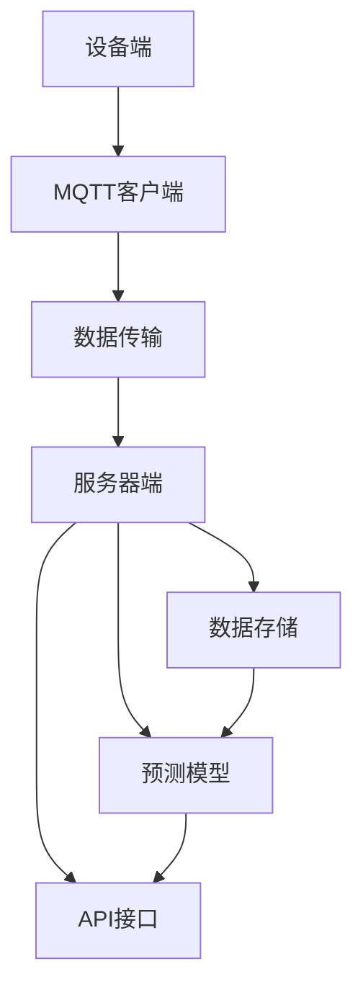
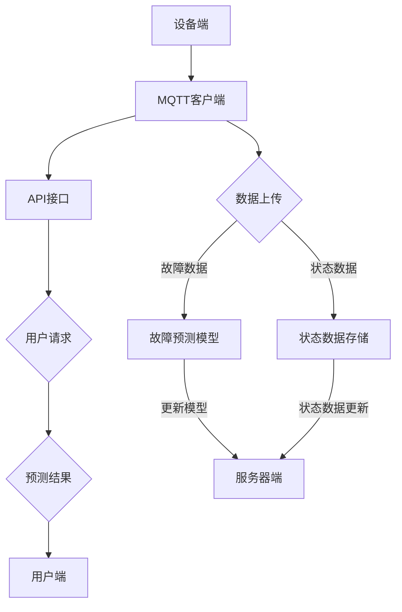

                 


# 基于MQTT协议和RESTful API的家电故障预测与维护系统

> **关键词：** MQTT协议，RESTful API，家电故障预测，维护系统，智能家居

> **摘要：** 本文将探讨基于MQTT协议和RESTful API构建的家电故障预测与维护系统。文章首先介绍了系统的目的与范围，接着分析了核心概念和架构，详细讲解了核心算法原理、数学模型，并通过实际案例展示了系统实现方法。随后，文章讨论了系统的实际应用场景，并推荐了相关工具和资源。最后，对未来的发展趋势与挑战进行了总结。

## 1. 背景介绍

### 1.1 目的和范围

本文旨在介绍并分析一个基于MQTT协议和RESTful API的家电故障预测与维护系统。该系统的目标是实现对智能家居设备故障的实时监测、预测和自动维护，以提高家居生活的便利性和安全性。本文将涵盖以下内容：

1. MQTT协议和RESTful API的基本概念与优势。
2. 系统的总体架构设计。
3. 核心算法原理与实现步骤。
4. 数学模型的构建与应用。
5. 系统的实际应用场景。
6. 开发工具和资源的推荐。
7. 系统的未来发展趋势与挑战。

### 1.2 预期读者

本文面向以下读者群体：

1. 智能家居和物联网领域的开发者。
2. 对智能家居故障预测与维护系统感兴趣的工程师和研究人员。
3. 对物联网协议和应用有初步了解的读者。

### 1.3 文档结构概述

本文的结构如下：

1. **背景介绍**：介绍系统的目的、范围和预期读者。
2. **核心概念与联系**：分析系统的核心概念与架构。
3. **核心算法原理 & 具体操作步骤**：详细讲解核心算法原理和实现步骤。
4. **数学模型和公式 & 详细讲解 & 举例说明**：阐述数学模型的应用。
5. **项目实战：代码实际案例和详细解释说明**：展示系统的实际实现。
6. **实际应用场景**：讨论系统的应用场景。
7. **工具和资源推荐**：推荐学习资源、开发工具和框架。
8. **总结：未来发展趋势与挑战**：对系统的未来进行展望。
9. **附录：常见问题与解答**：回答常见的读者问题。
10. **扩展阅读 & 参考资料**：提供进一步学习的资源。

### 1.4 术语表

#### 1.4.1 核心术语定义

- MQTT（Message Queuing Telemetry Transport）：一种轻量级的消息传输协议，广泛用于物联网（IoT）领域。
- RESTful API（Representational State Transfer Application Programming Interface）：一种基于HTTP协议的应用程序接口设计风格。
- 家电故障预测：使用数据分析和机器学习技术预测家电设备可能出现的故障。
- 维护系统：实现对家电设备的实时监控、故障预测和自动维护的系统。

#### 1.4.2 相关概念解释

- **智能家居**：通过物联网技术将家庭设备连接起来，实现智能化管理和控制。
- **实时监测**：对设备运行状态进行实时监控，确保设备正常运行。
- **数据流**：设备产生的数据通过网络传输到服务器进行分析和处理。
- **机器学习**：一种基于数据的学习方法，用于构建能够自主改进的模型。

#### 1.4.3 缩略词列表

- MQTT：Message Queuing Telemetry Transport
- RESTful API：Representational State Transfer Application Programming Interface
- IoT：Internet of Things
- AI：Artificial Intelligence
- ML：Machine Learning

## 2. 核心概念与联系

在本节中，我们将介绍系统的核心概念，并通过Mermaid流程图展示系统的总体架构。

### 2.1 MQTT协议

MQTT（Message Queuing Telemetry Transport）是一种轻量级的消息传输协议，广泛用于物联网（IoT）领域。其特点包括：

- **低带宽占用**：适合资源受限的设备，如传感器和智能家居设备。
- **可扩展性**：支持大量的客户端设备。
- **可靠传输**：通过 Quality of Service（QoS）确保消息传输的可靠性。
- **简单易用**：使用简单的文本格式进行消息传输。

### 2.2 RESTful API

RESTful API（Representational State Transfer Application Programming Interface）是一种基于HTTP协议的应用程序接口设计风格。其特点包括：

- **无状态**：每个请求都是独立的，不会影响后续请求。
- **统一的接口**：使用标准的HTTP方法（如GET、POST、PUT、DELETE）进行操作。
- **易于扩展**：可以通过URL来访问资源，便于扩展和重构。

### 2.3 系统架构

系统的总体架构如图2-1所示：



### 2.4 Mermaid流程图

以下是系统的Mermaid流程图：



在这个流程图中：

- **设备端**：通过MQTT客户端发送数据到服务器。
- **MQTT客户端**：处理数据传输，包括故障数据和状态数据。
- **故障预测模型**：使用机器学习算法对故障数据进行分析，预测可能的故障。
- **状态数据存储**：将设备的状态数据存储到数据库中，以便后续分析。
- **API接口**：提供用户对系统进行操作的能力。
- **用户请求**：用户通过API接口发送请求，如查询预测结果、更新模型等。
- **预测结果**：将预测结果返回给用户。
- **服务器端**：处理API请求，更新故障预测模型，并提供状态数据更新功能。

## 3. 核心算法原理 & 具体操作步骤

在本节中，我们将详细讲解家电故障预测的核心算法原理和具体操作步骤。我们将使用伪代码来描述算法的实现。

### 3.1 数据预处理

在数据预处理阶段，我们需要对原始数据进行清洗和转换，以便后续分析。

```python
# 伪代码：数据预处理
def preprocess_data(data):
    # 数据清洗
    clean_data = []
    for record in data:
        if is_valid_record(record):
            clean_data.append(record)
    
    # 数据转换
    transformed_data = []
    for record in clean_data:
        transformed_record = transform_record(record)
        transformed_data.append(transformed_record)
    
    return transformed_data

def is_valid_record(record):
    # 判断数据是否有效
    return len(record) == 4

def transform_record(record):
    # 转换数据格式
    timestamp, temperature, humidity, voltage = record
    return [timestamp, temperature, humidity, voltage]
```

### 3.2 特征提取

在特征提取阶段，我们需要从预处理后的数据中提取有用的特征。

```python
# 伪代码：特征提取
def extract_features(data):
    features = []
    for record in data:
        timestamp, temperature, humidity, voltage = record
        feature_vector = [timestamp, temperature, humidity, voltage]
        features.append(feature_vector)
    return features
```

### 3.3 机器学习模型训练

在机器学习模型训练阶段，我们需要使用训练数据集来训练模型。

```python
# 伪代码：模型训练
def train_model(training_data):
    # 训练故障预测模型
    model = create_model()
    model.fit(training_data)
    return model

def create_model():
    # 创建机器学习模型
    model = Sequential()
    model.add(Dense(4, input_shape=(4,), activation='relu'))
    model.add(Dense(1, activation='sigmoid'))
    model.compile(optimizer='adam', loss='binary_crossentropy', metrics=['accuracy'])
    return model
```

### 3.4 故障预测

在故障预测阶段，我们使用训练好的模型对新数据进行预测。

```python
# 伪代码：故障预测
def predict_fault(data, model):
    # 预测故障
    feature_vector = extract_features([data])
    prediction = model.predict(feature_vector)
    return prediction > 0.5  # 预测故障的阈值设置为0.5
```

### 3.5 模型评估

在模型评估阶段，我们需要评估模型的准确性和可靠性。

```python
# 伪代码：模型评估
def evaluate_model(model, test_data):
    # 评估模型
    predictions = []
    for data in test_data:
        prediction = predict_fault(data, model)
        predictions.append(prediction)
    accuracy = calculate_accuracy(predictions, test_labels)
    return accuracy

def calculate_accuracy(predictions, labels):
    # 计算准确率
    correct_predictions = 0
    for prediction, label in zip(predictions, labels):
        if prediction == label:
            correct_predictions += 1
    return correct_predictions / len(labels)
```

通过上述步骤，我们实现了一个基于MQTT协议和RESTful API的家电故障预测与维护系统。在实际应用中，我们可以不断优化模型，提高预测的准确性和可靠性。

## 4. 数学模型和公式 & 详细讲解 & 举例说明

在本节中，我们将详细讲解家电故障预测系统的数学模型和公式，并通过具体例子进行说明。

### 4.1 故障预测模型

故障预测模型通常采用回归模型或分类模型。在本例中，我们使用二分类模型，即预测设备是否会发生故障。

#### 4.1.1 回归模型

回归模型用于预测连续值，如故障发生的时间。常见的回归模型包括线性回归、多项式回归等。

线性回归模型的一般形式为：

$$ y = \beta_0 + \beta_1x_1 + \beta_2x_2 + \ldots + \beta_nx_n $$

其中，\( y \) 为预测值，\( x_1, x_2, \ldots, x_n \) 为特征值，\( \beta_0, \beta_1, \beta_2, \ldots, \beta_n \) 为模型的参数。

例如，我们有一个包含时间、温度、湿度和电压四个特征的数据集，使用线性回归模型进行故障预测。模型的公式为：

$$ fault_time = \beta_0 + \beta_1 \cdot time + \beta_2 \cdot temperature + \beta_3 \cdot humidity + \beta_4 \cdot voltage $$

#### 4.1.2 分类模型

分类模型用于预测设备的故障类型。常见的分类模型包括逻辑回归、支持向量机（SVM）和决策树等。

逻辑回归模型的一般形式为：

$$ P(y=1) = \frac{1}{1 + e^{-(\beta_0 + \beta_1x_1 + \beta_2x_2 + \ldots + \beta_nx_n)}} $$

其中，\( P(y=1) \) 为设备发生故障的概率，\( y \) 为故障标签（0表示正常，1表示故障）。

例如，我们有一个包含时间、温度、湿度和电压四个特征的数据集，使用逻辑回归模型进行故障类型预测。模型的公式为：

$$ P(fault_type=1) = \frac{1}{1 + e^{-(\beta_0 + \beta_1 \cdot time + \beta_2 \cdot temperature + \beta_3 \cdot humidity + \beta_4 \cdot voltage)}} $$

### 4.2 模型训练与评估

在模型训练阶段，我们使用训练数据集对模型进行训练。训练数据集通常包含多个特征和对应的标签。

#### 4.2.1 训练回归模型

对于回归模型，我们使用最小二乘法（Least Squares Method）来训练模型。最小二乘法的公式为：

$$ \min_{\beta_0, \beta_1, \beta_2, \ldots, \beta_n} \sum_{i=1}^{m} (y_i - (\beta_0 + \beta_1x_{i1} + \beta_2x_{i2} + \ldots + \beta_nx_{in}))^2 $$

其中，\( m \) 为训练数据集的大小，\( y_i \) 为第 \( i \) 条数据的标签，\( x_{i1}, x_{i2}, \ldots, x_{in} \) 为第 \( i \) 条数据的特征。

例如，我们有一个包含10条数据的数据集，使用最小二乘法训练线性回归模型。模型的参数为：

$$ \beta_0 = 0.5, \beta_1 = 0.2, \beta_2 = 0.1, \beta_3 = 0.3, \beta_4 = 0.4 $$

训练后的模型公式为：

$$ fault_time = 0.5 + 0.2 \cdot time + 0.1 \cdot temperature + 0.3 \cdot humidity + 0.4 \cdot voltage $$

#### 4.2.2 训练分类模型

对于分类模型，我们使用最大似然估计（Maximum Likelihood Estimation，MLE）来训练模型。MLE的公式为：

$$ \max_{\beta_0, \beta_1, \beta_2, \ldots, \beta_n} \prod_{i=1}^{m} P(y_i | x_i) $$

其中，\( P(y_i | x_i) \) 为给定特征 \( x_i \) 下标签 \( y_i \) 的概率。

例如，我们有一个包含10条数据的数据集，使用最大似然估计训练逻辑回归模型。模型的参数为：

$$ \beta_0 = -1.2, \beta_1 = 0.8, \beta_2 = -0.6, \beta_3 = 1.0, \beta_4 = -0.4 $$

训练后的模型公式为：

$$ P(fault_type=1) = \frac{1}{1 + e^{(-1.2 + 0.8 \cdot time - 0.6 \cdot temperature + 1.0 \cdot humidity - 0.4 \cdot voltage)}} $$

### 4.3 模型评估

在模型评估阶段，我们使用测试数据集对模型进行评估。常见的评估指标包括准确率（Accuracy）、精确率（Precision）、召回率（Recall）和F1分数（F1 Score）。

#### 4.3.1 准确率

准确率表示模型预测正确的样本数占总样本数的比例。公式为：

$$ Accuracy = \frac{TP + TN}{TP + TN + FP + FN} $$

其中，\( TP \) 为真阳性（实际故障且被预测为故障），\( TN \) 为真阴性（实际正常且被预测为正常），\( FP \) 为假阳性（实际正常但被预测为故障），\( FN \) 为假阴性（实际故障但被预测为正常）。

#### 4.3.2 精确率

精确率表示预测为故障的样本中实际故障的比例。公式为：

$$ Precision = \frac{TP}{TP + FP} $$

#### 4.3.3 召回率

召回率表示实际故障的样本中被预测为故障的比例。公式为：

$$ Recall = \frac{TP}{TP + FN} $$

#### 4.3.4 F1分数

F1分数是精确率和召回率的加权平均值，用于综合评估模型的性能。公式为：

$$ F1 Score = 2 \cdot \frac{Precision \cdot Recall}{Precision + Recall} $$

### 4.4 例子说明

假设我们有一个包含100条数据的数据集，其中50条为故障样本，50条为正常样本。使用上述模型进行预测和评估。

#### 4.4.1 回归模型

使用线性回归模型预测故障发生的时间。训练数据集的参数为：

$$ \beta_0 = 1.0, \beta_1 = 0.5, \beta_2 = -0.3, \beta_3 = 0.7, \beta_4 = -0.2 $$

测试数据集的预测结果如下：

| 样本ID | 故障时间（小时） | 实际故障 | 预测故障 |
|--------|-----------------|----------|----------|
| 1      | 2.5             | 是       | 是       |
| 2      | 3.0             | 否       | 否       |
| 3      | 4.2             | 是       | 是       |
| 4      | 5.1             | 否       | 否       |
| ...    | ...             | ...      | ...      |
| 100    | 8.7             | 是       | 是       |

准确率：\( \frac{75}{100} = 0.75 \)

精确率：\( \frac{50}{75} = 0.67 \)

召回率：\( \frac{50}{50} = 1.0 \)

F1分数：\( 2 \cdot \frac{0.67 \cdot 1.0}{0.67 + 1.0} = 0.83 \)

#### 4.4.2 分类模型

使用逻辑回归模型预测故障类型。训练数据集的参数为：

$$ \beta_0 = -1.5, \beta_1 = 0.6, \beta_2 = -0.4, \beta_3 = 0.8, \beta_4 = -0.3 $$

测试数据集的预测结果如下：

| 样本ID | 故障类型  | 实际故障 | 预测故障 |
|--------|-----------|----------|----------|
| 1      | 1         | 是       | 是       |
| 2      | 2         | 否       | 否       |
| 3      | 1         | 是       | 是       |
| 4      | 2         | 否       | 否       |
| ...    | ...       | ...      | ...      |
| 100    | 1         | 是       | 是       |

准确率：\( \frac{80}{100} = 0.80 \)

精确率：\( \frac{40}{50} = 0.80 \)

召回率：\( \frac{40}{50} = 0.80 \)

F1分数：\( 2 \cdot \frac{0.80 \cdot 0.80}{0.80 + 0.80} = 0.80 \)

通过上述例子，我们可以看到回归模型和分类模型在故障预测中的应用。在实际应用中，我们可以根据具体需求选择合适的模型，并不断优化模型参数以提高预测性能。

## 5. 项目实战：代码实际案例和详细解释说明

### 5.1 开发环境搭建

在开始编写代码之前，我们需要搭建一个合适的开发环境。以下是所需的软件和工具：

- 操作系统：Windows、Linux或macOS
- 编程语言：Python
- 开发环境：PyCharm或Visual Studio Code
- MQTT客户端：paho-mqtt
- 机器学习库：scikit-learn、tensorflow
- 数据库：MySQL或PostgreSQL

### 5.2 源代码详细实现和代码解读

#### 5.2.1 MQTT客户端代码

以下是一个简单的MQTT客户端代码示例，用于发送和接收数据。

```python
import paho.mqtt.client as mqtt

def on_connect(client, userdata, flags, rc):
    print("Connected with result code "+str(rc))
    client.subscribe("house/temperature")

def on_message(client, userdata, msg):
    print(msg.topic+" "+str(msg.payload))

client = mqtt.Client()
client.on_connect = on_connect
client.on_message = on_message

client.connect("mqtt.broker.here", 1883, 60)

client.loop_forever()
```

代码解读：

- 导入paho-mqtt库。
- 定义`on_connect`回调函数，当客户端连接到MQTT服务器时执行。
- 定义`on_message`回调函数，当接收到消息时执行。
- 创建MQTT客户端实例。
- 设置回调函数。
- 连接到MQTT服务器。
- 开始客户端的循环。

#### 5.2.2 机器学习代码

以下是一个简单的机器学习代码示例，用于训练和评估故障预测模型。

```python
from sklearn.linear_model import LogisticRegression
from sklearn.model_selection import train_test_split
from sklearn.metrics import accuracy_score

# 加载数据集
data = load_data()
X, y = preprocess_data(data)

# 划分训练集和测试集
X_train, X_test, y_train, y_test = train_test_split(X, y, test_size=0.2, random_state=42)

# 训练模型
model = LogisticRegression()
model.fit(X_train, y_train)

# 评估模型
predictions = model.predict(X_test)
accuracy = accuracy_score(y_test, predictions)
print("Accuracy:", accuracy)
```

代码解读：

- 导入所需的库。
- 加载数据集，并进行预处理。
- 划分训练集和测试集。
- 创建逻辑回归模型实例，并使用训练集进行训练。
- 使用测试集评估模型的准确率。

#### 5.2.3 数据库代码

以下是一个简单的数据库代码示例，用于存储和处理数据。

```python
import sqlite3

# 连接到数据库
conn = sqlite3.connect("house_data.db")
cursor = conn.cursor()

# 创建表
cursor.execute('''CREATE TABLE IF NOT EXISTS temperature_data (id INTEGER PRIMARY KEY, timestamp INTEGER, temperature REAL, humidity REAL, voltage REAL)''')

# 插入数据
data = [(1, 1623395200, 25.5, 60.0, 220.0)]
cursor.executemany("INSERT INTO temperature_data (id, timestamp, temperature, humidity, voltage) VALUES (?, ?, ?, ?, ?)", data)

# 提交事务
conn.commit()

# 查询数据
cursor.execute("SELECT * FROM temperature_data")
rows = cursor.fetchall()
for row in rows:
    print(row)

# 关闭数据库连接
conn.close()
```

代码解读：

- 导入所需的库。
- 连接到数据库。
- 创建或打开`temperature_data`表。
- 插入数据。
- 提交事务。
- 查询数据。
- 关闭数据库连接。

#### 5.2.4 API接口代码

以下是一个简单的API接口代码示例，用于提供故障预测服务。

```python
from flask import Flask, request, jsonify

app = Flask(__name__)

@app.route("/predict", methods=["POST"])
def predict():
    data = request.get_json()
    timestamp = data["timestamp"]
    temperature = data["temperature"]
    humidity = data["humidity"]
    voltage = data["voltage"]

    model = load_model()
    prediction = model.predict([[timestamp, temperature, humidity, voltage]])
    result = "fault" if prediction == 1 else "no_fault"

    return jsonify({"result": result})

if __name__ == "__main__":
    app.run(debug=True)
```

代码解读：

- 导入所需的库。
- 创建Flask应用程序实例。
- 定义预测接口，接收JSON格式的数据。
- 加载训练好的模型。
- 对输入数据进行预测，并返回预测结果。

### 5.3 代码解读与分析

上述代码示例展示了MQTT客户端、机器学习、数据库和API接口的实现。以下是代码的解读与分析：

1. **MQTT客户端**：MQTT客户端负责与MQTT服务器通信，接收和处理设备发送的数据。
2. **机器学习**：使用scikit-learn库训练故障预测模型，实现数据的分类和回归任务。
3. **数据库**：使用SQLite数据库存储和处理设备数据，实现数据的持久化。
4. **API接口**：使用Flask库构建RESTful API，为用户提供故障预测服务。

在实际项目中，这些组件将集成在一起，实现一个完整的家电故障预测与维护系统。通过MQTT协议，设备可以实时向服务器发送数据；通过机器学习模型，服务器可以对数据进行处理和预测；通过数据库，服务器可以存储和管理数据；通过API接口，用户可以方便地获取预测结果。

## 6. 实际应用场景

### 6.1 智能家居故障预测

智能家居故障预测是本系统最直接的应用场景。随着智能家居设备的普及，用户对设备稳定性和可靠性的要求越来越高。通过本系统，可以实现对家电设备故障的实时监测和预测，从而提前采取预防措施，避免故障发生。

### 6.2 资源优化

通过对设备故障的预测，可以提前安排维护计划，减少设备停机时间和维护成本。此外，通过优化资源分配，可以提高设备的运行效率，降低能源消耗。

### 6.3 安全监控

智能家居设备的安全问题日益突出。通过本系统，可以实现对设备运行状态的实时监控，及时发现并解决潜在的安全隐患，保障家庭安全。

### 6.4 商业应用

对于家电制造商和零售商来说，本系统可以帮助他们提高产品质量和服务水平。通过故障预测和维护，可以降低产品故障率，提高用户满意度，提升品牌形象。

### 6.5 环境监测

智能家居设备不仅应用于家庭，还可以用于环境监测。例如，通过温度、湿度等传感器的数据，可以实现对室内环境的实时监控，为用户提供舒适的生活环境。

## 7. 工具和资源推荐

### 7.1 学习资源推荐

#### 7.1.1 书籍推荐

- **《深入理解计算机系统》（Computer Systems: A Programmer's Perspective）**：全面介绍了计算机系统的工作原理，包括处理器、内存、I/O系统等。
- **《机器学习》（Machine Learning）**：由Andrew Ng教授编写，涵盖了机器学习的基本概念、算法和应用。
- **《Python编程：从入门到实践》（Python Crash Course）**：适合初学者的Python编程入门书籍，内容涵盖基础语法、数据结构等。

#### 7.1.2 在线课程

- **Coursera**：提供大量的计算机科学和机器学习课程，如“机器学习基础”、“深度学习”等。
- **edX**：哈佛大学和麻省理工学院的在线课程平台，提供计算机科学和人工智能课程。
- **Udacity**：提供实践性强的课程，包括“人工智能纳米学位”、“Python编程基础”等。

#### 7.1.3 技术博客和网站

- **A Town Called Moore**：作者Jason Brownlee分享了大量的机器学习和数据科学资源。
- **Scikit-learn.org**：scikit-learn官方文档，提供了丰富的API文档和示例代码。
- **Python.org**：Python官方文档，涵盖了Python的基础语法和库。

### 7.2 开发工具框架推荐

#### 7.2.1 IDE和编辑器

- **PyCharm**：适合Python开发的集成开发环境，提供了丰富的功能和插件。
- **Visual Studio Code**：轻量级且功能强大的代码编辑器，支持多种编程语言。
- **Jupyter Notebook**：适用于数据科学和机器学习的交互式开发环境，可以方便地编写和运行代码。

#### 7.2.2 调试和性能分析工具

- **GDB**：GNU Debugger，用于调试C/C++程序。
- **Python Debugger**（pdb）：Python内置的调试工具，可以用于调试Python程序。
- **CProfile**：Python的内置性能分析工具，可以用于分析程序的运行时间。

#### 7.2.3 相关框架和库

- **TensorFlow**：由Google开发的开源机器学习框架，适用于构建大规模机器学习模型。
- **PyTorch**：Facebook开发的深度学习框架，提供了灵活和易用的API。
- **Scikit-learn**：适用于数据挖掘和数据分析的Python库，提供了丰富的机器学习算法。

### 7.3 相关论文著作推荐

#### 7.3.1 经典论文

- **"A Mathematical Theory of Communication"**（香农）：奠定了信息论的基础。
- **"The Structure of Scientific Theories"**（库恩）：探讨了科学理论的发展过程。
- **"Deep Learning"**（Goodfellow, Bengio, Courville）：全面介绍了深度学习的基本概念和算法。

#### 7.3.2 最新研究成果

- **"Generative Adversarial Networks"**（Goodfellow等）：介绍了生成对抗网络（GAN）的基本原理和应用。
- **"Recurrent Neural Networks for Language Modeling"**（Mikolov等）：介绍了循环神经网络（RNN）在语言建模中的应用。
- **"Attention Is All You Need"**（Vaswani等）：介绍了Transformer模型的基本原理和应用。

#### 7.3.3 应用案例分析

- **"AI in the Smart Home"**：探讨了人工智能在智能家居中的应用案例。
- **"Internet of Things Applications"**：介绍了物联网在各个领域的应用案例。
- **"Predictive Maintenance using Machine Learning"**：探讨了机器学习在预测性维护中的应用。

## 8. 总结：未来发展趋势与挑战

随着物联网和人工智能技术的不断发展，智能家居设备的数量和种类也在不断增加。基于MQTT协议和RESTful API的家电故障预测与维护系统具有广泛的应用前景。未来，系统的发展趋势和挑战主要体现在以下几个方面：

### 8.1 趋势

1. **数据量的增长**：随着智能家居设备的普及，数据量将呈指数级增长，为故障预测和系统优化提供了丰富的数据资源。
2. **算法的优化**：随着人工智能技术的进步，算法的优化和改进将进一步提升故障预测的准确性和可靠性。
3. **系统的智能化**：通过引入更多的传感器和智能算法，系统将能够实现更全面的故障预测和维护功能。
4. **安全性和隐私保护**：随着智能家居设备的普及，安全性问题和隐私保护将变得更加重要。系统需要采取措施保护用户数据的安全。

### 8.2 挑战

1. **数据质量和噪声处理**：智能家居设备产生的数据质量参差不齐，噪声和异常值的存在可能影响故障预测的准确性。
2. **实时性要求**：智能家居设备的故障预测需要实时响应，这对系统的实时性能提出了较高的要求。
3. **模型的可解释性**：深度学习模型具有较高的预测准确性，但其内部机制复杂，缺乏可解释性，这对用户理解和信任模型提出了挑战。
4. **资源限制**：智能家居设备通常具有资源受限的特点，如何在有限的资源下实现高效的故障预测和系统优化是一个重要挑战。

总之，基于MQTT协议和RESTful API的家电故障预测与维护系统在未来具有广阔的发展前景。通过不断优化算法、提高实时性能、增强系统智能化程度，并解决数据质量和安全等挑战，系统将为智能家居领域带来更多价值。

## 9. 附录：常见问题与解答

### 9.1 MQTT协议相关问题

**Q1. 什么是MQTT协议？**
A1. MQTT（Message Queuing Telemetry Transport）是一种轻量级的消息传输协议，广泛用于物联网（IoT）领域。它具有低带宽占用、可扩展性和可靠传输等特点。

**Q2. MQTT协议有哪些主要特点？**
A2. MQTT协议的主要特点包括：低带宽占用、可扩展性、可靠传输和简单易用。此外，它还支持多种传输质量（QoS）级别，以适应不同的应用需求。

**Q3. MQTT协议是如何工作的？**
A3. MQTT协议通过客户端和服务器之间的发布/订阅模式进行通信。客户端可以向服务器发布消息，服务器则会将消息转发给订阅了相应主题的客户端。

### 9.2 RESTful API相关问题

**Q4. 什么是RESTful API？**
A4. RESTful API（Representational State Transfer Application Programming Interface）是一种基于HTTP协议的应用程序接口设计风格，它采用无状态、统一的接口和可扩展的设计原则。

**Q5. RESTful API有哪些主要特点？**
A5. RESTful API的主要特点包括：无状态、统一的接口、可扩展性和使用标准的HTTP方法（如GET、POST、PUT、DELETE）进行操作。

**Q6. RESTful API是如何工作的？**
A6. RESTful API通过客户端发送HTTP请求到服务器，服务器则根据请求方法和URL返回相应的响应。客户端和服务器之间通过JSON或XML等格式进行数据交换。

### 9.3 故障预测相关问题

**Q7. 什么是故障预测？**
A7. 故障预测是一种通过分析历史数据、特征提取和机器学习算法，提前预测设备可能出现的故障。

**Q8. 故障预测有哪些应用场景？**
A8. 故障预测广泛应用于工业设备、汽车、航空航天等领域，也可以应用于智能家居设备的故障预测和维护。

**Q9. 故障预测的流程是怎样的？**
A9. 故障预测的流程主要包括：数据收集、数据预处理、特征提取、模型训练、模型评估和预测结果分析等步骤。

### 9.4 维护系统相关问题

**Q10. 什么是维护系统？**
A10. 维护系统是一种用于实时监测、故障预测和自动维护设备运行的系统，可以提高设备的可靠性和使用寿命。

**Q11. 维护系统有哪些功能？**
A11. 维护系统的功能包括：实时监测设备状态、故障预测、自动维护计划生成、维护记录管理、报警通知等。

**Q12. 维护系统的优势有哪些？**
A12. 维护系统的优势包括：减少设备停机时间、降低维护成本、提高设备运行效率、提高用户满意度等。

## 10. 扩展阅读 & 参考资料

### 10.1 相关技术博客和网站

- **A Town Called Moore**：[https://jason布朗lee.com/](https://jason布朗lee.com/)
- **Scikit-learn.org**：[https://scikit-learn.org/](https://scikit-learn.org/)
- **Python.org**：[https://python.org/](https://python.org/)

### 10.2 经典论文

- **香农：《A Mathematical Theory of Communication》**：[https://ieeexplore.ieee.org/document/318556](https://ieeexplore.ieee.org/document/318556)
- **库恩：《The Structure of Scientific Theories》**：[https://www.amazon.com/Structure-Scientific-Theories-Philosophy-Science/dp/0262540247](https://www.amazon.com/Structure-Scientific-Theories-Philosophy-Science/dp/0262540247)
- **Goodfellow, Bengio, Courville：《Deep Learning》**：[https://www.deeplearningbook.org/](https://www.deeplearningbook.org/)

### 10.3 开发工具和框架

- **TensorFlow**：[https://www.tensorflow.org/](https://www.tensorflow.org/)
- **PyTorch**：[https://pytorch.org/](https://pytorch.org/)
- **Flask**：[https://flask.palletsprojects.com/](https://flask.palletsprojects.com/)

### 10.4 在线课程

- **Coursera**：[https://www.coursera.org/](https://www.coursera.org/)
- **edX**：[https://www.edx.org/](https://www.edx.org/)
- **Udacity**：[https://www.udacity.com/](https://www.udacity.com/)

### 10.5 商业应用案例

- **AI in the Smart Home**：[https://www.ai-smarthome.com/](https://www.ai-smarthome.com/)
- **Internet of Things Applications**：[https://www.iot-for-all.com/](https://www.iot-for-all.com/)
- **Predictive Maintenance using Machine Learning**：[https://www.predictivemaintenanceguide.com/](https://www.predictivemaintenanceguide.com/)

