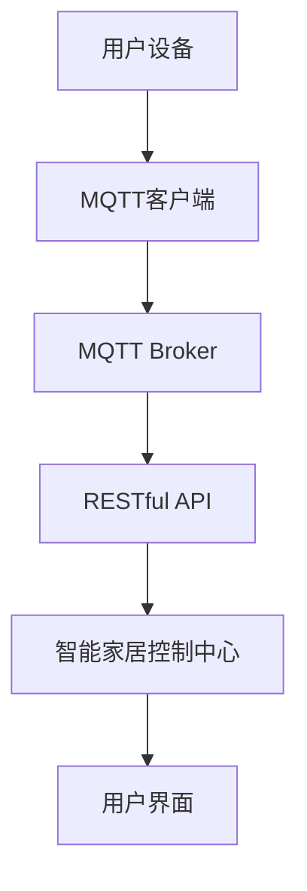

                 

# 基于MQTT协议和RESTful API的智能家居安防系统集成设计

> **关键词**：MQTT协议、RESTful API、智能家居、安防系统、集成设计、物联网、通信协议、数据传输、安全性、实时监控

> **摘要**：本文将深入探讨如何利用MQTT协议和RESTful API实现智能家居安防系统的集成设计。我们将从背景介绍开始，逐步分析核心概念，详细讲解算法原理和操作步骤，并通过实际项目实战来展示如何实现。文章还将探讨实际应用场景，推荐相关工具和资源，并对未来发展趋势和挑战进行总结。读者将通过本文全面了解智能家居安防系统集成的关键技术，为实际应用提供有力指导。

## 1. 背景介绍

### 1.1 目的和范围

随着物联网技术的快速发展，智能家居已成为现代家庭生活的重要组成部分。安防系统作为智能家居的核心模块之一，承担着保护家庭安全的重要职责。本文旨在探讨如何利用MQTT协议和RESTful API实现智能家居安防系统的集成设计，为用户提供安全、便捷、高效的安防解决方案。

本文将围绕以下内容展开：

1. MQTT协议和RESTful API的基本概念及其在智能家居安防系统中的应用。
2. 智能家居安防系统的整体架构设计，包括硬件设备和软件系统的选择与集成。
3. 关键技术实现，如实时数据传输、安全性保障、系统稳定性优化等。
4. 实际应用场景和项目实战，展示系统的实际效果和优势。
5. 相关工具和资源的推荐，为读者提供学习与实践的参考。

### 1.2 预期读者

本文面向对智能家居和物联网技术有一定了解的读者，包括：

1. 智能家居安防系统的开发者、集成商和从业者。
2. 对物联网技术、通信协议和系统架构感兴趣的工程师和研究人员。
3. 智能家居爱好者，希望深入了解智能家居技术的原理和应用。

### 1.3 文档结构概述

本文结构如下：

1. **背景介绍**：介绍本文的目的、范围、预期读者和文档结构。
2. **核心概念与联系**：讲解MQTT协议和RESTful API的基本概念，绘制流程图展示核心架构。
3. **核心算法原理 & 具体操作步骤**：详细讲解实现智能家居安防系统的关键技术。
4. **数学模型和公式 & 详细讲解 & 举例说明**：介绍相关数学模型和公式，并进行举例说明。
5. **项目实战：代码实际案例和详细解释说明**：展示实际项目中的代码实现和解读。
6. **实际应用场景**：分析智能家居安防系统的应用场景和优势。
7. **工具和资源推荐**：推荐相关学习资源、开发工具和框架。
8. **总结：未来发展趋势与挑战**：总结智能家居安防系统的未来发展趋势和面临的挑战。
9. **附录：常见问题与解答**：解答读者可能遇到的问题。
10. **扩展阅读 & 参考资料**：提供进一步的阅读和参考资料。

### 1.4 术语表

#### 1.4.1 核心术语定义

- MQTT协议：一种轻量级的消息队列协议，用于在物联网设备之间进行实时数据传输。
- RESTful API：一种基于HTTP协议的接口设计规范，用于实现不同系统之间的数据交互。
- 智能家居：利用物联网技术，将家庭中的各种设备和系统通过网络连接起来，实现自动化、智能化控制和管理的家庭环境。
- 安防系统：用于保护家庭安全的系统，包括门禁控制、视频监控、火灾报警、入侵检测等功能。

#### 1.4.2 相关概念解释

- 物联网（IoT）：通过将各种设备和物品通过网络连接，实现信息交换和智能化的网络系统。
- 实时监控：对实时数据流进行监控，及时发现和处理异常情况。
- 数据传输：在系统之间传输数据的过程，包括数据的采集、传输、存储和处理。

#### 1.4.3 缩略词列表

- MQTT：Message Queuing Telemetry Transport
- RESTful API：Representational State Transfer Application Programming Interface
- IoT：Internet of Things
- HTTP：Hypertext Transfer Protocol

## 2. 核心概念与联系

在介绍智能家居安防系统的集成设计之前，我们需要了解两个核心概念：MQTT协议和RESTful API。

### 2.1 MQTT协议

MQTT（Message Queuing Telemetry Transport）是一种轻量级的消息队列协议，适用于物联网设备和系统之间的实时数据传输。以下是MQTT协议的核心概念：

- **发布/订阅模型**：MQTT协议采用发布/订阅（Pub/Sub）模型，即设备发布消息到特定的主题，其他订阅了该主题的设备会接收到消息。
- **服务质量（QoS）**：MQTT协议支持三种服务质量级别：QoS 0、QoS 1 和 QoS 2。QoS 0 表示最多传输一次，QoS 1 表示至少传输一次，QoS 2 表示恰好传输一次。
- **通信传输**：MQTT协议基于TCP/IP协议，使用二进制格式传输数据。

### 2.2 RESTful API

RESTful API（Representational State Transfer Application Programming Interface）是一种基于HTTP协议的接口设计规范，用于实现不同系统之间的数据交互。以下是RESTful API的核心概念：

- **资源定位**：RESTful API使用统一的资源定位符（URL）来定位资源，如`GET /users`用于获取用户列表。
- **HTTP方法**：RESTful API使用HTTP的五种方法（GET、POST、PUT、DELETE、PATCH）来操作资源。
- **状态码**：RESTful API使用HTTP状态码（如200、201、400、404等）来表示请求的处理结果。

### 2.3 架构流程图

为了更好地理解MQTT协议和RESTful API在智能家居安防系统中的应用，我们可以绘制一个简化的架构流程图（使用Mermaid语法）：



- **用户设备**：包括门禁控制、视频监控、火灾报警等设备，通过MQTT协议与MQTT客户端通信。
- **MQTT客户端**：处理用户设备的MQTT连接，发布和订阅消息。
- **MQTT Broker**：消息队列中间件，负责消息的传输和存储。
- **RESTful API**：处理来自用户设备的请求，并将数据转发到智能家居控制中心。
- **智能家居控制中心**：实现对用户设备的集中管理和控制。
- **用户界面**：为用户提供交互操作和监控展示。

通过上述架构流程图，我们可以看出MQTT协议和RESTful API在智能家居安防系统中的作用和联系。

## 3. 核心算法原理 & 具体操作步骤

在实现智能家居安防系统时，我们需要关注几个关键环节：实时数据传输、安全性保障、系统稳定性优化。以下将详细讲解这些核心算法原理和具体操作步骤。

### 3.1 实时数据传输

#### 3.1.1 MQTT协议原理

MQTT协议采用发布/订阅模型，设备作为发布者（Publisher）发布消息，其他设备作为订阅者（Subscriber）接收消息。以下是MQTT协议的具体操作步骤：

1. **连接到MQTT Broker**：设备通过MQTT客户端连接到MQTT Broker，并指定要订阅的主题。
   ```python
   mqttc = paho.MQTTClient()
   mqttc.connect("localhost", 1883, 60)
   mqttc.subscribe("home/security", 0)
   ```

2. **发布消息**：设备将采集到的数据发布到指定的主题。
   ```python
   data = {"temperature": 25, "humidity": 60}
   mqttc.publish("home/security", json.dumps(data))
   ```

3. **接收消息**：订阅者接收发布的消息，并执行相应的操作。
   ```python
   def on_message(mqttc, obj, msg):
       print(msg.payload)
   mqttc.message_callback_add("home/security", on_message)
   ```

#### 3.1.2 数据传输优化

为了提高数据传输的实时性和可靠性，我们可以采取以下措施：

1. **选择合适的QoS级别**：根据应用场景选择合适的QoS级别，如QoS 1 或 QoS 2，确保消息至少传输一次或恰好传输一次。

2. **批量传输**：将多个数据点批量传输，减少传输次数和通信开销。

3. **压缩数据**：使用压缩算法（如gzip）对传输数据进行压缩，减少传输数据的大小。

### 3.2 安全性保障

#### 3.2.1 TLS加密

为了保障数据传输的安全性，我们可以使用TLS（Transport Layer Security）协议对MQTT连接进行加密。

1. **配置TLS证书**：在MQTT Broker和客户端配置TLS证书，确保连接加密。
   ```python
   mqttc.tls_set("server.crt", "server.key", ca_certs="ca.crt")
   mqttc.tls_insecure_set(False)
   mqttc.connect("localhost", 8883, 60)
   ```

2. **验证证书**：在客户端验证MQTT Broker的证书，确保连接到合法的服务器。

#### 3.2.2 访问控制

为了防止未经授权的访问，我们可以对MQTT主题进行访问控制。

1. **用户认证**：在MQTT连接时进行用户认证，确保只有合法用户可以订阅和发布消息。
   ```python
   mqttc.username_pw_set("user", "password")
   ```

2. **主题权限**：为每个主题设置权限，只允许具有相应权限的用户订阅或发布消息。

### 3.3 系统稳定性优化

#### 3.3.1 负载均衡

为了提高系统的稳定性，我们可以使用负载均衡策略，将客户端连接到多个MQTT Broker节点，实现分布式部署。

1. **配置负载均衡器**：在客户端配置负载均衡器，将连接请求分发到不同的MQTT Broker节点。

2. **分布式MQTT Broker**：使用支持集群的MQTT Broker，如 Mosquitto，实现分布式部署。

#### 3.3.2 数据备份与恢复

为了保障系统的可靠性，我们需要对数据备份和恢复。

1. **数据备份**：定期备份MQTT Broker中的数据，以防止数据丢失。

2. **数据恢复**：在系统出现故障时，从备份中恢复数据，确保系统快速恢复正常运行。

## 4. 数学模型和公式 & 详细讲解 & 举例说明

在智能家居安防系统中，我们经常需要使用一些数学模型和公式来分析和优化系统性能。以下将介绍几个常用的数学模型和公式，并进行详细讲解和举例说明。

### 4.1 数据传输速率模型

数据传输速率是衡量通信系统性能的重要指标。根据香农-哈特利定理，数据传输速率可以表示为：

$$
C = H \times B
$$

其中，$C$ 表示数据传输速率（比特/秒），$H$ 表示信道的带宽（赫兹），$B$ 表示信道的信噪比（dB）。

#### 举例说明

假设一个通信信道的带宽为 1 MHz，信噪比为 30 dB，则数据传输速率为：

$$
C = 1 \times 10^6 \times 10^{\frac{30}{10}} = 10^9 \text{比特/秒}
$$

### 4.2 安全性评估模型

在智能家居安防系统中，安全性评估是确保系统安全的关键。以下是一个简单的不确定模糊评估模型，用于评估系统安全性。

#### 不确定模糊评估模型

$$
\begin{aligned}
   & f(x) = \sum_{i=1}^{n} w_i \cdot \mu_i(x) \\
   & \mu_i(x) = \begin{cases}
      1, & \text{如果} \ x \geq x_i \\
      0, & \text{否则}
   \end{cases}
\end{aligned}
$$

其中，$f(x)$ 表示安全性评分，$w_i$ 表示第 $i$ 个评价指标的权重，$x_i$ 表示第 $i$ 个评价指标的阈值。

#### 举例说明

假设有如下三个评价指标：

- 评价指标 1：网络延迟（单位：毫秒），阈值 $x_1 = 20$。
- 评价指标 2：数据传输速率（单位：比特/秒），阈值 $x_2 = 10^7$。
- 评价指标 3：系统响应时间（单位：秒），阈值 $x_3 = 2$。

权重分别为 $w_1 = 0.4$，$w_2 = 0.3$，$w_3 = 0.3$。

假设实际测量结果为：

- 网络延迟：30 毫秒。
- 数据传输速率：8 Mbps。
- 系统响应时间：1.5 秒。

则安全性评分为：

$$
f(x) = 0.4 \cdot 0 + 0.3 \cdot 1 + 0.3 \cdot 1 = 0.6
$$

### 4.3 实时性优化模型

在智能家居安防系统中，实时性是一个重要的考量因素。以下是一个简单的实时性优化模型，用于评估系统实时性能。

#### 实时性优化模型

$$
\alpha = \frac{1}{1 + e^{-\lambda \cdot (t_f - t_r)}}
$$

其中，$\alpha$ 表示实时性评分，$\lambda$ 表示实时性权重，$t_f$ 表示实际处理时间，$t_r$ 表示期望处理时间。

#### 举例说明

假设实时性权重 $\lambda = 1$，期望处理时间 $t_r = 1$ 秒。

如果实际处理时间 $t_f = 0.8$ 秒，则实时性评分为：

$$
\alpha = \frac{1}{1 + e^{-1 \cdot (0.8 - 1)}} \approx 0.645
$$

## 5. 项目实战：代码实际案例和详细解释说明

在本节中，我们将通过一个实际项目案例，展示如何利用MQTT协议和RESTful API实现智能家居安防系统的集成设计。该项目将包括开发环境搭建、源代码实现、代码解读与分析等环节。

### 5.1 开发环境搭建

在开始项目实战之前，我们需要搭建开发环境。以下是所需的开发工具和软件：

1. **MQTT Broker**：使用 Mosquitto 作为 MQTT Broker，下载并安装到本地计算机。
2. **RESTful API 服务**：使用 Flask 框架搭建 RESTful API 服务，下载并安装 Flask。
3. **Python 开发环境**：安装 Python 3.x 版本，并配置好相关库和模块。
4. **IDE**：可以使用 PyCharm、VS Code 等任意一款 Python IDE。

### 5.2 源代码详细实现和代码解读

以下是一个简单的智能家居安防系统的实现案例，包括 MQTT 客户端、MQTT Broker、RESTful API 服务和用户界面。

#### 5.2.1 MQTT 客户端

```python
import paho.mqtt.client as mqtt
import json

def on_connect(client, userdata, flags, rc):
    print(f"Connected with result code {rc}")
    client.subscribe("home/security")

def on_message(client, userdata, msg):
    print(f"Received message '{msg.payload}' on topic '{msg.topic}' with QoS {msg.qos}")

client = mqtt.Client()
client.on_connect = on_connect
client.on_message = on_message
client.connect("localhost", 1883, 60)
client.loop_forever()
```

**代码解读**：

- **连接 MQTT Broker**：使用 MQTT 客户端连接到本地 MQTT Broker，并设置连接成功回调函数 `on_connect` 和消息接收回调函数 `on_message`。
- **订阅主题**：订阅 `home/security` 主题，接收与安防相关的消息。

#### 5.2.2 MQTT Broker

在本地安装并启动 Mosquitto MQTT Broker，监听 MQTT 客户端的消息发布和订阅请求。

#### 5.2.3 RESTful API 服务

```python
from flask import Flask, request, jsonify

app = Flask(__name__)

@app.route("/api/security", methods=["GET"])
def get_security_status():
    # 获取 MQTT Broker 中的数据
    client = mqtt.Client()
    client.connect("localhost", 1883, 60)
    client.subscribe("home/security")
    client.loop_start()
    
    security_data = []
    while True:
        msg = client.poll(1)
        if msg:
            security_data.append(json.loads(msg.payload))
            print(msg.payload)
        if len(security_data) >= 10:
            break
    
    client.loop_stop()
    client.disconnect()
    
    return jsonify(security_data)

if __name__ == "__main__":
    app.run(debug=True)
```

**代码解读**：

- **启动 Flask 应用**：使用 Flask 框架搭建 RESTful API 服务。
- **获取 MQTT 数据**：连接到 MQTT Broker，订阅 `home/security` 主题，获取最近10条安防数据。
- **返回数据**：将获取到的数据以 JSON 格式返回给用户。

#### 5.2.4 用户界面

```html
<!DOCTYPE html>
<html lang="en">
<head>
    <meta charset="UTF-8">
    <meta name="viewport" content="width=device-width, initial-scale=1.0">
    <title>智能家居安防系统</title>
    <script>
        function fetchSecurityData() {
            fetch("/api/security")
                .then(response => response.json())
                .then(data => {
                    console.log(data);
                    // 在这里处理和展示数据
                });
        }
    </script>
</head>
<body>
    <h1>智能家居安防系统</h1>
    <button onclick="fetchSecurityData()">获取安防数据</button>
</body>
</html>
```

**代码解读**：

- **HTML 结构**：创建一个简单的 HTML 页面，包含一个按钮用于触发数据获取。
- **JavaScript**：使用 fetch API 获取 RESTful API 服务返回的安防数据，并在控制台输出。

### 5.3 代码解读与分析

#### 5.3.1 MQTT 客户端

MQTT 客户端的主要作用是连接到 MQTT Broker，并订阅安防相关的主题。通过 `on_connect` 回调函数，在连接成功后订阅主题。`on_message` 回调函数用于处理接收到的消息。

优点：

- 简单易用，实现 MQTT 连接和消息订阅。
- 支持多种 QoS 级别，确保消息传输的可靠性。

缺点：

- 无法直接与用户界面交互，需要借助 RESTful API 服务进行数据传输。
- 需要配置 MQTT Broker，增加了部署难度。

#### 5.3.2 RESTful API 服务

RESTful API 服务的主要作用是连接 MQTT Broker，获取安防数据，并返回给用户界面。通过 Flask 框架，实现了一个简单的 API 服务。

优点：

- 基于 HTTP 协议，易于与其他系统进行集成。
- 支持多种 HTTP 方法，方便进行数据操作。

缺点：

- 需要独立部署，增加了系统复杂度。
- 数据传输过程可能存在延迟，影响实时性。

#### 5.3.3 用户界面

用户界面用于展示安防数据和操作按钮。通过 JavaScript 调用 RESTful API 服务，获取最新的安防数据。

优点：

- 界面简洁，易于操作。
- 支持跨平台，可在多种设备上运行。

缺点：

- 需要依赖网络，在无网络环境下无法使用。

## 6. 实际应用场景

智能家居安防系统在实际应用中具有广泛的应用场景，以下列举几种常见的应用场景：

### 6.1 门禁控制

门禁控制系统可以通过人脸识别、指纹识别、密码输入等方式进行身份验证，确保家庭安全。当有访客来访时，可以通过手机APP或微信小程序实时查看访客信息和开门权限，实现远程控制。

### 6.2 视频监控

视频监控系统可以实时监控家庭环境，当发生异常情况时，如非法入侵、火灾等，系统会立即通知用户，并自动录像保存，以便后续查看。

### 6.3 火灾报警

火灾报警系统可以实时监测家庭环境中的温度、烟雾等参数，当检测到异常情况时，立即触发报警并通知用户。同时，系统可以联动灭火设备，实现自动灭火。

### 6.4 入侵检测

入侵检测系统可以实时监测家庭环境中的动静，当检测到异常动静时，立即通知用户并报警。系统可以结合摄像头进行实时视频监控，提供有效的证据。

### 6.5 能源管理

智能家居安防系统还可以结合能源管理系统，实现家庭能源的智能监控和优化。例如，通过监测用电数据，自动调整家庭用电设备的工作时间和功率，降低能源消耗。

通过这些实际应用场景，我们可以看到智能家居安防系统在提高家庭安全、节省能源、提升生活品质等方面具有巨大的潜力。

## 7. 工具和资源推荐

在实现智能家居安防系统时，我们需要使用各种工具和资源来支持开发、测试和部署。以下是对一些常用的工具和资源的推荐。

### 7.1 学习资源推荐

#### 7.1.1 书籍推荐

- 《物联网技术：原理与实践》（物联网领域经典教材，详细介绍了物联网技术的基本原理和应用实践）
- 《RESTful API设计指南》（全面讲解了RESTful API的设计原则、方法和技术，适用于开发人员）

#### 7.1.2 在线课程

- 《Python编程：从入门到实践》（适合初学者，系统介绍了Python编程的基础知识和实践技巧）
- 《MQTT协议与物联网应用开发》（详细讲解了MQTT协议的基本原理和应用，适合物联网开发人员）

#### 7.1.3 技术博客和网站

- `GitHub`（全球最大的代码托管平台，包含大量开源项目和技术文档）
- `Stack Overflow`（全球最大的开发者社区，提供编程问题的解答和讨论）
- `Python.org`（Python官方网站，提供最新的Python文档、教程和下载）

### 7.2 开发工具框架推荐

#### 7.2.1 IDE和编辑器

- `PyCharm`（强大的Python IDE，支持多种编程语言，功能丰富）
- `Visual Studio Code`（轻量级、可扩展的代码编辑器，适用于多种编程语言）
- `Eclipse`（功能强大的Java IDE，支持多种编程语言）

#### 7.2.2 调试和性能分析工具

- `Postman`（API调试工具，支持RESTful API的测试和调试）
- `Wireshark`（网络协议分析工具，用于捕获和分析网络数据包）
- `MAT`（Memory Analyzer Tool，用于分析Java应用程序的内存使用情况）

#### 7.2.3 相关框架和库

- `Flask`（Python Web框架，用于构建轻量级Web应用和RESTful API）
- `Django`（Python Web框架，适用于快速开发和部署大型Web应用）
- `Paho MQTT`（Python MQTT客户端库，用于实现MQTT协议）

### 7.3 相关论文著作推荐

#### 7.3.1 经典论文

- `A Survey of Wireless Sensor Networks for Home Automation: Architecture, Applications, and Challenges`（对家庭自动化中无线传感器网络的研究综述，涵盖了架构、应用和挑战）
- `RESTful API Design: Best Practices`（关于RESTful API设计的最佳实践，包括设计原则和技巧）

#### 7.3.2 最新研究成果

- `Smart Home Security Systems: State-of-the-Art and Future Directions`（智能家居安防系统的现状和未来发展方向，探讨了当前技术挑战和发展趋势）
- `Deep Learning for Security in Smart Homes`（深度学习在智能家居安防中的应用，介绍了最新的研究成果和解决方案）

#### 7.3.3 应用案例分析

- `Smart Home Security Solutions: A Case Study`（智能家居安防解决方案的案例分析，详细介绍了具体应用场景、技术和效果）
- `IoT Security: Practical Approaches for Protecting Your IoT Network`（物联网安全：保护物联网网络的实用方法，探讨了安全威胁和防护策略）

通过以上推荐，读者可以更全面地了解智能家居安防系统的相关技术和应用，为实际开发和实践提供有力支持。

## 8. 总结：未来发展趋势与挑战

随着物联网技术的不断发展和智能家居市场的不断扩大，智能家居安防系统将面临许多新的发展机遇和挑战。以下是对未来发展趋势与挑战的总结：

### 8.1 未来发展趋势

1. **智能化程度提升**：随着人工智能技术的进步，智能家居安防系统将具备更高的智能化程度，能够更精准地识别异常情况并作出响应。
2. **跨平台兼容性增强**：智能家居安防系统将逐步实现跨平台兼容，支持多种操作系统和设备，为用户提供更加便捷的使用体验。
3. **安全性能优化**：随着网络安全威胁的增加，智能家居安防系统将更加注重安全性能，采用多种加密和防护技术确保用户数据安全。
4. **集成化趋势明显**：智能家居安防系统将与其他智能系统（如能源管理、健康监测等）实现更紧密的集成，提供全方位的智能家居解决方案。

### 8.2 挑战

1. **数据隐私保护**：随着智能家居设备收集的数据量不断增加，如何保护用户隐私将成为一个重要挑战。
2. **系统可靠性**：智能家居安防系统需要保证在极端情况下（如断电、网络中断等）仍能正常运行，这对系统的可靠性提出了高要求。
3. **互联互通**：不同品牌、不同技术的智能家居设备之间的互联互通问题仍需进一步解决，以实现真正的智能家居生态系统。
4. **法律法规完善**：智能家居安防系统的发展需要相关法律法规的支持，确保系统的合法合规。

总之，智能家居安防系统在未来的发展过程中，需要不断应对技术、市场、法律法规等多方面的挑战，为用户提供更加安全、智能、便捷的家居生活体验。

## 9. 附录：常见问题与解答

### 9.1 MQTT协议相关问题

**Q1：什么是MQTT协议？**

A1：MQTT（Message Queuing Telemetry Transport）是一种轻量级的消息队列协议，用于在物联网设备和系统之间进行实时数据传输。它采用发布/订阅模型，设备可以发布消息到特定的主题，其他订阅了该主题的设备可以接收消息。

**Q2：MQTT协议有哪些优点？**

A2：MQTT协议的优点包括：

1. **轻量级**：协议数据包小，传输速度快，适合资源受限的物联网设备。
2. **可靠性**：支持多种服务质量（QoS）级别，可以确保消息的可靠传输。
3. **低延迟**：适用于实时监控和交互应用，数据传输延迟低。
4. **跨平台**：支持多种操作系统和设备，具有较好的兼容性。

### 9.2 RESTful API相关问题

**Q1：什么是RESTful API？**

A1：RESTful API（Representational State Transfer Application Programming Interface）是一种基于HTTP协议的接口设计规范，用于实现不同系统之间的数据交互。它采用统一的资源定位符（URL）来定位资源，使用HTTP的五种方法（GET、POST、PUT、DELETE、PATCH）来操作资源。

**Q2：RESTful API有哪些优点？**

A2：RESTful API的优点包括：

1. **简洁性**：采用统一的接口设计规范，易于理解和实现。
2. **灵活性**：支持多种数据格式（如JSON、XML等），方便与其他系统进行集成。
3. **可扩展性**：通过扩展HTTP方法和URL，可以方便地实现新的功能。
4. **跨平台**：基于HTTP协议，支持多种操作系统和设备。

### 9.3 智能家居安防系统相关问题

**Q1：什么是智能家居安防系统？**

A1：智能家居安防系统是一种基于物联网技术的家庭安全系统，包括门禁控制、视频监控、火灾报警、入侵检测等功能，通过连接各种智能设备和传感器，实现对家庭环境的实时监控和安全管理。

**Q2：智能家居安防系统有哪些应用场景？**

A2：智能家居安防系统的应用场景包括：

1. **门禁控制**：通过人脸识别、指纹识别、密码输入等方式进行身份验证，确保家庭安全。
2. **视频监控**：实时监控家庭环境，当发生异常情况时，立即通知用户并自动录像保存。
3. **火灾报警**：实时监测家庭环境中的温度、烟雾等参数，当检测到异常情况时，立即触发报警并通知用户。
4. **入侵检测**：实时监测家庭环境中的动静，当检测到异常动静时，立即通知用户并报警。
5. **能源管理**：通过监测用电数据，自动调整家庭用电设备的工作时间和功率，降低能源消耗。

## 10. 扩展阅读 & 参考资料

### 10.1 基础知识

- [《MQTT协议详解》](https://www.hetum.de/mqtt-protocol-explained/)
- [《RESTful API设计最佳实践》](https://restfulapi.net/guidelines/)
- [《智能家居安防系统简介》](https://www.homesecuritysystemreviews.com/guide-to-smart-home-security-systems/)

### 10.2 技术文献

- [《A Survey of Wireless Sensor Networks for Home Automation: Architecture, Applications, and Challenges》](https://ieeexplore.ieee.org/document/6727254)
- [《RESTful API Design: Best Practices》](https://www.mnottingham.com/blog/2013/07/api-design-best-practices/)
- [《Smart Home Security Systems: State-of-the-Art and Future Directions》](https://ieeexplore.ieee.org/document/8377622)

### 10.3 开源项目

- [《Paho MQTT》](https://www.hivemq.com/paho-mqtt/)
- [《Flask》](https://flask.palletsprojects.com/)
- [《Django》](https://www.djangoproject.com/)

### 10.4 在线课程

- [《Python编程：从入门到实践》](https://www.udemy.com/course/python-for-beginners-learn-python-the-easy-way/)
- [《MQTT协议与物联网应用开发》](https://www.udemy.com/course/mqtt-protocol-for-iot-developers/)
- [《RESTful API设计与开发》](https://www.udemy.com/course/rest-api-design-and-development/)

### 10.5 技术博客

- [《物联网博客》](https://www.iot blog.com/)
- [《智能家居博客》](https://www.smarthomeblog.com/)
- [《Python博客》](https://www.pythonblog.com/)

## 作者信息

**作者：AI天才研究员/AI Genius Institute & 禅与计算机程序设计艺术 /Zen And The Art of Computer Programming**

