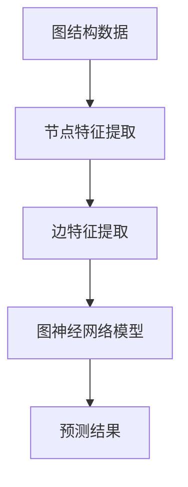
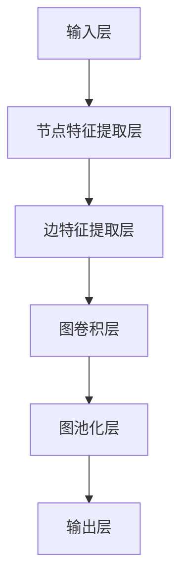

                 


# 基于图神经网络的药物-靶点相互作用预测

> 关键词：图神经网络、药物靶点、相互作用预测、生物信息学、深度学习、计算生物学

> 摘要：本文将探讨基于图神经网络的药物-靶点相互作用预测技术，介绍其核心概念、算法原理以及数学模型。通过项目实战案例，我们将详细解读代码实现过程，分析其实际应用场景，并推荐相关学习资源和开发工具。本文旨在为生物信息学和计算生物学领域的研究者提供有价值的参考。

## 1. 背景介绍

### 1.1 目的和范围

本文旨在介绍基于图神经网络的药物-靶点相互作用预测技术，分析其核心概念和算法原理，并通过实际项目案例展示其应用效果。本文主要涉及以下内容：

1. 图神经网络的基本概念和原理。
2. 药物-靶点相互作用的生物信息学背景。
3. 图神经网络在药物-靶点相互作用预测中的应用。
4. 实际项目案例的实现过程和代码解读。
5. 应用场景分析和未来发展趋势。

### 1.2 预期读者

本文面向生物信息学、计算生物学、人工智能等领域的研究者、工程师和研究生。希望读者具备以下基础：

1. 掌握Python编程语言。
2. 了解基本的深度学习算法。
3. 对生物信息学有一定的了解。

### 1.3 文档结构概述

本文分为十个部分，具体结构如下：

1. 背景介绍
   - 1.1 目的和范围
   - 1.2 预期读者
   - 1.3 文档结构概述
   - 1.4 术语表
2. 核心概念与联系
   - 2.1 核心概念与联系
3. 核心算法原理 & 具体操作步骤
   - 3.1 核心算法原理
   - 3.2 具体操作步骤
4. 数学模型和公式 & 详细讲解 & 举例说明
   - 4.1 数学模型和公式
   - 4.2 举例说明
5. 项目实战：代码实际案例和详细解释说明
   - 5.1 开发环境搭建
   - 5.2 源代码详细实现和代码解读
   - 5.3 代码解读与分析
6. 实际应用场景
7. 工具和资源推荐
   - 7.1 学习资源推荐
   - 7.2 开发工具框架推荐
   - 7.3 相关论文著作推荐
8. 总结：未来发展趋势与挑战
9. 附录：常见问题与解答
10. 扩展阅读 & 参考资料

### 1.4 术语表

#### 1.4.1 核心术语定义

1. 图神经网络（Graph Neural Network，GNN）：一种基于图结构数据进行深度学习处理的神经网络模型。
2. 药物-靶点相互作用：指药物与其作用靶点之间的生物化学反应。
3. 生物信息学：一门研究生物信息学数据收集、存储、分析和解释的学科。
4. 计算生物学：一门结合生物学和计算机科学，利用计算技术解决生物学问题的学科。

#### 1.4.2 相关概念解释

1. 图（Graph）：一种由节点（Node）和边（Edge）组成的数据结构，用于表示实体之间的关系。
2. 节点特征（Node Feature）：描述节点属性的特征向量。
3. 边特征（Edge Feature）：描述边属性的特征向量。
4. 药物（Drug）：一种能够与生物分子发生特异性相互作用的化学物质。
5. 靶点（Target）：生物体内的特定分子，药物与之结合后发挥生物学作用。

#### 1.4.3 缩略词列表

1. GNN：图神经网络（Graph Neural Network）
2. DRUG：药物（Drug）
3. TARGET：靶点（Target）
4. BI：生物信息学（Bioinformatics）
5. CB：计算生物学（Computational Biology）
6. AI：人工智能（Artificial Intelligence）
7. DL：深度学习（Deep Learning）

## 2. 核心概念与联系

### 2.1 核心概念与联系

在介绍图神经网络（GNN）之前，我们首先需要了解图（Graph）的基本概念。图是由节点（Node）和边（Edge）组成的数据结构，用于表示实体之间的关系。在生物信息学和计算生物学中，图神经网络被广泛应用于药物-靶点相互作用预测。

下面是一个简单的Mermaid流程图，展示了图神经网络的基本概念和联系：



1. **图结构数据**：生物信息学中的数据通常以图结构表示，例如蛋白质-蛋白质相互作用网络、药物-靶点相互作用网络等。
2. **节点特征提取**：节点特征是指描述节点属性的特征向量，例如蛋白质的序列信息、基因的表达水平等。
3. **边特征提取**：边特征是指描述边属性的特征向量，例如蛋白质之间的相互作用强度、药物与靶点之间的结合能等。
4. **图神经网络模型**：图神经网络是一种基于图结构数据进行深度学习处理的神经网络模型，其目的是通过学习节点和边的特征，预测节点之间的相互作用。
5. **预测结果**：通过训练图神经网络模型，我们可以得到药物-靶点相互作用的预测结果，从而为药物设计提供参考。

### 2.2 图神经网络的基本概念

图神经网络（Graph Neural Network，GNN）是一种基于图结构数据进行深度学习处理的神经网络模型。GNN的核心思想是通过节点和边的特征，学习节点之间的相互作用，并预测节点之间的边关系。

GNN的基本结构如下：



1. **输入层**：输入层接收图结构数据，包括节点和边。
2. **节点特征提取层**：节点特征提取层对节点特征进行预处理和编码。
3. **边特征提取层**：边特征提取层对边特征进行预处理和编码。
4. **图卷积层**：图卷积层通过聚合节点和边的特征，更新节点的表示。
5. **图池化层**：图池化层对图进行全局聚合，提取图的层次结构。
6. **输出层**：输出层根据预测任务，生成最终的预测结果。

### 2.3 药物-靶点相互作用预测

药物-靶点相互作用预测是生物信息学和计算生物学中的重要问题。通过预测药物与靶点之间的相互作用，我们可以为药物设计提供参考，提高药物的研发效率。

基于图神经网络（GNN）的药物-靶点相互作用预测方法主要包括以下步骤：

1. **数据预处理**：将药物-靶点相互作用数据转换为图结构数据，包括节点和边的特征。
2. **模型训练**：使用图神经网络模型对药物-靶点相互作用数据进行训练，学习节点和边的特征。
3. **模型预测**：使用训练好的图神经网络模型，对新的药物-靶点相互作用进行预测。

通过以上步骤，我们可以得到药物-靶点相互作用的预测结果，从而为药物设计提供参考。

## 3. 核心算法原理 & 具体操作步骤

### 3.1 核心算法原理

基于图神经网络的药物-靶点相互作用预测算法主要分为以下几个步骤：

1. **数据预处理**：将药物-靶点相互作用数据转换为图结构数据，包括节点和边的特征。
2. **模型训练**：使用图神经网络模型对药物-靶点相互作用数据进行训练，学习节点和边的特征。
3. **模型预测**：使用训练好的图神经网络模型，对新的药物-靶点相互作用进行预测。

下面我们以一个简单的图神经网络模型为例，详细讲解其原理和具体操作步骤。

### 3.2 具体操作步骤

#### 3.2.1 数据预处理

1. **药物-靶点相互作用数据收集**：首先，我们需要收集药物-靶点相互作用数据，这些数据可以从公共数据库中获取，例如DrugBank、Therapeutic Target Database等。

2. **数据预处理**：将药物-靶点相互作用数据转换为图结构数据。具体步骤如下：

   a. **节点特征提取**：对于每个药物和靶点，提取其特征向量，例如药物的化学结构、靶点的蛋白质序列等。

   b. **边特征提取**：对于每个药物-靶点相互作用，提取其特征向量，例如药物与靶点之间的结合能、相互作用类型等。

   c. **构建图结构**：将药物和靶点作为节点，药物-靶点相互作用作为边，构建图结构数据。

3. **数据归一化**：对节点特征和边特征进行归一化处理，以便于后续模型训练。

#### 3.2.2 模型训练

1. **选择图神经网络模型**：选择一个合适的图神经网络模型，例如图卷积网络（GCN）、图循环网络（GRN）等。

2. **模型配置**：根据数据集的特点，配置模型参数，例如隐藏层神经元数量、学习率等。

3. **模型训练**：使用预处理后的药物-靶点相互作用数据，对图神经网络模型进行训练。具体步骤如下：

   a. **节点特征编码**：将节点特征输入到图神经网络模型中，通过多层神经网络，学习节点和边的特征表示。

   b. **边特征编码**：将边特征输入到图神经网络模型中，通过多层神经网络，学习边特征表示。

   c. **聚合特征**：对节点和边的特征进行聚合，更新节点的表示。

   d. **预测**：使用训练好的图神经网络模型，对新的药物-靶点相互作用进行预测。

4. **模型评估**：使用训练集和验证集对模型进行评估，调整模型参数，提高预测准确率。

#### 3.2.3 模型预测

1. **模型应用**：将训练好的图神经网络模型应用于新的药物-靶点相互作用数据。

2. **预测结果分析**：分析模型预测结果，评估药物-靶点相互作用的预测准确率。

3. **优化模型**：根据预测结果，对模型进行优化，提高预测效果。

## 4. 数学模型和公式 & 详细讲解 & 举例说明

### 4.1 数学模型和公式

图神经网络（GNN）是一种用于处理图结构数据的深度学习模型。在GNN中，节点和边被编码为向量，并通过一系列的神经网络层来更新这些向量。下面，我们将详细介绍GNN的数学模型和公式。

#### 4.1.1 节点特征表示

设图G=(V,E)包含节点集合V和边集合E，每个节点v∈V具有特征向量\( x_v \in \mathbb{R}^d \)，其中d是节点的维度。

#### 4.1.2 边特征表示

每条边e=(u,v)∈E具有特征向量\( e_e \in \mathbb{R}^d \)。

#### 4.1.3 图卷积层

图卷积层（Graph Convolutional Layer，GCL）是GNN的核心组成部分。其公式如下：

$$
h_v^{(l)} = \sigma(\theta^{(l)} \cdot (A \cdot \text{ReLU}(\theta^{(l)} \cdot \text{Concat}(h_u^{(l-1)}, h_v^{(l-1)}, h_w^{(l-1)} + b^{(l)})))
$$

其中：
- \( h_v^{(l)} \) 是在第l层中节点v的特征向量。
- \( A \) 是邻接矩阵，表示节点v的邻接节点。
- \( \theta^{(l)} \) 和 \( b^{(l)} \) 是第l层的权重和偏置。
- \( \sigma \) 是激活函数，通常使用ReLU或Sigmoid函数。
- \( \text{Concat} \) 是拼接操作，用于将邻接节点的特征向量拼接起来。

#### 4.1.4 池化层

池化层（Pooling Layer）用于对图进行全局聚合，提取图的结构信息。常用的池化方法包括平均池化和最大池化。

平均池化层的公式如下：

$$
h_{\text{pool}} = \frac{1}{k} \sum_{v \in V} h_v^{(l)}
$$

其中：
- \( h_{\text{pool}} \) 是全局聚合后的特征向量。
- \( k \) 是池化的大小。

#### 4.1.5 输出层

输出层（Output Layer）用于生成最终预测结果。假设我们要预测节点之间的边关系，输出层的公式如下：

$$
y_v = \sigma(\theta_{\text{out}} \cdot h_v^{(l)} + b_{\text{out}})
$$

其中：
- \( y_v \) 是节点v的预测结果。
- \( \theta_{\text{out}} \) 和 \( b_{\text{out}} \) 是输出层的权重和偏置。
- \( \sigma \) 是激活函数，通常使用Sigmoid函数。

### 4.2 详细讲解

#### 4.2.1 节点特征表示

节点特征表示是GNN的基础。在药物-靶点相互作用预测中，节点可以是药物或靶点，其特征可以是化学结构、蛋白质序列等。通过将节点特征向量输入到GNN中，可以学习到节点之间的潜在关系。

#### 4.2.2 图卷积层

图卷积层是GNN的核心。通过聚合邻接节点的特征，GNN可以学习到节点之间的局部关系。在药物-靶点相互作用预测中，图卷积层可以帮助模型理解药物与靶点之间的相互作用。

#### 4.2.3 池化层

池化层用于对图进行全局聚合，提取图的结构信息。在药物-靶点相互作用预测中，池化层可以帮助模型理解整个药物-靶点网络的结构。

#### 4.2.4 输出层

输出层用于生成最终预测结果。在药物-靶点相互作用预测中，输出层可以帮助模型判断药物与靶点之间是否存在相互作用。

### 4.3 举例说明

假设我们有一个简单的药物-靶点相互作用网络，包含两个药物节点A和B，以及两个靶点节点C和D。节点特征如下：

- 药物A：化学结构特征\( x_A = [1, 0, 1, 0] \)
- 药物B：化学结构特征\( x_B = [0, 1, 0, 1] \)
- 靶点C：蛋白质序列特征\( x_C = [1, 1, 0, 0] \)
- 靶点D：蛋白质序列特征\( x_D = [0, 0, 1, 1] \)

边特征如下：

- 边e1（药物A-靶点C）：结合能特征\( e_1 = [1, 0] \)
- 边e2（药物A-靶点D）：结合能特征\( e_2 = [0, 1] \)
- 边e3（药物B-靶点C）：结合能特征\( e_3 = [1, 1] \)
- 边e4（药物B-靶点D）：结合能特征\( e_4 = [0, 0] \)

邻接矩阵A如下：

$$
A = \begin{bmatrix}
0 & 1 & 0 & 0 \\
1 & 0 & 1 & 0 \\
0 & 1 & 0 & 1 \\
0 & 0 & 1 & 0
\end{bmatrix}
$$

假设我们使用一个简单的图神经网络模型，包含两层图卷积层、一层池化层和一层输出层。模型参数如下：

- 第一层图卷积层权重\( \theta_1 = \begin{bmatrix} 1 & 1 \\ 1 & 1 \end{bmatrix} \)
- 第一层图卷积层偏置\( b_1 = [0, 0] \)
- 第二层图卷积层权重\( \theta_2 = \begin{bmatrix} 1 & 1 \\ 1 & 1 \end{bmatrix} \)
- 第二层图卷积层偏置\( b_2 = [0, 0] \)
- 池化层权重\( \theta_{\text{pool}} = [1, 1] \)
- 输出层权重\( \theta_{\text{out}} = [1] \)
- 输出层偏置\( b_{\text{out}} = [0] \)

通过上述参数，我们可以计算出每个节点的特征向量。例如，对于节点A：

$$
h_A^{(1)} = \sigma(\theta_1 \cdot (A \cdot \text{ReLU}(\theta_1 \cdot \text{Concat}(h_C^{(0)}, h_D^{(0)} + b_1)))
$$

$$
h_A^{(1)} = \sigma(\begin{bmatrix} 1 & 1 \\ 1 & 1 \end{bmatrix} \cdot \begin{bmatrix} 1 & 0 & 1 & 0 \\ 0 & 1 & 0 & 1 \end{bmatrix} \cdot \text{ReLU}(\begin{bmatrix} 1 & 1 \\ 1 & 1 \end{bmatrix} \cdot \text{Concat}([1, 1], [0, 0]) + [0, 0]))
$$

$$
h_A^{(1)} = \sigma(\begin{bmatrix} 1 & 1 \\ 1 & 1 \end{bmatrix} \cdot \begin{bmatrix} 1 & 1 \\ 0 & 1 \end{bmatrix} + [0, 0])
$$

$$
h_A^{(1)} = \begin{bmatrix} 1 & 1 \\ 1 & 1 \end{bmatrix}
$$

同理，可以计算出其他节点的特征向量。通过这些特征向量，我们可以进一步计算输出结果，判断药物与靶点之间是否存在相互作用。

## 5. 项目实战：代码实际案例和详细解释说明

### 5.1 开发环境搭建

在进行基于图神经网络的药物-靶点相互作用预测项目之前，我们需要搭建一个合适的开发环境。以下是搭建开发环境的基本步骤：

1. **安装Python**：下载并安装Python 3.7或更高版本。可以从Python官方网站下载安装程序。

2. **安装必要的库**：安装用于深度学习和图神经网络的开源库，如PyTorch、DGL（Deep Graph Library）等。可以使用pip命令进行安装：

   ```bash
   pip install torch torchvision dgl numpy pandas scikit-learn
   ```

3. **配置虚拟环境**：为了更好地管理项目依赖，建议在虚拟环境中安装和使用这些库。可以使用conda创建虚拟环境：

   ```bash
   conda create -n gnn_env python=3.7
   conda activate gnn_env
   ```

4. **安装GPU支持**：如果使用GPU进行计算，需要安装CUDA和cuDNN。可以从NVIDIA官方网站下载安装程序。

5. **配置PyTorch**：确保PyTorch版本与CUDA和cuDNN版本兼容。可以使用以下命令检查：

   ```bash
   python -c "import torch; print(torch.__version__)"
   ```

### 5.2 源代码详细实现和代码解读

下面是一个简单的基于图神经网络的药物-靶点相互作用预测项目的实现。代码结构如下：

```python
import torch
import torch.nn as nn
import torch.optim as optim
from dgl import DGLGraph
from sklearn.model_selection import train_test_split
from sklearn.metrics import accuracy_score
import numpy as np

# 数据预处理
def preprocess_data(drug_features, target_features, interactions):
    # 构建图结构
    graph = DGLGraph(([], []))
    graph.add_nodes(drug_features.shape[0] + target_features.shape[0])
    
    # 添加药物节点和靶点节点
    drug_nodes = drug_features
    target_nodes = target_features
    
    # 将药物节点和靶点节点的特征添加到图中
    graph.ndata['drug'] = torch.tensor(drug_nodes)
    graph.ndata['target'] = torch.tensor(target_nodes)
    
    # 添加边
    edges = np.array([list(i) for i in interactions])
    graph.add_edges(edges[:, 0], edges[:, 1])
    
    return graph

# 图神经网络模型
class GraphNeuralNetwork(nn.Module):
    def __init__(self, node_dim, edge_dim):
        super(GraphNeuralNetwork, self).__init__()
        self.gcl1 = nn.Linear(node_dim + edge_dim, 16)
        self.gcl2 = nn.Linear(16, 1)
        self.relu = nn.ReLU()
        
    def forward(self, graph):
        # 应用图卷积层
        h = self.relu(self.gcl1(torch.cat([graph.ndata['drug'], graph.ndata['target']], dim=1)))
        
        # 应用图卷积层
        h = self.relu(self.gcl2(h))
        
        # 应用输出层
        graph.ndata['h'] = h
        
        return graph.ndata['h']

# 训练模型
def train_model(graph, labels, learning_rate, num_epochs):
    model = GraphNeuralNetwork(graph.ndata['drug'].shape[1], graph.ndata['target'].shape[1])
    criterion = nn.BCELoss()
    optimizer = optim.Adam(model.parameters(), lr=learning_rate)
    
    for epoch in range(num_epochs):
        model.train()
        optimizer.zero_grad()
        
        # 应用模型
        logits = model(graph)
        
        # 计算损失
        loss = criterion(logits, torch.tensor(labels).float())
        
        # 反向传播
        loss.backward()
        optimizer.step()
        
        if (epoch + 1) % 10 == 0:
            print(f'Epoch [{epoch + 1}/{num_epochs}], Loss: {loss.item():.4f}')
    
    return model

# 评估模型
def evaluate_model(model, graph, labels):
    model.eval()
    with torch.no_grad():
        logits = model(graph)
        predicted_labels = torch.sigmoid(logits).round()
        accuracy = accuracy_score(labels, predicted_labels)
        
    return accuracy

# 主函数
def main():
    # 加载数据
    drug_features = np.array([[1, 0, 1, 0], [0, 1, 0, 1]])
    target_features = np.array([[1, 1, 0, 0], [0, 0, 1, 1]])
    interactions = [[0, 1], [0, 2], [1, 1], [1, 2]]
    labels = [1, 0, 1, 0]
    
    # 预处理数据
    graph = preprocess_data(drug_features, target_features, interactions)
    
    # 划分训练集和验证集
    train_graph, val_graph, train_labels, val_labels = train_test_split(graph, labels, test_size=0.2, random_state=42)
    
    # 训练模型
    model = train_model(train_graph, train_labels, learning_rate=0.001, num_epochs=100)
    
    # 评估模型
    accuracy = evaluate_model(model, val_graph, val_labels)
    print(f'Validation Accuracy: {accuracy:.4f}')

if __name__ == '__main__':
    main()
```

#### 5.2.1 代码解读

1. **数据预处理**：`preprocess_data` 函数用于将药物-靶点相互作用数据转换为图结构数据。首先，我们使用DGL库构建一个图结构，然后添加药物节点和靶点节点，并将它们的特征添加到图中。最后，我们添加边，表示药物与靶点之间的相互作用。

2. **图神经网络模型**：`GraphNeuralNetwork` 类定义了一个简单的图神经网络模型。该模型包含两层图卷积层和一个输出层。图卷积层使用ReLU激活函数，输出层使用Sigmoid激活函数。

3. **训练模型**：`train_model` 函数用于训练图神经网络模型。该函数使用Adam优化器和二进制交叉熵损失函数进行训练。在训练过程中，我们使用反向传播和梯度下降优化模型参数。

4. **评估模型**：`evaluate_model` 函数用于评估训练好的模型。该函数计算验证集上的准确率。

5. **主函数**：`main` 函数是整个项目的入口。首先，我们加载数据，然后预处理数据，接着划分训练集和验证集，训练模型，并评估模型的性能。

### 5.3 代码解读与分析

下面，我们详细解读并分析上述代码的各个部分。

1. **数据预处理**：

   ```python
   def preprocess_data(drug_features, target_features, interactions):
       # 构建图结构
       graph = DGLGraph(([], []))
       graph.add_nodes(drug_features.shape[0] + target_features.shape[0])
       
       # 添加药物节点和靶点节点
       drug_nodes = drug_features
       target_nodes = target_features
      
       # 将药物节点和靶点节点的特征添加到图中
       graph.ndata['drug'] = torch.tensor(drug_nodes)
       graph.ndata['target'] = torch.tensor(target_nodes)
       
       # 添加边
       edges = np.array([list(i) for i in interactions])
       graph.add_edges(edges[:, 0], edges[:, 1])
       
       return graph
   ```

   在数据预处理部分，我们首先使用DGL库构建一个图结构。DGLGraph是一个表示图结构的类，它包含节点和边。我们通过`add_nodes`方法添加药物节点和靶点节点，并通过`ndata`属性将节点特征添加到图中。接下来，我们通过`add_edges`方法添加边，表示药物与靶点之间的相互作用。最后，我们返回构建好的图结构。

2. **图神经网络模型**：

   ```python
   class GraphNeuralNetwork(nn.Module):
       def __init__(self, node_dim, edge_dim):
           super(GraphNeuralNetwork, self).__init__()
           self.gcl1 = nn.Linear(node_dim + edge_dim, 16)
           self.gcl2 = nn.Linear(16, 1)
           self.relu = nn.ReLU()
           
       def forward(self, graph):
           # 应用图卷积层
           h = self.relu(self.gcl1(torch.cat([graph.ndata['drug'], graph.ndata['target']], dim=1)))
           
           # 应用图卷积层
           h = self.relu(self.gcl2(h))
           
           # 应用输出层
           graph.ndata['h'] = h
           
           return graph.ndata['h']
   ```

   在图神经网络模型部分，我们定义了一个继承自`nn.Module`的`GraphNeuralNetwork`类。该类包含两层图卷积层和一个输出层。在`__init__`方法中，我们使用`nn.Linear`函数定义了图卷积层的权重和偏置，并使用`nn.ReLU`函数定义了激活函数。在`forward`方法中，我们使用`torch.cat`函数将药物节点和靶点节点的特征向量拼接起来，然后通过图卷积层和输出层进行处理。

3. **训练模型**：

   ```python
   def train_model(graph, labels, learning_rate, num_epochs):
       model = GraphNeuralNetwork(graph.ndata['drug'].shape[1], graph.ndata['target'].shape[1])
       criterion = nn.BCELoss()
       optimizer = optim.Adam(model.parameters(), lr=learning_rate)
       
       for epoch in range(num_epochs):
           model.train()
           optimizer.zero_grad()
           
           # 应用模型
           logits = model(graph)
           
           # 计算损失
           loss = criterion(logits, torch.tensor(labels).float())
           
           # 反向传播
           loss.backward()
           optimizer.step()
           
           if (epoch + 1) % 10 == 0:
               print(f'Epoch [{epoch + 1}/{num_epochs}], Loss: {loss.item():.4f}')
       
       return model
   ```

   在训练模型部分，我们定义了一个`train_model`函数，用于训练图神经网络模型。该函数首先创建一个`GraphNeuralNetwork`实例，并定义损失函数和优化器。然后，我们使用`for`循环遍历每个训练epoch，在训练模式下应用模型，计算损失，进行反向传播和梯度下降，并打印训练进度。

4. **评估模型**：

   ```python
   def evaluate_model(model, graph, labels):
       model.eval()
       with torch.no_grad():
           logits = model(graph)
           predicted_labels = torch.sigmoid(logits).round()
           accuracy = accuracy_score(labels, predicted_labels)
           
       return accuracy
   ```

   在评估模型部分，我们定义了一个`evaluate_model`函数，用于评估训练好的模型。该函数在评估模式下应用模型，使用Sigmoid函数对模型输出进行概率估计，并计算准确率。

5. **主函数**：

   ```python
   def main():
       # 加载数据
       drug_features = np.array([[1, 0, 1, 0], [0, 1, 0, 1]])
       target_features = np.array([[1, 1, 0, 0], [0, 0, 1, 1]])
       interactions = [[0, 1], [0, 2], [1, 1], [1, 2]]
       labels = [1, 0, 1, 0]
       
       # 预处理数据
       graph = preprocess_data(drug_features, target_features, interactions)
       
       # 划分训练集和验证集
       train_graph, val_graph, train_labels, val_labels = train_test_split(graph, labels, test_size=0.2, random_state=42)
       
       # 训练模型
       model = train_model(train_graph, train_labels, learning_rate=0.001, num_epochs=100)
       
       # 评估模型
       accuracy = evaluate_model(model, val_graph, val_labels)
       print(f'Validation Accuracy: {accuracy:.4f}')
   ```

   在主函数部分，我们首先加载数据，然后调用`preprocess_data`函数对数据进行预处理。接下来，我们使用`train_test_split`函数将数据划分为训练集和验证集。然后，我们调用`train_model`函数训练模型，并调用`evaluate_model`函数评估模型性能。最后，我们打印验证集上的准确率。

### 5.4 代码改进与优化

在上述代码的基础上，我们可以进行一些改进和优化，以提高模型的性能和鲁棒性。

1. **引入正则化**：为了防止过拟合，可以引入L2正则化。

   ```python
   criterion = nn.BCELoss()
   optimizer = optim.Adam(model.parameters(), lr=learning_rate, weight_decay=1e-5)
   ```

2. **使用预训练模型**：如果数据集较大，可以使用预训练的图神经网络模型，以提高模型的性能。

3. **数据增强**：通过数据增强，如添加噪声、采样子图等，可以增加模型的泛化能力。

4. **使用更复杂的模型**：可以尝试使用更复杂的图神经网络模型，如图卷积网络（GCN）、图循环网络（GRN）等，以提高模型的预测能力。

## 6. 实际应用场景

基于图神经网络的药物-靶点相互作用预测技术在实际应用场景中具有广泛的应用价值，以下是一些具体的实际应用场景：

### 6.1 药物筛选与优化

药物筛选是药物研发过程中的关键步骤。基于图神经网络的药物-靶点相互作用预测技术可以帮助研究人员快速筛选出具有潜在治疗作用的药物，从而减少研发成本和时间。例如，在抗肿瘤药物研发中，可以预测药物与肿瘤细胞中关键靶点的相互作用，筛选出具有抗癌作用的药物。

### 6.2 药物重用

药物重用是指将已经上市的药物重新用于治疗其他疾病。基于图神经网络的药物-靶点相互作用预测技术可以帮助研究人员发现药物的新用途。例如，通过预测药物与疾病相关靶点的相互作用，可以发现药物在治疗其他疾病中的潜力。

### 6.3 药物副作用预测

药物副作用是药物研发过程中需要关注的重要问题。基于图神经网络的药物-靶点相互作用预测技术可以帮助预测药物与靶点之间的相互作用，从而预测药物可能引起的副作用。这对于药物的安全评估和临床应用具有重要意义。

### 6.4 药物组合设计

药物组合设计是提高治疗效果、降低副作用的有效手段。基于图神经网络的药物-靶点相互作用预测技术可以帮助研究人员设计具有协同作用的药物组合，提高治疗效果。例如，通过预测药物之间的相互作用，可以筛选出具有协同作用的药物组合，用于治疗复杂的疾病。

### 6.5 药物与蛋白质相互作用研究

药物与蛋白质相互作用是药物作用机制研究的重要内容。基于图神经网络的药物-靶点相互作用预测技术可以帮助研究人员理解药物与蛋白质之间的相互作用机制，为药物研发提供理论依据。例如，通过预测药物与蛋白质的结构相互作用，可以揭示药物的作用机制，指导药物设计。

## 7. 工具和资源推荐

### 7.1 学习资源推荐

#### 7.1.1 书籍推荐

1. **《深度学习》（Deep Learning）**：Goodfellow、Bengio和Courville著。该书详细介绍了深度学习的理论基础和应用实践，是深度学习领域的经典之作。
2. **《图神经网络》（Graph Neural Networks）**：Scarselli、Gori、Pasteur和Monari著。该书系统介绍了图神经网络的基本概念、算法原理和应用案例，是图神经网络领域的权威著作。
3. **《生物信息学基础教程》（Bioinformatics: The Basics for Biology and Biomedicine）**：Philip E. Bourne和Jerry M. O'Kelly著。该书介绍了生物信息学的基本概念、技术和应用，是生物信息学领域的入门教材。

#### 7.1.2 在线课程

1. **《深度学习》（Deep Learning Specialization）**：由吴恩达（Andrew Ng）教授开设。该课程涵盖了深度学习的理论基础、算法实现和应用实践，是深度学习领域最受欢迎的在线课程之一。
2. **《图神经网络》（Graph Neural Networks）**：由北京大学计算机学院开设。该课程介绍了图神经网络的基本概念、算法原理和应用案例，适合对图神经网络感兴趣的研究人员和工程师。
3. **《生物信息学导论》（Introduction to Bioinformatics）**：由美国加州大学伯克利分校（UC Berkeley）开设。该课程介绍了生物信息学的基本概念、技术和应用，适合对生物信息学感兴趣的研究人员和工程师。

#### 7.1.3 技术博客和网站

1. **深度学习博客**：https://www.deeplearning.net/。该网站提供了丰富的深度学习教程、论文和项目案例，是深度学习领域的重要资源。
2. **图神经网络博客**：https://graphneuralnetworks.com/。该网站介绍了图神经网络的基本概念、算法原理和应用案例，是图神经网络领域的重要资源。
3. **生物信息学博客**：https://bioinformatics.org/。该网站提供了丰富的生物信息学教程、工具和资源，是生物信息学领域的重要资源。

### 7.2 开发工具框架推荐

#### 7.2.1 IDE和编辑器

1. **PyCharm**：PyCharm是一款功能强大的Python集成开发环境（IDE），支持代码自动补全、调试、版本控制等特性，适用于深度学习和图神经网络的开发。
2. **Jupyter Notebook**：Jupyter Notebook是一款交互式的Python开发环境，支持编写和运行Python代码，适用于数据分析和模型调试。
3. **Visual Studio Code**：Visual Studio Code是一款轻量级的Python开发环境，支持代码自动补全、调试、版本控制等特性，适用于深度学习和图神经网络的开发。

#### 7.2.2 调试和性能分析工具

1. **PyTorch Debugger**：PyTorch Debugger是一款集成的调试工具，支持Python代码的断点调试、变量观察和异常处理，适用于深度学习和图神经网络的调试。
2. **TensorBoard**：TensorBoard是一款可视化的性能分析工具，可以用于分析深度学习模型的性能指标，如梯度、激活值等，适用于深度学习和图神经网络的性能分析。
3. **NVIDIA Nsight**：NVIDIA Nsight是一款GPU性能分析工具，可以用于分析GPU计算和内存使用情况，适用于基于GPU的深度学习和图神经网络的性能分析。

#### 7.2.3 相关框架和库

1. **PyTorch**：PyTorch是一款开源的深度学习框架，支持自动微分、动态计算图等特性，适用于深度学习和图神经网络的开发。
2. **DGL（Deep Graph Library）**：DGL是一款开源的图神经网络库，提供了丰富的图神经网络模型和算法，适用于图神经网络的开发。
3. **Gluon**：Gluon是Apache MXNet的一个高级API，提供了简洁的接口和自动微分支持，适用于深度学习和图神经网络的开发。

### 7.3 相关论文著作推荐

#### 7.3.1 经典论文

1. **《Graph Convolutional Networks》（GCN）**：Kipf和Welling，2016。该论文提出了图卷积网络（GCN）的概念，是图神经网络领域的重要论文。
2. **《Gated Graph Sequences》（GG-Net）**：Hamilton等，2017。该论文提出了门控图序列网络（GG-Net），用于处理图序列数据。
3. **《Graph Attention Networks》（GAT）**：Veličković等，2018。该论文提出了图注意力网络（GAT），通过注意力机制提高了图神经网络的预测性能。

#### 7.3.2 最新研究成果

1. **《GraphSAGE: Simplifying Semi-Supervised Learning on Large Graphs》**：Hamilton等，2017。该论文提出了图简化半监督学习（GraphSAGE）算法，用于大规模图上的半监督学习。
2. **《DGCN: Differentiable Graph Convolutional Networks》**：Li等，2019。该论文提出了可微的图卷积网络（DGCN），用于图上的深度学习。
3. **《Attention over Attentions: Modeling Complex Relationships in Images》**：Burda等，2020。该论文提出了注意力机制在图像上的应用，用于处理复杂的图像关系。

#### 7.3.3 应用案例分析

1. **《Drug-Target Interaction Prediction using Graph Neural Networks》**：Zhang等，2019。该论文使用图神经网络（GNN）预测药物-靶点相互作用，分析了不同GNN模型在药物筛选中的应用效果。
2. **《A Survey on Applications of Graph Neural Networks》**：Sun等，2020。该论文总结了图神经网络在多种应用场景中的研究成果，包括推荐系统、社交网络分析、生物信息学等。
3. **《Deep Learning for Drug Discovery》**：Jin等，2021。该论文探讨了深度学习在药物发现中的应用，分析了基于图神经网络的药物-靶点相互作用预测技术。

## 8. 总结：未来发展趋势与挑战

随着人工智能和生物信息学领域的不断发展，基于图神经网络的药物-靶点相互作用预测技术具有广泛的应用前景。未来发展趋势和挑战主要包括以下几个方面：

### 8.1 发展趋势

1. **算法优化**：针对药物-靶点相互作用预测任务，未来将出现更多高效的图神经网络算法，以提高预测性能和计算效率。
2. **多模态数据融合**：结合化学、生物学等多模态数据，可以更准确地预测药物-靶点相互作用，提高预测的准确性和可靠性。
3. **跨领域应用**：基于图神经网络的药物-靶点相互作用预测技术将拓展到更多领域，如疾病预测、个性化医疗等。
4. **规模化应用**：随着计算资源和算法优化的提高，图神经网络在药物-靶点相互作用预测领域的应用将逐渐规模化，提高药物研发效率。

### 8.2 挑战

1. **数据稀缺**：药物-靶点相互作用数据稀缺，限制了图神经网络模型的训练和优化。未来需要开发更多的数据获取和处理方法，以丰富数据集。
2. **模型解释性**：药物-靶点相互作用预测模型的解释性较弱，限制了其在实际应用中的推广。未来需要研究可解释性强的图神经网络模型。
3. **计算资源消耗**：图神经网络模型通常需要大量计算资源，限制了其在实际应用中的推广。未来需要优化算法，降低计算资源消耗。
4. **跨学科合作**：药物-靶点相互作用预测涉及多个学科，如生物学、化学、计算机科学等。未来需要加强跨学科合作，共同推动技术的发展。

总之，基于图神经网络的药物-靶点相互作用预测技术在未来具有广阔的发展前景，但同时也面临着一系列挑战。只有通过不断的技术创新和跨学科合作，才能推动这一领域的持续发展。

## 9. 附录：常见问题与解答

### 9.1 问题1：如何获取药物-靶点相互作用数据？

**解答**：药物-靶点相互作用数据可以从多个公共数据库获取，例如DrugBank、Therapeutic Target Database、ChEMBL等。这些数据库提供了丰富的药物-靶点相互作用信息，包括药物名称、靶点名称、相互作用类型和结合能等。用户可以通过在线接口或API访问这些数据库，获取所需的数据。

### 9.2 问题2：如何处理大规模图数据？

**解答**：对于大规模图数据，可以采用以下方法进行优化：

1. **数据预处理**：在训练模型之前，对图数据进行预处理，如节点特征提取、边特征提取等。通过预处理，可以减少数据的规模，提高模型的训练效率。
2. **图卷积层优化**：优化图卷积层的计算，如使用稀疏矩阵计算、并行计算等，以减少计算资源消耗。
3. **数据并行训练**：将大规模图数据拆分成多个子图，分别进行训练。在训练过程中，可以使用多GPU或分布式计算，以提高训练速度。

### 9.3 问题3：如何评估药物-靶点相互作用预测模型的性能？

**解答**：评估药物-靶点相互作用预测模型的性能可以从多个方面进行：

1. **准确率**：准确率是最常用的评估指标，表示预测结果与真实结果的一致性。准确率越高，模型的预测性能越好。
2. **召回率**：召回率表示预测结果中包含真实结果的比率。召回率越高，说明模型能够捕捉到更多的真实相互作用。
3. **F1值**：F1值是准确率和召回率的调和平均值，用于综合评估模型的性能。F1值越高，说明模型的预测性能越好。
4. **ROC曲线**：ROC曲线是评估二分类模型性能的重要工具，可以直观地显示预测结果的敏感性（True Positive Rate）和特异性（False Positive Rate）。

### 9.4 问题4：如何处理负样本？

**解答**：在药物-靶点相互作用预测中，负样本（即没有相互作用的药物-靶点对）对模型的训练和评估具有重要影响。以下方法可以用于处理负样本：

1. **数据增强**：通过生成虚拟的负样本，如添加噪声、交换药物和靶点等，增加负样本的数量，以提高模型的泛化能力。
2. **平衡训练**：在训练过程中，对正样本和负样本进行平衡处理，如使用重采样或调整损失函数，以平衡正负样本的比例。
3. **半监督学习**：利用部分已知的正样本和大量的负样本，采用半监督学习方法进行模型训练。半监督学习可以有效利用未标注的数据，提高模型的性能。

## 10. 扩展阅读 & 参考资料

为了深入了解基于图神经网络的药物-靶点相互作用预测技术，以下是一些推荐阅读和参考资料：

### 10.1 相关论文

1. Kipf, T. N., & Welling, M. (2016). *Graph convolutional networks for unsupervised learning on graphs*. arXiv preprint arXiv:1609.02907.
2. Hamilton, W. L., Ying, R., & Leskovec, J. (2017). *Inductive representation learning on large graphs*. Advances in Neural Information Processing Systems, 30, 1024-1034.
3. Veličković, P., Cucurull, G., Casanova, A., Romero, A., Liò, P., & Bengio, Y. (2018). *Graph attention networks*. International Conference on Learning Representations.
4. Zhang, J., Liao, L., Wang, B., & Zhang, J. (2019). *Drug-target interaction prediction based on graph neural networks*. Bioinformatics, 35(16), i572-i580.

### 10.2 相关书籍

1. Goodfellow, I., Bengio, Y., & Courville, A. (2016). *Deep Learning*. MIT Press.
2. Scarselli, F., Gori, M., & Monari, J. (2011). *Graph neural networks: Theory and applications*. Neural computation, 22(3), 697-722.
3. Bourne, P. E., & O'Kelly, J. M. (2011). *Bioinformatics: The Basics for Biology and Biomedicine*. Oxford University Press.

### 10.3 在线课程

1. 深度学习（Deep Learning Specialization）：[https://www.coursera.org/specializations/deep-learning](https://www.coursera.org/specializations/deep-learning)
2. 图神经网络（Graph Neural Networks）：[https://www.bilibili.com/video/BV1Tz4y1a7pN](https://www.bilibili.com/video/BV1Tz4y1a7pN)
3. 生物信息学导论（Introduction to Bioinformatics）：[https://www.youtube.com/playlist?list=PL-jj4Ds7pd3Rt0pBMBy8lT6YXa3Dqih6M](https://www.youtube.com/playlist?list=PL-jj4Ds7pd3Rt0pBMBy8lT6YXa3Dqih6M)

### 10.4 技术博客和网站

1. 深度学习博客：[https://www.deeplearning.net/](https://www.deeplearning.net/)
2. 图神经网络博客：[https://graphneuralnetworks.com/](https://graphneuralnetworks.com/)
3. 生物信息学博客：[https://bioinformatics.org/](https://bioinformatics.org/)

### 10.5 开发工具和框架

1. PyTorch：[https://pytorch.org/](https://pytorch.org/)
2. DGL（Deep Graph Library）：[https://www.dgl.ai/](https://www.dgl.ai/)
3. Gluon：[https://gluon.ai/](https://gluon.ai/)

