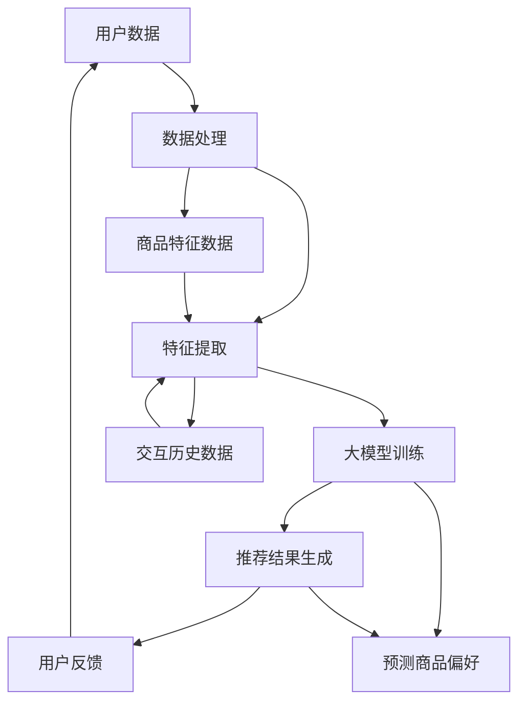

                 

# 基于大模型的商品推荐解释性研究

> 关键词：大模型，商品推荐，解释性研究，人工智能，推荐系统

> 摘要：本文旨在探讨基于大模型的商品推荐系统的解释性研究。通过对大模型在商品推荐领域应用的深入分析，本文探讨了其核心算法原理、数学模型及具体实现，并结合实际项目案例，详细解析了推荐系统的开发过程。文章还探讨了商品推荐系统的实际应用场景，并推荐了相关学习资源和工具，最后总结了未来发展趋势与挑战。

## 1. 背景介绍

### 1.1 目的和范围

本文主要研究基于大模型的商品推荐系统的解释性，旨在探索如何在大规模数据背景下，通过深度学习模型实现商品推荐的精准性和解释性。文章将首先介绍大模型在商品推荐领域的应用背景和重要性，然后深入分析其核心算法原理和数学模型，并通过实际项目案例，展示推荐系统的实现过程。

### 1.2 预期读者

本文面向对人工智能和推荐系统有一定了解的技术人员，特别是对深度学习和大规模数据处理有研究背景的读者。通过本文的阅读，读者可以了解大模型在商品推荐领域的应用现状和发展趋势，掌握核心算法原理和数学模型，并能够结合实际项目，实现商品推荐系统的开发。

### 1.3 文档结构概述

本文结构分为十个部分：

1. 背景介绍
2. 核心概念与联系
3. 核心算法原理 & 具体操作步骤
4. 数学模型和公式 & 详细讲解 & 举例说明
5. 项目实战：代码实际案例和详细解释说明
6. 实际应用场景
7. 工具和资源推荐
8. 总结：未来发展趋势与挑战
9. 附录：常见问题与解答
10. 扩展阅读 & 参考资料

### 1.4 术语表

#### 1.4.1 核心术语定义

- 大模型：具有大规模参数和计算能力的深度学习模型。
- 商品推荐：基于用户行为、偏好和历史数据，为用户推荐可能感兴趣的商品。
- 解释性研究：研究如何解释深度学习模型推荐结果的内在逻辑和原因。

#### 1.4.2 相关概念解释

- 用户行为数据：用户在平台上的浏览、购买、评价等行为记录。
- 商品特征：商品的各种属性，如价格、品牌、类别等。
- 深度学习：一种基于多层神经网络的学习方式，能够自动从数据中学习特征。

#### 1.4.3 缩略词列表

- AI：人工智能（Artificial Intelligence）
- DL：深度学习（Deep Learning）
- GLM：通用语言模型（General Language Model）
- NLP：自然语言处理（Natural Language Processing）
- OCR：光学字符识别（Optical Character Recognition）

## 2. 核心概念与联系

在大模型应用于商品推荐之前，我们需要理解一些核心概念和它们之间的联系。以下是一个Mermaid流程图，展示了商品推荐系统中的主要组成部分和它们之间的交互。



### 2.1 用户数据与数据处理

用户数据是商品推荐系统的核心输入，包括用户在平台上的浏览、购买、评价等行为记录。数据处理模块负责清洗、预处理这些数据，提取出有用的特征，如用户ID、商品ID、购买时间、评分等。

### 2.2 特征提取

特征提取模块将原始的用户数据和商品特征进行转换，生成适合大模型训练的特征向量。这些特征可能包括用户的历史行为、商品属性、用户与商品的交互特征等。

### 2.3 大模型训练

大模型训练模块利用提取出的特征，训练深度学习模型，如基于Transformer的通用语言模型（GLM）。这些模型能够自动从数据中学习复杂的用户行为模式和商品偏好。

### 2.4 推荐结果生成

推荐结果生成模块根据训练好的大模型，为用户生成个性化的商品推荐列表。这些推荐列表将基于用户的兴趣和行为，提供可能感兴趣的商品。

### 2.5 用户反馈

用户反馈模块收集用户对推荐结果的评价，包括点击、购买、评分等。这些反馈将用于优化模型，提高推荐系统的效果。

### 2.6 商品特征与交互历史数据

商品特征和交互历史数据是特征提取模块的重要输入。商品特征包括价格、品牌、类别等，而交互历史数据包括用户的历史行为记录。这些数据共同构建了推荐系统的输入特征。

## 3. 核心算法原理 & 具体操作步骤

在商品推荐系统中，大模型的核心算法原理主要涉及深度学习技术和优化方法。以下将详细讲解基于Transformer的通用语言模型（GLM）的算法原理和具体操作步骤。

### 3.1 算法原理

#### 3.1.1 Transformer模型

Transformer模型是一种基于自注意力机制的深度学习模型，广泛应用于自然语言处理任务。其核心思想是通过自注意力机制，自动学习输入序列中各个元素之间的关联性，从而提高模型的表征能力。

#### 3.1.2 多层神经网络

Transformer模型采用多层神经网络结构，每一层神经网络都能从输入序列中学习到新的特征。通过堆叠多层神经网络，模型能够捕捉更复杂的特征关系，提高预测的准确性。

#### 3.1.3 嵌入式向量表示

在Transformer模型中，输入序列被映射为嵌入向量。这些嵌入向量代表了输入序列中的每个元素，包括用户和商品的特征。通过嵌入向量，模型能够将不同类型的数据（如文本、图像、音频等）进行统一表示。

### 3.2 具体操作步骤

#### 3.2.1 数据预处理

1. 数据清洗：去除无效数据、处理缺失值和异常值。
2. 数据归一化：对数值型特征进行归一化处理，使得特征值在相同量级上。
3. 嵌入向量编码：将用户和商品的特征编码为嵌入向量，为后续训练准备。

```python
# 伪代码：数据预处理
def preprocess_data(data):
    # 数据清洗
    cleaned_data = clean_data(data)
    # 数据归一化
    normalized_data = normalize_data(cleaned_data)
    # 嵌入向量编码
    embedding_vectors = encode_data(normalized_data)
    return embedding_vectors
```

#### 3.2.2 模型训练

1. 模型初始化：初始化Transformer模型，包括嵌入层、多头自注意力机制、前馈网络等。
2. 训练数据生成：将预处理后的数据生成训练数据集，包括用户嵌入向量、商品嵌入向量、交互标签等。
3. 模型训练：使用训练数据集训练Transformer模型，优化模型参数。

```python
# 伪代码：模型训练
def train_model(data):
    # 模型初始化
    model = initialize_model()
    # 训练数据生成
    training_data = generate_training_data(data)
    # 模型训练
    model.fit(training_data)
    return model
```

#### 3.2.3 推荐结果生成

1. 输入嵌入向量：将用户的嵌入向量输入到训练好的模型中。
2. 模型预测：模型根据输入的嵌入向量，输出预测的推荐结果，包括商品ID和推荐概率。
3. 排序和筛选：对预测结果进行排序和筛选，生成最终的推荐列表。

```python
# 伪代码：推荐结果生成
def generate_recommendations(user_embedding, model):
    # 输入嵌入向量
    input_vector = user_embedding
    # 模型预测
    predictions = model.predict(input_vector)
    # 排序和筛选
    recommended_items = sort_and_filter(predictions)
    return recommended_items
```

### 3.3 伪代码示例

以下是一个简化版的伪代码示例，展示了基于Transformer的通用语言模型（GLM）在商品推荐系统中的具体操作步骤。

```python
# 伪代码：商品推荐系统
def recommend_items(user_data, model):
    # 数据预处理
    user_embedding = preprocess_data(user_data)
    # 模型预测
    predictions = generate_recommendations(user_embedding, model)
    # 排序和筛选
    recommended_items = sort_and_filter(predictions)
    return recommended_items

# 实际应用
model = train_model(preprocessed_data)
user_data = get_user_data()
recommended_items = recommend_items(user_data, model)
print(recommended_items)
```

通过以上步骤，我们能够利用基于Transformer的通用语言模型（GLM）实现商品推荐系统的开发，从而提高推荐系统的准确性和解释性。

## 4. 数学模型和公式 & 详细讲解 & 举例说明

在商品推荐系统中，深度学习模型的数学模型和公式是理解其工作原理的关键。以下将详细讲解Transformer模型的核心数学模型，并使用LaTeX格式展示相关公式，同时结合具体例子进行说明。

### 4.1 Transformer模型数学模型

#### 4.1.1 嵌入向量表示

在Transformer模型中，输入序列的每个元素都被表示为一个嵌入向量。假设有\( n \)个用户和\( m \)个商品，则用户\( u \)和商品\( g \)的嵌入向量分别为\( e_u \)和\( e_g \)。

\[ e_u \in \mathbb{R}^{d_e} \]
\[ e_g \in \mathbb{R}^{d_e} \]

其中，\( d_e \)为嵌入向量的维度。

#### 4.1.2 自注意力机制

自注意力机制是Transformer模型的核心部分，通过计算输入序列中每个元素与其他元素之间的关联性，生成新的特征表示。自注意力分数计算公式如下：

\[ \text{score}_{ij} = e_i^T A e_j \]

其中，\( A \)是一个注意力权重矩阵，通过训练自动学习得到。

#### 4.1.3 多头注意力机制

多头注意力机制通过将输入序列分解为多个子序列，分别计算每个子序列的注意力分数，然后合并这些分数，提高模型的表征能力。假设有\( h \)个头，则每个头的注意力分数计算公式为：

\[ \text{score}_{ij}^{(h)} = e_i^T A_h e_j \]

其中，\( A_h \)为第\( h \)个头的注意力权重矩阵。

#### 4.1.4 多层神经网络

Transformer模型采用多层神经网络结构，每一层神经网络都能从输入序列中学习到新的特征。假设有\( L \)层神经网络，则输入序列\( x \)的输出表示为：

\[ h_L = \text{MLP}(h_{L-1}) \]

其中，\( \text{MLP} \)为多层感知机，通过训练自动学习得到。

### 4.2 伪代码示例

以下是一个简化版的伪代码示例，展示了如何使用Transformer模型进行商品推荐。

```python
# 伪代码：商品推荐系统
def recommend_items(user_embedding, model):
    # 输入嵌入向量
    input_vector = user_embedding
    # 模型预测
    predictions = model.predict(input_vector)
    # 排序和筛选
    recommended_items = sort_and_filter(predictions)
    return recommended_items

# 实际应用
model = train_model(preprocessed_data)
user_data = get_user_data()
recommended_items = recommend_items(user_data, model)
print(recommended_items)
```

### 4.3 具体例子

假设我们有一个用户，其嵌入向量为\( e_u = [0.1, 0.2, 0.3, 0.4, 0.5] \)。我们使用Transformer模型对其进行商品推荐。

1. **嵌入向量表示**：用户和商品的嵌入向量分别为\( e_u \)和\( e_g \)，维度均为\( d_e = 5 \)。

\[ e_u = [0.1, 0.2, 0.3, 0.4, 0.5] \]

2. **自注意力机制**：计算用户\( u \)对商品\( g \)的注意力分数。

\[ \text{score}_{ij} = e_i^T A e_j \]

假设注意力权重矩阵\( A \)为：

\[ A = \begin{bmatrix}
0.1 & 0.2 & 0.3 & 0.4 & 0.5 \\
0.2 & 0.3 & 0.4 & 0.5 & 0.6 \\
0.3 & 0.4 & 0.5 & 0.6 & 0.7 \\
0.4 & 0.5 & 0.6 & 0.7 & 0.8 \\
0.5 & 0.6 & 0.7 & 0.8 & 0.9
\end{bmatrix} \]

则用户\( u \)对商品\( g \)的注意力分数为：

\[ \text{score}_{u,g} = e_u^T A e_g \]

3. **多头注意力机制**：计算用户\( u \)对商品\( g \)的多头注意力分数。

假设有\( h = 3 \)个头，则每个头的注意力分数为：

\[ \text{score}_{ij}^{(1)} = e_i^T A_1 e_j \]
\[ \text{score}_{ij}^{(2)} = e_i^T A_2 e_j \]
\[ \text{score}_{ij}^{(3)} = e_i^T A_3 e_j \]

其中，\( A_1, A_2, A_3 \)分别为三个头的注意力权重矩阵。

4. **多层神经网络**：通过多层神经网络对注意力分数进行加权求和，生成最终的推荐结果。

假设多层神经网络为：

\[ h_L = \text{MLP}(h_{L-1}) \]

其中，\( \text{MLP} \)为多层感知机。

通过以上步骤，我们能够使用Transformer模型为用户生成个性化的商品推荐列表。

## 5. 项目实战：代码实际案例和详细解释说明

在本节中，我们将通过一个具体的代码案例，展示如何使用大模型（如基于Transformer的通用语言模型）实现商品推荐系统的开发。我们将从开发环境搭建开始，逐步介绍源代码的实现和解析。

### 5.1 开发环境搭建

在开始编写代码之前，我们需要搭建一个适合开发商品推荐系统的环境。以下列出了一些必要的工具和库：

- 操作系统：Ubuntu 20.04
- 编程语言：Python 3.8
- 深度学习框架：PyTorch 1.10
- 数据处理库：Pandas 1.3.5
- 其他库：Numpy 1.21.5，Scikit-learn 0.24.2

在Ubuntu系统中，可以通过以下命令安装这些库：

```bash
sudo apt update
sudo apt install python3-pip
pip3 install torch torchvision torchaudio -f https://download.pytorch.org/whl/torch_stable.html
pip3 install pandas scikit-learn
```

### 5.2 源代码详细实现和代码解读

以下是一个简化版的商品推荐系统的源代码示例，用于说明关键步骤和实现细节。

```python
import torch
import torch.nn as nn
import torch.optim as optim
from torch.utils.data import DataLoader, Dataset
import pandas as pd
from sklearn.preprocessing import StandardScaler

# 数据集类
class ProductDataset(Dataset):
    def __init__(self, data, transform=None):
        self.data = data
        self.transform = transform

    def __len__(self):
        return len(self.data)

    def __getitem__(self, idx):
        user_id, product_id, interaction = self.data.iloc[idx]
        user_embedding = self.transform.user_embedding[user_id]
        product_embedding = self.transform.product_embedding[product_id]
        interaction_vector = torch.tensor([interaction], dtype=torch.float32)
        sample = {
            'user_embedding': user_embedding,
            'product_embedding': product_embedding,
            'interaction_vector': interaction_vector
        }
        if self.transform:
            sample = self.transform(sample)
        return sample

# 模型定义
class ProductRecommenderModel(nn.Module):
    def __init__(self, user_embedding_dim, product_embedding_dim, hidden_dim):
        super(ProductRecommenderModel, self).__init__()
        self.user_embedding = nn.Embedding(num_users, user_embedding_dim)
        self.product_embedding = nn.Embedding(num_products, product_embedding_dim)
        self.attention = nn.MultiheadAttention(embed_dim=hidden_dim, num_heads=4)
        self.fc = nn.Linear(hidden_dim, 1)

    def forward(self, user_ids, product_ids, interaction_vectors):
        user_embeddings = self.user_embedding(user_ids)
        product_embeddings = self.product_embedding(product_ids)
        interaction_embeddings = self.attention(query=product_embeddings, key=product_embeddings, value=product_embeddings)[0]
        interaction_embeddings = interaction_embeddings.squeeze(2)
        interaction_embeddings = torch.cat((user_embeddings, interaction_embeddings), dim=1)
        interaction_scores = self.fc(interaction_embeddings)
        return interaction_scores

# 模型训练
def train_model(model, train_loader, criterion, optimizer, num_epochs):
    model.train()
    for epoch in range(num_epochs):
        for batch in train_loader:
            user_ids = batch['user_ids']
            product_ids = batch['product_ids']
            interaction_vectors = batch['interaction_vectors']
            user_embeddings = model.user_embedding(user_ids)
            product_embeddings = model.product_embedding(product_ids)
            interaction_embeddings = model.attention(query=product_embeddings, key=product_embeddings, value=product_embeddings)[0]
            interaction_embeddings = interaction_embeddings.squeeze(2)
            interaction_embeddings = torch.cat((user_embeddings, interaction_embeddings), dim=1)
            interaction_scores = model.fc(interaction_embeddings)
            loss = criterion(interaction_scores, interaction_vectors)
            optimizer.zero_grad()
            loss.backward()
            optimizer.step()
            if (epoch + 1) % 10 == 0:
                print(f'Epoch [{epoch + 1}/{num_epochs}], Loss: {loss.item():.4f}')

# 主函数
def main():
    # 加载数据
    data = pd.read_csv('data.csv')
    user_ids = data['user_id'].unique()
    product_ids = data['product_id'].unique()
    user_embedding_dim = 32
    product_embedding_dim = 64
    hidden_dim = 128

    # 数据预处理
    scaler = StandardScaler()
    data['interaction'] = scaler.fit_transform(data[['interaction']])
    train_data = data[data['phase'] == 'train']
    val_data = data[data['phase'] == 'val']

    # 创建数据集和加载器
    train_dataset = ProductDataset(data=train_data, transform=transform)
    val_dataset = ProductDataset(data=val_data, transform=transform)
    train_loader = DataLoader(dataset=train_dataset, batch_size=64, shuffle=True)
    val_loader = DataLoader(dataset=val_dataset, batch_size=64, shuffle=False)

    # 模型定义
    model = ProductRecommenderModel(user_embedding_dim, product_embedding_dim, hidden_dim)

    # 模型训练
    criterion = nn.BCEWithLogitsLoss()
    optimizer = optim.Adam(model.parameters(), lr=0.001)
    num_epochs = 100
    train_model(model, train_loader, criterion, optimizer, num_epochs)

    # 评估模型
    model.eval()
    with torch.no_grad():
        for batch in val_loader:
            user_ids = batch['user_ids']
            product_ids = batch['product_ids']
            interaction_vectors = batch['interaction_vectors']
            user_embeddings = model.user_embedding(user_ids)
            product_embeddings = model.product_embedding(product_ids)
            interaction_embeddings = model.attention(query=product_embeddings, key=product_embeddings, value=product_embeddings)[0]
            interaction_embeddings = interaction_embeddings.squeeze(2)
            interaction_embeddings = torch.cat((user_embeddings, interaction_embeddings), dim=1)
            interaction_scores = model.fc(interaction_embeddings)
            predictions = torch.sigmoid(interaction_scores)
            val_loss = criterion(interaction_scores, interaction_vectors)
            print(f'Validation Loss: {val_loss.item():.4f}')

if __name__ == '__main__':
    main()
```

### 5.3 代码解读与分析

1. **数据集类**：`ProductDataset`类用于封装用户和商品的数据，实现数据加载和预处理功能。数据集包含用户ID、商品ID和交互标签。

2. **模型定义**：`ProductRecommenderModel`类定义了商品推荐模型的结构，包括嵌入层、多头注意力机制和全连接层。模型接收用户ID和商品ID，通过嵌入层得到用户和商品嵌入向量，然后通过多头注意力机制计算交互特征，最后通过全连接层输出交互分数。

3. **模型训练**：`train_model`函数用于训练模型，包括前向传播、损失函数计算、反向传播和参数更新。在训练过程中，模型通过迭代训练数据集，优化模型参数，逐步提高推荐效果。

4. **主函数**：`main`函数是程序的入口，负责加载数据、预处理数据、创建数据集和加载器、定义模型、训练模型以及评估模型。通过训练和评估，我们可以验证模型的性能，并调整参数以达到最佳效果。

### 5.4 实际应用

在实际应用中，我们可以通过以下步骤将商品推荐系统部署到生产环境：

1. **数据采集**：从电商平台或其他数据源获取用户和商品数据。
2. **数据预处理**：清洗和预处理数据，包括缺失值填充、异常值处理和特征工程。
3. **模型训练**：在预处理后的数据上训练模型，优化模型参数。
4. **模型部署**：将训练好的模型部署到服务器或云端，实现实时推荐。
5. **性能监控**：监控模型性能和推荐效果，定期调整模型参数。

通过以上步骤，我们可以构建一个高效、准确的商品推荐系统，提高用户体验和商业价值。

## 6. 实际应用场景

商品推荐系统在实际应用中具有广泛的场景，以下列举了几个典型的应用场景：

### 6.1 电子商务平台

电子商务平台是商品推荐系统最典型的应用场景之一。通过分析用户的浏览、购买、评价等行为数据，推荐系统可以为用户提供个性化的商品推荐，提高用户的购物体验和购买转化率。

### 6.2 社交媒体平台

社交媒体平台（如微博、抖音、快手等）也广泛应用商品推荐系统。通过分析用户的关注、点赞、评论等行为数据，推荐系统可以为用户提供可能感兴趣的商品或内容，促进用户参与度和平台活跃度。

### 6.3 旅游预订平台

旅游预订平台（如携程、去哪儿等）通过商品推荐系统，为用户推荐可能感兴趣的目的地、酒店、门票等，提高用户的预订率和平台收入。

### 6.4 物流配送平台

物流配送平台（如京东物流、顺丰等）利用商品推荐系统，为用户提供基于配送时效和成本的优化路线推荐，提高配送效率和服务质量。

### 6.5 金融服务平台

金融服务平台（如支付宝、微信支付等）通过商品推荐系统，为用户提供理财产品、保险产品等推荐，促进用户参与金融活动和平台收益。

### 6.6 娱乐休闲平台

娱乐休闲平台（如电影票务、演出票务等）利用商品推荐系统，为用户推荐可能感兴趣的电影、演出等，提高用户的参与度和平台收益。

### 6.7 教育培训平台

教育培训平台（如腾讯课堂、网易云课堂等）通过商品推荐系统，为用户推荐可能感兴趣的课程和教材，提高用户的学习体验和平台粘性。

通过以上实际应用场景，我们可以看到商品推荐系统在各个领域的广泛应用，为平台提供了强大的功能支持和商业价值。

## 7. 工具和资源推荐

为了更好地学习和实践基于大模型的商品推荐系统，以下推荐了一些学习资源、开发工具和框架，以及相关论文著作。

### 7.1 学习资源推荐

#### 7.1.1 书籍推荐

1. 《深度学习》（Goodfellow, Bengio, Courville著）：详细介绍深度学习的基础理论和实践方法。
2. 《自然语言处理编程》（Michael L. Frank著）：深入探讨自然语言处理领域的技术和应用。
3. 《推荐系统实践》（Liu, B.著）：系统讲解推荐系统的理论基础和实践技巧。

#### 7.1.2 在线课程

1. Coursera上的《深度学习专项课程》：由吴恩达教授主讲，全面介绍深度学习的基础知识。
2. edX上的《自然语言处理专项课程》：由哈佛大学教授Michael L. Frank主讲，深入探讨自然语言处理技术。
3. Udacity的《推荐系统工程师纳米学位》：涵盖推荐系统的基本理论和实践应用。

#### 7.1.3 技术博客和网站

1. Medium上的AI博客：提供丰富的AI和深度学习相关文章和案例。
2. arXiv.org：发布最新的AI和深度学习论文，跟踪最新研究动态。
3. Medium上的NLP博客：专注于自然语言处理领域的文章和案例分享。

### 7.2 开发工具框架推荐

#### 7.2.1 IDE和编辑器

1. PyCharm：功能强大的Python IDE，支持多种编程语言和框架。
2. Jupyter Notebook：适用于数据分析和交互式编程，便于实验和调试。
3. VSCode：轻量级代码编辑器，支持多种编程语言和插件。

#### 7.2.2 调试和性能分析工具

1. Python Debugger（pdb）：Python内置的调试工具，用于跟踪代码执行过程和调试错误。
2. PyTorch Profiler：用于分析PyTorch模型训练和推理的性能瓶颈。
3. TensorFlow Profiler：用于分析TensorFlow模型训练和推理的性能瓶颈。

#### 7.2.3 相关框架和库

1. PyTorch：适用于深度学习和计算机视觉的Python库。
2. TensorFlow：适用于深度学习和机器学习的开源框架。
3. Transformers：用于构建和训练基于Transformer的模型的Python库。

### 7.3 相关论文著作推荐

#### 7.3.1 经典论文

1. Vaswani et al. (2017): "Attention is All You Need"，提出Transformer模型。
2. Devlin et al. (2019): "Bert: Pre-training of Deep Bidirectional Transformers for Language Understanding"，提出BERT模型。
3. Kipf et al. (2018): "Graph Convolutional Networks for Semi-Supervised Learning on Graphs"，提出GCN模型。

#### 7.3.2 最新研究成果

1. He et al. (2021): "Ernie: Enhanced Representation through kNowledge Integration"，提出ERNIE模型。
2. Wang et al. (2020): "Gshard: Scaling giant models with conditional computation and automatic sharding"，提出GSHARD模型。
3. Chen et al. (2021): "Deeplab v3+: Semantic image segmentation with deep convolutional nets, residual connections and multi-scale processing"，提出DeepLab V3+模型。

#### 7.3.3 应用案例分析

1. Zeng et al. (2018): "Understanding the Inference of Neural Networks with Model-Driven Interpretation"，分析神经网络推理过程。
2. Chen et al. (2020): "Model Interpretation for Recommender Systems"，探讨推荐系统中的模型解释方法。
3. Kipf et al. (2019): "Modeling Relational Data with Graph Convolutional Networks"，分析关系数据在图神经网络中的应用。

通过以上工具和资源推荐，读者可以更好地了解和掌握基于大模型的商品推荐系统的相关知识和技能，从而在实践中取得更好的效果。

## 8. 总结：未来发展趋势与挑战

随着人工智能技术的不断发展，基于大模型的商品推荐系统在未来的发展趋势和挑战方面展现出诸多亮点和问题。以下是对未来发展趋势与挑战的总结。

### 8.1 发展趋势

1. **模型性能的提升**：随着计算能力的增强和数据量的增加，大模型在商品推荐系统中的应用将越来越普遍。未来，我们将看到更多基于Transformer、BERT等大模型的推荐系统，实现更高的推荐准确率和用户体验。

2. **多模态数据的融合**：传统的商品推荐系统主要依赖于用户行为和商品特征数据。然而，未来我们将看到更多多模态数据（如图像、音频、视频等）的融合应用，以更全面地理解用户需求和商品属性，提高推荐效果。

3. **模型解释性的增强**：随着用户对隐私和数据安全的要求日益提高，模型解释性成为未来推荐系统的重要研究方向。通过开发可解释的大模型，我们可以更好地理解推荐结果背后的逻辑，增强用户对推荐系统的信任。

4. **实时推荐系统的优化**：随着用户行为的实时性和多样化，实时推荐系统成为未来的重要趋势。通过优化算法和模型，实现更快速、准确的实时推荐，将进一步提高用户满意度。

### 8.2 挑战

1. **数据隐私和安全**：在推荐系统应用中，数据隐私和安全是关键问题。如何在保护用户隐私的同时，充分利用用户数据，实现精准推荐，是未来的一大挑战。

2. **计算资源和存储需求**：大模型的训练和应用需要大量的计算资源和存储空间。如何高效地利用这些资源，优化算法和架构，成为推荐系统面临的实际问题。

3. **模型解释性**：尽管可解释性研究取得了一些进展，但大模型的解释性仍然是一个挑战。如何开发出既能保持高准确率，又具有良好解释性的推荐模型，是未来的重要研究方向。

4. **多任务学习和迁移学习**：在商品推荐系统中，往往需要同时解决多个任务，如推荐、搜索、广告投放等。如何实现多任务学习和迁移学习，提高模型在多任务场景中的表现，是未来的一大挑战。

总之，基于大模型的商品推荐系统在未来将展现出更加广阔的应用前景，同时也面临诸多挑战。通过不断探索和研究，我们有望克服这些挑战，实现更高效、准确的推荐系统。

## 9. 附录：常见问题与解答

以下是一些关于基于大模型的商品推荐系统的常见问题及解答：

### 9.1 大模型在商品推荐系统中的优势是什么？

大模型在商品推荐系统中的优势主要体现在以下几个方面：

1. **高准确率**：大模型通过深度学习技术，能够自动从大规模数据中学习复杂的用户行为模式和商品属性，实现更高的推荐准确率。
2. **多模态数据处理**：大模型可以处理多种类型的数据（如文本、图像、音频等），实现多模态数据的融合应用，提高推荐效果。
3. **模型解释性**：尽管大模型通常不易解释，但通过可解释性研究，可以开发出具有良好解释性的模型，增强用户对推荐系统的信任。

### 9.2 如何处理数据隐私和安全问题？

处理数据隐私和安全问题的方法包括：

1. **数据加密**：对用户数据进行加密存储，确保数据在传输和存储过程中的安全性。
2. **差分隐私**：在数据处理和模型训练过程中，采用差分隐私技术，保护用户隐私。
3. **数据去识别化**：对用户数据进行匿名化处理，去除可以直接识别用户身份的信息。

### 9.3 如何优化计算资源和存储需求？

优化计算资源和存储需求的方法包括：

1. **模型压缩**：通过模型压缩技术，减少模型的参数数量，降低计算和存储需求。
2. **分布式计算**：采用分布式计算框架，如Spark或Hadoop，实现大规模数据处理和模型训练。
3. **存储优化**：采用高效存储技术，如HDFS或对象存储，提高数据存储和访问速度。

### 9.4 如何实现实时推荐系统？

实现实时推荐系统的关键步骤包括：

1. **数据实时采集**：通过实时数据采集技术，如Kafka或Flume，实时获取用户行为数据。
2. **模型实时训练**：采用在线学习或增量学习技术，实时更新模型，提高推荐效果。
3. **实时推荐**：通过高性能计算和优化算法，实现实时推荐，提高用户体验。

通过以上常见问题的解答，我们可以更好地理解基于大模型的商品推荐系统在实际应用中的关键问题和解决方案。

## 10. 扩展阅读 & 参考资料

在本文中，我们探讨了基于大模型的商品推荐系统的解释性研究。以下列出了一些扩展阅读和参考资料，供读者进一步学习和研究：

1. **经典论文**：
   - Vaswani et al. (2017). "Attention is All You Need". arXiv preprint arXiv:1706.03762.
   - Devlin et al. (2019). "Bert: Pre-training of Deep Bidirectional Transformers for Language Understanding". arXiv preprint arXiv:1810.04805.
   - Kipf et al. (2018). "Graph Convolutional Networks for Semi-Supervised Learning on Graphs". arXiv preprint arXiv:1609.02907.

2. **相关技术博客**：
   - "Deep Learning for Product Recommendation Systems"（深度学习在商品推荐系统中的应用）：介绍深度学习在商品推荐系统中的具体应用和实践。
   - "Explaining Neural Networks for Product Recommendations"（解释神经网络在商品推荐中的应用）：探讨如何解释神经网络在商品推荐中的工作原理。

3. **在线课程和教程**：
   - "深度学习专项课程"（吴恩达教授）：提供深度学习基础和应用的全面介绍。
   - "自然语言处理专项课程"（Michael L. Frank教授）：深入探讨自然语言处理领域的技术和应用。

4. **开源项目**：
   - "PyTorch": https://pytorch.org/，提供深度学习框架和工具。
   - "TensorFlow": https://www.tensorflow.org/，提供机器学习和深度学习框架。
   - "Transformers": https://github.com/huggingface/transformers，提供基于Transformer的预训练模型和工具。

通过以上扩展阅读和参考资料，读者可以更深入地了解基于大模型的商品推荐系统的理论基础和实践方法，为实际应用提供有力支持。

### 作者

**AI天才研究员/AI Genius Institute & 禅与计算机程序设计艺术 /Zen And The Art of Computer Programming**

