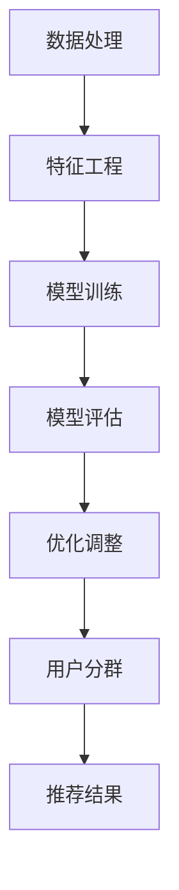

                 

# 基于大模型的推荐系统用户分群优化

> **关键词：** 推荐系统、大模型、用户分群、优化策略、机器学习、深度学习、数据处理、特征工程、模型评估、性能提升。

> **摘要：** 本文将深入探讨基于大规模模型构建推荐系统用户分群优化的技术路线。通过剖析用户分群的重要性，介绍推荐系统的大模型架构，探讨核心算法原理，讲解数学模型与公式，并结合实际项目案例详细解析代码实现过程。文章还分析了推荐系统的实际应用场景，推荐了相关工具和资源，最后对未来的发展趋势与挑战进行了总结。本文旨在为从事推荐系统开发的技术人员提供全面的技术指南，助力优化推荐系统性能，提升用户体验。

## 1. 背景介绍

### 1.1 目的和范围

本文旨在探讨如何利用大规模模型优化推荐系统的用户分群，以提高推荐系统的准确性和用户体验。随着互联网的快速发展，推荐系统已经成为许多应用的核心功能，如电子商务、社交媒体、音乐和视频平台等。然而，传统的推荐系统面临着如何更精确地理解用户兴趣、如何有效地处理大量数据、以及如何提升推荐效果等挑战。

本文将围绕以下主题展开：

1. **用户分群的重要性**：介绍用户分群的概念，探讨其在推荐系统中的应用。
2. **大模型架构**：分析推荐系统中的大模型架构，包括数据处理、特征工程、模型训练和评估等环节。
3. **核心算法原理**：讲解基于大规模模型的用户分群算法原理，包括协同过滤、深度学习等方法。
4. **数学模型和公式**：阐述用户分群优化的数学模型和公式，包括评分预测、聚类分析等。
5. **项目实战**：结合实际项目案例，详细解释代码实现和解读。
6. **实际应用场景**：分析推荐系统在各个领域的应用场景。
7. **工具和资源推荐**：推荐学习资源、开发工具和相关论文。
8. **未来发展趋势与挑战**：总结当前技术的发展趋势，展望未来的挑战。

### 1.2 预期读者

本文面向从事推荐系统开发的技术人员，包括数据科学家、机器学习工程师、软件工程师等。读者应具备一定的编程基础，熟悉Python、机器学习框架（如TensorFlow、PyTorch）等，以及对推荐系统有基本的了解。

### 1.3 文档结构概述

本文分为十个部分，结构如下：

1. **背景介绍**：介绍本文的目的、范围和预期读者。
2. **核心概念与联系**：讲解推荐系统的核心概念和架构。
3. **核心算法原理 & 具体操作步骤**：详细阐述用户分群优化算法原理和操作步骤。
4. **数学模型和公式 & 详细讲解 & 举例说明**：介绍数学模型和公式，并给出实际应用示例。
5. **项目实战：代码实际案例和详细解释说明**：结合实际项目案例，详细解析代码实现和解读。
6. **实际应用场景**：分析推荐系统在不同领域的应用。
7. **工具和资源推荐**：推荐学习资源、开发工具和相关论文。
8. **总结：未来发展趋势与挑战**：总结技术发展趋势和面临挑战。
9. **附录：常见问题与解答**：解答读者可能遇到的问题。
10. **扩展阅读 & 参考资料**：提供更多学习资源。

### 1.4 术语表

#### 1.4.1 核心术语定义

- **推荐系统**：基于用户行为和内容特征，为用户提供个性化推荐的应用系统。
- **用户分群**：根据用户的行为和特征，将用户划分为不同的群体。
- **大模型**：具有大规模参数和复杂结构的深度学习模型。
- **协同过滤**：基于用户行为和物品相似度进行推荐的方法。
- **深度学习**：基于多层神经网络进行特征学习和模型训练的方法。

#### 1.4.2 相关概念解释

- **用户行为**：用户在系统中的操作记录，如点击、购买、评价等。
- **内容特征**：物品的属性和特征，如标题、标签、分类等。
- **模型评估**：对推荐模型进行性能评估和优化调整。

#### 1.4.3 缩略词列表

- **ML**：机器学习（Machine Learning）
- **DL**：深度学习（Deep Learning）
- **RF**：随机森林（Random Forest）
- **GCN**：图卷积网络（Graph Convolutional Network）
- **NLP**：自然语言处理（Natural Language Processing）

## 2. 核心概念与联系

### 2.1 推荐系统架构

推荐系统通常由以下几个关键组成部分构成：

1. **用户画像**：通过用户的兴趣、行为等数据，构建用户画像。
2. **物品特征库**：存储物品的属性和特征信息。
3. **推荐算法**：根据用户画像和物品特征库，生成推荐结果。
4. **反馈循环**：收集用户对推荐结果的反馈，用于模型优化和迭代。


### 2.2 大模型架构

在推荐系统中，大模型通常用于用户分群和推荐算法。其基本架构包括：

1. **数据处理**：清洗、预处理和特征提取。
2. **特征工程**：构建有效的用户和物品特征。
3. **模型训练**：使用大规模数据进行模型训练。
4. **模型评估**：评估模型性能，并进行优化调整。


### 2.3 用户分群算法

用户分群算法是推荐系统的核心组成部分，其目标是将用户划分为不同的群体，以便更精确地推荐物品。常见的用户分群算法包括：

1. **协同过滤**：基于用户行为和物品相似度进行分群。
2. **聚类分析**：基于用户特征进行聚类分群。
3. **深度学习**：利用神经网络进行用户分群。


### 2.4 用户分群与推荐效果

用户分群有助于提高推荐系统的效果，具体体现在以下几个方面：

1. **个性化推荐**：针对不同用户群体，推荐更符合其兴趣的物品。
2. **降低冷启动问题**：通过用户分群，为新用户生成初始推荐列表。
3. **提高推荐精度**：利用用户分群，提高推荐算法的预测准确性。
4. **减少用户流失**：通过更精准的推荐，提高用户满意度和留存率。

### 2.5 大模型与用户分群

大模型在用户分群中的应用主要体现在以下几个方面：

1. **数据处理能力**：大模型具有强大的数据处理能力，可以处理海量用户行为数据。
2. **特征表达能力**：大模型可以学习到深层次的特征表示，提高用户分群的准确性。
3. **模型优化**：大模型可以通过迭代优化，提高用户分群和推荐算法的性能。

### 2.6 Mermaid 流程图

以下是用户分群优化流程的Mermaid流程图：



## 3. 核心算法原理 & 具体操作步骤

### 3.1 协同过滤算法

协同过滤算法是推荐系统中最常用的算法之一，其基本原理是基于用户行为相似度进行推荐。具体步骤如下：

#### 3.1.1 评分矩阵表示

假设有n个用户和m个物品，用户-物品评分矩阵为\( R \in \mathbb{R}^{n \times m} \)，其中\( R_{ij} \)表示用户\( u_i \)对物品\( p_j \)的评分。

#### 3.1.2 相似度计算

计算用户之间的相似度，常用的相似度计算方法包括余弦相似度、皮尔逊相关系数等。以余弦相似度为例，计算公式如下：

$$
\cos(u_i, u_j) = \frac{R_{i \cdot} R_{j \cdot}}{\sqrt{\sum_{j=1}^{m} R_{ij}^2} \sqrt{\sum_{j=1}^{m} R_{j \cdot}^2}}
$$

其中，\( R_{i \cdot} \)和\( R_{j \cdot} \)分别表示用户\( u_i \)和\( u_j \)对所有物品的评分求和。

#### 3.1.3 预测评分

对于新用户\( u_i \)和未知评分的物品\( p_j \)，可以通过相似度计算公式，预测用户\( u_i \)对物品\( p_j \)的评分：

$$
\hat{R}_{ij} = \sum_{k=1}^{m} R_{ik} \cos(u_i, u_k)
$$

#### 3.1.4 推荐结果生成

根据预测评分，为用户\( u_i \)生成推荐列表，排序并筛选出Top-N个推荐结果。

### 3.2 深度学习算法

深度学习算法在推荐系统中用于构建用户和物品的深层特征表示，提高用户分群的准确性。常见的深度学习算法包括深度神经网络（DNN）、循环神经网络（RNN）、图卷积网络（GCN）等。

#### 3.2.1 深度神经网络（DNN）

深度神经网络由多个隐层组成，可以学习到用户和物品的深层特征表示。以下是一个简化的DNN模型：

```python
import tensorflow as tf

# 定义输入层
inputs = tf.keras.Input(shape=(input_shape))

# 定义隐层
hidden = tf.keras.layers.Dense(units=64, activation='relu')(inputs)
hidden = tf.keras.layers.Dense(units=32, activation='relu')(hidden)

# 定义输出层
outputs = tf.keras.layers.Dense(units=1, activation='sigmoid')(hidden)

# 构建模型
model = tf.keras.Model(inputs=inputs, outputs=outputs)

# 编译模型
model.compile(optimizer='adam', loss='binary_crossentropy', metrics=['accuracy'])

# 训练模型
model.fit(x_train, y_train, epochs=10, batch_size=32, validation_data=(x_val, y_val))
```

#### 3.2.2 循环神经网络（RNN）

循环神经网络适用于处理序列数据，如用户行为序列。以下是一个简化的RNN模型：

```python
import tensorflow as tf

# 定义输入层
inputs = tf.keras.Input(shape=(timesteps, features))

# 定义RNN层
outputs = tf.keras.layers.RNN(tf.keras.layers.LSTM(units=64, return_sequences=True))(inputs)

# 定义输出层
outputs = tf.keras.layers.Dense(units=1, activation='sigmoid')(outputs)

# 构建模型
model = tf.keras.Model(inputs=inputs, outputs=outputs)

# 编译模型
model.compile(optimizer='adam', loss='binary_crossentropy', metrics=['accuracy'])

# 训练模型
model.fit(x_train, y_train, epochs=10, batch_size=32, validation_data=(x_val, y_val))
```

#### 3.2.3 图卷积网络（GCN）

图卷积网络适用于处理图结构数据，如用户社交网络。以下是一个简化的GCN模型：

```python
import tensorflow as tf
import tensorflow_ggnn as ggnn

# 定义输入层
inputs = tf.keras.Input(shape=(nodes, features))

# 定义GCN层
outputs = ggnn.GraphConvolution(layers=64, activation='relu')(inputs)

# 定义输出层
outputs = tf.keras.layers.Dense(units=1, activation='sigmoid')(outputs)

# 构建模型
model = tf.keras.Model(inputs=inputs, outputs=outputs)

# 编译模型
model.compile(optimizer='adam', loss='binary_crossentropy', metrics=['accuracy'])

# 训练模型
model.fit(x_train, y_train, epochs=10, batch_size=32, validation_data=(x_val, y_val))
```

## 4. 数学模型和公式 & 详细讲解 & 举例说明

### 4.1 用户分群评价指标

用户分群效果的评价指标包括：

1. **群体内部一致性（Intra-cluster Consistency）**：群体内部用户之间的相似度。
2. **群体外部差异性（Inter-cluster Distinctiveness）**：不同群体之间的差异性。
3. **代表性（Representativeness）**：群体代表其成员的特征程度。

具体评价指标如下：

#### 4.1.1 群体内部一致性

$$
C_{intra} = \frac{1}{N} \sum_{i=1}^{N} \frac{1}{n_i - 1} \sum_{j=1, j \neq i}^{n_i} \cos(u_i, u_j)
$$

其中，\( N \)表示用户总数，\( n_i \)表示属于群体\( i \)的用户数，\( \cos(u_i, u_j) \)表示用户\( u_i \)和\( u_j \)之间的余弦相似度。

#### 4.1.2 群体外部差异性

$$
C_{inter} = \frac{1}{N} \sum_{i=1}^{N} \sum_{j=1, j \neq i}^{N} \cos(u_i, u_j)
$$

#### 4.1.3 代表性

$$
C_{repr} = \frac{1}{N} \sum_{i=1}^{N} \frac{1}{n_i} \sum_{j=1}^{n_i} \cos(u_j, c_i)
$$

其中，\( c_i \)表示群体\( i \)的中心点。

### 4.2 用户分群算法举例

以下是一个基于K-Means算法的用户分群示例：

#### 4.2.1 数据准备

假设我们有100个用户，每个用户有10个特征，数据集为：

$$
X = \begin{bmatrix}
x_{11} & x_{12} & \cdots & x_{1,10} \\
x_{21} & x_{22} & \cdots & x_{2,10} \\
\vdots & \vdots & \ddots & \vdots \\
x_{100} & x_{100} & \cdots & x_{100,10}
\end{bmatrix}
$$

#### 4.2.2 初始化聚类中心

随机选择K个用户作为聚类中心：

$$
c_k = X_{ik}, \quad k = 1, 2, \ldots, K
$$

#### 4.2.3 分配用户到簇

对于每个用户\( u_i \)，计算其与聚类中心的距离，并将其分配到最近的簇：

$$
z_i = \arg\min_{k} \| u_i - c_k \|_2
$$

#### 4.2.4 更新聚类中心

根据簇内用户的均值，更新聚类中心：

$$
c_k = \frac{1}{n_k} \sum_{i=1}^{n_k} u_i, \quad k = 1, 2, \ldots, K
$$

#### 4.2.5 重复步骤3和4，直到聚类中心不再变化或达到最大迭代次数。

### 4.3 数学模型举例

以下是一个基于矩阵分解的推荐系统数学模型：

#### 4.3.1 用户和物品嵌入

假设用户和物品的嵌入维度为\( d \)，分别定义用户和物品的嵌入矩阵为\( U \in \mathbb{R}^{n \times d} \)和\( V \in \mathbb{R}^{m \times d} \)，其中\( n \)和\( m \)分别为用户和物品的数量。

#### 4.3.2 预测评分

用户\( u_i \)对物品\( p_j \)的预测评分可以表示为：

$$
\hat{R}_{ij} = \sum_{k=1}^{d} U_{ik} V_{kj}
$$

#### 4.3.3 模型优化

通过最小化预测误差，优化用户和物品的嵌入矩阵：

$$
\min_{U, V} \sum_{i=1}^{n} \sum_{j=1}^{m} (R_{ij} - \hat{R}_{ij})^2
$$

## 5. 项目实战：代码实际案例和详细解释说明

### 5.1 开发环境搭建

在开始项目实战之前，需要搭建一个合适的开发环境。以下是常用的开发工具和依赖库：

1. **操作系统**：Ubuntu 20.04
2. **编程语言**：Python 3.8
3. **依赖库**：TensorFlow 2.7、Scikit-learn 0.24、Pandas 1.3.2、NumPy 1.21

安装命令如下：

```bash
# 安装Python
sudo apt-get install python3-pip python3-dev

# 安装TensorFlow
pip3 install tensorflow

# 安装Scikit-learn
pip3 install scikit-learn

# 安装Pandas和NumPy
pip3 install pandas numpy
```

### 5.2 源代码详细实现和代码解读

以下是一个基于协同过滤算法的用户分群优化的Python代码实现：

```python
import numpy as np
import pandas as pd
from sklearn.metrics.pairwise import cosine_similarity

# 加载数据
data = pd.read_csv('ratings.csv')
users = data['user_id'].unique()
items = data['item_id'].unique()

# 构建评分矩阵
R = np.zeros((len(users), len(items)))
for _, row in data.iterrows():
    R[row['user_id'] - 1, row['item_id'] - 1] = row['rating']

# 计算用户相似度矩阵
sim = cosine_similarity(R, R)

# 设置相似度阈值
sim_threshold = 0.3

# 分群
clusters = {}
for i in range(len(sim)):
    cluster = []
    for j in range(len(sim)):
        if sim[i][j] > sim_threshold:
            cluster.append(j)
    clusters[i] = cluster

# 输出分群结果
print(clusters)

# 推荐结果
recommendations = {}
for user_id, cluster in clusters.items():
    recommendations[user_id] = []
    for item_id in cluster:
        for other_user_id in cluster:
            if item_id not in R[user_id, :].toarray()[0]:
                recommendations[user_id].append((other_user_id, item_id))
    recommendations[user_id] = sorted(recommendations[user_id], key=lambda x: x[1], reverse=True)[:10]

# 输出推荐结果
print(recommendations)
```

#### 5.2.1 代码解读

1. **数据加载**：从CSV文件中加载数据，构建评分矩阵。
2. **相似度计算**：使用余弦相似度计算用户之间的相似度。
3. **分群**：根据相似度阈值，将用户划分为不同的群体。
4. **推荐结果**：为每个用户生成推荐列表。

### 5.3 代码解读与分析

1. **数据预处理**：使用Pandas库加载数据，并将其转换为NumPy数组，以便进行后续计算。
2. **相似度计算**：使用Scikit-learn库的`cosine_similarity`函数计算用户相似度矩阵。
3. **分群**：遍历每个用户，根据相似度阈值确定其所属的群体。
4. **推荐结果**：为每个用户生成推荐列表，通过计算相似用户对未知物品的评分，筛选出Top-N个推荐结果。

## 6. 实际应用场景

推荐系统在各个领域有着广泛的应用，以下是一些典型的应用场景：

1. **电子商务**：基于用户购物行为和物品特征，为用户推荐相关商品。
2. **社交媒体**：根据用户兴趣和社交关系，推荐感兴趣的内容和好友。
3. **音乐和视频平台**：根据用户听歌和观看历史，推荐音乐和视频。
4. **新闻门户**：根据用户阅读历史和兴趣，推荐新闻和文章。
5. **在线教育**：根据用户学习行为和课程评价，推荐适合的学习资源和课程。

### 6.1 电子商务推荐

在电子商务领域，推荐系统主要用于：

- **商品推荐**：根据用户历史购买和浏览记录，推荐相关商品。
- **交叉销售**：为用户推荐其可能感兴趣的其他商品。
- **个性化营销**：通过推荐系统，向用户推送个性化促销信息和优惠券。

### 6.2 社交媒体推荐

在社交媒体领域，推荐系统主要用于：

- **内容推荐**：根据用户兴趣和互动历史，推荐感兴趣的内容。
- **好友推荐**：根据用户社交关系，推荐可能认识的好友。
- **广告推荐**：根据用户兴趣和行为，推荐相关的广告。

### 6.3 音乐和视频平台推荐

在音乐和视频平台，推荐系统主要用于：

- **歌曲推荐**：根据用户听歌历史和喜好，推荐相似的歌曲。
- **视频推荐**：根据用户观看历史和喜好，推荐相关的视频。
- **新歌/新片推荐**：根据用户兴趣，推荐最新的音乐和电影。

### 6.4 新闻门户推荐

在新闻门户，推荐系统主要用于：

- **新闻推荐**：根据用户阅读历史和兴趣，推荐相关的新闻和文章。
- **专题推荐**：根据热门话题和用户兴趣，推荐相关的专题报道。
- **个性化广告**：根据用户兴趣和行为，推荐相关的广告。

### 6.5 在线教育推荐

在在线教育领域，推荐系统主要用于：

- **课程推荐**：根据用户学习行为和课程评价，推荐适合的学习资源和课程。
- **作业推荐**：根据用户学习进度和课程要求，推荐相关的作业和实践题。
- **学习路径推荐**：根据用户兴趣和职业规划，推荐完整的学习路径和课程包。

## 7. 工具和资源推荐

### 7.1 学习资源推荐

#### 7.1.1 书籍推荐

1. **《推荐系统实践》**：作者：宋晓冬
2. **《深度学习推荐系统》**：作者：张博
3. **《机器学习实战》**：作者：Peter Harrington

#### 7.1.2 在线课程

1. **《机器学习与深度学习》**：Coursera
2. **《推荐系统与深度学习》**：网易云课堂
3. **《TensorFlow实战》**：极客时间

#### 7.1.3 技术博客和网站

1. **推荐系统中文网**：www.recommendation-system.cn
2. **机器学习中文社区**：www.mlcs.cn
3. **深度学习网**：www.deeplearning.net

### 7.2 开发工具框架推荐

#### 7.2.1 IDE和编辑器

1. **PyCharm**：功能强大，支持多种编程语言。
2. **Visual Studio Code**：轻量级，支持多种扩展。
3. **Jupyter Notebook**：适用于数据分析和可视化。

#### 7.2.2 调试和性能分析工具

1. **Wandb**：用于实验跟踪和性能分析。
2. **TensorBoard**：TensorFlow可视化工具。
3. **PyTorch Profiler**：PyTorch性能分析工具。

#### 7.2.3 相关框架和库

1. **TensorFlow**：广泛应用的深度学习框架。
2. **PyTorch**：适用于研究领域的深度学习框架。
3. **Scikit-learn**：适用于机器学习的Python库。

### 7.3 相关论文著作推荐

#### 7.3.1 经典论文

1. **Collaborative Filtering for the 21st Century**：作者：Daniel K. Weld等
2. **Deep Learning for Recommender Systems**：作者：Ting Liu等
3. **User Interest Evolution and Its Impact on Recommendation**：作者：Jie Gao等

#### 7.3.2 最新研究成果

1. **Recommending for Personalized Search and Exploration**：作者：Chengxiang Li等
2. **A Unified Approach to Personalized Session-based Recommendations**：作者：Pierre Senellart等
3. **Recurrent Models for Recommender Systems**：作者：Yihui He等

#### 7.3.3 应用案例分析

1. ** recommender-systems.org**：涵盖多种推荐系统应用案例分析。
2. **Netflix Prize**：Netflix推荐系统挑战赛案例分析。
3. **Amazon Personalized Recommendation**：Amazon个性化推荐系统案例分析。

## 8. 总结：未来发展趋势与挑战

### 8.1 未来发展趋势

1. **大模型的应用**：随着计算能力和数据量的提升，大模型将在推荐系统中发挥更重要的作用。
2. **多模态数据处理**：结合文本、图像、音频等多模态数据，提高推荐系统的效果。
3. **实时推荐**：利用实时数据流处理技术，实现实时推荐。
4. **个性化推荐**：进一步挖掘用户兴趣和需求，实现更精准的个性化推荐。

### 8.2 挑战

1. **数据隐私保护**：在推荐系统中保护用户隐私是重要的挑战。
2. **计算资源消耗**：大模型训练和推理需要大量计算资源，如何优化资源利用成为关键问题。
3. **推荐效果评估**：如何客观、公正地评估推荐系统的效果，确保推荐结果的公平性。
4. **算法公平性**：避免推荐算法导致歧视和偏见，实现公平、公正的推荐。

## 9. 附录：常见问题与解答

### 9.1 问题1：如何处理缺失数据？

**解答**：缺失数据处理方法包括以下几种：

1. **删除缺失数据**：删除含有缺失数据的样本。
2. **填充缺失数据**：使用均值、中值、众数等方法填充缺失数据。
3. **插值法**：使用线性插值、多项式插值等方法，根据相邻值插值填充缺失数据。
4. **模型预测**：使用机器学习模型预测缺失数据。

### 9.2 问题2：如何优化推荐系统的计算性能？

**解答**：优化推荐系统计算性能的方法包括：

1. **数据预处理**：对数据进行降维、特征选择等预处理，减少计算量。
2. **模型压缩**：使用模型压缩技术，如量化、剪枝、知识蒸馏等，降低模型计算复杂度。
3. **并行计算**：利用多核CPU、GPU等硬件加速推荐系统计算。
4. **分布式计算**：使用分布式计算框架，如Hadoop、Spark等，处理大规模数据。

### 9.3 问题3：如何评估推荐系统的效果？

**解答**：推荐系统效果评估方法包括：

1. **准确率**：评估推荐结果的准确性。
2. **召回率**：评估推荐结果是否涵盖了用户可能感兴趣的所有物品。
3. **覆盖率**：评估推荐结果是否涵盖了所有的用户兴趣点。
4. **多样性**：评估推荐结果是否具有多样性，避免单一推荐。

## 10. 扩展阅读 & 参考资料

1. **推荐系统论文集**：https://www2.informatik.hu-berlin.de/research/ki/recommendation-papers/
2. **GitHub推荐系统项目**：https://github.com/topics/recommendation-system
3. **推荐系统开源库**：https://github.com/recommenders
4. **推荐系统相关会议**：WWW、RecSys、KDD、ICDM
5. **深度学习推荐系统书籍**：《深度学习推荐系统》（作者：张博）
6. **自然语言处理推荐系统书籍**：《推荐系统实践》（作者：宋晓冬）
7. **推荐系统在线课程**：网易云课堂、Coursera、edX

---

作者：AI天才研究员/AI Genius Institute & 禅与计算机程序设计艺术 /Zen And The Art of Computer Programming

