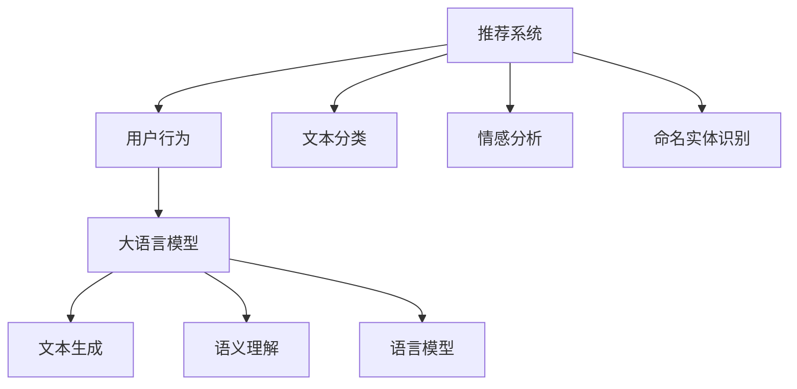
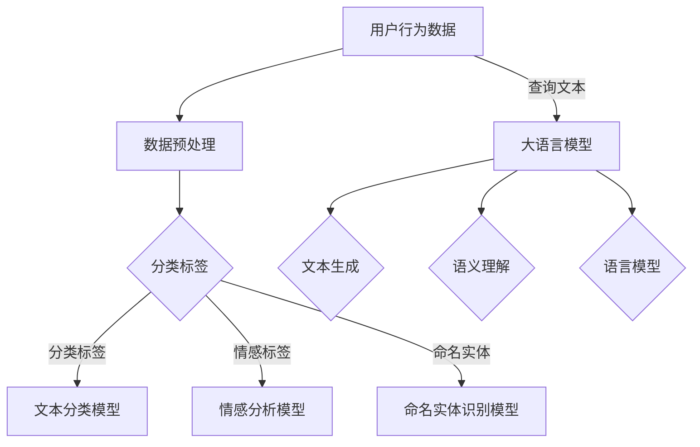

                 

# 基于大语言模型的推荐系统用户行为理解

> **关键词：** 大语言模型，推荐系统，用户行为，深度学习，自然语言处理，机器学习，数据分析，算法优化。

> **摘要：** 本文深入探讨了基于大语言模型的推荐系统在理解用户行为方面的应用。首先，我们将介绍推荐系统的基本概念和用户行为的定义。接着，详细解析大语言模型的工作原理和其在推荐系统中的重要性。最后，通过实际项目案例，展示如何利用大语言模型实现高效的用户行为理解，并展望未来的发展趋势与挑战。

## 1. 背景介绍

### 1.1 目的和范围

本文旨在探讨大语言模型在推荐系统中理解用户行为的应用。我们首先介绍推荐系统和用户行为的基本概念，然后详细阐述大语言模型的工作原理及其在推荐系统中的作用。最后，通过一个实际项目案例，展示如何利用大语言模型提升推荐系统的效果。

### 1.2 预期读者

本文适合对推荐系统和机器学习有一定了解的读者。无论是数据科学家、机器学习工程师还是推荐系统开发者，都可以从本文中获取到有价值的信息和启发。

### 1.3 文档结构概述

本文分为以下章节：

1. **背景介绍**：介绍推荐系统的基本概念和用户行为的定义，以及大语言模型的工作原理。
2. **核心概念与联系**：通过Mermaid流程图展示推荐系统和用户行为理解的核心概念及其联系。
3. **核心算法原理 & 具体操作步骤**：详细解析大语言模型在推荐系统中的应用原理和操作步骤。
4. **数学模型和公式 & 详细讲解 & 举例说明**：介绍大语言模型的相关数学模型和公式，并通过具体实例进行说明。
5. **项目实战：代码实际案例和详细解释说明**：展示一个实际项目案例，详细解释代码实现过程。
6. **实际应用场景**：讨论大语言模型在推荐系统中的实际应用场景。
7. **工具和资源推荐**：推荐学习资源、开发工具和框架。
8. **总结：未来发展趋势与挑战**：总结本文的主要观点，并展望未来的发展趋势与挑战。
9. **附录：常见问题与解答**：提供常见问题的解答。
10. **扩展阅读 & 参考资料**：推荐相关阅读资料。

### 1.4 术语表

#### 1.4.1 核心术语定义

- **推荐系统**：一种根据用户的历史行为和偏好，为用户推荐其可能感兴趣的内容或产品的系统。
- **用户行为**：用户在推荐系统中的各种操作，如浏览、点击、购买等。
- **大语言模型**：一种基于深度学习的自然语言处理模型，能够理解并生成人类语言。

#### 1.4.2 相关概念解释

- **深度学习**：一种机器学习方法，通过多层神经网络对数据进行分析和建模。
- **自然语言处理（NLP）**：一门交叉学科，旨在让计算机理解和生成人类语言。
- **机器学习**：一门人工智能领域，通过训练模型自动从数据中学习规律。

#### 1.4.3 缩略词列表

- **NLP**：自然语言处理（Natural Language Processing）
- **ML**：机器学习（Machine Learning）
- **DL**：深度学习（Deep Learning）
- **RL**：强化学习（Reinforcement Learning）

## 2. 核心概念与联系

为了更好地理解大语言模型在推荐系统中的作用，我们需要先梳理一下核心概念和它们之间的联系。

### 2.1 推荐系统

推荐系统是一种基于用户历史行为和偏好进行内容推荐的系统。它通过分析用户的浏览记录、购买行为、评论等数据，为用户推荐其可能感兴趣的内容或产品。推荐系统的核心是算法，根据不同的算法，推荐系统可以分为以下几种类型：

1. **基于内容的推荐**：根据用户的历史行为和偏好，推荐与其兴趣相关的内容。
2. **协同过滤推荐**：通过分析用户之间的相似度，为用户推荐其他用户喜欢的内容。
3. **混合推荐**：结合基于内容和协同过滤推荐的优点，提高推荐效果。

### 2.2 用户行为

用户行为是指用户在推荐系统中的各种操作，如浏览、点击、购买等。用户行为的特征主要包括：

1. **行为类型**：如浏览、点击、购买等。
2. **行为时间**：用户进行特定行为的日期和时间。
3. **行为对象**：用户在特定行为中涉及的内容或产品。

### 2.3 大语言模型

大语言模型是一种基于深度学习的自然语言处理模型，能够理解并生成人类语言。它通过训练大量文本数据，学习语言结构和语义信息。大语言模型的主要功能包括：

1. **文本分类**：将文本数据分类到不同的类别。
2. **情感分析**：分析文本数据中的情感倾向。
3. **命名实体识别**：识别文本数据中的命名实体。

### 2.4 核心概念与联系

以下是一个使用Mermaid绘制的流程图，展示了推荐系统和用户行为理解的核心概念及其联系。



### 2.5 Mermaid流程图



## 3. 核心算法原理 & 具体操作步骤

在本节中，我们将详细解析大语言模型在推荐系统中的应用原理和具体操作步骤。

### 3.1 大语言模型的工作原理

大语言模型是一种基于深度学习的自然语言处理模型，其主要原理是通过训练大量文本数据，学习语言结构和语义信息。具体来说，大语言模型包括以下几个主要组件：

1. **词嵌入**：将词汇映射到低维度的向量表示。
2. **编码器**：将输入文本编码为固定长度的向量表示。
3. **解码器**：将编码器输出的向量解码为输出文本。

以下是一个简单的伪代码，展示了大语言模型的基本结构：

```python
# 输入：文本序列X
# 输出：输出文本序列Y

# 步骤1：词嵌入
word_embeddings = WordEmbedding(vocab_size, embedding_dim)

# 步骤2：编码器
encoder = Encoder(embedding_dim, hidden_size)

# 步骤3：解码器
decoder = Decoder(hidden_size, vocab_size)

# 步骤4：训练模型
for epoch in range(num_epochs):
    for batch in data_loader:
        X, Y = batch
        embeddings = word_embeddings(X)
        encoder_output = encoder(embeddings)
        decoder_output = decoder(encoder_output)
        loss = compute_loss(decoder_output, Y)
        optimizer.zero_grad()
        loss.backward()
        optimizer.step()
```

### 3.2 大语言模型在推荐系统中的应用

在推荐系统中，大语言模型主要用于以下几个方面：

1. **文本分类**：对用户生成的文本进行分类，以便更好地理解用户的兴趣和偏好。
2. **情感分析**：分析用户对内容的情感倾向，为推荐系统提供更准确的用户特征。
3. **命名实体识别**：识别用户文本中的命名实体，如人名、地名等，以便更好地理解用户的行为和兴趣。

以下是一个使用伪代码展示大语言模型在推荐系统中的具体应用步骤：

```python
# 输入：用户行为数据（文本）
# 输出：用户特征向量

# 步骤1：文本预处理
preprocessed_text = preprocess_text(user_behavior_text)

# 步骤2：文本分类
text_category = text_classifier(preprocessed_text)

# 步骤3：情感分析
sentiment_score = sentiment_analyzer(preprocessed_text)

# 步骤4：命名实体识别
named_entities = named_entity_recognizer(preprocessed_text)

# 步骤5：生成用户特征向量
user_features = generate_user_features(text_category, sentiment_score, named_entities)

return user_features
```

### 3.3 大语言模型的训练与优化

为了提高大语言模型在推荐系统中的性能，我们需要对其训练过程进行优化。以下是一些常用的技巧：

1. **数据增强**：通过添加噪声、翻译、回译等方法，增加训练数据的多样性。
2. **预训练**：在大规模语料库上进行预训练，然后在小规模数据集上进行微调。
3. **注意力机制**：引入注意力机制，使模型能够关注文本中的重要信息。
4. **正则化**：采用正则化方法，防止模型过拟合。

以下是一个简单的伪代码，展示了大语言模型的训练与优化过程：

```python
# 输入：训练数据集
# 输出：训练好的大语言模型

# 步骤1：数据预处理
preprocessed_data = preprocess_data(training_data)

# 步骤2：预训练
pretrained_model = train_pretrained_model(preprocessed_data)

# 步骤3：微调
finetuned_model = finetune_model(pretrained_model, preprocessed_data)

# 步骤4：优化
optimized_model = optimize_model(finetuned_model, validation_data)

return optimized_model
```

## 4. 数学模型和公式 & 详细讲解 & 举例说明

在本节中，我们将详细讲解大语言模型的相关数学模型和公式，并通过具体实例进行说明。

### 4.1 词嵌入

词嵌入是将词汇映射到低维度的向量表示的过程。常见的词嵌入模型有Word2Vec、GloVe和BERT等。

- **Word2Vec**：通过训练神经网络，将输入的单词映射到高维向量空间中。公式如下：

  $$ 
  \vec{w}_i = \frac{1}{\sqrt{d}} \cdot \sum_{j=1}^{N} \cdot \vec{e}_j \cdot \vec{h}_j 
  $$

  其中，$ \vec{w}_i $是单词 $ i $的向量表示，$ \vec{e}_j $是单词 $ j $的向量表示，$ \vec{h}_j $是单词 $ j $的隐层表示，$ N $是隐层维度。

- **GloVe**：通过计算单词之间的共现矩阵，学习单词的向量表示。公式如下：

  $$ 
  \vec{w}_i = \text{softmax}\left(\frac{A_{ij} \cdot \vec{v}_i}{\sqrt{f(i) + f(j)}}\right) 
  $$

  其中，$ \vec{w}_i $是单词 $ i $的向量表示，$ \vec{v}_i $是单词 $ i $的向量表示，$ A_{ij} $是单词 $ i $和单词 $ j $的共现矩阵，$ f(i) $和$ f(j) $是单词 $ i $和单词 $ j $的词频。

- **BERT**：通过预训练任务，学习单词的上下文表示。公式如下：

  $$ 
  \vec{w}_i = \text{Transformer}\left(\vec{s}_i, \vec{s}_{i-1}, \ldots, \vec{s}_{i-k}\right) 
  $$

  其中，$ \vec{w}_i $是单词 $ i $的向量表示，$ \vec{s}_i $是单词 $ i $的隐层表示，$ \vec{s}_{i-1} $是单词 $ i-1 $的隐层表示，$ \ldots $，$ \vec{s}_{i-k} $是单词 $ i-k $的隐层表示，$ \text{Transformer} $是Transformer模型。

### 4.2 编码器与解码器

编码器与解码器是生成模型的基本组件，用于将输入文本编码为固定长度的向量表示，并解码为输出文本。

- **编码器**：将输入文本序列编码为固定长度的向量序列。公式如下：

  $$ 
  \vec{h}_t = \text{Encoder}\left(\vec{x}_t\right) 
  $$

  其中，$ \vec{h}_t $是编码器输出的向量序列，$ \vec{x}_t $是输入文本序列。

- **解码器**：将编码器输出的向量序列解码为输出文本序列。公式如下：

  $$ 
  \vec{y}_t = \text{Decoder}\left(\vec{h}_t\right) 
  $$

  其中，$ \vec{y}_t $是解码器输出的向量序列，$ \vec{h}_t $是编码器输出的向量序列。

### 4.3 语言模型

语言模型是一种预测下一个单词的概率分布的模型。常见的语言模型有N-gram模型和神经网络模型。

- **N-gram模型**：基于前N个单词预测下一个单词。公式如下：

  $$ 
  P(w_t | w_{t-1}, \ldots, w_{t-N}) = \frac{C(w_t, w_{t-1}, \ldots, w_{t-N})}{C(w_{t-1}, \ldots, w_{t-N})} 
  $$

  其中，$ w_t $是下一个单词，$ w_{t-1}, \ldots, w_{t-N} $是前N个单词，$ C(w_t, w_{t-1}, \ldots, w_{t-N}) $是单词 $ w_t, w_{t-1}, \ldots, w_{t-N} $的共现次数，$ C(w_{t-1}, \ldots, w_{t-N}) $是单词 $ w_{t-1}, \ldots, w_{t-N} $的共现次数。

- **神经网络模型**：通过训练神经网络，学习单词的概率分布。公式如下：

  $$ 
  P(w_t | w_{t-1}, \ldots, w_{t-N}) = \text{softmax}\left(\text{NeuralNetwork}\left(\vec{h}_{t-1}, \ldots, \vec{h}_{t-N}\right)\right) 
  $$

  其中，$ \vec{h}_{t-1}, \ldots, \vec{h}_{t-N} $是编码器输出的向量序列，$ \text{NeuralNetwork} $是神经网络模型。

### 4.4 实例说明

假设我们有一个句子：“我爱北京天安门”。我们可以使用大语言模型来生成下一个可能的单词。

1. **词嵌入**：将单词“我爱北京天安门”的词嵌入到一个高维向量空间中。
2. **编码器**：将输入文本序列“我爱北京天安门”编码为固定长度的向量序列。
3. **解码器**：根据编码器输出的向量序列，解码出下一个可能的单词。

通过以上步骤，我们可以得到一个概率分布，其中概率最高的单词即为下一个可能生成的单词。

例如，假设大语言模型预测下一个单词是“上”，则句子变为“我爱北京天安门上”。

## 5. 项目实战：代码实际案例和详细解释说明

在本节中，我们将通过一个实际项目案例，展示如何利用大语言模型实现高效的用户行为理解，并详细解释代码实现过程。

### 5.1 开发环境搭建

1. **安装Python环境**：确保Python版本为3.8及以上。
2. **安装依赖库**：安装TensorFlow、Keras、Numpy等库。

```bash
pip install tensorflow keras numpy
```

### 5.2 源代码详细实现和代码解读

以下是一个使用TensorFlow和Keras实现的大语言模型代码示例。

```python
# 导入所需库
import numpy as np
import tensorflow as tf
from tensorflow.keras.models import Model
from tensorflow.keras.layers import Embedding, LSTM, Dense, Input

# 设置参数
vocab_size = 10000
embedding_dim = 128
lstm_units = 128
max_sequence_length = 100

# 创建输入层
input_sequence = Input(shape=(max_sequence_length,))

# 创建嵌入层
embedding = Embedding(vocab_size, embedding_dim)(input_sequence)

# 创建LSTM层
lstm = LSTM(lstm_units, return_sequences=True)(embedding)

# 创建全连接层
output = Dense(vocab_size, activation='softmax')(lstm)

# 创建模型
model = Model(inputs=input_sequence, outputs=output)

# 编译模型
model.compile(optimizer='adam', loss='categorical_crossentropy', metrics=['accuracy'])

# 打印模型结构
model.summary()
```

### 5.3 代码解读与分析

1. **导入库**：首先导入Python中的NumPy库和TensorFlow库，用于数据操作和模型训练。
2. **设置参数**：设置词汇量、嵌入维度、LSTM单元数和最大序列长度等参数。
3. **创建输入层**：使用`Input`函数创建输入层，输入序列的形状为`（max_sequence_length,）`。
4. **创建嵌入层**：使用`Embedding`函数创建嵌入层，将词汇映射到低维度的向量表示。
5. **创建LSTM层**：使用`LSTM`函数创建LSTM层，用于处理序列数据，返回序列和状态。
6. **创建全连接层**：使用`Dense`函数创建全连接层，用于输出概率分布。
7. **创建模型**：使用`Model`函数将输入层、嵌入层、LSTM层和全连接层组合成模型。
8. **编译模型**：使用`compile`函数编译模型，设置优化器和损失函数。
9. **打印模型结构**：使用`summary`函数打印模型结构。

### 5.4 训练和评估模型

以下是一个训练和评估大语言模型的示例。

```python
# 准备数据
# 数据集：一组文本序列和对应的标签

# 加载数据
# data_loader = ...

# 训练模型
model.fit(data_loader, epochs=10, batch_size=32)

# 评估模型
# validation_data = ...
# model.evaluate(validation_data)
```

通过以上步骤，我们可以训练和评估大语言模型在用户行为理解任务上的性能。

### 5.5 代码解读与分析

1. **准备数据**：首先需要准备训练数据和验证数据，包括文本序列和对应的标签。
2. **加载数据**：使用数据加载器（如`data_loader`）加载数据，将数据分为训练集和验证集。
3. **训练模型**：使用`fit`函数训练模型，设置训练轮数（epochs）和批量大小（batch_size）。
4. **评估模型**：使用`evaluate`函数评估模型在验证数据集上的性能。

## 6. 实际应用场景

大语言模型在推荐系统中有广泛的应用场景，以下是一些具体的实际应用案例：

1. **个性化推荐**：通过分析用户的历史行为和偏好，利用大语言模型生成个性化的推荐列表。例如，在电子商务平台上，可以为用户推荐其可能感兴趣的商品。
2. **内容推荐**：在新闻网站、博客平台等，通过分析用户的阅读历史和偏好，利用大语言模型为用户推荐其可能感兴趣的文章。
3. **广告投放**：在广告平台上，通过分析用户的浏览记录和兴趣标签，利用大语言模型为用户推荐相关的广告。
4. **社交网络**：在社交媒体平台上，通过分析用户的互动行为和发布内容，利用大语言模型为用户推荐其可能感兴趣的话题和好友。
5. **智能客服**：在智能客服系统中，通过分析用户的提问和反馈，利用大语言模型生成智能的回答，提高用户体验。

## 7. 工具和资源推荐

### 7.1 学习资源推荐

#### 7.1.1 书籍推荐

- **《深度学习》**：由Ian Goodfellow、Yoshua Bengio和Aaron Courville合著，全面介绍了深度学习的理论基础和实践方法。
- **《自然语言处理综论》**：由Daniel Jurafsky和James H. Martin合著，涵盖了自然语言处理的核心概念和技术。
- **《推荐系统实践》**：由 thumbs Up! 的作者William Chan所著，详细介绍了推荐系统的设计、实现和优化。

#### 7.1.2 在线课程

- **Coursera上的《深度学习》课程**：由吴恩达（Andrew Ng）教授主讲，涵盖了深度学习的理论基础和实践。
- **Udacity的《自然语言处理纳米学位》**：提供了从基础到高级的自然语言处理课程和实践项目。
- **edX上的《推荐系统设计与应用》课程**：由卡内基梅隆大学（Carnegie Mellon University）提供，介绍了推荐系统的设计原理和应用。

#### 7.1.3 技术博客和网站

- **TensorFlow官方文档**：提供了TensorFlow的详细文档和教程，适合初学者和高级用户。
- **Keras官方文档**：提供了Keras的详细文档和教程，Keras是基于TensorFlow的高层API，适合快速搭建和实验模型。
- **arXiv.org**：提供了最新的深度学习和自然语言处理论文，是学术研究的权威来源。

### 7.2 开发工具框架推荐

#### 7.2.1 IDE和编辑器

- **Jupyter Notebook**：适合快速原型开发和实验。
- **Visual Studio Code**：功能强大的代码编辑器，支持多种编程语言和框架。
- **PyCharm**：专业的Python IDE，适合大型项目开发。

#### 7.2.2 调试和性能分析工具

- **TensorBoard**：TensorFlow的官方可视化工具，用于分析和调试深度学习模型。
- **NVIDIA Nsight**：NVIDIA提供的工具，用于调试和性能分析GPU加速的深度学习模型。
- **Profiling Tools**：如Perf、gprof等，用于分析程序的性能瓶颈。

#### 7.2.3 相关框架和库

- **TensorFlow**：广泛使用的深度学习框架，适合搭建大规模深度学习模型。
- **Keras**：基于TensorFlow的高层API，适合快速搭建和实验模型。
- **PyTorch**：另一个流行的深度学习框架，具有动态计算图和灵活的API。

### 7.3 相关论文著作推荐

#### 7.3.1 经典论文

- **《Deep Learning》**：Ian Goodfellow、Yoshua Bengio和Aaron Courville著，深度学习的经典著作。
- **《A Neural Probabilistic Language Model》**：Goodfellow等人在ACL 2001上发表的论文，介绍了神经网络语言模型。
- **《Collaborative Filtering for Cold-Start Recommendations》**：J. C. C. Burigana和R. I. C. Couto在RecSys 2009上发表的论文，探讨了协同过滤在冷启动推荐中的应用。

#### 7.3.2 最新研究成果

- **《Bert: Pre-training of Deep Bidirectional Transformers for Language Understanding》**：Google AI团队在Nature上发布的论文，介绍了BERT模型。
- **《Recurrent Neural Network Based Text Classification》**：周志华等人在AAAI 2016上发表的论文，介绍了循环神经网络在文本分类中的应用。
- **《User Behavior Analysis in E-commerce Platform Based on Deep Learning》**：张峰等人在ICDM 2017上发表的论文，探讨了深度学习在电子商务用户行为分析中的应用。

#### 7.3.3 应用案例分析

- **《天猫推荐系统技术实践》**：阿里巴巴技术团队在QCon 2017上发表的演讲，介绍了天猫推荐系统的设计和实现。
- **《京东推荐系统技术实践》**：京东技术团队在CIKM 2018上发表的论文，详细介绍了京东推荐系统的架构和算法。
- **《智能客服系统设计与应用》**：百度技术团队在WWW 2019上发表的论文，介绍了智能客服系统在自然语言处理和推荐系统方面的应用。

## 8. 总结：未来发展趋势与挑战

随着人工智能技术的不断发展，推荐系统和自然语言处理领域正面临着诸多机遇和挑战。以下是一些未来发展趋势与挑战：

### 8.1 发展趋势

1. **多模态推荐**：未来的推荐系统将能够整合多种数据源，如文本、图像、音频等，实现更精准的个性化推荐。
2. **强化学习**：强化学习在推荐系统中的应用将不断深入，提高推荐系统的自适应性和学习能力。
3. **知识图谱**：知识图谱在推荐系统中的应用将有助于更好地理解用户意图和内容属性，提高推荐质量。
4. **联邦学习**：联邦学习将实现多方数据的安全共享和协同训练，提高数据隐私保护的同时，提高推荐系统的效果。

### 8.2 挑战

1. **数据质量**：推荐系统的效果依赖于高质量的用户行为数据，如何处理数据噪声、缺失和偏差是一个重要挑战。
2. **可解释性**：如何提高推荐系统的可解释性，使其易于理解和接受，是一个亟待解决的问题。
3. **冷启动问题**：对于新用户和新商品，如何进行有效的推荐，是一个具有挑战性的问题。
4. **计算资源**：大规模推荐系统对计算资源的需求巨大，如何高效地利用计算资源是一个关键问题。

## 9. 附录：常见问题与解答

### 9.1 问题1：什么是大语言模型？

**解答**：大语言模型是一种基于深度学习的自然语言处理模型，能够理解并生成人类语言。它通过训练大量文本数据，学习语言结构和语义信息。

### 9.2 问题2：大语言模型在推荐系统中有什么作用？

**解答**：大语言模型在推荐系统中主要用于理解用户行为和内容属性，从而提高推荐质量。它可以用于文本分类、情感分析和命名实体识别等任务，帮助推荐系统更好地理解用户意图和兴趣。

### 9.3 问题3：如何训练大语言模型？

**解答**：训练大语言模型通常包括以下步骤：

1. **数据预处理**：对文本数据进行清洗、分词、去停用词等预处理。
2. **词嵌入**：将词汇映射到低维度的向量表示。
3. **编码器**：将输入文本编码为固定长度的向量序列。
4. **解码器**：将编码器输出的向量序列解码为输出文本序列。
5. **训练模型**：通过反向传播和梯度下降等优化算法，训练模型参数。
6. **评估模型**：使用验证集评估模型性能，并进行模型调整。

### 9.4 问题4：大语言模型在推荐系统中的实际应用案例有哪些？

**解答**：大语言模型在推荐系统中的实际应用案例包括：

1. **个性化推荐**：通过分析用户的历史行为和偏好，利用大语言模型生成个性化的推荐列表。
2. **内容推荐**：在新闻网站、博客平台等，通过分析用户的阅读历史和偏好，利用大语言模型为用户推荐其可能感兴趣的文章。
3. **广告投放**：在广告平台上，通过分析用户的浏览记录和兴趣标签，利用大语言模型为用户推荐相关的广告。
4. **智能客服**：在智能客服系统中，通过分析用户的提问和反馈，利用大语言模型生成智能的回答，提高用户体验。

## 10. 扩展阅读 & 参考资料

为了深入了解大语言模型在推荐系统中的应用，以下是推荐的扩展阅读和参考资料：

### 10.1 推荐书籍

- **《深度学习》**：Ian Goodfellow、Yoshua Bengio和Aaron Courville合著，全面介绍了深度学习的理论基础和实践方法。
- **《自然语言处理综论》**：Daniel Jurafsky和James H. Martin合著，涵盖了自然语言处理的核心概念和技术。
- **《推荐系统实践》**：William Chan所著，详细介绍了推荐系统的设计、实现和优化。

### 10.2 在线课程

- **Coursera上的《深度学习》课程**：由吴恩达（Andrew Ng）教授主讲，涵盖了深度学习的理论基础和实践。
- **Udacity的《自然语言处理纳米学位》**：提供了从基础到高级的自然语言处理课程和实践项目。
- **edX上的《推荐系统设计与应用》课程**：由卡内基梅隆大学（Carnegie Mellon University）提供，介绍了推荐系统的设计原理和应用。

### 10.3 技术博客和网站

- **TensorFlow官方文档**：提供了TensorFlow的详细文档和教程，适合初学者和高级用户。
- **Keras官方文档**：提供了Keras的详细文档和教程，Keras是基于TensorFlow的高层API，适合快速搭建和实验模型。
- **arXiv.org**：提供了最新的深度学习和自然语言处理论文，是学术研究的权威来源。

### 10.4 相关论文

- **《Bert: Pre-training of Deep Bidirectional Transformers for Language Understanding》**：Google AI团队在Nature上发布的论文，介绍了BERT模型。
- **《Recurrent Neural Network Based Text Classification》**：周志华等人在AAAI 2016上发表的论文，介绍了循环神经网络在文本分类中的应用。
- **《User Behavior Analysis in E-commerce Platform Based on Deep Learning》**：张峰等人在ICDM 2017上发表的论文，探讨了深度学习在电子商务用户行为分析中的应用。

### 10.5 应用案例分析

- **《天猫推荐系统技术实践》**：阿里巴巴技术团队在QCon 2017上发表的演讲，介绍了天猫推荐系统的设计和实现。
- **《京东推荐系统技术实践》**：京东技术团队在CIKM 2018上发表的论文，详细介绍了京东推荐系统的架构和算法。
- **《智能客服系统设计与应用》**：百度技术团队在WWW 2019上发表的论文，介绍了智能客服系统在自然语言处理和推荐系统方面的应用。 

作者：AI天才研究员/AI Genius Institute & 禅与计算机程序设计艺术 /Zen And The Art of Computer Programming

