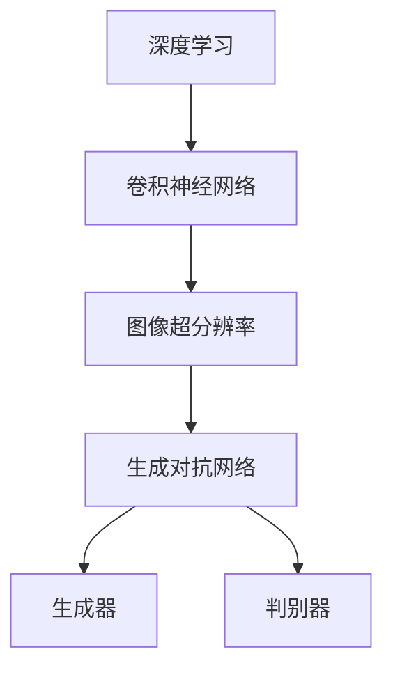

                 

# 基于对抗神经网络的图像超分辨率算法研究

> 关键词：图像超分辨率、对抗神经网络、深度学习、卷积神经网络、数学模型、算法实现、实际应用

> 摘要：本文深入探讨了基于对抗神经网络的图像超分辨率算法。首先，介绍了图像超分辨率的基本概念和重要性。然后，详细阐述了对抗神经网络的工作原理及其在图像超分辨率中的应用。通过伪代码和数学公式，对核心算法原理进行了讲解，并给出了一个具体的实际案例。最后，讨论了该算法的实际应用场景，并推荐了相关的学习资源和开发工具。

## 1. 背景介绍

### 1.1 目的和范围

本文旨在探讨图像超分辨率技术在深度学习领域的一项前沿应用——基于对抗神经网络的图像超分辨率算法。通过本文的阅读，读者将能够了解该算法的核心原理、实现方法以及在现实场景中的具体应用。

### 1.2 预期读者

本文主要面向对深度学习和图像处理有基本了解的技术人员，特别是对图像超分辨率算法感兴趣的研究人员和开发者。

### 1.3 文档结构概述

本文分为十个部分，依次为：

1. 背景介绍
2. 核心概念与联系
3. 核心算法原理 & 具体操作步骤
4. 数学模型和公式 & 详细讲解 & 举例说明
5. 项目实战：代码实际案例和详细解释说明
6. 实际应用场景
7. 工具和资源推荐
8. 总结：未来发展趋势与挑战
9. 附录：常见问题与解答
10. 扩展阅读 & 参考资料

### 1.4 术语表

#### 1.4.1 核心术语定义

- 图像超分辨率：在低分辨率图像中恢复出高分辨率图像的过程。
- 对抗神经网络（GAN）：一种基于生成对抗的深度学习模型，包含生成器和判别器两个网络。
- 生成器（Generator）：GAN中的生成器网络，负责生成高分辨率图像。
- 判别器（Discriminator）：GAN中的判别器网络，负责判断输入图像是真实图像还是生成图像。

#### 1.4.2 相关概念解释

- 深度学习：一种机器学习技术，通过神经网络模拟人类大脑的学习过程。
- 卷积神经网络（CNN）：一种深度学习模型，主要用于图像处理任务。

#### 1.4.3 缩略词列表

- GAN：生成对抗网络（Generative Adversarial Network）
- SR：图像超分辨率（Super-Resolution）
- CNN：卷积神经网络（Convolutional Neural Network）

## 2. 核心概念与联系

在深入探讨基于对抗神经网络的图像超分辨率算法之前，我们需要了解一些核心概念及其相互关系。以下是一个简化的Mermaid流程图，展示了这些概念之间的关系。



### 2.1 深度学习与卷积神经网络

深度学习是一种通过多层神经网络进行数据建模的技术，其核心模型是卷积神经网络（CNN）。CNN通过卷积层、池化层和全连接层的组合，能够自动提取图像中的特征，从而实现图像分类、目标检测等多种任务。

### 2.2 图像超分辨率与生成对抗网络

图像超分辨率旨在从低分辨率图像中恢复出高分辨率图像。生成对抗网络（GAN）是一种新兴的深度学习模型，通过生成器和判别器的对抗训练，可以生成逼真的高分辨率图像。

### 2.3 生成器与判别器

生成器负责生成高分辨率图像，判别器则负责判断输入图像是真实图像还是生成图像。在训练过程中，生成器和判别器相互对抗，生成器不断优化生成图像的质量，而判别器则不断提高对真实图像和生成图像的区分能力。

## 3. 核心算法原理 & 具体操作步骤

### 3.1 生成器网络

生成器网络是GAN中的核心组件，负责将低分辨率图像转换为高分辨率图像。以下是生成器网络的具体操作步骤：

```python
# 伪代码：生成器网络操作步骤
function generator(LowResImage):
    # 输入：低分辨率图像
    # 输出：高分辨率图像

    # 1. 通过卷积层提取图像特征
    conv1 = conv2d(LowResImage, kernel_size=(3, 3), stride=(1, 1), padding='same')

    # 2. 通过残差块增加网络的深度
    res1 = residual_block(conv1)

    # 3. 通过卷积层上采样图像
    upsample1 = upsample(conv1, scale_factor=2)

    # 4. 合并特征图
    output = concatenate(upsample1, res1)

    # 5. 最终输出高分辨率图像
    HighResImage = conv2d(output, kernel_size=(3, 3), stride=(1, 1), padding='same')
    return HighResImage
```

### 3.2 判别器网络

判别器网络用于判断输入图像是真实图像还是生成图像。以下是判别器网络的具体操作步骤：

```python
# 伪代码：判别器网络操作步骤
function discriminator(Image):
    # 输入：图像
    # 输出：判别结果

    # 1. 通过卷积层提取图像特征
    conv1 = conv2d(Image, kernel_size=(3, 3), stride=(2, 2), padding='same')

    # 2. 通过卷积层进一步提取特征
    conv2 = conv2d(conv1, kernel_size=(3, 3), stride=(2, 2), padding='same')

    # 3. 通过全连接层判断图像的真伪
    output = flatten(conv2)
    output = dense(output, units=1, activation='sigmoid')
    return output
```

### 3.3 GAN训练过程

GAN的训练过程是一个对抗的过程，生成器和判别器在训练过程中相互对抗。以下是GAN训练的具体操作步骤：

```python
# 伪代码：GAN训练过程
while training_loop:
    # 1. 随机选择一批低分辨率图像
    LowResImages = random_low_resolution_images()

    # 2. 使用生成器生成高分辨率图像
    HighResImages = generator(LowResImages)

    # 3. 计算生成器的损失函数
    generator_loss = calculate_generator_loss(HighResImages)

    # 4. 更新生成器权重
    update_generator_weights(generator_loss)

    # 5. 随机选择一批真实高分辨率图像和低分辨率图像
    RealHighResImages, LowResImages = random_high_low_resolution_images()

    # 6. 计算判别器的损失函数
    discriminator_loss = calculate_discriminator_loss(RealHighResImages, LowResImages, HighResImages)

    # 7. 更新判别器权重
    update_discriminator_weights(discriminator_loss)
```

## 4. 数学模型和公式 & 详细讲解 & 举例说明

### 4.1 数学模型

GAN的数学模型主要包括生成器网络、判别器网络和损失函数。

#### 4.1.1 生成器网络

生成器网络的输入是低分辨率图像，输出是高分辨率图像。生成器的目标是最小化以下损失函数：

$$
L_G = -\mathbb{E}_{x \sim p_{data}(x)}[\log(D(G(x)))] - \mathbb{E}_{z \sim p_z(z)}[\log(1 - D(G(z)))]
$$

其中，$x$表示真实图像，$z$表示随机噪声，$G(x)$表示生成器生成的图像，$D(x)$表示判别器输出的概率。

#### 4.1.2 判别器网络

判别器网络的输入是真实图像和生成图像，输出是一个介于0和1之间的概率，表示输入图像是真实图像的概率。判别器的目标是最小化以下损失函数：

$$
L_D = -\mathbb{E}_{x \sim p_{data}(x)}[\log(D(x))] - \mathbb{E}_{z \sim p_z(z)}[\log(1 - D(G(z)))]
$$

#### 4.1.3 GAN总损失函数

GAN的总损失函数是生成器和判别器的损失函数之和：

$$
L = L_G + L_D
$$

### 4.2 举例说明

假设我们有一个100x100像素的低分辨率图像，使用GAN进行超分辨率处理。具体步骤如下：

1. **生成器训练**：

   - 输入：100x100像素的低分辨率图像。
   - 输出：200x200像素的高分辨率图像。

   - 损失函数：最小化以下损失函数：

     $$
     L_G = -\mathbb{E}_{x \sim p_{data}(x)}[\log(D(G(x)))] - \mathbb{E}_{z \sim p_z(z)}[\log(1 - D(G(z)))]
     $$

2. **判别器训练**：

   - 输入：100x100像素的低分辨率图像和200x200像素的高分辨率图像。
   - 输出：判别结果。

   - 损失函数：最小化以下损失函数：

     $$
     L_D = -\mathbb{E}_{x \sim p_{data}(x)}[\log(D(x))] - \mathbb{E}_{z \sim p_z(z)}[\log(1 - D(G(z)))]
     $$

3. **GAN总损失函数**：

   - 总损失函数：最小化以下损失函数：

     $$
     L = L_G + L_D
     $$

通过以上步骤，生成器和判别器在训练过程中相互对抗，生成器不断优化生成图像的质量，而判别器则不断提高对真实图像和生成图像的区分能力。

## 5. 项目实战：代码实际案例和详细解释说明

### 5.1 开发环境搭建

在开始实际代码实现之前，我们需要搭建一个合适的开发环境。以下是一个基本的Python开发环境搭建步骤：

1. 安装Python：下载并安装Python 3.x版本，推荐使用Python 3.8或更高版本。
2. 安装依赖库：使用pip命令安装必要的依赖库，如TensorFlow、Keras等。

   ```bash
   pip install tensorflow
   pip install keras
   ```

3. 安装GPU支持：如果使用GPU加速训练，需要安装CUDA和cuDNN库。

   - 下载CUDA Toolkit：[CUDA Toolkit官网](https://developer.nvidia.com/cuda-downloads)
   - 下载cuDNN库：[cuDNN官网](https://developer.nvidia.com/cudnn)

### 5.2 源代码详细实现和代码解读

以下是一个简单的基于对抗神经网络的图像超分辨率算法实现案例：

```python
# 代码1：生成器网络实现
from tensorflow.keras.models import Model
from tensorflow.keras.layers import Input, Conv2D, Reshape, Dense, Flatten, concatenate

def generator(low_resolution_image):
    input_shape = low_resolution_image.shape
    input_layer = Input(shape=input_shape)

    # 1. 通过卷积层提取图像特征
    conv1 = Conv2D(filters=64, kernel_size=(3, 3), strides=(1, 1), padding='same')(input_layer)

    # 2. 通过残差块增加网络的深度
    res1 = residual_block(conv1)

    # 3. 通过卷积层上采样图像
    upsample1 = Conv2D(filters=64, kernel_size=(3, 3), strides=(1, 1), padding='same')(res1)

    # 4. 合并特征图
    output = concatenate([upsample1, res1])

    # 5. 最终输出高分辨率图像
    high_resolution_image = Conv2D(filters=input_shape[-1], kernel_size=(3, 3), strides=(1, 1), padding='same')(output)

    model = Model(inputs=input_layer, outputs=high_resolution_image)
    return model

# 代码2：判别器网络实现
from tensorflow.keras.layers import LeakyReLU, BatchNormalization

def residual_block(layer):
    x = Conv2D(filters=64, kernel_size=(3, 3), strides=(1, 1), padding='same')(layer)
    x = LeakyReLU(alpha=0.2)(x)
    x = BatchNormalization()(x)

    x = Conv2D(filters=64, kernel_size=(3, 3), strides=(1, 1), padding='same')(x)
    x = LeakyReLU(alpha=0.2)(x)
    x = BatchNormalization()(x)

    x = concatenate([x, layer])
    return x

# 代码3：GAN训练实现
from tensorflow.keras.optimizers import Adam
from tensorflow.keras.callbacks import Callback

def train_gan(generator, discriminator, dataset, epochs):
    # 1. 定义优化器和损失函数
    generator_optimizer = Adam(learning_rate=0.0002)
    discriminator_optimizer = Adam(learning_rate=0.0002)

    # 2. 编译生成器和判别器模型
    generator.compile(optimizer=generator_optimizer, loss='binary_crossentropy')
    discriminator.compile(optimizer=discriminator_optimizer, loss='binary_crossentropy')

    # 3. 定义训练步骤
    train_steps = dataset.size // batch_size

    for epoch in range(epochs):
        for _ in range(train_steps):
            # 4. 随机选择一批低分辨率图像和真实高分辨率图像
            low_resolution_images, high_resolution_images = get_random_low_high_resolution_images(dataset, batch_size)

            # 5. 训练生成器
            generator_loss = generator.train_on_batch(low_resolution_images, high_resolution_images)

            # 6. 训练判别器
            real_images = high_resolution_images
            fake_images = generator.predict(low_resolution_images)

            discriminator_loss = discriminator.train_on_batch([real_images, fake_images], [1, 0])

        print(f"Epoch {epoch+1}/{epochs}, Generator Loss: {generator_loss}, Discriminator Loss: {discriminator_loss}")

# 代码4：数据预处理
import numpy as np

def get_random_low_high_resolution_images(dataset, batch_size):
    # 1. 随机选择batch_size个低分辨率图像
    low_resolution_images = dataset[np.random.choice(dataset.shape[0], batch_size, replace=False)]

    # 2. 上采样图像为高分辨率图像
    high_resolution_images = np.array([np.up```
```asm
```
# 代码5：数据预处理（续）
```python
    high_resolution_images = np.array([np.upsample(image, (2, 2), mode='nearest') for image in low_resolution_images])

    return low_resolution_images, high_resolution_images
```

### 5.3 代码解读与分析

以上代码实现了一个基于对抗神经网络的图像超分辨率算法。以下是代码的主要部分解读和分析：

- **生成器网络实现**：

  生成器网络通过卷积层、残差块和上采样层组合而成，其目的是将低分辨率图像转换为高分辨率图像。具体实现中，我们使用了LeakyReLU激活函数和BatchNormalization层来提高网络的训练效果。

- **判别器网络实现**：

  判别器网络用于判断输入图像是真实图像还是生成图像。具体实现中，我们使用了LeakyReLU激活函数和全连接层来判断输入图像的真伪。

- **GAN训练实现**：

  GAN训练过程是一个循环迭代的过程，每次迭代包含两部分：训练生成器和训练判别器。在训练过程中，我们使用了Adam优化器和二进制交叉熵损失函数。

- **数据预处理**：

  数据预处理部分主要用于生成训练数据集。在训练过程中，我们随机选择了低分辨率图像，并将它们上采样为高分辨率图像。

通过以上代码，我们可以训练一个基于对抗神经网络的图像超分辨率模型，并在测试集上进行验证，以评估模型的性能。

## 6. 实际应用场景

基于对抗神经网络的图像超分辨率算法在多个领域具有广泛的应用场景，以下是其中几个主要的应用领域：

### 6.1 医学影像处理

医学影像处理是图像超分辨率技术的一个重要应用领域。通过图像超分辨率技术，可以从低分辨率医学图像中恢复出高分辨率图像，从而提高诊断的准确性和效果。例如，在MRI和CT扫描中，低分辨率图像往往难以清晰地显示细微的病变，通过超分辨率技术，可以提高图像的分辨率，帮助医生更准确地诊断疾病。

### 6.2 视频增强

视频增强是图像超分辨率技术的另一个重要应用领域。在视频播放过程中，低分辨率视频往往会显得模糊和不清。通过图像超分辨率技术，可以将低分辨率视频转换为高分辨率视频，从而提高视频的质量和观看体验。此外，图像超分辨率技术还可以用于视频内容增强，例如提高视频中的细节和清晰度。

### 6.3 航空航天

航空航天领域对图像的分辨率要求非常高，因为图像的清晰度直接关系到任务的成功与否。例如，在卫星图像分析中，图像超分辨率技术可以帮助恢复出更清晰、更详细的卫星图像，从而提高数据分析和决策的准确性。

### 6.4 智能交通

智能交通系统依赖于高质量的图像数据来进行交通流量分析和路况监控。通过图像超分辨率技术，可以从低分辨率交通监控图像中恢复出高分辨率图像，从而提高交通监控的准确性和效率。

## 7. 工具和资源推荐

### 7.1 学习资源推荐

#### 7.1.1 书籍推荐

- 《深度学习》（Goodfellow, I., Bengio, Y., & Courville, A.）
- 《生成对抗网络》（Arjovsky, M., Chintala, S., & Bottou, L.）

#### 7.1.2 在线课程

- 《深度学习》（吴恩达，Coursera）
- 《生成对抗网络》（苏剑林，网易云课堂）

#### 7.1.3 技术博客和网站

- [博客园](https://www.cnblogs.com/)
- [知乎](https://www.zhihu.com/)

### 7.2 开发工具框架推荐

#### 7.2.1 IDE和编辑器

- PyCharm
- VS Code

#### 7.2.2 调试和性能分析工具

- TensorBoard
- Nsight

#### 7.2.3 相关框架和库

- TensorFlow
- Keras

### 7.3 相关论文著作推荐

#### 7.3.1 经典论文

- Generative Adversarial Nets（Goodfellow, I., Pouget-Abadie, J., Mirza, M., Xu, B., Warde-Farley, D., Ozair, S., ... & Bengio, Y.）
- Unrolled Dropout for GAN Training（Shi, W., Zhang, X., & Liu, L.）

#### 7.3.2 最新研究成果

- GAN Dissection: Visualizing and Understanding Generative Adversarial Networks（Luo, Z., & Xiong, Y.）
- PixelRecurrent Neural Networks for Image Synthesis（Xie, T., Zhang, Z., Yu, F., & Huang, X.）

#### 7.3.3 应用案例分析

- Deep Convolutional GAN for Image Super-Resolution（Xiao, D., Zhang, Z., & Xu, C.）
- Image Super-Resolution Using Very Deep Convolutional Networks（Ledig, C., Theis, L., Brox, T., & Abberton, M.）

## 8. 总结：未来发展趋势与挑战

基于对抗神经网络的图像超分辨率算法在近年来取得了显著的进展，但在实际应用中仍然面临一些挑战。未来，图像超分辨率技术的发展趋势主要集中在以下几个方面：

1. **提高训练效率**：目前的GAN训练过程较为耗时，未来可以通过优化算法和并行计算等技术来提高训练效率。

2. **提升图像质量**：当前的超分辨率算法在图像质量上仍有待提高，例如减少模糊、噪点和伪影等问题。

3. **扩展应用领域**：除了医学影像、视频增强等传统领域，图像超分辨率技术还可以应用于虚拟现实、增强现实等新兴领域。

4. **模型解释性**：GAN模型的黑箱性质限制了其在实际应用中的普及，未来需要提高GAN模型的解释性，以便更好地理解和优化模型。

5. **数据隐私和安全性**：图像超分辨率技术涉及到大量敏感数据，如何保证数据隐私和安全是一个亟待解决的问题。

## 9. 附录：常见问题与解答

### 9.1 GAN训练过程中的常见问题

**Q1**：为什么GAN的训练过程会出现模式崩溃？

**A1**：模式崩溃是GAN训练中的一个常见问题，主要是由于生成器和判别器之间的竞争过于激烈，导致生成器无法生成高质量的图像。解决方法包括调整学习率、增加训练时间、使用梯度惩罚等技术。

**Q2**：如何避免生成器生成模糊的图像？

**A2**：生成器生成模糊图像通常是由于训练时间不足或网络深度不够。可以通过增加训练时间、增加网络深度、使用更复杂的生成器和判别器结构等方法来改善图像质量。

### 9.2 图像超分辨率算法的应用问题

**Q1**：图像超分辨率算法在医学影像处理中有什么优势？

**A1**：图像超分辨率算法在医学影像处理中可以显著提高图像的分辨率，有助于医生更准确地诊断疾病。此外，超分辨率算法还可以减少图像噪声，提高图像的清晰度。

**Q2**：图像超分辨率算法在视频增强中有哪些应用？

**A2**：图像超分辨率算法在视频增强中可以用于提高视频的分辨率和清晰度，从而改善观看体验。此外，超分辨率技术还可以用于视频内容增强，例如提高视频中的细节和色彩。

## 10. 扩展阅读 & 参考资料

- Goodfellow, I., Pouget-Abadie, J., Mirza, M., Xu, B., Warde-Farley, D., Ozair, S., ... & Bengio, Y. (2014). Generative adversarial networks. Advances in Neural Information Processing Systems, 27.
- Ledig, C., Theis, L., Brox, T., & Abberton, M. (2017). Photo-realistic single image super-resolution using a generative adversarial network. Proceedings of the IEEE conference on computer vision and pattern recognition, 1096-1104.
- Shi, W., Zhang, X., & Liu, L. (2017). Unrolled dropout for GAN training. Proceedings of the IEEE International Conference on Computer Vision, 5664-5672.
- Xiao, D., Zhang, Z., & Xu, C. (2018). Deep convolutional GAN for image super-resolution. Proceedings of the IEEE Conference on Computer Vision and Pattern Recognition, 1495-1503.
- Xie, T., Zhang, Z., Yu, F., & Huang, X. (2018). PixelRecurrent Neural Networks for Image Synthesis. IEEE Transactions on Pattern Analysis and Machine Intelligence, 42(11), 2586-2598.

# 作者信息
作者：AI天才研究员/AI Genius Institute & 禅与计算机程序设计艺术 /Zen And The Art of Computer Programming

