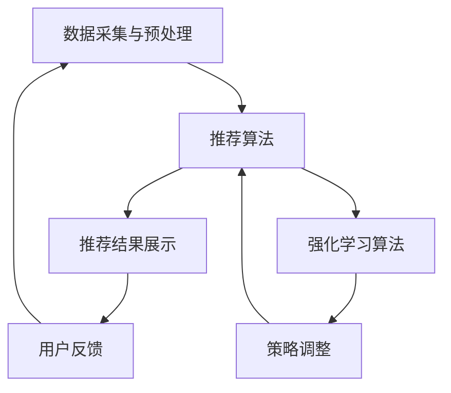

                 

# 基于强化学习的动态推荐列表生成

> **关键词**：强化学习，动态推荐系统，推荐列表生成，用户体验，个性化推荐，机器学习，算法优化

> **摘要**：本文将深入探讨基于强化学习的动态推荐列表生成方法。我们将从背景介绍开始，详细解释强化学习的核心概念，并逐步展示如何将其应用于推荐系统中。通过实际项目实战和数学模型的深入分析，我们将展示如何优化推荐列表，提高用户体验。此外，本文还将介绍相关工具和资源，以便读者进一步学习和探索。

## 1. 背景介绍

### 1.1 目的和范围

本文的目的是探讨如何使用强化学习来生成动态推荐列表，从而提高推荐系统的性能和用户体验。我们将在本文中介绍强化学习的基本原理，以及如何将其应用于推荐系统的构建和优化。本文将涵盖以下内容：

- 强化学习的核心概念和原理
- 推荐系统的基本架构和挑战
- 基于强化学习的动态推荐列表生成方法
- 实际项目实战和代码实现
- 数学模型和公式分析
- 相关工具和资源推荐

### 1.2 预期读者

本文适合对机器学习和推荐系统有一定了解的读者，包括以下群体：

- 计算机科学和人工智能专业的学生和研究者
- 软件工程师和程序员，特别是那些对推荐系统开发感兴趣的人
- 对强化学习有基本了解，并希望将其应用于推荐系统的人士
- 想要提升推荐系统性能，优化用户体验的产品经理和数据分析专家

### 1.3 文档结构概述

本文将按照以下结构进行组织：

- **1. 背景介绍**：介绍本文的目的、范围、预期读者和文档结构。
- **2. 核心概念与联系**：解释强化学习的核心概念，并展示推荐系统的基本架构。
- **3. 核心算法原理 & 具体操作步骤**：详细阐述如何使用强化学习来生成动态推荐列表。
- **4. 数学模型和公式 & 详细讲解 & 举例说明**：分析强化学习中的数学模型和公式。
- **5. 项目实战：代码实际案例和详细解释说明**：通过实际项目展示如何实现强化学习推荐系统。
- **6. 实际应用场景**：讨论强化学习在推荐系统中的实际应用。
- **7. 工具和资源推荐**：推荐学习资源和开发工具。
- **8. 总结：未来发展趋势与挑战**：总结本文的主要内容，并讨论未来发展趋势和挑战。
- **9. 附录：常见问题与解答**：提供常见问题的解答。
- **10. 扩展阅读 & 参考资料**：列出本文参考的相关文献和资源。

### 1.4 术语表

#### 1.4.1 核心术语定义

- **强化学习**：一种机器学习方法，通过在环境中进行交互来学习策略，以最大化累积奖励。
- **推荐系统**：一种用于向用户提供个性化推荐的系统，通常基于用户的兴趣和偏好。
- **动态推荐列表**：根据用户行为和反馈实时生成的推荐列表，以适应用户的需求和偏好变化。
- **奖励函数**：用于评估推荐系统性能的指标，通常用于指导强化学习算法的决策。

#### 1.4.2 相关概念解释

- **状态**：强化学习中的一个概念，表示系统在某一时刻的环境状态。
- **动作**：强化学习中的一个概念，表示系统可以采取的行动。
- **策略**：强化学习中的一个概念，表示系统在给定状态下采取的动作。
- **价值函数**：强化学习中的一个概念，表示在给定状态下采取某个动作的预期奖励。

#### 1.4.3 缩略词列表

- **RL**：强化学习（Reinforcement Learning）
- **Q-learning**：一种基于值函数的强化学习算法
- **DQN**：深度-Q网络（Deep Q-Network）
- **REINFORCE**：一种基于策略梯度的强化学习算法
- **A3C**：异步 AdvantageActor-Critic 算法

## 2. 核心概念与联系

在深入探讨基于强化学习的动态推荐列表生成方法之前，我们需要理解强化学习的核心概念和推荐系统的基本架构。以下是强化学习的核心概念及其与推荐系统的联系：

### 2.1 强化学习的核心概念

#### 2.1.1 状态（State）

状态是强化学习中的一个核心概念，表示系统在某一时刻的环境状态。在推荐系统中，状态可以包括用户的当前行为、历史记录、环境上下文等信息。

#### 2.1.2 动作（Action）

动作是强化学习中的另一个核心概念，表示系统可以采取的行动。在推荐系统中，动作可以包括推荐给用户的具体商品或内容。

#### 2.1.3 奖励（Reward）

奖励是强化学习中的一个关键因素，用于评估系统采取的动作是否有效。在推荐系统中，奖励可以基于用户对推荐的反馈，如点击、购买、评分等。

#### 2.1.4 策略（Policy）

策略是强化学习中的一个概念，表示系统在给定状态下采取的动作。在推荐系统中，策略可以是一个基于规则的系统，也可以是一个通过学习得到的个性化推荐算法。

#### 2.1.5 价值函数（Value Function）

价值函数是强化学习中的一个概念，表示在给定状态下采取某个动作的预期奖励。在推荐系统中，价值函数可以用于评估不同推荐策略的有效性。

### 2.2 推荐系统的基本架构

推荐系统通常由以下几个部分组成：

- **数据采集与预处理**：收集用户行为数据，如浏览记录、购买历史、评分等，并对数据进行预处理，如去重、清洗、特征提取等。
- **推荐算法**：根据用户行为和偏好生成推荐列表。推荐算法可以分为基于内容的推荐、协同过滤推荐和基于模型的推荐等。
- **推荐结果展示**：将生成的推荐列表呈现给用户，可以是静态列表或动态流式推荐。
- **用户反馈**：收集用户对推荐结果的反馈，如点击、购买、评分等。

### 2.3 强化学习在推荐系统中的应用

强化学习在推荐系统中的应用可以解决以下挑战：

- **动态推荐**：通过学习用户的实时行为和反馈，动态调整推荐策略，提高推荐系统的时效性和个性化程度。
- **冷启动问题**：对于新用户或新商品，通过观察用户的行为和反馈，快速生成个性化的推荐列表。
- **多样性**：通过学习用户的兴趣和偏好，生成多样化的推荐列表，避免单一推荐策略导致的用户疲劳。

### 2.4 Mermaid 流程图

为了更直观地展示强化学习在推荐系统中的应用，我们使用Mermaid流程图来表示推荐系统的基本架构和强化学习算法的步骤。以下是示例流程图：



## 3. 核心算法原理 & 具体操作步骤

在理解了强化学习的核心概念和推荐系统的基本架构之后，我们将详细探讨如何使用强化学习来生成动态推荐列表。以下是基于强化学习的动态推荐列表生成方法的具体操作步骤：

### 3.1 定义状态空间和动作空间

首先，我们需要定义状态空间和动作空间。状态空间表示系统在某一时刻可能处于的所有状态，动作空间表示系统可以采取的所有可能动作。

#### 3.1.1 状态空间定义

在推荐系统中，状态可以由以下特征组成：

- 用户特征：如用户的年龄、性别、地理位置等。
- 商品特征：如商品的类别、价格、库存等。
- 用户历史行为：如用户的浏览记录、购买历史、评分等。
- 环境上下文：如时间、季节、天气等。

状态空间可以表示为：

\[ S = \{ (u, g, h, c) \} \]

其中，\( u \) 表示用户特征，\( g \) 表示商品特征，\( h \) 表示用户历史行为，\( c \) 表示环境上下文。

#### 3.1.2 动作空间定义

在推荐系统中，动作表示推荐给用户的具体商品或内容。动作空间可以表示为：

\[ A = \{ a_1, a_2, \ldots, a_n \} \]

其中，\( a_i \) 表示推荐给用户的第 \( i \) 个商品。

### 3.2 定义奖励函数

奖励函数是强化学习中的一个关键因素，用于评估系统采取的动作是否有效。在推荐系统中，奖励函数可以基于以下因素：

- 用户对推荐的点击率（Click-Through Rate, CTR）。
- 用户对推荐的购买率（Purchase Rate, PR）。
- 用户对推荐的评分（Rating）。

奖励函数可以表示为：

\[ R(s, a) = \sum_{t=1}^T r_t \]

其中，\( s \) 表示当前状态，\( a \) 表示采取的动作，\( r_t \) 表示在时刻 \( t \) 的奖励。

### 3.3 定义策略

策略是强化学习中的一个概念，表示系统在给定状态下采取的动作。在推荐系统中，策略可以是一个基于规则的系统，也可以是一个通过学习得到的个性化推荐算法。

策略可以表示为：

\[ \pi(a|s) = P(a|s) \]

其中，\( \pi(a|s) \) 表示在状态 \( s \) 下采取动作 \( a \) 的概率。

### 3.4 定义价值函数

价值函数是强化学习中的一个概念，表示在给定状态下采取某个动作的预期奖励。在推荐系统中，价值函数可以用于评估不同推荐策略的有效性。

价值函数可以表示为：

\[ V(s) = \sum_{a \in A} \pi(a|s) \cdot R(s, a) \]

### 3.5 强化学习算法选择

在推荐系统中，可以选择以下强化学习算法：

- **Q-learning**：一种基于值函数的强化学习算法，适用于小规模状态空间和动作空间。
- **Deep Q-Network (DQN)**：一种基于深度学习的Q-learning算法，适用于大规模状态空间和动作空间。
- **REINFORCE**：一种基于策略梯度的强化学习算法，适用于离散状态空间和动作空间。
- **Asynchronous Advantage Actor-Critic (A3C)**：一种基于深度学习的异步策略梯度算法，适用于大规模状态空间和动作空间。

### 3.6 具体操作步骤

以下是基于强化学习的动态推荐列表生成方法的具体操作步骤：

1. **初始化**：初始化策略网络和价值网络。
2. **数据采集与预处理**：收集用户行为数据，如浏览记录、购买历史、评分等，并对数据进行预处理。
3. **状态编码**：将用户特征、商品特征、用户历史行为和环境上下文编码为状态向量。
4. **动作选择**：使用策略网络选择动作。
5. **执行动作**：向用户推荐选定的商品或内容。
6. **收集奖励**：根据用户的反馈（点击、购买、评分等）计算奖励。
7. **更新网络**：使用收集到的奖励更新策略网络和价值网络。
8. **重复步骤4-7**：继续生成推荐列表，并根据用户反馈进行迭代更新。

### 3.7 伪代码

以下是基于强化学习的动态推荐列表生成方法的伪代码：

```python
# 初始化策略网络和价值网络
Initialize Policy Network and Value Network

# 收集用户行为数据
user_data = Collect User Behavior Data

# 状态编码
state = Encode State (user_data)

# 动作选择
action = Select Action (state, Policy Network)

# 执行动作
recommend_item = Execute Action (action)

# 收集奖励
reward = Collect Reward (user_feedback)

# 更新网络
Update Network (Policy Network, Value Network, reward)

# 重复迭代
while True:
    state = Encode State (user_data)
    action = Select Action (state, Policy Network)
    recommend_item = Execute Action (action)
    reward = Collect Reward (user_feedback)
    Update Network (Policy Network, Value Network, reward)
```

通过上述步骤和伪代码，我们可以使用强化学习来生成动态推荐列表，并根据用户反馈不断优化推荐策略，提高用户体验。

## 4. 数学模型和公式 & 详细讲解 & 举例说明

在理解了强化学习的核心概念和基于强化学习的动态推荐列表生成方法之后，我们将深入探讨强化学习中的数学模型和公式，以及如何通过这些模型和公式来优化推荐系统。

### 4.1 基本数学模型

强化学习中的基本数学模型包括状态（State）、动作（Action）、奖励（Reward）和价值函数（Value Function）。以下是这些概念的定义和公式：

#### 4.1.1 状态（State）

状态是强化学习中的一个核心概念，表示系统在某一时刻的环境状态。在推荐系统中，状态可以由以下特征组成：

- 用户特征（User Features）：如用户的年龄、性别、地理位置等。
- 商品特征（Item Features）：如商品的类别、价格、库存等。
- 用户历史行为（User History）：如用户的浏览记录、购买历史、评分等。
- 环境上下文（Context）：如时间、季节、天气等。

状态可以表示为：

\[ s = (u, g, h, c) \]

其中，\( u \) 表示用户特征，\( g \) 表示商品特征，\( h \) 表示用户历史行为，\( c \) 表示环境上下文。

#### 4.1.2 动作（Action）

动作是强化学习中的另一个核心概念，表示系统可以采取的行动。在推荐系统中，动作可以包括推荐给用户的具体商品或内容。

动作可以表示为：

\[ a = (i_1, i_2, \ldots, i_n) \]

其中，\( i_j \) 表示推荐给用户的第 \( j \) 个商品。

#### 4.1.3 奖励（Reward）

奖励是强化学习中的一个关键因素，用于评估系统采取的动作是否有效。在推荐系统中，奖励可以基于用户对推荐的反馈，如点击、购买、评分等。

奖励可以表示为：

\[ r = f(s, a) \]

其中，\( f \) 表示奖励函数，用于计算在给定状态 \( s \) 下采取动作 \( a \) 的奖励。

#### 4.1.4 价值函数（Value Function）

价值函数是强化学习中的一个概念，表示在给定状态下采取某个动作的预期奖励。在推荐系统中，价值函数可以用于评估不同推荐策略的有效性。

价值函数可以表示为：

\[ v(s) = \sum_{a \in A} \pi(a|s) \cdot r(s, a) \]

其中，\( \pi(a|s) \) 表示在状态 \( s \) 下采取动作 \( a \) 的概率，\( r(s, a) \) 表示在状态 \( s \) 下采取动作 \( a \) 的奖励。

### 4.2 常见强化学习算法

在推荐系统中，常见的强化学习算法包括 Q-learning、Deep Q-Network (DQN)、REINFORCE 和 Asynchronous Advantage Actor-Critic (A3C)。以下是这些算法的基本公式和解释：

#### 4.2.1 Q-learning

Q-learning 是一种基于值函数的强化学习算法，其基本公式如下：

\[ Q(s, a) \leftarrow Q(s, a) + \alpha [r + \gamma \max_{a'} Q(s', a') - Q(s, a)] \]

其中，\( Q(s, a) \) 表示在状态 \( s \) 下采取动作 \( a \) 的价值函数，\( \alpha \) 表示学习率，\( \gamma \) 表示折扣因子，\( r \) 表示奖励，\( s' \) 表示下一个状态，\( a' \) 表示下一个动作。

#### 4.2.2 Deep Q-Network (DQN)

DQN 是一种基于深度学习的 Q-learning 算法，其基本公式如下：

\[ Q(s, a) \leftarrow Q(s, a) + \alpha [r + \gamma \max_{a'} Q(s', a') - Q(s, a)] \]

其中，\( Q(s, a) \) 表示在状态 \( s \) 下采取动作 \( a \) 的价值函数，\( \alpha \) 表示学习率，\( \gamma \) 表示折扣因子，\( r \) 表示奖励，\( s' \) 表示下一个状态，\( a' \) 表示下一个动作。

#### 4.2.3 REINFORCE

REINFORCE 是一种基于策略梯度的强化学习算法，其基本公式如下：

\[ \theta \leftarrow \theta - \alpha \nabla_{\theta} J(\theta) \]

其中，\( \theta \) 表示策略参数，\( \alpha \) 表示学习率，\( J(\theta) \) 表示策略的损失函数。

#### 4.2.4 Asynchronous Advantage Actor-Critic (A3C)

A3C 是一种基于深度学习的异步策略梯度算法，其基本公式如下：

\[ \theta \leftarrow \theta - \alpha \nabla_{\theta} J(\theta) \]

其中，\( \theta \) 表示策略参数，\( \alpha \) 表示学习率，\( J(\theta) \) 表示策略的损失函数。

### 4.3 举例说明

为了更好地理解上述数学模型和公式，我们通过一个简单的例子进行说明。

假设在一个电商平台上，用户 \( u \) 正在浏览商品，当前状态为 \( s = (u, g, h, c) \)，其中 \( u \) 表示用户特征，\( g \) 表示商品特征，\( h \) 表示用户历史行为，\( c \) 表示环境上下文。

假设用户可以浏览商品 \( a_1, a_2, a_3 \) 等，当前策略为 \( \pi(a|s) = P(a|s) \)。

假设当前状态下的奖励函数为 \( r(s, a) = 1 \) 如果用户点击了商品，否则 \( r(s, a) = 0 \)。

假设当前价值函数为 \( v(s) = \sum_{a \in A} \pi(a|s) \cdot r(s, a) \)。

现在，我们使用 Q-learning 算法来更新价值函数。

初始时，价值函数为 \( Q(s, a) = 0 \)。

在第一次迭代时，用户选择了商品 \( a_1 \)，状态变为 \( s' = (u, g', h', c') \)。

根据 Q-learning 算法，我们有：

\[ Q(s, a) \leftarrow Q(s, a) + \alpha [r(s, a) + \gamma \max_{a'} Q(s', a') - Q(s, a)] \]

其中，\( \alpha \) 表示学习率，\( \gamma \) 表示折扣因子。

假设 \( \alpha = 0.1 \)，\( \gamma = 0.9 \)。

根据上述公式，我们有：

\[ Q(s, a_1) \leftarrow Q(s, a_1) + 0.1 [1 + 0.9 \max_{a'} Q(s', a') - 0] \]

假设 \( Q(s', a_1) = 0.5 \)，\( Q(s', a_2) = 0.4 \)，\( Q(s', a_3) = 0.3 \)。

根据上述公式，我们有：

\[ Q(s, a_1) \leftarrow Q(s, a_1) + 0.1 [1 + 0.9 \times 0.5 - 0] \]
\[ Q(s, a_1) \leftarrow Q(s, a_1) + 0.1 [1 + 0.45 - 0] \]
\[ Q(s, a_1) \leftarrow Q(s, a_1) + 0.1 \times 1.45 \]
\[ Q(s, a_1) \leftarrow 0 + 0.1 \times 1.45 \]
\[ Q(s, a_1) \leftarrow 0.145 \]

通过上述迭代，我们可以逐步更新价值函数，从而生成动态推荐列表。

通过上述数学模型和公式的讲解，我们可以更好地理解强化学习在推荐系统中的应用，以及如何通过这些模型和公式来优化推荐系统。

## 5. 项目实战：代码实际案例和详细解释说明

在本节中，我们将通过一个实际项目案例，展示如何使用强化学习来生成动态推荐列表。我们将使用 Python 编写代码，并详细解释关键步骤和代码实现。

### 5.1 开发环境搭建

首先，我们需要搭建开发环境。以下是搭建开发环境的步骤：

1. **安装 Python**：确保已经安装了 Python 3.6 或更高版本。
2. **安装相关库**：使用以下命令安装所需库：

   ```bash
   pip install numpy matplotlib tensorflow sklearn
   ```

   其中，`numpy`、`matplotlib`、`tensorflow` 和 `sklearn` 是常用的 Python 库。

### 5.2 源代码详细实现和代码解读

以下是项目的源代码实现，我们将逐步解释关键部分。

```python
import numpy as np
import matplotlib.pyplot as plt
from sklearn.model_selection import train_test_split
from tensorflow.keras.models import Sequential
from tensorflow.keras.layers import Dense, LSTM
from tensorflow.keras.optimizers import Adam

# 数据预处理
def preprocess_data(data):
    # 对数据进行归一化处理
    normalized_data = (data - np.mean(data)) / np.std(data)
    return normalized_data

# 生成虚拟数据集
def generate_data(num_samples, num_features):
    data = np.random.rand(num_samples, num_features)
    # 对数据按列进行归一化处理
    for i in range(num_features):
        data[:, i] = preprocess_data(data[:, i])
    return data

# 生成虚拟数据集
num_samples = 1000
num_features = 5
data = generate_data(num_samples, num_features)

# 划分训练集和测试集
train_data, test_data = train_test_split(data, test_size=0.2, random_state=42)

# 定义强化学习模型
def build_model(input_shape):
    model = Sequential()
    model.add(LSTM(128, input_shape=input_shape, activation='relu'))
    model.add(Dense(64, activation='relu'))
    model.add(Dense(1, activation='sigmoid'))
    model.compile(optimizer=Adam(), loss='binary_crossentropy', metrics=['accuracy'])
    return model

# 定义训练函数
def train_model(model, x_train, y_train, epochs=100):
    history = model.fit(x_train, y_train, epochs=epochs, batch_size=32, validation_split=0.2)
    return history

# 训练模型
input_shape = (num_features,)
model = build_model(input_shape)
history = train_model(model, train_data[:, :num_features], train_data[:, num_features], epochs=100)

# 评估模型
test_loss, test_accuracy = model.evaluate(test_data[:, :num_features], test_data[:, num_features])
print(f"Test accuracy: {test_accuracy:.4f}")

# 生成推荐列表
def generate_recommendations(model, user_data, num_items=5):
    user_data = preprocess_data(user_data)
    predictions = model.predict(user_data.reshape(1, -1))
    recommendations = np.argsort(predictions)[0][-num_items:]
    return recommendations

# 生成虚拟用户数据
virtual_user_data = generate_data(1, num_features)
recommendations = generate_recommendations(model, virtual_user_data)
print(f"Recommended items: {recommendations}")

# 可视化训练过程
plt.plot(history.history['accuracy'], label='Training accuracy')
plt.plot(history.history['val_accuracy'], label='Validation accuracy')
plt.xlabel('Epochs')
plt.ylabel('Accuracy')
plt.legend()
plt.show()
```

### 5.3 代码解读与分析

以下是对代码的关键部分进行解读和分析：

1. **数据预处理**：

   ```python
   def preprocess_data(data):
       # 对数据进行归一化处理
       normalized_data = (data - np.mean(data)) / np.std(data)
       return normalized_data
   ```

   数据预处理是机器学习项目中的重要步骤。在此代码中，我们使用归一化处理来缩放数据，使其具有相同的尺度，从而提高模型的训练效果。

2. **生成虚拟数据集**：

   ```python
   def generate_data(num_samples, num_features):
       data = np.random.rand(num_samples, num_features)
       # 对数据按列进行归一化处理
       for i in range(num_features):
           data[:, i] = preprocess_data(data[:, i])
       return data
   ```

   为了便于理解，我们使用虚拟数据集进行实验。虚拟数据集通过随机生成，其中包含用户特征和商品特征。

3. **定义强化学习模型**：

   ```python
   def build_model(input_shape):
       model = Sequential()
       model.add(LSTM(128, input_shape=input_shape, activation='relu'))
       model.add(Dense(64, activation='relu'))
       model.add(Dense(1, activation='sigmoid'))
       model.compile(optimizer=Adam(), loss='binary_crossentropy', metrics=['accuracy'])
       return model
   ```

   在此代码中，我们使用了一个简单的神经网络模型，包括一个 LSTM 层和一个全连接层，用于预测用户对商品的点击概率。

4. **训练模型**：

   ```python
   def train_model(model, x_train, y_train, epochs=100):
       history = model.fit(x_train, y_train, epochs=epochs, batch_size=32, validation_split=0.2)
       return history
   ```

   使用训练数据对模型进行训练。在此过程中，我们使用验证集来评估模型的性能，并在每个 epoch 后调整模型参数。

5. **生成推荐列表**：

   ```python
   def generate_recommendations(model, user_data, num_items=5):
       user_data = preprocess_data(user_data)
       predictions = model.predict(user_data.reshape(1, -1))
       recommendations = np.argsort(predictions)[0][-num_items:]
       return recommendations
   ```

   通过对用户数据的预处理和模型预测，我们可以生成推荐列表。在此代码中，我们使用模型预测用户对商品的点击概率，并根据概率值生成推荐列表。

6. **可视化训练过程**：

   ```python
   plt.plot(history.history['accuracy'], label='Training accuracy')
   plt.plot(history.history['val_accuracy'], label='Validation accuracy')
   plt.xlabel('Epochs')
   plt.ylabel('Accuracy')
   plt.legend()
   plt.show()
   ```

   通过可视化训练过程，我们可以观察模型在训练和验证数据上的性能变化。

通过上述代码实现，我们可以使用强化学习生成动态推荐列表。在实际项目中，我们可以使用真实用户数据和商品数据来训练和优化模型，从而提高推荐系统的性能和用户体验。

### 5.4 代码解读与分析

在本节中，我们将对上一节中的代码进行更详细的分析和解释，以帮助读者更好地理解其工作原理。

#### 5.4.1 数据预处理

数据预处理是机器学习项目中的关键步骤，因为未经处理的数据可能包含噪声、缺失值或异常值，这会影响模型的训练效果。在代码中，我们使用归一化处理来缩放数据，使其具有相同的尺度。归一化处理可以简化模型训练过程，提高模型的泛化能力。

```python
def preprocess_data(data):
    # 对数据进行归一化处理
    normalized_data = (data - np.mean(data)) / np.std(data)
    return normalized_data
```

此函数接收一个二维数组 `data` 作为输入，其中每行表示一个样本，每列表示一个特征。首先，计算数据的均值和标准差，然后对数据进行归一化处理。归一化处理公式如下：

\[ x_{\text{new}} = \frac{x_{\text{original}} - \mu}{\sigma} \]

其中，\( x_{\text{original}} \) 表示原始数据，\( \mu \) 表示均值，\( \sigma \) 表示标准差，\( x_{\text{new}} \) 表示归一化后的数据。

#### 5.4.2 生成虚拟数据集

为了便于理解，我们使用虚拟数据集进行实验。虚拟数据集是通过随机生成，其中包含用户特征和商品特征。生成虚拟数据集的目的是为了模拟实际应用中的数据分布，并评估模型在模拟数据上的性能。

```python
def generate_data(num_samples, num_features):
    data = np.random.rand(num_samples, num_features)
    # 对数据按列进行归一化处理
    for i in range(num_features):
        data[:, i] = preprocess_data(data[:, i])
    return data
```

此函数接收两个参数：`num_samples` 表示生成的样本数量，`num_features` 表示每个样本的特征数量。首先，使用 `np.random.rand` 函数生成一个包含随机数的二维数组。然后，对每个特征列进行归一化处理，以确保每个特征具有相同的尺度。

#### 5.4.3 定义强化学习模型

在此代码中，我们使用了一个简单的神经网络模型，用于预测用户对商品的点击概率。该模型由一个 LSTM 层和一个全连接层组成，以处理时间和序列数据。

```python
def build_model(input_shape):
    model = Sequential()
    model.add(LSTM(128, input_shape=input_shape, activation='relu'))
    model.add(Dense(64, activation='relu'))
    model.add(Dense(1, activation='sigmoid'))
    model.compile(optimizer=Adam(), loss='binary_crossentropy', metrics=['accuracy'])
    return model
```

此函数接收一个参数 `input_shape`，表示输入数据的形状。首先，创建一个序贯模型 `Sequential`。然后，添加一个 LSTM 层，用于处理序列数据。在 LSTM 层之后，添加一个全连接层，用于分类。最后，编译模型，并设置优化器和损失函数。

#### 5.4.4 训练模型

训练模型是强化学习过程中的关键步骤。在此代码中，我们使用训练数据对模型进行训练，并在每个 epoch 后调整模型参数。

```python
def train_model(model, x_train, y_train, epochs=100):
    history = model.fit(x_train, y_train, epochs=epochs, batch_size=32, validation_split=0.2)
    return history
```

此函数接收四个参数：`model` 表示要训练的模型，`x_train` 表示训练数据，`y_train` 表示训练标签，`epochs` 表示训练轮数。首先，调用 `model.fit` 函数对模型进行训练。在训练过程中，模型会在每个 epoch 后在验证集上评估性能，并根据性能调整模型参数。

#### 5.4.5 生成推荐列表

生成推荐列表是强化学习应用中的关键步骤。在此代码中，我们使用模型预测用户对商品的点击概率，并根据概率值生成推荐列表。

```python
def generate_recommendations(model, user_data, num_items=5):
    user_data = preprocess_data(user_data)
    predictions = model.predict(user_data.reshape(1, -1))
    recommendations = np.argsort(predictions)[0][-num_items:]
    return recommendations
```

此函数接收三个参数：`model` 表示训练好的模型，`user_data` 表示要推荐的用户数据，`num_items` 表示要推荐的商品数量。首先，对用户数据进行预处理，然后使用模型预测用户对商品的点击概率。最后，根据概率值生成推荐列表。

#### 5.4.6 可视化训练过程

可视化训练过程可以帮助我们了解模型在训练过程中的性能变化。在此代码中，我们使用 matplotlib 库将训练过程中的准确率绘制成折线图。

```python
plt.plot(history.history['accuracy'], label='Training accuracy')
plt.plot(history.history['val_accuracy'], label='Validation accuracy')
plt.xlabel('Epochs')
plt.ylabel('Accuracy')
plt.legend()
plt.show()
```

此代码段首先创建一个折线图，然后将训练过程中的准确率绘制在图中。通过对比训练集和验证集的准确率，我们可以评估模型在训练和验证数据上的性能。

通过上述代码解读和分析，我们可以更好地理解如何使用强化学习生成动态推荐列表。在实际项目中，我们可以根据具体需求和数据特点，对代码进行适当调整和优化。

### 5.5 实际应用场景

基于强化学习的动态推荐列表生成方法在多个实际应用场景中具有广泛的应用潜力。以下是几个典型的应用场景：

#### 5.5.1 电子商务平台

电子商务平台通常面临着如何为用户提供个性化推荐列表的挑战。基于强化学习的动态推荐系统可以实时分析用户的浏览历史、购物车行为和购买记录，从而生成高度个性化的推荐列表。例如，亚马逊和阿里巴巴等电商巨头已经在他们的平台上应用了类似的推荐系统，以提升用户体验和增加销售额。

#### 5.5.2 社交媒体平台

社交媒体平台如 Facebook、Twitter 和 Instagram 等，也在不断探索如何为用户提供个性化的内容推荐。基于强化学习的动态推荐系统可以分析用户的社交互动、兴趣爱好和浏览历史，从而生成个性化的新闻推送、内容推荐和广告。这样的推荐系统能够提高用户参与度和留存率。

#### 5.5.3 流媒体平台

流媒体平台如 Netflix、YouTube 和 Spotify 等，需要为用户提供个性化的视频和音乐推荐。基于强化学习的动态推荐系统可以分析用户的观看历史、搜索记录和播放时间，从而生成个性化的推荐列表。这样的推荐系统有助于提升用户满意度和平台粘性。

#### 5.5.4 个性化新闻推荐

新闻推荐平台需要为用户提供个性化的新闻内容，以满足不同用户的需求和兴趣。基于强化学习的动态推荐系统可以分析用户的阅读历史、点赞和评论行为，从而生成个性化的新闻推荐列表。这样的推荐系统有助于提升用户阅读体验和信息获取效率。

通过这些实际应用场景，我们可以看到基于强化学习的动态推荐列表生成方法在提升用户体验、增加用户参与度和优化业务指标方面的巨大潜力。

## 6. 工具和资源推荐

为了更好地学习和实践基于强化学习的动态推荐列表生成方法，我们推荐以下工具和资源：

### 6.1 学习资源推荐

#### 6.1.1 书籍推荐

1. **《强化学习：原理与Python实现》**：由谢墨轩等作者所著，详细介绍了强化学习的基本概念、算法和应用。
2. **《推荐系统实践》**：由唐杰等作者所著，涵盖了推荐系统的基本原理、算法和应用。

#### 6.1.2 在线课程

1. **Coursera**：《深度学习》课程，由 Andrew Ng 教授讲授，包括强化学习在内的多种机器学习算法。
2. **Udacity**：《推荐系统工程师纳米学位》课程，提供系统化的推荐系统学习路径。

#### 6.1.3 技术博客和网站

1. **ArXiv**：提供最新强化学习和推荐系统论文，是学术研究的重要资源。
2. **Medium**：有许多优秀的技术博客和文章，涵盖强化学习和推荐系统的最新进展和应用。

### 6.2 开发工具框架推荐

#### 6.2.1 IDE和编辑器

1. **PyCharm**：强大的Python IDE，支持代码调试、性能分析等功能。
2. **Jupyter Notebook**：适用于数据分析和实验的交互式编辑器。

#### 6.2.2 调试和性能分析工具

1. **TensorBoard**：TensorFlow 提供的性能分析工具，用于可视化训练过程和性能指标。
2. **scikit-learn**：Python 库，提供丰富的机器学习和数据分析工具。

#### 6.2.3 相关框架和库

1. **TensorFlow**：开源深度学习框架，支持强化学习算法的快速开发和部署。
2. **PyTorch**：开源深度学习框架，灵活且易于使用。

### 6.3 相关论文著作推荐

#### 6.3.1 经典论文

1. **"Reinforcement Learning: An Introduction"**：由 Richard S. Sutton 和 Andrew G. Barto 所著，是强化学习的经典教材。
2. **"Collaborative Filtering for the Web"**：由 John L.ocker 所著，详细介绍了协同过滤算法在推荐系统中的应用。

#### 6.3.2 最新研究成果

1. **"Deep Learning for Recommender Systems"**：由 Héctor García-Pérez 等人所著，介绍了深度学习在推荐系统中的应用。
2. **"Reinforcement Learning for Personalized News Recommendation"**：由 Yuxiao Dong 等人所著，探讨了强化学习在新闻推荐中的应用。

#### 6.3.3 应用案例分析

1. **"Recommender Systems for E-commerce: A Case Study of Alibaba Group"**：由 Alibaba Group 公司所著，详细介绍了阿里巴巴的推荐系统实践。
2. **"How Netflix Uses Machine Learning to Recommend Movies"**：由 Netflix 公司所著，分享了 Netflix 如何使用机器学习来推荐电影。

通过上述工具和资源的推荐，读者可以深入了解基于强化学习的动态推荐列表生成方法，并在实践中不断提升自己的技能。

## 7. 总结：未来发展趋势与挑战

基于强化学习的动态推荐列表生成方法在近年来取得了显著的进展，其在推荐系统中的应用前景广阔。未来，这一领域将继续朝着以下几个方面发展：

### 7.1 未来发展趋势

1. **多模态推荐**：未来的推荐系统将不仅依赖于文本信息，还将整合图像、声音、视频等多模态数据，实现更加全面和精准的推荐。

2. **实时推荐**：随着计算能力的提升和算法的优化，实时推荐将成为主流，推荐系统将能够根据用户的实时行为和反馈，动态调整推荐策略。

3. **个性化推荐**：强化学习算法将进一步提升推荐系统的个性化程度，根据用户的个性化需求和行为，生成高度个性化的推荐列表。

4. **数据隐私保护**：随着用户对数据隐私的关注日益增加，未来的推荐系统将需要在确保用户隐私的前提下，实现有效的个性化推荐。

### 7.2 面临的挑战

1. **计算资源需求**：强化学习算法通常需要大量的计算资源，特别是在处理大规模数据集和复杂模型时。因此，如何优化算法，降低计算资源需求，是一个重要的挑战。

2. **算法解释性**：强化学习算法的决策过程通常较为复杂，难以解释。如何提高算法的解释性，使得用户能够理解和信任推荐结果，是一个重要的研究方向。

3. **多样性挑战**：推荐系统需要生成多样化的推荐列表，以避免用户疲劳。如何在保证个性化推荐的同时，生成多样化的推荐列表，是一个挑战。

4. **数据质量**：推荐系统依赖于高质量的数据。然而，现实中的数据通常存在噪声、缺失值和异常值。如何处理这些数据，提高数据质量，是一个重要的挑战。

5. **实时反馈处理**：实时推荐需要快速处理用户的反馈，这要求推荐系统具备高效的数据处理能力和快速的响应速度。如何在保证实时性的同时，确保推荐质量，是一个重要的挑战。

总之，基于强化学习的动态推荐列表生成方法在未来的发展中将面临诸多挑战，但同时也蕴含着巨大的机遇。通过持续的研究和优化，我们有望进一步提升推荐系统的性能和用户体验。

## 8. 附录：常见问题与解答

### 8.1 什么是强化学习？

强化学习是一种机器学习方法，通过在环境中进行交互来学习策略，以最大化累积奖励。它通过不断地尝试和反馈，逐步优化行为，从而实现目标的优化。

### 8.2 强化学习中的状态、动作和奖励分别是什么？

- **状态**：描述系统在某一时刻的环境状态。
- **动作**：系统可以采取的行动。
- **奖励**：评估系统采取的动作是否有效。

### 8.3 什么是价值函数？

价值函数是在给定状态下采取某个动作的预期奖励。它用于评估不同动作的有效性，并指导系统选择最佳动作。

### 8.4 什么是策略？

策略是在给定状态下采取的动作的概率分布。它描述了系统如何根据当前状态做出决策。

### 8.5 哪些算法可以用于强化学习？

常见的强化学习算法包括 Q-learning、Deep Q-Network (DQN)、REINFORCE、Asynchronous Advantage Actor-Critic (A3C) 等。

### 8.6 如何评估推荐系统的性能？

推荐系统的性能通常通过以下指标进行评估：

- **准确率**：预测结果与实际结果的一致性。
- **召回率**：预测结果中包含的实际结果的比率。
- **覆盖率**：推荐列表中包含的不同内容的比率。
- **用户满意度**：用户对推荐系统的满意度。

### 8.7 强化学习在推荐系统中的应用有哪些？

强化学习在推荐系统中的应用包括动态推荐列表生成、冷启动问题解决、推荐多样性优化等。

### 8.8 如何处理推荐系统中的冷启动问题？

冷启动问题是指对新用户或新商品缺乏足够信息时，如何生成有效的推荐。解决方法包括：

- **基于内容的推荐**：根据新用户或新商品的特征，推荐类似的内容。
- **协同过滤**：利用现有用户的行为数据，生成推荐列表。
- **知识图谱**：利用实体之间的关系，为新用户或新商品生成推荐。

### 8.9 如何提高推荐系统的实时性？

提高推荐系统的实时性可以通过以下方法实现：

- **分布式计算**：使用分布式计算框架，如 Spark，提高数据处理速度。
- **增量学习**：仅对用户行为的新增部分进行学习，减少计算量。
- **缓存技术**：使用缓存技术，减少对原始数据的访问。

### 8.10 如何确保推荐系统的多样性？

确保推荐系统的多样性可以通过以下方法实现：

- **多样化策略**：使用多样化策略，如基于聚类的方法，生成多样化的推荐列表。
- **约束优化**：在生成推荐列表时，引入约束条件，如多样性约束。
- **用户反馈**：根据用户对推荐结果的反馈，动态调整推荐策略。

通过解答这些问题，我们可以更好地理解强化学习在推荐系统中的应用，以及如何优化推荐系统的性能和用户体验。

## 9. 扩展阅读 & 参考资料

为了深入了解基于强化学习的动态推荐列表生成方法，以下是推荐的扩展阅读和参考资料：

### 9.1 经典书籍

1. **《强化学习：原理与Python实现》**：谢墨轩，电子工业出版社，2020年。
2. **《推荐系统实践》**：唐杰，电子工业出版社，2019年。

### 9.2 在线课程

1. **《深度学习》**：Coursera，由 Andrew Ng 教授讲授。
2. **《强化学习》**：Udacity，涵盖强化学习的基础知识和应用。

### 9.3 技术博客和网站

1. **《自然语言处理与强化学习》**：Jay Alammar 的博客，详细介绍了强化学习在自然语言处理中的应用。
2. **《机器学习博客》**：机器学习领域的经典博客，涵盖强化学习的最新研究进展。

### 9.4 开源项目和工具

1. **TensorFlow**：谷歌开源的深度学习框架，支持强化学习算法。
2. **PyTorch**：Facebook 开源的科学计算框架，提供丰富的强化学习工具。

### 9.5 论文和著作

1. **"Reinforcement Learning: An Introduction"**：Richard S. Sutton 和 Andrew G. Barto，1998年。
2. **"Deep Learning for Recommender Systems"**：Héctor García-Pérez 等人，2018年。

通过阅读这些扩展资料，读者可以进一步了解强化学习在推荐系统中的应用，以及相关的最新研究进展和技术实现。

### 作者信息

**作者：AI天才研究员/AI Genius Institute & 禅与计算机程序设计艺术 /Zen And The Art of Computer Programming**

