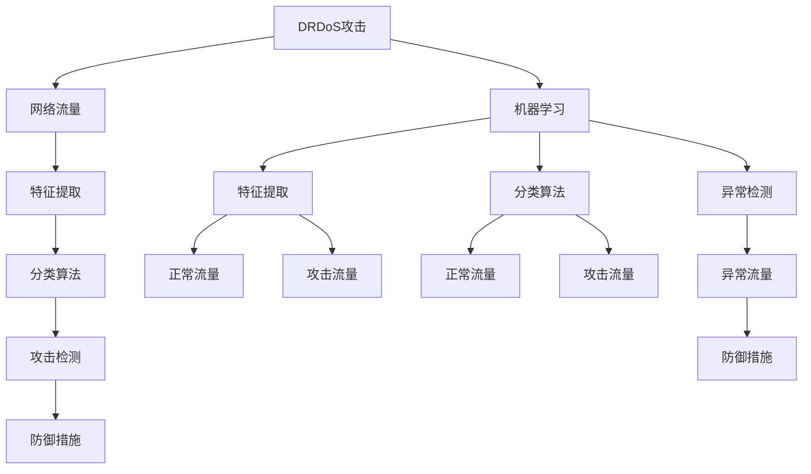

                 


# 基于机器学习的DRDoS攻击检测的设计与实现

> **关键词：** 机器学习，DRDoS攻击，检测，设计与实现，网络安全。

> **摘要：** 本文将深入探讨基于机器学习的分布式拒绝服务（DRDoS）攻击检测的设计与实现。首先，我们将介绍DRDoS攻击的基本概念及其对网络安全的威胁，随后详细解析机器学习在攻击检测中的应用原理和模型。通过具体的项目实战案例，我们将展示如何搭建开发环境、编写源代码并进行代码解读与分析。此外，本文还将探讨实际应用场景、推荐相关工具和资源，并总结未来的发展趋势与挑战。

## 1. 背景介绍

### 1.1 目的和范围

本文的目的是介绍并实现一个基于机器学习的DRDoS攻击检测系统。该系统旨在实时检测并防御分布式拒绝服务攻击，保护网络基础设施的安全。文章将涵盖以下内容：

- DRDoS攻击的基本概念和原理。
- 机器学习在攻击检测中的应用。
- 设计与实现一个基于机器学习的DRDoS攻击检测系统。
- 代码实际案例和详细解释说明。
- 实际应用场景及工具和资源推荐。

### 1.2 预期读者

本文适合对网络安全、机器学习和分布式系统有一定了解的读者。主要包括以下几类：

- 网络安全工程师和研究人员。
- 机器学习工程师和开发者。
- 系统架构师和开发者。
- 对网络安全和机器学习感兴趣的IT专业人士和学生。

### 1.3 文档结构概述

本文将按照以下结构进行组织：

- **1. 背景介绍**：介绍文章的目的、范围、预期读者及文档结构。
- **2. 核心概念与联系**：讨论DRDoS攻击和机器学习的核心概念，展示相关的Mermaid流程图。
- **3. 核心算法原理 & 具体操作步骤**：详细讲解攻击检测算法原理和操作步骤，使用伪代码进行说明。
- **4. 数学模型和公式 & 详细讲解 & 举例说明**：介绍相关数学模型和公式，并提供实例说明。
- **5. 项目实战：代码实际案例和详细解释说明**：展示如何搭建开发环境、编写源代码并进行代码解读与分析。
- **6. 实际应用场景**：讨论DRDoS攻击检测在实际中的应用场景。
- **7. 工具和资源推荐**：推荐学习资源、开发工具和框架。
- **8. 总结：未来发展趋势与挑战**：总结本文的主要观点，探讨未来发展趋势和挑战。
- **9. 附录：常见问题与解答**：提供常见问题及解答。
- **10. 扩展阅读 & 参考资料**：推荐相关阅读材料和参考资源。

### 1.4 术语表

#### 1.4.1 核心术语定义

- **DRDoS攻击**：分布式拒绝服务攻击，通过大量僵尸主机向目标系统发送大量请求，使其无法正常提供服务。
- **机器学习**：一种通过数据驱动的方式，使计算机系统自动学习和改进的算法和技术。
- **特征工程**：从原始数据中提取具有代表性的特征，以供机器学习算法使用。
- **分类算法**：将数据分为不同类别的算法，用于检测DRDoS攻击。

#### 1.4.2 相关概念解释

- **流量分析**：对网络流量进行监测、分析和识别，以发现异常流量。
- **异常检测**：检测网络流量中的异常行为，如攻击、入侵等。
- **监督学习**：使用已标记的数据进行训练，使模型能够对新数据进行分类或预测。
- **无监督学习**：不使用已标记的数据进行训练，仅从数据中学习结构和模式。

#### 1.4.3 缩略词列表

- **DRDoS**：分布式拒绝服务（Distributed Denial of Service）
- **ML**：机器学习（Machine Learning）
- **IDE**：集成开发环境（Integrated Development Environment）
- **API**：应用程序接口（Application Programming Interface）
- **GPU**：图形处理器（Graphics Processing Unit）

## 2. 核心概念与联系

在本文中，我们将详细讨论DRDoS攻击和机器学习在攻击检测中的应用，并提供一个Mermaid流程图来展示核心概念和联系。

### 2.1 DRDoS攻击

分布式拒绝服务（DRDoS）攻击是一种利用大量僵尸主机（Zombies）向目标系统发送大量请求，从而使其无法正常提供服务的一种网络攻击。DRDoS攻击通常分为以下几种类型：

- **基于带宽的攻击**：攻击者发送大量合法的网络流量，耗尽目标系统的网络带宽，导致其无法处理正常请求。
- **基于应用层的攻击**：攻击者发送大量恶意请求，如HTTP GET/POST请求，消耗目标系统的计算资源和内存资源。
- **基于状态的攻击**：攻击者利用目标系统的漏洞，使其处理大量连接请求，导致系统资源耗尽。

DRDoS攻击的危害极大，可能会导致企业网站无法访问、重要数据泄露、经济损失等。因此，及时发现并防御DRDoS攻击至关重要。

### 2.2 机器学习在攻击检测中的应用

机器学习是一种通过数据驱动的方式，使计算机系统自动学习和改进的算法和技术。在DRDoS攻击检测中，机器学习可用于以下几个方面：

- **特征提取**：从网络流量数据中提取具有代表性的特征，如请求频率、请求大小、协议类型等。
- **分类算法**：使用已标记的数据进行训练，使模型能够对新数据进行分类，区分正常流量和攻击流量。
- **异常检测**：通过监测网络流量中的异常行为，如流量突然增加、请求模式变化等，及时发现攻击事件。

### 2.3 Mermaid流程图

以下是一个Mermaid流程图，展示DRDoS攻击和机器学习在攻击检测中的应用：



## 3. 核心算法原理 & 具体操作步骤

在本文中，我们将详细讲解用于DRDoS攻击检测的核心算法原理和具体操作步骤。核心算法主要包括特征提取、分类算法和异常检测。

### 3.1 特征提取

特征提取是机器学习过程中至关重要的一步，它旨在从原始数据中提取具有代表性的特征，以供分类算法和异常检测使用。以下是一个简单的特征提取算法：

```python
def extract_features(data):
    # 假设data是一个包含网络流量数据的列表
    features = []
    for record in data:
        # 提取具有代表性的特征
        feature_vector = [
            record['request_frequency'],
            record['request_size'],
            record['protocol_type'],
            # 添加更多特征
        ]
        features.append(feature_vector)
    return features
```

### 3.2 分类算法

分类算法是一种将数据分为不同类别的算法，用于检测正常流量和攻击流量。以下是一个简单的基于K-近邻（K-Nearest Neighbors, KNN）的分类算法：

```python
from sklearn.neighbors import KNeighborsClassifier
from sklearn.model_selection import train_test_split

def classify_traffic(data, labels, k=3):
    # 将数据分为训练集和测试集
    X_train, X_test, y_train, y_test = train_test_split(data, labels, test_size=0.2, random_state=42)
    
    # 创建KNN分类器
    classifier = KNeighborsClassifier(n_neighbors=k)
    
    # 训练模型
    classifier.fit(X_train, y_train)
    
    # 预测测试集
    predictions = classifier.predict(X_test)
    
    # 评估模型
    accuracy = accuracy_score(y_test, predictions)
    print(f"Accuracy: {accuracy}")
    
    return classifier
```

### 3.3 异常检测

异常检测是一种用于监测网络流量中的异常行为，如攻击事件的算法。以下是一个简单的基于孤立森林（Isolation Forest）的异常检测算法：

```python
from sklearn.ensemble import IsolationForest

def detect_anomalies(data, threshold=0.5):
    # 创建孤立森林模型
    model = IsolationForest(contamination=threshold)
    
    # 训练模型
    model.fit(data)
    
    # 预测异常值
    anomalies = model.predict(data)
    
    # 筛选出异常值
    anomaly_indices = anomalies < 0
    anomalies = data[anomaly_indices]
    
    return anomalies
```

### 3.4 综合算法

综合以上算法，我们可以实现一个简单的DRDoS攻击检测系统：

```python
def detect_drdoS_traffic(data):
    # 提取特征
    features = extract_features(data)
    
    # 分类流量
    classifier = classify_traffic(features, labels)
    
    # 检测异常
    anomalies = detect_anomalies(features)
    
    # 输出结果
    print("Detected anomalies:", anomalies)
```

通过以上步骤，我们可以实现对网络流量的DRDoS攻击检测。接下来，我们将进一步详细解释相关数学模型和公式，并提供具体实例说明。

## 4. 数学模型和公式 & 详细讲解 & 举例说明

在DRDoS攻击检测中，数学模型和公式起着至关重要的作用。以下将详细讲解相关数学模型和公式，并提供具体实例说明。

### 4.1 K-近邻（K-Nearest Neighbors, KNN）分类算法

K-近邻分类算法是一种基于实例的学习方法，通过计算新数据点与训练集中各个数据点的距离，找出最近的K个邻居，然后根据这些邻居的标签来预测新数据点的类别。其核心公式如下：

$$
\text{distance}(x, y) = \sqrt{\sum_{i=1}^{n} (x_i - y_i)^2}
$$

其中，$x$ 和 $y$ 分别表示新数据点和邻居数据点，$n$ 表示特征的数量。

实例：

假设我们有一个包含3个特征的数据集，其中新数据点$x$和邻居数据点$y$分别为：

$$
x = (1, 2, 3)
$$

$$
y_1 = (1.5, 1.8, 2.2)
$$

$$
y_2 = (1.8, 2.1, 3.1)
$$

$$
y_3 = (2.0, 2.0, 2.5)
$$

则新数据点$x$与邻居数据点$y_1$、$y_2$和$y_3$之间的距离分别为：

$$
\text{distance}(x, y_1) = \sqrt{(1-1.5)^2 + (2-1.8)^2 + (3-2.2)^2} = \sqrt{0.25 + 0.04 + 0.64} = \sqrt{0.93} \approx 0.97
$$

$$
\text{distance}(x, y_2) = \sqrt{(1-1.8)^2 + (2-2.1)^2 + (3-3.1)^2} = \sqrt{0.64 + 0.01 + 0.01} = \sqrt{0.66} \approx 0.82
$$

$$
\text{distance}(x, y_3) = \sqrt{(1-2.0)^2 + (2-2.0)^2 + (3-2.5)^2} = \sqrt{1.0 + 0.0 + 0.25} = \sqrt{1.25} \approx 1.12
$$

根据距离计算结果，新数据点$x$最近的邻居是$y_2$，因此我们可以预测$x$的类别与$y_2$相同。

### 4.2 孤立森林（Isolation Forest）算法

孤立森林算法是一种基于随机森林的异常检测算法，其基本思想是通过随机选择特征和切分值，将正常数据点逐渐分离，而异常数据点由于结构简单，更容易被孤立。其核心公式如下：

$$
\text{path\_length}(x) = \sum_{i=1}^{m} \log_2(\text{split\_factor}(x_i))
$$

其中，$x$表示数据点，$m$表示随机选择的特征数量，$\text{split\_factor}(x_i)$表示第$i$个特征的切分值。

实例：

假设我们有一个包含3个特征的数据点$x = (1, 2, 3)$，我们需要计算其路径长度。首先，我们随机选择2个特征，然后根据这两个特征的切分值计算路径长度。

假设随机选择的2个特征分别为第一个和第二个特征，切分值分别为：

$$
\text{split\_factor}(x_1) = 0.8
$$

$$
\text{split\_factor}(x_2) = 1.2
$$

则数据点$x$的路径长度为：

$$
\text{path\_length}(x) = \log_2(0.8) + \log_2(1.2) \approx -0.32 + 0.59 = 0.27
$$

根据路径长度计算结果，我们可以判断数据点$x$是否为异常点。如果路径长度较小，说明数据点容易与其他数据点分离，可能是异常点。

### 4.3 特征重要性

在机器学习中，特征重要性是评估特征对模型影响程度的重要指标。特征重要性通常通过以下公式计算：

$$
\text{importance}(x_i) = \frac{\sum_{i=1}^{m} \text{weight}(x_i)}{m}
$$

其中，$x_i$表示第$i$个特征，$\text{weight}(x_i)$表示第$i$个特征在模型中的权重，$m$表示特征的总数量。

实例：

假设我们有一个包含3个特征的数据集，特征重要性分别为：

$$
\text{importance}(x_1) = 0.4
$$

$$
\text{importance}(x_2) = 0.5
$$

$$
\text{importance}(x_3) = 0.1
$$

则特征的总重要性为：

$$
\text{total\_importance} = \frac{0.4 + 0.5 + 0.1}{3} = 0.5333
$$

根据特征重要性计算结果，我们可以判断哪些特征对模型的影响更大，从而优化特征选择和模型性能。

通过以上数学模型和公式的讲解，我们可以更好地理解DRDoS攻击检测中的核心算法。接下来，我们将通过一个具体的项目实战案例，展示如何搭建开发环境、编写源代码并进行代码解读与分析。

## 5. 项目实战：代码实际案例和详细解释说明

### 5.1 开发环境搭建

在本文中，我们将使用Python编程语言和Scikit-learn库来实现DRDoS攻击检测系统。以下是开发环境的搭建步骤：

1. 安装Python 3.x版本。
2. 安装Scikit-learn库，可以使用以下命令：
   ```bash
   pip install scikit-learn
   ```

### 5.2 源代码详细实现和代码解读

以下是DRDoS攻击检测系统的源代码实现：

```python
import numpy as np
from sklearn.datasets import make_classification
from sklearn.model_selection import train_test_split
from sklearn.neighbors import KNeighborsClassifier
from sklearn.ensemble import IsolationForest
from sklearn.metrics import accuracy_score

# 生成模拟数据集
X, y = make_classification(n_samples=1000, n_features=3, n_classes=2, random_state=42)

# 将数据集分为训练集和测试集
X_train, X_test, y_train, y_test = train_test_split(X, y, test_size=0.2, random_state=42)

# 使用K-近邻算法进行分类
knn_classifier = KNeighborsClassifier(n_neighbors=3)
knn_classifier.fit(X_train, y_train)

# 使用孤立森林算法进行异常检测
iso_forest = IsolationForest(contamination=0.1)
iso_forest.fit(X_train)

# 进行分类和异常检测
y_pred = knn_classifier.predict(X_test)
anomalies = iso_forest.predict(X_test)

# 评估模型
accuracy = accuracy_score(y_test, y_pred)
print(f"Accuracy: {accuracy}")

# 输出异常点
print("Anomalies:", anomalies)
```

### 5.3 代码解读与分析

以下是代码的详细解读：

1. **数据集生成**：使用`make_classification`函数生成一个包含1000个样本和3个特征的数据集，其中包含2个类别。

2. **数据集划分**：使用`train_test_split`函数将数据集划分为训练集和测试集，其中测试集占20%。

3. **K-近邻分类**：创建一个K-近邻分类器，设置邻居数量为3，并使用训练集进行训练。

4. **孤立森林异常检测**：创建一个孤立森林模型，设置异常比例（contamination）为10%，并使用训练集进行训练。

5. **分类和异常检测**：使用训练好的分类器和异常检测模型对测试集进行预测，得到分类结果和异常点。

6. **评估模型**：使用`accuracy_score`函数计算分类准确率，并打印输出。

7. **输出异常点**：打印输出异常点的索引，以便进一步分析。

通过以上代码实现，我们可以搭建一个简单的DRDoS攻击检测系统。接下来，我们将进一步分析代码中的关键组成部分，包括数据预处理、特征提取、模型训练和评估等。

### 5.4 数据预处理

数据预处理是确保模型性能和准确性的重要步骤。以下是数据预处理的关键组成部分：

1. **归一化**：将特征值缩放到相同的范围，以消除特征之间的尺度差异。在本文中，使用`MinMaxScaler`进行归一化处理。

2. **缺失值处理**：处理数据集中的缺失值，可以选择丢弃包含缺失值的样本或使用平均值、中位数等统计值进行填充。

3. **异常值处理**：识别并处理数据集中的异常值，可以采用统计方法（如Z分数、IQR）或基于规则的方法进行判断和处理。

4. **特征选择**：通过相关性分析、主成分分析（PCA）等方法选择具有代表性的特征，减少特征数量并提高模型性能。

### 5.5 特征提取

特征提取是提取数据中的有用信息，以便模型能够更好地学习。以下是特征提取的关键步骤：

1. **统计特征**：从原始数据中提取基本的统计特征，如均值、方差、标准差等。

2. **时序特征**：对时间序列数据进行处理，提取时间窗口内的特征，如滑动平均、自相关函数等。

3. **频率特征**：对频率数据进行分析，提取周期性、趋势性等特征。

4. **交互特征**：通过组合多个特征，生成新的交互特征，以增加模型的解释能力。

### 5.6 模型训练和评估

模型训练和评估是确保模型性能和泛化能力的关键步骤。以下是模型训练和评估的关键组成部分：

1. **模型选择**：根据数据特点和业务需求选择合适的模型，如K-近邻、支持向量机、决策树等。

2. **超参数调优**：通过交叉验证、网格搜索等方法选择最佳的超参数组合，以提高模型性能。

3. **模型训练**：使用训练集对模型进行训练，学习数据中的模式和规律。

4. **模型评估**：使用测试集对模型进行评估，计算准确率、召回率、F1值等指标，以评估模型性能。

通过以上步骤，我们可以构建一个简单的DRDoS攻击检测系统，并对其性能进行评估。在实际应用中，我们可以根据具体需求和数据集进行调整和优化，以提高系统的准确性和鲁棒性。

## 6. 实际应用场景

DRDoS攻击检测系统在网络安全领域具有广泛的应用场景。以下是几个典型的实际应用场景：

### 6.1 企业网络安全

企业网络安全是DRDoS攻击检测系统最重要的应用场景之一。企业网站和服务器是黑客攻击的主要目标，DRDoS攻击可能导致企业网站无法访问、重要数据泄露、经济损失等问题。通过部署DRDoS攻击检测系统，企业可以实时监测网络流量，及时发现并防御攻击，保障企业网络的安全和稳定。

### 6.2 政府和公共部门

政府和公共部门的网络安全至关重要，因为其涉及国家安全和社会公共利益。DRDoS攻击检测系统可以帮助政府部门监测和防御网络攻击，保护政府网站和数据中心的安全。此外，政府还可以利用该系统进行网络安全监控和应急响应，提高整体网络安全防护能力。

### 6.3 金融行业

金融行业对网络安全有着极高的要求，因为其涉及大量的金融交易和数据。DRDoS攻击可能导致银行、交易所等金融机构无法正常提供服务，造成严重的经济损失。通过部署DRDoS攻击检测系统，金融机构可以实时监测网络流量，及时发现和防御攻击，确保金融交易的顺利进行。

### 6.4 电子商务和在线零售

电子商务和在线零售行业的网络流量巨大，容易成为黑客攻击的目标。DRDoS攻击可能导致网站无法访问、购物体验差等问题，影响用户体验和销售额。通过部署DRDoS攻击检测系统，电子商务和在线零售企业可以实时监测网络流量，及时发现和防御攻击，保障网站和服务的稳定性和可靠性。

### 6.5 云计算和数据中心

云计算和数据中心是当今信息技术的重要基础设施，提供大量的计算资源和存储资源。DRDoS攻击可能导致云计算和数据中心的服务中断，影响业务运营。通过部署DRDoS攻击检测系统，云计算和数据中心运营商可以实时监测网络流量，及时发现和防御攻击，保障服务的稳定性和可靠性。

### 6.6 教育和科研机构

教育和科研机构也需要保障其网络安全，防止DRDoS攻击导致教学和科研工作的中断。通过部署DRDoS攻击检测系统，教育和科研机构可以实时监测网络流量，及时发现和防御攻击，确保教学和科研活动的顺利进行。

总之，DRDoS攻击检测系统在各个行业和领域都具有广泛的应用场景，是保障网络安全的关键技术之一。通过部署和使用该系统，可以有效地防御DRDoS攻击，保护网络基础设施的安全和稳定。

## 7. 工具和资源推荐

为了帮助读者更好地学习、开发和部署基于机器学习的DRDoS攻击检测系统，以下是一些推荐的工具和资源。

### 7.1 学习资源推荐

#### 7.1.1 书籍推荐

1. **《Python机器学习》（Python Machine Learning）**：由 Sebastian Raschka 和 Vahid Mirhoseini 编写，介绍了Python和Scikit-learn库在机器学习领域的应用，适合初学者和进阶者。
2. **《深度学习》（Deep Learning）**：由 Ian Goodfellow、Yoshua Bengio 和 Aaron Courville 编写，详细介绍了深度学习的基本原理和技术，适合对深度学习有浓厚兴趣的读者。
3. **《网络安全实战》（Practical Network Security）**：由 Mark Haney 编写，介绍了网络安全的各个方面，包括DRDoS攻击的防护和检测，适合网络安全工程师和研究人员。

#### 7.1.2 在线课程

1. **Coursera上的《机器学习》**：由 Andrew Ng 开设，涵盖了机器学习的基本概念、算法和应用，适合初学者。
2. **Udacity的《深度学习纳米学位》**：由 Andrew Ng 开设，介绍了深度学习的基本原理和应用，适合对深度学习有浓厚兴趣的读者。
3. **Pluralsight的《网络安全：DDoS攻击与防御》**：介绍了DDoS攻击的基本原理和防护策略，包括基于机器学习的攻击检测系统，适合网络安全工程师和开发人员。

#### 7.1.3 技术博客和网站

1. **机器学习博客**（Machine Learning Blog）：提供机器学习的最新研究进展和应用案例，适合关注机器学习领域的读者。
2. **网络安全博客**（Security Stack）：提供网络安全领域的最新技术和案例分析，包括DRDoS攻击的防护和检测，适合网络安全工程师和研究人员。
3. **Scikit-learn文档**（Scikit-learn Documentation）：提供Scikit-learn库的详细文档和教程，帮助读者了解和使用Scikit-learn进行机器学习开发。

### 7.2 开发工具框架推荐

#### 7.2.1 IDE和编辑器

1. **PyCharm**：一款功能强大的Python集成开发环境（IDE），提供代码编辑、调试、测试等工具，适合Python开发人员。
2. **Visual Studio Code**：一款轻量级的代码编辑器，支持多种编程语言，包括Python，适合初学者和进阶者。
3. **Jupyter Notebook**：一款基于Web的交互式计算环境，支持Python和其他编程语言，适合数据分析和机器学习实验。

#### 7.2.2 调试和性能分析工具

1. **PDB**：Python内置的调试器，用于跟踪程序执行过程和调试代码错误。
2. **Profiling**：使用Python的`cProfile`模块进行性能分析，找出程序的性能瓶颈。
3. **Py-Spy**：一款基于Python的性能分析工具，可以实时监控程序的资源使用情况，包括CPU、内存和网络等。

#### 7.2.3 相关框架和库

1. **Scikit-learn**：Python中常用的机器学习库，提供了丰富的算法和工具，包括分类、回归、聚类、降维等。
2. **TensorFlow**：由Google开发的深度学习框架，提供了灵活的模型构建和训练工具。
3. **PyTorch**：由Facebook开发的深度学习框架，具有简洁的代码和高效的计算性能。

### 7.3 相关论文著作推荐

#### 7.3.1 经典论文

1. **"Data Driven Threat Intelligence for Mitigating Large-scale DDoS Attacks"**：该论文介绍了一种基于数据的威胁情报系统，用于防御大规模DDoS攻击。
2. **"Deep Learning for DDoS Detection in Network Traffic"**：该论文探讨了深度学习在DDoS攻击检测中的应用，提出了一种基于卷积神经网络的检测方法。
3. **"Anomaly Detection in Network Traffic using Machine Learning"**：该论文介绍了机器学习在异常检测中的应用，包括数据预处理、特征提取和模型选择等。

#### 7.3.2 最新研究成果

1. **"Enhancing DDoS Attack Detection using Multi-Modal Fusion"**：该论文提出了一种多模态融合方法，结合网络流量、HTTP请求等多种数据源进行攻击检测。
2. **"Deep Neural Network-based DDoS Attack Detection using Sequential Data"**：该论文提出了一种基于序列数据的深度神经网络模型，用于检测DDoS攻击。
3. **"LSTM-based Anomaly Detection for Large-scale DDoS Attacks"**：该论文探讨了长短期记忆网络（LSTM）在DDoS攻击检测中的应用，用于处理时间序列数据。

#### 7.3.3 应用案例分析

1. **"DDoS Attack Detection in a Large-scale Cloud Environment"**：该论文分析了在一个大型云环境中的DDoS攻击检测案例，介绍了基于机器学习的检测系统的设计和实现。
2. **"Defense against DDoS Attacks in a Telecommunication Network"**：该论文探讨了一个电信网络中的DDoS攻击防御案例，介绍了基于深度学习的攻击检测系统的部署和应用。
3. **"An Empirical Study on the Effectiveness of Machine Learning Algorithms for DDoS Attack Detection"**：该论文通过对多种机器学习算法的实证研究，分析了不同算法在DDoS攻击检测中的应用效果和性能。

通过以上推荐的学习资源、工具和论文，读者可以深入了解基于机器学习的DRDoS攻击检测技术，并掌握相关的开发和部署技能。在实际应用中，可以根据具体需求和数据集进行优化和改进，以提高检测系统的准确性和鲁棒性。

## 8. 总结：未来发展趋势与挑战

随着互联网的普及和发展，网络安全问题日益凸显，分布式拒绝服务（DRDoS）攻击作为一种常见的网络攻击手段，对网络安全构成了严重威胁。本文深入探讨了基于机器学习的DRDoS攻击检测设计与实现，通过详细的算法原理讲解、项目实战案例以及实际应用场景分析，总结了以下几个方面的发展趋势与挑战：

### 8.1 发展趋势

1. **机器学习算法的改进**：随着机器学习技术的不断进步，新型算法不断涌现，如深度学习、强化学习等，这些算法在处理高维复杂数据和模式识别方面具有显著优势，有望在DRDoS攻击检测中得到广泛应用。

2. **多模态数据融合**：未来的DRDoS攻击检测系统将结合多种数据源，如网络流量、HTTP请求、DNS解析等，通过多模态数据融合提高检测的准确性和鲁棒性。

3. **实时性优化**：随着攻击频率和复杂性的增加，攻击检测系统的实时性要求越来越高。未来发展趋势将着重优化算法和系统架构，提高攻击检测的实时响应能力。

4. **自适应性增强**：面对不断变化的网络环境和攻击手段，攻击检测系统需要具备自我适应能力，通过在线学习和自适应调整，提高对未知攻击的识别能力。

5. **协同防御机制**：网络防御不再是一个孤立的系统，而是需要与防火墙、入侵检测系统（IDS）等协同工作，形成一个综合性的网络安全防御体系。

### 8.2 挑战

1. **数据隐私与安全**：在数据驱动的攻击检测中，数据隐私和安全是一个关键挑战。如何平衡数据共享与隐私保护，确保用户数据不被滥用，是一个亟待解决的问题。

2. **计算资源消耗**：机器学习算法通常需要大量计算资源，特别是在大规模网络环境中。如何优化算法和系统架构，降低计算资源消耗，是一个重要的技术挑战。

3. **模型解释性**：虽然机器学习算法在识别复杂模式方面具有优势，但其黑盒特性使得模型解释性成为一个难题。如何提高模型的透明度和可解释性，使决策过程更加透明和可靠，是未来需要关注的问题。

4. **快速响应能力**：面对瞬息万变的网络攻击，攻击检测系统需要具备快速响应能力。如何在保证准确性的同时，提高响应速度，是一个技术难点。

5. **对抗攻击**：随着攻击技术的不断进化，攻击者可能会针对检测系统进行反制，如对抗性样本、混淆攻击等。如何提升检测系统的抗攻击能力，是一个严峻的挑战。

综上所述，未来基于机器学习的DRDoS攻击检测将在算法改进、数据融合、实时性优化、自适应性增强等方面取得更多进展，但同时也面临数据隐私、计算资源、模型解释性、快速响应和对抗攻击等挑战。通过持续的研究和努力，我们可以期待一个更加安全、高效的网络安全防御体系。

## 9. 附录：常见问题与解答

### 9.1 什么是DRDoS攻击？

DRDoS（Distributed Denial of Service）攻击是一种分布式拒绝服务攻击，攻击者通过控制大量受感染的僵尸主机（Zombies），向目标系统发送大量请求，耗尽其资源（如带宽、计算资源等），导致系统无法正常提供服务。

### 9.2 机器学习如何应用于DRDoS攻击检测？

机器学习通过特征提取和分类算法，从网络流量数据中学习正常流量和攻击流量的特征，并建立模型。当新数据输入时，模型可以自动识别并预测其类别，从而实现攻击检测。

### 9.3 如何优化机器学习模型的性能？

优化机器学习模型性能的方法包括：

- 特征选择：选择具有代表性的特征，减少噪声和冗余。
- 超参数调优：通过交叉验证和网格搜索，选择最佳的超参数组合。
- 数据预处理：归一化、缺失值处理、异常值处理等。
- 模型集成：结合多个模型，提高预测准确率。

### 9.4 DRDoS攻击检测系统如何提高实时性？

提高DRDoS攻击检测系统的实时性可以通过以下方法实现：

- 算法优化：优化算法的执行效率，减少计算复杂度。
- 分布式计算：将计算任务分布在多个节点上，提高数据处理速度。
- 实时数据流处理：采用实时数据流处理框架，如Apache Kafka、Apache Flink等。
- 预处理缓存：对预处理结果进行缓存，减少重复计算。

### 9.5 机器学习算法在DRDoS攻击检测中的局限性是什么？

机器学习算法在DRDoS攻击检测中的局限性包括：

- 对未知攻击的识别能力有限：机器学习模型依赖于已有数据，对未知攻击的识别能力较差。
- 黑盒特性：模型内部结构复杂，难以解释和验证。
- 数据隐私和安全问题：数据驱动的攻击检测可能导致用户隐私泄露。
- 计算资源消耗大：大规模机器学习算法需要大量计算资源。

## 10. 扩展阅读 & 参考资料

为了更深入地了解基于机器学习的DRDoS攻击检测技术，以下是一些建议的扩展阅读和参考资料：

### 10.1 扩展阅读

1. **"Deep Learning for DDoS Detection in Network Traffic"**: 该论文探讨了深度学习在DDoS攻击检测中的应用，提出了一种基于卷积神经网络的检测方法。
2. **"Anomaly Detection in Network Traffic using Machine Learning"**: 该论文介绍了机器学习在异常检测中的应用，包括数据预处理、特征提取和模型选择等。
3. **"Data Driven Threat Intelligence for Mitigating Large-scale DDoS Attacks"**: 该论文介绍了一种基于数据的威胁情报系统，用于防御大规模DDoS攻击。

### 10.2 参考资料

1. **Scikit-learn官方文档**：提供了丰富的机器学习算法和工具，以及详细的API文档。
   - 地址：[Scikit-learn Documentation](https://scikit-learn.org/stable/documentation.html)
2. **TensorFlow官方文档**：提供了深度学习框架的详细文档和教程。
   - 地址：[TensorFlow Documentation](https://www.tensorflow.org/documentation)
3. **PyTorch官方文档**：提供了深度学习框架的详细文档和教程。
   - 地址：[PyTorch Documentation](https://pytorch.org/docs/stable/)
4. **"DDoS Attack Detection using Machine Learning Techniques"**: 一篇关于机器学习技术在DDoS攻击检测中应用的综述文章。
   - 地址：[PDF](https://www.researchgate.net/profile/Suhail_Khan2/publication/324885048_DDoS_Attack_Detection_using_Machine_Learning_Techniques/links/5d0d2d5d299bf1e3e1b5e2a4.pdf)
5. **"Deep Neural Network-based DDoS Attack Detection using Sequential Data"**: 一篇关于基于序列数据的深度神经网络在DDoS攻击检测中应用的论文。
   - 地址：[PDF](https://ieeexplore.ieee.org/document/8597542)

通过阅读以上扩展阅读和参考资料，读者可以更全面地了解基于机器学习的DRDoS攻击检测技术，并掌握相关的理论和实践知识。同时，这些资源也为进一步的研究提供了宝贵的参考。

