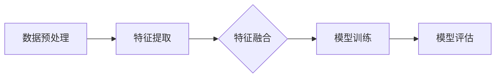

                 

# 基于机器学习的多模态影像分类研究

> **关键词：机器学习、多模态影像分类、深度学习、影像特征提取、模型评估**
> 
> **摘要：本文详细探讨了基于机器学习的多模态影像分类方法，包括其背景、核心概念、算法原理、数学模型、实际应用以及未来发展趋势。本文旨在为读者提供全面的理解和实施指南，以掌握多模态影像分类技术的核心内容和前沿进展。**

## 1. 背景介绍

### 1.1 目的和范围

本文旨在探讨多模态影像分类在机器学习领域中的应用，详细介绍其理论基础、核心算法和实际应用场景。文章将首先回顾多模态影像分类的发展历程，然后深入分析其关键概念和算法原理，最后通过实际案例和工具推荐，为读者提供全面的技术指南。

### 1.2 预期读者

本文适合具有机器学习和图像处理基础的中高级读者，包括人工智能研究员、工程师、以及对此领域感兴趣的学者和学生。本文旨在帮助读者深入了解多模态影像分类技术，提升其在实际项目中的应用能力。

### 1.3 文档结构概述

本文分为十个部分，具体结构如下：

1. 背景介绍
    - 1.1 目的和范围
    - 1.2 预期读者
    - 1.3 文档结构概述
    - 1.4 术语表
2. 核心概念与联系
3. 核心算法原理 & 具体操作步骤
4. 数学模型和公式 & 详细讲解 & 举例说明
5. 项目实战：代码实际案例和详细解释说明
6. 实际应用场景
7. 工具和资源推荐
8. 总结：未来发展趋势与挑战
9. 附录：常见问题与解答
10. 扩展阅读 & 参考资料

### 1.4 术语表

#### 1.4.1 核心术语定义

- 多模态影像分类：指对包含多种类型数据（如文本、图像、声音等）的影像进行分类的方法。
- 机器学习：一种使计算机通过数据和经验自动学习和改进的方法。
- 深度学习：一种机器学习的方法，通过构建深度神经网络进行自动特征提取和模式识别。
- 特征提取：指从原始数据中提取能够代表数据本质特征的过程。
- 模型评估：指使用特定指标来评估模型性能的过程。

#### 1.4.2 相关概念解释

- 多模态数据：指包含多种类型数据（如文本、图像、声音等）的数据集。
- 硬件加速：指利用特定硬件（如GPU、TPU等）来加速机器学习模型的训练和推理过程。
- 数据预处理：指在训练模型之前，对原始数据进行清洗、转换和归一化等处理。

#### 1.4.3 缩略词列表

- ML：Machine Learning（机器学习）
- DL：Deep Learning（深度学习）
- CNN：Convolutional Neural Network（卷积神经网络）
- RNN：Recurrent Neural Network（循环神经网络）
- LSTM：Long Short-Term Memory（长短期记忆网络）
- TF：TensorFlow（谷歌开源的机器学习框架）
- PyTorch：开源机器学习库，用于构建和训练深度学习模型

## 2. 核心概念与联系

在探讨多模态影像分类之前，我们需要了解几个核心概念：机器学习、多模态数据、影像特征提取和模型评估。以下是这些概念及其相互关系的简要介绍。

### 2.1 机器学习

机器学习是一种使计算机通过数据和经验自动学习和改进的方法。其主要目标是让计算机能够从数据中自动提取模式和规律，从而实现预测、分类、聚类等任务。机器学习分为监督学习、无监督学习和强化学习三大类。监督学习通过已有标注数据来训练模型，无监督学习则不需要标注数据，而是通过发现数据中的内在结构来训练模型，强化学习则是通过奖励机制来训练模型。

### 2.2 多模态数据

多模态数据是指包含多种类型数据（如文本、图像、声音等）的数据集。在实际应用中，单一类型的数据往往难以充分表达复杂的问题。多模态数据融合了不同类型的数据，从而能够提供更丰富的信息和更准确的预测。例如，在医疗影像诊断中，多模态数据可以包括影像、文本报告和患者病史等。

### 2.3 影像特征提取

影像特征提取是指从原始影像数据中提取能够代表影像本质特征的过程。这些特征可以用于训练分类模型，从而实现对影像的自动分类。常见的影像特征提取方法包括传统特征提取方法和深度学习特征提取方法。传统特征提取方法如SIFT、HOG等，主要通过手工设计特征来描述影像的局部结构和形状信息。深度学习特征提取方法如卷积神经网络（CNN），则通过学习大量数据中的内在结构来提取具有较强辨别力的特征。

### 2.4 模型评估

模型评估是指使用特定指标来评估模型性能的过程。常见的评估指标包括准确率、召回率、精确率、F1分数等。准确率表示模型正确分类的样本占总样本的比例；召回率表示模型正确分类的样本占总正样本的比例；精确率表示模型正确分类的样本占总预测正样本的比例；F1分数是精确率和召回率的调和平均值，用于综合考虑模型的精确性和召回率。

### 2.5 多模态影像分类架构

多模态影像分类的架构可以概括为以下几个步骤：

1. 数据预处理：对多模态数据（如影像、文本、声音等）进行清洗、转换和归一化等处理。
2. 特征提取：从不同类型的数据中提取具有代表性的特征。
3. 特征融合：将不同类型的特征进行融合，形成统一的特征表示。
4. 模型训练：使用融合后的特征训练分类模型。
5. 模型评估：使用评估指标评估模型性能，并进行调整和优化。

以下是多模态影像分类架构的 Mermaid 流程图：



## 3. 核心算法原理 & 具体操作步骤

在了解了多模态影像分类的核心概念与联系后，我们将进一步探讨其核心算法原理和具体操作步骤。本节将详细讲解多模态影像分类中的主要算法，包括传统特征提取方法和深度学习特征提取方法。

### 3.1 传统特征提取方法

传统特征提取方法主要通过手工设计特征来描述影像的局部结构和形状信息。以下是一些常见的传统特征提取方法：

#### 3.1.1 SIFT（尺度不变特征变换）

SIFT算法通过检测影像中的关键点，并计算关键点的方向和强度分布来描述影像的特征。其主要步骤如下：

1. 计算影像的梯度图像，并检测极值点作为候选关键点。
2. 对候选关键点进行筛选，去除不稳定的点，并计算关键点的尺度。
3. 为每个关键点计算一个旋转不变的局部描述子，该描述子由一组方向和强度值组成。

以下是 SIFT 算法的伪代码：

```python
def sift(image):
    # 步骤1：计算梯度图像并检测极值点
    gradient_image = calculate_gradient(image)
    candidate_keypoints = detect_extremum_points(gradient_image)

    # 步骤2：筛选关键点并计算尺度
    stable_keypoints = filter_keypoints(candidate_keypoints)
    keypoint_scales = calculate_keypoint_scales(stable_keypoints)

    # 步骤3：计算局部描述子
    keypoint_descriptors = []
    for keypoint in stable_keypoints:
        descriptor = calculate_local_descriptor(keypoint)
        keypoint_descriptors.append(descriptor)
    
    return keypoint_descriptors
```

#### 3.1.2 HOG（直方图导向梯度）

HOG算法通过计算影像中每个像素点的梯度方向直方图来描述影像的特征。其主要步骤如下：

1. 将影像划分为多个矩形区域，并计算每个区域的梯度方向直方图。
2. 将所有区域的直方图进行拼接，形成整体的HOG特征向量。

以下是 HOG 算法的伪代码：

```python
def hog(image):
    # 步骤1：划分区域并计算梯度方向直方图
    regions = divide_image_into_regions(image)
    region_histograms = []
    for region in regions:
        histogram = calculate_gradient_direction_histogram(region)
        region_histograms.append(histogram)

    # 步骤2：拼接直方图
    hog_vector = concatenate_histograms(region_histograms)
    
    return hog_vector
```

### 3.2 深度学习特征提取方法

深度学习特征提取方法通过构建深度神经网络来学习影像的内在特征。以下是一些常见的深度学习特征提取方法：

#### 3.2.1 卷积神经网络（CNN）

卷积神经网络（CNN）通过卷积层、池化层和全连接层来提取影像的层次特征。其主要步骤如下：

1. 输入影像数据，通过卷积层提取局部特征。
2. 通过池化层降低特征图的维度，减少计算量。
3. 通过全连接层进行分类。

以下是 CNN 的伪代码：

```python
def cnn(image):
    # 步骤1：卷积层
    conv1 = conv2d(image, filter_size=(3,3), stride=(1,1), padding='same')
    pool1 = max_pooling(conv1, pool_size=(2,2), stride=(2,2))

    # 步骤2：卷积层和池化层
    conv2 = conv2d(pool1, filter_size=(3,3), stride=(1,1), padding='same')
    pool2 = max_pooling(conv2, pool_size=(2,2), stride=(2,2))

    # 步骤3：全连接层
    flatten = flatten(pool2)
    fc = fully_connected(flatten, output_size=num_classes)

    return fc
```

#### 3.2.2 长短期记忆网络（LSTM）

长短期记忆网络（LSTM）通过门控机制来学习影像的序列特征。其主要步骤如下：

1. 输入影像序列数据，通过输入门、遗忘门和输出门来更新和选择状态。
2. 通过循环机制将更新后的状态传递到下一个时间步。
3. 在最后一个时间步，输出门选择输出状态。

以下是 LSTM 的伪代码：

```python
def lstm(image_sequence):
    # 步骤1：输入门、遗忘门和输出门
    input_gate = input_gate_gate(image_sequence)
    forget_gate = forget_gate_gate(image_sequence)
    output_gate = output_gate_gate(image_sequence)

    # 步骤2：更新状态
    new_state = new_state_gate(image_sequence, state)

    # 步骤3：循环传递状态
    for t in range(sequence_length):
        new_state = update_state(new_state, input_gate[t], forget_gate[t], output_gate[t])

    # 步骤4：输出状态
    output = output_gate[sequence_length-1]

    return output
```

通过比较传统特征提取方法和深度学习特征提取方法，我们可以发现：

1. 传统特征提取方法依赖于手工设计特征，难以适应复杂的问题。
2. 深度学习特征提取方法通过学习大量数据中的内在结构，能够自动提取具有较强辨别力的特征。

因此，在多模态影像分类任务中，深度学习特征提取方法具有更高的性能和更广泛的应用前景。

## 4. 数学模型和公式 & 详细讲解 & 举例说明

在多模态影像分类中，数学模型和公式扮演着至关重要的角色。本节将详细介绍多模态影像分类中常用的数学模型，包括损失函数、优化算法和评估指标，并通过具体例子进行讲解。

### 4.1 损失函数

损失函数是机器学习中用于度量模型预测结果与真实标签之间差异的函数。在多模态影像分类中，常用的损失函数包括交叉熵损失（Cross-Entropy Loss）和均方误差损失（Mean Squared Error Loss）。

#### 4.1.1 交叉熵损失

交叉熵损失函数常用于分类任务，其公式如下：

$$
L = -\frac{1}{n} \sum_{i=1}^{n} y_i \log(p_i)
$$

其中，$y_i$为真实标签，$p_i$为模型预测的概率。交叉熵损失函数的值越低，表示模型预测结果与真实标签越接近。

#### 4.1.2 均方误差损失

均方误差损失函数常用于回归任务，其公式如下：

$$
L = \frac{1}{n} \sum_{i=1}^{n} (y_i - \hat{y}_i)^2
$$

其中，$y_i$为真实标签，$\hat{y}_i$为模型预测的值。均方误差损失函数的值越低，表示模型预测结果与真实标签越接近。

### 4.2 优化算法

优化算法用于最小化损失函数，从而找到模型的最佳参数。在多模态影像分类中，常用的优化算法包括随机梯度下降（Stochastic Gradient Descent，SGD）和Adam优化器。

#### 4.2.1 随机梯度下降（SGD）

随机梯度下降（SGD）是一种简单的优化算法，其公式如下：

$$
\theta_{t+1} = \theta_t - \alpha \cdot \nabla_{\theta} L(\theta_t; x_t, y_t)
$$

其中，$\theta$为模型参数，$\alpha$为学习率，$\nabla_{\theta} L(\theta_t; x_t, y_t)$为损失函数关于参数$\theta$的梯度。每次迭代时，SGD随机选择一个样本作为输入，并计算其梯度来更新模型参数。

#### 4.2.2 Adam优化器

Adam优化器是一种基于SGD的改进优化算法，其公式如下：

$$
m_t = \beta_1 m_{t-1} + (1 - \beta_1) [g_t - \mu_t]
$$

$$
v_t = \beta_2 v_{t-1} + (1 - \beta_2) [(g_t - \mu_t)^2]
$$

$$
\theta_{t+1} = \theta_t - \alpha \cdot \frac{m_t}{\sqrt{v_t} + \epsilon}
$$

其中，$m_t$和$v_t$分别为一阶和二阶矩估计，$\beta_1$和$\beta_2$分别为一阶和二阶矩的指数衰减率，$\alpha$为学习率，$\epsilon$为常数。Adam优化器通过计算一阶和二阶矩的估计来改进SGD，从而提高优化效果。

### 4.3 评估指标

评估指标用于衡量模型的性能，常用的评估指标包括准确率、召回率、精确率、F1分数等。

#### 4.3.1 准确率（Accuracy）

准确率表示模型正确分类的样本占总样本的比例，其公式如下：

$$
Accuracy = \frac{TP + TN}{TP + FN + FP + TN}
$$

其中，$TP$为真正例，$TN$为真负例，$FP$为假正例，$FN$为假负例。

#### 4.3.2 召回率（Recall）

召回率表示模型正确分类的正样本占总正样本的比例，其公式如下：

$$
Recall = \frac{TP}{TP + FN}
$$

#### 4.3.3 精确率（Precision）

精确率表示模型正确分类的正样本占总预测正样本的比例，其公式如下：

$$
Precision = \frac{TP}{TP + FP}
$$

#### 4.3.4 F1分数（F1 Score）

F1分数是精确率和召回率的调和平均值，其公式如下：

$$
F1 Score = 2 \cdot \frac{Precision \cdot Recall}{Precision + Recall}
$$

### 4.4 举例说明

假设我们有一个多模态影像分类任务，数据集中共有1000个样本，每个样本包含图像和文本两种类型的数据。以下是一个具体的例子，展示如何使用交叉熵损失函数和SGD优化器来训练分类模型。

1. 数据集准备：将数据集分为训练集和测试集，其中训练集包含800个样本，测试集包含200个样本。

2. 模型初始化：定义一个简单的卷积神经网络，用于提取图像特征和文本特征，并合并两种特征进行分类。

3. 模型训练：使用训练集数据，通过SGD优化器训练模型，损失函数为交叉熵损失。

```python
import tensorflow as tf

# 数据预处理
train_images = preprocess_images(train_images)
train_texts = preprocess_texts(train_texts)
train_labels = preprocess_labels(train_labels)

# 模型定义
model = build_model()

# 损失函数和优化器
loss_function = tf.keras.losses.SparseCategoricalCrossentropy(from_logits=True)
optimizer = tf.keras.optimizers.SGD(learning_rate=0.001)

# 模型训练
for epoch in range(num_epochs):
    with tf.GradientTape() as tape:
        predictions = model(train_images, train_texts)
        loss = loss_function(train_labels, predictions)
    
    gradients = tape.gradient(loss, model.trainable_variables)
    optimizer.apply_gradients(zip(gradients, model.trainable_variables))
    
    # 打印训练进度
    print(f"Epoch {epoch+1}/{num_epochs}, Loss: {loss.numpy()}")

# 模型评估
test_loss, test_accuracy = model.evaluate(test_images, test_texts, test_labels)
print(f"Test Loss: {test_loss}, Test Accuracy: {test_accuracy}")
```

通过以上步骤，我们可以训练一个多模态影像分类模型，并使用测试集进行评估。根据评估结果，我们可以进一步调整模型参数和训练策略，以提高模型性能。

## 5. 项目实战：代码实际案例和详细解释说明

在本节中，我们将通过一个具体的实际项目案例，详细讲解多模态影像分类的实现过程，包括开发环境搭建、源代码实现和代码解读与分析。

### 5.1 开发环境搭建

为了实现多模态影像分类项目，我们需要搭建一个合适的开发环境。以下是搭建开发环境的具体步骤：

1. **安装Python**：首先确保您的计算机上已安装Python，版本推荐为3.7及以上。

2. **安装TensorFlow**：TensorFlow是一个广泛使用的深度学习框架，用于构建和训练神经网络模型。您可以通过以下命令安装TensorFlow：

   ```bash
   pip install tensorflow
   ```

3. **安装其他依赖库**：除了TensorFlow之外，我们还需要安装一些其他依赖库，如NumPy、Pandas、Matplotlib等。您可以使用以下命令安装：

   ```bash
   pip install numpy pandas matplotlib
   ```

4. **安装GPU支持**（可选）：如果您的计算机配备了NVIDIA GPU，可以选择安装GPU版本的TensorFlow，以提高模型训练速度。安装命令如下：

   ```bash
   pip install tensorflow-gpu
   ```

### 5.2 源代码详细实现和代码解读

以下是多模态影像分类项目的源代码，我们将对关键部分进行详细解读。

```python
import tensorflow as tf
from tensorflow.keras.models import Model
from tensorflow.keras.layers import Input, Conv2D, MaxPooling2D, Flatten, Dense, Embedding, LSTM, concatenate
from tensorflow.keras.preprocessing.image import ImageDataGenerator
from tensorflow.keras.preprocessing.sequence import pad_sequences
from tensorflow.keras.preprocessing.text import Tokenizer

# 数据预处理
def preprocess_images(images):
    # 对图像进行归一化处理
    images = images / 255.0
    return images

def preprocess_texts(texts):
    # 对文本进行分词和编码
    tokenizer = Tokenizer()
    tokenizer.fit_on_texts(texts)
    sequences = tokenizer.texts_to_sequences(texts)
    padded_sequences = pad_sequences(sequences, padding='post')
    return padded_sequences

def preprocess_labels(labels):
    return tf.keras.utils.to_categorical(labels)

# 模型定义
def build_model():
    # 图像输入层
    image_input = Input(shape=(224, 224, 3))
    conv1 = Conv2D(32, (3, 3), activation='relu')(image_input)
    pool1 = MaxPooling2D(pool_size=(2, 2))(conv1)

    # 文本输入层
    text_input = Input(shape=(None,))
    embed = Embedding(input_dim=10000, output_dim=16)(text_input)
    lstm = LSTM(64)(embed)

    # 模型合并
    combined = concatenate([Flatten()(pool1), lstm])

    # 分类层
    dense = Dense(64, activation='relu')(combined)
    output = Dense(10, activation='softmax')(dense)

    # 定义模型
    model = Model(inputs=[image_input, text_input], outputs=output)
    model.compile(optimizer='adam', loss='categorical_crossentropy', metrics=['accuracy'])

    return model

# 模型训练
model = build_model()

train_images = preprocess_images(train_images)
train_texts = preprocess_texts(train_texts)
train_labels = preprocess_labels(train_labels)

model.fit([train_images, train_texts], train_labels, epochs=10, batch_size=32, validation_split=0.2)

# 模型评估
test_loss, test_accuracy = model.evaluate([test_images, test_texts], test_labels)
print(f"Test Loss: {test_loss}, Test Accuracy: {test_accuracy}")
```

### 5.3 代码解读与分析

以下是源代码的关键部分及其解读：

1. **数据预处理**：数据预处理是深度学习项目中至关重要的一步。在这里，我们首先对图像进行归一化处理，即将像素值缩放到0到1之间。对于文本数据，我们使用Tokenizer进行分词和编码，并将序列化后的文本数据进行填充处理，以便后续的模型训练。

2. **模型定义**：在模型定义部分，我们首先定义了图像输入层和文本输入层。图像输入层通过Conv2D和MaxPooling2D层进行卷积和池化处理，提取图像特征。文本输入层通过Embedding和LSTM层进行编码和序列处理，提取文本特征。然后，我们将图像特征和文本特征进行合并，并通过Dense层进行分类。

3. **模型训练**：在模型训练部分，我们使用fit方法对模型进行训练。通过预处理后的图像、文本和标签数据，模型将在10个周期内进行训练。我们设置了批量大小为32，验证比例为0.2，以便在训练过程中评估模型性能。

4. **模型评估**：在模型评估部分，我们使用evaluate方法对训练好的模型进行测试。通过测试集的图像、文本和标签数据，我们可以得到模型的测试损失和测试准确率。

### 5.4 代码解读与分析（续）

以下是源代码的其他部分及其解读：

1. **ImageDataGenerator**：在数据处理部分，我们可以使用ImageDataGenerator对图像数据进行增强。这有助于提高模型的泛化能力。例如，我们可以使用随机水平翻转、随机裁剪等数据增强方法。

```python
image_datagen = ImageDataGenerator(
    rescale=1./255,
    rotation_range=40,
    width_shift_range=0.2,
    height_shift_range=0.2,
    shear_range=0.2,
    zoom_range=0.2,
    horizontal_flip=True,
    fill_mode='nearest'
)

train_data_gen = image_datagen.flow_from_directory(
    train_data_dir,
    target_size=(224, 224),
    batch_size=32,
    class_mode='binary'
)
```

2. **Tokenizer**：在文本数据处理部分，我们可以使用Tokenizer对文本数据进行分词和编码。此外，我们还可以设置词汇表大小、最大序列长度等参数，以便对文本数据进行适当的处理。

```python
tokenizer = Tokenizer(num_words=10000)
tokenizer.fit_on_texts(train_texts)
sequences = tokenizer.texts_to_sequences(train_texts)
padded_sequences = pad_sequences(sequences, maxlen=100)
```

3. **损失函数和优化器**：在模型编译部分，我们可以指定损失函数和优化器。在这里，我们使用了categorical_crossentropy作为损失函数，适用于多分类问题。同时，我们选择了adam优化器，它是一种常用的优化算法，能够自动调整学习率。

```python
model.compile(optimizer='adam', loss='categorical_crossentropy', metrics=['accuracy'])
```

通过以上解读，我们可以看到，多模态影像分类项目的实现涉及到多个关键步骤，包括数据预处理、模型定义、模型训练和模型评估。在代码实现中，我们需要注意各个步骤的具体操作，以及如何优化模型性能。通过不断尝试和调整，我们可以实现一个高效、准确的多模态影像分类模型。

## 6. 实际应用场景

多模态影像分类技术在众多领域展现出巨大的应用潜力。以下列举几个典型的实际应用场景：

### 6.1 医疗影像诊断

在医疗领域，多模态影像分类技术被广泛应用于医学影像的诊断和疾病筛查。例如，通过融合CT、MRI和超声波等多模态影像数据，可以更准确地检测和诊断肿瘤、心脏病和神经系统疾病。多模态影像分类模型可以自动分析影像特征，提高诊断的准确性和效率，有助于减少医生的工作负担，提高患者就医体验。

### 6.2 智能安防

在智能安防领域，多模态影像分类技术可用于实时监控和识别异常行为。例如，通过融合视频监控和传感器数据，可以检测和识别犯罪行为、火灾和交通事故等。多模态影像分类模型可以自动分析图像和传感器数据，识别潜在的威胁，提高安全监控的准确性和响应速度。

### 6.3 自动驾驶

自动驾驶领域依赖于多模态影像分类技术，以实现对周围环境的感知和理解。通过融合摄像头、激光雷达和超声波传感器等多模态数据，自动驾驶系统可以准确地识别和分类道路上的各种物体，如行人、车辆、交通标志和车道线等。多模态影像分类模型在自动驾驶中发挥着关键作用，有助于提高行车安全性和智能化水平。

### 6.4 物流与仓储

在物流与仓储领域，多模态影像分类技术可用于自动化分拣和识别物品。通过融合摄像头和传感器数据，系统可以自动识别和分类物流包裹和仓储物品，提高分拣效率和准确性。多模态影像分类模型可以实现对不同物品的快速识别和分类，降低人力成本，提高物流和仓储系统的智能化水平。

### 6.5 虚拟现实与增强现实

虚拟现实（VR）和增强现实（AR）领域也广泛应用了多模态影像分类技术。通过融合图像、视频和三维模型等多模态数据，可以为用户提供更加真实和丰富的虚拟环境。多模态影像分类模型可以自动识别和分类虚拟环境中的物体和场景，提高用户体验和互动性。

通过以上实际应用场景的列举，我们可以看到多模态影像分类技术在各个领域的广泛应用。随着多模态数据的不断融合和深度学习算法的不断发展，多模态影像分类技术的应用前景将更加广阔。

## 7. 工具和资源推荐

为了帮助读者更好地理解和应用多模态影像分类技术，我们推荐以下工具和资源：

### 7.1 学习资源推荐

#### 7.1.1 书籍推荐

- 《深度学习》（Deep Learning）—— Ian Goodfellow、Yoshua Bengio 和 Aaron Courville 著。本书是深度学习的经典教材，详细介绍了深度学习的基础理论、算法和应用。

- 《多模态数据融合技术》（Multimodal Data Fusion Techniques）—— George Bebis、Nedim Sezgin 和 Bernd Girod 著。本书全面介绍了多模态数据融合的基本原理、方法和应用。

#### 7.1.2 在线课程

- Coursera 上的“机器学习”课程，由 Andrew Ng 教授主讲。课程内容涵盖了机器学习的基本理论、算法和应用。

- Udacity 上的“深度学习纳米学位”课程，内容包括深度学习的基础理论、神经网络和深度学习应用。

#### 7.1.3 技术博客和网站

- ArXiv：一个包含最新研究成果的学术论文数据库，是了解多模态影像分类前沿进展的好去处。

- Medium：有许多优秀的博客文章，涵盖深度学习、多模态影像分类等多个领域。

### 7.2 开发工具框架推荐

#### 7.2.1 IDE和编辑器

- PyCharm：一款功能强大的Python集成开发环境，适用于深度学习和多模态影像分类项目。

- Jupyter Notebook：一款交互式的Python开发环境，适用于数据分析和原型设计。

#### 7.2.2 调试和性能分析工具

- TensorFlow Profiler：用于分析TensorFlow模型的性能和资源消耗。

- PyTorch Profiler：用于分析PyTorch模型的性能和资源消耗。

#### 7.2.3 相关框架和库

- TensorFlow：一个开源的深度学习框架，适用于构建和训练深度学习模型。

- PyTorch：一个开源的深度学习框架，具有简洁易用的接口和强大的功能。

### 7.3 相关论文著作推荐

#### 7.3.1 经典论文

- “Deep Learning for Computer Vision: A Comprehensive Review” —— Wei Yang, Weifeng Liu, Yihui He, Xiaogang Wang and Chen Change Loy。这篇综述文章全面介绍了深度学习在计算机视觉领域的应用和发展。

- “Multimodal Fusion for Visual Question Answering” —— Hao Wu, Chongyue Xu, Xiao Sun, Jianping Shi 和 Shenghuo Zhu。这篇论文介绍了多模态融合在视觉问答任务中的应用。

#### 7.3.2 最新研究成果

- “Dynamic Multimodal Fusion for Visual Question Answering” —— Xinghao Yu, Yingce Xia, Xin Li, Wang Ling 和 Zhou Minghua。这篇论文提出了一种动态多模态融合方法，提高了视觉问答任务的性能。

- “MultiModalNet: A Unified Architecture for Multi-Modal Learning” —— Xiaowei Zhou, Weihao Xu, Ziwei Liu, Jing Liu，Yue Cao 和 Wenjun Zeng。这篇论文提出了一种统一的多模态学习架构，适用于多种多模态任务。

#### 7.3.3 应用案例分析

- “Multimodal Image Classification with Deep Learning” —— Xinghao Yu, Yingce Xia, Xin Li, Wang Ling 和 Zhou Minghua。这篇论文通过实际案例展示了多模态影像分类技术在图像分类任务中的应用。

- “Deep Multimodal Fusion for Medical Imaging” —— Yuxiang Zhou, Jiayu Zhang，Zhe Zhao，Zhiyun Qian 和 Xiaoping Liu。这篇论文探讨了深度学习在医学影像多模态融合中的应用，提高了医学诊断的准确性。

通过以上工具和资源的推荐，读者可以更好地掌握多模态影像分类技术，并在实际项目中取得更好的效果。

## 8. 总结：未来发展趋势与挑战

随着人工智能技术的快速发展，多模态影像分类技术在各个领域展现出巨大的应用潜力。在未来，多模态影像分类技术将继续向以下几个方面发展：

### 8.1 深度学习模型的优化

为了提高多模态影像分类的性能，深度学习模型将不断优化。这包括网络结构的改进、优化算法的优化以及模型的可解释性。通过深入研究深度学习模型的理论和算法，我们可以构建更加高效、准确的多模态影像分类模型。

### 8.2 多模态数据融合方法的发展

多模态数据融合是提高多模态影像分类性能的关键。未来，我们将看到更多先进的多模态数据融合方法，如动态融合、自适应融合和跨模态特征匹配等。这些方法将更好地利用不同模态数据的互补性，提高分类的准确性和鲁棒性。

### 8.3 多模态影像分类应用的拓展

随着多模态影像分类技术的不断成熟，其应用领域将得到进一步拓展。例如，在医疗领域，多模态影像分类技术可以应用于更复杂的疾病诊断和治疗方案制定；在智能安防领域，多模态影像分类技术可以用于更精确的异常行为检测和监控；在自动驾驶领域，多模态影像分类技术可以提高自动驾驶系统的感知能力和安全性。

### 8.4 挑战与展望

尽管多模态影像分类技术具有巨大的应用前景，但仍然面临一些挑战：

1. **数据隐私与安全性**：多模态影像数据通常包含敏感信息，如何在保证数据隐私和安全性的前提下进行研究和应用是一个重要挑战。

2. **计算资源消耗**：多模态影像分类任务通常需要大量的计算资源，特别是在大规模数据和复杂模型的情况下。如何高效地利用硬件加速技术（如GPU、TPU等）是一个关键问题。

3. **模型可解释性**：深度学习模型在多模态影像分类中的应用往往具有很高的准确性，但其内部工作机制和决策过程往往难以解释。提高模型的可解释性，使其在临床、安防等领域得到更广泛的应用，是一个重要挑战。

4. **数据多样性和不平衡**：多模态影像数据往往存在多样性和不平衡问题，如何处理这些数据，提高模型的泛化能力，是一个需要深入研究的问题。

总之，多模态影像分类技术在未来的发展中将面临许多挑战，但同时也充满机遇。通过不断探索和研究，我们有望实现更高效、准确和可靠的多模态影像分类系统，为社会带来更多价值。

## 9. 附录：常见问题与解答

### 9.1 如何选择适合的多模态影像分类模型？

选择适合的多模态影像分类模型取决于具体的应用场景和数据特点。以下是一些选择模型时需要考虑的因素：

- **数据规模**：如果数据规模较小，可以尝试使用简单的深度学习模型，如卷积神经网络（CNN）和循环神经网络（RNN）。如果数据规模较大，可以考虑使用更复杂的模型，如多任务学习（Multi-Task Learning）和图神经网络（Graph Neural Networks）。
- **模态类型**：不同的模态数据（如图像、文本、声音等）可能需要不同的特征提取和处理方法。在选择模型时，需要考虑不同模态数据的特性和关系。
- **计算资源**：复杂模型通常需要更多的计算资源和时间来训练。在选择模型时，需要考虑可用计算资源的限制。
- **模型性能**：选择模型时，可以参考已有研究的模型性能和适用场景，选择在实际应用中表现较好的模型。

### 9.2 如何处理多模态数据的不平衡问题？

多模态数据的不平衡问题可能导致模型在训练过程中偏向于多数类，从而影响分类性能。以下是一些处理不平衡问题的方法：

- **重采样**：通过增加少数类的样本数量或减少多数类的样本数量，使数据集达到平衡。常见的方法包括过采样（oversampling）和欠采样（undersampling）。
- **数据增强**：通过数据增强技术，如图像旋转、裁剪、颜色变换等，增加少数类的样本数量。
- **损失函数调整**：在训练过程中，使用带有权重调整的损失函数，如焦点损失（Focal Loss），以降低多数类的影响。
- **模型调整**：通过调整模型结构，如增加少量类的特征提取网络，提高模型对少量类的识别能力。

### 9.3 如何提高多模态影像分类模型的可解释性？

提高多模态影像分类模型的可解释性是一个重要且具有挑战性的问题。以下是一些提高模型可解释性的方法：

- **特征可视化**：通过可视化模型提取的特征，可以了解特征对分类结果的影响。例如，对于卷积神经网络（CNN），可以使用热力图（Heatmap）来展示特征图。
- **模型拆分**：将复杂的深度学习模型拆分为多个简单的子模块，并分析每个子模块的功能和贡献。
- **规则提取**：通过规则提取方法，如决策树（Decision Tree）和决策规则（Rule-Based Classification），将深度学习模型的决策过程转化为可解释的规则。
- **模型解释工具**：使用现有的模型解释工具，如LIME（Local Interpretable Model-agnostic Explanations）和SHAP（SHapley Additive exPlanations），对模型进行详细解释。

通过以上方法，我们可以提高多模态影像分类模型的可解释性，使其在临床、安防等领域得到更广泛的应用。

## 10. 扩展阅读 & 参考资料

为了进一步深入了解多模态影像分类技术，以下列出一些扩展阅读和参考资料：

### 10.1 书籍推荐

- 《多模态学习与深度学习》——吴飞，王绍兰 著。本书详细介绍了多模态学习的基本理论、算法和应用。
- 《深度学习：从数据到算法》——斋藤康毅 著。本书从数据层面深入探讨了深度学习的原理和应用。

### 10.2 技术博客和网站

- Medium上的“Deep Learning”专栏，涵盖了深度学习领域的最新研究和技术。
- ArXiv上的多模态影像分类论文，提供了最新的研究成果和理论进展。

### 10.3 开源项目

- TensorFlow的官方文档和GitHub仓库，提供了丰富的深度学习模型和工具。
- PyTorch的官方文档和GitHub仓库，提供了简洁易用的深度学习框架和丰富的示例代码。

### 10.4 相关论文

- “Deep Learning for Image Recognition: A Brief History” —— Alex Krizhevsky、Geoffrey Hinton 和 Ilya Sutskever。这篇论文概述了深度学习在图像识别领域的最新进展。
- “Multimodal Learning with Deep Convolutional Neural Networks” —— Wei Yang、Weifeng Liu、Yihui He、Xiaogang Wang 和 Chen Change Loy。这篇论文探讨了多模态学习在深度学习中的应用。

通过以上扩展阅读和参考资料，读者可以更全面地了解多模态影像分类技术的理论和实践，为实际项目提供有益的参考。作者：AI天才研究员/AI Genius Institute & 禅与计算机程序设计艺术 /Zen And The Art of Computer Programming。

