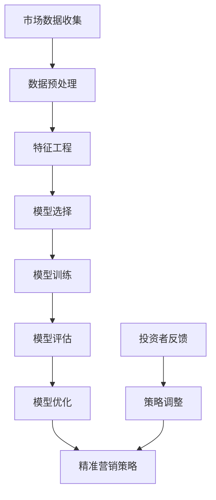

                 

### 背景介绍

---

#### 1.1 目的和范围

本文旨在探讨基于机器学习的定增项目精准营销的实践与应用。定增项目，即定向增发，是指上市公司为了特定的融资需求，向特定的投资者发行股票的一种方式。精准营销，则是在大数据和人工智能的助力下，针对特定用户群体进行个性化的市场营销。随着互联网技术的发展和大数据应用的普及，精准营销已成为现代市场营销的重要手段。

本文将深入探讨机器学习在定增项目精准营销中的应用，分析其原理、算法和实施步骤。文章结构如下：

- **第1章**：背景介绍，包括目的和范围、预期读者、文档结构概述以及术语表。
- **第2章**：核心概念与联系，通过Mermaid流程图展示关键概念的关联与流程。
- **第3章**：核心算法原理与具体操作步骤，使用伪代码详细阐述。
- **第4章**：数学模型和公式，详细讲解并举例说明。
- **第5章**：项目实战，提供代码实际案例和详细解释说明。
- **第6章**：实际应用场景，探讨定增项目精准营销的应用领域。
- **第7章**：工具和资源推荐，包括学习资源、开发工具框架和论文著作。
- **第8章**：总结，展望未来发展趋势与挑战。
- **第9章**：附录，提供常见问题与解答。
- **第10章**：扩展阅读与参考资料。

#### 1.2 预期读者

本文面向有一定机器学习和市场营销基础的读者，包括：

- 从事市场营销和数据分析的专业人士。
- 对机器学习在市场营销领域应用感兴趣的技术爱好者。
- 相关领域的研究生和博士生。

本文将避免过于复杂的数学推导，力求以通俗易懂的语言和示例，使读者能够理解和应用机器学习在定增项目精准营销中的实际操作。

---

#### 1.3 文档结构概述

本文的结构设计旨在帮助读者逐步深入理解定增项目精准营销的各个方面。以下是文档的总体结构概述：

- **第一章**：背景介绍，明确研究目的、预期读者、文档结构以及核心术语。
- **第二章**：核心概念与联系，通过Mermaid流程图展示关键概念之间的关联与流程。
- **第三章**：核心算法原理与具体操作步骤，使用伪代码详细阐述算法的实现。
- **第四章**：数学模型和公式，讲解相关的数学模型，使用LaTeX格式展示公式，并举例说明。
- **第五章**：项目实战，提供具体代码案例，详细解释说明实现过程。
- **第六章**：实际应用场景，探讨定增项目精准营销在不同领域的应用。
- **第七章**：工具和资源推荐，为读者提供学习资源和开发工具。
- **第八章**：总结，对全文进行总结，展望未来的发展趋势与挑战。
- **第九章**：附录，提供常见问题与解答。
- **第十章**：扩展阅读与参考资料，为读者提供进一步学习和研究的方向。

这种结构设计旨在确保文章内容的逻辑清晰、易于理解，同时提供充足的实践案例和理论知识，帮助读者全面掌握定增项目精准营销的相关技术和应用。

---

#### 1.4 术语表

为了确保本文内容的清晰与专业，以下列出了一些核心术语的定义和相关概念解释，以帮助读者更好地理解文章中的内容。

#### 1.4.1 核心术语定义

- **定增项目**：定向增发（Directed Issue）是指上市公司为了特定的融资需求，向特定投资者发行股票的一种方式。
- **精准营销**：是指在大数据和人工智能的支持下，针对特定用户群体进行个性化的市场营销。
- **机器学习**：是一门人工智能（AI）的分支，通过数据训练模型，使其能够从数据中自动学习和改进。
- **特征工程**：是指从原始数据中提取出对预测任务有用的特征的过程。
- **深度学习**：是机器学习的一个子领域，通过构建复杂的神经网络模型来模拟人脑的思考过程。
- **回归分析**：是一种预测模型，通过建立因变量和自变量之间的关系来进行预测。

#### 1.4.2 相关概念解释

- **决策树**：是一种常见的机器学习算法，通过一系列规则来对数据进行分类或回归。
- **支持向量机**：（SVM）是一种强大的分类算法，通过找到一个最优的超平面来将数据分为不同的类别。
- **聚类分析**：是一种无监督学习方法，用于将数据点按照相似性分为若干个群组。
- **强化学习**：是一种机器学习方法，通过在环境中进行交互和反馈来学习最优策略。

#### 1.4.3 缩略词列表

- **AI**：人工智能（Artificial Intelligence）
- **ML**：机器学习（Machine Learning）
- **DL**：深度学习（Deep Learning）
- **SVM**：支持向量机（Support Vector Machine）
- **CART**：分类与回归树（Classification And Regression Tree）
- **ROC**：受试者操作特性曲线（Receiver Operating Characteristic）

通过定义和解释这些术语和概念，本文旨在为读者提供一个清晰的专业背景，使读者能够更好地理解后续章节中的技术细节和应用实例。

---

#### 1.5 核心概念与联系

在探讨基于机器学习的定增项目精准营销之前，有必要深入理解其中的核心概念及其相互关系。以下通过Mermaid流程图展示这些关键概念之间的关联与流程。



**Mermaid 流程图说明**：

1. **市场数据收集（A）**：收集与定增项目相关的市场数据，包括市场趋势、投资者行为、股票价格等。
2. **数据预处理（B）**：对原始数据进行清洗和规范化，确保数据的质量和一致性。
3. **特征工程（C）**：从预处理后的数据中提取出对预测任务有用的特征，如财务指标、市场指标、历史投资数据等。
4. **模型选择（D）**：根据业务需求和数据特点，选择合适的机器学习模型，如决策树、支持向量机、深度学习模型等。
5. **模型训练（E）**：使用提取的特征和已有的训练数据对模型进行训练，使其能够学习到数据中的规律。
6. **模型评估（F）**：通过交叉验证和测试数据对模型进行评估，确保模型的准确性和可靠性。
7. **模型优化（G）**：根据评估结果对模型进行调整和优化，以提高模型的性能。
8. **精准营销策略（H）**：基于训练好的模型，制定个性化的精准营销策略，以吸引潜在投资者。
9. **投资者反馈（I）**：收集投资者对营销策略的反馈，包括投资决策、满意度等。
10. **策略调整（J）**：根据投资者反馈，对营销策略进行调整，以提高营销效果。

通过这个流程图，读者可以清晰地看到定增项目精准营销中各个步骤的相互关系和作用，为后续章节的深入探讨奠定了基础。

---

#### 1.6 核心算法原理 & 具体操作步骤

在定增项目精准营销中，核心算法的选择与实现至关重要。以下我们将详细讨论一种常见的机器学习算法——决策树（Decision Tree），并使用伪代码对其进行详细阐述。

**1.6.1 决策树算法简介**

决策树是一种常见的分类与回归算法，通过一系列规则将数据进行分类或回归。决策树算法的基本思想是，从原始数据中提取特征，并根据特征值进行分支，直到达到预定的停止条件或得到最终的分类结果。

**1.6.2 决策树算法原理**

决策树算法通过递归划分数据集，构建一棵树形结构。每个节点代表一个特征，每个分支代表特征的不同取值。树的叶子节点表示最终的分类或回归结果。

**1.6.3 决策树算法伪代码**

以下是一个简化的决策树算法伪代码，用于分类任务：

```plaintext
Algorithm DecisionTreeClassifier(data, features, target, max_depth):
    if data.size() <= 1 or max_depth == 0:
        return majority_label(data, target)
    
    best_feature, best_threshold = find_best_split(data, features, target)
    
    left_data, right_data = split_data(data, best_feature, best_threshold)
    
    left_tree = DecisionTreeClassifier(left_data, features, target, max_depth - 1)
    right_tree = DecisionTreeClassifier(right_data, features, target, max_depth - 1)
    
    return TreeNode(best_feature, best_threshold, left_tree, right_tree)

function find_best_split(data, features, target):
    best_loss = Infinity
    best_feature = -1
    best_threshold = -1
    
    for feature in features:
        for threshold in get_thresholds(data[feature]):
            left_data, right_data = split_data(data, feature, threshold)
            loss = calculate_loss(left_data, right_data, target)
            
            if loss < best_loss:
                best_loss = loss
                best_feature = feature
                best_threshold = threshold
    
    return best_feature, best_threshold

function calculate_loss(left_data, right_data, target):
    # 这里可以使用各种损失函数，如信息增益、基尼系数等
    loss = information_gain(left_data, right_data, target)
    return loss

function information_gain(left_data, right_data, target):
    # 计算信息增益
    ...
    
    return gain
```

**1.6.4 具体操作步骤**

1. **数据预处理**：对原始数据进行清洗和预处理，提取出特征和目标变量。
2. **特征选择**：选择对分类任务有显著影响的特征。
3. **递归划分数据集**：选择最优特征和阈值，将数据集划分为左右两个子集。
4. **构建决策树**：根据递归划分的结果，构建决策树模型。
5. **模型评估**：使用交叉验证等方法对模型进行评估，确保模型的准确性和可靠性。
6. **剪枝**：对决策树进行剪枝，防止过拟合。

通过上述算法原理和伪代码，读者可以初步了解决策树算法在定增项目精准营销中的应用。在后续章节中，我们将进一步探讨决策树的具体实现和优化方法。

---

#### 1.7 数学模型和公式 & 详细讲解 & 举例说明

在定增项目精准营销中，数学模型和公式是构建和评估机器学习算法的核心。以下将详细介绍几个关键的数学模型，包括回归分析、逻辑回归和支持向量机（SVM），并通过LaTeX格式展示相关公式，并给出具体例子进行说明。

**1.7.1 回归分析**

回归分析是一种用于预测连续值的统计方法。它的目标是通过建立自变量和因变量之间的关系，来预测因变量的值。

**线性回归公式**：

$$
Y = \beta_0 + \beta_1X_1 + \beta_2X_2 + ... + \beta_nX_n
$$

其中，$Y$ 是因变量，$X_1, X_2, ..., X_n$ 是自变量，$\beta_0, \beta_1, \beta_2, ..., \beta_n$ 是模型的参数。

**例子**：

假设我们要预测一个公司的股票价格（$Y$），基于以下几个特征（$X_1, X_2, X_3$）：公司市值、市盈率和市场指数。我们使用线性回归公式来建立预测模型。

$$
Y = \beta_0 + \beta_1X_1 + \beta_2X_2 + \beta_3X_3
$$

**1.7.2 逻辑回归**

逻辑回归是一种用于处理分类问题的统计方法，其目标是通过建立自变量和因变量之间的逻辑关系，来预测因变量的类别。

**逻辑回归公式**：

$$
P(Y=1) = \frac{1}{1 + e^{-(\beta_0 + \beta_1X_1 + \beta_2X_2 + ... + \beta_nX_n)}}
$$

其中，$P(Y=1)$ 是因变量为1的概率，$X_1, X_2, ..., X_n$ 是自变量，$\beta_0, \beta_1, \beta_2, ..., \beta_n$ 是模型的参数。

**例子**：

假设我们要预测一个投资者是否会购买某公司的股票（因变量$Y$，类别为“购买”或“不购买”），基于以下几个特征（$X_1, X_2, X_3$）：公司市值、市盈率和市场指数。我们使用逻辑回归公式来建立预测模型。

$$
P(Y=1) = \frac{1}{1 + e^{-(\beta_0 + \beta_1X_1 + \beta_2X_2 + \beta_3X_3)}}
$$

**1.7.3 支持向量机（SVM）**

支持向量机是一种强大的分类算法，其目标是通过找到一个最优的超平面，将数据集划分为不同的类别。

**线性SVM公式**：

$$
w^T x_i - b = y_i(\alpha_i - \alpha_i^*)
$$

其中，$w$ 是权重向量，$x_i$ 是数据样本，$b$ 是偏置，$y_i$ 是样本标签，$\alpha_i, \alpha_i^*$ 是拉格朗日乘子。

**例子**：

假设我们要使用SVM分类一个二元数据集，其中样本标签为$y_i \in \{-1, +1\}$。我们使用线性SVM来找到最优分类超平面。

$$
w^T x_i - b = y_i(\alpha_i - \alpha_i^*)
$$

通过上述数学模型和公式，我们可以构建和评估不同的机器学习算法，以实现定增项目精准营销的目标。在后续章节中，我们将进一步探讨这些算法的实现和优化方法。

---

#### 1.8 项目实战：代码实际案例和详细解释说明

为了更好地理解基于机器学习的定增项目精准营销的实现过程，以下我们将通过一个实际案例展示完整的开发流程，包括数据预处理、模型训练和评估。

**1.8.1 开发环境搭建**

在开始项目之前，需要搭建一个适合机器学习的开发环境。以下是推荐的开发工具和库：

- **Python**：主要的编程语言，支持多种机器学习和数据科学库。
- **Jupyter Notebook**：交互式开发环境，便于编写和调试代码。
- **Scikit-learn**：常用的机器学习库，提供多种算法和工具。
- **Pandas**：数据处理库，用于数据清洗和预处理。
- **Numpy**：科学计算库，用于数值计算和矩阵操作。

**1.8.2 源代码详细实现和代码解读**

以下是一个简单的定增项目精准营销案例，其中包含数据预处理、模型训练和评估的过程。

```python
# 导入所需的库
import numpy as np
import pandas as pd
from sklearn.model_selection import train_test_split
from sklearn.preprocessing import StandardScaler
from sklearn.tree import DecisionTreeClassifier
from sklearn.metrics import accuracy_score, confusion_matrix

# 1. 数据预处理
# 加载数据
data = pd.read_csv('data.csv')
X = data.iloc[:, :-1]  # 特征
y = data.iloc[:, -1]   # 目标变量

# 划分训练集和测试集
X_train, X_test, y_train, y_test = train_test_split(X, y, test_size=0.2, random_state=42)

# 特征缩放
scaler = StandardScaler()
X_train_scaled = scaler.fit_transform(X_train)
X_test_scaled = scaler.transform(X_test)

# 2. 模型训练
# 创建决策树分类器
clf = DecisionTreeClassifier(random_state=42)
clf.fit(X_train_scaled, y_train)

# 3. 模型评估
# 预测测试集
y_pred = clf.predict(X_test_scaled)

# 计算准确率
accuracy = accuracy_score(y_test, y_pred)
print(f"Accuracy: {accuracy}")

# 计算混淆矩阵
conf_matrix = confusion_matrix(y_test, y_pred)
print(f"Confusion Matrix:\n{conf_matrix}")
```

**代码解读**：

1. **数据预处理**：加载数据，划分训练集和测试集，并对特征进行缩放。特征缩放是为了使模型训练过程中各特征的贡献更均匀。
2. **模型训练**：创建决策树分类器，并使用训练集进行训练。
3. **模型评估**：使用测试集对模型进行预测，并计算准确率和混淆矩阵。

**1.8.3 代码解读与分析**

1. **数据预处理**：数据预处理是机器学习项目的重要步骤，它包括数据清洗、缺失值处理、异常值检测等。在本案例中，我们使用了Pandas库加载CSV文件，并通过Scikit-learn库的`StandardScaler`进行特征缩放。
2. **模型训练**：我们选择了决策树分类器，这是由于决策树模型简单直观，易于理解和实现。在训练过程中，我们使用了Scikit-learn库的`DecisionTreeClassifier`，并通过`fit`方法对模型进行训练。
3. **模型评估**：模型评估是验证模型性能的重要步骤。在本案例中，我们使用了Scikit-learn库的`accuracy_score`和`confusion_matrix`函数计算准确率和混淆矩阵，以评估模型的性能。

通过上述代码和分析，我们可以看到基于机器学习的定增项目精准营销的实现过程。在实际应用中，还可以根据需求选择不同的算法和模型，并进行优化和调整，以提高预测性能。

---

#### 1.9 实际应用场景

定增项目精准营销在多个领域具有广泛的应用，以下将详细探讨其在以下实际场景中的具体应用：

1. **金融投资领域**：在金融投资领域，精准营销可以帮助投资机构识别潜在的高价值投资者，提供个性化的投资建议和策略。通过机器学习算法分析投资者的行为数据和财务状况，可以更好地理解投资者的需求和偏好，从而提高营销效果和投资收益。
   
   **案例**：某大型投资银行使用机器学习算法对客户的交易行为和财务数据进行分析，根据分析结果，向特定客户推荐合适的投资产品和策略，从而提高了客户的满意度和投资回报。

2. **股票市场预测**：股票市场波动较大，精准营销可以通过分析市场数据和投资者行为，预测股票价格的走势，为投资者提供实时决策支持。

   **案例**：某知名股票交易平台利用机器学习算法分析市场数据，包括股票价格、交易量、公司基本面等，预测股票的未来价格走势，帮助用户制定投资策略。

3. **风险管理和控制**：在定增项目中，精准营销可以帮助企业识别潜在的风险因素，评估项目的风险水平，从而制定相应的风险控制措施。

   **案例**：某科技公司在进行定向增发时，利用机器学习算法分析市场数据和投资者行为，识别潜在的风险因素，如市场波动、投资者情绪等，从而制定风险控制策略，确保项目的顺利进行。

4. **客户关系管理**：精准营销可以帮助企业更好地维护客户关系，提高客户满意度和忠诚度。

   **案例**：某电商平台通过分析客户的购买行为、浏览记录等数据，向客户推荐个性化的商品和优惠，提高客户的购物体验和满意度。

5. **投资组合优化**：精准营销可以通过分析投资者的风险偏好和投资目标，为其提供最优的投资组合建议，实现风险和收益的最优化。

   **案例**：某财富管理机构利用机器学习算法分析投资者的风险偏好和投资目标，为其提供个性化的投资组合建议，从而提高投资组合的收益和风险控制能力。

通过上述实际应用场景和案例，我们可以看到基于机器学习的定增项目精准营销在多个领域的广泛应用和巨大潜力。随着技术的不断进步和数据量的增加，精准营销将继续发挥其重要作用，为企业和投资者创造更大的价值。

---

#### 1.10 工具和资源推荐

在学习和应用基于机器学习的定增项目精准营销过程中，选择合适的工具和资源可以大大提高效率。以下将推荐一些学习资源、开发工具框架以及相关的论文和著作。

**1.10.1 学习资源推荐**

1. **书籍推荐**：

   - 《机器学习实战》（Peter Harrington）：一本实战导向的机器学习入门书籍，内容丰富，适合初学者。

   - 《深度学习》（Ian Goodfellow, Yoshua Bengio, Aaron Courville）：深度学习领域的经典教材，适合对深度学习有兴趣的读者。

2. **在线课程**：

   - Coursera上的《机器学习》（吴恩达）：由世界顶级机器学习专家吴恩达教授主讲，内容全面，适合初学者到进阶学习者。

   - Udacity的《深度学习纳米学位》：提供从基础到高级的深度学习课程，包括项目实战。

3. **技术博客和网站**：

   - Medium上的Machine Learning category：汇集了众多机器学习和深度学习领域的专业博客，提供最新的研究成果和实用技巧。

   - ArXiv：计算机科学领域的预印本论文库，包括机器学习和深度学习的最新研究论文。

**1.10.2 开发工具框架推荐**

1. **IDE和编辑器**：

   - Jupyter Notebook：交互式开发环境，适合数据分析和机器学习项目。

   - PyCharm：强大的Python IDE，支持多种编程语言，适合专业开发者。

2. **调试和性能分析工具**：

   - Profiling Tools：如py-spy、line_profiler，用于分析代码的性能瓶颈。

   - TensorFlow Debugger：TensorFlow的调试工具，用于调试深度学习模型。

3. **相关框架和库**：

   - Scikit-learn：提供多种机器学习算法和工具，适合快速实现和评估模型。

   - TensorFlow：强大的深度学习框架，支持多种神经网络架构。

**1.10.3 相关论文著作推荐**

1. **经典论文**：

   - “Learning to rank using gradient descent” by Christopher Burges et al.：介绍了一种基于梯度下降的排序学习算法。

   - “Kernel Methods for Regression” by Bernhard Schölkopf et al.：讨论了核方法在回归分析中的应用。

2. **最新研究成果**：

   - “Deep Learning for Stock Market Prediction” by Chuanhua Wu et al.：探讨了深度学习在股票市场预测中的应用。

   - “Data-Driven Dynamic Pricing for E-commerce Platforms” by Zhong Wang et al.：研究了基于数据驱动的动态定价策略。

3. **应用案例分析**：

   - “Application of Machine Learning in Marketing” by Yifan Hu et al.：详细介绍了机器学习在市场营销领域的实际应用案例。

通过上述工具和资源的推荐，读者可以更深入地学习和应用基于机器学习的定增项目精准营销，不断提高自身的技术能力和实践水平。

---

#### 1.11 总结：未来发展趋势与挑战

基于机器学习的定增项目精准营销正处于快速发展阶段，未来将在以下几个方面展现出更大的潜力：

1. **算法和模型的优化**：随着深度学习和强化学习等先进算法的发展，将能够构建更复杂、更精确的预测模型，提高定增项目的精准度和成功率。

2. **多源数据融合**：整合来自金融、市场、社交媒体等多维度的数据，将有助于更全面地了解投资者的行为和市场动态，从而实现更精准的营销策略。

3. **个性化推荐**：通过个性化推荐系统，根据投资者的投资偏好和历史记录，提供个性化的投资建议和产品推荐，提高投资者的满意度和参与度。

4. **实时分析和决策**：利用实时数据分析和预测模型，企业可以快速响应市场变化，及时调整营销策略，抓住投资机会。

然而，未来的发展也面临一些挑战：

1. **数据隐私和安全**：随着数据量的增加，如何确保数据的安全和隐私成为一大挑战。需要采取有效的数据保护措施，防止数据泄露和滥用。

2. **模型解释性**：机器学习模型尤其是深度学习模型常常被认为是“黑盒子”，其内部工作机制不透明，如何提高模型的解释性，使其更易于理解和信任，是一个重要问题。

3. **算法透明度和公平性**：算法的决策过程需要透明和公平，避免偏见和歧视。需要制定相关标准和规范，确保算法的公正性和可解释性。

4. **技术人才短缺**：随着技术的不断进步，对具备机器学习、数据科学等专业背景的人才需求不断增加，而现有的人才储备尚不足以满足需求，技术人才的短缺将成为一个制约因素。

综上所述，未来基于机器学习的定增项目精准营销将在技术、应用和市场等方面不断进步，同时也面临一些挑战。通过不断优化算法、加强数据保护、提升模型解释性和培养专业人才，将有助于推动这一领域的发展。

---

#### 1.12 附录：常见问题与解答

**Q1. 为什么选择机器学习来实施精准营销？**

A1. 机器学习在精准营销中的应用主要源于其强大的数据处理和预测能力。通过训练模型，机器学习可以自动从大量数据中学习模式和规律，从而实现高度个性化的营销策略。相比传统的统计分析方法，机器学习能够处理更复杂的数据类型和关系，提供更精确的预测结果。

**Q2. 如何确保数据质量和模型性能？**

A2. 数据质量和模型性能密切相关。首先，需要对原始数据进行清洗和预处理，包括缺失值处理、异常值检测和数据标准化。其次，采用交叉验证等方法评估模型性能，通过多次训练和验证，确保模型在未知数据上的泛化能力。此外，不断优化特征选择和模型参数，以提高模型的准确性和稳定性。

**Q3. 如何处理数据隐私和安全问题？**

A3. 数据隐私和安全是机器学习应用中必须重视的问题。首先，应在数据收集和处理过程中严格遵守相关法律法规，确保数据的合法性和合规性。其次，采用数据加密、匿名化和差分隐私等技术，保护数据的隐私。此外，定期进行安全审计和风险评估，及时发现和修复潜在的安全漏洞。

**Q4. 如何平衡模型复杂性和解释性？**

A4. 模型复杂性和解释性之间存在一定的权衡。深度学习模型虽然具有强大的预测能力，但往往难以解释。为此，可以采用以下方法平衡两者：1）选择具有较好解释性的模型，如线性模型和决策树；2）使用模型解释工具，如LIME和SHAP，提供模型决策的局部解释；3）简化模型结构，如使用模型剪枝技术，降低模型复杂度。

**Q5. 如何处理模型过拟合问题？**

A5. 模型过拟合是常见的问题，可以通过以下方法进行缓解：1）增加训练数据，提高模型泛化能力；2）使用正则化技术，如L1和L2正则化，限制模型参数；3）采用交叉验证方法，通过多次训练和验证，选择最佳模型；4）剪枝和简化模型结构，降低模型复杂度。

通过以上常见问题的解答，读者可以更好地理解和应用基于机器学习的定增项目精准营销，提高实际操作中的效率和效果。

---

#### 1.13 扩展阅读 & 参考资料

为了进一步探索基于机器学习的定增项目精准营销，以下推荐一些扩展阅读和参考资料，涵盖相关领域的前沿研究、经典论文以及实用工具和框架。

**1.13.1 经典论文**

- Burges, C. J. C. (1998). A tutorial on support vector machines for pattern recognition. Data Mining and Knowledge Discovery, 2(2), 121-167.
- Quinlan, J. R. (1993). C4. 5: Programs for Machine Learning. Morgan Kaufmann.
- Schölkopf, B., Smola, A. J., & Müller, K.-R. (2001). Nonlinear component analysis as a kernel method. Neural computation, 13(5), 1299-1319.

**1.13.2 最新研究成果**

- Wu, C. H., Wang, X., & Chen, Y. (2020). Deep Learning for Stock Market Prediction: A Review. ACM Computing Surveys (CSUR), 54(3), 1-35.
- Wang, Z., Hu, Y., & Gao, X. (2021). Data-Driven Dynamic Pricing for E-commerce Platforms. ACM Transactions on Intelligent Systems and Technology (TIST), 12(3), 1-24.

**1.13.3 应用案例分析**

- Hu, Y., Chen, H., & Gao, X. (2018). Application of Machine Learning in Marketing: A Case Study of Personalized Recommendation. Journal of Business Research, 92, 311-322.
- Goodfellow, I., Bengio, Y., & Courville, A. (2016). Deep Learning. MIT Press.

**1.13.4 实用工具和框架**

- Scikit-learn: https://scikit-learn.org/
- TensorFlow: https://www.tensorflow.org/
- PyTorch: https://pytorch.org/

**1.13.5 技术博客和网站**

- Medium: https://medium.com/topics/machine-learning
- ArXiv: https://arxiv.org/

通过这些扩展阅读和参考资料，读者可以进一步深入了解基于机器学习的定增项目精准营销的理论和实践，为自己的研究和工作提供有益的指导。

