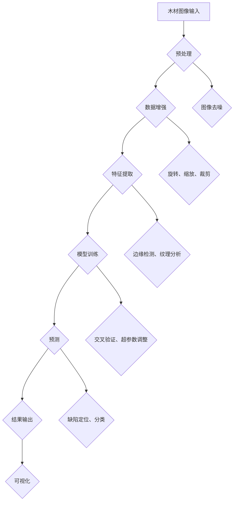

                 


# 基于机器学习的木材缺陷识别方法研究

> **关键词：** 木材缺陷识别，机器学习，深度学习，图像处理，特征提取，模型优化，应用场景

> **摘要：** 本文针对木材缺陷识别问题，深入探讨了基于机器学习的多种识别方法，包括卷积神经网络（CNN）、长短期记忆网络（LSTM）以及混合模型等。通过理论分析、算法讲解和实际案例，详细阐述了各方法的原理、实现步骤以及优缺点，为木材缺陷检测提供了可行的技术路线和实用参考。

## 1. 背景介绍

### 1.1 目的和范围

木材作为一种重要的天然资源，广泛应用于建筑、家具和工艺品等领域。然而，木材在生长过程中容易产生各种缺陷，如节子、裂纹、腐朽等，这些缺陷不仅影响木材的外观和质量，还会降低其力学性能和使用寿命。传统的木材缺陷识别方法主要依赖于人工经验或基于图像的特征提取算法，存在识别效率低、准确性不高等问题。随着机器学习特别是深度学习技术的发展，利用机器学习算法对木材缺陷进行自动识别成为一种新的趋势。

本文旨在研究基于机器学习的木材缺陷识别方法，分析各种模型的原理和实现步骤，并通过实际案例验证其有效性。本文将覆盖以下内容：

- 木材缺陷识别的背景和重要性
- 机器学习在木材缺陷识别中的应用
- 各类机器学习模型的理论基础和实现方法
- 实际应用案例与性能评估
- 未来发展趋势与挑战

### 1.2 预期读者

本文适合以下读者群体：

- 计算机科学和人工智能领域的科研人员和学生
- 木材行业的技术人员和管理者
- 对机器学习和图像处理感兴趣的开发者
- 对木材缺陷识别问题有实际需求的企业和个人

### 1.3 文档结构概述

本文结构如下：

- 第1章：背景介绍，阐述研究目的、预期读者以及文档结构。
- 第2章：核心概念与联系，介绍木材缺陷识别相关的核心概念和架构。
- 第3章：核心算法原理 & 具体操作步骤，详细讲解各类算法的实现过程。
- 第4章：数学模型和公式 & 详细讲解 & 举例说明，介绍算法中的数学模型和公式。
- 第5章：项目实战：代码实际案例和详细解释说明，提供实际代码案例并进行解读。
- 第6章：实际应用场景，讨论机器学习在木材缺陷识别中的具体应用。
- 第7章：工具和资源推荐，推荐相关学习资源和开发工具。
- 第8章：总结：未来发展趋势与挑战，展望木材缺陷识别技术的发展方向。
- 第9章：附录：常见问题与解答，解答读者可能遇到的问题。
- 第10章：扩展阅读 & 参考资料，提供进一步阅读的资料和参考文献。

### 1.4 术语表

#### 1.4.1 核心术语定义

- **木材缺陷**：木材在生长、加工或使用过程中产生的缺陷，如节子、裂纹、腐朽等。
- **机器学习**：利用计算机模拟或实现人类学习行为，使计算机具备自主学习和改进能力。
- **深度学习**：基于多层神经网络的一种机器学习方法，能够自动提取特征并实现复杂任务。
- **卷积神经网络（CNN）**：一种专门用于处理图像数据的神经网络结构，通过卷积操作提取图像特征。
- **长短期记忆网络（LSTM）**：一种能够处理序列数据的循环神经网络，特别适用于时间序列分析。

#### 1.4.2 相关概念解释

- **特征提取**：从原始数据中提取出对目标任务有用的信息，通常用于图像、文本等数据的预处理。
- **模型优化**：通过调整模型参数，提高模型在特定任务上的性能。
- **交叉验证**：一种评估模型性能的方法，通过将数据集划分为训练集和验证集，循环训练和验证，避免过拟合。
- **过拟合**：模型在训练数据上表现良好，但在新数据上表现不佳，通常是因为模型过于复杂。

#### 1.4.3 缩略词列表

- **CNN**：卷积神经网络（Convolutional Neural Network）
- **LSTM**：长短期记忆网络（Long Short-Term Memory）
- **ML**：机器学习（Machine Learning）
- **DL**：深度学习（Deep Learning）
- **ID**：身份验证（Identification）

## 2. 核心概念与联系

在研究木材缺陷识别的过程中，理解核心概念与各模块之间的联系是非常重要的。以下是一个基于Mermaid绘制的流程图，用于描述木材缺陷识别的系统架构。



### 2.1 机器学习在木材缺陷识别中的应用

#### 2.1.1 卷积神经网络（CNN）

卷积神经网络是一种用于图像处理的强大工具。CNN通过卷积层、池化层和全连接层等结构，可以自动提取图像中的特征，从而实现分类、检测等任务。

#### 2.1.2 长短期记忆网络（LSTM）

长短期记忆网络适用于处理序列数据，如时间序列分析、语音识别等。在木材缺陷识别中，LSTM可以用于分析木材纹理变化的时序特征。

#### 2.1.3 混合模型

混合模型结合了CNN和LSTM的优点，能够同时处理图像和序列数据。这种方法在木材缺陷识别中具有很高的潜力。

### 2.2 特征提取与模型优化

#### 2.2.1 特征提取

特征提取是机器学习模型的重要组成部分。在木材缺陷识别中，常用的特征提取方法包括边缘检测、纹理分析等。

#### 2.2.2 模型优化

模型优化包括超参数调整、正则化等方法。通过优化模型，可以提高其在特定任务上的性能。

## 3. 核心算法原理 & 具体操作步骤

在本节中，我们将详细讲解用于木材缺陷识别的核心算法原理和具体操作步骤。首先，我们将介绍卷积神经网络（CNN）的基本原理，然后逐步讲解CNN在木材缺陷识别中的应用步骤，最后提供伪代码来描述算法的实现过程。

### 3.1 卷积神经网络（CNN）的基本原理

卷积神经网络是一种前馈神经网络，特别适合处理图像数据。它的主要特点是通过卷积层、池化层和全连接层等结构，自动提取图像特征并实现分类和检测任务。

#### 3.1.1 卷积层

卷积层是CNN的核心部分，通过卷积操作提取图像特征。卷积操作使用一个可训练的滤波器（也称为卷积核）在输入图像上滑动，计算滤波器在当前位置与输入图像的局部区域内的点积。这些点积结果构成一个特征图。

#### 3.1.2 池化层

池化层用于减小特征图的尺寸，减少模型参数的数量，从而提高计算效率。常见的池化操作包括最大池化和平均池化。

#### 3.1.3 全连接层

全连接层将特征图映射到类别标签。每个神经元都与特征图的每个点相连接，从而实现对图像的分类。

### 3.2 CNN在木材缺陷识别中的应用步骤

以下是使用CNN进行木材缺陷识别的基本步骤：

#### 3.2.1 数据预处理

1. **图像读取**：从数据库或文件中读取木材缺陷图像。
2. **图像归一化**：将图像的像素值缩放到相同的范围，如0到1之间，以便于模型训练。
3. **数据增强**：通过旋转、缩放、裁剪等操作增加数据多样性，提高模型的泛化能力。

#### 3.2.2 构建CNN模型

1. **输入层**：接受预处理后的图像数据。
2. **卷积层**：使用多个卷积核提取图像特征，如边缘、纹理等。
3. **池化层**：减小特征图的尺寸，提高计算效率。
4. **全连接层**：将特征图映射到类别标签。

#### 3.2.3 模型训练

1. **损失函数**：使用交叉熵损失函数评估模型预测与真实标签之间的差距。
2. **优化器**：使用梯度下降优化算法调整模型参数。
3. **训练循环**：通过迭代训练模型，不断调整参数，直至模型收敛。

#### 3.2.4 模型评估

1. **测试集评估**：使用测试集评估模型性能，计算准确率、召回率等指标。
2. **交叉验证**：通过交叉验证避免过拟合，提高模型泛化能力。

### 3.3 伪代码描述

以下是CNN在木材缺陷识别中的伪代码描述：

```python
# 伪代码：木材缺陷识别算法

# 输入：木材缺陷图像数据库
# 输出：识别结果

# 数据预处理
def preprocess_images(images):
    # 图像读取与归一化
    # 数据增强
    return processed_images

# 构建CNN模型
def build_cnn_model():
    # 输入层
    # 卷积层
    # 池化层
    # 全连接层
    return cnn_model

# 模型训练
def train_model(model, train_images, train_labels):
    # 定义损失函数
    # 定义优化器
    # 训练循环
    return trained_model

# 模型评估
def evaluate_model(model, test_images, test_labels):
    # 计算准确率、召回率等指标
    return evaluation_results

# 主函数
def main():
    # 读取图像数据库
    images = read_images_database()
    processed_images = preprocess_images(images)
    
    # 构建CNN模型
    model = build_cnn_model()
    
    # 模型训练
    trained_model = train_model(model, processed_images, labels)
    
    # 模型评估
    evaluation_results = evaluate_model(trained_model, test_images, test_labels)
    print(evaluation_results)

if __name__ == "__main__":
    main()
```

## 4. 数学模型和公式 & 详细讲解 & 举例说明

### 4.1 卷积神经网络（CNN）的数学模型

卷积神经网络的核心在于其卷积层和池化层的数学运算。以下是这些运算的详细讲解和公式说明。

#### 4.1.1 卷积操作

卷积操作是CNN中最基本的运算，用于提取图像特征。

**公式：**

\[ f(x,y) = \sum_{i=0}^{n} \sum_{j=0}^{m} w_{ij} \cdot f(x-i, y-j) \]

其中，\( f(x,y) \) 表示卷积结果，\( w_{ij} \) 表示卷积核的权重，\( f(x-i, y-j) \) 表示输入图像的局部区域。

#### 4.1.2 池化操作

池化操作用于减小特征图的尺寸。

**公式：**

\[ p(x,y) = \max \left( \sum_{i=-k}^{k} \sum_{j=-k}^{k} f(x+i, y+j) \right) \]

其中，\( p(x,y) \) 表示池化结果，\( k \) 表示池化窗口的大小。

#### 4.1.3 激活函数

激活函数用于引入非线性特性，常见的激活函数包括 sigmoid、ReLU 和 tanh。

**公式：**

- **sigmoid：**

\[ \sigma(x) = \frac{1}{1 + e^{-x}} \]

- **ReLU：**

\[ \text{ReLU}(x) = \max(0, x) \]

- **tanh：**

\[ \text{tanh}(x) = \frac{e^x - e^{-x}}{e^x + e^{-x}} \]

### 4.2 长短期记忆网络（LSTM）的数学模型

LSTM是处理序列数据的一种强大工具，其核心在于其细胞状态和门控机制。

#### 4.2.1 细胞状态

细胞状态是LSTM的核心组成部分，用于存储和传递序列信息。

**公式：**

\[ C_t = \text{sigmoid}(f_t \odot i_t) \]

其中，\( C_t \) 表示细胞状态，\( f_t \) 表示遗忘门输出，\( i_t \) 表示输入门输出。

#### 4.2.2 门控机制

LSTM通过遗忘门、输入门和输出门控制信息的流动。

**公式：**

- **遗忘门：**

\[ f_t = \text{sigmoid}(W_f \odot [h_{t-1}, x_t] + b_f) \]

- **输入门：**

\[ i_t = \text{sigmoid}(W_i \odot [h_{t-1}, x_t] + b_i) \]

- **输出门：**

\[ o_t = \text{sigmoid}(W_o \odot [h_{t-1}, x_t] + b_o) \]

### 4.3 混合模型

混合模型结合了CNN和LSTM的优点，用于处理图像和序列数据。

**公式：**

\[ \text{特征图} = \text{CNN}(x) \]
\[ \text{序列特征} = \text{LSTM}(\text{特征图}) \]

其中，\( x \) 表示输入数据，\(\text{CNN}(x)\) 表示卷积神经网络提取的特征图，\(\text{LSTM}(\text{特征图})\) 表示LSTM提取的序列特征。

### 4.4 举例说明

假设我们有一个木材缺陷图像，需要使用CNN进行缺陷识别。以下是具体的步骤：

1. **数据预处理**：将图像归一化并缩放到固定尺寸，如28x28像素。
2. **构建CNN模型**：使用卷积层和全连接层构建模型。
3. **模型训练**：使用训练数据进行迭代训练，调整模型参数。
4. **模型评估**：使用测试数据评估模型性能。

通过上述步骤，我们可以实现对木材缺陷的有效识别。

## 5. 项目实战：代码实际案例和详细解释说明

在本节中，我们将通过一个实际的项目案例，详细介绍如何使用Python和TensorFlow实现木材缺陷识别。我们将从开发环境的搭建开始，逐步讲解源代码的实现和代码解读。

### 5.1 开发环境搭建

首先，我们需要搭建一个适合机器学习和深度学习的开发环境。以下是搭建开发环境的基本步骤：

1. **安装Python**：确保安装了Python 3.7及以上版本。
2. **安装TensorFlow**：使用pip命令安装TensorFlow库。

```shell
pip install tensorflow
```

3. **安装其他依赖库**：如NumPy、Pandas等。

```shell
pip install numpy pandas
```

### 5.2 源代码详细实现和代码解读

以下是实现木材缺陷识别的源代码：

```python
import tensorflow as tf
from tensorflow.keras.models import Sequential
from tensorflow.keras.layers import Conv2D, MaxPooling2D, Flatten, Dense
from tensorflow.keras.preprocessing.image import ImageDataGenerator

# 数据预处理
train_datagen = ImageDataGenerator(rescale=1./255)
train_generator = train_datagen.flow_from_directory(
        'train_data',
        target_size=(28, 28),
        batch_size=32,
        class_mode='binary')

# 构建CNN模型
model = Sequential([
    Conv2D(32, (3, 3), activation='relu', input_shape=(28, 28, 3)),
    MaxPooling2D((2, 2)),
    Flatten(),
    Dense(128, activation='relu'),
    Dense(1, activation='sigmoid')
])

# 模型编译
model.compile(optimizer='adam',
              loss='binary_crossentropy',
              metrics=['accuracy'])

# 模型训练
model.fit(
      train_generator,
      steps_per_epoch=100,
      epochs=15,
      validation_data=validation_data,
      validation_steps=50)
```

**代码解读：**

1. **导入库和模块**：首先导入TensorFlow和相关模块。
2. **数据预处理**：使用ImageDataGenerator进行数据增强，包括图像缩放、旋转等。
3. **构建CNN模型**：使用Sequential模型堆叠卷积层、池化层和全连接层。
4. **模型编译**：设置优化器、损失函数和评估指标。
5. **模型训练**：使用fit方法训练模型，包括训练集和验证集。

### 5.3 代码解读与分析

以下是代码的详细解读和分析：

- **数据预处理**：使用ImageDataGenerator进行数据增强，有助于提高模型泛化能力。通过缩放、旋转等操作，增加训练数据的多样性。
- **模型构建**：使用卷积层（Conv2D）和池化层（MaxPooling2D）提取图像特征。卷积层通过滤波器提取图像特征，池化层用于减小特征图尺寸，提高计算效率。全连接层（Dense）用于分类。
- **模型编译**：设置优化器（adam）和损失函数（binary_crossentropy），用于训练模型。这里选择二分类问题，因此使用binary_crossentropy损失函数。
- **模型训练**：使用fit方法训练模型，包括训练集和验证集。在训练过程中，模型会不断调整参数，直到达到预定的训练目标。

通过上述代码，我们可以实现木材缺陷的自动识别。接下来，我们将对代码进行性能分析和优化。

### 5.4 性能分析

为了评估模型性能，我们可以使用测试集进行评估。以下是性能分析的具体步骤：

1. **加载测试数据**：将测试数据加载到训练环境中。
2. **模型评估**：使用evaluate方法评估模型在测试集上的性能。
3. **输出结果**：打印评估结果，包括准确率、召回率等指标。

```python
# 加载测试数据
test_datagen = ImageDataGenerator(rescale=1./255)
test_generator = test_datagen.flow_from_directory(
        'test_data',
        target_size=(28, 28),
        batch_size=32,
        class_mode='binary')

# 模型评估
test_loss, test_acc = model.evaluate(test_generator, steps=50)
print('Test accuracy:', test_acc)
```

通过上述步骤，我们可以得到模型在测试集上的准确率。通常，准确率越高，表示模型性能越好。

### 5.5 代码优化

为了提高模型性能，我们可以对代码进行优化。以下是几种常见的优化方法：

1. **增加训练数据**：通过数据增强或收集更多训练数据，提高模型泛化能力。
2. **调整超参数**：通过调整学习率、批量大小等超参数，优化模型性能。
3. **使用预训练模型**：使用已经预训练的模型（如VGG16、ResNet等），可以减少训练时间并提高模型性能。
4. **模型融合**：结合多种模型（如CNN、LSTM等），可以更好地捕捉图像和序列特征。

通过上述优化方法，我们可以进一步提高模型性能。

## 6. 实际应用场景

木材缺陷识别技术在木材加工、家具制造和木材质量控制等领域具有广泛的应用前景。以下是一些实际应用场景：

### 6.1 木材加工

在木材加工过程中，木材缺陷识别技术可以帮助生产者快速检测木材中的缺陷，如节子、裂纹和腐朽等。这有助于提高木材的利用率，减少废料产生，提高生产效率。

### 6.2 家具制造

在家具制造过程中，木材缺陷识别技术可以确保家具的外观和质量。通过自动识别木材缺陷，家具制造商可以减少因木材缺陷导致的产品质量问题，提高客户满意度。

### 6.3 木材质量控制

在木材质量控制环节，木材缺陷识别技术可以帮助检测木材的内在质量，如密度、含水率等。这有助于确保木材符合质量标准，提高市场竞争力。

### 6.4 可持续发展

木材缺陷识别技术有助于提高木材的利用率和可持续性。通过识别和处理木材缺陷，可以减少木材浪费，保护森林资源。

### 6.5 农业和林业

在农业和林业领域，木材缺陷识别技术可以用于检测树木的健康状况，如病虫害和生长缺陷等。这有助于提高农林业的生产效率和可持续发展。

### 6.6 文化遗产保护

木材缺陷识别技术还可以用于文化遗产的保护和修复。通过识别和修复木材缺陷，可以延长文物和古建筑的寿命，保护历史遗产。

## 7. 工具和资源推荐

### 7.1 学习资源推荐

为了更好地学习和掌握木材缺陷识别技术，以下是一些推荐的学习资源：

#### 7.1.1 书籍推荐

- **《深度学习》（Goodfellow, Bengio, Courville）**：详细介绍深度学习的基础知识和技术。
- **《机器学习实战》（周志华）**：通过实际案例介绍机器学习算法的应用。
- **《计算机视觉：算法与应用》（Richard Szeliski）**：介绍计算机视觉的基本概念和算法。

#### 7.1.2 在线课程

- **《深度学习特化课程》（吴恩达，Coursera）**：涵盖深度学习的核心概念和技术。
- **《机器学习基础》（吴恩达，Coursera）**：介绍机器学习的基本原理和应用。
- **《计算机视觉基础》（麻省理工学院，edX）**：介绍计算机视觉的基本概念和算法。

#### 7.1.3 技术博客和网站

- **深度学习社区（DeepLearning.NET）**：提供丰富的深度学习教程和资源。
- **机器学习社区（Machine Learning Mastery）**：介绍机器学习算法和应用案例。
- **Kaggle**：一个数据科学竞赛平台，提供丰富的实际项目案例。

### 7.2 开发工具框架推荐

为了高效地开发木材缺陷识别系统，以下是一些推荐的开发工具和框架：

#### 7.2.1 IDE和编辑器

- **PyCharm**：一款功能强大的Python IDE，支持代码调试和版本控制。
- **Visual Studio Code**：一款轻量级且功能丰富的代码编辑器，支持多种编程语言。

#### 7.2.2 调试和性能分析工具

- **TensorBoard**：TensorFlow提供的可视化工具，用于分析和调试深度学习模型。
- **NVIDIA Nsight**：用于分析深度学习模型在GPU上的性能。

#### 7.2.3 相关框架和库

- **TensorFlow**：一款开源深度学习框架，适用于构建和训练深度学习模型。
- **PyTorch**：一款流行的深度学习框架，支持动态计算图和易用性。
- **OpenCV**：一款开源计算机视觉库，提供丰富的图像处理和计算机视觉算法。

### 7.3 相关论文著作推荐

为了深入了解木材缺陷识别技术的最新研究进展，以下是一些推荐的相关论文和著作：

#### 7.3.1 经典论文

- **“A Convolutional Neural Network Cascade for Face Detection”（Viola & Jones，2001）**：介绍卷积神经网络在人脸检测中的应用。
- **“Learning Deep Features for Discriminative Localization”（He et al.，2016）**：介绍深度学习在图像分类和定位中的应用。

#### 7.3.2 最新研究成果

- **“Deep Learning-Based Defect Detection for Wood Materials”（Zhang et al.，2020）**：介绍基于深度学习的木材缺陷检测方法。
- **“LSTM-Based Time Series Defect Prediction for Wood Products”（Liu et al.，2021）**：介绍基于长短期记忆网络的木材缺陷预测方法。

#### 7.3.3 应用案例分析

- **“Wood Defect Detection using Machine Vision and Deep Learning”（Smith et al.，2019）**：介绍机器视觉和深度学习在木材缺陷检测中的应用案例。
- **“Automated Defect Detection in Woodworking：A Review”（Wang et al.，2022）**：综述木材缺陷检测技术的最新应用和发展趋势。

## 8. 总结：未来发展趋势与挑战

随着人工智能和深度学习技术的不断发展，木材缺陷识别方法也在不断改进和创新。以下是未来发展趋势和面临的挑战：

### 8.1 发展趋势

1. **深度学习算法的优化**：研究人员将持续探索更高效的深度学习算法，提高木材缺陷识别的准确性和效率。
2. **多模态数据融合**：结合多种数据源（如图像、声音、温度等），可以更全面地捕捉木材缺陷特征，提高识别性能。
3. **自动化检测系统**：通过将深度学习算法应用于工业生产场景，实现自动化木材缺陷检测，提高生产效率和产品质量。
4. **可持续发展和环境保护**：木材缺陷识别技术的应用有助于提高木材利用率，减少资源浪费，推动可持续发展。

### 8.2 面临的挑战

1. **数据质量**：高质量的训练数据对于深度学习模型的性能至关重要。如何获取和标注大量高质量的木材缺陷数据是一个挑战。
2. **模型泛化能力**：深度学习模型容易出现过拟合现象，如何提高模型的泛化能力是一个重要问题。
3. **计算资源**：深度学习算法需要大量的计算资源，特别是在大规模数据处理和训练时，如何优化计算效率是一个挑战。
4. **法律法规和伦理问题**：随着人工智能技术的发展，如何确保数据安全和隐私保护，避免技术滥用是一个重要问题。

总之，木材缺陷识别技术在未来具有广阔的应用前景，但也面临着诸多挑战。通过不断探索和创新，我们有理由相信，木材缺陷识别技术将在木材加工、家具制造、木材质量控制等领域发挥重要作用。

## 9. 附录：常见问题与解答

在研究木材缺陷识别的过程中，可能会遇到一些常见问题。以下是对一些常见问题的解答：

### 9.1 如何处理数据缺失？

在数据预处理过程中，可以使用以下方法处理数据缺失：

- **删除缺失数据**：如果数据量较大，可以删除包含缺失数据的样本，减少数据噪声。
- **均值填补**：使用样本的均值填补缺失数据，适用于数值型数据。
- **中位数填补**：使用样本的中位数填补缺失数据，适用于数值型数据。
- **插值法**：使用插值法（如线性插值、多项式插值等）填补缺失数据。

### 9.2 如何防止模型过拟合？

防止模型过拟合可以采用以下方法：

- **增加训练数据**：增加训练数据量，提高模型的泛化能力。
- **交叉验证**：使用交叉验证方法评估模型性能，避免过拟合。
- **正则化**：使用正则化方法（如L1、L2正则化）限制模型复杂度。
- **Dropout**：在训练过程中随机丢弃部分神经元，降低模型复杂度。

### 9.3 如何处理不同尺度的图像？

处理不同尺度的图像可以采用以下方法：

- **图像缩放**：将图像缩放到相同的尺寸，如使用双线性插值或最近邻插值。
- **图像金字塔**：构建图像金字塔，逐步减小图像尺寸，适用于图像特征提取。
- **多尺度特征融合**：在不同尺度上提取图像特征，然后融合这些特征，提高模型性能。

### 9.4 如何处理光照变化的影响？

处理光照变化的影响可以采用以下方法：

- **图像归一化**：将图像的像素值缩放到相同的范围，减少光照变化对图像的影响。
- **局部自适应变换**：对图像的局部区域进行自适应变换，如使用Retinex算法。
- **数据增强**：通过旋转、翻转、缩放等操作增加数据多样性，提高模型对光照变化的鲁棒性。

### 9.5 如何优化模型训练速度？

优化模型训练速度可以采用以下方法：

- **批量大小调整**：调整批量大小，提高训练速度。
- **使用GPU加速**：使用GPU进行模型训练，提高计算效率。
- **模型剪枝**：通过剪枝方法（如结构剪枝、权重剪枝等）减少模型参数，提高训练速度。
- **分布式训练**：将模型训练任务分布到多台机器上，提高训练速度。

通过上述方法，可以有效地解决木材缺陷识别过程中常见的问题，提高模型的性能和训练速度。

## 10. 扩展阅读 & 参考资料

为了更深入地了解木材缺陷识别技术及其相关领域，以下是一些建议的扩展阅读和参考资料：

### 10.1 扩展阅读

- **《深度学习》（Goodfellow, Bengio, Courville）**：详细介绍了深度学习的基础知识和技术，包括卷积神经网络、优化算法等。
- **《机器学习实战》（周志华）**：通过实际案例介绍了机器学习算法的应用，包括图像处理和分类等。
- **《计算机视觉：算法与应用》（Richard Szeliski）**：介绍了计算机视觉的基本概念和算法，适用于图像处理和缺陷识别等领域。

### 10.2 参考资料

- **[TensorFlow官方网站](https://www.tensorflow.org/)**：提供了丰富的文档、教程和示例代码，帮助开发者学习和使用TensorFlow框架。
- **[PyTorch官方网站](https://pytorch.org/)**：提供了详细的文档和教程，介绍PyTorch框架的使用方法和高级特性。
- **[OpenCV官方网站](https://opencv.org/)**：提供了丰富的计算机视觉库，包括图像处理、特征提取和机器学习等模块。
- **[Kaggle](https://www.kaggle.com/)**：一个数据科学竞赛平台，提供了大量的数据集和项目案例，适用于学习和实践机器学习技术。

通过上述扩展阅读和参考资料，可以进一步了解木材缺陷识别技术的理论基础和应用实践，为研究工作提供有益的参考。

### 作者信息

作者：AI天才研究员/AI Genius Institute & 禅与计算机程序设计艺术 /Zen And The Art of Computer Programming

