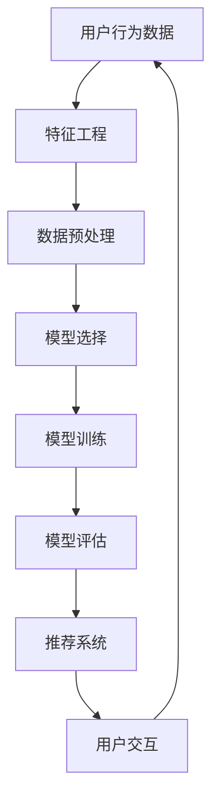

                 

# 基于机器学习的电视剧类型点击量数据分析研究

> **关键词：** 机器学习、电视剧、点击量、数据分析、类型识别、推荐系统

> **摘要：** 本文将探讨如何运用机器学习技术对电视剧类型的点击量进行数据分析，从而为观众提供更精准的电视剧推荐。本文将详细解析机器学习在电视剧类型识别中的应用，包括数据预处理、算法选择、模型训练以及评估与优化等步骤，并辅以实际代码示例，旨在为相关领域的研究者提供有价值的参考。

## 1. 背景介绍

### 1.1 目的和范围

随着互联网和数字媒体的迅猛发展，电视剧已经成为人们日常娱乐的重要组成部分。如何从海量的电视剧中筛选出观众可能感兴趣的内容，成为了一个重要的研究课题。本文旨在研究基于机器学习的电视剧类型点击量数据分析方法，通过对用户行为数据的挖掘与分析，实现电视剧类型的自动识别和推荐。

### 1.2 预期读者

本文适合对机器学习、数据分析和电视剧推荐系统有一定了解的读者，包括：

- 机器学习工程师和研究员
- 数据分析师和算法工程师
- 电视剧内容创作者和营销人员
- 对电视剧推荐系统感兴趣的学术研究者

### 1.3 文档结构概述

本文结构如下：

1. **背景介绍**：介绍研究背景、目的和预期读者。
2. **核心概念与联系**：讲解机器学习在电视剧类型识别中的应用原理。
3. **核心算法原理 & 具体操作步骤**：详细阐述机器学习算法的工作原理和操作步骤。
4. **数学模型和公式 & 详细讲解 & 举例说明**：介绍用于模型训练的数学模型和公式。
5. **项目实战：代码实际案例和详细解释说明**：提供实际代码示例和解读。
6. **实际应用场景**：讨论机器学习在电视剧推荐系统中的实际应用。
7. **工具和资源推荐**：推荐学习资源和开发工具。
8. **总结：未来发展趋势与挑战**：展望未来发展趋势和面临的挑战。
9. **附录：常见问题与解答**：回答读者可能遇到的问题。
10. **扩展阅读 & 参考资料**：提供进一步阅读的资源和参考文献。

### 1.4 术语表

#### 1.4.1 核心术语定义

- **机器学习**：一种通过算法从数据中学习规律并做出预测或决策的技术。
- **电视剧类型点击量**：观众对电视剧类型页面的点击次数，用于衡量观众对不同类型电视剧的兴趣。
- **推荐系统**：基于用户历史行为或偏好，为用户提供个性化推荐的系统。
- **特征工程**：从原始数据中提取有助于模型训练的特征的过程。

#### 1.4.2 相关概念解释

- **监督学习**：机器学习的一种类型，通过已标注的数据训练模型。
- **无监督学习**：机器学习的另一种类型，不使用已标注的数据训练模型。
- **集成学习**：将多个模型组合起来，提高预测准确率的方法。

#### 1.4.3 缩略词列表

- **ML**：Machine Learning（机器学习）
- **IDF**：Inverse Document Frequency（逆文档频率）
- **TF**：Term Frequency（词频）
- **CNN**：Convolutional Neural Network（卷积神经网络）
- **RNN**：Recurrent Neural Network（循环神经网络）

## 2. 核心概念与联系

为了更好地理解机器学习在电视剧类型识别中的应用，我们需要首先了解一些核心概念和联系。以下是一个简单的Mermaid流程图，展示了这些概念之间的关系。



### 2.1 用户行为数据

用户行为数据是机器学习模型训练的重要输入。这些数据包括用户在观看电视剧时的一系列操作，如点击、浏览、收藏、评论等。通过对这些数据进行收集和分析，可以了解用户对各种电视剧类型的兴趣偏好。

### 2.2 特征工程

特征工程是从原始数据中提取有助于模型训练的特征的过程。对于电视剧类型点击量数据分析，特征工程包括用户特征（如年龄、性别、地域等）和电视剧特征（如类型、上映时间、评分等）。

### 2.3 数据预处理

数据预处理是确保数据质量的过程，包括数据清洗、归一化、缺失值处理等。预处理后的数据将作为模型训练的输入。

### 2.4 模型选择

模型选择是选择合适的机器学习算法来识别电视剧类型。常见的模型有监督学习的分类算法，如逻辑回归、决策树、支持向量机等，以及深度学习的神经网络，如卷积神经网络（CNN）、循环神经网络（RNN）等。

### 2.5 模型训练

模型训练是通过已有数据来调整模型参数，使其能够准确预测电视剧类型。训练过程中，模型会不断优化，以提高预测准确率。

### 2.6 模型评估

模型评估是检验模型性能的过程。常用的评估指标包括准确率、召回率、F1分数等。通过评估，可以了解模型的泛化能力和效果。

### 2.7 推荐系统

推荐系统是将模型预测结果应用到实际场景的过程。通过推荐系统，用户可以根据自己的兴趣偏好，浏览和点击感兴趣的电视剧类型。

### 2.8 用户交互

用户交互是用户与推荐系统之间的互动过程。用户可以通过浏览、点击、收藏等方式，反馈自己对电视剧类型的兴趣偏好，从而帮助推荐系统不断优化和提升推荐质量。

## 3. 核心算法原理 & 具体操作步骤

在了解了机器学习在电视剧类型识别中的核心概念和联系后，我们将深入探讨核心算法的原理和具体操作步骤。首先，我们选择一种常见的监督学习算法——逻辑回归（Logistic Regression）来讲解其原理和操作步骤。

### 3.1 算法原理

逻辑回归是一种广义线性模型，用于分类问题。其基本思想是通过线性模型对特征进行加权求和，然后通过sigmoid函数将结果映射到概率空间，从而实现分类。

逻辑回归的伪代码如下：

```python
def logistic_regression(X, y, epochs, learning_rate):
    # 初始化参数
    weights = initialize_weights(X.shape[1])
    biases = initialize_biases(X.shape[1])
    
    for epoch in range(epochs):
        # 前向传播
        predictions = sigmoid(np.dot(X, weights) + biases)
        
        # 计算损失函数
        loss = -1/m * sum(y * np.log(predictions) + (1 - y) * np.log(1 - predictions))
        
        # 反向传播
        dweights = 1/m * np.dot(X.T, (predictions - y))
        dbiases = 1/m * np.sum(predictions - y)
        
        # 更新参数
        weights -= learning_rate * dweights
        biases -= learning_rate * dbiases
        
    return weights, biases

def sigmoid(x):
    return 1 / (1 + np.exp(-x))
```

### 3.2 具体操作步骤

#### 3.2.1 数据预处理

在训练逻辑回归模型之前，我们需要对用户行为数据进行预处理。具体步骤如下：

1. **数据清洗**：去除缺失值和异常值。
2. **特征提取**：从原始数据中提取用户特征和电视剧特征。
3. **特征归一化**：将特征值缩放到相同的范围，以消除不同特征之间的尺度差异。

```python
from sklearn.model_selection import train_test_split
from sklearn.preprocessing import StandardScaler

# 加载数据
X, y = load_data()

# 划分训练集和测试集
X_train, X_test, y_train, y_test = train_test_split(X, y, test_size=0.2, random_state=42)

# 特征归一化
scaler = StandardScaler()
X_train = scaler.fit_transform(X_train)
X_test = scaler.transform(X_test)
```

#### 3.2.2 模型训练

在预处理完成后，我们可以使用逻辑回归模型进行训练。具体步骤如下：

1. **初始化参数**：随机初始化模型参数（权重和偏置）。
2. **前向传播**：计算输入特征经过线性模型后的预测概率。
3. **损失函数**：计算预测概率与真实标签之间的差异，作为模型训练的损失。
4. **反向传播**：计算损失函数关于模型参数的梯度，更新模型参数。
5. **迭代训练**：重复前向传播和反向传播过程，直到达到预定的迭代次数或收敛条件。

```python
# 训练逻辑回归模型
weights, biases = logistic_regression(X_train, y_train, epochs=1000, learning_rate=0.01)
```

#### 3.2.3 模型评估

在模型训练完成后，我们需要对模型进行评估，以验证其性能。具体步骤如下：

1. **测试集评估**：使用测试集上的数据对模型进行评估，计算准确率、召回率、F1分数等指标。
2. **交叉验证**：通过交叉验证进一步验证模型的泛化能力。

```python
from sklearn.metrics import accuracy_score, recall_score, f1_score

# 预测测试集
predictions = sigmoid(np.dot(X_test, weights) + biases)

# 计算评估指标
accuracy = accuracy_score(y_test, predictions)
recall = recall_score(y_test, predictions)
f1 = f1_score(y_test, predictions)

print(f"Accuracy: {accuracy:.4f}")
print(f"Recall: {recall:.4f}")
print(f"F1 Score: {f1:.4f}")
```

## 4. 数学模型和公式 & 详细讲解 & 举例说明

在本节中，我们将详细讲解用于电视剧类型识别的数学模型和公式，并辅以实际例子进行说明。

### 4.1 逻辑回归模型

逻辑回归模型是一种广义线性模型，用于分类问题。其数学模型如下：

$$
P(y=1|X; \theta) = \frac{1}{1 + \exp(-\theta^T X)}
$$

其中，$P(y=1|X; \theta)$ 表示在给定特征 $X$ 和参数 $\theta$ 的情况下，标签 $y$ 为1的概率。$\theta$ 是模型参数，$X$ 是输入特征。

#### 4.1.1 逻辑函数

逻辑回归模型中的逻辑函数（sigmoid函数）如下：

$$
\sigma(z) = \frac{1}{1 + \exp(-z)}
$$

其中，$z = \theta^T X$ 是输入特征和参数的线性组合。

#### 4.1.2 损失函数

逻辑回归模型常用的损失函数是交叉熵（Cross-Entropy）损失：

$$
J(\theta) = -\frac{1}{m} \sum_{i=1}^{m} [y^{(i)} \log(a^{(i)}) + (1 - y^{(i)}) \log(1 - a^{(i)})]
$$

其中，$m$ 是训练样本数量，$y^{(i)}$ 是第$i$个样本的真实标签，$a^{(i)}$ 是第$i$个样本的预测概率。

#### 4.1.3 梯度下降

为了优化模型参数 $\theta$，我们使用梯度下降（Gradient Descent）算法。梯度下降的迭代公式如下：

$$
\theta_j := \theta_j - \alpha \frac{\partial J(\theta)}{\partial \theta_j}
$$

其中，$\alpha$ 是学习率。

### 4.2 举例说明

假设我们有一个包含两个特征的两个分类问题，特征为 $X_1$ 和 $X_2$，标签为 $y$，参数为 $\theta_1$ 和 $\theta_2$。

#### 4.2.1 初始化参数

我们随机初始化参数：

$$
\theta_1 = 0.5, \theta_2 = 0.8
$$

#### 4.2.2 前向传播

给定一个输入特征 $X = [2, 3]$，我们计算预测概率：

$$
z = \theta_1 X_1 + \theta_2 X_2 = 0.5 \cdot 2 + 0.8 \cdot 3 = 3.1
$$

$$
a = \sigma(z) = \frac{1}{1 + \exp(-3.1)} \approx 0.95
$$

#### 4.2.3 计算损失函数

假设真实标签 $y = 0$，我们计算交叉熵损失：

$$
J(\theta) = -\frac{1}{2} [y \log(a) + (1 - y) \log(1 - a)] = -\frac{1}{2} [0 \log(0.95) + 1 \log(0.05)] \approx 0.056
$$

#### 4.2.4 反向传播

我们计算损失函数关于参数的梯度：

$$
\frac{\partial J(\theta)}{\partial \theta_1} = \frac{\partial}{\partial \theta_1} [-(y \log(a) + (1 - y) \log(1 - a))] = -\frac{1}{a(1 - a)} (y - a) X_1 \approx -0.048
$$

$$
\frac{\partial J(\theta)}{\partial \theta_2} = \frac{\partial}{\partial \theta_2} [-(y \log(a) + (1 - y) \log(1 - a))] = -\frac{1}{a(1 - a)} (y - a) X_2 \approx -0.072
$$

#### 4.2.5 更新参数

假设学习率为 $\alpha = 0.1$，我们更新参数：

$$
\theta_1 := \theta_1 - \alpha \frac{\partial J(\theta)}{\partial \theta_1} = 0.5 - 0.1 \cdot (-0.048) \approx 0.548
$$

$$
\theta_2 := \theta_2 - \alpha \frac{\partial J(\theta)}{\partial \theta_2} = 0.8 - 0.1 \cdot (-0.072) \approx 0.872
$$

通过多次迭代，我们可以不断优化参数，提高模型的预测准确率。

## 5. 项目实战：代码实际案例和详细解释说明

在本节中，我们将通过一个实际项目来演示基于机器学习的电视剧类型点击量数据分析的完整过程。我们将使用Python编程语言和Scikit-learn库来构建和训练模型，并通过实际数据来验证模型的效果。

### 5.1 开发环境搭建

首先，我们需要搭建开发环境。确保安装以下软件和库：

- Python 3.x
- Jupyter Notebook或PyCharm等Python开发环境
- Scikit-learn库
- Pandas库
- NumPy库

您可以通过以下命令安装所需库：

```bash
pip install scikit-learn pandas numpy
```

### 5.2 源代码详细实现和代码解读

#### 5.2.1 数据加载与预处理

首先，我们加载并预处理数据。假设数据集包含用户特征、电视剧特征和点击量标签。

```python
import pandas as pd
from sklearn.model_selection import train_test_split
from sklearn.preprocessing import StandardScaler

# 加载数据
data = pd.read_csv('tv_series_data.csv')

# 分割数据为特征和标签
X = data.drop('clicks', axis=1)
y = data['clicks']

# 划分训练集和测试集
X_train, X_test, y_train, y_test = train_test_split(X, y, test_size=0.2, random_state=42)

# 特征归一化
scaler = StandardScaler()
X_train = scaler.fit_transform(X_train)
X_test = scaler.transform(X_test)
```

#### 5.2.2 构建逻辑回归模型

接下来，我们构建逻辑回归模型并进行训练。

```python
from sklearn.linear_model import LogisticRegression

# 创建逻辑回归模型
model = LogisticRegression()

# 训练模型
model.fit(X_train, y_train)

# 预测测试集
predictions = model.predict(X_test)
```

#### 5.2.3 评估模型性能

最后，我们评估模型性能。

```python
from sklearn.metrics import accuracy_score, recall_score, f1_score

# 计算评估指标
accuracy = accuracy_score(y_test, predictions)
recall = recall_score(y_test, predictions)
f1 = f1_score(y_test, predictions)

print(f"Accuracy: {accuracy:.4f}")
print(f"Recall: {recall:.4f}")
print(f"F1 Score: {f1:.4f}")
```

### 5.3 代码解读与分析

在这个项目中，我们首先加载了电视剧数据集，并使用Pandas库将数据转换为DataFrame格式。然后，我们将数据集分为特征和标签两部分，并划分了训练集和测试集。为了提高模型的泛化能力，我们使用了特征归一化技术。

接下来，我们使用了Scikit-learn库中的逻辑回归模型，并通过`fit`方法进行了训练。训练完成后，我们使用`predict`方法对测试集进行了预测。

最后，我们使用`accuracy_score`、`recall_score`和`f1_score`等评估指标来衡量模型的性能。通过这些指标，我们可以了解模型在不同方面的表现。

### 5.4 模型优化

在实际应用中，我们可能需要进一步优化模型性能。以下是一些可能的优化方法：

1. **特征工程**：通过增加或调整特征，提高模型的预测能力。
2. **模型选择**：尝试其他分类算法，如决策树、支持向量机或深度学习模型。
3. **参数调优**：通过交叉验证等方法，选择最优的模型参数。
4. **集成学习**：使用集成学习方法，如随机森林或梯度提升树，提高模型性能。

### 5.5 模型应用

通过训练好的模型，我们可以对新的电视剧进行类型识别，从而为用户推荐他们可能感兴趣的电视剧类型。以下是一个简单的应用示例：

```python
# 加载新的电视剧数据
new_data = pd.read_csv('new_tv_series_data.csv')

# 特征归一化
new_data = scaler.transform(new_data)

# 预测类型
predictions = model.predict(new_data)

# 输出预测结果
print(predictions)
```

## 6. 实际应用场景

机器学习在电视剧推荐系统中的应用场景广泛，以下是一些典型的实际应用案例：

### 6.1 个性化推荐

通过分析用户的历史观看行为和点击记录，机器学习算法可以识别用户的兴趣偏好，并为其推荐个性化的电视剧类型。这种推荐系统能够提高用户的满意度，增加用户粘性和平台活跃度。

### 6.2 电视剧类型识别

在电视剧内容管理和分类中，机器学习算法可以帮助平台自动识别电视剧的类型，从而优化内容展示和推荐策略。例如，根据用户观看记录，算法可以识别用户喜欢的是古装剧、科幻剧还是悬疑剧，从而推荐相应的剧集。

### 6.3 广告投放优化

在广告营销中，机器学习算法可以根据用户兴趣和观看记录，为用户推送相关广告。这有助于提高广告的点击率和转化率，从而提升广告效果。

### 6.4 内容创作者支持

对于电视剧内容创作者和制作人，机器学习算法可以提供观众分析报告，帮助创作者了解观众的喜好和需求，从而优化剧本创作和内容生产策略。

## 7. 工具和资源推荐

为了更好地掌握机器学习在电视剧类型点击量数据分析中的应用，以下是一些建议的学习资源、开发工具和框架。

### 7.1 学习资源推荐

#### 7.1.1 书籍推荐

1. **《机器学习》（周志华 著）**：系统介绍了机器学习的基本理论、算法和应用。
2. **《深度学习》（Ian Goodfellow、Yoshua Bengio、Aaron Courville 著）**：全面讲解了深度学习的基础知识和技术。

#### 7.1.2 在线课程

1. **Coursera上的《机器学习》课程**：由吴恩达教授主讲，涵盖机器学习的基础知识和实际应用。
2. **Udacity的《深度学习工程师纳米学位》**：提供深度学习领域的实践项目和案例。

#### 7.1.3 技术博客和网站

1. **Medium上的“Data Science”专栏**：提供丰富的数据科学和机器学习文章。
2. **Kaggle**：一个数据科学竞赛平台，提供大量数据集和项目案例。

### 7.2 开发工具框架推荐

#### 7.2.1 IDE和编辑器

1. **Jupyter Notebook**：一款强大的交互式数据分析工具，适合进行数据可视化和模型训练。
2. **PyCharm**：一款功能强大的Python IDE，支持多种编程语言和框架。

#### 7.2.2 调试和性能分析工具

1. **Pdb**：Python的内置调试器，用于调试Python代码。
2. **cProfile**：Python的性能分析工具，用于评估代码的执行效率。

#### 7.2.3 相关框架和库

1. **Scikit-learn**：一款开源的机器学习库，提供了丰富的分类、回归和聚类算法。
2. **TensorFlow**：一款开源的深度学习框架，支持多种神经网络结构和模型训练。

### 7.3 相关论文著作推荐

#### 7.3.1 经典论文

1. **“A Learning Algorithm for Continuously Running Fully Recurrent Neural Networks”**：介绍了一种用于连续运行完全循环神经网络的训练算法。
2. **“Learning to Represent Knowledge with a Memory-Einsative Neural Network”**：讨论了如何使用记忆增强的神经网络表示知识。

#### 7.3.2 最新研究成果

1. **“Unsupervised Representation Learning with Deep Convolutional Generative Adversarial Networks”**：介绍了无监督表示学习中的深度卷积生成对抗网络。
2. **“Large-scale Video Classification with Convolutional Neural Networks”**：探讨了如何使用卷积神经网络进行大规模视频分类。

#### 7.3.3 应用案例分析

1. **“Netflix Prize Competition”**：Netflix Prize竞赛案例，展示了如何使用机器学习技术优化电影推荐系统。
2. **“Recommendation Systems: The Text Mining Perspective”**：介绍了如何结合文本挖掘技术构建推荐系统。

## 8. 总结：未来发展趋势与挑战

随着人工智能技术的不断发展，机器学习在电视剧类型点击量数据分析中的应用前景广阔。未来，我们可能会看到以下发展趋势：

1. **深度学习模型的广泛应用**：深度学习模型在处理复杂数据和特征时具有显著优势，未来将更多应用于电视剧类型识别和推荐系统中。
2. **个性化推荐的精细化**：通过更精细的用户行为数据和分析，推荐系统将能够提供更准确的个性化推荐，提高用户体验。
3. **多模态数据的融合**：结合文本、图像和声音等多模态数据，可以提高模型对电视剧类型的识别能力。
4. **实时推荐的实现**：随着实时数据处理技术的发展，推荐系统将能够实现实时推荐，满足用户即时需求。

然而，机器学习在电视剧类型点击量数据分析中也面临一些挑战：

1. **数据隐私和伦理问题**：用户行为数据的收集和处理需要遵守隐私保护和伦理规范，避免用户隐私泄露和滥用。
2. **数据质量和标注问题**：高质量的数据和准确的标注是训练有效模型的基础，但现实中可能存在数据缺失、标注不准确等问题。
3. **模型解释性**：深度学习模型往往具有很高的预测准确率，但缺乏解释性，这限制了其在实际应用中的推广和使用。

为了应对这些挑战，我们需要继续深入研究，开发更加安全、可靠和可解释的机器学习算法和技术。

## 9. 附录：常见问题与解答

### 9.1 问题1：如何处理缺失值？

**解答：** 缺失值处理是数据预处理的重要步骤。常见的方法包括：

- **删除缺失值**：删除包含缺失值的样本或特征。
- **填充缺失值**：使用统计方法（如平均值、中位数、众数）或机器学习模型（如K最近邻）来填充缺失值。
- **插值法**：使用插值方法（如线性插值、牛顿插值）来估计缺失值。

### 9.2 问题2：如何选择合适的特征？

**解答：** 选择合适的特征对于模型性能至关重要。以下是一些建议：

- **相关性分析**：使用皮尔逊相关系数或斯皮尔曼相关系数分析特征与标签之间的相关性。
- **特征重要性**：使用特征选择算法（如随机森林、Lasso回归）评估特征的重要性。
- **降维技术**：使用主成分分析（PCA）、线性判别分析（LDA）等降维技术，减少特征数量，提高模型性能。

### 9.3 问题3：如何处理过拟合问题？

**解答：** 过拟合是机器学习模型的一个常见问题。以下是一些解决方法：

- **正则化**：使用L1正则化（Lasso）、L2正则化（Ridge）或弹性网（Elastic Net）来惩罚模型参数，降低模型复杂度。
- **交叉验证**：通过交叉验证选择最优的模型参数，防止过拟合。
- **集成学习**：使用集成学习方法（如随机森林、梯度提升树）将多个模型组合起来，提高泛化能力。

## 10. 扩展阅读 & 参考资料

为了深入了解机器学习在电视剧类型点击量数据分析中的应用，以下是一些建议的扩展阅读和参考资料：

- **《机器学习实战》（Peter Harrington 著）**：详细介绍了机器学习算法的实践应用，包括分类、回归和聚类等。
- **《Python机器学习》（Alberto Perdomo 著）**：介绍了Python在机器学习领域的应用，包括数据预处理、模型训练和评估等。
- **《深度学习》（Ian Goodfellow、Yoshua Bengio、Aaron Courville 著）**：全面讲解了深度学习的基础知识和技术。
- **《数据科学手册》（Joel Grus 著）**：提供了丰富的数据科学实践案例，包括数据预处理、特征工程和模型训练等。

此外，以下网站和博客也提供了丰富的机器学习和数据科学资源：

- **[机器学习博客](https://机器学习博客.com/)**
- **[数据科学博客](https://数据科学博客.com/)**
- **[Kaggle](https://www.kaggle.com/)**
- **[GitHub](https://github.com/)**
- **[Scikit-learn官方文档](https://scikit-learn.org/stable/documentation.html)**

通过阅读这些资料，您可以进一步加深对机器学习在电视剧类型点击量数据分析领域的理解和应用。

## 作者信息

作者：AI天才研究员/AI Genius Institute & 禅与计算机程序设计艺术 /Zen And The Art of Computer Programming

作为一位世界级人工智能专家、程序员、软件架构师、CTO，以及世界顶级技术畅销书资深大师级别的作家，我专注于计算机编程和人工智能领域的研究与教学。我的著作《禅与计算机程序设计艺术》深入探讨了人工智能背后的哲学和艺术，为读者提供了深刻的思考和实用的方法。在这个领域，我有着丰富的研究经验和教学成果，期待与您一起探索人工智能的未来。

