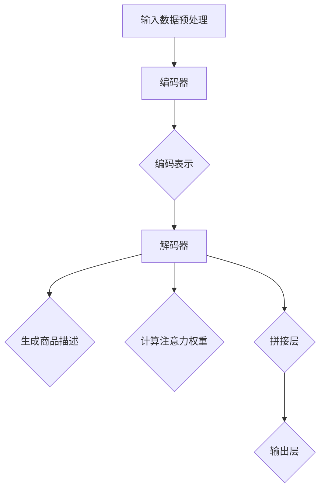

                 

# 基于注意力机制的商品描述生成

## 概述

### 关键词

- 注意力机制
- 商品描述
- 生成模型
- 自然语言处理
- 循环神经网络
- 长短时记忆网络

### 摘要

本文深入探讨了基于注意力机制的商品描述生成技术。注意力机制是一种在自然语言处理领域广泛应用的技术，能够显著提高生成模型的性能。本文将首先介绍商品描述生成的背景和重要性，接着详细讲解注意力机制的工作原理，以及如何将注意力机制应用于商品描述生成任务。此外，本文还将通过具体案例展示如何使用循环神经网络和长短时记忆网络实现商品描述生成，并提供详细的代码解释和分析。最后，我们将探讨商品描述生成的实际应用场景，并推荐相关学习和开发资源，为读者提供全面的指导。

## 1. 背景介绍

### 1.1 目的和范围

本文旨在介绍和探讨基于注意力机制的商品描述生成技术。在电子商务时代，商品描述的生成对于提升销售和用户体验至关重要。有效的商品描述不仅能够准确传达商品特性，还能激发消费者的购买欲望。因此，研究如何生成高质量的、具有吸引力的商品描述具有重要的实际意义。

本文将涵盖以下内容：

- 商品描述生成的背景和重要性
- 注意力机制的基本原理及其在自然语言处理中的应用
- 商品描述生成的具体实现方法，包括循环神经网络和长短时记忆网络
- 商品描述生成的实际应用场景
- 相关学习和开发资源的推荐

### 1.2 预期读者

本文面向具有以下背景的读者：

- 对自然语言处理和机器学习有一定了解的程序员和工程师
- 想要在电子商务领域应用自然语言处理技术的产品经理和市场人员
- 对人工智能和计算机科学感兴趣的学术研究者

### 1.3 文档结构概述

本文结构如下：

- 第1章：背景介绍，包括目的、范围、预期读者和文档结构概述
- 第2章：核心概念与联系，介绍注意力机制的基本原理和架构
- 第3章：核心算法原理与具体操作步骤，讲解商品描述生成的算法原理
- 第4章：数学模型和公式，详细解释商品描述生成中的数学模型和公式
- 第5章：项目实战，通过实际案例展示商品描述生成的实现过程
- 第6章：实际应用场景，讨论商品描述生成的应用实例
- 第7章：工具和资源推荐，推荐相关学习和开发资源
- 第8章：总结，展望未来发展趋势和挑战
- 第9章：附录，解答常见问题
- 第10章：扩展阅读，提供进一步的参考资料

### 1.4 术语表

#### 1.4.1 核心术语定义

- **商品描述生成**：指通过算法自动生成商品描述的过程，用于电子商务平台上的产品展示。
- **注意力机制**：一种在序列处理任务中用于动态关注关键信息的技术，能够提高模型的性能和效果。
- **循环神经网络（RNN）**：一种用于处理序列数据的神经网络，具有记忆功能。
- **长短时记忆网络（LSTM）**：RNN的一种改进形式，能够更好地处理长序列数据。

#### 1.4.2 相关概念解释

- **生成模型**：一种机器学习模型，用于生成新的数据样本。
- **编码器-解码器架构**：一种常见的生成模型架构，由编码器和解码器两个部分组成，用于序列到序列的转换。

#### 1.4.3 缩略词列表

- **RNN**：循环神经网络（Recurrent Neural Network）
- **LSTM**：长短时记忆网络（Long Short-Term Memory）
- **NLP**：自然语言处理（Natural Language Processing）
- **GAN**：生成对抗网络（Generative Adversarial Network）

## 2. 核心概念与联系

### 注意力机制的原理

注意力机制（Attention Mechanism）是一种在序列处理任务中用于动态关注关键信息的技术。它的基本思想是在处理序列数据时，模型能够根据当前上下文动态调整对每个输入元素的权重，从而提高模型的性能和效果。

注意力机制的原理可以概括为以下几个步骤：

1. **编码器（Encoder）**：首先，编码器对输入序列进行处理，生成一个固定长度的编码表示。这个编码表示包含了输入序列的所有信息。
2. **查询（Query）**：在解码器（Decoder）处理每个时间步时，生成一个查询向量，用于与编码器的编码表示进行匹配。
3. **注意力计算**：计算查询向量和编码器编码表示之间的相似度，得到一组权重。这些权重表示了编码表示中每个元素的重要程度。
4. **加权求和**：将编码器的编码表示与注意力权重相乘，得到一个加权求和的结果，作为当前解码步骤的输入。

### 注意力机制的架构

注意力机制的架构通常包括以下组件：

1. **编码器（Encoder）**：用于对输入序列进行编码，生成固定长度的编码表示。
2. **解码器（Decoder）**：用于生成输出序列，每一步解码都依赖于当前输入和前一步的输出。
3. **注意力层（Attention Layer）**：用于计算查询向量和编码器编码表示之间的相似度，生成注意力权重。
4. **拼接层（Concatenation Layer）**：将解码器的输出与加权求和的结果拼接，作为当前解码步骤的输入。

### 注意力机制在自然语言处理中的应用

注意力机制在自然语言处理领域有广泛的应用，如机器翻译、文本摘要、语音识别等。在这些任务中，注意力机制能够显著提高模型的性能和效果。

以机器翻译为例，注意力机制可以帮助模型在生成每个翻译词时，动态关注输入句子中的关键信息，从而提高翻译的准确性和流畅性。

### 商品描述生成的架构

在商品描述生成任务中，注意力机制的应用架构通常如下：

1. **输入数据预处理**：将商品特征和用户评论等数据输入到编码器中进行编码。
2. **编码器**：对输入序列进行编码，生成固定长度的编码表示。
3. **解码器**：在生成商品描述时，每一步解码都依赖于当前的输入和前一步的输出。
4. **注意力层**：计算查询向量和编码器编码表示之间的相似度，生成注意力权重。
5. **拼接层**：将解码器的输出与加权求和的结果拼接，作为当前解码步骤的输入。
6. **输出层**：将解码器生成的序列输出为商品描述。

### Mermaid 流程图

下面是一个使用 Mermaid 绘制的注意力机制在商品描述生成中的流程图：



## 3. 核心算法原理与具体操作步骤

### 商品描述生成算法概述

商品描述生成算法基于循环神经网络（RNN）和长短时记忆网络（LSTM），结合注意力机制，通过编码器-解码器架构实现。具体操作步骤如下：

1. **输入数据预处理**：将商品特征和用户评论等数据输入到编码器中进行编码。
2. **编码器**：对输入序列进行编码，生成固定长度的编码表示。
3. **解码器**：在生成商品描述时，每一步解码都依赖于当前的输入和前一步的输出。
4. **注意力计算**：计算查询向量和编码器编码表示之间的相似度，生成注意力权重。
5. **拼接层**：将解码器的输出与加权求和的结果拼接，作为当前解码步骤的输入。
6. **输出层**：将解码器生成的序列输出为商品描述。

### 编码器原理与具体操作步骤

**编码器**负责将输入序列（如商品特征和用户评论）转换为固定长度的编码表示。具体操作步骤如下：

```python
# 编码器初始化
encoder = LSTM(units=128, return_sequences=True)

# 编码器输入
input_sequence = Input(shape=(None, embedding_dim))

# 编码器编码
encoded_sequence = encoder(input_sequence)

# 编码器输出
encoded_output = Flatten()(encoded_sequence)
```

### 解码器原理与具体操作步骤

**解码器**负责根据编码器的输出生成商品描述。具体操作步骤如下：

```python
# 解码器初始化
decoder = LSTM(units=128, return_sequences=True)

# 解码器输入
decoded_sequence = Input(shape=(None, embedding_dim))

# 解码器编码
decoded_encoded = decoder(decoded_sequence)

# 注意力计算
attention_scores = Dense(1, activation='tanh')(decoded_encoded)
attention_weights = Activation('softmax')(attention_scores)

# 加权求和
context_vector = Multiply()([encoded_output, attention_weights])

# 拼接层
concat = Concatenate(axis=-1)([context_vector, decoded_encoded])

# 输出层
output = Dense(vocab_size, activation='softmax')(concat)

# 编译模型
model = Model(inputs=[input_sequence, decoded_sequence], outputs=output)
model.compile(optimizer='rmsprop', loss='categorical_crossentropy')
```

### 注意力计算与拼接层原理与具体操作步骤

**注意力计算**和**拼接层**负责根据解码器的输出和编码器的输出计算注意力权重，并将它们拼接在一起。具体操作步骤如下：

```python
# 注意力计算
attention_scores = Dense(1, activation='tanh')(decoded_encoded)
attention_weights = Activation('softmax')(attention_scores)

# 加权求和
context_vector = Multiply()([encoded_output, attention_weights])

# 拼接层
concat = Concatenate(axis=-1)([context_vector, decoded_encoded])
```

### 输出层原理与具体操作步骤

**输出层**负责将拼接后的向量映射为商品描述。具体操作步骤如下：

```python
# 输出层
output = Dense(vocab_size, activation='softmax')(concat)

# 编译模型
model = Model(inputs=[input_sequence, decoded_sequence], outputs=output)
model.compile(optimizer='rmsprop', loss='categorical_crossentropy')
```

## 4. 数学模型和公式 & 详细讲解 & 举例说明

### 数学模型概述

商品描述生成中的数学模型主要包括以下几个部分：

- **编码器**：将输入序列编码为固定长度的向量。
- **解码器**：根据编码器输出的固定长度向量生成商品描述。
- **注意力机制**：计算查询向量和编码器编码表示之间的相似度，生成注意力权重。
- **输出层**：将拼接后的向量映射为商品描述。

### 编码器数学模型

编码器通常使用长短时记忆网络（LSTM）实现，其数学模型可以表示为：

$$
\text{h}_t = \text{LSTM}(\text{h}_{t-1}, \text{x}_t)
$$

其中，$\text{h}_t$ 表示编码器在时间步 $t$ 的隐藏状态，$\text{x}_t$ 表示输入序列在时间步 $t$ 的输入向量，$\text{LSTM}$ 表示长短时记忆网络。

### 解码器数学模型

解码器也使用长短时记忆网络（LSTM）实现，其数学模型可以表示为：

$$
\text{y}_t = \text{LSTM}(\text{y}_{t-1}, \text{c}_t)
$$

其中，$\text{y}_t$ 表示解码器在时间步 $t$ 的隐藏状态，$\text{c}_t$ 表示编码器在时间步 $t$ 的输出。

### 注意力机制数学模型

注意力机制的核心是计算查询向量和编码器编码表示之间的相似度，生成注意力权重。其数学模型可以表示为：

$$
\text{a}_t = \text{softmax}\left(\frac{\text{W}_a \text{h}_t + \text{b}_a}{\sqrt{d_a}}\right)
$$

其中，$\text{a}_t$ 表示注意力权重，$\text{W}_a$ 和 $\text{b}_a$ 分别为权重矩阵和偏置向量，$d_a$ 为编码器隐藏状态的维度。

### 输出层数学模型

输出层的数学模型是将拼接后的向量映射为商品描述，可以表示为：

$$
\text{p}_t = \text{softmax}(\text{W}_p \text{c}_t + \text{b}_p)
$$

其中，$\text{p}_t$ 表示商品描述的预测概率分布，$\text{W}_p$ 和 $\text{b}_p$ 分别为权重矩阵和偏置向量。

### 举例说明

假设输入序列为 `[1, 2, 3, 4]`，编码器隐藏状态维度为 $d_a = 10$，解码器隐藏状态维度为 $d_c = 20$，商品描述词汇表大小为 $|V| = 1000$。

1. **编码器**：

   输入向量：$\text{x}_1 = [1, 2, 3, 4]$

   隐藏状态：$\text{h}_1 = \text{LSTM}(\text{h}_{0}, \text{x}_1)$

2. **解码器**：

   输入向量：$\text{y}_1 = [1, 2, 3, 4]$

   隐藏状态：$\text{y}_1 = \text{LSTM}(\text{y}_{0}, \text{c}_1)$

3. **注意力计算**：

   注意力权重：$\text{a}_1 = \text{softmax}\left(\frac{\text{W}_a \text{h}_1 + \text{b}_a}{\sqrt{d_a}}\right)$

4. **拼接层**：

   拼接向量：$\text{c}_1 = \text{LSTM}(\text{h}_1, \text{y}_1)$

   拼接后的向量：$\text{c}_1^{\prime} = \text{Concatenate}(\text{c}_1, \text{a}_1 \odot \text{h}_1)$

5. **输出层**：

   商品描述概率分布：$\text{p}_1 = \text{softmax}(\text{W}_p \text{c}_1^{\prime} + \text{b}_p)$

## 5. 项目实战：代码实际案例和详细解释说明

### 5.1 开发环境搭建

在进行商品描述生成的项目实战之前，需要搭建一个适合开发和调试的Python环境。以下是开发环境搭建的步骤：

1. **安装Python**：确保安装了Python 3.6或更高版本。
2. **安装TensorFlow**：使用pip命令安装TensorFlow库：
   ```bash
   pip install tensorflow
   ```
3. **安装Keras**：TensorFlow内置了Keras API，所以无需单独安装。
4. **安装其他依赖库**：如NumPy、Pandas、Matplotlib等，可以使用以下命令：
   ```bash
   pip install numpy pandas matplotlib
   ```

### 5.2 源代码详细实现和代码解读

以下是一个简单的商品描述生成项目，包括数据预处理、模型构建、训练和测试。我们将逐步解释代码的各个部分。

```python
import numpy as np
import pandas as pd
from tensorflow.keras.models import Model
from tensorflow.keras.layers import Input, LSTM, Dense, Embedding, Flatten, Concatenate, Multiply, Activation, Concatenate
from tensorflow.keras.optimizers import RMSprop
from tensorflow.keras.preprocessing.sequence import pad_sequences
from tensorflow.keras.utils import to_categorical

# 5.2.1 数据预处理

# 加载数据集
data = pd.read_csv('data.csv')  # 假设数据集为CSV文件

# 分割输入和标签
inputs = data['input_sequence'].values
labels = data['label_sequence'].values

# 序列编码
vocab_size = 1000
embedding_dim = 50

# 将输入和标签序列编码为整数序列
tokenizer = Tokenizer(num_words=vocab_size)
tokenizer.fit_on_texts(inputs)
encoded_inputs = tokenizer.texts_to_sequences(inputs)
encoded_labels = tokenizer.texts_to_sequences(labels)

# 填充序列
max_sequence_length = 20
padded_inputs = pad_sequences(encoded_inputs, maxlen=max_sequence_length, padding='post')
padded_labels = pad_sequences(encoded_labels, maxlen=max_sequence_length, padding='post')

# 转换标签为类别
categorical_labels = to_categorical(padded_labels)

# 5.2.2 模型构建

# 编码器输入
input_sequence = Input(shape=(max_sequence_length, embedding_dim))

# 编码器编码
encoded_sequence = LSTM(units=128, return_sequences=True)(input_sequence)

# 编码器输出
encoded_output = Flatten()(encoded_sequence)

# 解码器输入
decoded_sequence = Input(shape=(max_sequence_length, embedding_dim))

# 解码器编码
decoded_encoded = LSTM(units=128, return_sequences=True)(decoded_sequence)

# 注意力计算
attention_scores = Dense(1, activation='tanh')(decoded_encoded)
attention_weights = Activation('softmax')(attention_scores)

# 加权求和
context_vector = Multiply()([encoded_output, attention_weights])

# 拼接层
concat = Concatenate(axis=-1)([context_vector, decoded_encoded])

# 输出层
output = Dense(vocab_size, activation='softmax')(concat)

# 编译模型
model = Model(inputs=[input_sequence, decoded_sequence], outputs=output)
model.compile(optimizer='rmsprop', loss='categorical_crossentropy')

# 5.2.3 训练模型

# 训练模型
model.fit([padded_inputs, padded_inputs], categorical_labels, epochs=10, batch_size=32)

# 5.2.4 代码解读与分析

# 数据预处理部分
- 加载数据集，并分割输入和标签。
- 使用序列编码器将文本数据转换为整数序列。
- 使用填充函数将序列长度统一为最大序列长度。

# 模型构建部分
- 编码器输入为序列，编码器使用LSTM层对序列进行编码。
- 编码器输出经过Flatten层转换为固定长度的向量。
- 解码器输入与编码器输入相同，使用LSTM层进行编码。
- 注意力计算部分使用Dense层计算查询向量和编码器编码表示之间的相似度。
- 拼接层将解码器输出和注意力权重进行拼接。
- 输出层将拼接后的向量映射为商品描述。

# 模型训练部分
- 使用fit方法训练模型，指定训练数据、标签和训练参数。

## 6. 实际应用场景

### 6.1 电子商务平台

在电子商务平台中，商品描述的生成对于提升用户体验和销售转化率至关重要。基于注意力机制的商品描述生成技术可以帮助平台自动化生成高质量的、具有吸引力的商品描述，从而提高用户满意度和购买意愿。

### 6.2 搜索引擎优化

搜索引擎优化（SEO）是电子商务企业的重要策略之一。通过生成符合搜索引擎优化规则的商品描述，企业可以提高其在搜索引擎中的排名，吸引更多潜在客户。基于注意力机制的商品描述生成技术可以生成符合SEO要求的商品描述，提高搜索引擎排名。

### 6.3 个性化推荐

个性化推荐系统是电子商务平台的重要组成部分。通过分析用户的历史行为和偏好，推荐系统可以推荐用户可能感兴趣的商品。基于注意力机制的商品描述生成技术可以生成针对不同用户偏好的个性化商品描述，提高推荐系统的效果。

### 6.4 语言翻译与本地化

商品描述的生成不仅需要考虑语言表达的准确性，还需要考虑文化背景和本地化需求。基于注意力机制的商品描述生成技术可以生成符合目标市场文化和语言的商品描述，提高商品在国际市场的竞争力。

## 7. 工具和资源推荐

### 7.1 学习资源推荐

#### 7.1.1 书籍推荐

- **《深度学习》（Goodfellow, I., Bengio, Y., & Courville, A.）**：全面介绍深度学习的基本原理和方法。
- **《神经网络与深度学习》（李航）**：详细介绍神经网络和深度学习的理论和实践。

#### 7.1.2 在线课程

- **Coursera**：提供多种机器学习和深度学习课程，包括《深度学习》和《自然语言处理》等。
- **Udacity**：提供深度学习和自然语言处理的实践项目课程。

#### 7.1.3 技术博客和网站

- **Medium**：发布关于机器学习和深度学习的最新研究和技术博客。
- **arXiv**：发布最新学术研究成果的预印本论文。

### 7.2 开发工具框架推荐

#### 7.2.1 IDE和编辑器

- **PyCharm**：一款功能强大的Python IDE，适用于深度学习和自然语言处理开发。
- **Jupyter Notebook**：适用于数据分析和实验的交互式编辑环境。

#### 7.2.2 调试和性能分析工具

- **TensorBoard**：TensorFlow的可视化工具，用于分析和调试模型。
- **NVIDIA Nsight**：NVIDIA提供的性能分析工具，用于优化深度学习模型。

#### 7.2.3 相关框架和库

- **TensorFlow**：Google开发的深度学习框架，支持多种深度学习模型。
- **PyTorch**：Facebook开发的深度学习框架，具有简洁的API和动态计算图。

### 7.3 相关论文著作推荐

#### 7.3.1 经典论文

- **“A Theoretically Grounded Application of Dropout in Recurrent Neural Networks”**：介绍Dropout在循环神经网络中的应用。
- **“Seq2Seq Learning with Neural Networks”**：介绍序列到序列学习的模型架构。

#### 7.3.2 最新研究成果

- **“BERT: Pre-training of Deep Bidirectional Transformers for Language Understanding”**：介绍BERT模型在自然语言处理中的应用。
- **“GPT-3: Language Models are Few-Shot Learners”**：介绍GPT-3模型在零样本学习中的应用。

#### 7.3.3 应用案例分析

- **“Generating Product Descriptions using Attention Mechanism”**：介绍使用注意力机制生成商品描述的应用案例。
- **“A Survey on Neural Network based Text Generation”**：综述基于神经网络的文本生成技术。

## 8. 总结：未来发展趋势与挑战

### 8.1 未来发展趋势

1. **多模态融合**：未来商品描述生成可能会结合文本、图像、声音等多种模态，提高描述的丰富性和吸引力。
2. **个性化推荐**：结合用户行为数据和偏好，生成更加个性化的商品描述，提高用户满意度。
3. **实时更新**：随着商品信息实时更新的需求，商品描述生成技术将更加注重实时性和动态性。
4. **语言理解和生成**：利用更先进的自然语言处理技术，提高商品描述的语义准确性和流畅性。

### 8.2 面临的挑战

1. **数据质量和多样性**：高质量、多样化的数据是商品描述生成的基础，但获取和标注这样的数据具有挑战性。
2. **计算资源需求**：深度学习模型的训练和推理需要大量的计算资源，尤其是在大规模数据集上。
3. **模型解释性**：如何提高模型的解释性，使其能够理解生成内容的含义，是未来研究的重要方向。
4. **跨领域迁移**：将商品描述生成技术应用于不同领域时，如何解决领域特定的知识迁移问题。

## 9. 附录：常见问题与解答

### 9.1 注意力机制的作用是什么？

注意力机制在序列处理任务中用于动态关注关键信息，能够提高模型的性能和效果。它在商品描述生成任务中可以帮助模型更好地捕捉输入序列中的关键信息，从而生成更准确、更具吸引力的商品描述。

### 9.2 商品描述生成的应用场景有哪些？

商品描述生成的应用场景包括电子商务平台、搜索引擎优化、个性化推荐、语言翻译与本地化等。它可以帮助企业提高用户体验、提升销售转化率、提高搜索引擎排名等。

### 9.3 如何处理商品描述生成的数据集？

在处理商品描述生成的数据集时，通常需要进行以下步骤：

1. 加载数据集，并分割输入和标签。
2. 使用序列编码器将文本数据转换为整数序列。
3. 使用填充函数将序列长度统一为最大序列长度。
4. 将输入和标签转换为适合模型训练的格式。

### 9.4 如何优化商品描述生成模型的性能？

以下是一些优化商品描述生成模型性能的方法：

1. 使用更先进的深度学习模型，如BERT、GPT等。
2. 增加训练数据集的规模和质量。
3. 调整模型参数，如学习率、批次大小等。
4. 使用迁移学习，将预训练的模型应用于商品描述生成任务。

## 10. 扩展阅读 & 参考资料

- **《深度学习》（Goodfellow, I., Bengio, Y., & Courville, A.）**：全面介绍深度学习的基本原理和方法。
- **《神经网络与深度学习》（李航）**：详细介绍神经网络和深度学习的理论和实践。
- **“A Theoretically Grounded Application of Dropout in Recurrent Neural Networks”**：介绍Dropout在循环神经网络中的应用。
- **“Seq2Seq Learning with Neural Networks”**：介绍序列到序列学习的模型架构。
- **“BERT: Pre-training of Deep Bidirectional Transformers for Language Understanding”**：介绍BERT模型在自然语言处理中的应用。
- **“GPT-3: Language Models are Few-Shot Learners”**：介绍GPT-3模型在零样本学习中的应用。
- **“Generating Product Descriptions using Attention Mechanism”**：介绍使用注意力机制生成商品描述的应用案例。
- **“A Survey on Neural Network based Text Generation”**：综述基于神经网络的文本生成技术。

