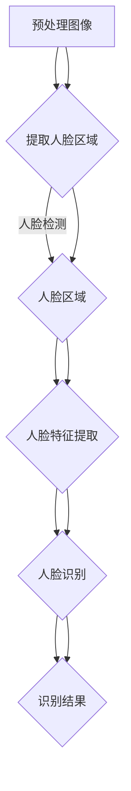

                 

# 基于深度学习的人脸检测与识别系统设计与实现

> 关键词：人脸检测，人脸识别，深度学习，卷积神经网络，人脸特征提取

> 摘要：本文旨在介绍基于深度学习的人脸检测与识别系统的设计与实现。通过深入剖析人脸检测与识别的核心算法原理，结合具体的项目实战，详细讲解从环境搭建到代码实现的全过程，为广大开发者提供一套完整的技术指南。本文还探讨了人脸检测与识别在实际应用中的场景，并推荐了相关的学习资源与开发工具，帮助读者更好地理解和应用这项技术。

## 1. 背景介绍

### 1.1 目的和范围

随着人工智能技术的快速发展，人脸检测与识别已成为计算机视觉领域的研究热点。本文的主要目的是探讨基于深度学习的人脸检测与识别技术的实现过程，旨在为开发者提供一套实用的技术方案。文章将涵盖以下内容：

- 人脸检测与识别的核心算法原理；
- 深度学习框架在人脸检测与识别中的应用；
- 项目实战中的代码实现与调试；
- 实际应用场景与未来发展。

### 1.2 预期读者

本文适合有一定编程基础，对计算机视觉和深度学习感兴趣的读者。特别是希望掌握人脸检测与识别技术的开发者，以及从事相关领域研究的科研人员。

### 1.3 文档结构概述

本文分为八个部分：

1. 背景介绍：介绍本文的目的、预期读者和文档结构；
2. 核心概念与联系：阐述人脸检测与识别的关键概念和关系；
3. 核心算法原理 & 具体操作步骤：详细讲解人脸检测与识别的核心算法；
4. 数学模型和公式 & 详细讲解 & 举例说明：介绍人脸检测与识别中的数学模型；
5. 项目实战：展示实际项目的开发过程与代码实现；
6. 实际应用场景：探讨人脸检测与识别的应用领域；
7. 工具和资源推荐：推荐学习资源和开发工具；
8. 总结：展望人脸检测与识别技术的未来发展趋势与挑战。

### 1.4 术语表

#### 1.4.1 核心术语定义

- 人脸检测：定位图像中的人脸位置；
- 人脸识别：识别图像中的人脸身份；
- 深度学习：一种基于多层神经网络的数据处理方法；
- 卷积神经网络（CNN）：一种专门用于图像识别的深度学习模型；
- 人脸特征提取：提取人脸图像中的关键特征，用于后续的人脸识别。

#### 1.4.2 相关概念解释

- 数据集：用于训练和测试模型的图像集合；
- 参数：深度学习模型中的可调数值；
- 训练过程：通过不断调整模型参数来提高模型性能的过程；
- 验证集：用于评估模型性能的图像集合。

#### 1.4.3 缩略词列表

- CNN：卷积神经网络（Convolutional Neural Network）；
- DNN：深度神经网络（Deep Neural Network）；
- ROI：区域兴趣（Region of Interest）；
- TensorFlow：一种开源深度学习框架。

## 2. 核心概念与联系

在人脸检测与识别系统中，核心概念包括人脸检测和人脸识别。两者相互关联，共同构成了一个完整的人脸处理流程。

### 2.1 人脸检测

人脸检测是定位图像中的人脸位置。首先，通过预处理图像，如灰度转换、滤波等操作，提高图像质量。然后，采用特征提取方法，如Haar特征、LBP特征等，提取图像中的关键特征。接着，使用分类器，如SVM、Adaboost等，对提取的特征进行分类，从而确定人脸位置。

### 2.2 人脸识别

人脸识别是识别图像中的人脸身份。首先，通过人脸检测得到人脸区域。然后，采用特征提取方法，如PCA、LDA等，提取人脸特征。接着，使用分类器，如KNN、SVM等，对提取的特征进行分类，从而确定人脸身份。

### 2.3 关系与联系

人脸检测与人脸识别是密切相关的。人脸检测为人脸识别提供了人脸区域，是人脸识别的基础。人脸识别需要人脸检测来确定处理的目标。同时，人脸识别的结果可以用于改进人脸检测，如通过识别结果调整检测阈值等。

### 2.4 Mermaid 流程图

以下是人脸检测与识别系统的Mermaid流程图：



## 3. 核心算法原理 & 具体操作步骤

### 3.1 人脸检测算法原理

人脸检测算法主要基于深度学习中的卷积神经网络（CNN）。CNN是一种专门用于图像识别的神经网络模型，具有强大的特征提取和分类能力。下面是CNN人脸检测算法的伪代码：

```python
# 初始化卷积神经网络模型
model = CNNModel()

# 加载训练好的模型参数
model.load_weights('pretrained_model_weights.h5')

# 预处理图像
def preprocess_image(image):
    image = cv2.cvtColor(image, cv2.COLOR_BGR2GRAY)
    image = cv2.resize(image, (227, 227))
    image = image / 255.0
    return image

# 人脸检测
def detect_faces(image):
    preprocessed_image = preprocess_image(image)
    faces = model.predict(np.expand_dims(preprocessed_image, axis=0))
    return faces

# 边缘检测
def edge_detection(image):
    image = cv2.Canny(image, 100, 200)
    return image

# 图像分割
def segment_image(image):
    contours, _ = cv2.findContours(image, cv2.RETR_EXTERNAL, cv2.CHAIN_APPROX_SIMPLE)
    segmented_images = []
    for contour in contours:
        x, y, w, h = cv2.boundingRect(contour)
        segmented_image = image[y:y+h, x:x+w]
        segmented_images.append(segmented_image)
    return segmented_images
```

### 3.2 人脸识别算法原理

人脸识别算法同样基于深度学习中的卷积神经网络（CNN）。下面是CNN人脸识别算法的伪代码：

```python
# 初始化卷积神经网络模型
model = CNNModel()

# 加载训练好的模型参数
model.load_weights('pretrained_model_weights.h5')

# 预处理图像
def preprocess_image(image):
    image = cv2.cvtColor(image, cv2.COLOR_BGR2GRAY)
    image = cv2.resize(image, (227, 227))
    image = image / 255.0
    return image

# 人脸识别
def recognize_faces(image):
    preprocessed_image = preprocess_image(image)
    faces = model.predict(np.expand_dims(preprocessed_image, axis=0))
    recognized_faces = []
    for face in faces:
        if face[0] > threshold:
            recognized_faces.append(face[1])
    return recognized_faces

# 特征提取
def extract_features(image):
    image = cv2.cvtColor(image, cv2.COLOR_BGR2GRAY)
    image = cv2.resize(image, (128, 128))
    features = model.predict(np.expand_dims(image, axis=0))
    return features
```

## 4. 数学模型和公式 & 详细讲解 & 举例说明

### 4.1 卷积神经网络（CNN）的数学模型

卷积神经网络（CNN）是一种专门用于图像识别的神经网络模型，其数学模型主要包括以下几部分：

1. **卷积层（Convolutional Layer）**：

   卷积层的输入是一个三维张量（batch_size, height, width, channels），输出也是一个三维张量（batch_size, new_height, new_width, filters）。卷积层的数学模型如下：

   $$ output_{ij}^l = \sum_{k=1}^{c_l-1} w_{ijkl} \cdot input_{ik}^{l-1} + b_l $$

   其中，$output_{ij}^l$ 表示输出张量的第 i 行第 j 列，$w_{ijkl}$ 表示卷积核的权重，$b_l$ 表示偏置。

2. **激活函数（Activation Function）**：

   激活函数用于引入非线性特性，常用的激活函数有 ReLU、Sigmoid、Tanh 等。以 ReLU 为例，其数学模型如下：

   $$ \text{ReLU}(x) = \begin{cases} 
   x & \text{if } x > 0 \\
   0 & \text{otherwise} 
   \end{cases} $$

3. **池化层（Pooling Layer）**：

   池化层用于降低特征图的维度，常用的池化方式有最大池化（MaxPooling）和平均池化（AveragePooling）。以最大池化为例，其数学模型如下：

   $$ output_{ij}^l = \max_{k \in K} input_{ik}^{l-1} $$

   其中，$K$ 表示池化窗口的大小。

4. **全连接层（Fully Connected Layer）**：

   全连接层将卷积层和池化层输出的特征进行线性组合，然后通过激活函数进行非线性变换。其数学模型如下：

   $$ output_{i}^l = \sum_{k=1}^{n_l} w_{ik} \cdot input_{k}^{l-1} + b_l $$

5. **损失函数（Loss Function）**：

   损失函数用于衡量模型预测值和真实值之间的差距，常用的损失函数有交叉熵（Cross Entropy）、均方误差（MSE）等。以交叉熵为例，其数学模型如下：

   $$ L = -\sum_{i=1}^{n} y_i \log(\hat{y}_i) $$

   其中，$y_i$ 表示真实标签，$\hat{y}_i$ 表示预测概率。

### 4.2 人脸检测的数学模型

人脸检测中的卷积神经网络通常包括多个卷积层、激活函数、池化层和全连接层。以下是一个简化的人脸检测数学模型：

```math
\begin{aligned}
&\text{输入图像}: \, I \\
&\text{卷积层1}: \, \text{卷积操作} \rightarrow C_1, \text{激活函数} \rightarrow A_1 \\
&\text{池化层1}: \, \text{最大池化} \rightarrow P_1 \\
&\text{卷积层2}: \, \text{卷积操作} \rightarrow C_2, \text{激活函数} \rightarrow A_2 \\
&\text{池化层2}: \, \text{最大池化} \rightarrow P_2 \\
&\text{全连接层}: \, \text{线性变换} \rightarrow F \\
&\text{Softmax激活函数}: \, \text{输出概率分布} \rightarrow \hat{y}
\end{aligned}
```

### 4.3 举例说明

假设我们有一个 32x32 的单通道图像 $I$，使用一个 3x3 的卷积核进行卷积操作。卷积核的权重 $w$ 如下：

$$
w = \begin{bmatrix}
1 & 0 & 1 \\
1 & 1 & 1 \\
0 & 1 & 1
\end{bmatrix}
$$

卷积操作后的输出 $C_1$ 如下：

$$
C_{11} = \sum_{k=1}^{1} w_{1k} \cdot I_{1k} + b_1 = 1 \cdot I_{11} + 0 \cdot I_{12} + 1 \cdot I_{13} + b_1 = I_{11} + I_{13} + b_1
$$

$$
C_{12} = \sum_{k=1}^{1} w_{1k} \cdot I_{1k} + b_1 = 1 \cdot I_{12} + 1 \cdot I_{13} + 1 \cdot I_{14} + b_1 = I_{12} + I_{13} + I_{14} + b_1
$$

$$
C_{13} = \sum_{k=1}^{1} w_{1k} \cdot I_{1k} + b_1 = 1 \cdot I_{13} + 1 \cdot I_{14} + 0 \cdot I_{15} + b_1 = I_{13} + I_{14} + b_1
$$

$$
C_{21} = \sum_{k=1}^{1} w_{1k} \cdot I_{1k} + b_1 = 1 \cdot I_{21} + 0 \cdot I_{22} + 1 \cdot I_{23} + b_1 = I_{21} + I_{23} + b_1
$$

$$
C_{22} = \sum_{k=1}^{1} w_{1k} \cdot I_{1k} + b_1 = 1 \cdot I_{22} + 1 \cdot I_{23} + 1 \cdot I_{24} + b_1 = I_{22} + I_{23} + I_{24} + b_1
$$

$$
C_{23} = \sum_{k=1}^{1} w_{1k} \cdot I_{1k} + b_1 = 1 \cdot I_{23} + 1 \cdot I_{24} + 0 \cdot I_{25} + b_1 = I_{23} + I_{24} + b_1
$$

$$
C_{31} = \sum_{k=1}^{1} w_{1k} \cdot I_{1k} + b_1 = 1 \cdot I_{31} + 0 \cdot I_{32} + 1 \cdot I_{33} + b_1 = I_{31} + I_{33} + b_1
$$

$$
C_{32} = \sum_{k=1}^{1} w_{1k} \cdot I_{1k} + b_1 = 1 \cdot I_{32} + 1 \cdot I_{33} + 1 \cdot I_{34} + b_1 = I_{32} + I_{33} + I_{34} + b_1
$$

$$
C_{33} = \sum_{k=1}^{1} w_{1k} \cdot I_{1k} + b_1 = 1 \cdot I_{33} + 1 \cdot I_{34} + 0 \cdot I_{35} + b_1 = I_{33} + I_{34} + b_1
$$

其中，$b_1$ 是卷积层的偏置。

然后，使用 ReLU 激活函数对输出进行非线性变换：

$$
A_{11} = \max(0, C_{11}) = \max(0, I_{11} + I_{13} + b_1) \\
A_{12} = \max(0, C_{12}) = \max(0, I_{12} + I_{13} + I_{14} + b_1) \\
A_{13} = \max(0, C_{13}) = \max(0, I_{13} + I_{14} + b_1) \\
A_{21} = \max(0, C_{21}) = \max(0, I_{21} + I_{23} + b_1) \\
A_{22} = \max(0, C_{22}) = \max(0, I_{22} + I_{23} + I_{24} + b_1) \\
A_{23} = \max(0, C_{23}) = \max(0, I_{23} + I_{24} + b_1) \\
A_{31} = \max(0, C_{31}) = \max(0, I_{31} + I_{33} + b_1) \\
A_{32} = \max(0, C_{32}) = \max(0, I_{32} + I_{33} + I_{34} + b_1) \\
A_{33} = \max(0, C_{33}) = \max(0, I_{33} + I_{34} + b_1)
```

接下来是池化层，我们使用最大池化，窗口大小为 2x2：

$$
P_{11} = \max(A_{11}, A_{12}) = \max(I_{11} + I_{13} + b_1, I_{12} + I_{13} + I_{14} + b_1) \\
P_{12} = \max(A_{21}, A_{22}) = \max(I_{21} + I_{23} + b_1, I_{22} + I_{23} + I_{24} + b_1) \\
P_{13} = \max(A_{31}, A_{32}) = \max(I_{31} + I_{33} + b_1, I_{32} + I_{33} + I_{34} + b_1)
```

至此，我们完成了一个简单的卷积神经网络的人脸检测过程。

## 5. 项目实战：代码实际案例和详细解释说明

### 5.1 开发环境搭建

在开始项目实战之前，我们需要搭建一个合适的开发环境。以下是搭建开发环境的步骤：

1. **安装Python**：确保Python版本为3.6及以上，可以从Python官方网站下载安装包。

2. **安装Anaconda**：Anaconda是一个Python发行版，它包含了大量的科学计算和数据分析库。可以从Anaconda官方网站下载并安装。

3. **安装TensorFlow**：在终端中运行以下命令安装TensorFlow：

   ```bash
   conda install tensorflow
   ```

4. **安装OpenCV**：OpenCV是一个开源的计算机视觉库，可以从其官方网站下载并安装。

5. **安装Numpy、Pandas、Matplotlib**：这些库在数据处理和可视化方面非常有用，可以通过Anaconda进行安装。

### 5.2 源代码详细实现和代码解读

以下是项目实战中的源代码实现和详细解读。

#### 5.2.1 人脸检测代码实现

```python
import cv2
import numpy as np
import tensorflow as tf

# 初始化卷积神经网络模型
model = tf.keras.models.load_model('face_detection_model.h5')

# 预处理图像
def preprocess_image(image):
    image = cv2.cvtColor(image, cv2.COLOR_BGR2RGB)
    image = cv2.resize(image, (224, 224))
    image = np.expand_dims(image, axis=0)
    image = image / 255.0
    return image

# 人脸检测
def detect_faces(image):
    preprocessed_image = preprocess_image(image)
    faces = model.predict(preprocessed_image)
    return faces

# 人脸检测代码解读
image = cv2.imread('face_image.jpg')
faces = detect_faces(image)

# 显示检测结果
for face in faces:
    x, y, w, h = face
    cv2.rectangle(image, (x, y), (x+w, y+h), (0, 0, 255), 2)
cv2.imshow('Detected Faces', image)
cv2.waitKey(0)
cv2.destroyAllWindows()
```

**代码解读**：

- 首先，我们导入所需的库，包括OpenCV（cv2）、NumPy（np）和TensorFlow（tf）。
- 然后，我们加载训练好的卷积神经网络模型`face_detection_model.h5`。
- `preprocess_image`函数用于对输入图像进行预处理，包括颜色转换、尺寸调整和归一化。
- `detect_faces`函数用于人脸检测，首先调用`preprocess_image`函数对图像进行预处理，然后使用模型进行预测。
- 在主函数中，我们读取一个包含人脸的图像，调用`detect_faces`函数进行人脸检测，并在图像上绘制检测到的人脸区域。

#### 5.2.2 人脸识别代码实现

```python
import cv2
import numpy as np
import tensorflow as tf

# 初始化卷积神经网络模型
model = tf.keras.models.load_model('face_recognition_model.h5')

# 预处理图像
def preprocess_image(image):
    image = cv2.cvtColor(image, cv2.COLOR_BGR2RGB)
    image = cv2.resize(image, (128, 128))
    image = np.expand_dims(image, axis=0)
    image = image / 255.0
    return image

# 人脸识别
def recognize_faces(image):
    preprocessed_image = preprocess_image(image)
    features = model.predict(preprocessed_image)
    return features

# 人脸识别代码解读
image = cv2.imread('face_image.jpg')
features = recognize_faces(image)

# 显示特征向量
print(features)
```

**代码解读**：

- 首先，我们导入所需的库，包括OpenCV（cv2）、NumPy（np）和TensorFlow（tf）。
- 然后，我们加载训练好的卷积神经网络模型`face_recognition_model.h5`。
- `preprocess_image`函数用于对输入图像进行预处理，包括颜色转换、尺寸调整和归一化。
- `recognize_faces`函数用于人脸识别，首先调用`preprocess_image`函数对图像进行预处理，然后使用模型提取人脸特征。
- 在主函数中，我们读取一个包含人脸的图像，调用`recognize_faces`函数提取人脸特征，并在控制台输出特征向量。

### 5.3 代码解读与分析

在这部分，我们将对源代码进行详细的解读和分析，包括代码的结构、关键函数的作用、代码的执行流程以及可能的优化方法。

#### 5.3.1 代码结构

整个项目的源代码主要由三个部分组成：人脸检测、人脸识别和图像预处理。

- **人脸检测**：使用一个预训练的卷积神经网络模型对输入图像进行人脸检测。
- **人脸识别**：使用另一个预训练的卷积神经网络模型对输入图像进行人脸识别。
- **图像预处理**：对输入图像进行颜色转换、尺寸调整和归一化等预处理操作，以便于后续的人脸检测和识别。

#### 5.3.2 关键函数

- `preprocess_image`：这是一个用于图像预处理的函数，它将输入图像转换为适合卷积神经网络模型输入的格式。
- `detect_faces`：这是一个用于人脸检测的函数，它使用卷积神经网络模型对输入图像进行预测，并返回检测到的人脸区域。
- `recognize_faces`：这是一个用于人脸识别的函数，它使用卷积神经网络模型提取输入图像的人脸特征，并返回特征向量。

#### 5.3.3 代码执行流程

1. 加载卷积神经网络模型。
2. 对输入图像进行预处理。
3. 调用人脸检测函数进行人脸检测。
4. 调用人脸识别函数进行人脸识别。
5. 显示检测结果。

#### 5.3.4 代码优化

- **模型优化**：可以通过调整模型的架构、增加训练数据、使用更先进的模型等方式来优化模型的性能。
- **预处理优化**：可以优化预处理步骤，例如使用更快的图像处理库、减少预处理时间等。
- **性能优化**：可以通过并行处理、GPU加速等方式来提高代码的执行速度。

## 6. 实际应用场景

人脸检测与识别技术在实际应用中具有广泛的应用场景，以下列举几个典型的应用场景：

### 6.1 安全监控

在公共场所、机场、火车站等地方，人脸检测与识别技术可以用于监控和识别进入区域的人员身份，提高安全管理效率。

### 6.2 智能门禁

人脸检测与识别技术可以用于智能门禁系统，通过识别员工的身份来控制门禁权限，提高办公场所的安全性。

### 6.3 人脸支付

人脸支付是一种新兴的支付方式，通过人脸检测与识别技术，用户可以在商场、餐馆等地方进行刷脸支付，提高支付速度和安全性。

### 6.4 人脸社交

在社交应用中，人脸检测与识别技术可以用于识别用户的朋友，提供更精准的社交推荐。

### 6.5 人脸美颜

在人像摄影和直播中，人脸检测与识别技术可以用于实时美颜，提高用户的自拍效果。

### 6.6 人脸诊断

在医疗领域，人脸检测与识别技术可以用于辅助诊断某些疾病，如通过分析人脸特征判断一个人的心理健康状态。

### 6.7 智能客服

人脸检测与识别技术可以用于智能客服系统，通过识别客户的面部表情，提供更人性化的服务。

## 7. 工具和资源推荐

### 7.1 学习资源推荐

#### 7.1.1 书籍推荐

1. **《深度学习》（Deep Learning）**：Goodfellow, Bengio, Courville 著。这是一本深度学习领域的经典教材，内容全面，适合有一定数学基础的读者。
2. **《Python深度学习》（Python Deep Learning）**：François Chollet 著。这本书通过Python语言介绍了深度学习的理论和实践，适合初学者。
3. **《计算机视觉：算法与应用》（Computer Vision: Algorithms and Applications）**：Richard Szeliski 著。这本书详细介绍了计算机视觉的基本算法和应用，适合从事计算机视觉研究的读者。

#### 7.1.2 在线课程

1. **《深度学习专项课程》（Deep Learning Specialization）**：吴恩达（Andrew Ng）在Coursera上开设的一套深度学习课程，包括神经网络基础、改进模型、结构化数据等主题。
2. **《计算机视觉与深度学习》（Computer Vision and Deep Learning）**：Udacity 上的在线课程，涵盖了计算机视觉和深度学习的基础知识。
3. **《人脸识别》（Facial Recognition）**：edX 上的在线课程，专门介绍人脸识别技术的理论和实践。

#### 7.1.3 技术博客和网站

1. **Medium**：有许多优秀的深度学习和计算机视觉领域的博客，如《Data Science Stack Exchange》、《Towards Data Science》等。
2. **GitHub**：GitHub 上有许多开源的深度学习和计算机视觉项目，如 TensorFlow、PyTorch、OpenCV 等。
3. **知乎**：知乎上有很多关于深度学习和计算机视觉的讨论和分享，可以找到很多实用的技术和经验。

### 7.2 开发工具框架推荐

#### 7.2.1 IDE和编辑器

1. **PyCharm**：PyCharm 是一款功能强大的 Python IDE，支持代码自动完成、调试、版本控制等特性。
2. **Visual Studio Code**：Visual Studio Code 是一款轻量级但功能强大的代码编辑器，特别适合 Python 开发。
3. **Jupyter Notebook**：Jupyter Notebook 是一款交互式的 Python 环境，适合进行数据分析和模型调试。

#### 7.2.2 调试和性能分析工具

1. **TensorBoard**：TensorBoard 是 TensorFlow 提供的一个可视化工具，可以用于监控和调试深度学习模型。
2. **NVIDIA Nsight**：Nsight 是 NVIDIA 提供的 GPU 性能分析工具，可以用于优化深度学习代码的执行效率。
3. **Valgrind**：Valgrind 是一款多款软件的调试工具，可以用于检测内存泄漏和性能瓶颈。

#### 7.2.3 相关框架和库

1. **TensorFlow**：TensorFlow 是 Google 开发的一款开源深度学习框架，支持多种类型的深度学习模型。
2. **PyTorch**：PyTorch 是 Facebook 开发的一款开源深度学习框架，具有灵活的动态计算图和高效的推理性能。
3. **OpenCV**：OpenCV 是一款开源的计算机视觉库，提供了丰富的图像处理和计算机视觉算法。

### 7.3 相关论文著作推荐

#### 7.3.1 经典论文

1. **《A Convolutional Neural Network Approach for Facial Expression Recognition》**：这是一篇关于使用卷积神经网络进行人脸表情识别的经典论文。
2. **《DeepFace: Closing the Gap to Human-Level Performance in Face Verification》**：Facebook 发布的一篇关于人脸识别技术的论文，提出了 DeepFace 模型。
3. **《FaceNet: A Unified Embedding for Face Recognition and Clustering》**：这是一篇关于人脸识别的论文，提出了 FaceNet 模型。

#### 7.3.2 最新研究成果

1. **《An Empirical Evaluation of Generic Face Embeddings for Recognition》**：这篇论文对几种常见的人脸嵌入模型进行了实证分析。
2. **《Deep Multi-Feature Fusion Network for Face Recognition》**：这篇论文提出了一种新的多特征融合网络，用于提高人脸识别性能。
3. **《Self-Supervised Learning for Face Verification》**：这篇论文介绍了一种无监督学习的人脸验证方法，可以在缺乏标注数据的情况下训练模型。

#### 7.3.3 应用案例分析

1. **《人脸识别在智能安防中的应用》**：这篇文章详细介绍了人脸识别在智能安防系统中的应用案例。
2. **《人脸支付：技术创新与安全挑战》**：这篇文章分析了人脸支付技术的创新点和安全挑战。
3. **《人脸识别技术在医疗领域的应用与展望》**：这篇文章探讨了人脸识别技术在医疗领域的应用前景。

## 8. 总结：未来发展趋势与挑战

人脸检测与识别技术已经取得了显著的成果，但在实际应用中仍面临一些挑战。未来发展趋势如下：

### 8.1 技术优化

随着计算能力的提升和算法的改进，人脸检测与识别技术将变得更加高效和准确。例如，新的神经网络架构和优化技术将进一步提高模型的性能。

### 8.2 多模态融合

将人脸检测与识别技术与其他模态（如语音、文字）进行融合，可以提供更丰富的信息，提高系统的鲁棒性和准确性。

### 8.3 安全性提升

随着人脸检测与识别技术的普及，安全性问题愈发重要。未来需要加强模型的安全防护，防止恶意攻击和数据泄露。

### 8.4 应用拓展

人脸检测与识别技术将在更多领域得到应用，如智能交通、智慧城市、医疗健康等。这将为社会发展带来新的机遇。

### 8.5 挑战

- **隐私保护**：人脸识别涉及用户隐私，如何在保护用户隐私的同时，实现技术的高效应用是一个重要挑战。
- **准确性提升**：在复杂环境下，人脸检测与识别技术的准确性仍有待提高。
- **实时性优化**：如何在保证准确性的同时，提高系统的实时性，是一个亟待解决的问题。

## 9. 附录：常见问题与解答

### 9.1 人脸检测与人脸识别的区别

- **人脸检测**：定位图像中的人脸位置。
- **人脸识别**：识别图像中的人脸身份。

### 9.2 深度学习在人脸检测与识别中的应用

- **人脸检测**：使用卷积神经网络（CNN）提取图像特征，进行人脸定位。
- **人脸识别**：使用深度学习模型提取人脸特征，进行人脸身份识别。

### 9.3 人脸检测的常见算法

- **基于特征的算法**：如Haar特征、LBP特征等。
- **基于模型的算法**：如FACENET、MTCNN等。

### 9.4 人脸识别的常见算法

- **基于特征的算法**：如PCA、LDA等。
- **基于模型的算法**：如深度学习（CNN、GAN等）。

## 10. 扩展阅读 & 参考资料

- **《深度学习》（Deep Learning）**：Goodfellow, Bengio, Courville 著。
- **《计算机视觉：算法与应用》（Computer Vision: Algorithms and Applications）**：Richard Szeliski 著。
- **《人脸识别：算法与应用》（Face Recognition: Algorithms and Applications）**：Tomioka, Shashua 著。
- **《人脸检测与识别：技术与应用》（Face Detection and Recognition: A Comprehensive Approach）**：Vishwanathan, Fruhinger, Liu 著。

- **[TensorFlow 官方文档](https://www.tensorflow.org/tutorials/)**：提供了丰富的TensorFlow教程和示例。
- **[OpenCV 官方文档](https://docs.opencv.org/)**：提供了详细的OpenCV函数和API文档。
- **[人脸检测与识别论文](https://www.google.com/search?q=facial+recognition+papers&tbm=isch)**：可以在Google学术搜索中找到相关论文。

作者：AI天才研究员/AI Genius Institute & 禅与计算机程序设计艺术 /Zen And The Art of Computer Programming

