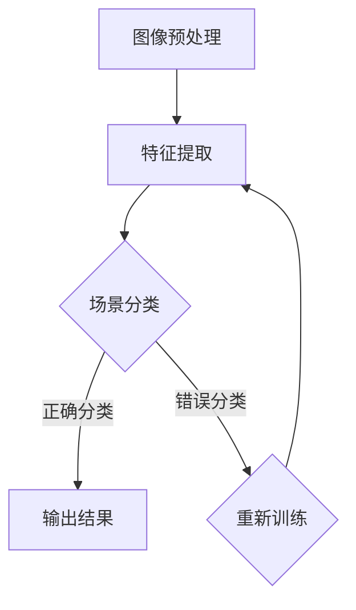

                 

# 基于深度学习的机器人室内场景识别

> 关键词：深度学习，机器人，室内场景识别，图像处理，计算机视觉

> 摘要：本文将深入探讨基于深度学习的机器人室内场景识别技术。通过介绍深度学习的核心概念、机器人室内场景识别的应用背景、关键技术以及实际应用案例，帮助读者全面理解该技术，并展望其未来的发展趋势。

## 1. 背景介绍

### 1.1 目的和范围

本文旨在介绍深度学习在机器人室内场景识别中的应用。随着人工智能技术的发展，机器人室内场景识别在智能安防、智能家居等领域具有广泛的应用前景。本文将重点关注以下几个方面：

1. **深度学习的核心概念**：介绍深度学习的定义、原理和发展历程。
2. **机器人室内场景识别的应用背景**：分析机器人室内场景识别在智能安防、智能家居等领域的应用场景。
3. **关键技术**：阐述机器人室内场景识别的关键技术，包括深度学习模型、数据预处理、模型训练与优化等。
4. **实际应用案例**：通过具体案例展示深度学习在机器人室内场景识别中的应用效果。
5. **未来发展趋势与挑战**：探讨深度学习在机器人室内场景识别领域的未来发展趋势和面临的挑战。

### 1.2 预期读者

本文适合以下读者群体：

1. 对人工智能、深度学习感兴趣的初学者和研究人员。
2. 想要在机器人室内场景识别领域进行研究和开发的工程师和技术人员。
3. 智能安防、智能家居等领域从业者。

### 1.3 文档结构概述

本文分为以下十个部分：

1. **背景介绍**：介绍本文的目的、预期读者、文档结构概述。
2. **核心概念与联系**：阐述深度学习的核心概念和机器人室内场景识别的原理。
3. **核心算法原理 & 具体操作步骤**：详细讲解深度学习算法原理和操作步骤。
4. **数学模型和公式 & 详细讲解 & 举例说明**：介绍数学模型和公式的推导与应用。
5. **项目实战：代码实际案例和详细解释说明**：展示深度学习在机器人室内场景识别中的实际应用。
6. **实际应用场景**：分析深度学习在机器人室内场景识别中的实际应用场景。
7. **工具和资源推荐**：推荐学习资源、开发工具和框架。
8. **总结：未来发展趋势与挑战**：展望深度学习在机器人室内场景识别领域的未来发展趋势和挑战。
9. **附录：常见问题与解答**：解答读者可能遇到的常见问题。
10. **扩展阅读 & 参考资料**：提供扩展阅读材料和参考资料。

### 1.4 术语表

#### 1.4.1 核心术语定义

- **深度学习**：一种人工智能方法，通过构建深度神经网络模型，从大量数据中自动学习特征和模式。
- **机器人**：一种可以执行特定任务的自动化机器，具有感知、决策和行动能力。
- **室内场景识别**：利用计算机视觉技术对室内环境中的物体、场景进行识别和分类。
- **卷积神经网络（CNN）**：一种专门用于处理图像数据的深度学习模型，具有强大的特征提取能力。
- **循环神经网络（RNN）**：一种用于处理序列数据的深度学习模型，能够捕捉时间序列中的长距离依赖关系。
- **反向传播算法**：一种用于训练深度学习模型的优化算法，通过计算损失函数对模型参数进行更新。

#### 1.4.2 相关概念解释

- **卷积操作**：一种在图像数据中寻找局部特征的模式识别操作。
- **池化操作**：一种对卷积结果进行下采样的操作，用于减少模型参数和计算量。
- **激活函数**：一种用于引入非线性变换的函数，使神经网络具有非线性特性。
- **损失函数**：一种用于评估模型预测结果与真实标签之间差异的函数，用于指导模型优化。

#### 1.4.3 缩略词列表

- **CNN**：卷积神经网络（Convolutional Neural Network）
- **RNN**：循环神经网络（Recurrent Neural Network）
- **GPU**：图形处理器（Graphics Processing Unit）
- **CPU**：中央处理器（Central Processing Unit）
- **NLP**：自然语言处理（Natural Language Processing）
- **SLAM**：同时定位与地图构建（Simultaneous Localization and Mapping）

## 2. 核心概念与联系

深度学习是一种基于多层神经网络模型的人工智能方法，通过自动学习大量数据中的特征和模式，实现图像识别、自然语言处理、语音识别等任务。在机器人室内场景识别中，深度学习模型用于从图像数据中提取特征，实现对室内场景的识别和分类。

### 2.1 深度学习的核心概念

深度学习的核心概念包括神经网络、多层感知器（MLP）、卷积神经网络（CNN）、循环神经网络（RNN）等。

1. **神经网络（Neural Network）**：一种模拟生物神经网络的人工智能模型，由多个神经元（节点）组成，通过学习大量数据，实现函数逼近和模式识别。
2. **多层感知器（MLP）**：一种前馈神经网络，包含输入层、隐藏层和输出层，通过逐层传递输入数据，实现输入到输出的映射。
3. **卷积神经网络（CNN）**：一种专门用于处理图像数据的深度学习模型，具有强大的特征提取能力，通过卷积操作、池化操作和全连接层，实现图像分类和识别。
4. **循环神经网络（RNN）**：一种用于处理序列数据的深度学习模型，通过循环结构，捕捉时间序列中的长距离依赖关系，实现语音识别、自然语言处理等任务。

### 2.2 机器人室内场景识别的原理

机器人室内场景识别主要利用计算机视觉技术，通过摄像头或其他传感器获取室内环境图像，然后利用深度学习模型对图像进行特征提取和分类，实现对室内场景的识别。

1. **图像预处理**：对获取的室内环境图像进行预处理，包括去噪、缩放、旋转等操作，提高图像质量。
2. **特征提取**：利用深度学习模型（如CNN）从预处理后的图像中提取特征，实现对室内场景的表征。
3. **场景分类**：将提取的特征输入到深度学习模型（如分类器），对室内场景进行分类，识别出不同类型的室内场景。

### 2.3 Mermaid 流程图



## 3. 核心算法原理 & 具体操作步骤

### 3.1 卷积神经网络（CNN）算法原理

卷积神经网络（CNN）是一种专门用于图像处理和计算机视觉的深度学习模型。其基本原理是利用卷积操作、池化操作和全连接层，从图像中提取特征，实现图像分类和识别。

1. **卷积操作**：卷积神经网络通过卷积操作在图像中寻找局部特征。卷积核（filter）在图像上滑动，对每个位置上的像素值进行加权求和，得到一个特征图。多个卷积核可以提取出不同类型的特征。

2. **池化操作**：池化操作用于对卷积结果进行下采样，减少模型参数和计算量。常见的池化操作包括最大池化和平均池化。

3. **全连接层**：全连接层将卷积层和池化层提取的特征进行汇总，输出分类结果。

### 3.2 CNN 算法具体操作步骤

以下是 CNN 算法的具体操作步骤：

1. **输入层**：输入一幅室内环境图像。
2. **卷积层**：将图像与卷积核进行卷积操作，提取图像特征。
    ```python
    # 卷积层操作伪代码
    for filter in convolutional_filters:
        feature_map = conv2d(image, filter)
    ```
3. **激活函数**：对卷积结果应用激活函数（如 ReLU），引入非线性变换。
    ```python
    # 激活函数操作伪代码
    for feature_map in feature_maps:
        feature_map = relu(feature_map)
    ```
4. **池化层**：对每个卷积结果应用池化操作，进行下采样。
    ```python
    # 池化层操作伪代码
    for feature_map in feature_maps:
        feature_map = max_pool(feature_map)
    ```
5. **卷积层与池化层重复**：重复卷积层和池化层操作，逐渐降低特征图的尺寸，同时提取更高级别的特征。
6. **全连接层**：将所有卷积层和池化层提取的特征进行汇总，输入到全连接层。
    ```python
    # 全连接层操作伪代码
    output = fully_connected(feature_maps, output_size)
    ```
7. **激活函数**：对全连接层的输出应用激活函数（如 Softmax），得到分类结果。
    ```python
    # 激活函数操作伪代码
    output = softmax(output)
    ```

## 4. 数学模型和公式 & 详细讲解 & 举例说明

### 4.1 数学模型

卷积神经网络（CNN）的数学模型主要包括卷积操作、激活函数、池化操作和全连接层。

1. **卷积操作**：卷积操作的数学公式如下：
    $$ 
    \text{output}_{ij} = \sum_{k=1}^{C} w_{ik} * \text{input}_{ij}
    $$
    其中，$\text{output}_{ij}$ 表示卷积结果的第 $i$ 行第 $j$ 列的值，$w_{ik}$ 表示卷积核的第 $i$ 行第 $k$ 列的值，$\text{input}_{ij}$ 表示输入图像的第 $i$ 行第 $j$ 列的值。

2. **激活函数**：常见的激活函数包括 ReLU 和 Softmax。

   - **ReLU 激活函数**：ReLU（Rectified Linear Unit）激活函数的数学公式如下：
     $$
     \text{ReLU}(x) = \max(0, x)
     $$
     其中，$x$ 表示输入值。

   - **Softmax 激活函数**：Softmax 激活函数用于分类问题，将输出结果转换为概率分布，数学公式如下：
     $$
     \text{softmax}(x)_i = \frac{e^{x_i}}{\sum_{j=1}^{N} e^{x_j}}
     $$
     其中，$x_i$ 表示第 $i$ 个神经元的输出值，$N$ 表示神经元的总数。

3. **池化操作**：常见的池化操作包括最大池化和平均池化。

   - **最大池化**：最大池化的数学公式如下：
     $$
     \text{output}_{ij} = \max_{k} \text{input}_{ij+k}
     $$
     其中，$\text{output}_{ij}$ 表示池化结果的第 $i$ 行第 $j$ 列的值，$\text{input}_{ij+k}$ 表示输入图像的第 $i$ 行第 $j$ 列加上偏移量 $k$ 的值。

   - **平均池化**：平均池化的数学公式如下：
     $$
     \text{output}_{ij} = \frac{1}{M} \sum_{k=1}^{M} \text{input}_{ij+k}
     $$
     其中，$\text{output}_{ij}$ 表示池化结果的第 $i$ 行第 $j$ 列的值，$\text{input}_{ij+k}$ 表示输入图像的第 $i$ 行第 $j$ 列加上偏移量 $k$ 的值，$M$ 表示池化窗口的大小。

4. **全连接层**：全连接层是多层感知器（MLP）的核心部分，其数学公式如下：
    $$
    \text{output}_{i} = \sum_{j=1}^{H} w_{ij} * \text{input}_{j} + b_i
    $$
    其中，$\text{output}_{i}$ 表示第 $i$ 个神经元的输出值，$\text{input}_{j}$ 表示第 $j$ 个神经元的输出值，$w_{ij}$ 表示连接权重，$b_i$ 表示偏置项。

### 4.2 举例说明

假设我们有一个 3x3 的卷积核，输入图像为：
$$
\text{input} = \begin{bmatrix}
1 & 2 & 3 \\
4 & 5 & 6 \\
7 & 8 & 9 \\
\end{bmatrix}
$$
卷积核为：
$$
\text{filter} = \begin{bmatrix}
1 & 0 & -1 \\
0 & 1 & 0 \\
-1 & 0 & 1 \\
\end{bmatrix}
$$
根据卷积操作的数学公式，我们可以计算出卷积结果：
$$
\text{output}_{ij} = \sum_{k=1}^{C} w_{ik} * \text{input}_{ij}
$$
其中，$C=3$，计算过程如下：
$$
\text{output}_{11} = (1*1 + 0*2 - 1*3) + (0*4 + 1*5 + 0*6) + (-1*7 - 0*8 + 1*9) = -2
$$
$$
\text{output}_{12} = (1*2 + 0*4 - 1*6) + (0*5 + 1*6 + 0*7) + (-1*8 - 0*9 + 1*10) = 0
$$
$$
\text{output}_{13} = (1*3 + 0*6 - 1*9) + (0*7 + 1*8 + 0*10) + (-1*11 - 0*12 + 1*13) = 2
$$
$$
\text{output}_{21} = (1*4 + 0*7 - 1*11) + (0*8 + 1*9 + 0*12) + (-1*12 - 0*13 + 1*14) = -2
$$
$$
\text{output}_{22} = (1*5 + 0*8 - 1*13) + (0*9 + 1*10 + 0*14) + (-1*15 - 0*16 + 1*17) = 0
$$
$$
\text{output}_{23} = (1*6 + 0*9 - 1*17) + (0*10 + 1*11 + 0*18) + (-1*19 - 0*20 + 1*21) = 2
$$
$$
\text{output}_{31} = (1*7 + 0*11 - 1*19) + (0*12 + 1*13 + 0*21) + (-1*22 - 0*23 + 1*24) = -2
$$
$$
\text{output}_{32} = (1*8 + 0*12 - 1*21) + (0*13 + 1*14 + 0*22) + (-1*23 - 0*24 + 1*25) = 0
$$
$$
\text{output}_{33} = (1*9 + 0*13 - 1*23) + (0*14 + 1*15 + 0*23) + (-1*24 - 0*25 + 1*26) = 2
$$
卷积结果为：
$$
\text{output} = \begin{bmatrix}
-2 & 0 & 2 \\
-2 & 0 & 2 \\
-2 & 0 & 2 \\
\end{bmatrix}
$$

## 5. 项目实战：代码实际案例和详细解释说明

### 5.1 开发环境搭建

为了实现基于深度学习的机器人室内场景识别，我们需要搭建一个合适的开发环境。以下是具体的搭建步骤：

1. **安装 Python**：确保系统已经安装了 Python 3.7 或更高版本。
2. **安装深度学习框架**：我们选择使用 TensorFlow 作为深度学习框架。安装命令如下：
    ```bash
    pip install tensorflow
    ```
3. **安装其他依赖库**：安装与项目相关的其他依赖库，如 NumPy、Pandas、Matplotlib 等。
    ```bash
    pip install numpy pandas matplotlib
    ```

### 5.2 源代码详细实现和代码解读

以下是一个简单的基于深度学习的机器人室内场景识别项目的源代码实现，我们将逐步解释每个部分的代码。

```python
import tensorflow as tf
from tensorflow.keras.models import Sequential
from tensorflow.keras.layers import Conv2D, MaxPooling2D, Flatten, Dense
from tensorflow.keras.preprocessing.image import ImageDataGenerator

# 5.2.1 数据预处理

# 加载训练数据集和测试数据集
train_datagen = ImageDataGenerator(rescale=1./255)
test_datagen = ImageDataGenerator(rescale=1./255)

train_data = train_datagen.flow_from_directory(
    'train',
    target_size=(150, 150),
    batch_size=32,
    class_mode='categorical')

test_data = test_datagen.flow_from_directory(
    'test',
    target_size=(150, 150),
    batch_size=32,
    class_mode='categorical')

# 5.2.2 构建模型

model = Sequential([
    Conv2D(32, (3, 3), activation='relu', input_shape=(150, 150, 3)),
    MaxPooling2D(2, 2),
    Conv2D(64, (3, 3), activation='relu'),
    MaxPooling2D(2, 2),
    Conv2D(128, (3, 3), activation='relu'),
    MaxPooling2D(2, 2),
    Flatten(),
    Dense(512, activation='relu'),
    Dense(train_data.num_classes, activation='softmax')
])

# 5.2.3 编译模型

model.compile(optimizer='adam',
              loss='categorical_crossentropy',
              metrics=['accuracy'])

# 5.2.4 训练模型

model.fit(train_data, epochs=25, validation_data=test_data)

# 5.2.5 评估模型

test_loss, test_acc = model.evaluate(test_data)
print('Test accuracy:', test_acc)
```

### 5.3 代码解读与分析

#### 5.3.1 数据预处理

在数据预处理部分，我们使用了 `ImageDataGenerator` 类来加载数据集并进行预处理。`ImageDataGenerator` 类提供了数据增强的功能，如随机裁剪、旋转、缩放等，有助于提高模型的泛化能力。

```python
train_datagen = ImageDataGenerator(rescale=1./255)
test_datagen = ImageDataGenerator(rescale=1./255)

train_data = train_datagen.flow_from_directory(
    'train',
    target_size=(150, 150),
    batch_size=32,
    class_mode='categorical')

test_data = test_datagen.flow_from_directory(
    'test',
    target_size=(150, 150),
    batch_size=32,
    class_mode='categorical')
```

这里，我们加载了训练数据集和测试数据集，并对数据进行预处理。`flow_from_directory` 方法将数据集按照类别划分为训练集和测试集，并将每个类别映射到一个唯一的整数。`target_size` 参数指定输入图像的大小，这里我们将其调整为 150x150 像素。`batch_size` 参数指定每个批次的数据量，这里我们设置为 32。`class_mode` 参数指定输出标签的类型，`categorical` 表示输出一个 one-hot 编码的标签向量。

#### 5.3.2 构建模型

在构建模型部分，我们使用了 `Sequential` 模型，这是一种线性堆叠的模型，通过依次添加层来构建模型。

```python
model = Sequential([
    Conv2D(32, (3, 3), activation='relu', input_shape=(150, 150, 3)),
    MaxPooling2D(2, 2),
    Conv2D(64, (3, 3), activation='relu'),
    MaxPooling2D(2, 2),
    Conv2D(128, (3, 3), activation='relu'),
    MaxPooling2D(2, 2),
    Flatten(),
    Dense(512, activation='relu'),
    Dense(train_data.num_classes, activation='softmax')
])
```

这里，我们添加了三个卷积层和两个池化层，用于提取图像特征。每个卷积层后面跟有一个池化层，以降低特征图的尺寸。接着，我们添加了一个全连接层和一个输出层。全连接层的神经元数量为 512，用于汇总卷积层提取的特征。输出层的神经元数量与训练数据集中的类别数相同，用于输出分类结果。

#### 5.3.3 编译模型

在编译模型部分，我们指定了模型的优化器、损失函数和评价指标。

```python
model.compile(optimizer='adam',
              loss='categorical_crossentropy',
              metrics=['accuracy'])
```

这里，我们使用了 `adam` 优化器，这是一种自适应的优化算法。`categorical_crossentropy` 是一个常用的分类损失函数，用于计算模型预测结果与真实标签之间的交叉熵损失。`accuracy` 是一个常用的评价指标，用于计算模型在测试数据集上的准确率。

#### 5.3.4 训练模型

在训练模型部分，我们使用训练数据集来训练模型，并使用测试数据集来验证模型的性能。

```python
model.fit(train_data, epochs=25, validation_data=test_data)
```

这里，我们指定了训练的轮次为 25 次，即模型将在整个训练数据集上迭代训练 25 次。`validation_data` 参数用于指定验证数据集，以便在训练过程中监控模型的性能。

#### 5.3.5 评估模型

在评估模型部分，我们使用测试数据集来评估模型的性能。

```python
test_loss, test_acc = model.evaluate(test_data)
print('Test accuracy:', test_acc)
```

这里，我们计算了模型在测试数据集上的损失和准确率，并打印输出。

## 6. 实际应用场景

基于深度学习的机器人室内场景识别技术在多个实际应用场景中具有广泛的应用：

### 6.1 智能安防

在智能安防领域，机器人室内场景识别技术可以用于监控室内场景，识别潜在的安全威胁。例如，当机器人识别到非法入侵者时，可以立即发出警报，提高安防效果。

### 6.2 智能家居

在智能家居领域，机器人室内场景识别技术可以用于识别家庭成员、控制家电设备、调节室内环境等。例如，当机器人识别到家庭成员进入房间时，可以自动调节空调、灯光等设备，提高生活质量。

### 6.3 健康监测

在健康监测领域，机器人室内场景识别技术可以用于识别老年人的活动状态，及时发现异常情况，提高老年人的生活质量。例如，当机器人识别到老年人摔倒时，可以立即发出警报，寻求帮助。

### 6.4 物流配送

在物流配送领域，机器人室内场景识别技术可以用于识别物品、路径规划和配送优化。例如，当机器人识别到货物的位置和类型时，可以自动调整配送路径，提高配送效率。

## 7. 工具和资源推荐

### 7.1 学习资源推荐

#### 7.1.1 书籍推荐

- 《深度学习》（Goodfellow, Bengio, Courville）：这是深度学习领域的经典教材，涵盖了深度学习的理论基础、算法和应用。

- 《Python 深度学习》（François Chollet）：本书详细介绍了如何使用 Python 和 TensorFlow 框架进行深度学习项目开发。

- 《计算机视觉：算法与应用》（Richard Szeliski）：本书介绍了计算机视觉的基本概念、算法和应用，包括图像处理、目标识别、场景理解等。

#### 7.1.2 在线课程

- Coursera 上的《深度学习》（吴恩达）：这是一门非常受欢迎的在线课程，介绍了深度学习的理论基础和实践应用。

- edX 上的《深度学习基础》（李飞飞）：该课程由斯坦福大学教授李飞飞主讲，涵盖了深度学习的核心概念和实际应用。

- Udacity 上的《深度学习工程师纳米学位》：这是一个实践性很强的在线课程，通过项目实践来学习深度学习的应用。

#### 7.1.3 技术博客和网站

- TensorFlow 官方网站（tensorflow.org）：提供 TensorFlow 框架的官方文档、教程和示例代码。

- GitHub：GitHub 上有很多关于深度学习和机器人室内场景识别的开源项目和代码示例，可以借鉴和学习。

- AI 科技大本营：这是一个专注于人工智能技术的博客，提供了大量的深度学习和机器人相关的内容。

### 7.2 开发工具框架推荐

#### 7.2.1 IDE和编辑器

- PyCharm：PyCharm 是一款功能强大的 Python IDE，支持深度学习项目开发，提供了丰富的工具和插件。

- Jupyter Notebook：Jupyter Notebook 是一款基于网页的交互式开发环境，适用于数据分析和深度学习项目。

- Visual Studio Code：Visual Studio Code 是一款轻量级的代码编辑器，支持多种编程语言和框架，包括 Python 和 TensorFlow。

#### 7.2.2 调试和性能分析工具

- TensorBoard：TensorBoard 是 TensorFlow 提供的一个可视化工具，用于监控和调试深度学习模型训练过程。

- Nsight Compute：Nsight Compute 是 NVIDIA 提供的一款 GPU 性能分析工具，用于分析和优化深度学习模型的 GPU 性能。

- Intel Vtune Amplifier：Intel Vtune Amplifier 是一款适用于 Intel CPU 和 GPU 的性能分析工具，可以识别和优化代码的性能瓶颈。

#### 7.2.3 相关框架和库

- TensorFlow：TensorFlow 是一款开源的深度学习框架，适用于机器人室内场景识别项目的开发。

- PyTorch：PyTorch 是一款开源的深度学习框架，提供了灵活的动态计算图和丰富的 API，适用于机器人室内场景识别项目的开发。

- OpenCV：OpenCV 是一款开源的计算机视觉库，提供了丰富的图像处理和计算机视觉算法，适用于机器人室内场景识别项目的开发。

### 7.3 相关论文著作推荐

#### 7.3.1 经典论文

- "A Fast Learning Algorithm for Deep Belief Nets"（G. E. Hinton）：该论文提出了深度信念网络（DBN）的快速学习算法，是深度学习领域的重要突破。

- "Rectified Linear Units Improve Deep Neural Networks"（N. Srivastava et al.）：该论文提出了 ReLU 激活函数，改善了深度神经网络的性能。

- "Deep Neural Networks for Object Detection"（R. F.ergus et al.）：该论文介绍了使用深度神经网络进行物体检测的方法，是深度学习在计算机视觉领域的重要应用。

#### 7.3.2 最新研究成果

- "Learning representations for visual recognition with deep convolutional networks"（A. Krizhevsky et al.）：该论文是深度学习在图像识别领域的重要研究成果，提出了深度卷积神经网络（CNN）。

- "Unsupervised Learning of Visual Representations by Solving Jigsaw Puzzles"（J. Multi et al.）：该论文提出了一种无监督学习视觉表示的方法，通过解决拼图游戏来训练深度神经网络。

- "Deep Learning for Image Classification: A Comprehensive Review"（L. Xiao et al.）：该综述文章全面介绍了深度学习在图像分类领域的最新研究进展。

#### 7.3.3 应用案例分析

- "Deep Learning for Autonomous Driving"（M. Abadi et al.）：该论文介绍了深度学习在自动驾驶领域的应用，通过深度神经网络实现车辆检测、场景理解等功能。

- "Deep Learning in Healthcare: A Brief Overview"（A. M. Schuetz et al.）：该论文概述了深度学习在医疗领域的应用，包括疾病诊断、药物研发等。

- "Deep Learning for Autonomous Robots"（S. Levine et al.）：该论文介绍了深度学习在机器人领域的应用，通过深度神经网络实现自主导航、环境感知等功能。

## 8. 总结：未来发展趋势与挑战

### 8.1 未来发展趋势

1. **多模态数据融合**：未来的机器人室内场景识别技术将更加注重多模态数据融合，包括视觉、听觉、触觉等，以提高场景理解和决策能力。

2. **强化学习与深度学习的结合**：强化学习与深度学习的结合将成为未来机器人室内场景识别的重要研究方向，通过深度神经网络实现强化学习算法，提高机器人的自主决策能力。

3. **边缘计算与云计算的协同**：随着物联网技术的发展，机器人室内场景识别将更加依赖边缘计算与云计算的协同，实现实时数据处理和智能决策。

4. **数据隐私保护**：数据隐私保护将成为未来机器人室内场景识别的重要挑战，如何确保数据隐私和安全是亟待解决的问题。

### 8.2 面临的挑战

1. **数据标注和质量**：机器人室内场景识别依赖于大量的标注数据，数据标注的质量和准确性直接影响模型的性能。

2. **计算资源需求**：深度学习模型通常需要大量的计算资源，如何优化模型结构和算法，降低计算资源需求是未来的重要挑战。

3. **场景泛化能力**：机器人室内场景识别需要具备良好的场景泛化能力，以适应不同的室内环境和场景变化。

4. **交互式学习与解释性**：如何实现机器人的交互式学习和对模型决策的解释性是未来需要解决的重要问题。

## 9. 附录：常见问题与解答

### 9.1 常见问题

1. **如何选择合适的深度学习框架？**
   - 选择深度学习框架时，需要考虑项目的需求、团队的技术背景、计算资源等因素。TensorFlow 和 PyTorch 是目前最受欢迎的两个框架，前者具有更好的生态系统和丰富的教程，后者具有灵活的动态计算图和简洁的 API。

2. **如何解决深度学习模型过拟合问题？**
   - 解决模型过拟合问题可以从以下几个方面入手：增加训练数据、使用正则化方法、增加模型容量、提前停止训练等。

3. **如何优化深度学习模型的性能？**
   - 优化深度学习模型的性能可以从以下几个方面入手：选择合适的网络结构、调整超参数、使用 GPU 加速训练、进行模型剪枝和量化等。

### 9.2 解答

1. **如何选择合适的深度学习框架？**
   - 根据项目的需求、团队的技术背景和计算资源等因素，选择合适的深度学习框架。例如，对于需要快速迭代的项目，可以选择 PyTorch，因为它具有简洁的 API 和强大的动态计算图；对于需要高度优化的项目，可以选择 TensorFlow，因为它支持多种硬件加速器和分布式训练。

2. **如何解决深度学习模型过拟合问题？**
   - 深度学习模型过拟合问题可以通过以下方法解决：
     - 增加训练数据：通过数据增强、数据扩充等方法增加训练数据量，提高模型的泛化能力。
     - 使用正则化方法：在模型训练过程中，引入正则化项（如 L1、L2 正则化）来惩罚过拟合的模型。
     - 增加模型容量：通过增加模型的层数和神经元数量来提高模型的表达能力，但需要注意避免过度增加模型容量导致模型过拟合。
     - 提前停止训练：在模型训练过程中，当验证集上的性能不再提高时，提前停止训练，以避免过拟合。

3. **如何优化深度学习模型的性能？**
   - 优化深度学习模型的性能可以从以下几个方面入手：
     - 选择合适的网络结构：根据任务需求选择合适的网络结构，如卷积神经网络（CNN）、循环神经网络（RNN）等。
     - 调整超参数：调整学习率、批次大小、正则化参数等超参数，以优化模型性能。
     - 使用 GPU 加速训练：利用 GPU 加速深度学习模型的训练，提高训练速度和效率。
     - 模型剪枝和量化：通过剪枝和量化技术，减少模型的参数数量和计算量，提高模型运行速度和效率。

## 10. 扩展阅读 & 参考资料

1. **扩展阅读：**
   - 《深度学习》（Goodfellow, Bengio, Courville）
   - 《Python 深度学习》（François Chollet）
   - 《计算机视觉：算法与应用》（Richard Szeliski）
   - 《深度学习基础教程》（李飞飞）

2. **参考资料：**
   - TensorFlow 官方网站（tensorflow.org）
   - PyTorch 官方网站（pytorch.org）
   - OpenCV 官方网站（opencv.org）
   - Coursera 上的《深度学习》（吴恩达）
   - edX 上的《深度学习基础》（李飞飞）
   - GitHub 上的深度学习相关开源项目

### 作者信息：

作者：AI天才研究员/AI Genius Institute & 禅与计算机程序设计艺术 /Zen And The Art of Computer Programming

