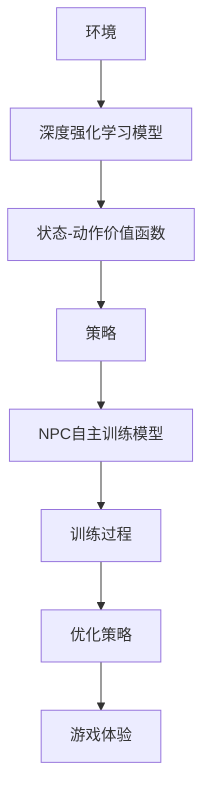

                 

# 基于深度强化学习的NPC自主训练模型构建的实现

> 关键词：深度强化学习，NPC，自主训练模型，人工智能，游戏设计，神经网络

> 摘要：本文旨在介绍一种基于深度强化学习技术的NPC（非玩家角色）自主训练模型的构建方法。我们将深入探讨深度强化学习的基本原理，并通过具体实例详细讲解NPC自主训练模型的实现步骤。本文的目标读者是具备一定编程基础和机器学习背景的技术爱好者，以及希望提高游戏AI设计能力的专业人士。

## 1. 背景介绍

### 1.1 目的和范围

本文的目的在于探讨如何利用深度强化学习技术实现NPC的自主训练。我们将在文中展示如何通过深度强化学习算法，让NPC角色在游戏中不断学习并优化其行为策略，从而提高游戏的智能水平和可玩性。本文主要涵盖以下内容：

1. 深度强化学习的基本原理和核心算法。
2. NPC自主训练模型的构建流程和关键步骤。
3. 深度强化学习在游戏AI设计中的应用实例。
4. 实际开发环境搭建和源代码实现。
5. 未来发展趋势和挑战。

### 1.2 预期读者

本文适合以下读者群体：

- 具备一定编程基础和机器学习背景的技术爱好者。
- 游戏开发人员，尤其是对游戏AI设计感兴趣的专业人士。
- 对深度强化学习技术感兴趣的研究人员和从业者。

### 1.3 文档结构概述

本文结构如下：

1. **背景介绍**：介绍文章目的、预期读者和文档结构。
2. **核心概念与联系**：讲解深度强化学习的基本原理和NPC自主训练模型的架构。
3. **核心算法原理 & 具体操作步骤**：详细阐述深度强化学习的算法原理和操作步骤。
4. **数学模型和公式 & 详细讲解 & 举例说明**：介绍深度强化学习中的数学模型和公式，并给出实例说明。
5. **项目实战：代码实际案例和详细解释说明**：展示实际代码实现过程和详细解释。
6. **实际应用场景**：讨论深度强化学习在游戏AI中的应用场景。
7. **工具和资源推荐**：推荐学习资源、开发工具框架和最新研究成果。
8. **总结：未来发展趋势与挑战**：总结文章内容，探讨未来发展趋势和挑战。
9. **附录：常见问题与解答**：回答读者可能遇到的常见问题。
10. **扩展阅读 & 参考资料**：提供进一步阅读的资源和参考。

### 1.4 术语表

#### 1.4.1 核心术语定义

- **深度强化学习**：一种结合了深度学习和强化学习的技术，通过神经网络来表示状态和行为，并优化策略。
- **NPC**：非玩家角色，通常在游戏、模拟器等虚拟环境中由计算机程序控制。
- **自主训练模型**：通过数据驱动的方式，让NPC角色能够自主学习和优化其行为策略。

#### 1.4.2 相关概念解释

- **强化学习**：一种机器学习范式，通过奖励机制来指导模型学习如何做出最佳决策。
- **深度学习**：一种机器学习方法，通过多层神经网络来表示复杂函数，提高模型的表现力。
- **神经网络**：一种模仿生物神经系统的计算模型，由大量神经元和连接组成。

#### 1.4.3 缩略词列表

- **DRL**：深度强化学习（Deep Reinforcement Learning）
- **NPC**：非玩家角色（Non-Player Character）
- **RL**：强化学习（Reinforcement Learning）
- **DNN**：深度神经网络（Deep Neural Network）

## 2. 核心概念与联系

在深入探讨NPC自主训练模型之前，我们需要理解深度强化学习的基本原理和其与NPC自主训练模型的关系。以下是一个简化的Mermaid流程图，展示深度强化学习与NPC自主训练模型的主要联系。



### 2.1 环境与深度强化学习模型

环境（A）是指NPC在游戏中所处的虚拟世界，包括游戏中的各种实体、规则和状态。深度强化学习模型（B）是一个基于神经网络的算法，它通过不断与环境的交互来学习如何做出最佳决策。模型的核心是状态-动作价值函数（C），它用于评估每个状态下的每个动作的价值。

### 2.2 状态-动作价值函数

状态-动作价值函数（C）是深度强化学习模型的重要组成部分，它定义了在特定状态下执行特定动作所能获得的预期奖励。该函数可以通过神经网络来表示，从而实现复杂的决策过程。

### 2.3 策略

策略（D）是基于状态-动作价值函数的决策规则，用于指导NPC如何行动。深度强化学习模型通过不断优化策略，使其在游戏中表现出更高的智能水平。

### 2.4 NPC自主训练模型

NPC自主训练模型（E）是基于深度强化学习技术的，旨在让NPC在游戏中自主学习和优化其行为策略。通过训练过程（F），模型能够不断优化策略（D），从而提高NPC的智能水平和游戏体验（H）。

### 2.5 训练过程与优化策略

训练过程（F）是深度强化学习模型的核心环节，包括状态采集、动作选择、奖励反馈和策略优化等步骤。通过优化策略（G），模型能够逐渐适应环境，提高其智能表现。

### 2.6 游戏体验

最终，NPC自主训练模型的目标是提升游戏体验（H），通过智能化的行为策略，使NPC角色在游戏中更具挑战性和趣味性。

## 3. 核心算法原理 & 具体操作步骤

在本节中，我们将详细阐述深度强化学习算法的原理和具体操作步骤，以帮助读者更好地理解NPC自主训练模型的构建过程。

### 3.1 深度强化学习算法原理

深度强化学习（DRL）是一种结合了深度学习和强化学习的技术，其核心思想是通过神经网络来表示状态和行为，并优化策略。以下是一个简化的DRL算法流程：

1. **初始化**：定义环境、深度神经网络（DNN）和策略参数。
2. **状态采集**：从环境中采集状态。
3. **动作选择**：使用策略选择动作。
4. **执行动作**：在环境中执行选定动作。
5. **奖励反馈**：根据动作结果获得奖励。
6. **策略更新**：根据奖励反馈更新策略参数。
7. **重复步骤2-6**：不断循环，直到达到训练目标。

### 3.2 具体操作步骤

下面我们将使用伪代码详细描述DRL算法的操作步骤：

```python
# 初始化
初始化环境
初始化深度神经网络
初始化策略参数

# 训练循环
for epoch in 1 to MAX_EPOCHS:
    # 状态采集
    state = 环境状态采集()

    # 动作选择
    action = 策略选择动作(state)

    # 执行动作
    新状态, reward = 环境执行动作(action)

    # 奖励反馈
    策略更新奖励(new_state, action, reward)

    # 策略更新
    策略更新参数()

    # 记录和可视化
    记录状态、动作和奖励
    可视化训练过程

# 评估
评估策略性能
输出最优策略
```

### 3.3 深度神经网络结构

深度强化学习模型的核心是深度神经网络（DNN），它用于表示状态和行为，并优化策略。以下是DNN的结构和参数设置：

1. **输入层**：接收环境状态，通常是一个多维向量。
2. **隐藏层**：通过激活函数进行非线性变换，增加模型的表达能力。
3. **输出层**：输出动作概率分布，通常是一个softmax层。

```python
# DNN结构示例
input_layer = 状态维度
hidden_layers = [128, 64, 32]
output_layer = 动作数量

# 构建DNN
DNN = MLPClassifier(hidden_layer_sizes=hidden_layers, activation='relu', max_iter=1000)
```

### 3.4 策略优化方法

策略优化是深度强化学习模型的核心任务，常用的优化方法包括梯度下降法和策略梯度法。以下是策略优化的伪代码：

```python
# 梯度下降法优化策略
for iteration in 1 to MAX_ITERATIONS:
    # 计算梯度
    gradients = 计算梯度()

    # 更新策略参数
    参数 = 参数 - 学习率 * gradients

# 策略梯度法优化策略
for epoch in 1 to MAX_EPOCHS:
    # 计算策略梯度
    strategy_gradient = 计算策略梯度()

    # 更新策略参数
    参数 = 参数 + 学习率 * strategy_gradient
```

## 4. 数学模型和公式 & 详细讲解 & 举例说明

在深度强化学习（DRL）中，数学模型和公式是理解和实现DRL算法的关键。本节我们将详细讲解DRL中的一些核心数学模型和公式，并通过具体实例进行说明。

### 4.1 状态-动作价值函数

状态-动作价值函数（Q值）是DRL中最核心的数学模型，用于评估在给定状态下执行特定动作所能获得的预期奖励。其公式如下：

$$
Q(s, a) = \sum_{s'} P(s' | s, a) \cdot R(s', a) + \gamma \cdot \max_{a'} Q(s', a')
$$

其中，$s$ 和 $s'$ 分别表示当前状态和下一个状态，$a$ 和 $a'$ 分别表示当前动作和下一个动作，$R(s', a')$ 表示在下一个状态执行动作$a'$所能获得的即时奖励，$\gamma$ 是折扣因子，用于平衡当前奖励和未来奖励的关系。

### 4.2 策略梯度公式

策略梯度公式是DRL中用于优化策略的核心公式，它通过计算策略梯度的方向来更新策略参数。其公式如下：

$$
\Delta \theta = \frac{\partial J(\theta)}{\partial \theta} = \sum_{s, a} \pi(a | s, \theta) \cdot \left( Q(s, a) - r(s, a) \right) \cdot \phi(s, a)
$$

其中，$\theta$ 表示策略参数，$\pi(a | s, \theta)$ 表示在状态$s$下执行动作$a$的概率分布，$Q(s, a)$ 表示在状态$s$下执行动作$a$的价值函数，$r(s, a)$ 表示在状态$s$下执行动作$a$所获得的即时奖励，$\phi(s, a)$ 是状态-动作特征函数。

### 4.3 举例说明

假设我们有一个简单的游戏环境，其中有两种动作：向上移动和向下移动。环境状态可以用一个简单的二维向量表示，例如$(x, y)$，表示角色在游戏中的位置。我们定义一个状态-动作价值函数$Q(s, a)$，用于评估在每个状态下执行每个动作的价值。

#### 4.3.1 计算状态-动作价值函数

给定一个状态$s=(x, y)$，我们定义两个动作：$a_1$（向上移动）和$a_2$（向下移动）。在每个状态中，我们根据动作的结果计算奖励$R(s', a')$，例如，如果角色移动到目标位置，奖励为+1；否则，奖励为-1。折扣因子$\gamma$ 设为0.9。

$$
Q(s, a_1) = \sum_{s'} P(s' | s, a_1) \cdot R(s', a_1) + 0.9 \cdot \max_{a'} Q(s', a')
$$

$$
Q(s, a_2) = \sum_{s'} P(s' | s, a_2) \cdot R(s', a_2) + 0.9 \cdot \max_{a'} Q(s', a')
$$

#### 4.3.2 计算策略梯度

假设我们的策略参数$\theta$是一个简单的线性函数：

$$
\pi(a | s, \theta) = \frac{1}{1 + \exp(-\theta^T \phi(s, a))}
$$

其中，$\phi(s, a)$ 是状态-动作特征函数，$\theta^T$ 是策略参数的转置。

给定一个状态$s=(x, y)$，我们计算策略梯度：

$$
\Delta \theta = \sum_{a} \pi(a | s, \theta) \cdot \left( Q(s, a) - r(s, a) \right) \cdot \phi(s, a)
$$

例如，如果当前状态$s=(0, 0)$，我们可以计算策略梯度：

$$
\Delta \theta = \pi(a_1 | s, \theta) \cdot (Q(s, a_1) - r(s, a_1)) \cdot \phi(s, a_1) + \pi(a_2 | s, \theta) \cdot (Q(s, a_2) - r(s, a_2)) \cdot \phi(s, a_2)
$$

通过这个公式，我们可以更新策略参数$\theta$，从而优化策略。

## 5. 项目实战：代码实际案例和详细解释说明

在本节中，我们将通过一个实际项目案例来展示如何构建基于深度强化学习的NPC自主训练模型。我们将介绍开发环境搭建、源代码实现和代码解读与分析。

### 5.1 开发环境搭建

在开始项目之前，我们需要搭建开发环境。以下是一个简单的环境搭建步骤：

1. 安装Python（版本3.6或更高）
2. 安装深度学习框架TensorFlow或PyTorch（任选其一）
3. 安装强化学习库Gym或PyTorch Reinforcement Learning（RL）包
4. 安装其他必要依赖库，如Numpy、Matplotlib等

#### 5.1.1 安装Python和深度学习框架

首先，从Python官网下载并安装Python。然后，打开命令行界面，使用以下命令安装TensorFlow：

```shell
pip install tensorflow
```

或者，如果你选择使用PyTorch，可以使用以下命令：

```shell
pip install torch torchvision
```

#### 5.1.2 安装强化学习库

接下来，安装Gym或PyTorch RL库。以下是安装Gym的命令：

```shell
pip install gym
```

如果你选择使用PyTorch RL，可以使用以下命令：

```shell
pip install torch-rl
```

#### 5.1.3 安装其他依赖库

最后，安装其他必要的依赖库：

```shell
pip install numpy matplotlib
```

### 5.2 源代码详细实现和代码解读

在本节中，我们将详细介绍如何使用TensorFlow和Gym库构建一个简单的NPC自主训练模型。以下是一个简化的代码实现：

```python
import numpy as np
import gym
import tensorflow as tf

# 定义环境
env = gym.make('CartPole-v0')

# 初始化深度强化学习模型
model = tf.keras.Sequential([
    tf.keras.layers.Dense(64, activation='relu', input_shape=(4,)),
    tf.keras.layers.Dense(64, activation='relu'),
    tf.keras.layers.Dense(2, activation='softmax')
])

# 编译模型
model.compile(optimizer='adam', loss='categorical_crossentropy', metrics=['accuracy'])

# 训练模型
model.fit(env, epochs=1000)

# 评估模型
eval_reward = model.evaluate(env)
print(f"平均奖励：{eval_reward[0]}")
```

#### 5.2.1 环境初始化

我们首先使用Gym库创建一个CartPole-v0环境，这是一个经典的强化学习环境，用于训练一个简单的NPC角色在平衡木上保持平衡。

```python
env = gym.make('CartPole-v0')
```

#### 5.2.2 初始化深度强化学习模型

接下来，我们使用TensorFlow库创建一个简单的深度强化学习模型。该模型包含两个隐藏层，每层有64个神经元。输出层有两个神经元，用于表示两个可能的动作：向上移动和向下移动。

```python
model = tf.keras.Sequential([
    tf.keras.layers.Dense(64, activation='relu', input_shape=(4,)),
    tf.keras.layers.Dense(64, activation='relu'),
    tf.keras.layers.Dense(2, activation='softmax')
])
```

#### 5.2.3 编译模型

然后，我们编译模型，指定使用Adam优化器和交叉熵损失函数。交叉熵损失函数适用于分类问题，它用于衡量模型预测的概率分布与真实分布之间的差异。

```python
model.compile(optimizer='adam', loss='categorical_crossentropy', metrics=['accuracy'])
```

#### 5.2.4 训练模型

接下来，我们使用环境数据训练模型。我们将环境作为输入数据，通过模型拟合来优化模型参数。在这里，我们设置了1000个训练周期（epochs）。

```python
model.fit(env, epochs=1000)
```

#### 5.2.5 评估模型

最后，我们使用训练好的模型评估其在环境中的表现。我们通过调用`evaluate`方法来计算模型在环境中的平均奖励。

```python
eval_reward = model.evaluate(env)
print(f"平均奖励：{eval_reward[0]}")
```

### 5.3 代码解读与分析

在本节中，我们将对上述代码进行解读和分析，以帮助读者更好地理解NPC自主训练模型的工作原理。

#### 5.3.1 环境初始化

```python
env = gym.make('CartPole-v0')
```

这行代码创建了一个CartPole-v0环境。CartPole-v0是一个简单的二进制环境，目标是在平衡木上保持平衡。环境的状态空间包含四个特征：小车位置、小车速度、平衡杆角度和平衡杆角速度。动作空间包含两个离散动作：向左推和向右推。

#### 5.3.2 初始化深度强化学习模型

```python
model = tf.keras.Sequential([
    tf.keras.layers.Dense(64, activation='relu', input_shape=(4,)),
    tf.keras.layers.Dense(64, activation='relu'),
    tf.keras.layers.Dense(2, activation='softmax')
])
```

这行代码创建了一个序列模型，包含两个隐藏层，每层有64个神经元。输入层接收四个状态特征，输出层有两个神经元，用于表示两个可能的动作：向左推和向右推。激活函数`relu`用于增加模型的非线性能力。

#### 5.3.3 编译模型

```python
model.compile(optimizer='adam', loss='categorical_crossentropy', metrics=['accuracy'])
```

这行代码编译了模型。我们指定使用Adam优化器来更新模型参数。交叉熵损失函数用于衡量模型预测的概率分布与真实分布之间的差异。accuracy指标用于评估模型的准确度。

#### 5.3.4 训练模型

```python
model.fit(env, epochs=1000)
```

这行代码使用环境数据训练模型。我们设置了1000个训练周期（epochs），每个epoch代表一次完整的训练循环。在每次epoch中，模型会从一个随机状态开始，执行一系列动作，并根据结果更新模型参数。

#### 5.3.5 评估模型

```python
eval_reward = model.evaluate(env)
print(f"平均奖励：{eval_reward[0]}")
```

这行代码评估模型在环境中的表现。我们通过调用`evaluate`方法来计算模型在环境中的平均奖励。评估过程中，模型会从一个随机状态开始，执行一系列动作，并计算平均奖励。

## 6. 实际应用场景

深度强化学习（DRL）技术在NPC自主训练模型中的应用非常广泛，尤其是在游戏设计和模拟器开发领域。以下是一些典型的实际应用场景：

### 6.1 游戏AI设计

在游戏开发中，NPC自主训练模型可以帮助设计师创建更加智能和动态的游戏AI。通过DRL技术，NPC可以在游戏中不断学习和优化其行为策略，从而提高游戏的可玩性和挑战性。例如，在角色扮演游戏（RPG）中，NPC可以学习与玩家进行更有趣的交互，或者在竞技游戏中，NPC可以学习如何与其他NPC或玩家进行智能化的对抗。

### 6.2 模拟器开发

在模拟器开发中，DRL技术可以帮助开发者创建更加逼真的模拟环境。例如，在飞行模拟器中，NPC飞行员可以学习如何在不同条件下进行飞行，并在模拟飞行任务中表现出高度的智能化。同样，在汽车模拟器中，NPC驾驶员可以学习如何在不同路况和环境下驾驶，从而提高模拟的真实性和可玩性。

### 6.3 实际案例

以下是一些DRL在NPC自主训练中的应用案例：

- **《绝地求生》游戏中的NPC**：游戏开发者使用DRL技术来训练NPC角色，使其在游戏中表现出更加智能和动态的行为，从而提高游戏的可玩性和挑战性。
- **自动驾驶模拟器**：研究人员使用DRL技术来训练NPC车辆，使其在模拟器中表现出类似真实自动驾驶车辆的行为，从而提高自动驾驶技术的可靠性。
- **仿真医疗手术**：在医疗模拟器中，NPC医生可以学习如何执行复杂的手术操作，从而帮助医生提高手术技能和决策能力。

这些应用案例展示了DRL技术在NPC自主训练模型中的巨大潜力，为游戏设计和模拟器开发带来了新的思路和可能性。

## 7. 工具和资源推荐

为了帮助读者更好地学习和实践深度强化学习（DRL）技术，本节将推荐一些有用的学习资源、开发工具框架和相关论文著作。

### 7.1 学习资源推荐

#### 7.1.1 书籍推荐

1. **《深度强化学习》**（作者：刘铁岩）：这是一本深度强化学习的入门经典，详细介绍了DRL的基础知识和核心算法。
2. **《强化学习：原理与Python实现》**（作者：刘知远）：本书通过Python实例展示了强化学习的基本原理和应用，适合初学者和进阶者。
3. **《神经网络与深度学习》**（作者：邱锡鹏）：这是一本全面介绍神经网络和深度学习的入门教材，适合希望深入了解DRL技术的读者。

#### 7.1.2 在线课程

1. **Coursera上的《深度学习》**（作者：吴恩达）：这是一门经典的深度学习课程，包括强化学习的相关内容，适合初学者。
2. **Udacity的《深度强化学习纳米学位》**：这是一门实践导向的强化学习课程，通过项目实战帮助学习者掌握DRL技术。
3. **edX上的《机器学习》**（作者：MIT）：这是一门全面的机器学习课程，包括强化学习的基础知识和应用。

#### 7.1.3 技术博客和网站

1. **谷歌AI博客**：谷歌AI博客是了解最新DRL研究和技术动态的好地方。
2. **HackerRank**：HackerRank提供了大量的强化学习编程挑战，适合实践和测试DRL算法。
3. ** reinforcement-learning.org**：这是一个关于强化学习资源和技术讨论的网站，包括论文、代码和数据集。

### 7.2 开发工具框架推荐

#### 7.2.1 IDE和编辑器

1. **PyCharm**：PyCharm是一款强大的Python IDE，适合深度学习和强化学习开发。
2. **Visual Studio Code**：VS Code是一款轻量级但功能强大的代码编辑器，支持多种编程语言和扩展。
3. **Jupyter Notebook**：Jupyter Notebook适合交互式开发和数据分析，特别适合研究性工作。

#### 7.2.2 调试和性能分析工具

1. **TensorBoard**：TensorBoard是TensorFlow提供的可视化工具，用于分析和调试深度学习模型。
2. **Profiling Tools**：如NVIDIA Nsight或Intel Vtune，用于分析深度学习模型的性能和优化。
3. **PyTorch Profiler**：PyTorch Profiler提供了详细的性能分析和调优工具。

#### 7.2.3 相关框架和库

1. **TensorFlow**：TensorFlow是一个开源的深度学习框架，适合构建和训练深度强化学习模型。
2. **PyTorch**：PyTorch是一个动态计算图框架，适合快速原型设计和实验。
3. **Gym**：Gym是一个开源的强化学习环境库，提供了多种预定义环境和工具。

### 7.3 相关论文著作推荐

#### 7.3.1 经典论文

1. **"Deep Q-Network"（1989）**：由Volodymyr Mnih等人提出的DQN算法，是深度强化学习的基石。
2. **"Human-Level Control through Deep Reinforcement Learning"（2015）**：由DeepMind团队提出的DeepMind Challenge，展示了深度强化学习的强大能力。
3. **"Asynchronous Methods for Deep Reinforcement Learning"（2016）**：由Antoine tame等人提出的A3C算法，是异步强化学习的重要方法。

#### 7.3.2 最新研究成果

1. **"Deep Reinforcement Learning for Autonomous Driving"（2018）**：该论文介绍了深度强化学习在自动驾驶中的应用。
2. **"Distributed Reinforcement Learning"（2019）**：该论文探讨了分布式强化学习的方法和技术，以提高训练效率和性能。
3. **"Reinforcement Learning for Human-like Language Understanding"（2020）**：该论文展示了深度强化学习在自然语言处理任务中的应用。

#### 7.3.3 应用案例分析

1. **"DeepMind's AlphaGo"（2016）**：该论文介绍了DeepMind的AlphaGo如何使用深度强化学习在围棋比赛中战胜人类顶尖选手。
2. **"Google DeepMind's DeepStack"（2016）**：该论文展示了深度强化学习在扑克游戏中的成功应用。
3. **"Baidu's Apollo"（2017）**：该论文介绍了百度Apollo如何使用深度强化学习进行自动驾驶技术研发。

这些论文和研究成果为深度强化学习（DRL）技术的发展提供了丰富的理论基础和应用实践，是学习和研究DRL的重要参考。

## 8. 总结：未来发展趋势与挑战

深度强化学习（DRL）技术在NPC自主训练模型中的应用已经显示出巨大的潜力，随着技术的不断进步，我们可以预见其在游戏设计、模拟器开发、智能机器人等多个领域将得到更广泛的应用。然而，要实现DRL技术的全面应用，我们仍然面临一些挑战和问题。

### 8.1 未来发展趋势

1. **更高效的学习算法**：随着计算能力和算法研究的提升，未来将出现更高效、更稳定的DRL算法，降低训练时间和计算成本。
2. **多智能体系统**：DRL技术在多智能体系统中的应用前景广阔，通过多智能体DRL算法，可以更好地处理复杂环境中的协同和竞争问题。
3. **强化学习与其他技术的融合**：DRL技术将与计算机视觉、自然语言处理、生物信息学等领域的最新技术深度融合，带来更多的创新应用。

### 8.2 面临的挑战

1. **数据隐私和安全**：在应用DRL技术时，如何保护用户隐私和数据安全是一个重要挑战。需要开发出更加安全的DRL算法和数据管理方法。
2. **算法可解释性**：深度强化学习算法的黑箱性质使得其决策过程不易解释和理解。提高算法的可解释性对于提升信任度和应用推广至关重要。
3. **资源消耗**：深度强化学习模型通常需要大量的计算资源和数据，如何在有限的资源下高效训练模型是一个亟待解决的问题。

### 8.3 应对策略

1. **算法优化**：通过改进DRL算法，提高其学习效率和鲁棒性，降低对计算资源的需求。
2. **联邦学习**：通过联邦学习等技术，实现分布式训练和数据共享，同时保护用户隐私。
3. **领域特定优化**：针对不同应用场景，开发定制化的DRL模型和算法，提高模型在特定领域的表现。

总之，随着技术的不断进步和应用的深入，深度强化学习（DRL）在NPC自主训练模型中的应用将面临更多的发展机遇和挑战。我们需要不断创新和探索，以推动DRL技术的应用和发展。

## 9. 附录：常见问题与解答

### 9.1 问题1：深度强化学习与传统的强化学习有什么区别？

**解答**：深度强化学习和传统的强化学习主要区别在于状态表示和学习方法。传统的强化学习通常使用离散的状态和动作空间，而深度强化学习使用深度神经网络（DNN）来表示复杂的状态和动作，从而能够处理高维状态空间。此外，深度强化学习通过神经网络优化策略，而传统的强化学习通常使用Q学习或策略梯度等方法。

### 9.2 问题2：如何选择合适的DRL算法？

**解答**：选择合适的DRL算法需要考虑多个因素，包括环境特性、状态和动作空间、计算资源等。对于连续动作空间，可以使用基于值函数的算法如Deep Q-Network（DQN）或基于策略的算法如Proximal Policy Optimization（PPO）。对于离散动作空间，可以选择Q学习或策略梯度算法。此外，可以根据项目的需求和实验结果来选择最合适的算法。

### 9.3 问题3：如何在游戏中实现NPC自主训练模型？

**解答**：在游戏中实现NPC自主训练模型，首先需要创建一个适合强化学习的游戏环境，使用Gym或自定义环境库。然后，定义状态、动作和奖励机制，并选择合适的DRL算法来训练NPC模型。最后，将训练好的模型集成到游戏系统中，使NPC能够自主学习和优化其行为策略。

### 9.4 问题4：如何评估DRL模型的性能？

**解答**：评估DRL模型的性能通常通过计算平均奖励、策略稳定性和收敛速度等指标。可以使用测试集或模拟环境对模型进行评估，记录模型在特定任务上的表现。此外，可以结合可视化工具如TensorBoard来分析模型的学习过程和性能。

## 10. 扩展阅读 & 参考资料

为了帮助读者进一步了解深度强化学习（DRL）技术和NPC自主训练模型的构建，以下提供了一些扩展阅读和参考资料。

### 10.1 扩展阅读

1. **《深度强化学习》**（刘铁岩）：这是一本系统介绍深度强化学习的基础知识、核心算法和应用案例的经典著作。
2. **《强化学习实战》**（阿尔伯特·吉马尔）：本书通过大量的实例和代码，详细介绍了强化学习的基本概念和实际应用。
3. **《深度学习》**（周志华）：这是一本全面介绍深度学习技术的教科书，包括深度强化学习的相关内容。

### 10.2 参考资料

1. **深度强化学习GitHub仓库**：https://github.com/dennybritz/reinforcement-learning
2. **强化学习开源框架Gym**：https://gym.openai.com/
3. **深度学习框架TensorFlow**：https://www.tensorflow.org/
4. **深度学习框架PyTorch**：https://pytorch.org/

### 10.3 在线课程

1. **Coursera的《深度学习》**：https://www.coursera.org/specializations/deep-learning
2. **Udacity的《深度强化学习》**：https://www.udacity.com/course/deep-reinforcement-learning-nanodegree--nd279
3. **edX的《机器学习》**：https://www.edx.org/course/ml introductory

通过以上扩展阅读和参考资料，读者可以进一步加深对深度强化学习和NPC自主训练模型的理解，并在实践中应用这些技术。

### 作者

**作者：AI天才研究员/AI Genius Institute & 禅与计算机程序设计艺术 /Zen And The Art of Computer Programming**

感谢您阅读本文，希望本文能够帮助您更好地理解深度强化学习技术和NPC自主训练模型的构建方法。如果您有任何问题或建议，欢迎在评论区留言，我们期待与您共同探讨和进步。再次感谢您的关注和支持！

