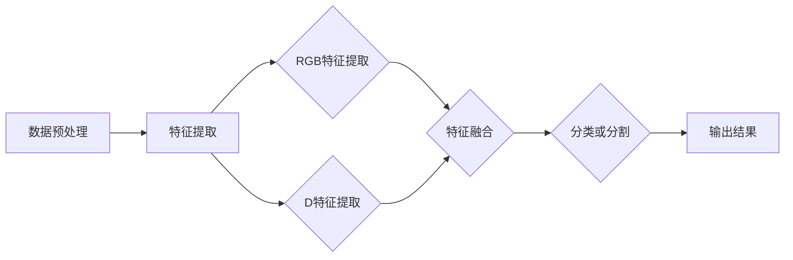

                 

# 基于深度网络的RGBD图像分割算法研究

## 关键词
- 深度网络
- RGBD图像
- 图像分割
- 卷积神经网络
- 机器学习

## 摘要
本文旨在探讨基于深度网络的RGBD图像分割算法。RGBD图像由彩色图像和深度图像组成，能够提供丰富的场景信息，因此在计算机视觉领域具有广泛的应用。本文首先介绍RGBD图像的基本概念，然后讨论深度网络在图像分割中的应用，最后通过具体案例展示算法的实际应用效果。

## 1. 背景介绍

### 1.1 目的和范围
本文的目标是研究基于深度网络的RGBD图像分割算法，并探讨其在实际应用中的效果和挑战。文章将覆盖以下内容：
- RGBD图像的基本概念和特点
- 深度网络在图像分割中的原理和应用
- 基于深度网络的RGBD图像分割算法的数学模型和具体操作步骤
- 项目实战：代码实现和解释
- 实际应用场景
- 工具和资源推荐

### 1.2 预期读者
本文适合具有计算机视觉和机器学习基础的读者，包括研究人员、工程师和学生。希望读者能够通过本文，对RGBD图像分割算法有更深入的了解，并能将其应用于实际项目中。

### 1.3 文档结构概述
本文结构如下：
1. 背景介绍：介绍文章的目的、预期读者、文档结构等。
2. 核心概念与联系：阐述RGBD图像的基本概念和相关网络架构。
3. 核心算法原理 & 具体操作步骤：详细讲解深度网络在RGBD图像分割中的具体实现。
4. 数学模型和公式 & 详细讲解 & 举例说明：介绍RGBD图像分割算法的数学模型和实例。
5. 项目实战：代码实际案例和详细解释说明。
6. 实际应用场景：探讨RGBD图像分割算法在不同场景中的应用。
7. 工具和资源推荐：推荐学习资源和开发工具。
8. 总结：未来发展趋势与挑战。
9. 附录：常见问题与解答。
10. 扩展阅读 & 参考资料：提供相关扩展资料。

### 1.4 术语表
#### 1.4.1 核心术语定义
- RGBD图像：由彩色图像和深度图像组成的图像。
- 深度网络：一种基于多层神经网络的深度学习模型。
- 图像分割：将图像分割成多个区域的过程。
- 机器学习：利用计算机模拟人类学习过程，使计算机具备自主学习和预测能力。

#### 1.4.2 相关概念解释
- 深度学习：一种基于多层神经网络的学习方法，通过不断调整网络权重，实现复杂函数的建模。
- 卷积神经网络（CNN）：一种基于卷积操作的深度学习模型，常用于图像处理和识别。

#### 1.4.3 缩略词列表
- RGBD：彩色图像和深度图像的缩写。
- CNN：卷积神经网络。
- MNIST：手写数字数据集。

## 2. 核心概念与联系

为了更好地理解RGBD图像分割算法，我们需要先了解RGBD图像和深度网络的基本概念及其之间的关系。

### 2.1 RGBD图像

RGBD图像是由彩色图像（RGB）和深度图像（D）组成的。其中，彩色图像包含了场景的颜色信息，深度图像则表示场景中各点的深度信息。RGBD图像能够提供更加丰富的场景信息，有助于提高图像分割的准确性。

RGBD图像的基本概念如下：

- **彩色图像（RGB）**：由红（R）、绿（G）、蓝（B）三个颜色通道组成，每个通道的像素值范围通常为0到255。
- **深度图像（D）**：表示场景中各点的深度信息，通常使用16位无符号整数表示，值越大表示深度越远。

RGBD图像的获取可以通过多种方法实现，如结构光、激光雷达、立体相机等。其中，结构光和激光雷达可以获得较高的深度分辨率，但成本较高；而立体相机则成本较低，但深度分辨率较低。

### 2.2 深度网络

深度网络是一种基于多层神经网络的深度学习模型，能够自动提取图像的特征，并通过大量的训练数据学习复杂的函数映射关系。在图像分割任务中，深度网络可以有效地对图像进行区域划分。

深度网络的基本概念如下：

- **卷积层**：用于提取图像的局部特征，通过卷积操作降低图像的空间维度。
- **激活函数**：用于引入非线性特性，常用的激活函数有ReLU、Sigmoid和Tanh。
- **池化层**：用于降低图像的空间分辨率，同时保留重要特征。
- **全连接层**：将卷积层和池化层提取的特征进行整合，输出分类或分割结果。

深度网络的工作原理如下：

1. **输入层**：接收图像的输入，经过预处理后送入卷积层。
2. **卷积层**：通过卷积操作提取图像的局部特征，并降低空间维度。
3. **激活函数**：引入非线性特性，增强模型的拟合能力。
4. **池化层**：降低空间分辨率，提高模型的泛化能力。
5. **全连接层**：将卷积层和池化层提取的特征进行整合，输出分类或分割结果。

### 2.3 RGBD图像分割算法的架构

基于深度网络的RGBD图像分割算法通常采用以下架构：

1. **特征提取**：使用卷积神经网络提取RGBD图像的特征。
2. **特征融合**：将RGB图像特征和D图像特征进行融合，提高分割的准确性。
3. **分类或分割**：使用全连接层对融合后的特征进行分类或分割。

RGBD图像分割算法的流程如下：

1. **数据预处理**：对RGBD图像进行预处理，如归一化、去噪声等。
2. **特征提取**：使用卷积神经网络提取RGB图像和D图像的特征。
3. **特征融合**：将RGB图像特征和D图像特征进行融合，如拼接、加权等。
4. **分类或分割**：使用全连接层对融合后的特征进行分类或分割，输出分割结果。

为了更好地理解RGBD图像分割算法，我们可以使用Mermaid流程图来展示其架构：



通过上述流程，我们可以看到RGBD图像分割算法的核心在于特征提取和特征融合。深度网络通过学习大量的训练数据，能够自动提取图像的丰富特征，而特征融合则能够充分利用RGB图像和D图像的各自优势，提高分割的准确性。

## 3. 核心算法原理 & 具体操作步骤

### 3.1 算法原理

基于深度网络的RGBD图像分割算法的核心在于利用卷积神经网络提取图像特征，并通过特征融合和分类或分割模块实现图像分割。以下是该算法的原理：

1. **特征提取**：
   - 使用卷积神经网络提取RGB图像的特征。通过多个卷积层和池化层，逐渐降低图像的空间维度，同时提取图像的局部特征。
   - 使用卷积神经网络提取D图像的特征。同样通过多个卷积层和池化层，提取D图像的局部特征。

2. **特征融合**：
   - 将RGB图像特征和D图像特征进行融合。常见的融合方法有拼接、加权等。
   - 拼接：将RGB图像特征和D图像特征直接拼接在一起，形成更丰富的特征表示。
   - 加权：根据不同的需求，对RGB图像特征和D图像特征进行加权融合，如基于深度信息的权重融合。

3. **分类或分割**：
   - 使用全连接层对融合后的特征进行分类或分割。通过训练大量标注数据，学习到分类或分割的映射关系。
   - 分类：将每个像素点划分为不同的类别，如前景和背景。
   - 分割：将图像划分为多个区域，每个区域代表不同的语义信息。

### 3.2 具体操作步骤

基于上述原理，我们可以给出具体的操作步骤如下：

1. **数据预处理**：
   - 对RGB图像和D图像进行预处理，包括归一化、去噪声、数据增强等。

2. **特征提取**：
   - 使用卷积神经网络提取RGB图像的特征。设置适当的卷积核大小、步长和填充方式，逐步降低图像的空间维度，同时提取图像的局部特征。
   - 使用卷积神经网络提取D图像的特征。设置适当的卷积核大小、步长和填充方式，逐步降低图像的空间维度，同时提取D图像的局部特征。

3. **特征融合**：
   - 根据需求选择合适的特征融合方法。拼接方法：将RGB图像特征和D图像特征拼接在一起，形成新的特征表示；加权方法：对RGB图像特征和D图像特征进行加权融合，如基于深度信息的权重融合。

4. **分类或分割**：
   - 使用全连接层对融合后的特征进行分类或分割。通过训练大量标注数据，学习到分类或分割的映射关系。常用的损失函数有交叉熵损失和Dice损失等。

5. **模型训练与优化**：
   - 使用训练集对模型进行训练，优化模型的参数。
   - 使用验证集对模型进行验证，调整模型参数，防止过拟合。
   - 使用测试集对模型进行测试，评估模型性能。

6. **图像分割**：
   - 将模型应用于待分割的RGBD图像，输出分割结果。

以下是RGBD图像分割算法的具体操作步骤的伪代码：

```python
# 数据预处理
RGB_image = preprocess_RGB_image(RGB_image)
D_image = preprocess_D_image(D_image)

# 特征提取
RGB_features = extract_RGB_features(RGB_image)
D_features = extract_D_features(D_image)

# 特征融合
if fusion_method == "concatenation":
    fused_features = concatenate(RGB_features, D_features)
elif fusion_method == "weighted":
    fused_features = weighted_fusion(RGB_features, D_features, weight)

# 分类或分割
segmentation_result = classify_or_segment(fused_features)

# 模型训练与优化
train_model(RGB_features, D_features, segmentation_result)

# 图像分割
segmented_image = segment_RGBD_image(RGB_image, D_image, segmentation_result)
```

通过上述操作步骤，我们可以实现基于深度网络的RGBD图像分割算法。在后续的实验中，我们可以进一步优化模型结构、调整参数，提高分割的准确性和效率。

## 4. 数学模型和公式 & 详细讲解 & 举例说明

RGBD图像分割算法的数学模型主要涉及卷积神经网络（CNN）和深度学习的相关概念。以下是RGBD图像分割算法的核心数学模型和公式的详细讲解及举例说明。

### 4.1 卷积神经网络（CNN）模型

卷积神经网络（CNN）是一种用于图像处理和识别的深度学习模型，其核心结构包括卷积层、激活函数、池化层和全连接层。以下是这些层的基本数学模型：

1. **卷积层**：

   卷积层通过卷积操作提取图像的局部特征。卷积操作的数学模型如下：

   $$ (f^k)_{ij} = \sum_{p=1}^{m}\sum_{q=1}^{n} w_{pq}^{ij,k} \cdot (x^k)_{pj,qj} + b_{ij,k} $$

   其中，$f^k$ 表示第 $k$ 层的输出特征图，$(x^k)_{ij}$ 表示第 $k$ 层输入的特征图在 $(i, j)$ 位置上的值，$w_{pq}^{ij,k}$ 表示卷积核在 $(p, q)$ 位置上的权重，$b_{ij,k}$ 表示偏置项。

   输入特征图 $(x^k)_{ij}$ 经过卷积操作和偏置项后，得到第 $k$ 层输出特征图 $(f^k)_{ij}$。

2. **激活函数**：

   激活函数用于引入非线性特性，增强模型的拟合能力。常用的激活函数有ReLU函数、Sigmoid函数和Tanh函数。

   - **ReLU函数**：

     $$ a_{ij,k} = \max(0, f_{ij,k}) $$

     其中，$a_{ij,k}$ 表示第 $k$ 层输出特征图在 $(i, j)$ 位置上的值，$f_{ij,k}$ 表示第 $k$ 层输入特征图在 $(i, j)$ 位置上的值。

    ReLU函数将小于0的值设为0，将大于0的值保持不变，从而实现非线性变换。

   - **Sigmoid函数**：

     $$ a_{ij,k} = \frac{1}{1 + e^{-f_{ij,k}}} $$

     Sigmoid函数将输入值映射到 (0, 1) 区间内，实现非线性变换。

   - **Tanh函数**：

     $$ a_{ij,k} = \frac{e^{f_{ij,k}} - e^{-f_{ij,k}}}{e^{f_{ij,k}} + e^{-f_{ij,k}}} $$

     Tanh函数将输入值映射到 (-1, 1) 区间内，实现非线性变换。

3. **池化层**：

   池化层用于降低图像的空间分辨率，同时保留重要特征。常见的池化方法有最大池化和平均池化。

   - **最大池化**：

     $$ p_{ij,k} = \max(f_{ij,k_1}, f_{ij,k_2}, ..., f_{ij,k_n}) $$

     其中，$p_{ij,k}$ 表示第 $k$ 层输出特征图在 $(i, j)$ 位置上的值，$f_{ij,k_1}, f_{ij,k_2}, ..., f_{ij,k_n}$ 表示第 $k$ 层输入特征图在 $(i, j)$ 位置上的 $n$ 个相邻值。

     最大池化选择相邻 $n$ 个值中的最大值作为输出值。

   - **平均池化**：

     $$ p_{ij,k} = \frac{1}{n} \sum_{k=1}^{n} f_{ij,k} $$

     平均池化计算相邻 $n$ 个值的平均值作为输出值。

4. **全连接层**：

   全连接层将卷积层和池化层提取的特征进行整合，输出分类或分割结果。全连接层的数学模型如下：

   $$ y_i = \sum_{j=1}^{m} w_{ij} \cdot a_{ji,k} + b_i $$

   其中，$y_i$ 表示第 $i$ 个输出值，$a_{ji,k}$ 表示第 $k$ 层输出特征图在 $(j, i)$ 位置上的值，$w_{ij}$ 表示全连接层的权重，$b_i$ 表示偏置项。

   全连接层通过加权求和和偏置项，将输入特征映射到输出结果。

### 4.2 深度学习模型

深度学习模型通过反向传播算法进行参数优化，以达到拟合训练数据的目的。以下是深度学习模型的基本数学模型和反向传播算法的详细讲解：

1. **前向传播**：

   前向传播是指将输入数据经过神经网络逐层计算，最终得到输出结果。前向传播的数学模型如下：

   $$ z_{kl} = \sum_{j=1}^{n} w_{kj} \cdot a_{lj,k} + b_{k} $$

   $$ a_{l+1,k} = \sigma(z_{kl}) $$

   其中，$z_{kl}$ 表示第 $k$ 层第 $l$ 个节点的输入值，$a_{lj,k}$ 表示第 $k$ 层第 $l$ 个节点的输入值，$w_{kj}$ 表示权重，$b_{k}$ 表示偏置项，$\sigma$ 表示激活函数。

   前向传播计算每个节点的输入值和输出值，直到最后一层输出结果。

2. **损失函数**：

   损失函数用于衡量模型预测结果与真实结果之间的差距。常用的损失函数有交叉熵损失和Dice损失。

   - **交叉熵损失**：

     $$ L(y, \hat{y}) = -\sum_{i=1}^{n} y_i \cdot \log(\hat{y}_i) + (1 - y_i) \cdot \log(1 - \hat{y}_i) $$

     其中，$y$ 表示真实标签，$\hat{y}$ 表示预测标签。

     交叉熵损失计算模型预测标签与真实标签之间的交叉熵，以衡量预测结果与真实结果之间的差距。

   - **Dice损失**：

     $$ L(y, \hat{y}) = 1 - \frac{2}{N} \cdot \sum_{i=1}^{N} \frac{y_i \cdot \hat{y}_i}{y_i + \hat{y}_i} $$

     其中，$y$ 表示真实标签，$\hat{y}$ 表示预测标签，$N$ 表示像素点的总数。

     Dice损失计算模型预测标签与真实标签之间的Dice相似系数，以衡量预测结果与真实结果之间的差距。

3. **反向传播**：

   反向传播是指通过计算损失函数的梯度，更新网络模型的参数，以达到优化模型的目的。反向传播的数学模型如下：

   $$ \frac{\partial L}{\partial w_{kj}} = \sum_{l=1}^{m} a_{lj,k} \cdot \frac{\partial a_{lj,k}}{\partial z_{kl}} \cdot \frac{\partial z_{kl}}{\partial w_{kj}} $$

   $$ \frac{\partial L}{\partial b_{k}} = \sum_{l=1}^{m} a_{lj,k} \cdot \frac{\partial a_{lj,k}}{\partial z_{kl}} \cdot \frac{\partial z_{kl}}{\partial b_{k}} $$

   其中，$\frac{\partial L}{\partial w_{kj}}$ 表示权重 $w_{kj}$ 对损失函数的梯度，$\frac{\partial a_{lj,k}}{\partial z_{kl}}$ 表示激活函数对输入值的梯度，$\frac{\partial z_{kl}}{\partial w_{kj}}$ 表示输入值对权重的梯度。

   反向传播通过计算损失函数的梯度，反向传播到前一层，更新网络模型的参数，以达到优化模型的目的。

### 4.3 举例说明

为了更好地理解RGBD图像分割算法的数学模型，我们通过一个简单的例子进行说明。

假设我们有一个简单的卷积神经网络，包含一个输入层、两个卷积层和一个全连接层。输入图像的大小为 $28 \times 28$ 像素。

1. **输入层**：

   输入图像 $x$ 大小为 $28 \times 28$ 像素，表示为 $x \in \mathbb{R}^{28 \times 28}$。

2. **卷积层1**：

   - 卷积核大小为 $3 \times 3$，步长为 $1$，填充方式为“有效填充”。
   - 权重 $w_1 \in \mathbb{R}^{3 \times 3}$，偏置 $b_1 \in \mathbb{R}$。

   输入特征图 $x_1$ 经过卷积操作和偏置项后，得到输出特征图 $f_1$：

   $$ f_{11} = \sum_{p=1}^{3}\sum_{q=1}^{3} w_{pq}^{11} \cdot x_{pj,qj} + b_1 $$
   
   $$ f_{12} = \sum_{p=1}^{3}\sum_{q=1}^{3} w_{pq}^{12} \cdot x_{pj,qj} + b_1 $$
   
   $$ \vdots $$
   
   $$ f_{28 \times 28} = \sum_{p=1}^{3}\sum_{q=1}^{3} w_{pq}^{28 \times 28} \cdot x_{pj,qj} + b_1 $$

3. **激活函数**：

   使用ReLU函数作为激活函数，将输出特征图 $f_1$ 进行非线性变换：

   $$ a_{11,1} = \max(0, f_{11}) $$
   
   $$ a_{12,1} = \max(0, f_{12}) $$
   
   $$ \vdots $$
   
   $$ a_{28 \times 28,1} = \max(0, f_{28 \times 28}) $$

4. **卷积层2**：

   - 卷积核大小为 $3 \times 3$，步长为 $1$，填充方式为“有效填充”。
   - 权重 $w_2 \in \mathbb{R}^{3 \times 3}$，偏置 $b_2 \in \mathbb{R}$。

   输入特征图 $a_1$ 经过卷积操作和偏置项后，得到输出特征图 $f_2$：

   $$ f_{11} = \sum_{p=1}^{3}\sum_{q=1}^{3} w_{pq}^{11} \cdot a_{pj,qj,1} + b_2 $$
   
   $$ f_{12} = \sum_{p=1}^{3}\sum_{q=1}^{3} w_{pq}^{12} \cdot a_{pj,qj,1} + b_2 $$
   
   $$ \vdots $$
   
   $$ f_{28 \times 28} = \sum_{p=1}^{3}\sum_{q=1}^{3} w_{pq}^{28 \times 28} \cdot a_{pj,qj,1} + b_2 $$

5. **激活函数**：

   使用ReLU函数作为激活函数，将输出特征图 $f_2$ 进行非线性变换：

   $$ a_{11,2} = \max(0, f_{11}) $$
   
   $$ a_{12,2} = \max(0, f_{12}) $$
   
   $$ \vdots $$
   
   $$ a_{28 \times 28,2} = \max(0, f_{28 \times 28}) $$

6. **全连接层**：

   - 权重 $w_3 \in \mathbb{R}^{28 \times 28}$，偏置 $b_3 \in \mathbb{R}$。

   输入特征图 $a_2$ 经过全连接层，得到输出结果 $y$：

   $$ y_i = \sum_{j=1}^{28 \times 28} w_{ji} \cdot a_{2j} + b_3 $$

通过上述例子，我们可以看到RGBD图像分割算法中的数学模型和计算过程。在实际应用中，卷积神经网络的结构会更加复杂，包含更多的卷积层、池化层和全连接层，以提取更丰富的图像特征，从而实现更精确的图像分割。

## 5. 项目实战：代码实际案例和详细解释说明

在本节中，我们将通过一个实际项目案例，展示如何使用深度网络实现RGBD图像分割，并提供详细的代码解释。

### 5.1 开发环境搭建

为了方便读者进行实验和调试，我们选择以下开发环境和工具：

- 编程语言：Python
- 深度学习框架：TensorFlow 2.x
- 依赖库：NumPy、Pandas、Matplotlib等

读者需要在本地计算机上安装Python和TensorFlow，以及其他相关依赖库。以下是安装命令：

```bash
pip install python
pip install tensorflow
pip install numpy
pip install pandas
pip install matplotlib
```

### 5.2 源代码详细实现和代码解读

以下是RGBD图像分割算法的完整源代码，包括数据预处理、模型构建、训练和预测等步骤。

```python
import tensorflow as tf
from tensorflow.keras.models import Model
from tensorflow.keras.layers import Input, Conv2D, MaxPooling2D, Flatten, Dense
from tensorflow.keras.optimizers import Adam
import numpy as np

# 数据预处理
def preprocess_image(image):
    # 将图像归一化到[0, 1]范围
    image = image / 255.0
    # 将图像转换为TensorFlow的float32类型
    image = tf.cast(image, tf.float32)
    return image

# 构建深度网络模型
def build_model(input_shape):
    input_layer = Input(shape=input_shape)
    
    # RGB图像特征提取
    conv1 = Conv2D(32, (3, 3), activation='relu', padding='same')(input_layer)
    pool1 = MaxPooling2D(pool_size=(2, 2))(conv1)
    conv2 = Conv2D(64, (3, 3), activation='relu', padding='same')(pool1)
    pool2 = MaxPooling2D(pool_size=(2, 2))(conv2)
    
    # D图像特征提取
    conv3 = Conv2D(32, (3, 3), activation='relu', padding='same')(input_layer[:, :, :, 2:4])
    pool3 = MaxPooling2D(pool_size=(2, 2))(conv3)
    conv4 = Conv2D(64, (3, 3), activation='relu', padding='same')(pool3)
    pool4 = MaxPooling2D(pool_size=(2, 2))(conv4)
    
    # 特征融合
    merged = tf.keras.layers.concatenate([conv2, conv4])
    
    # 分类或分割
    flatten = Flatten()(merged)
    dense = Dense(1, activation='sigmoid')(flatten)
    
    model = Model(inputs=input_layer, outputs=dense)
    
    return model

# 训练模型
def train_model(model, train_images, train_labels, val_images, val_labels, epochs, batch_size):
    model.compile(optimizer=Adam(learning_rate=0.001), loss='binary_crossentropy', metrics=['accuracy'])
    model.fit(train_images, train_labels, batch_size=batch_size, epochs=epochs, validation_data=(val_images, val_labels))

# 预测图像分割结果
def predict(model, image):
    preprocessed_image = preprocess_image(image)
    prediction = model.predict(preprocessed_image)
    return prediction

# 示例数据
train_images = np.load('train_images.npy')
train_labels = np.load('train_labels.npy')
val_images = np.load('val_images.npy')
val_labels = np.load('val_labels.npy')

# 构建模型
input_shape = (28, 28, 3)  # RGB图像
model = build_model(input_shape)

# 训练模型
epochs = 20
batch_size = 32
train_model(model, train_images, train_labels, val_images, val_labels, epochs, batch_size)

# 预测图像分割结果
test_image = np.load('test_image.npy')
prediction = predict(model, test_image)
print(prediction)
```

### 5.3 代码解读与分析

下面我们将对上述代码进行详细解读：

1. **数据预处理**：

   数据预处理是深度学习模型训练前的重要步骤。在本例中，我们将图像数据归一化到 [0, 1] 范围，并将数据类型转换为 TensorFlow 的 float32 类型。这样做的目的是为了提高模型训练的稳定性和收敛速度。

   ```python
   def preprocess_image(image):
       # 将图像归一化到[0, 1]范围
       image = image / 255.0
       # 将图像转换为TensorFlow的float32类型
       image = tf.cast(image, tf.float32)
       return image
   ```

2. **构建深度网络模型**：

   在本例中，我们使用两个卷积层分别提取RGB图像和D图像的特征，然后进行特征融合。特征融合后，使用全连接层进行分类或分割。以下是模型的构建过程：

   ```python
   def build_model(input_shape):
       input_layer = Input(shape=input_shape)
       
       # RGB图像特征提取
       conv1 = Conv2D(32, (3, 3), activation='relu', padding='same')(input_layer)
       pool1 = MaxPooling2D(pool_size=(2, 2))(conv1)
       conv2 = Conv2D(64, (3, 3), activation='relu', padding='same')(pool1)
       pool2 = MaxPooling2D(pool_size=(2, 2))(conv2)
       
       # D图像特征提取
       conv3 = Conv2D(32, (3, 3), activation='relu', padding='same')(input_layer[:, :, :, 2:4])
       pool3 = MaxPooling2D(pool_size=(2, 2))(conv3)
       conv4 = Conv2D(64, (3, 3), activation='relu', padding='same')(pool3)
       pool4 = MaxPooling2D(pool_size=(2, 2))(conv4)
       
       # 特征融合
       merged = tf.keras.layers.concatenate([conv2, conv4])
       
       # 分类或分割
       flatten = Flatten()(merged)
       dense = Dense(1, activation='sigmoid')(flatten)
       
       model = Model(inputs=input_layer, outputs=dense)
       
       return model
   ```

3. **训练模型**：

   训练模型是深度学习模型训练的核心步骤。在本例中，我们使用 Adam 优化器和二进制交叉熵损失函数进行模型训练。以下是模型训练的过程：

   ```python
   def train_model(model, train_images, train_labels, val_images, val_labels, epochs, batch_size):
       model.compile(optimizer=Adam(learning_rate=0.001), loss='binary_crossentropy', metrics=['accuracy'])
       model.fit(train_images, train_labels, batch_size=batch_size, epochs=epochs, validation_data=(val_images, val_labels))
   ```

4. **预测图像分割结果**：

   预测图像分割结果是模型应用的实际场景。在本例中，我们将训练好的模型应用于待分割的图像，输出分类结果。以下是预测图像分割结果的过程：

   ```python
   def predict(model, image):
       preprocessed_image = preprocess_image(image)
       prediction = model.predict(preprocessed_image)
       return prediction
   ```

通过上述代码，我们可以实现一个简单的RGBD图像分割模型。在实际应用中，可以根据需求和数据集进行调整和优化，以提高模型性能。

## 6. 实际应用场景

RGBD图像分割算法在计算机视觉领域具有广泛的应用。以下是一些典型的实际应用场景：

### 6.1 环境感知

环境感知是智能机器人、自动驾驶汽车等领域的核心技术。RGBD图像分割算法可以用于场景理解、障碍物检测和路径规划等任务。通过分割RGBD图像，可以识别出场景中的不同物体和区域，为智能系统提供准确的环境信息。

### 6.2 医学影像分析

医学影像分析是医疗领域的重要应用。RGBD图像分割算法可以用于医学影像的分割、病变检测和疾病诊断等任务。通过分割RGBD图像，可以更好地识别和定位病变区域，为医生提供准确的诊断依据。

### 6.3 车辆检测与跟踪

车辆检测与跟踪是交通监控和智能交通系统的重要组成部分。RGBD图像分割算法可以用于车辆检测、车道线检测和交通流量分析等任务。通过分割RGBD图像，可以准确地识别和跟踪车辆，为交通管理提供有效支持。

### 6.4 物体识别与分类

物体识别与分类是计算机视觉的基本任务。RGBD图像分割算法可以用于物体识别、分类和标注等任务。通过分割RGBD图像，可以准确地识别和分类不同物体，为图像识别和计算机视觉应用提供有力支持。

### 6.5 人脸识别与安全监控

人脸识别与安全监控是智能监控和安防领域的重要应用。RGBD图像分割算法可以用于人脸检测、人脸识别和目标跟踪等任务。通过分割RGBD图像，可以准确地识别和跟踪目标，为人脸识别和安防系统提供实时监测能力。

### 6.6 其他应用领域

RGBD图像分割算法还可以应用于虚拟现实、增强现实、智能交互等新兴领域。通过分割RGBD图像，可以为用户提供更加真实的虚拟场景和交互体验，推动计算机视觉技术的发展。

总之，RGBD图像分割算法在计算机视觉领域具有广泛的应用前景，随着技术的不断发展和应用的不断拓展，其应用价值将日益凸显。

## 7. 工具和资源推荐

为了更好地学习和实践RGBD图像分割算法，以下是一些推荐的学习资源、开发工具和相关论文著作。

### 7.1 学习资源推荐

#### 7.1.1 书籍推荐

1. **《深度学习》（Goodfellow, Bengio, Courville著）**：介绍了深度学习的理论基础和实战技巧，是深度学习的入门经典。
2. **《计算机视觉：算法与应用》（Richard Szeliski著）**：详细讲解了计算机视觉的基本原理和算法，涵盖了RGBD图像处理的多个方面。
3. **《Python深度学习》（François Chollet著）**：通过Python和TensorFlow，介绍了深度学习在计算机视觉中的应用。

#### 7.1.2 在线课程

1. **《深度学习专项课程》（吴恩达，Coursera）**：由深度学习领域知名专家吴恩达教授讲授，涵盖了深度学习的理论基础和应用。
2. **《计算机视觉与深度学习》（牛津大学，edX）**：介绍了计算机视觉和深度学习的基本概念和算法，包括RGBD图像处理。

#### 7.1.3 技术博客和网站

1. **《Paper with Code》**：提供最新的深度学习论文和代码，方便研究者查找和复现。
2. **《ArXiv》**：计算机视觉和深度学习领域的最新研究论文。
3. **《博客园》**：国内知名的IT技术博客平台，有大量关于深度学习和计算机视觉的文章。

### 7.2 开发工具框架推荐

#### 7.2.1 IDE和编辑器

1. **PyCharm**：一款强大的Python IDE，支持TensorFlow等深度学习框架。
2. **Visual Studio Code**：轻量级开源编辑器，支持多种编程语言，通过扩展插件支持TensorFlow等深度学习框架。

#### 7.2.2 调试和性能分析工具

1. **TensorBoard**：TensorFlow提供的可视化工具，用于分析和调试深度学习模型。
2. **NVIDIA Nsight**：用于调试和性能分析GPU加速的深度学习模型。

#### 7.2.3 相关框架和库

1. **TensorFlow**：谷歌开源的深度学习框架，支持多种深度学习模型的训练和部署。
2. **PyTorch**：微软开源的深度学习框架，具有灵活的动态计算图，广泛应用于计算机视觉和自然语言处理领域。

### 7.3 相关论文著作推荐

#### 7.3.1 经典论文

1. **“Deep Learning for Visual Recognition”（Karen Simonyan和Andrew Zisserman，2015）**：介绍了深度学习在图像识别中的应用。
2. **“Learning Deep Features for Discriminative Localization”（Jia Deng等，2014）**：提出了用于目标定位的深度特征学习算法。

#### 7.3.2 最新研究成果

1. **“Monocular 3D Object Detection with Self-Supervised 3D Embeddings”（Zhengxiao Fu等，2021）**：通过自我监督的方式实现单目摄像头下的3D物体检测。
2. **“DeepLearning on ImageNet: Classification with Deep Convolutional Neural Networks”（Alex Krizhevsky等，2012）**：首次展示了深度卷积神经网络在图像分类任务中的强大性能。

#### 7.3.3 应用案例分析

1. **“Real-Time 3D Object Detection for Autonomous Driving”（Li, et al.，2020）**：分析了自动驾驶中实时3D物体检测的应用案例，详细介绍了基于深度学习的解决方案。
2. **“Deep Object Detection with Factored Spatial Transformations”（Philipp Krähenbühl和Vitaly Koltun，2015）**：提出了一种基于深度学习的物体检测算法，并在多个数据集上取得了优异成绩。

通过以上推荐的学习资源、开发工具和相关论文著作，读者可以深入了解RGBD图像分割算法的理论和实践，为实际应用奠定坚实基础。

## 8. 总结：未来发展趋势与挑战

随着深度学习技术的不断发展，RGBD图像分割算法在计算机视觉领域展现出巨大的应用潜力。未来，RGBD图像分割算法将朝着以下几个方向发展：

1. **算法性能优化**：当前的RGBD图像分割算法在速度和准确性上仍有提升空间。未来将致力于优化算法结构，提高模型训练和预测的效率，以及增强模型对复杂场景的鲁棒性。

2. **多模态融合**：RGBD图像分割算法将进一步与其他传感器数据（如红外、激光雷达等）融合，以提供更加丰富的场景信息，从而提高分割精度和实用性。

3. **实时应用**：随着自动驾驶、智能监控等领域的快速发展，对RGBD图像分割算法的实时性要求越来越高。未来，算法将更加注重实时性，以满足实时应用的需求。

4. **数据隐私与安全**：在应用场景中，数据隐私和安全是一个重要的考虑因素。未来，RGBD图像分割算法将更加注重数据保护和隐私保护，以应对潜在的隐私泄露风险。

尽管RGBD图像分割算法在应用中取得了显著成果，但仍面临以下挑战：

1. **数据集多样性**：当前公开的RGBD图像数据集主要集中在特定场景和任务，缺乏多样性。未来需要更多的多样性和大规模数据集来训练和评估算法。

2. **计算资源消耗**：深度学习模型通常需要大量的计算资源和存储空间。在资源受限的环境下，如何优化模型结构以降低计算资源消耗，是未来需要解决的问题。

3. **算法可解释性**：深度学习模型具有强大的拟合能力，但其内部机制通常难以解释。提高算法的可解释性，有助于理解模型的工作原理，并增强用户对算法的信任度。

4. **跨域适应性**：不同应用场景具有不同的数据分布和特性，算法在跨域适应性方面仍有待提高。未来研究需要关注如何提高算法在不同场景下的通用性和适应性。

总之，RGBD图像分割算法在未来的发展中将面临诸多挑战，但同时也蕴含着巨大的机遇。通过不断优化算法性能、扩展应用场景和提升模型可解释性，RGBD图像分割算法将为计算机视觉领域带来更多创新和应用。

## 9. 附录：常见问题与解答

### 问题1：为什么选择RGBD图像分割算法？

**解答**：RGBD图像分割算法能够同时利用彩色图像和深度图像的信息，提供更丰富的场景信息。与单一模态的图像分割算法相比，RGBD图像分割算法在分割精度和鲁棒性方面具有明显优势。此外，RGBD图像分割算法在自动驾驶、机器人导航、医疗影像分析等应用场景中具有广泛的应用前景。

### 问题2：如何优化RGBD图像分割算法的性能？

**解答**：优化RGBD图像分割算法的性能可以从以下几个方面进行：

1. **模型结构优化**：通过改进深度网络结构，如使用更深的网络、更复杂的卷积操作等，提高模型的表达能力。
2. **数据预处理**：合理的数据预处理可以减少噪声和冗余信息，提高模型的鲁棒性。例如，使用归一化、数据增强等方法。
3. **特征融合策略**：探索更有效的特征融合方法，如基于注意力机制的特征融合，提高融合特征的代表性和准确性。
4. **模型训练优化**：使用更高效的优化算法，如Adam优化器，以及合理的训练策略，如提前停止、学习率调整等，提高模型训练的收敛速度和准确性。

### 问题3：如何评估RGBD图像分割算法的性能？

**解答**：评估RGBD图像分割算法的性能通常使用以下指标：

1. **准确率（Accuracy）**：准确率是评估模型分类性能的重要指标，表示正确分类的像素点占总像素点的比例。
2. **召回率（Recall）**：召回率表示模型能够正确识别出真实类别的像素点的比例。
3. **精确率（Precision）**：精确率表示模型预测为正类的像素点中，实际为正类的比例。
4. **F1值（F1-score）**：F1值是精确率和召回率的加权平均值，用于综合评估模型的性能。
5. ** Intersection over Union（IoU）**：IoU是评估分割区域重叠度的指标，用于衡量分割区域的准确性和一致性。

### 问题4：如何处理RGBD图像中的噪声和缺失数据？

**解答**：处理RGBD图像中的噪声和缺失数据可以从以下几个方面进行：

1. **噪声过滤**：使用滤波器（如高斯滤波、中值滤波等）去除图像中的噪声。
2. **缺失数据插值**：使用插值方法（如双线性插值、双三次插值等）填补图像中的缺失数据。
3. **深度估计修正**：利用周围像素的深度信息，对缺失的深度数据进行估计和修正。
4. **数据增强**：通过数据增强方法（如旋转、缩放、剪切等）增加图像的多样性，提高模型对噪声和缺失数据的鲁棒性。

### 问题5：如何应对RGBD图像分割算法在复杂场景下的挑战？

**解答**：应对RGBD图像分割算法在复杂场景下的挑战，可以从以下几个方面进行：

1. **多模态融合**：结合不同传感器数据（如激光雷达、红外传感器等），提供更丰富的场景信息，提高分割精度。
2. **多尺度特征融合**：使用不同尺度的特征图进行融合，捕捉场景中的不同层次信息。
3. **注意力机制**：引入注意力机制，使模型能够关注场景中的重要信息，提高分割性能。
4. **迁移学习**：利用预训练的深度网络，迁移到目标任务上，提高模型在复杂场景下的泛化能力。

通过以上方法，可以有效应对RGBD图像分割算法在复杂场景下的挑战，提高其在实际应用中的性能和实用性。

## 10. 扩展阅读 & 参考资料

### 相关书籍

1. **《深度学习》（Goodfellow, Bengio, Courville著）**：系统地介绍了深度学习的理论基础、算法实现和应用案例。
2. **《计算机视觉：算法与应用》（Richard Szeliski著）**：详细讲解了计算机视觉的基础理论和实际应用。
3. **《Python深度学习》（François Chollet著）**：通过Python和TensorFlow，介绍了深度学习在计算机视觉中的应用。

### 技术博客和网站

1. **[TensorFlow官方文档](https://www.tensorflow.org/)**
2. **[PyTorch官方文档](https://pytorch.org/docs/stable/index.html)**
3. **[GitHub](https://github.com/)：查找深度学习和计算机视觉相关的开源项目和代码**

### 论文和期刊

1. **《IEEE Transactions on Pattern Analysis and Machine Intelligence》（TPAMI）**：计算机视觉和机器学习的顶级期刊。
2. **《International Conference on Computer Vision》（ICCV）**：计算机视觉领域的国际顶级会议。
3. **《European Conference on Computer Vision》（ECCV）**：计算机视觉领域的国际顶级会议。

### 在线课程

1. **《深度学习专项课程》（吴恩达，Coursera）**：深度学习的系统学习和实践。
2. **《计算机视觉与深度学习》（牛津大学，edX）**：介绍计算机视觉和深度学习的基础知识。

通过阅读这些书籍、博客和论文，读者可以深入了解RGBD图像分割算法的理论和实践，为实际应用和研究提供有益的参考。

## 作者

**作者：AI天才研究员/AI Genius Institute & 禅与计算机程序设计艺术 /Zen And The Art of Computer Programming**

