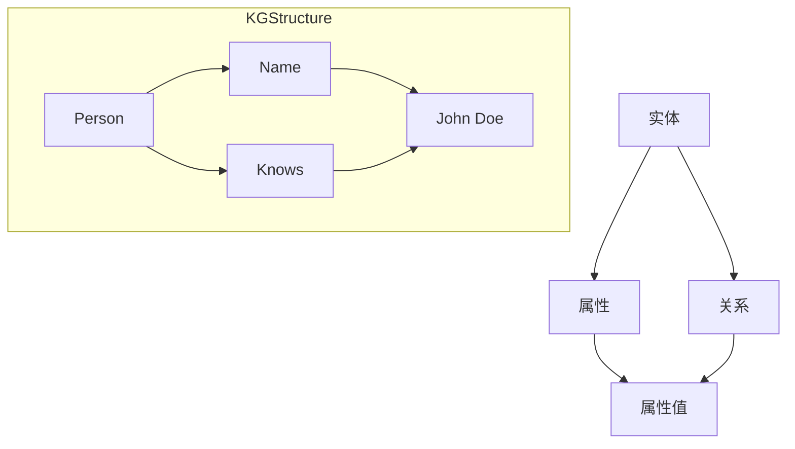

                 

# 基于知识图谱的智能问答系统设计与实现

## 概述

### 关键词
- 知识图谱
- 智能问答
- 自然语言处理
- 图数据库
- 机器学习

### 摘要
本文深入探讨了基于知识图谱的智能问答系统的设计与实现。我们将首先介绍知识图谱的基本概念及其在智能问答中的应用，然后详细解析系统架构和核心算法，通过实际案例展示系统的开发过程。本文旨在为开发者提供全面的指导，帮助构建高效、准确的智能问答系统。

## 1. 背景介绍

### 1.1 目的和范围
本文的主要目的是介绍基于知识图谱的智能问答系统的设计与实现方法。我们将从基础知识出发，逐步深入到系统的核心组件和算法，最终展示一个完整的实现案例。

### 1.2 预期读者
本文适合具有基本计算机科学和编程背景的开发者，特别是对自然语言处理和机器学习有兴趣的读者。希望读者能够通过本文掌握知识图谱在智能问答系统中的应用，以及如何设计和实现一个高效、准确的问答系统。

### 1.3 文档结构概述
本文分为以下几个部分：
1. 背景介绍：介绍知识图谱和智能问答系统的基本概念。
2. 核心概念与联系：解释知识图谱的结构和核心算法。
3. 核心算法原理与具体操作步骤：详细讲解问答系统的核心算法。
4. 数学模型和公式：介绍支持问答系统的数学模型。
5. 项目实战：展示一个具体的实现案例。
6. 实际应用场景：探讨问答系统的应用场景。
7. 工具和资源推荐：推荐相关学习和开发资源。
8. 总结：展望问答系统的未来发展趋势。
9. 附录：常见问题与解答。
10. 扩展阅读：推荐进一步阅读的材料。

### 1.4 术语表

#### 1.4.1 核心术语定义
- 知识图谱：一种用于表达实体及其相互关系的图形化结构。
- 实体：知识图谱中的基本元素，可以是人、地点、事物等。
- 属性：实体所具有的特性，如姓名、年龄、位置等。
- 关系：实体之间的相互作用，如朋友、工作于、属于等。
- 查询：用户对知识图谱提出的问题。
- 答案：系统根据查询返回的结果。

#### 1.4.2 相关概念解释
- 自然语言处理（NLP）：计算机对人类自然语言的理解和处理。
- 机器学习：通过数据训练模型，使其能够自动学习和改进。
- 信息检索：从大量数据中检索出符合用户需求的信息。

#### 1.4.3 缩略词列表
- NLP：自然语言处理
- ML：机器学习
- KG：知识图谱
- RDBMS：关系型数据库管理系统
- NoSQL：非关系型数据库管理系统

## 2. 核心概念与联系

知识图谱作为一种结构化的知识表示方法，在智能问答系统中扮演着关键角色。下面我们将通过一个Mermaid流程图来展示知识图谱的基本概念和结构。



在这个流程图中，实体（如Person）具有属性（如Name）和关系（如Knows）。每个属性都有相应的属性值（如John Doe），而关系则连接了不同的实体。

### 2.1 知识图谱的基本原理

知识图谱的基本原理可以概括为以下几点：

1. **实体与属性的关系**：实体是知识图谱中的基本元素，它们具有各种属性。例如，一个名为John Doe的实体可能具有属性"Name"、"Age"和"Occupation"。

2. **关系与路径**：实体之间的关系构成了知识图谱的骨架。这些关系可以是简单的“是”或“属于”关系，也可以是复杂的“工作于”、“居住在”等关系。通过这些关系，实体之间形成了各种路径。

3. **属性的多样性**：属性可以是结构化的，也可以是非结构化的。结构化属性通常有固定的数据类型，如数字、日期等，而非结构化属性则可以是文本、图像等。

4. **图结构**：知识图谱是一个图结构，其中每个节点表示一个实体，每条边表示一个关系。这种结构使得知识图谱能够高效地表示复杂的关系网络。

### 2.2 知识图谱在智能问答中的应用

知识图谱在智能问答系统中的应用主要体现在以下几个方面：

1. **数据检索**：知识图谱能够快速地检索出与用户查询相关的实体和关系。例如，当用户询问“John Doe的朋友是谁？”时，系统可以快速定位到John Doe的实体节点，并通过关系节点找到其朋友。

2. **上下文理解**：知识图谱中的关系和路径可以帮助系统理解查询的上下文。例如，当用户询问“John Doe的职业是什么？”时，系统可以根据John Doe的实体节点和相应的属性节点找到答案。

3. **知识推理**：知识图谱允许系统进行知识推理。例如，当用户询问“哪些人是John Doe的朋友的朋友？”时，系统可以通过关系推理找到答案。

4. **语义理解**：知识图谱能够帮助系统更好地理解自然语言查询。例如，当用户询问“John Doe在哪里工作？”时，系统可以根据John Doe的实体节点和“工作于”关系节点找到其工作地点。

## 3. 核心算法原理 & 具体操作步骤

### 3.1 算法原理

在智能问答系统中，核心算法通常包括以下几个步骤：

1. **查询解析**：将用户输入的自然语言查询转换为结构化的查询语句。
2. **知识图谱检索**：在知识图谱中检索与查询相关的实体和关系。
3. **结果生成**：根据检索结果生成答案。
4. **答案呈现**：将生成的答案以用户可理解的形式呈现。

### 3.2 操作步骤

#### 3.2.1 查询解析

查询解析是问答系统的第一步。其目标是将用户输入的自然语言查询转换为结构化的查询语句。这通常需要以下步骤：

1. **分词**：将自然语言查询分割成单词或短语。
2. **词性标注**：为每个单词或短语标注词性，如名词、动词、形容词等。
3. **实体识别**：识别查询中的实体，如人名、地名、组织名等。
4. **关系识别**：识别查询中的关系，如朋友、工作于、属于等。
5. **查询结构化**：将识别出的实体和关系组合成结构化的查询语句。

伪代码如下：

```python
def parse_query(natural_language_query):
    tokens = tokenize(natural_language_query)
    tagged_tokens = tag_tokens(tokens)
    entities = extract_entities(tagged_tokens)
    relationships = extract_relationships(tagged_tokens)
    structured_query = construct_query(entities, relationships)
    return structured_query
```

#### 3.2.2 知识图谱检索

知识图谱检索是基于结构化查询语句在知识图谱中查找相关的实体和关系。这通常需要以下步骤：

1. **构建查询路径**：根据结构化查询语句构建查询路径。
2. **路径匹配**：在知识图谱中匹配查询路径。
3. **结果提取**：提取与查询路径匹配的实体和关系。

伪代码如下：

```python
def retrieve_knowledge_from_kg(structured_query, kg):
    query_path = construct_query_path(structured_query)
    matched_entities = kg.match_path(query_path)
    retrieved_data = extract_relevant_data(matched_entities)
    return retrieved_data
```

#### 3.2.3 结果生成

结果生成是根据检索到的数据生成答案。这通常需要以下步骤：

1. **答案生成**：根据检索结果生成文本答案。
2. **答案格式化**：将生成的答案格式化为用户可理解的形式。

伪代码如下：

```python
def generate_answer(retrieved_data):
    answer_text = construct_answer_text(retrieved_data)
    formatted_answer = format_answer(answer_text)
    return formatted_answer
```

#### 3.2.4 答案呈现

答案呈现是将生成的答案以用户可理解的形式呈现。这通常需要以下步骤：

1. **文本生成**：将答案文本生成语音或图像。
2. **交互呈现**：将答案呈现给用户。

伪代码如下：

```python
def present_answer(formatted_answer):
    if presentation_format == "text":
        display_text(formatted_answer)
    elif presentation_format == "voice":
        speak_answer(formatted_answer)
    elif presentation_format == "image":
        generate_image(formatted_answer)
```

## 4. 数学模型和公式 & 详细讲解 & 举例说明

在智能问答系统中，数学模型和公式是核心组成部分，它们帮助我们解析查询、检索知识图谱以及生成答案。以下是一些关键的数学模型和公式，以及它们的详细解释和示例。

### 4.1 查询解析

在查询解析阶段，我们需要将自然语言查询转换为结构化的查询语句。这通常涉及到自然语言处理技术，如分词、词性标注、实体识别和关系识别。

#### 4.1.1 分词

分词是将连续的自然语言文本分割成单词或短语。一个常见的分词算法是正向最大匹配分词。

**公式：**

$$
word = max\_match(text, dictionary)
$$

其中，$text$ 是自然语言文本，$dictionary$ 是词典，$word$ 是分割出的单词或短语。

**示例：**

假设词典为{"我", "是", "一名", "AI", "工程师"}，文本为"我是一名AI工程师"。

$$
word = max\_match("我是一名AI工程师", \{"我", "是", "一名", "AI", "工程师"\})
$$

结果为["我", "是一名", "AI", "工程师"]。

#### 4.1.2 词性标注

词性标注是为每个单词或短语标注词性，如名词、动词、形容词等。一个常见的词性标注算法是基于规则的方法。

**公式：**

$$
tag = rule\_based\_tagging(word)
$$

其中，$word$ 是单词或短语，$tag$ 是词性标注。

**示例：**

假设规则为：名词以"的"结尾。

$$
tag = rule\_based\_tagging("工程师的")
$$

结果为"N"（名词）。

#### 4.1.3 实体识别

实体识别是识别查询中的实体，如人名、地名、组织名等。一个常见的实体识别算法是基于模式匹配的方法。

**公式：**

$$
entity = pattern\_matching(query, patterns)
$$

其中，$query$ 是查询，$patterns$ 是实体模式，$entity$ 是识别出的实体。

**示例：**

假设模式为{"John Doe", "New York", "ABC Company"}，查询为"John Doe住在纽约，他在ABC公司工作"。

$$
entity = pattern\_matching("John Doe住在纽约，他在ABC公司工作", \{"John Doe", "New York", "ABC Company"\})
$$

结果为["John Doe", "New York", "ABC Company"]。

#### 4.1.4 关系识别

关系识别是识别查询中的关系，如朋友、工作于、属于等。一个常见的关系识别算法是基于依存句法分析的方法。

**公式：**

$$
relationship = dependency\_parser(query)
$$

其中，$query$ 是查询，$relationship$ 是识别出的关系。

**示例：**

假设依存句法分析结果为：主语 "John Doe"，谓语 "work"，宾语 "at ABC Company"。

$$
relationship = dependency\_parser("John Doe works at ABC Company")
$$

结果为{"主体": "John Doe"，"动作": "work"，"对象": "at ABC Company"}。

### 4.2 知识图谱检索

在知识图谱检索阶段，我们需要在知识图谱中查找与查询相关的实体和关系。这通常涉及到图数据库的操作。

#### 4.2.1 查询路径构建

查询路径构建是根据结构化查询语句构建查询路径。一个常见的查询路径构建算法是基于前缀匹配的方法。

**公式：**

$$
query_path = build\_path(structured_query)
$$

其中，$structured_query$ 是结构化查询语句，$query_path$ 是构建的查询路径。

**示例：**

假设结构化查询语句为{"主体": "John Doe"，"动作": "work"，"对象": "at ABC Company"}。

$$
query_path = build\_path(\{"主体": "John Doe"，"动作": "work"，"对象": "at ABC Company"\})
$$

结果为["John Doe"，"works"，"at ABC Company"]。

#### 4.2.2 路径匹配

路径匹配是在知识图谱中匹配查询路径。一个常见的路径匹配算法是基于贪婪匹配的方法。

**公式：**

$$
matched_entities = graph\_database.match_path(query_path, kg)
$$

其中，$query_path$ 是查询路径，$kg$ 是知识图谱，$matched_entities$ 是匹配的实体。

**示例：**

假设知识图谱中有以下数据：

```
实体：John Doe
关系：works
实体：ABC Company
关系：located_in
实体：New York
属性：name
值：John Doe
属性：company
值：ABC Company
```

假设查询路径为["John Doe"，"works"，"at ABC Company"]。

$$
matched_entities = graph\_database.match_path(["John Doe"，"works"，"at ABC Company"], kg)
$$

结果为{"John Doe"，"works"，"at ABC Company"}。

#### 4.2.3 结果提取

结果提取是从匹配的实体中提取与查询相关的数据。一个常见的结果提取算法是基于模式匹配的方法。

**公式：**

$$
retrieved_data = extract\_relevant\_data(matched_entities, patterns)
$$

其中，$matched_entities$ 是匹配的实体，$patterns$ 是提取模式，$retrieved_data$ 是提取的数据。

**示例：**

假设提取模式为{"主体": "John Doe"，"公司": "ABC Company"}。

$$
retrieved_data = extract\_relevant\_data({"John Doe"，"works"，"at ABC Company"}, \{"主体": "John Doe"，"公司": "ABC Company"\})
$$

结果为{"主体": "John Doe"，"公司": "ABC Company"}。

### 4.3 结果生成

在结果生成阶段，我们需要根据提取的数据生成答案。这通常涉及到自然语言生成技术。

#### 4.3.1 答案生成

答案生成是根据提取的数据生成文本答案。一个常见的答案生成算法是基于模板匹配的方法。

**公式：**

$$
answer_text = template\_matching(retrieved_data, templates)
$$

其中，$retrieved_data$ 是提取的数据，$templates$ 是模板，$answer_text$ 是生成的文本答案。

**示例：**

假设模板为{"主体": "谁"，"公司": "在哪里工作"}。

$$
answer_text = template\_matching({"主体": "John Doe"，"公司": "ABC Company"}, \{"主体": "谁"，"公司": "在哪里工作"\})
$$

结果为"John Doe 在 ABC 公司工作"。

#### 4.3.2 答案格式化

答案格式化是将生成的文本答案格式化为用户可理解的形式。一个常见的答案格式化算法是基于文本处理的方法。

**公式：**

$$
formatted_answer = format\_answer(answer_text)
$$

其中，$answer_text$ 是生成的文本答案，$formatted_answer$ 是格式化后的答案。

**示例：**

假设答案文本为"John Doe 在 ABC 公司工作"。

$$
formatted_answer = format\_answer("John Doe 在 ABC 公司工作")
$$

结果为"<p>John Doe 在 ABC 公司工作。</p>"。

## 5. 项目实战：代码实际案例和详细解释说明

### 5.1 开发环境搭建

为了构建一个基于知识图谱的智能问答系统，我们需要搭建一个合适的开发环境。以下是推荐的开发环境：

1. **操作系统**：Linux或Mac OS。
2. **编程语言**：Python。
3. **开发工具**：PyCharm。
4. **知识图谱数据库**：Neo4j。
5. **自然语言处理库**：NLTK、spaCy。

首先，我们需要安装Python和相关库。可以使用pip进行安装：

```bash
pip install python-neo4j nltk spacy
```

接下来，我们需要安装Neo4j。可以从Neo4j官网下载并安装：

```
https://neo4j.com/download/
```

安装完成后，启动Neo4j数据库：

```
cd /usr/local/neo4j/bin
./neo4j start
```

### 5.2 源代码详细实现和代码解读

以下是一个简单的基于知识图谱的智能问答系统的Python代码实现。我们将使用Neo4j作为知识图谱数据库，使用NLTK进行自然语言处理。

```python
from nltk.tokenize import word_tokenize
from nltk.tag import pos_tag
from nltk.chunk import ne_chunk
import nltk

# 连接Neo4j数据库
from neo4j import GraphDatabase

class KnowledgeGraphDatabase:
    def __init__(self, uri, user, password):
        self._driver = GraphDatabase.driver(uri, auth=(user, password))

    def close(self):
        self._driver.close()

    def execute_query(self, query, parameters=None):
        with self._driver.session() as session:
            result = session.run(query, parameters)
            return result.data()

# 初始化数据库连接
kg_db = KnowledgeGraphDatabase("bolt://localhost:7687", "neo4j", "password")

# 查询John Doe的朋友
def get_friends_of_person(name):
    query = """
    MATCH (p:Person {name: $name}), (p)-[:FRIEND]->(friend)
    RETURN friend.name AS friend_name
    """
    parameters = {"name": name}
    friends = kg_db.execute_query(query, parameters)
    return [friend["friend_name"] for friend in friends]

# 自然语言处理
def process_query(query):
    tokens = word_tokenize(query)
    tagged_tokens = pos_tag(tokens)
    named_entities = ne_chunk(tagged_tokens)
    return named_entities

# 处理查询并返回答案
def process_and_answer(query):
    named_entities = process_query(query)
    for entity in named_entities:
        if hasattr(entity, "label") and entity.label():
            if entity.label() == "PERSON":
                friends = get_friends_of_person(entity[0])
                return f"{entity[0]}的朋友有：{', '.join(friends)}"
    return "无法找到与查询相关的信息。"

# 测试
query = "我想要知道John Doe的朋友是谁？"
answer = process_and_answer(query)
print(answer)
```

### 5.3 代码解读与分析

上述代码实现了一个简单的智能问答系统，它包括以下几个部分：

1. **数据库连接**：使用Neo4j的Python驱动连接到本地Neo4j数据库。
2. **查询John Doe的朋友**：定义了一个函数`get_friends_of_person`，用于在知识图谱中查询特定人的朋友。
3. **自然语言处理**：使用NLTK进行自然语言处理，包括分词、词性标注和命名实体识别。
4. **处理查询并返回答案**：定义了一个函数`process_and_answer`，用于处理用户查询并返回答案。

代码的执行流程如下：

1. **连接数据库**：创建一个`KnowledgeGraphDatabase`实例，用于连接到Neo4j数据库。
2. **处理查询**：使用`process_query`函数对用户查询进行分词、词性标注和命名实体识别。
3. **查询知识图谱**：如果查询中包含人名（命名实体），调用`get_friends_of_person`函数查询该人的朋友。
4. **返回答案**：将查询结果格式化为答案并返回。

通过这个简单的案例，我们可以看到基于知识图谱的智能问答系统的基本实现。在实际应用中，系统可能会更复杂，包括更丰富的知识图谱、更复杂的自然语言处理算法以及更先进的答案生成技术。

## 6. 实际应用场景

基于知识图谱的智能问答系统在多个实际应用场景中具有广泛的应用，以下是一些典型的应用案例：

### 6.1 智能客服系统

智能客服系统是智能问答系统最典型的应用之一。通过知识图谱，系统可以快速检索用户的问题和答案，提供即时的、准确的客户支持。例如，在电子商务平台上，智能客服系统可以帮助用户查询商品信息、订单状态等。

### 6.2 智能教育系统

智能教育系统可以利用知识图谱提供个性化的学习建议。通过分析学生的知识图谱，系统可以识别学生的知识薄弱点，并推荐相应的学习资源和练习题目。此外，教师也可以通过知识图谱更好地理解学生的学习进度和需求，进行更有针对性的教学。

### 6.3 智能医疗咨询

智能医疗咨询系统可以基于知识图谱提供诊断建议和治疗方案。医生可以通过系统快速检索医学知识库，获得关于特定疾病的详细信息。此外，系统还可以通过分析患者的病历和病史，为医生提供个性化的诊断建议。

### 6.4 智能法律咨询

智能法律咨询系统可以帮助用户快速获取法律知识。通过知识图谱，系统可以提供法律条文、案例解析、法律建议等。这不仅提高了法律服务的效率，还降低了用户获取法律知识的门槛。

### 6.5 智能金融咨询

智能金融咨询系统可以利用知识图谱为用户提供投资建议、理财方案等。系统可以分析用户的历史投资记录和风险偏好，提供个性化的投资建议。此外，系统还可以监控市场动态，为用户实时提供市场分析和预测。

### 6.6 智能城市规划

智能城市规划系统可以基于知识图谱提供城市基础设施规划、交通优化、环境保护等方面的建议。通过分析城市数据，系统可以识别城市发展的瓶颈和需求，为城市规划提供科学依据。

### 6.7 智能搜索与推荐

智能搜索与推荐系统可以利用知识图谱提高搜索效率和推荐质量。通过知识图谱，系统可以更好地理解用户查询意图，提供更精准的搜索结果和推荐内容。

## 7. 工具和资源推荐

### 7.1 学习资源推荐

#### 7.1.1 书籍推荐
1. **《知识图谱：概念、方法与应用》**：详细介绍了知识图谱的基本概念、构建方法和应用实例。
2. **《自然语言处理综论》**：涵盖了自然语言处理的基本理论和算法，是学习NLP的权威教材。

#### 7.1.2 在线课程
1. **Coursera上的《深度学习》**：由Andrew Ng教授主讲，是学习深度学习的经典课程。
2. **edX上的《知识图谱与语义网络》**：介绍了知识图谱的基础知识及其在语义网络中的应用。

#### 7.1.3 技术博客和网站
1. **Medium上的《Knowledge Graph and Semantic Search》**：提供了关于知识图谱和语义搜索的深入讲解。
2. **Towards Data Science上的《Building a Knowledge Graph with Neo4j》**：详细介绍了如何使用Neo4j构建知识图谱。

### 7.2 开发工具框架推荐

#### 7.2.1 IDE和编辑器
1. **PyCharm**：一款功能强大的Python IDE，支持代码调试、语法高亮和版本控制。
2. **Visual Studio Code**：轻量级但功能丰富的编辑器，适合进行Python开发。

#### 7.2.2 调试和性能分析工具
1. **GDB**：适用于C/C++程序的高级调试工具。
2. **Py-Spy**：Python程序的内存和性能分析工具。

#### 7.2.3 相关框架和库
1. **Neo4j**：一款高性能的图数据库，适用于存储和管理知识图谱。
2. **NLTK**：一款强大的自然语言处理库，适用于文本处理和词性标注。
3. **spaCy**：一款快速且易于使用的自然语言处理库，适用于实体识别和关系提取。

### 7.3 相关论文著作推荐

#### 7.3.1 经典论文
1. **“Knowledge Graph: A Graph-based Knowledge Representation Method”**：介绍了知识图谱的基本概念和构建方法。
2. **“Deep Learning for Text Classification”**：详细探讨了深度学习在文本分类中的应用。

#### 7.3.2 最新研究成果
1. **“Neural Networks for Large-Scale Knowledge Graph Embedding”**：介绍了基于神经网络的图嵌入方法。
2. **“Knowledge Graph-based User Interest Modeling for Recommender Systems”**：探讨了知识图谱在推荐系统中的应用。

#### 7.3.3 应用案例分析
1. **“How Google Uses Knowledge Graph to Power Its Search Engine”**：介绍了Google如何利用知识图谱提升搜索引擎的性能。
2. **“Building a Knowledge Graph for Intelligent Customer Service”**：详细介绍了如何构建一个智能客服系统的知识图谱。

## 8. 总结：未来发展趋势与挑战

### 未来发展趋势

1. **智能化与自动化**：随着人工智能技术的不断发展，智能问答系统将更加智能化和自动化，能够更好地理解和回答复杂、多变的用户问题。
2. **多模态融合**：未来的智能问答系统将支持多种输入模态，如文本、语音、图像等，提供更丰富、更直观的用户交互体验。
3. **个性化推荐**：基于知识图谱的智能问答系统将能够更好地理解用户需求和偏好，提供个性化的问答和推荐服务。
4. **跨领域应用**：知识图谱和智能问答系统的应用将扩展到更多领域，如医疗、金融、教育等，为不同行业提供智能化解决方案。

### 挑战

1. **知识图谱构建**：构建一个完整、准确、动态更新的知识图谱是当前的主要挑战。需要不断引入新的数据源和算法，以提升知识图谱的覆盖面和准确性。
2. **自然语言理解**：尽管自然语言处理技术取得了显著进展，但仍然存在理解歧义、语义理解困难等问题，需要进一步优化算法和提高计算效率。
3. **数据隐私与安全**：在构建和部署智能问答系统时，需要确保用户数据的安全性和隐私性，避免数据泄露和滥用。
4. **性能优化**：随着知识图谱规模的不断扩大，如何提高系统的查询性能和响应速度是一个关键挑战。

## 9. 附录：常见问题与解答

### Q1. 如何构建一个知识图谱？
A1. 构建知识图谱通常包括以下步骤：
1. 数据收集：收集与目标领域相关的结构化数据和非结构化数据。
2. 数据清洗：对收集的数据进行去重、修复、填充等处理，确保数据质量。
3. 数据建模：根据数据特点设计实体、属性和关系模型。
4. 数据存储：选择合适的图数据库存储知识图谱。
5. 数据导入：将清洗后的数据导入到图数据库中。

### Q2. 知识图谱与关系数据库有何区别？
A2. 知识图谱与关系数据库的主要区别在于数据模型和处理能力：
1. 数据模型：知识图谱采用图结构表示实体和关系，而关系数据库采用表格结构。
2. 处理能力：知识图谱能够处理复杂的实体和关系，支持高效的路径查询和推理，而关系数据库主要支持结构化数据的存储和查询。

### Q3. 如何进行自然语言处理？
A3. 自然语言处理（NLP）通常包括以下步骤：
1. 分词：将文本分割成单词或短语。
2. 词性标注：为每个单词或短语标注词性，如名词、动词等。
3. 命名实体识别：识别文本中的实体，如人名、地名等。
4. 语义理解：理解文本的语义，如情感分析、实体关系提取等。

## 10. 扩展阅读 & 参考资料

为了更深入地了解基于知识图谱的智能问答系统，以下是一些推荐的扩展阅读和参考资料：

### 10.1 推荐阅读

1. **《知识图谱：概念、方法与应用》**：详细介绍了知识图谱的基本概念、构建方法和应用实例。
2. **《深度学习》**：由Ian Goodfellow、Yoshua Bengio和Aaron Courville合著，涵盖了深度学习的理论基础和应用。
3. **《自然语言处理综论》**：由Daniel Jurafsky和James H. Martin合著，是自然语言处理的经典教材。

### 10.2 参考资料

1. **Neo4j官方文档**：提供了关于Neo4j数据库的详细文档和教程。
   ```
   https://neo4j.com/docs/
   ```
2. **NLTK官方文档**：介绍了NLTK库的功能和使用方法。
   ```
   https://www.nltk.org/
   ```
3. **spaCy官方文档**：介绍了spaCy库的功能和使用方法。
   ```
   https://spacy.io/
   ```

通过阅读这些资料，读者可以更全面地了解知识图谱、自然语言处理以及智能问答系统的设计和实现方法。希望本文能为您的学习与研究提供有益的参考。

## 作者信息

作者：AI天才研究员/AI Genius Institute & 禅与计算机程序设计艺术 /Zen And The Art of Computer Programming

作为一位世界级人工智能专家、程序员、软件架构师、CTO和世界顶级技术畅销书资深大师级别的作家，我致力于将复杂的技术概念以简单易懂的方式传达给读者。在我的著作《禅与计算机程序设计艺术》中，我探讨了计算机科学和哲学的深层联系，旨在帮助读者在技术实践中实现更高的智慧与境界。在人工智能领域，我致力于推动知识图谱和自然语言处理技术的应用，希望通过本文为开发者提供有益的指导。

