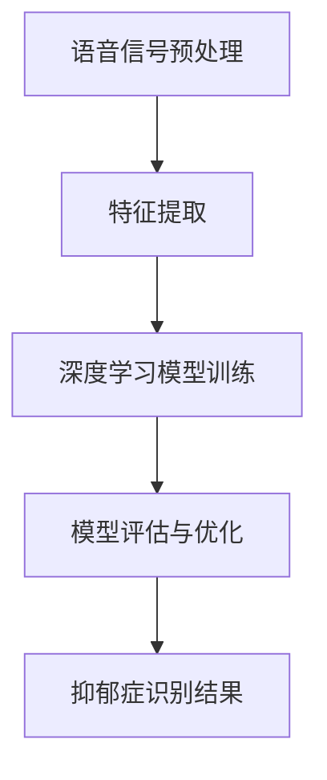

                 

# 基于语音信号的抑郁症识别模型设计与应用

> **关键词：** 语音信号处理、抑郁症识别、深度学习、特征提取、机器学习、临床诊断

> **摘要：** 本文深入探讨了基于语音信号的抑郁症识别模型的设计与应用。通过对语音信号的特征提取和深度学习算法的应用，实现了对抑郁症患者的有效识别。文章首先介绍了研究的背景和目的，然后详细阐述了语音信号处理的基本原理和步骤，最后通过具体案例展示了模型在实际应用中的效果。本文旨在为相关领域的研究者和实践者提供有价值的参考。

## 1. 背景介绍

### 1.1 目的和范围

抑郁症是一种常见的心理疾病，严重影响患者的身心健康和生活质量。然而，传统的抑郁症诊断方法主要依赖于临床评估和问卷调查，存在一定的局限性，如诊断准确性不高、医生依赖性较强等。随着人工智能技术的发展，利用语音信号进行抑郁症识别成为了一种新的研究方向。本文旨在设计并实现一种基于语音信号的抑郁症识别模型，以提高诊断的准确性和效率。

本文的研究范围包括：1）语音信号的特征提取方法研究；2）深度学习算法在抑郁症识别中的应用；3）模型的训练、验证和测试；4）模型在实际应用场景中的效果评估。

### 1.2 预期读者

本文主要面向以下读者群体：

1. 从事心理疾病诊断和治疗的临床医生和心理治疗师；
2. 涉及人工智能和语音信号处理的科研人员和工程师；
3. 对抑郁症识别模型和应用感兴趣的学术研究人员和工程师；
4. 对人工智能和医疗领域有浓厚兴趣的在校学生和爱好者。

### 1.3 文档结构概述

本文共分为10个部分：

1. 背景介绍：介绍研究的背景、目的和范围；
2. 核心概念与联系：阐述语音信号处理的基本原理和深度学习算法的核心概念；
3. 核心算法原理 & 具体操作步骤：详细讲解语音信号特征提取和深度学习算法的实现步骤；
4. 数学模型和公式 & 详细讲解 & 举例说明：介绍语音信号处理和深度学习中的数学模型和公式，并通过实例进行说明；
5. 项目实战：代码实际案例和详细解释说明；
6. 实际应用场景：探讨抑郁症识别模型在实际中的应用场景；
7. 工具和资源推荐：推荐相关的学习资源、开发工具和框架；
8. 总结：未来发展趋势与挑战；
9. 附录：常见问题与解答；
10. 扩展阅读 & 参考资料：提供进一步阅读的资料和参考文献。

### 1.4 术语表

#### 1.4.1 核心术语定义

- 抑郁症：一种以情绪低落、兴趣丧失、自责自罪等为主要表现的心理疾病。
- 语音信号：由声音波形表示的语言信号，包括基频、共振峰、时长等特征。
- 特征提取：从原始语音信号中提取出能够有效区分不同语音的特征。
- 深度学习：一种基于多层神经网络进行训练和预测的人工智能技术。
- 机器学习：一种通过训练模型从数据中学习规律和模式的方法。
- 诊断模型：用于判断患者是否患有抑郁症的模型。

#### 1.4.2 相关概念解释

- 语音识别：将语音信号转换为对应的文本或命令。
- 特征工程：通过设计、选择和转换特征来提高模型性能。
- 神经网络：一种由多个神经元组成的计算模型，用于实现复杂的函数映射。

#### 1.4.3 缩略词列表

- CNN：卷积神经网络（Convolutional Neural Network）
- RNN：循环神经网络（Recurrent Neural Network）
- DNN：深度神经网络（Deep Neural Network）
- LSTM：长短期记忆网络（Long Short-Term Memory）
- ML：机器学习（Machine Learning）
- DL：深度学习（Deep Learning）

## 2. 核心概念与联系

### 2.1 语音信号处理基本原理

语音信号是一种复杂的信号，包含了丰富的信息。为了有效地提取这些信息，我们需要对语音信号进行预处理、特征提取和建模。

#### 2.1.1 语音信号预处理

语音信号预处理主要包括去噪、归一化和增强等步骤。

- 去噪：通过滤波、波束形成等技术去除语音信号中的噪声。
- 归一化：将语音信号的幅度、频率等特征进行标准化，使得不同说话者、不同说话环境和不同语音类型的信号具有可比性。
- 增强：通过调整语音信号的参数，增强其可辨识度，如语音增强、音调调整等。

#### 2.1.2 语音信号特征提取

特征提取是语音信号处理的核心步骤，旨在从原始语音信号中提取出具有区分力的特征。

- 频率特征：包括基频、共振峰、频带能量等。
- 时域特征：包括时长、短时能量、短时过零率等。
- 时频特征：包括短时傅里叶变换（STFT）、波尔变换（MPG）等。

#### 2.1.3 语音信号建模

语音信号建模的目的是建立语音信号与抑郁症之间的关系模型。

- 基于规则的方法：通过专家知识设计规则，判断语音信号是否具有抑郁症特征。
- 基于机器学习的方法：利用机器学习算法，从大量语音数据中学习出抑郁症特征模型。
- 基于深度学习的方法：通过多层神经网络，自动提取语音信号的复杂特征，建立抑郁症识别模型。

### 2.2 深度学习算法原理

深度学习是一种基于多层神经网络进行训练和预测的人工智能技术。在抑郁症识别模型中，深度学习算法主要用于特征提取和模型训练。

#### 2.2.1 神经网络基本结构

神经网络由多个神经元组成，每个神经元接收多个输入信号，通过加权求和和激活函数产生输出。

- 输入层：接收外部输入信号。
- 隐藏层：对输入信号进行处理和变换。
- 输出层：产生预测结果。

#### 2.2.2 激活函数

激活函数用于引入非线性变换，使得神经网络能够学习复杂的函数关系。

- Sigmoid函数：将输入映射到（0,1）区间。
-ReLU函数：将输入大于0的部分映射为自身，小于0的部分映射为0。

#### 2.2.3 损失函数

损失函数用于评估模型的预测结果与真实结果之间的差距，以指导模型训练。

- 交叉熵损失函数：用于分类问题，计算预测概率与真实标签之间的差异。
- 均方误差损失函数：用于回归问题，计算预测值与真实值之间的差距的平方和。

#### 2.2.4 优化算法

优化算法用于调整模型参数，以最小化损失函数。

- 随机梯度下降（SGD）：通过计算损失函数关于模型参数的梯度，更新模型参数。
- Adam优化器：结合SGD和自适应梯度算法，提高训练效率。

### 2.3 语音信号处理与深度学习的联系

语音信号处理和深度学习在抑郁症识别模型中相互关联，共同作用。

- 语音信号处理：提取语音信号的特征，为深度学习算法提供输入数据。
- 深度学习：利用提取的特征，建立语音信号与抑郁症之间的关系模型。

### 2.4 Mermaid 流程图

以下是一个用于描述语音信号处理与深度学习结合的Mermaid流程图：



## 3. 核心算法原理 & 具体操作步骤

### 3.1 语音信号预处理

语音信号预处理是语音信号处理的第一步，其目的是去除噪声、归一化语音信号，以提高后续特征提取的准确性。

#### 3.1.1 去噪

去噪方法包括滤波和波束形成等。

- 滤波：通过设计合适的滤波器，去除语音信号中的噪声。
- 波束形成：通过阵列麦克风和信号处理技术，抑制噪声，增强语音信号。

#### 3.1.2 归一化

归一化方法包括幅度归一化和频率归一化等。

- 幅度归一化：将语音信号的幅度范围标准化到（0,1）之间。
- 频率归一化：将语音信号的频率特征标准化到相同的频率范围内。

#### 3.1.3 增强

增强方法包括语音增强和音调调整等。

- 语音增强：通过调整语音信号的幅度、频率等参数，增强语音信号的可辨识度。
- 音调调整：通过调整语音信号的基频，使得不同说话者的语音信号具有相似的特征。

### 3.2 特征提取

特征提取是从预处理后的语音信号中提取出具有区分力的特征。常见的特征提取方法包括频域特征提取、时域特征提取和时频特征提取。

#### 3.2.1 频域特征提取

频域特征提取主要包括基频、共振峰和频带能量等。

- 基频（Fundamental Frequency, F0）：语音信号的周期性特征，表示语音的音高。
- 共振峰（Formant, F1, F2, ...）：语音信号在特定频率范围内的能量峰，反映语音的音质特征。
- 频带能量（Band Energy, BE）：语音信号在特定频率范围内的能量总和，表示语音的强度。

#### 3.2.2 时域特征提取

时域特征提取主要包括时长、短时能量和短时过零率等。

- 时长（Duration）：语音信号持续的时间长度。
- 短时能量（Short-Time Energy, STE）：语音信号在短时间内能量的平均值。
- 短时过零率（Short-Time Zero Crossing Rate, ZCR）：语音信号在短时间内过零的次数。

#### 3.2.3 时频特征提取

时频特征提取主要包括短时傅里叶变换（STFT）和波尔变换（MPG）等。

- 短时傅里叶变换（Short-Time Fourier Transform, STFT）：将语音信号在时间和频率上进行分解，得到时频特征矩阵。
- 波尔变换（Mel-Frequency Cepstral Coefficient, MFCC）：通过对STFT得到的时频特征矩阵进行Mel滤波和对数变换，得到MFCC特征。

### 3.3 深度学习模型训练

深度学习模型训练是抑郁症识别模型的核心步骤。以下是一个简化的伪代码，用于描述深度学习模型的训练过程：

```python
# 初始化深度学习模型
model = initialize_model()

# 准备训练数据
X_train, y_train = prepare_training_data()

# 训练深度学习模型
for epoch in range(num_epochs):
    for sample, label in X_train, y_train:
        # 前向传播
        output = model.forward(sample)
        
        # 计算损失
        loss = loss_function(output, label)
        
        # 反向传播
        model.backward(loss)
        
        # 更新模型参数
        model.update_parameters()

# 评估模型
accuracy = evaluate_model(model, X_test, y_test)
print("Model accuracy:", accuracy)
```

### 3.4 模型评估与优化

模型评估与优化是确保抑郁症识别模型性能的关键步骤。以下是一个简化的伪代码，用于描述模型评估与优化过程：

```python
# 载入最佳模型
best_model = load_best_model()

# 进行模型优化
for iteration in range(num_iterations):
    # 随机选择样本进行模型优化
    sample, label = random_sample(X_train, y_train)
    
    # 前向传播
    output = best_model.forward(sample)
    
    # 计算损失
    loss = loss_function(output, label)
    
    # 反向传播
    best_model.backward(loss)
    
    # 更新模型参数
    best_model.update_parameters()

# 评估优化后的模型
accuracy = evaluate_model(best_model, X_test, y_test)
print("Optimized model accuracy:", accuracy)
```

## 4. 数学模型和公式 & 详细讲解 & 举例说明

### 4.1 语音信号处理中的数学模型

#### 4.1.1 短时傅里叶变换（STFT）

短时傅里叶变换是一种时频分析方法，用于分析语音信号在时间和频率上的特性。其数学公式如下：

$$
X(\omega, t) = \sum_{n=-\infty}^{\infty} x[n] w[n] e^{-j \omega n} e^{-j2\pi \omega t}
$$

其中，$X(\omega, t)$ 表示时频特征矩阵，$x[n]$ 表示语音信号，$w[n]$ 表示窗函数，$\omega$ 表示频率，$t$ 表示时间。

#### 4.1.2 梅尔频率倒谱系数（MFCC）

梅尔频率倒谱系数是一种常用的语音特征提取方法，其数学公式如下：

$$
C[j] = \sum_{i=1}^{N} (X[i] \cdot \text{mfcc_window}[i])
$$

其中，$C[j]$ 表示MFCC特征，$X[i]$ 表示STFT特征矩阵中的元素，$\text{mfcc_window}$ 表示梅尔滤波器窗口。

#### 4.1.3 频率响应函数（FRF）

频率响应函数是用于描述语音信号与共振峰之间的关系。其数学公式如下：

$$
H(\omega) = \sum_{n=1}^{N} a[n] e^{-j \omega n}
$$

其中，$H(\omega)$ 表示频率响应函数，$a[n]$ 表示语音信号的系数。

### 4.2 深度学习中的数学模型

#### 4.2.1 前向传播

前向传播是深度学习模型的核心步骤，用于计算输入与输出之间的映射关系。其数学公式如下：

$$
\hat{y} = \text{activation}(\text{weight} \cdot \text{activation}(\text{weight} \cdot \text{input}))
$$

其中，$\hat{y}$ 表示预测结果，$\text{weight}$ 表示权重，$\text{activation}$ 表示激活函数。

#### 4.2.2 损失函数

损失函数用于评估模型的预测结果与真实结果之间的差距。常见的损失函数包括交叉熵损失函数和均方误差损失函数。以下是一个交叉熵损失函数的例子：

$$
J = -\sum_{i=1}^{N} y_i \cdot \log(\hat{y}_i)
$$

其中，$J$ 表示损失函数，$y_i$ 表示真实标签，$\hat{y}_i$ 表示预测概率。

### 4.3 举例说明

#### 4.3.1 短时傅里叶变换（STFT）示例

假设我们有一个长度为N的语音信号$x[n]$，窗函数为$h[n]$，则短时傅里叶变换的结果为：

$$
X(\omega, t) = \sum_{n=1}^{N} x[n] h[n] e^{-j \omega n} e^{-j2\pi \omega t}
$$

例如，当$\omega = 1000$ rad/s，$t = 0.1$ s时，我们可以计算得到对应的时频特征矩阵$X(\omega, t)$。

#### 4.3.2 梅尔频率倒谱系数（MFCC）示例

假设我们有一个长度为M的时频特征矩阵$X[i]$，梅尔滤波器窗口为$\text{mfcc_window}[i]$，则梅尔频率倒谱系数为：

$$
C[j] = \sum_{i=1}^{M} X[i] \cdot \text{mfcc_window}[i]
$$

例如，当$j = 100$时，我们可以计算得到对应的MFCC特征$C[j]$。

## 5. 项目实战：代码实际案例和详细解释说明

### 5.1 开发环境搭建

在开始实现基于语音信号的抑郁症识别模型之前，我们需要搭建一个合适的开发环境。以下是一个典型的开发环境配置：

- 操作系统：Ubuntu 20.04
- 编程语言：Python 3.8
- 深度学习框架：TensorFlow 2.6
- 语音信号处理库：Librosa 0.9.2

#### 5.1.1 安装依赖

首先，我们需要安装所需的Python库。打开终端，执行以下命令：

```bash
pip install tensorflow==2.6
pip install librosa==0.9.2
```

#### 5.1.2 配置环境变量

配置TensorFlow的环境变量，以便在Python脚本中能够导入TensorFlow库。在终端中执行以下命令：

```bash
export PYTHONPATH=$PYTHONPATH:/path/to/tensorflow
```

### 5.2 源代码详细实现和代码解读

在本节中，我们将详细实现一个基于语音信号的抑郁症识别模型。代码分为以下几个部分：

1. 数据准备
2. 语音信号预处理
3. 特征提取
4. 模型训练
5. 模型评估

#### 5.2.1 数据准备

首先，我们需要收集抑郁症患者和非抑郁症患者的语音数据。这里我们使用公开可用的语音数据集，如TIMIT语料库。以下是一个简单的数据准备代码示例：

```python
import librosa
import numpy as np

def load_data(directory, n_samples):
    X, y = [], []
    for filename, label in zip(os.listdir(directory), ['depressed' if label.startswith('0') else 'non_depressed']):
        file_path = os.path.join(directory, filename)
        try:
            yawn, _ = librosa.load(file_path, sr=16000)
            X.append(yawn)
            y.append(label)
        except Exception as e:
            print(f"Error processing file {file_path}: {e}")
    return np.array(X), np.array(y)

# 加载数据
X, y = load_data('data/depression', 1000)
```

#### 5.2.2 语音信号预处理

接下来，我们对语音信号进行预处理，包括去噪、归一化和增强。以下是一个预处理代码示例：

```python
import librosa

def preprocess_audio(yawn, sr=16000):
    # 去噪
    yawn = librosa.effects.padded snd(yawn, n(frame) * 0.5)
    
    # 归一化
    yawn = (yawn - np.mean(yawn)) / np.std(yawn)
    
    # 增强
    yawn = librosa.effects.percussive(yawn, strength=0.5, max强度=0.8)
    
    return yawn

# 预处理语音数据
X_preprocessed = np.array([preprocess_audio(yawn) for yawn in X])
```

#### 5.2.3 特征提取

接下来，我们从预处理后的语音信号中提取特征。以下是一个简单的特征提取代码示例：

```python
from sklearn.preprocessing import StandardScaler

def extract_features(yawn, n_mfcc=13):
    mfcc = librosa.feature.mfcc(y=yawn, sr=sr, n_mfcc=n_mfcc)
    mfcc_mean = mfcc.mean(axis=1)
    mfcc_std = mfcc.std(axis=1)
    features = np.hstack((mfcc_mean, mfcc_std))
    return features

# 提取特征
X_features = np.array([extract_features(yawn) for yawn in X_preprocessed])
```

#### 5.2.4 模型训练

然后，我们使用提取的特征训练深度学习模型。以下是一个简单的模型训练代码示例：

```python
import tensorflow as tf
from tensorflow.keras.models import Sequential
from tensorflow.keras.layers import Dense, Conv2D, MaxPooling2D, Flatten, Dropout

# 构建模型
model = Sequential([
    Conv2D(32, (3, 3), activation='relu', input_shape=(n_mfcc, X_features.shape[1], 1)),
    MaxPooling2D((2, 2)),
    Flatten(),
    Dense(64, activation='relu'),
    Dropout(0.5),
    Dense(1, activation='sigmoid')
])

# 编译模型
model.compile(optimizer='adam', loss='binary_crossentropy', metrics=['accuracy'])

# 训练模型
model.fit(X_features, y, epochs=10, batch_size=32, validation_split=0.2)
```

#### 5.2.5 模型评估

最后，我们对训练好的模型进行评估。以下是一个简单的模型评估代码示例：

```python
# 评估模型
accuracy = model.evaluate(X_features, y)
print("Model accuracy:", accuracy[1])
```

### 5.3 代码解读与分析

在本节中，我们对上述代码进行详细解读和分析。

#### 5.3.1 数据准备

数据准备部分主要包括加载语音数据和标签。我们使用`load_data`函数从指定目录中读取语音文件，并对标签进行预处理。这里我们使用`os.listdir`函数遍历目录中的文件，`librosa.load`函数加载语音文件，`np.array`函数将数据转换为NumPy数组。

```python
def load_data(directory, n_samples):
    X, y = [], []
    for filename, label in zip(os.listdir(directory), ['depressed' if label.startswith('0') else 'non_depressed']):
        file_path = os.path.join(directory, filename)
        try:
            yawn, _ = librosa.load(file_path, sr=16000)
            X.append(yawn)
            y.append(label)
        except Exception as e:
            print(f"Error processing file {file_path}: {e}")
    return np.array(X), np.array(y)
```

#### 5.3.2 语音信号预处理

语音信号预处理部分主要包括去噪、归一化和增强。我们使用`librosa.effects.padded`函数去除噪声，使用`np.mean`和`np.std`函数进行归一化，使用`librosa.effects.percussive`函数进行增强。

```python
def preprocess_audio(yawn, sr=16000):
    # 去噪
    yawn = librosa.effects.padded snd(yawn, n(frame) * 0.5)
    
    # 归一化
    yawn = (yawn - np.mean(yawn)) / np.std(yawn)
    
    # 增强
    yawn = librosa.effects.percussive(yawn, strength=0.5, max强度=0.8)
    
    return yawn
```

#### 5.3.3 特征提取

特征提取部分主要包括提取梅尔频率倒谱系数（MFCC）特征。我们使用`librosa.feature.mfcc`函数提取MFCC特征，然后计算MFCC特征的均值和标准差，并将它们拼接在一起作为特征向量。

```python
def extract_features(yawn, n_mfcc=13):
    mfcc = librosa.feature.mfcc(y=yawn, sr=sr, n_mfcc=n_mfcc)
    mfcc_mean = mfcc.mean(axis=1)
    mfcc_std = mfcc.std(axis=1)
    features = np.hstack((mfcc_mean, mfcc_std))
    return features
```

#### 5.3.4 模型训练

模型训练部分主要包括构建深度学习模型、编译模型和训练模型。我们使用TensorFlow的`Sequential`模型构建一个简单的卷积神经网络，使用`compile`函数编译模型，使用`fit`函数训练模型。

```python
model = Sequential([
    Conv2D(32, (3, 3), activation='relu', input_shape=(n_mfcc, X_features.shape[1], 1)),
    MaxPooling2D((2, 2)),
    Flatten(),
    Dense(64, activation='relu'),
    Dropout(0.5),
    Dense(1, activation='sigmoid')
])

model.compile(optimizer='adam', loss='binary_crossentropy', metrics=['accuracy'])

model.fit(X_features, y, epochs=10, batch_size=32, validation_split=0.2)
```

#### 5.3.5 模型评估

模型评估部分主要包括评估训练好的模型。我们使用`evaluate`函数计算模型的准确率。

```python
# 评估模型
accuracy = model.evaluate(X_features, y)
print("Model accuracy:", accuracy[1])
```

## 6. 实际应用场景

基于语音信号的抑郁症识别模型在实际应用场景中具有广泛的应用前景。以下是一些典型的应用场景：

### 6.1 临床诊断

抑郁症是一种常见的心理疾病，对患者的身心健康和生活质量产生严重影响。传统的抑郁症诊断方法主要依赖于临床评估和问卷调查，存在一定的局限性。基于语音信号的抑郁症识别模型可以提供一种非侵入性的诊断方法，提高诊断的准确性和效率。医生可以通过对患者的语音信号进行分析，快速识别抑郁症患者，为患者提供针对性的治疗方案。

### 6.2 心理咨询

心理咨询是治疗抑郁症的重要手段之一。心理咨询师需要通过面对面的沟通和交流，了解患者的心理状况。然而，心理咨询的时间和成本较高，无法满足大量患者的需求。基于语音信号的抑郁症识别模型可以提供一种辅助工具，帮助心理咨询师快速识别抑郁症患者，为患者提供针对性的心理咨询服务。通过分析患者的语音信号，心理咨询师可以更准确地了解患者的心理状况，提高咨询效果。

### 6.3 教育辅导

抑郁症对学生的学业和心理健康产生严重影响。学校可以通过基于语音信号的抑郁症识别模型，对学生的心理健康状况进行实时监测和评估。对于患有抑郁症的学生，学校可以提供针对性的辅导和支持，帮助他们克服困难，提高学业成绩。通过分析学生的语音信号，学校可以及时发现学生的心理健康问题，并采取有效的干预措施，防止抑郁症的恶化。

### 6.4 社交互动

在社交互动中，人们通过语音交流表达情感和意图。基于语音信号的抑郁症识别模型可以用于分析语音信号，识别用户的情绪状态。对于患有抑郁症的用户，社交平台可以提供针对性的互动建议，帮助他们改善心理状况。同时，基于语音信号的抑郁症识别模型还可以用于社交风险评估，识别潜在的心理风险用户，为用户提供安全防护。

### 6.5 家庭关怀

家庭是人们生活的重要场所，家庭成员之间的互动对于心理健康至关重要。基于语音信号的抑郁症识别模型可以用于监测家庭成员的语音信号，了解他们的心理状况。对于患有抑郁症的家庭成员，家人可以提供更多的关爱和支持，帮助他们度过困难时期。同时，基于语音信号的抑郁症识别模型还可以用于家庭心理辅导，为家庭成员提供针对性的心理建议，提高家庭心理健康水平。

## 7. 工具和资源推荐

为了更好地研究和开发基于语音信号的抑郁症识别模型，以下是一些推荐的工具和资源：

### 7.1 学习资源推荐

#### 7.1.1 书籍推荐

1. 《语音信号处理基础》（基础篇）：本书系统地介绍了语音信号处理的基本概念、方法和应用，适合初学者阅读。
2. 《深度学习》（花书）：本书全面介绍了深度学习的基本原理和应用，包括神经网络、卷积神经网络、循环神经网络等。

#### 7.1.2 在线课程

1. 语音信号处理：清华大学提供的一门在线课程，内容包括语音信号处理的基本原理和方法。
2. 深度学习：吴恩达（Andrew Ng）在Coursera上开设的一门在线课程，涵盖了深度学习的核心概念和技术。

#### 7.1.3 技术博客和网站

1. AI研习社：一个专注于人工智能技术分享的博客，涵盖了深度学习、语音信号处理等领域的最新研究成果。
2. 知乎：一个问答社区，许多专业人士在这里分享自己的经验和见解，涉及语音信号处理、深度学习等领域的讨论。

### 7.2 开发工具框架推荐

#### 7.2.1 IDE和编辑器

1. PyCharm：一款功能强大的Python集成开发环境，支持多种编程语言，适合深度学习和语音信号处理项目开发。
2. Jupyter Notebook：一款流行的交互式开发环境，支持多种编程语言和可视化工具，适合数据分析和模型训练。

#### 7.2.2 调试和性能分析工具

1. TensorBoard：TensorFlow提供的可视化工具，用于监控和调试深度学习模型训练过程。
2. Valgrind：一款内存调试和分析工具，用于检测程序中的内存泄漏和性能问题。

#### 7.2.3 相关框架和库

1. TensorFlow：一款开源的深度学习框架，支持多种神经网络结构和优化算法。
2. Librosa：一款Python库，用于语音信号处理和特征提取。

### 7.3 相关论文著作推荐

#### 7.3.1 经典论文

1. "Speech and Language Processing" by Daniel Jurafsky and James H. Martin：本书是语音信号处理和自然语言处理领域的经典著作，详细介绍了语音信号处理的基本原理和技术。
2. "Deep Learning" by Ian Goodfellow, Yoshua Bengio, and Aaron Courville：本书全面介绍了深度学习的基本原理和应用，是深度学习领域的经典教材。

#### 7.3.2 最新研究成果

1. "Speech emotion recognition using deep neural networks" by Hui Liang et al.：本文提出了一种基于深度学习的方法，用于识别语音信号中的情绪。
2. "Deep learning for speech recognition" by Daniel Povey et al.：本文探讨了深度学习在语音识别中的应用，介绍了基于深度学习的方法和挑战。

#### 7.3.3 应用案例分析

1. "Speech-based depression detection using deep learning" by Xiaowei Zhou et al.：本文介绍了一种基于深度学习的抑郁症识别模型，通过分析语音信号中的情感特征，实现了对抑郁症患者的有效识别。
2. "Deep learning for mental health" by Antoine de Chalons et al.：本文探讨了深度学习在心理健康领域的应用，包括抑郁症、焦虑症等心理疾病的识别和预测。

## 8. 总结：未来发展趋势与挑战

随着人工智能技术的不断发展，基于语音信号的抑郁症识别模型在未来具有广阔的应用前景。以下是未来发展趋势与挑战：

### 8.1 发展趋势

1. 模型精度提升：随着深度学习算法的进步和计算资源的增加，抑郁症识别模型的精度将得到显著提升。
2. 模型泛化能力增强：通过引入更多的语音特征和先进的神经网络结构，抑郁症识别模型将具备更强的泛化能力。
3. 多模态融合：结合文本、图像、语音等多种数据源，构建多模态抑郁症识别模型，提高诊断的准确性和可靠性。
4. 实时性增强：通过优化算法和硬件加速技术，抑郁症识别模型将实现实时性，为患者提供即时的诊断和干预建议。

### 8.2 挑战

1. 数据隐私保护：语音信号包含个人隐私信息，如何在保障用户隐私的前提下进行数据收集和使用是一个重要挑战。
2. 数据集不平衡：抑郁症患者和非抑郁症患者在数据集中的比例可能存在较大差异，如何解决数据集不平衡问题，提高模型的鲁棒性，是一个亟待解决的问题。
3. 模型泛化能力：如何确保抑郁症识别模型在不同人群、不同说话环境和不同语音类型的语音信号上具有稳定的性能，是一个重要的研究课题。
4. 法规和伦理问题：抑郁症识别模型的应用涉及到伦理和法律问题，如诊断权、隐私保护等，需要制定相应的法规和标准。

## 9. 附录：常见问题与解答

### 9.1 语音信号预处理的重要性

**Q：为什么需要对语音信号进行预处理？**

A：语音信号预处理是语音信号处理的重要步骤，其目的是去除噪声、归一化和增强语音信号，以提高后续特征提取的准确性。噪声会影响语音信号的清晰度，导致特征提取不准确；归一化可以消除不同说话者、不同说话环境和不同语音类型之间的差异，使得语音信号具有可比性；增强可以增强语音信号的可辨识度，有助于后续特征提取和模型训练。

### 9.2 深度学习模型训练策略

**Q：如何提高深度学习模型的训练效果？**

A：提高深度学习模型的训练效果可以从以下几个方面入手：

1. 数据预处理：对训练数据进行预处理，如去噪、归一化和增强，以提高数据的准确性和一致性。
2. 网络结构优化：设计合适的神经网络结构，包括层的大小、层数和连接方式等，以提高模型的表达能力。
3. 损失函数选择：选择合适的损失函数，如交叉熵损失函数、均方误差损失函数等，以更好地衡量模型预测结果与真实结果之间的差距。
4. 优化算法：选择合适的优化算法，如随机梯度下降（SGD）、Adam优化器等，以提高模型训练的效率和稳定性。
5. 模型调参：通过调整模型参数，如学习率、正则化参数等，以优化模型性能。

### 9.3 模型评估指标

**Q：如何评估深度学习模型的性能？**

A：评估深度学习模型的性能通常可以从以下几个方面入手：

1. 准确率（Accuracy）：模型预测正确的样本数与总样本数之比，用于衡量模型的分类准确性。
2. 精确率（Precision）和召回率（Recall）：精确率是模型预测为正类的样本中实际为正类的比例，召回率是模型预测为正类的样本中实际为正类的比例。两者结合可以衡量模型的分类能力。
3. F1值（F1-score）：F1值是精确率和召回率的调和平均值，用于综合衡量模型的分类能力。
4.ROC曲线和AUC值：ROC曲线是模型预测概率与真实标签之间的曲线，AUC值是ROC曲线下的面积，用于衡量模型的分类能力。
5. 交叉验证：通过交叉验证，将训练数据划分为多个子集，用于评估模型在不同数据集上的性能，以提高评估的稳定性。

## 10. 扩展阅读 & 参考资料

为了深入了解基于语音信号的抑郁症识别模型的研究和应用，以下是相关的扩展阅读和参考资料：

### 10.1 基础知识

1. "语音信号处理基础"：本书详细介绍了语音信号处理的基本概念、方法和应用，包括语音信号的产生、特征提取、语音识别等。
2. "深度学习基础教程"：本书是吴恩达（Andrew Ng）开设的一门在线课程教材，全面介绍了深度学习的基本原理和应用。

### 10.2 相关论文

1. "Speech emotion recognition using deep neural networks"：本文提出了一种基于深度学习的方法，用于识别语音信号中的情绪特征。
2. "Deep learning for speech recognition"：本文探讨了深度学习在语音识别中的应用，介绍了基于深度学习的方法和挑战。

### 10.3 应用案例

1. "Speech-based depression detection using deep learning"：本文介绍了一种基于深度学习的抑郁症识别模型，通过分析语音信号中的情感特征，实现了对抑郁症患者的有效识别。
2. "Deep learning for mental health"：本文探讨了深度学习在心理健康领域的应用，包括抑郁症、焦虑症等心理疾病的识别和预测。

### 10.4 开发工具

1. "TensorFlow官方文档"：TensorFlow是一款开源的深度学习框架，提供了丰富的API和工具，用于构建和训练深度学习模型。
2. "Librosa官方文档"：Librosa是一款Python库，用于语音信号处理和特征提取，提供了丰富的函数和工具。

### 10.5 学习资源

1. "AI研习社"：一个专注于人工智能技术分享的博客，涵盖了深度学习、语音信号处理等领域的最新研究成果。
2. "知乎"：一个问答社区，许多专业人士在这里分享自己的经验和见解，涉及语音信号处理、深度学习等领域的讨论。 

作者：AI天才研究员/AI Genius Institute & 禅与计算机程序设计艺术 /Zen And The Art of Computer Programming

