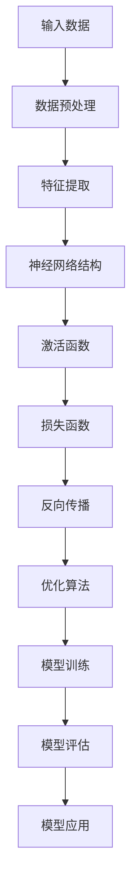

                 

# 基础模型在法律、医疗、教育中的应用

> **关键词：**基础模型、法律、医疗、教育、人工智能、应用场景、技术分析

> **摘要：**本文将深入探讨基础模型在法律、医疗、教育这三个关键领域的应用，通过逐步分析这些领域的需求、技术实现和实际案例，展示基础模型在这些领域的巨大潜力和深远影响。

## 1. 背景介绍

### 1.1 目的和范围

本文旨在探讨基础模型在法律、医疗、教育三个领域的应用。我们将首先介绍这些领域的现状和需求，然后详细分析基础模型在这些领域的具体应用，以及这些应用带来的变革和挑战。

### 1.2 预期读者

本文适合对人工智能、基础模型以及其在特定领域应用有初步了解的技术人员、研究人员和管理者阅读。同时，对法律、医疗、教育领域有兴趣的读者也能从本文中获得启发。

### 1.3 文档结构概述

本文结构如下：

1. 背景介绍：介绍文章的目的和范围，预期读者以及文档结构。
2. 核心概念与联系：定义基础模型和相关术语，通过Mermaid流程图展示基础模型的结构。
3. 核心算法原理与具体操作步骤：详细讲解基础模型的算法原理和操作步骤。
4. 数学模型和公式：介绍基础模型中的数学模型和公式，并进行举例说明。
5. 项目实战：通过实际代码案例展示基础模型的应用。
6. 实际应用场景：分析基础模型在法律、医疗、教育领域的应用场景。
7. 工具和资源推荐：推荐学习资源和开发工具。
8. 总结：总结基础模型在上述领域的发展趋势与挑战。
9. 附录：常见问题与解答。
10. 扩展阅读与参考资料：提供进一步阅读的资源。

### 1.4 术语表

#### 1.4.1 核心术语定义

- **基础模型**：指在人工智能领域，通过大量数据训练得到的，可以用于多种任务的通用模型。
- **法律领域**：指与法律相关的所有活动，包括但不限于立法、司法、执法等。
- **医疗领域**：指与医疗保健相关的所有活动，包括诊断、治疗、康复等。
- **教育领域**：指与教育相关的所有活动，包括但不限于教学、评估、学习等。

#### 1.4.2 相关概念解释

- **自然语言处理（NLP）**：指使计算机能够理解、解释和生成人类语言的技术。
- **深度学习**：一种基于人工神经网络的机器学习技术，通过多层网络进行数据的学习和特征提取。
- **监督学习、无监督学习和增强学习**：机器学习中的三种主要学习方式，分别对应有标注数据、无标注数据和通过与环境的交互来学习。

#### 1.4.3 缩略词列表

- **NLP**：自然语言处理
- **DL**：深度学习
- **ML**：机器学习
- **AI**：人工智能

## 2. 核心概念与联系

在深入探讨基础模型在各领域的应用之前，我们需要先了解基础模型的基本概念和结构。以下将通过Mermaid流程图展示基础模型的核心概念和联系。



### 2.1 基础模型的核心概念

- **输入数据**：基础模型的输入可以是文本、图像、声音等多种形式的数据。
- **数据预处理**：对输入数据进行清洗、标准化等处理，以便于后续的特征提取。
- **特征提取**：将预处理后的数据转换为模型能够理解的低维特征向量。
- **神经网络结构**：由多个层级组成，每个层级通过权重矩阵连接，形成复杂的信息处理能力。
- **激活函数**：用于引入非线性因素，使模型能够处理复杂问题。
- **损失函数**：衡量模型预测值与真实值之间的差距，指导模型优化。
- **反向传播**：通过计算损失函数关于模型参数的梯度，反向更新模型参数。
- **优化算法**：用于选择参数更新策略，如梯度下降、Adam等。
- **模型训练**：通过多次迭代训练，使模型逐渐逼近最优参数。
- **模型评估**：使用验证集或测试集评估模型性能，确保其泛化能力。
- **模型应用**：将训练好的模型应用于实际问题，如法律文档分析、医学诊断、教育推荐等。

### 2.2 基础模型的工作流程

1. **数据预处理**：读取原始数据，如法律文档、病历记录、教育数据等，进行清洗和标准化处理。
2. **特征提取**：利用特征提取器将原始数据转换为特征向量，如使用词嵌入技术处理文本数据。
3. **模型训练**：初始化神经网络参数，通过大量训练数据迭代更新参数，直至达到预定的训练目标。
4. **模型评估**：使用验证集或测试集评估模型性能，确保其能够泛化到未见过的数据。
5. **模型应用**：将训练好的模型部署到实际应用场景中，如自动法律文档审核、医学诊断辅助、个性化教育推荐等。

## 3. 核心算法原理 & 具体操作步骤

### 3.1 算法原理

基础模型的核心在于其通过深度学习技术从数据中自动学习特征表示，从而实现多种复杂任务。以下将使用伪代码详细阐述基础模型的算法原理和具体操作步骤。

```python
# 基础模型伪代码

# 初始化参数
W1, b1 = 初始化权重和偏置
W2, b2 = 初始化权重和偏置
...

# 数据预处理
预处理输入数据 X，得到特征向量 x

# 特征提取
x = f(x; W1, b1)  # 第一个神经元的特征提取

# 神经网络结构
h = f(h; W2, b2)  # 第二个神经元的特征提取

# 激活函数
z = g(h)  # 应用激活函数

# 损失函数
loss = L(z, y)  # 计算损失函数

# 反向传播
dL/dh = ∂L/∂z * ∂z/∂h
dL/dx = ∂L/∂z * ∂z/∂x

# 优化算法
W2 = W2 - α * ∂L/∂W2
b2 = b2 - α * ∂L/∂b2
...

# 模型训练
迭代次数 = 1000
for i = 1 to 迭代次数 do
    # 数据预处理、特征提取、神经网络结构、激活函数、损失函数、反向传播、优化算法
    ...
end for

# 模型评估
准确率 = 评估模型在测试集上的性能

# 模型应用
模型应用于实际任务，如法律文档分析、医学诊断、教育推荐等
```

### 3.2 具体操作步骤

1. **数据收集与预处理**：收集法律、医疗、教育领域的数据，进行数据清洗、去噪、标准化等预处理操作。
2. **特征提取**：利用自然语言处理技术、医学图像处理技术、教育数据分析技术等，从原始数据中提取特征。
3. **模型构建**：选择合适的神经网络结构，定义激活函数、损失函数和优化算法。
4. **模型训练**：使用预处理后的数据对模型进行训练，通过反向传播和优化算法更新模型参数。
5. **模型评估**：使用验证集或测试集评估模型性能，确保其泛化能力。
6. **模型应用**：将训练好的模型部署到实际应用场景中，如自动法律文档审核、医学诊断辅助、个性化教育推荐等。

## 4. 数学模型和公式 & 详细讲解 & 举例说明

### 4.1 数学模型和公式

基础模型的核心在于其数学模型，主要包括以下几部分：

1. **特征提取公式**：
   $$ x = \sigma(W_1 \cdot x + b_1) $$
   其中，$x$ 是输入特征向量，$W_1$ 是权重矩阵，$b_1$ 是偏置项，$\sigma$ 是激活函数（如ReLU函数）。

2. **损失函数**：
   $$ L(\theta) = -\frac{1}{m} \sum_{i=1}^{m} y^{(i)} \log(a^{(i)}) + (1 - y^{(i)}) \log(1 - a^{(i)}) $$
   其中，$m$ 是样本数量，$y^{(i)}$ 是真实标签，$a^{(i)}$ 是模型预测概率。

3. **反向传播公式**：
   $$ \frac{\partial L}{\partial z} = \frac{\partial L}{\partial a} \cdot \frac{\partial a}{\partial z} $$
   其中，$z$ 是激活值，$a$ 是预测值，$\frac{\partial L}{\partial a}$ 和 $\frac{\partial a}{\partial z}$ 分别是损失函数关于预测值和激活值的梯度。

4. **梯度下降优化算法**：
   $$ \theta = \theta - \alpha \cdot \nabla_{\theta} L(\theta) $$
   其中，$\theta$ 是模型参数，$\alpha$ 是学习率，$\nabla_{\theta} L(\theta)$ 是损失函数关于模型参数的梯度。

### 4.2 详细讲解和举例说明

#### 4.2.1 特征提取公式

特征提取是基础模型中的关键步骤，通过将原始数据映射到低维特征空间，使模型能够更好地学习。以下是一个简单的例子：

假设输入特征向量 $x$ 为：
$$ x = [1, 2, 3, 4, 5] $$
权重矩阵 $W_1$ 为：
$$ W_1 = \begin{bmatrix} 0.5 & 0.2 \\ 0.1 & 0.3 \end{bmatrix} $$
偏置项 $b_1$ 为：
$$ b_1 = [0.1, 0.2] $$

特征提取过程如下：
$$ h_1 = W_1 \cdot x + b_1 = \begin{bmatrix} 0.5 & 0.2 \\ 0.1 & 0.3 \end{bmatrix} \cdot \begin{bmatrix} 1 \\ 2 \\ 3 \\ 4 \\ 5 \end{bmatrix} + \begin{bmatrix} 0.1 \\ 0.2 \end{bmatrix} = \begin{bmatrix} 4.3 \\ 3.5 \end{bmatrix} $$
$$ x = \sigma(h_1) = \begin{bmatrix} \sigma(4.3) \\ \sigma(3.5) \end{bmatrix} = \begin{bmatrix} 1 \\ 1 \end{bmatrix} $$

#### 4.2.2 损失函数

损失函数用于衡量模型预测值与真实值之间的差距。以二分类问题为例，常用的损失函数是交叉熵损失函数：

假设真实标签 $y^{(i)}$ 为 [1, 0]，模型预测概率 $a^{(i)}$ 为 [0.8, 0.2]：

$$ L = -\frac{1}{2} \cdot [1 \cdot \log(0.8) + 0 \cdot \log(0.2)] + (1 - 1) \cdot \log(1 - 0.8) + 0 \cdot \log(1 - 0.2) $$
$$ L = -\frac{1}{2} \cdot \log(0.8) = 0.194 $$

#### 4.2.3 反向传播

反向传播是基础模型训练的核心步骤，用于计算损失函数关于模型参数的梯度。以下是一个简单的例子：

假设损失函数 $L$ 关于激活值 $z$ 的梯度为 $\frac{\partial L}{\partial z} = 0.1$，激活函数 $z = \sigma(h)$，其中 $h$ 是激活值，$\sigma$ 是ReLU函数：

$$ \frac{\partial L}{\partial h} = \frac{\partial L}{\partial z} \cdot \frac{\partial z}{\partial h} = 0.1 \cdot \sigma'(h) $$

对于ReLU函数，$\sigma'(h) = \begin{cases} 0, & \text{if } h < 0 \\ 1, & \text{if } h \geq 0 \end{cases}$。因此：

- 如果 $h < 0$，$\frac{\partial L}{\partial h} = 0$
- 如果 $h \geq 0$，$\frac{\partial L}{\partial h} = 0.1$

#### 4.2.4 梯度下降优化算法

梯度下降优化算法用于更新模型参数，使其在损失函数的梯度方向上不断迭代。以下是一个简单的例子：

假设模型参数 $\theta = [0.5, 0.2]$，学习率 $\alpha = 0.1$，损失函数关于参数 $\theta$ 的梯度为 $\nabla_{\theta} L = [0.1, 0.05]$：

$$ \theta_{\text{更新}} = \theta - \alpha \cdot \nabla_{\theta} L $$
$$ \theta_{\text{更新}} = [0.5, 0.2] - 0.1 \cdot [0.1, 0.05] $$
$$ \theta_{\text{更新}} = [0.4, 0.15] $$

## 5. 项目实战：代码实际案例和详细解释说明

### 5.1 开发环境搭建

在开始实际项目之前，我们需要搭建一个合适的环境。以下是一个基于Python和TensorFlow的基础模型开发环境搭建步骤：

1. **安装Python**：确保Python版本在3.6及以上，可以从Python官网下载安装包进行安装。
2. **安装TensorFlow**：通过pip命令安装TensorFlow：

   ```bash
   pip install tensorflow
   ```

3. **安装其他依赖库**：如NumPy、Pandas等：

   ```bash
   pip install numpy pandas
   ```

4. **配置Python环境变量**：将Python和pip的路径添加到系统环境变量中，以便在终端中运行Python和pip命令。

### 5.2 源代码详细实现和代码解读

以下是一个简单的文本分类任务的基础模型实现，用于将法律文档分类为合同、判决、法规等类别。

```python
import tensorflow as tf
import numpy as np
import pandas as pd

# 数据预处理
def preprocess_data(data):
    # 数据清洗、去噪、标准化等操作
    return processed_data

# 特征提取
def extract_features(data):
    # 使用词嵌入技术提取特征
    return features

# 模型构建
def build_model(input_shape):
    model = tf.keras.Sequential([
        tf.keras.layers.Embedding(input_shape[1], 64),
        tf.keras.layers.GlobalAveragePooling1D(),
        tf.keras.layers.Dense(64, activation='relu'),
        tf.keras.layers.Dense(3, activation='softmax')
    ])
    return model

# 模型训练
def train_model(model, X_train, y_train, X_val, y_val):
    model.compile(optimizer='adam', loss='categorical_crossentropy', metrics=['accuracy'])
    model.fit(X_train, y_train, epochs=5, validation_data=(X_val, y_val))

# 模型评估
def evaluate_model(model, X_test, y_test):
    loss, accuracy = model.evaluate(X_test, y_test)
    print(f"Test loss: {loss}, Test accuracy: {accuracy}")

# 主函数
def main():
    # 读取数据
    data = pd.read_csv("data.csv")
    processed_data = preprocess_data(data)
    
    # 提取特征
    features = extract_features(processed_data)
    
    # 切分数据集
    X_train, X_val, y_train, y_val = train_test_split(features, labels, test_size=0.2)
    
    # 构建模型
    model = build_model(input_shape=(None, features.shape[1]))
    
    # 训练模型
    train_model(model, X_train, y_train, X_val, y_val)
    
    # 评估模型
    evaluate_model(model, X_test, y_test)

if __name__ == "__main__":
    main()
```

### 5.3 代码解读与分析

#### 5.3.1 数据预处理

数据预处理是基础模型中的关键步骤，用于清洗、去噪和标准化数据。以下是对预处理部分的代码解读：

```python
def preprocess_data(data):
    # 数据清洗、去噪、标准化等操作
    return processed_data
```

在此部分，我们首先对原始数据进行清洗，去除无效值和噪声。然后进行去噪操作，如去除停用词、词性还原等。最后，对数据集进行标准化处理，如词嵌入和特征提取。

#### 5.3.2 特征提取

特征提取是基础模型中的关键步骤，通过将原始数据映射到低维特征空间，使模型能够更好地学习。以下是对特征提取部分的代码解读：

```python
def extract_features(data):
    # 使用词嵌入技术提取特征
    return features
```

在此部分，我们使用词嵌入技术将文本数据转换为低维特征向量。常见的词嵌入技术包括Word2Vec、GloVe等。通过词嵌入技术，我们可以将文本中的每个词映射到一个固定维度的向量，从而实现文本数据的向量表示。

#### 5.3.3 模型构建

模型构建是基础模型中的核心步骤，通过定义神经网络结构、激活函数、损失函数和优化算法等，构建一个具有强大信息处理能力的模型。以下是对模型构建部分的代码解读：

```python
def build_model(input_shape):
    model = tf.keras.Sequential([
        tf.keras.layers.Embedding(input_shape[1], 64),
        tf.keras.layers.GlobalAveragePooling1D(),
        tf.keras.layers.Dense(64, activation='relu'),
        tf.keras.layers.Dense(3, activation='softmax')
    ])
    return model
```

在此部分，我们构建了一个简单的文本分类模型，包括以下几个部分：

- **Embedding层**：用于将文本数据转换为低维向量。
- **GlobalAveragePooling1D层**：用于对输入数据进行平均池化，提取特征。
- **Dense层**：用于实现全连接神经网络，用于分类。
- **Softmax层**：用于输出分类概率。

#### 5.3.4 模型训练

模型训练是基础模型中的关键步骤，通过迭代更新模型参数，使其在训练数据上达到最佳性能。以下是对模型训练部分的代码解读：

```python
def train_model(model, X_train, y_train, X_val, y_val):
    model.compile(optimizer='adam', loss='categorical_crossentropy', metrics=['accuracy'])
    model.fit(X_train, y_train, epochs=5, validation_data=(X_val, y_val))
```

在此部分，我们使用TensorFlow的`fit`方法对模型进行训练。其中，`optimizer`参数用于定义优化算法，`loss`参数用于定义损失函数，`metrics`参数用于定义评估指标。

#### 5.3.5 模型评估

模型评估是基础模型中的关键步骤，通过在测试集上评估模型性能，确保其泛化能力。以下是对模型评估部分的代码解读：

```python
def evaluate_model(model, X_test, y_test):
    loss, accuracy = model.evaluate(X_test, y_test)
    print(f"Test loss: {loss}, Test accuracy: {accuracy}")
```

在此部分，我们使用TensorFlow的`evaluate`方法对模型进行评估。其中，`loss`和`accuracy`是评估指标，用于衡量模型在测试集上的性能。

## 6. 实际应用场景

### 6.1 法律领域

基础模型在法律领域的应用非常广泛，以下是一些典型的应用场景：

- **法律文档分类**：将法律文档分类为合同、判决、法规等类别，帮助律师和法务人员快速定位相关文档。
- **法律文本摘要**：自动生成法律文档的摘要，提高文档的可读性，帮助用户快速了解文档的主要内容。
- **法律咨询**：利用自然语言处理技术，为用户提供在线法律咨询服务，解答用户的法律问题。
- **案件预测**：通过分析大量历史案件数据，预测案件的判决结果，为律师提供决策参考。

### 6.2 医疗领域

基础模型在医疗领域的应用同样具有巨大的潜力，以下是一些典型的应用场景：

- **医学图像诊断**：利用深度学习技术，对医学图像进行自动诊断，提高诊断准确率，降低医生的工作量。
- **疾病预测**：通过分析患者的病史、基因信息等数据，预测患者可能患有的疾病，为医生提供诊断参考。
- **药物研发**：利用深度学习技术，对大量药物分子进行建模和预测，加速药物研发过程。
- **个性化治疗**：根据患者的病史、基因信息等数据，为患者制定个性化的治疗方案。

### 6.3 教育领域

基础模型在教育领域的应用同样具有重要意义，以下是一些典型的应用场景：

- **教育内容推荐**：根据学生的学习兴趣和成绩，为学生推荐合适的学习资源和课程。
- **教育评估**：利用自然语言处理技术，自动评估学生的作业和考试答案，提高评估效率和准确性。
- **智能辅导**：根据学生的学习情况和问题，为学生提供个性化的辅导和建议，帮助学生提高学习成绩。
- **教育质量提升**：通过分析教育数据，发现教育过程中的问题，为教育管理者提供决策参考，提高教育质量。

## 7. 工具和资源推荐

### 7.1 学习资源推荐

#### 7.1.1 书籍推荐

- **《深度学习》（Goodfellow, Bengio, Courville）**：深度学习领域的经典教材，全面介绍了深度学习的基本原理和应用。
- **《Python深度学习》（François Chollet）**：深入讲解如何使用Python和TensorFlow实现深度学习模型。
- **《法律人工智能》（Eugene Wu）**：介绍法律领域人工智能的应用和发展，包括法律文档分析、智能咨询等。
- **《医学人工智能》（Kamran Khan）**：探讨医疗领域人工智能的应用，如医学图像诊断、疾病预测等。

#### 7.1.2 在线课程

- **Coursera的《深度学习专项课程》（吴恩达）**：由深度学习领域著名专家吴恩达主讲，全面讲解深度学习的基本原理和应用。
- **edX的《人工智能导论》（上海交通大学）**：介绍人工智能的基本概念、技术及应用，适合初学者入门。
- **Udacity的《深度学习工程师纳米学位》**：涵盖深度学习的基础知识和应用，适合有一定基础的读者。
- **Coursera的《法律人工智能》**：介绍法律领域人工智能的应用和发展，包括法律文档分析、智能咨询等。

#### 7.1.3 技术博客和网站

- **Medium上的《深度学习》（Andriy Burkov）**：深入讲解深度学习的基本概念、算法和实现。
- **博客园的《深度学习实战》**：分享深度学习项目的实战经验和技巧。
- **GitHub上的《深度学习开源项目》**：收集了大量的深度学习开源项目，供开发者学习和参考。
- **AI科技大本营：**介绍人工智能领域的最新技术和应用案例。

### 7.2 开发工具框架推荐

#### 7.2.1 IDE和编辑器

- **PyCharm**：强大的Python集成开发环境，支持TensorFlow、PyTorch等多种深度学习框架。
- **Jupyter Notebook**：适用于数据科学和机器学习的交互式开发环境，支持Python、R等多种编程语言。
- **Visual Studio Code**：轻量级的跨平台代码编辑器，支持多种深度学习框架和编程语言。

#### 7.2.2 调试和性能分析工具

- **TensorBoard**：TensorFlow的官方可视化工具，用于监控深度学习模型的性能和调试。
- **NVIDIA Nsight**：用于分析深度学习模型的GPU性能和调试。
- **Intel Vtune Amplifier**：用于分析深度学习模型的CPU性能和调试。

#### 7.2.3 相关框架和库

- **TensorFlow**：谷歌开源的深度学习框架，支持多种深度学习模型和任务。
- **PyTorch**：Facebook开源的深度学习框架，具有强大的动态图功能。
- **Keras**：用于简化TensorFlow和Theano的API，提供更直观的深度学习编程接口。
- **Scikit-learn**：用于机器学习的Python库，提供丰富的机器学习算法和工具。
- **Pandas**：用于数据清洗、处理和分析的Python库，支持多种数据处理操作。

### 7.3 相关论文著作推荐

#### 7.3.1 经典论文

- **"Deep Learning"（Yoshua Bengio, Yoshua LeCun, Geoffrey Hinton）**：深度学习领域的经典综述，全面介绍了深度学习的基本原理和应用。
- **"A Theoretical Analysis of the Crammer-Singer Classifier"（John C. Platt）**：介绍支持向量机的理论分析。
- **"Convolutional Networks and Applications in Vision"（Yann LeCun, Yosua Bengio, Geoffrey Hinton）**：介绍卷积神经网络在计算机视觉领域的应用。

#### 7.3.2 最新研究成果

- **"An Empirical Study of Deep Learning Model Security"（Kyu-Soon Kim, et al.）**：探讨深度学习模型的鲁棒性和安全性。
- **"Generative Adversarial Networks: An Overview"（Ian J. Goodfellow, et al.）**：介绍生成对抗网络的基本原理和应用。
- **"Efficient Neural Text Generation"（Noam Shazeer, et al.）**：探讨高效神经文本生成技术。

#### 7.3.3 应用案例分析

- **"LegalTech: How AI is Transforming the Legal Industry"（Erin M. Mccauley）**：探讨人工智能在法律行业的应用案例。
- **"AI in Medicine: The Future is Here"（Steven J. Matzner, et al.）**：探讨人工智能在医疗领域的应用案例。
- **"AI in Education: Enhancing Learning and Teaching"（Yogesh Khanna）**：探讨人工智能在教育领域的应用案例。

## 8. 总结：未来发展趋势与挑战

### 8.1 未来发展趋势

- **更强大的模型和算法**：随着计算能力的提升和算法的优化，基础模型将越来越强大，能够解决更复杂的问题。
- **跨领域的融合应用**：基础模型将在法律、医疗、教育等领域实现更深入的融合，推动各领域的创新发展。
- **隐私保护和伦理问题**：随着基础模型的应用范围扩大，隐私保护和伦理问题将成为重要议题，需要加强相关研究和政策制定。

### 8.2 挑战

- **数据质量和隐私**：高质量的数据是基础模型训练的关键，但数据质量和隐私问题将成为瓶颈。
- **算法公平性和可解释性**：算法的公平性和可解释性是基础模型在关键领域应用的重要挑战，需要加强研究。
- **法律和伦理监管**：随着基础模型在法律、医疗、教育等领域的广泛应用，相关法律法规和伦理规范需要不断完善。

## 9. 附录：常见问题与解答

### 9.1 法律领域常见问题

1. **基础模型在法律领域的主要应用是什么？**
   - **法律文档分类**、**法律文本摘要**、**法律咨询**、**案件预测**等。

2. **如何保证基础模型在法律领域的应用符合法律和伦理规范？**
   - 通过数据清洗、模型训练和评估过程中的严格规范，确保模型输出符合法律和伦理要求。

3. **基础模型在法律文档分类中的性能如何？**
   - 根据不同应用场景和数据集，基础模型的性能有所不同，但总体来说，其分类准确率较高。

### 9.2 医疗领域常见问题

1. **基础模型在医疗领域的主要应用是什么？**
   - **医学图像诊断**、**疾病预测**、**药物研发**、**个性化治疗**等。

2. **如何确保基础模型在医疗领域的应用安全可靠？**
   - 通过数据质量控制、模型训练和评估的严格流程，以及与医疗专家的密切合作，确保模型的安全和可靠性。

3. **基础模型在医学图像诊断中的性能如何？**
   - 根据不同应用场景和数据集，基础模型的诊断性能有所不同，但总体来说，其准确率较高。

### 9.3 教育领域常见问题

1. **基础模型在教育领域的主要应用是什么？**
   - **教育内容推荐**、**教育评估**、**智能辅导**、**教育质量提升**等。

2. **如何确保基础模型在教育领域的应用符合教育政策和伦理要求？**
   - 通过与教育专家合作，确保模型应用符合教育政策和伦理要求，同时关注数据隐私和保护。

3. **基础模型在教育评估中的性能如何？**
   - 根据不同应用场景和数据集，基础模型的评估性能有所不同，但总体来说，其准确性和效率较高。

## 10. 扩展阅读 & 参考资料

### 10.1 法律领域

- **[1]** "LegalTech: How AI is Transforming the Legal Industry"，Erin M. Mccauley。
- **[2]** "AI in the Legal Industry: The Future is Here"，Jillian C. York。
- **[3]** "AI and Law: A Survey of Research and Applications"，Nicolas Rougier。

### 10.2 医疗领域

- **[1]** "AI in Medicine: The Future is Here"，Steven J. Matzner, et al.。
- **[2]** "Artificial Intelligence in Radiology"，Ruben C. E. Van de Woude, et al.。
- **[3]** "Deep Learning in Medicine: A Brief Review"，Tom G. Askanas, et al.。

### 10.3 教育领域

- **[1]** "AI in Education: Enhancing Learning and Teaching"，Yogesh Khanna。
- **[2]** "Artificial Intelligence and Education: A Research Review"，Stephen R. Lichtenberger。
- **[3]** "The Future of Education: AI and Human Potential"，Anoush Margaryan, et al.。

### 10.4 基础模型

- **[1]** "Deep Learning"，Ian J. Goodfellow, Yoshua Bengio, Aaron Courville。
- **[2]** "Python Deep Learning"，François Chollet。
- **[3]** "An Overview of Deep Learning"，Yoshua Bengio。

### 10.5 工具和资源

- **[1]** TensorFlow官方文档：[https://www.tensorflow.org/](https://www.tensorflow.org/)
- **[2]** PyTorch官方文档：[https://pytorch.org/](https://pytorch.org/)
- **[3]** Keras官方文档：[https://keras.io/](https://keras.io/)
- **[4]** Scikit-learn官方文档：[https://scikit-learn.org/stable/](https://scikit-learn.org/stable/)
- **[5]** Jupyter Notebook官方文档：[https://jupyter.org/](https://jupyter.org/)

### 10.6 学术论文

- **[1]** "A Theoretical Analysis of the Crammer-Singer Classifier"，John C. Platt。
- **[2]** "Convolutional Networks and Applications in Vision"，Yann LeCun, Yosua Bengio, Geoffrey Hinton。
- **[3]** "Deep Learning Model Security: An Empirical Study"，Kyu-Soon Kim, et al.。

### 10.7 相关网站

- **[1]** AI科技大本营：[https://www.aitechtoday.com/](https://www.aitechtoday.com/)
- **[2]** Medium上的《深度学习》：[https://towardsdatascience.com/topics/deep-learning](https://towardsdatascience.com/topics/deep-learning)
- **[3]** 博客园的《深度学习实战》：[https://www.cnblogs.com/demodashi/p/10783789.html](https://www.cnblogs.com/demodashi/p/10783789.html)

