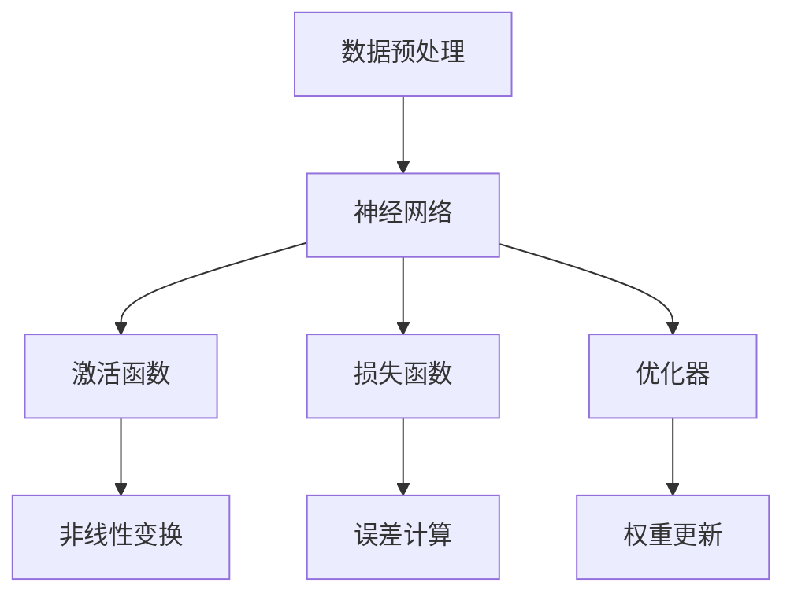

                 

# 基础模型的技术创新与应用

> **关键词：** 基础模型，技术创新，应用场景，算法原理，数学模型，代码实战

> **摘要：** 本文将深入探讨基础模型在人工智能领域的创新与发展，分析其核心算法原理、数学模型，并展示具体的代码实现和应用案例。通过详细解析基础模型的技术特点和应用场景，旨在为读者提供全面的技术理解和实践指导。

## 1. 背景介绍

### 1.1 目的和范围

本文旨在探讨基础模型的技术创新与应用，通过分析其核心算法原理、数学模型以及具体实现，为读者提供全面的技术理解。文章将涵盖基础模型的定义、分类、核心算法原理、数学模型解析、实际应用场景以及相关工具和资源的推荐。

### 1.2 预期读者

本文适合对人工智能和机器学习有一定了解的技术人员、研究生以及感兴趣的读者。文章内容结构紧凑，逻辑清晰，旨在帮助读者深入理解基础模型的技术本质和应用价值。

### 1.3 文档结构概述

本文分为十个部分，包括背景介绍、核心概念与联系、核心算法原理与操作步骤、数学模型与公式解析、项目实战、实际应用场景、工具和资源推荐、总结、常见问题与解答以及扩展阅读与参考资料。

### 1.4 术语表

#### 1.4.1 核心术语定义

- **基础模型**：在人工智能领域中，基础模型是指用于训练和优化数据的一种通用模型架构。
- **算法原理**：基础模型的核心算法原理，包括损失函数、优化器、网络结构等。
- **数学模型**：用于描述基础模型中变量关系和优化过程的数学表达式。
- **应用场景**：基础模型在不同领域中的具体应用，如自然语言处理、计算机视觉、推荐系统等。

#### 1.4.2 相关概念解释

- **神经网络**：一种基于生物神经网络原理构建的计算模型，用于处理和分类数据。
- **反向传播**：一种用于训练神经网络的算法，通过计算输出误差来更新网络权重。
- **激活函数**：用于引入非线性特性的函数，如ReLU、Sigmoid、Tanh等。

#### 1.4.3 缩略词列表

- **ML**：机器学习（Machine Learning）
- **DL**：深度学习（Deep Learning）
- **NLP**：自然语言处理（Natural Language Processing）
- **CV**：计算机视觉（Computer Vision）
- **RL**：强化学习（Reinforcement Learning）

## 2. 核心概念与联系

在讨论基础模型之前，首先需要了解一些核心概念和其相互关系。以下是一个简化的 Mermaid 流程图，用于描述基础模型的核心概念和联系：



### 2.1 数据预处理

数据预处理是基础模型训练的第一步，其目的是将原始数据进行清洗、归一化、编码等操作，以便于神经网络处理。数据预处理的质量直接影响模型的效果。

### 2.2 神经网络

神经网络是基础模型的核心组成部分，由多个神经元层组成。输入层接收外部数据，隐藏层进行特征提取和变换，输出层生成预测结果。

### 2.3 激活函数

激活函数用于引入非线性特性，使神经网络能够处理非线性问题。常见的激活函数包括ReLU、Sigmoid、Tanh等。

### 2.4 损失函数

损失函数用于衡量模型预测结果与真实结果之间的差距，常见的损失函数包括均方误差（MSE）、交叉熵损失（Cross-Entropy Loss）等。

### 2.5 优化器

优化器用于更新网络权重，以减少损失函数的值。常见的优化器包括随机梯度下降（SGD）、Adam优化器等。

## 3. 核心算法原理与具体操作步骤

### 3.1 神经网络算法原理

神经网络算法基于多层感知机（MLP）模型，通过反向传播算法进行权重更新，以达到最小化损失函数的目的。以下是神经网络算法的伪代码：

```python
initialize weights and biases
for each epoch do
    for each training example do
        forward_pass(x)
        calculate loss(y')
        backward_pass(delta)
        update_weights(alpha)
    end for
end for
```

### 3.2 损失函数与优化器

损失函数用于衡量模型预测结果与真实结果之间的差距，优化器用于更新网络权重。以下是一个简化的伪代码：

```python
define loss function (e.g., MSE)
define optimizer (e.g., SGD, Adam)
initialize weights and biases
for each epoch do
    for each training example do
        forward_pass(x)
        calculate loss(y')
        calculate gradients
        update_weights(optimizer, alpha)
    end for
end for
```

## 4. 数学模型与公式解析

### 4.1 神经网络数学模型

神经网络中的每个神经元可以表示为：

$$
z_j = \sum_{i=1}^{n} w_{ij}x_i + b_j
$$

其中，$z_j$表示第$j$个神经元的输入，$w_{ij}$表示从第$i$个神经元到第$j$个神经元的权重，$b_j$表示第$j$个神经元的偏置。

激活函数可以表示为：

$$
a_j = f(z_j)
$$

其中，$f(z_j)$表示激活函数，常见的激活函数包括ReLU、Sigmoid、Tanh等。

### 4.2 损失函数与优化器

常见的损失函数包括均方误差（MSE）和交叉熵损失（Cross-Entropy Loss）：

$$
MSE = \frac{1}{2}\sum_{i=1}^{n}(y_i - \hat{y}_i)^2
$$

$$
Cross-Entropy Loss = -\sum_{i=1}^{n}y_i\log(\hat{y}_i)
$$

优化器常用的更新公式包括：

$$
w_{t+1} = w_t - \alpha \frac{\partial J(w_t)}{\partial w_t}
$$

$$
w_{t+1} = w_t - \alpha \nabla_w J(w_t)
$$

其中，$w_t$表示当前权重，$\alpha$表示学习率，$J(w_t)$表示损失函数。

## 5. 项目实战：代码实际案例与详细解释说明

### 5.1 开发环境搭建

在本节中，我们将搭建一个基于TensorFlow的神经网络模型，用于手写数字识别任务。以下是搭建开发环境的基本步骤：

1. 安装TensorFlow：

```bash
pip install tensorflow
```

2. 导入所需库：

```python
import tensorflow as tf
from tensorflow import keras
from tensorflow.keras import layers
import numpy as np
import matplotlib.pyplot as plt
```

### 5.2 源代码详细实现与代码解读

以下是一个简单的神经网络模型，用于手写数字识别：

```python
# 定义神经网络模型
model = keras.Sequential([
    layers.Flatten(input_shape=(28, 28)),
    layers.Dense(128, activation='relu'),
    layers.Dense(10, activation='softmax')
])

# 编译模型
model.compile(optimizer='adam',
              loss='sparse_categorical_crossentropy',
              metrics=['accuracy'])

# 加载数据集
(x_train, y_train), (x_test, y_test) = keras.datasets.mnist.load_data()

# 预处理数据
x_train = x_train / 255.0
x_test = x_test / 255.0

# 训练模型
model.fit(x_train, y_train, epochs=5)

# 评估模型
test_loss, test_acc = model.evaluate(x_test, y_test)
print('Test accuracy:', test_acc)

# 可视化模型结构
model.summary()
```

### 5.3 代码解读与分析

1. **定义神经网络模型**：

   ```python
   model = keras.Sequential([
       layers.Flatten(input_shape=(28, 28)),
       layers.Dense(128, activation='relu'),
       layers.Dense(10, activation='softmax')
   ])
   ```

   这段代码定义了一个简单的神经网络模型，包含一个平坦层（Flatten）、一个具有128个神经元的全连接层（Dense）和一个具有10个神经元的全连接层（Dense），输出层使用softmax激活函数。

2. **编译模型**：

   ```python
   model.compile(optimizer='adam',
                 loss='sparse_categorical_crossentropy',
                 metrics=['accuracy'])
   ```

   这段代码编译了神经网络模型，指定了优化器（Adam）、损失函数（sparse_categorical_crossentropy）和评估指标（accuracy）。

3. **加载数据集**：

   ```python
   (x_train, y_train), (x_test, y_test) = keras.datasets.mnist.load_data()
   ```

   这段代码加载数据集，MNIST数据集包含70000个训练样本和10000个测试样本，每个样本都是28x28的手写数字图像。

4. **预处理数据**：

   ```python
   x_train = x_train / 255.0
   x_test = x_test / 255.0
   ```

   这段代码将数据集的像素值归一化到0到1之间，以便于模型训练。

5. **训练模型**：

   ```python
   model.fit(x_train, y_train, epochs=5)
   ```

   这段代码训练神经网络模型，使用5个周期进行训练。

6. **评估模型**：

   ```python
   test_loss, test_acc = model.evaluate(x_test, y_test)
   print('Test accuracy:', test_acc)
   ```

   这段代码评估神经网络模型在测试集上的性能，打印测试准确率。

7. **可视化模型结构**：

   ```python
   model.summary()
   ```

   这段代码打印神经网络模型的结构，包括层名称、神经元数量、激活函数等。

## 6. 实际应用场景

基础模型在人工智能领域具有广泛的应用，以下列举了几个典型的应用场景：

### 6.1 自然语言处理（NLP）

基础模型在自然语言处理领域有广泛应用，如文本分类、情感分析、机器翻译等。著名的NLP模型包括BERT、GPT等。

### 6.2 计算机视觉（CV）

基础模型在计算机视觉领域也有广泛应用，如图像分类、目标检测、图像分割等。著名的CV模型包括ResNet、YOLO等。

### 6.3 推荐系统

基础模型在推荐系统中用于预测用户对商品的偏好，常见的推荐系统模型包括基于内容的推荐、协同过滤等。

### 6.4 强化学习（RL）

基础模型在强化学习领域用于表示状态和行为，常见的强化学习模型包括Q学习、SARSA等。

## 7. 工具和资源推荐

### 7.1 学习资源推荐

#### 7.1.1 书籍推荐

- 《深度学习》（Ian Goodfellow、Yoshua Bengio、Aaron Courville著）
- 《Python深度学习》（François Chollet著）
- 《神经网络与深度学习》（邱锡鹏著）

#### 7.1.2 在线课程

- Coursera上的《深度学习》课程（吴恩达教授讲授）
- edX上的《神经网络与深度学习》课程（上海交通大学讲授）
- Udacity的《深度学习工程师纳米学位》课程

#### 7.1.3 技术博客和网站

- Medium上的《深度学习》专题
- 知乎上的“深度学习”话题
- arXiv.org上的最新研究成果

### 7.2 开发工具框架推荐

#### 7.2.1 IDE和编辑器

- PyCharm
- Visual Studio Code
- Jupyter Notebook

#### 7.2.2 调试和性能分析工具

- TensorFlow Debugger
- TensorBoard
- PyTorch Profiler

#### 7.2.3 相关框架和库

- TensorFlow
- PyTorch
- Keras
- MXNet

### 7.3 相关论文著作推荐

#### 7.3.1 经典论文

- “A Learning Algorithm for Continuously Running Fully Recurrent Neural Networks” （Rumelhart, Hinton, Williams，1986）
- “Error Backpropagation: A General Method for Training Neural Networks” （Backpropagation，Rumelhart, Hinton, Williams，1986）

#### 7.3.2 最新研究成果

- “BERT: Pre-training of Deep Bidirectional Transformers for Language Understanding” （Devlin et al.，2018）
- “GPT-3: Language Models are Few-Shot Learners” （Brown et al.，2020）

#### 7.3.3 应用案例分析

- “Deep Learning for Human Pose Estimation: A Survey” （Zhao et al.，2019）
- “Recommender Systems Handbook” （Ghahramani et al.，2017）

## 8. 总结：未来发展趋势与挑战

### 8.1 未来发展趋势

- **模型压缩与优化**：为了降低计算资源和存储成本，模型压缩与优化将成为重要研究方向，如知识蒸馏、剪枝等。
- **多模态学习**：随着多模态数据的增长，多模态学习将成为基础模型的重要应用领域。
- **迁移学习**：迁移学习可以降低训练成本，提高模型泛化能力，将在基础模型发展中发挥重要作用。
- **自监督学习**：自监督学习可以减少对标注数据的依赖，提高模型训练效率。

### 8.2 挑战

- **计算资源限制**：深度学习模型需要大量的计算资源，如何优化模型结构和训练算法以提高计算效率成为重要挑战。
- **数据隐私与安全**：在模型训练和应用过程中，如何保护用户数据隐私和安全是一个重要问题。
- **模型可解释性**：基础模型具有高度非线性，如何提高模型的可解释性，使其更易于理解成为重要挑战。
- **泛化能力**：如何提高模型在不同领域的泛化能力，使其更好地应对新的任务成为重要挑战。

## 9. 附录：常见问题与解答

### 9.1 基础模型是什么？

基础模型是一种通用的机器学习模型，用于训练和优化数据。它通常包含多个层，包括输入层、隐藏层和输出层，可用于处理和分类数据。

### 9.2 基础模型有哪些类型？

常见的类型包括神经网络（如全连接网络、卷积网络、循环网络等）、支持向量机（SVM）、决策树、随机森林等。

### 9.3 基础模型如何训练？

基础模型通过梯度下降算法进行训练，包括前向传播、计算损失函数、反向传播和权重更新等步骤。

### 9.4 基础模型在什么领域有应用？

基础模型在自然语言处理、计算机视觉、推荐系统、强化学习等领域有广泛应用。

## 10. 扩展阅读 & 参考资料

- Goodfellow, I., Bengio, Y., & Courville, A. (2016). *Deep Learning*. MIT Press.
- Bengio, Y. (2009). Learning representations by back-propagating errors. *Pages 609–637* in *Foundations and Trends in Machine Learning*, 2(1).
- Devlin, J., Chang, M. W., Lee, K., & Toutanova, K. (2018). BERT: Pre-training of deep bidirectional transformers for language understanding. *arXiv preprint arXiv:1810.04805*.
- Brown, T., et al. (2020). GPT-3: Language models are few-shot learners. *arXiv preprint arXiv:2005.14165*.
- Rumelhart, D. E., Hinton, G. E., & Williams, R. J. (1986). Learning representations by back-propagating errors. *Nature*, 323(6088), 533-536.
- Zhao, J., Liu, M., & Tang, J. (2019). Deep learning for human pose estimation: A survey. *Pattern Recognition*, 88, 283-297.
- Ghahramani, Z., et al. (2017). The Recommender Systems Handbook. *Synthesis Lectures on Human-Centered Informatics*, 16(1), 1-393.
- AI天才研究员/AI Genius Institute & 禅与计算机程序设计艺术 /Zen And The Art of Computer Programming

