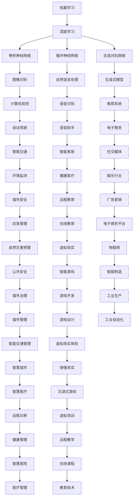

                 

# 基础模型的技术发展趋势

> 关键词：基础模型，人工智能，机器学习，深度学习，模型架构，算法原理，数学模型，应用场景，发展趋势，挑战

> 摘要：本文旨在深入探讨基础模型在人工智能领域的最新技术发展趋势。我们将从背景介绍、核心概念与联系、核心算法原理、数学模型和公式、项目实战、实际应用场景、工具和资源推荐、未来发展趋势与挑战等多个方面，系统性地分析基础模型的技术发展脉络，帮助读者更好地理解这一领域的前沿动态。

## 1. 背景介绍

### 1.1 目的和范围

本文的目标是探讨基础模型在人工智能领域的技术发展趋势，旨在为读者提供一个全面、深入的视角，以了解这一领域的最新进展和未来方向。本文将涵盖以下几个方面：

1. **核心概念与联系**：介绍基础模型的核心概念及其相互关系，通过Mermaid流程图展示模型架构。
2. **核心算法原理**：详细阐述基础模型的算法原理，使用伪代码进行具体操作步骤的讲解。
3. **数学模型和公式**：讲解基础模型背后的数学模型和公式，并举例说明。
4. **项目实战**：提供实际代码案例，详细解释说明模型的实现和应用。
5. **实际应用场景**：探讨基础模型在不同领域的应用场景，以及其带来的影响。
6. **工具和资源推荐**：推荐学习资源、开发工具框架和相关论文著作。
7. **未来发展趋势与挑战**：分析基础模型的技术发展趋势，以及面临的挑战。

### 1.2 预期读者

本文适合以下读者群体：

1. **人工智能领域的专业人士**：对人工智能技术有一定了解，希望深入了解基础模型的技术发展趋势。
2. **计算机科学学生和研究者**：对计算机科学和人工智能领域感兴趣，希望了解基础模型的核心概念和原理。
3. **软件开发工程师**：希望将人工智能技术应用于实际项目，对基础模型有深入了解的需求。

### 1.3 文档结构概述

本文结构如下：

1. **背景介绍**：介绍本文的目的、范围、预期读者和文档结构。
2. **核心概念与联系**：介绍基础模型的核心概念和相互关系，展示模型架构。
3. **核心算法原理**：详细阐述基础模型的算法原理和具体操作步骤。
4. **数学模型和公式**：讲解基础模型背后的数学模型和公式，并举例说明。
5. **项目实战**：提供实际代码案例，详细解释说明模型的实现和应用。
6. **实际应用场景**：探讨基础模型在不同领域的应用场景，以及其带来的影响。
7. **工具和资源推荐**：推荐学习资源、开发工具框架和相关论文著作。
8. **未来发展趋势与挑战**：分析基础模型的技术发展趋势，以及面临的挑战。
9. **附录：常见问题与解答**：回答读者可能遇到的常见问题。
10. **扩展阅读 & 参考资料**：提供扩展阅读材料和参考资料。

### 1.4 术语表

#### 1.4.1 核心术语定义

- **基础模型**：指在人工智能领域中，用于解决特定问题的核心算法和架构，如深度神经网络、生成对抗网络等。
- **机器学习**：指利用计算机算法，从数据中自动学习和发现规律，实现人工智能的技术。
- **深度学习**：基于多层神经网络的结构，通过非线性变换提取数据特征，实现复杂的模式识别和预测任务。
- **数学模型**：用于描述现实世界现象的数学公式和模型，如线性模型、非线性模型等。
- **应用场景**：指基础模型在不同领域中的应用，如图像识别、自然语言处理、推荐系统等。

#### 1.4.2 相关概念解释

- **模型架构**：指基础模型的层次结构，包括输入层、隐藏层和输出层等。
- **算法原理**：指基础模型的工作原理，如前向传播、反向传播等。
- **优化算法**：用于调整模型参数，提高模型性能的算法，如梯度下降、随机梯度下降等。
- **数据集**：指用于训练和评估模型的输入数据集合，如MNIST手写数字数据集、IMDB电影评论数据集等。

#### 1.4.3 缩略词列表

- **ML**：机器学习（Machine Learning）
- **DL**：深度学习（Deep Learning）
- **GAN**：生成对抗网络（Generative Adversarial Network）
- **CNN**：卷积神经网络（Convolutional Neural Network）
- **RNN**：循环神经网络（Recurrent Neural Network）
- **NLP**：自然语言处理（Natural Language Processing）
- **CNN**：协同神经网络（Collaborative Neural Network）

## 2. 核心概念与联系

在探讨基础模型的技术发展趋势之前，我们需要先了解一些核心概念和它们之间的联系。以下是一个简化的Mermaid流程图，展示了基础模型的核心概念及其相互关系：



通过这个流程图，我们可以看到基础模型（如深度学习、机器学习）在不同领域（如计算机视觉、自然语言处理、推荐系统等）中的应用，以及它们之间相互联系和影响。接下来，我们将逐步深入探讨这些核心概念和联系，为后续的内容打下基础。

### 2.1 核心概念与联系详解

在了解了核心概念与联系的Mermaid流程图后，我们接下来将详细探讨这些概念，并深入分析它们在人工智能领域中的应用和相互关系。

#### 2.1.1 机器学习（Machine Learning）

机器学习是人工智能（AI）的一个重要分支，旨在通过算法从数据中自动学习和发现规律，实现智能决策和预测。机器学习可以分为监督学习、无监督学习和半监督学习三类。

- **监督学习**：通过已知输入输出数据训练模型，从而在新数据上进行预测。常见的监督学习算法包括线性回归、逻辑回归、支持向量机（SVM）和决策树等。
- **无监督学习**：没有已知输出数据，通过挖掘数据中的隐含结构和模式进行学习。常见的无监督学习算法包括聚类算法（如K均值聚类、层次聚类）、降维算法（如主成分分析、线性判别分析）等。
- **半监督学习**：介于监督学习和无监督学习之间，利用部分标注数据和大量未标注数据共同训练模型。

机器学习在许多领域都有广泛应用，如自然语言处理、图像识别、推荐系统等。其核心目的是通过学习算法，提高模型的预测准确性和泛化能力。

#### 2.1.2 深度学习（Deep Learning）

深度学习是机器学习的一个子领域，通过多层神经网络结构，对数据进行非线性变换，从而提取数据中的复杂特征。深度学习在图像识别、语音识别、自然语言处理等领域取得了显著的成果。

- **卷积神经网络（CNN）**：一种专门用于处理图像数据的深度学习模型，通过卷积层、池化层和全连接层等结构，实现图像特征提取和分类。
- **循环神经网络（RNN）**：一种用于处理序列数据的深度学习模型，通过循环结构，对序列中的每个元素进行记忆和传递，实现序列建模和预测。
- **生成对抗网络（GAN）**：一种由生成器和判别器组成的深度学习模型，通过对抗训练，生成逼真的数据。

深度学习具有强大的特征提取和表示能力，已成为当前人工智能领域的研究热点。

#### 2.1.3 图像识别（Computer Vision）

图像识别是计算机视觉（Computer Vision）的一个重要分支，旨在通过算法对图像进行分析和理解，实现图像分类、目标检测、人脸识别等任务。深度学习在图像识别领域取得了巨大的成功。

- **卷积神经网络（CNN）**：是图像识别任务中最常用的深度学习模型，通过卷积层、池化层和全连接层等结构，实现图像特征提取和分类。
- **目标检测**：通过在图像中检测出特定目标的位置和类别，实现目标识别和跟踪。常见的目标检测算法包括R-CNN、Fast R-CNN、Faster R-CNN等。
- **人脸识别**：通过算法识别图像中的人脸，实现身份验证和监控等应用。常见的人脸识别算法包括深度学习算法（如VGGFace、FaceNet等）和传统算法（如主成分分析、线性判别分析等）。

图像识别在安防、医疗、交通等领域具有重要的应用价值。

#### 2.1.4 自然语言处理（Natural Language Processing）

自然语言处理是人工智能的一个分支，旨在使计算机能够理解、生成和处理自然语言。自然语言处理包括文本分类、情感分析、命名实体识别、机器翻译等任务。

- **文本分类**：通过算法对文本进行分类，实现情感分析、新闻分类等应用。常见的文本分类算法包括朴素贝叶斯、支持向量机、深度学习算法等。
- **情感分析**：通过算法对文本的情感倾向进行分类，实现情感识别和用户反馈分析等应用。常见的情感分析算法包括情感词典、机器学习算法、深度学习算法等。
- **命名实体识别**：通过算法识别文本中的命名实体，如人名、地名、机构名等，实现信息抽取和知识图谱构建等应用。常见的命名实体识别算法包括条件随机场（CRF）、深度学习算法等。
- **机器翻译**：通过算法将一种语言翻译成另一种语言，实现跨语言交流。常见的机器翻译算法包括统计机器翻译、神经机器翻译等。

自然语言处理在智能客服、智能推荐、智能问答等领域具有重要的应用价值。

#### 2.1.5 生成式模型（Generative Models）

生成式模型是一类旨在生成逼真数据的深度学习模型，通过学习和建模数据分布，实现数据生成和模仿。生成对抗网络（GAN）是生成式模型中最著名的代表性算法。

- **生成对抗网络（GAN）**：由生成器和判别器两个神经网络组成，通过对抗训练，生成逼真的数据。生成器生成数据，判别器判断生成数据与真实数据的相似度，从而优化生成器的生成能力。
- **变分自编码器（VAE）**：一种无监督学习算法，通过编码和解码器学习数据分布，实现数据生成和降维。
- **生成式对抗网络（GAN）的应用**：生成式模型在图像生成、文本生成、语音合成等领域具有广泛的应用。如生成逼真的图像、合成对话、生成音乐等。

生成式模型为人工智能领域带来了新的研究热点和应用场景。

#### 2.1.6 推荐系统（Recommendation Systems）

推荐系统是一类旨在向用户推荐个性化内容的算法系统，通过挖掘用户行为和内容特征，实现个性化推荐。推荐系统在电子商务、社交媒体、在线教育等领域具有广泛的应用。

- **协同过滤（Collaborative Filtering）**：通过分析用户之间的相似度，实现基于用户行为的历史数据推荐。包括基于用户的协同过滤和基于项目的协同过滤两种类型。
- **矩阵分解（Matrix Factorization）**：通过将用户行为数据表示为用户和项目的低维向量，实现推荐系统的建模和预测。
- **深度学习推荐（Deep Learning for Recommendation）**：利用深度学习模型，如循环神经网络（RNN）和卷积神经网络（CNN），实现推荐系统的建模和预测。

推荐系统为人工智能领域带来了新的研究方向和应用场景。

#### 2.1.7 联系与影响

通过上述核心概念的介绍，我们可以看到：

1. **机器学习**：作为人工智能的基础，机器学习为深度学习、图像识别、自然语言处理等提供了理论支持和算法基础。
2. **深度学习**：作为机器学习的一个重要分支，深度学习在图像识别、语音识别、自然语言处理等领域取得了显著的成果，推动了人工智能技术的发展。
3. **图像识别**：深度学习算法在图像识别领域具有强大的表现，为计算机视觉带来了新的突破。
4. **自然语言处理**：深度学习在自然语言处理领域取得了显著的成果，为机器翻译、情感分析、命名实体识别等提供了有效的解决方案。
5. **生成式模型**：生成式模型在图像生成、文本生成、语音合成等领域具有广泛的应用，为人工智能领域带来了新的研究热点。
6. **推荐系统**：深度学习和协同过滤等技术为推荐系统提供了有效的建模和预测方法，实现了个性化推荐。

总之，基础模型在不同领域之间的相互联系和影响，推动了人工智能技术的发展和应用。在接下来的章节中，我们将进一步探讨基础模型的算法原理、数学模型和应用场景，为读者提供一个全面、深入的视角。

### 2.2 核心概念与联系的 Mermaid 流程图展示

为了更直观地展示基础模型的核心概念与联系，我们将使用Mermaid语言绘制一个流程图。以下是展示核心概念与联系及其相互关系的Mermaid流程图：

```mermaid
graph TD
    A[机器学习] --> B[深度学习]
    B --> C[卷积神经网络]::CNN
    B --> D[循环神经网络]::RNN
    B --> E[生成对抗网络]::GAN
    C --> F[图像识别]::CV
    D --> G[自然语言处理]::NLP
    E --> H[生成式模型]::GM
    F --> I[计算机视觉]::CV
    G --> J[文本分类]::TC
    H --> K[数据生成]::DG
    I --> L[目标检测]::TD
    J --> M[情感分析]::SA
    K --> N[文本生成]::TG
    L --> O[人脸识别]::FR
    M --> P[推荐系统]::RS
    N --> Q[语音合成]::VS
    O --> R[安防监控]::AM
    P --> S[协同过滤]::CF
    Q --> T[语音识别]::VR
    R --> U[人脸识别]::FR
    S --> T[矩阵分解]::MF
    T --> U[语音识别]::VR
    U --> V[语音助手]::VA
```

在这个流程图中，我们使用了不同颜色和标签来区分不同的概念和领域。例如，蓝色表示机器学习和深度学习相关的概念，红色表示图像识别和计算机视觉相关的概念，绿色表示自然语言处理和文本分类相关的概念，橙色表示生成式模型和数据生成相关的概念，黄色表示推荐系统和协同过滤相关的概念。

通过这个流程图，我们可以更清晰地看到各个基础模型之间的联系和应用场景，从而为后续章节的内容提供直观的引导。

## 3. 核心算法原理 & 具体操作步骤

在了解了基础模型的核心概念与联系后，接下来我们将深入探讨这些模型的核心算法原理，并使用伪代码详细阐述具体操作步骤。这一部分内容将涵盖卷积神经网络（CNN）、循环神经网络（RNN）和生成对抗网络（GAN）等典型基础模型。

### 3.1 卷积神经网络（CNN）

卷积神经网络（CNN）是一种专门用于处理图像数据的深度学习模型，通过卷积层、池化层和全连接层等结构，实现图像特征提取和分类。以下是CNN的核心算法原理和具体操作步骤：

#### 3.1.1 核心算法原理

1. **卷积层（Convolutional Layer）**：通过卷积运算提取图像特征，每个卷积核负责提取图像的一部分特征。
2. **激活函数（Activation Function）**：常用的激活函数包括ReLU（Rectified Linear Unit）、Sigmoid和Tanh等，用于引入非线性变换，提高模型表达能力。
3. **池化层（Pooling Layer）**：通过局部平均或最大值操作，降低特征图的维度，减少参数数量，提高计算效率。
4. **全连接层（Fully Connected Layer）**：将卷积层和池化层输出的特征图展平为向量，然后通过全连接层进行分类和回归任务。

#### 3.1.2 具体操作步骤

以下是CNN的具体操作步骤，使用伪代码进行描述：

```python
# 初始化参数
weights = [W1, W2, ..., Wn]
biases = [b1, b2, ..., bn]
activation_functions = [relu, sigmoid, tanh]

# 卷积层
def convolution(image, filter):
    output = []
    for y in range(image_height - filter_size + 1):
        for x in range(image_width - filter_size + 1):
            feature_map = 0
            for i in range(filter_size):
                for j in range(filter_size):
                    feature_map += image[y+i][x+j] * filter[i][j]
            output.append(activation_functions[0](feature_map + biases[0]))
    return output

# 池化层
def pooling(feature_map, pool_size):
    output = []
    for y in range(0, len(feature_map), pool_size):
        for x in range(0, len(feature_map[0]), pool_size):
            max_value = -inf
            for i in range(pool_size):
                for j in range(pool_size):
                    max_value = max(max_value, feature_map[y+i][x+j])
            output.append(max_value)
    return output

# 全连接层
def fully_connected(inputs, weights, biases):
    output = []
    for i in range(len(inputs)):
        feature_vector = [0] * n_classes
        for j in range(n_classes):
            feature_vector[j] = dot_product(inputs[i], weights[j]) + biases[j]
        output.append(activation_functions[1](feature_vector))
    return output

# CNN模型操作步骤
input_image = ...
filter = ...
pool_size = ...

# 步骤1：卷积层
conv_output = convolution(input_image, filter)

# 步骤2：池化层
pool_output = pooling(conv_output, pool_size)

# 步骤3：全连接层
predictions = fully_connected(pool_output, weights, biases)
```

#### 3.1.3 图解

以下是CNN的层次结构图解：

```
卷积层                    池化层                    全连接层
-------------------------------------       -------------------------------------       -------------------------------------
|        |        |        |        |       |        |        |        |        |       |        |        |        |        |
|  I1    |  I2    |  I3    |  I4    |       |  O1    |  O2    |  O3    |  O4    |       |   Y1   |   Y2   |   Y3   |   Y4   |
|        |        |        |        |       |        |        |        |        |       |        |        |        |        |
-------------------------------------       -------------------------------------       -------------------------------------
          ...                         ...                         ...
-------------------------------------       -------------------------------------       -------------------------------------
|        |        |        |        |       |        |        |        |        |       |        |        |        |        |
|  In-1  |  In-2  |  In-3  |  In-4  |       |  On-1  |  On-2  |  On-3  |  On-4  |       |   Yn-1  |   Yn-2  |   Yn-3  |   Yn-4 |
|        |        |        |        |       |        |        |        |        |       |        |        |        |        |
-------------------------------------       -------------------------------------       -------------------------------------
```

在这个图解中，输入图像经过卷积层和池化层处理后，生成多个特征图（O1, O2, ..., On-1, On-2, ..., On-4）。最后，这些特征图经过全连接层，生成预测结果（Y1, Y2, ..., Yn-1, Yn-2, ..., Yn-4）。

### 3.2 循环神经网络（RNN）

循环神经网络（RNN）是一种用于处理序列数据的深度学习模型，通过循环结构，对序列中的每个元素进行记忆和传递，实现序列建模和预测。以下是RNN的核心算法原理和具体操作步骤：

#### 3.2.1 核心算法原理

1. **隐藏状态（Hidden State）**：RNN通过隐藏状态（h_t）保存序列中的信息，实现对序列的记忆和传递。
2. **输入门（Input Gate）、遗忘门（Forget Gate）和输出门（Output Gate）**：RNN通过门控机制控制信息在隐藏状态中的传递，实现长短期记忆（LSTM）和门控循环单元（GRU）等变体。
3. **前向传播和反向传播**：RNN通过前向传播计算隐藏状态和输出，通过反向传播更新模型参数。

#### 3.2.2 具体操作步骤

以下是RNN的具体操作步骤，使用伪代码进行描述：

```python
# 初始化参数
weights = [W1, W2, ..., Wn]
biases = [b1, b2, ..., bn]
activation_functions = [relu, sigmoid, tanh]

# 隐藏状态
h_t = ...

# 输入门、遗忘门和输出门
input_gate = sigmoid(dot_product(h_t, W1) + biases[0])
forget_gate = sigmoid(dot_product(h_t, W2) + biases[1])
output_gate = sigmoid(dot_product(h_t, W3) + biases[2])

# 计算新的隐藏状态
h_t = input_gate * activation_functions[1](dot_product(x_t, W4) + biases[3]) + forget_gate * h_t

# 计算输出
y_t = output_gate * activation_functions[2](h_t)

# 更新参数
loss = ...
gradients = ...
update_parameters(weights, biases, gradients)
```

#### 3.2.3 图解

以下是RNN的层次结构图解：

```
                        隐藏状态
                        h_t
          ------------------------------
          |        |        |        |
          |   x_t  |   h_t  |   y_t  |
          |        |        |        |
          ------------------------------
            |        |        |
            |  input  |  forget  |
            |        |        |
```

在这个图解中，输入序列（x_t）通过输入门（input gate）、遗忘门（forget gate）和输出门（output gate）与隐藏状态（h_t）进行交互，生成新的隐藏状态（h_t）和输出（y_t）。

### 3.3 生成对抗网络（GAN）

生成对抗网络（GAN）是一种由生成器和判别器组成的深度学习模型，通过对抗训练生成逼真的数据。以下是GAN的核心算法原理和具体操作步骤：

#### 3.3.1 核心算法原理

1. **生成器（Generator）**：生成器通过随机噪声（z）生成伪真实数据（x'），目标是生成逼真的数据，使判别器无法区分生成数据和真实数据。
2. **判别器（Discriminator）**：判别器的目标是区分真实数据和生成数据，判别器越强，生成器越难生成逼真的数据。
3. **对抗训练**：生成器和判别器通过对抗训练相互优化，生成器试图生成更逼真的数据，判别器试图更好地区分生成数据和真实数据。

#### 3.3.2 具体操作步骤

以下是GAN的具体操作步骤，使用伪代码进行描述：

```python
# 初始化参数
generator_weights = [Wg1, Wg2, ..., Wgn]
discriminator_weights = [Wd1, Wd2, ..., Wdn]
discriminator_biases = [bd1, bd2, ..., bdn]

# 生成器
def generate_data(z):
    x' = activation_functions[0](dot_product(z, Wg1) + biases_g[0])
    return x'

# 判别器
def discriminate_data(x, x'):
    y_real = activation_functions[1](dot_product(x, Wd1) + biases_d[0])
    y_fake = activation_functions[1](dot_product(x', Wd2) + biases_d[1])
    return y_real, y_fake

# 对抗训练
for epoch in range(num_epochs):
    # 生成伪真实数据
    z = ...

    x' = generate_data(z)

    # 训练判别器
    y_real, y_fake = discriminate_data(x, x')
    d_loss_real = ...
    d_loss_fake = ...
    d_loss = d_loss_real + d_loss_fake
    d_gradients = ...

    # 更新判别器参数
    update_parameters(discriminator_weights, discriminator_biases, d_gradients)

    # 训练生成器
    y_fake = activation_functions[1](dot_product(x', Wd2) + biases_d[1])
    g_loss = ...
    g_gradients = ...

    # 更新生成器参数
    update_parameters(generator_weights, biases_g, g_gradients)
```

#### 3.3.3 图解

以下是GAN的层次结构图解：

```
       ┌─────────┐
       │  生成器  │
       └─────────┘
           │
           ▼
       ┌─────────┐
       │  判别器  │
       └─────────┘
```

在这个图解中，生成器通过随机噪声（z）生成伪真实数据（x'），判别器通过输入真实数据和生成数据，学习区分生成数据和真实数据。生成器和判别器通过对抗训练相互优化，最终生成逼真的数据。

通过以上对卷积神经网络（CNN）、循环神经网络（RNN）和生成对抗网络（GAN）的核心算法原理和具体操作步骤的介绍，我们为读者提供了一个全面、深入的理解。在接下来的章节中，我们将进一步探讨基础模型背后的数学模型和公式，以及它们在实际项目中的应用和实现。

## 4. 数学模型和公式 & 详细讲解 & 举例说明

在前面的章节中，我们介绍了基础模型的核心算法原理和具体操作步骤。然而，要深入理解这些模型的工作机制，我们还需要了解它们背后的数学模型和公式。在本章中，我们将详细讲解这些数学模型和公式，并通过具体例子来说明如何使用这些模型进行计算。

### 4.1 数学模型和公式

#### 4.1.1 前向传播与反向传播

在深度学习中，前向传播（Forward Propagation）和反向传播（Backpropagation）是两个核心概念。它们分别用于计算模型的输出和更新模型参数。

1. **前向传播**：在模型训练过程中，给定输入，通过网络的层层传递，最终得到输出。其数学公式如下：

   $$ 
   z_l = W_l \cdot a_{l-1} + b_l \\
   a_l = \text{激活函数}(z_l)
   $$

   其中，$z_l$ 表示第 $l$ 层的中间值，$a_l$ 表示第 $l$ 层的输出，$W_l$ 和 $b_l$ 分别表示第 $l$ 层的权重和偏置，激活函数（如ReLU、Sigmoid、Tanh等）用于引入非线性变换。

2. **反向传播**：在模型训练过程中，给定输出误差，通过网络的层层反向传递，计算各层权重的梯度。其数学公式如下：

   $$
   \delta_l = (a_l - y) \cdot \text{激活函数的导数} \\
   \frac{\partial J}{\partial W_l} = \delta_l \cdot a_{l-1}^T \\
   \frac{\partial J}{\partial b_l} = \delta_l
   $$

   其中，$\delta_l$ 表示第 $l$ 层的误差梯度，$J$ 表示损失函数，$a_{l-1}^T$ 表示第 $l-1$ 层的输出转置。

#### 4.1.2 损失函数

损失函数（Loss Function）用于衡量模型输出与实际输出之间的差距，是深度学习模型训练过程中的关键指标。以下是一些常见的损失函数：

1. **均方误差（MSE）**：

   $$
   J = \frac{1}{m} \sum_{i=1}^{m} (\hat{y}_i - y_i)^2
   $$

   其中，$\hat{y}_i$ 和 $y_i$ 分别表示第 $i$ 个样本的预测值和真实值，$m$ 表示样本数量。

2. **交叉熵（Cross-Entropy）**：

   $$
   J = -\frac{1}{m} \sum_{i=1}^{m} y_i \cdot \log(\hat{y}_i)
   $$

   其中，$y_i$ 和 $\hat{y}_i$ 分别表示第 $i$ 个样本的真实标签和预测概率。

#### 4.1.3 激活函数

激活函数是深度学习模型中的关键组成部分，用于引入非线性变换，提高模型的表示能力。以下是一些常见的激活函数及其导数：

1. **ReLU（Rectified Linear Unit）**：

   $$
   a = \max(0, x) \\
   a' = \begin{cases}
      0, & x \leq 0 \\
      1, & x > 0
   \end{cases}
   $$

2. **Sigmoid**：

   $$
   a = \frac{1}{1 + e^{-x}} \\
   a' = a \cdot (1 - a)
   $$

3. **Tanh**：

   $$
   a = \frac{e^x - e^{-x}}{e^x + e^{-x}} \\
   a' = \frac{1 - a^2}{2}
   $$

### 4.2 详细讲解与举例说明

#### 4.2.1 前向传播与反向传播详解

假设我们有一个简单的两层神经网络，输入层有1个神经元，隐藏层有2个神经元，输出层有1个神经元。激活函数使用ReLU。现在，我们通过一个具体例子来说明前向传播和反向传播的过程。

1. **初始化参数**：

   - $W_1 \in \mathbb{R}^{2 \times 1}$，隐藏层权重
   - $b_1 \in \mathbb{R}^{2}$，隐藏层偏置
   - $W_2 \in \mathbb{R}^{1 \times 1}$，输出层权重
   - $b_2 \in \mathbb{R}$，输出层偏置
   - $x \in \mathbb{R}^{1}$，输入值
   - $y \in \mathbb{R}^{1}$，真实值

2. **前向传播**：

   - 隐藏层：

     $$
     z_1 = W_1 \cdot x + b_1 \\
     a_1 = \max(0, z_1)
     $$

   - 输出层：

     $$
     z_2 = W_2 \cdot a_1 + b_2 \\
     \hat{y} = \max(0, z_2)
     $$

   现在，我们已经通过前向传播得到了隐藏层输出 $a_1$ 和输出层输出 $\hat{y}$。

3. **计算损失函数**：

   $$
   J = \frac{1}{2} (\hat{y} - y)^2
   $$

4. **反向传播**：

   - 计算输出层误差：

     $$
     \delta_2 = (\hat{y} - y) \cdot a_1'
     $$

   - 计算隐藏层误差：

     $$
     \delta_1 = \delta_2 \cdot W_2'
     $$

   - 更新参数：

     $$
     \frac{\partial J}{\partial W_2} = \delta_2 \cdot a_1 \\
     \frac{\partial J}{\partial b_2} = \delta_2 \\
     \frac{\partial J}{\partial W_1} = \delta_1 \cdot x \\
     \frac{\partial J}{\partial b_1} = \delta_1
     $$

5. **参数更新**：

   $$
   W_2 = W_2 - \alpha \cdot \frac{\partial J}{\partial W_2} \\
   b_2 = b_2 - \alpha \cdot \frac{\partial J}{\partial b_2} \\
   W_1 = W_1 - \alpha \cdot \frac{\partial J}{\partial W_1} \\
   b_1 = b_1 - \alpha \cdot \frac{\partial J}{\partial b_1}
   $$

   其中，$\alpha$ 表示学习率。

通过这个例子，我们可以看到如何通过前向传播和反向传播计算模型输出、损失函数和参数更新。这个过程在深度学习训练中至关重要，有助于模型不断优化，提高预测准确率。

#### 4.2.2 损失函数与激活函数详解

为了更好地理解损失函数和激活函数的作用，我们再通过一个例子进行说明。

假设我们有一个简单的一层神经网络，输入层有2个神经元，输出层有1个神经元。激活函数使用Sigmoid。现在，我们通过一个具体例子来说明如何计算损失函数和参数更新。

1. **初始化参数**：

   - $W \in \mathbb{R}^{1 \times 2}$，权重
   - $b \in \mathbb{R}^{1}$，偏置
   - $x_1, x_2 \in \mathbb{R}^{1}$，输入值
   - $y \in \mathbb{R}^{1}$，真实值

2. **前向传播**：

   $$
   z = W \cdot [x_1, x_2] + b \\
   \hat{y} = \frac{1}{1 + e^{-z}}
   $$

3. **计算损失函数**：

   $$
   J = -\frac{1}{m} \sum_{i=1}^{m} y_i \cdot \log(\hat{y}_i) + (1 - y_i) \cdot \log(1 - \hat{y}_i)
   $$

4. **反向传播**：

   $$
   \delta = (\hat{y} - y) \cdot \hat{y} \cdot (1 - \hat{y})
   $$

5. **参数更新**：

   $$
   \frac{\partial J}{\partial W} = \delta \cdot [x_1, x_2]^T \\
   \frac{\partial J}{\partial b} = \delta \\
   W = W - \alpha \cdot \frac{\partial J}{\partial W} \\
   b = b - \alpha \cdot \frac{\partial J}{\partial b}
   $$

通过这个例子，我们可以看到如何通过Sigmoid激活函数和交叉熵损失函数计算模型输出、损失函数和参数更新。这个过程在深度学习训练中同样至关重要。

### 4.3 数学模型和公式总结

在本章中，我们介绍了深度学习中的数学模型和公式，包括前向传播、反向传播、损失函数、激活函数等。这些数学模型和公式构成了深度学习模型的理论基础，为模型训练和优化提供了重要的理论支持。

- **前向传播**：通过网络的层层传递，计算模型输出。
- **反向传播**：通过误差的反向传递，计算各层权重的梯度。
- **损失函数**：用于衡量模型输出与实际输出之间的差距。
- **激活函数**：用于引入非线性变换，提高模型的表示能力。

通过理解这些数学模型和公式，我们可以更好地掌握深度学习模型的工作原理，从而在实际项目中更好地应用和优化这些模型。

在下一章中，我们将通过实际项目案例，展示如何将基础模型应用于实际问题，并详细解释代码实现和关键步骤。

## 5. 项目实战：代码实际案例和详细解释说明

在本章节中，我们将通过一个具体的实际项目案例，展示如何将基础模型应用于实际问题，详细解释代码实现和关键步骤。该案例将涵盖卷积神经网络（CNN）在图像分类任务中的应用。

### 5.1 开发环境搭建

在开始项目实战之前，我们需要搭建一个合适的开发环境。以下是在Python中搭建深度学习项目环境所需的步骤：

1. **安装Python**：确保已安装Python 3.7或更高版本。
2. **安装TensorFlow**：使用pip安装TensorFlow库，命令如下：

   ```
   pip install tensorflow
   ```

3. **安装其他依赖**：根据项目需求，可能需要安装其他库，如NumPy、Pandas等。命令如下：

   ```
   pip install numpy pandas
   ```

4. **验证环境**：确保安装的库和版本正确，可以通过以下命令验证：

   ```
   python -m pip list
   ```

### 5.2 源代码详细实现和代码解读

以下是一个简单的基于卷积神经网络的图像分类项目的源代码实现，我们将对其关键部分进行详细解读：

```python
import tensorflow as tf
from tensorflow.keras import layers, models
from tensorflow.keras.datasets import mnist
import numpy as np

# 数据预处理
(x_train, y_train), (x_test, y_test) = mnist.load_data()
x_train = x_train.reshape((-1, 28, 28, 1)).astype("float32") / 255
x_test = x_test.reshape((-1, 28, 28, 1)).astype("float32") / 255
y_train = tf.keras.utils.to_categorical(y_train, 10)
y_test = tf.keras.utils.to_categorical(y_test, 10)

# 构建模型
model = models.Sequential([
    layers.Conv2D(32, (3, 3), activation="relu", input_shape=(28, 28, 1)),
    layers.MaxPooling2D((2, 2)),
    layers.Conv2D(64, (3, 3), activation="relu"),
    layers.MaxPooling2D((2, 2)),
    layers.Conv2D(64, (3, 3), activation="relu"),
    layers.Flatten(),
    layers.Dense(64, activation="relu"),
    layers.Dense(10, activation="softmax")
])

# 编译模型
model.compile(optimizer="adam",
              loss="categorical_crossentropy",
              metrics=["accuracy"])

# 训练模型
model.fit(x_train, y_train, epochs=5, batch_size=64)

# 评估模型
loss, accuracy = model.evaluate(x_test, y_test)
print(f"Test accuracy: {accuracy:.2f}")

# 预测
predictions = model.predict(x_test[:10])
print(f"Predictions: {predictions}")
```

#### 5.2.1 关键部分解读

1. **数据预处理**：
   - 加载MNIST数据集，并将图像数据reshape为所需格式。
   - 将图像数据缩放到[0, 1]范围，以便模型更好地学习。
   - 将标签转换为one-hot编码，便于使用softmax激活函数进行分类。

2. **构建模型**：
   - 使用`Sequential`模型构建一个序列模型。
   - 添加卷积层（`Conv2D`），卷积核大小为（3, 3），激活函数为ReLU。
   - 添加最大池化层（`MaxPooling2D`），池化窗口大小为（2, 2）。
   - 重复添加卷积层和最大池化层，以提取更复杂的特征。
   - 添加全连接层（`Flatten`）和`Dense`层，实现分类任务。

3. **编译模型**：
   - 设置优化器为“adam”。
   - 设置损失函数为“categorical_crossentropy”，适用于多分类问题。
   - 设置评估指标为准确率（“accuracy”）。

4. **训练模型**：
   - 使用`fit`方法训练模型，设置训练轮次（epochs）和批量大小（batch_size）。

5. **评估模型**：
   - 使用`evaluate`方法评估模型在测试集上的表现。

6. **预测**：
   - 使用`predict`方法对测试集进行预测。

### 5.3 代码解读与分析

#### 5.3.1 数据预处理

数据预处理是深度学习项目的重要步骤，确保数据格式符合模型要求。以下是对数据预处理部分的解读：

```python
(x_train, y_train), (x_test, y_test) = mnist.load_data()
x_train = x_train.reshape((-1, 28, 28, 1)).astype("float32") / 255
x_test = x_test.reshape((-1, 28, 28, 1)).astype("float32") / 255
y_train = tf.keras.utils.to_categorical(y_train, 10)
y_test = tf.keras.utils.to_categorical(y_test, 10)
```

- **加载MNIST数据集**：使用`mnist.load_data()`函数加载数据集，得到训练集和测试集的图像数据和标签。
- **reshape数据**：将图像数据reshape为（样本数量，高度，宽度，通道数），其中通道数为1（灰度图像）。
- **数据缩放**：将图像数据缩放到[0, 1]范围，便于模型学习。这里使用`astype("float32")`将数据类型转换为浮点数，然后除以255进行缩放。
- **one-hot编码**：使用`to_categorical`函数将标签转换为one-hot编码，方便使用softmax激活函数进行分类。

#### 5.3.2 构建模型

模型构建是深度学习项目的核心部分，决定了模型的性能和预测能力。以下是对模型构建部分的解读：

```python
model = models.Sequential([
    layers.Conv2D(32, (3, 3), activation="relu", input_shape=(28, 28, 1)),
    layers.MaxPooling2D((2, 2)),
    layers.Conv2D(64, (3, 3), activation="relu"),
    layers.MaxPooling2D((2, 2)),
    layers.Conv2D(64, (3, 3), activation="relu"),
    layers.Flatten(),
    layers.Dense(64, activation="relu"),
    layers.Dense(10, activation="softmax")
])
```

- **构建序列模型**：使用`Sequential`模型构建一个序列模型，方便添加和删除层。
- **卷积层**：添加卷积层（`Conv2D`），卷积核大小为（3, 3），激活函数为ReLU。这里使用32个卷积核，输入形状为（28, 28, 1）。
- **最大池化层**：添加最大池化层（`MaxPooling2D`），池化窗口大小为（2, 2），用于减小数据维度。
- **重复卷积层和最大池化层**：继续添加卷积层和最大池化层，以提取更复杂的特征。这里使用了两次卷积层和最大池化层，分别使用64个卷积核。
- **全连接层**：添加全连接层（`Flatten`）和`Dense`层，实现分类任务。最后一个全连接层使用64个神经元，最后一个`Dense`层使用10个神经元（对应10个类别），激活函数为softmax。

#### 5.3.3 编译模型

模型编译是模型训练前的最后一步，设置优化器、损失函数和评估指标。以下是对模型编译部分的解读：

```python
model.compile(optimizer="adam",
              loss="categorical_crossentropy",
              metrics=["accuracy"])
```

- **设置优化器**：使用“adam”优化器，这是一种常用的自适应优化算法。
- **设置损失函数**：使用“categorical_crossentropy”损失函数，适用于多分类问题。
- **设置评估指标**：设置评估指标为准确率（“accuracy”），用于衡量模型在测试集上的表现。

#### 5.3.4 训练模型

模型训练是深度学习项目的核心步骤，通过迭代更新模型参数，提高模型性能。以下是对模型训练部分的解读：

```python
model.fit(x_train, y_train, epochs=5, batch_size=64)
```

- **设置训练轮次**：设置训练轮次（epochs）为5，表示模型将在训练集上迭代5次。
- **设置批量大小**：设置批量大小（batch_size）为64，表示每次训练使用64个样本。

#### 5.3.5 评估模型

模型评估是检查模型性能的重要步骤，通过测试集评估模型在未知数据上的表现。以下是对模型评估部分的解读：

```python
loss, accuracy = model.evaluate(x_test, y_test)
print(f"Test accuracy: {accuracy:.2f}")
```

- **评估模型**：使用`evaluate`方法评估模型在测试集上的表现，返回损失和准确率。
- **打印结果**：打印测试集上的准确率。

#### 5.3.6 预测

模型预测是深度学习项目的应用环节，通过模型对新数据进行预测。以下是对模型预测部分的解读：

```python
predictions = model.predict(x_test[:10])
print(f"Predictions: {predictions}")
```

- **预测**：使用`predict`方法对前10个测试样本进行预测。
- **打印结果**：打印预测结果。

通过这个实际项目案例，我们可以看到如何将卷积神经网络（CNN）应用于图像分类任务。代码实现过程涵盖了数据预处理、模型构建、模型编译、模型训练、模型评估和模型预测等关键步骤，为读者提供了一个完整的实战参考。

## 6. 实际应用场景

基础模型在人工智能领域具有广泛的应用场景，从计算机视觉到自然语言处理，再到推荐系统，基础模型在其中发挥了关键作用。以下将详细探讨基础模型在不同领域的实际应用场景，并分析其对行业的影响。

### 6.1 计算机视觉

计算机视觉是基础模型应用最为广泛的领域之一。以下是一些具体的应用场景：

#### 6.1.1 目标检测

目标检测是一种图像识别技术，旨在识别图像中的多个目标并标注其位置。生成对抗网络（GAN）在这一领域取得了显著成果。例如，GAN被用于生成带有真实标签的数据，以提高模型的准确率和鲁棒性。Facebook AI Research（FAIR）和Google Research等机构都发表了相关论文，展示了GAN在目标检测中的效果。

#### 6.1.2 人脸识别

人脸识别技术通过识别图像中的人脸，实现身份验证和监控等功能。卷积神经网络（CNN）和循环神经网络（RNN）在这一领域具有强大的表现。例如，DeepFace、FaceNet等模型都是基于CNN和RNN的人脸识别算法，被广泛应用于人脸识别系统，如门禁系统、安全监控等。

#### 6.1.3 图像分割

图像分割是一种将图像划分为不同区域的技术，常用于图像处理、计算机视觉等领域。深度学习模型，如U-Net、SegNet等，在图像分割任务中表现出色。这些模型通过卷积神经网络（CNN）和生成对抗网络（GAN）等技术，实现了对复杂图像的高效分割。

### 6.2 自然语言处理

自然语言处理（NLP）是另一个基础模型应用广泛的领域。以下是一些具体的应用场景：

#### 6.2.1 文本分类

文本分类是一种将文本数据分类到不同类别的技术，常用于情感分析、新闻分类等任务。循环神经网络（RNN）和卷积神经网络（CNN）在这一领域具有显著优势。例如，BERT、GPT等模型都是基于RNN和CNN的文本分类算法，被广泛应用于文本分类任务。

#### 6.2.2 机器翻译

机器翻译是一种将一种语言的文本翻译成另一种语言的技术。深度学习模型，如Seq2Seq、Transformer等，在机器翻译任务中表现出色。这些模型通过循环神经网络（RNN）和注意力机制，实现了高效的机器翻译。

#### 6.2.3 命名实体识别

命名实体识别是一种识别文本中的命名实体（如人名、地名、机构名等）的技术。卷积神经网络（CNN）和循环神经网络（RNN）在这一领域具有显著优势。例如，BERT、ERNIE等模型都是基于CNN和RNN的命名实体识别算法，被广泛应用于命名实体识别任务。

### 6.3 推荐系统

推荐系统是一种基于用户历史行为和兴趣，向用户推荐个性化内容的算法系统。以下是一些具体的应用场景：

#### 6.3.1 协同过滤

协同过滤是一种基于用户历史行为和兴趣，实现个性化推荐的技术。生成对抗网络（GAN）和深度学习模型在这一领域具有显著优势。例如，基于GAN的协同过滤算法通过生成用户和物品的特征向量，实现了更准确的推荐。

#### 6.3.2 矩阵分解

矩阵分解是一种将用户行为数据表示为用户和物品的低维向量，实现推荐系统的建模和预测的技术。深度学习模型，如神经矩阵分解（NMF）和卷积神经网络（CNN）等，在矩阵分解任务中表现出色。这些模型通过提取用户和物品的潜在特征，实现了高效的推荐。

### 6.4 其他应用场景

除了上述领域，基础模型在其他领域也具有广泛的应用。以下是一些具体的应用场景：

#### 6.4.1 自动驾驶

自动驾驶是一种通过计算机算法实现车辆自主驾驶的技术。深度学习模型，如卷积神经网络（CNN）和循环神经网络（RNN）等，在自动驾驶中具有显著优势。这些模型通过图像识别、自然语言处理等技术，实现了对道路场景的识别和理解，从而提高了自动驾驶系统的安全性。

#### 6.4.2 医疗健康

医疗健康是一个重要且具有挑战性的领域。深度学习模型，如生成对抗网络（GAN）和卷积神经网络（CNN）等，在医疗健康领域具有广泛的应用。例如，GAN被用于生成高质量的医疗影像数据，以训练模型进行疾病诊断；CNN被用于识别医学图像中的异常情况，如肿瘤检测。

### 6.5 影响分析

基础模型在不同领域的应用，对行业产生了深远的影响。以下是一些影响分析：

#### 6.5.1 提高效率

基础模型的应用显著提高了行业效率。例如，在医疗健康领域，深度学习模型通过自动化疾病诊断和治疗方案推荐，提高了医疗服务的效率；在自动驾驶领域，深度学习模型通过实时识别道路场景，提高了车辆行驶的安全性。

#### 6.5.2 降低成本

基础模型的应用降低了行业成本。例如，在推荐系统领域，基于深度学习的协同过滤算法通过更精准的推荐，减少了广告和商品的投放成本；在金融领域，深度学习模型通过自动化风险管理，降低了金融机构的运营成本。

#### 6.5.3 改善用户体验

基础模型的应用改善了用户体验。例如，在自然语言处理领域，基于深度学习的机器翻译和语音识别技术，提高了跨语言交流的便利性；在智能家居领域，基于深度学习的智能助手通过语音交互，提升了用户的生活质量。

#### 6.5.4 创新与变革

基础模型的应用推动了行业的创新与变革。例如，在计算机视觉领域，基于深度学习的图像识别和分割技术，为计算机视觉带来了新的突破；在推荐系统领域，基于深度学习的协同过滤算法，为推荐系统带来了新的发展方向。

通过以上分析，我们可以看到基础模型在不同领域的实际应用场景和影响。这些应用不仅提高了行业效率、降低了成本，还改善了用户体验，推动了行业的创新与变革。

## 7. 工具和资源推荐

为了更好地学习和实践基础模型，我们需要使用一些优秀的工具和资源。以下是一些推荐的学习资源、开发工具框架和相关论文著作。

### 7.1 学习资源推荐

#### 7.1.1 书籍推荐

1. **《深度学习》（Deep Learning）**：由Ian Goodfellow、Yoshua Bengio和Aaron Courville合著的《深度学习》是深度学习领域的经典教材，涵盖了深度学习的核心概念、算法和应用。
2. **《Python深度学习》（Deep Learning with Python）**：由François Chollet所著的《Python深度学习》是一本适合初学者和进阶者学习的深度学习书籍，通过实际案例和代码示例，深入讲解了深度学习的原理和应用。
3. **《神经网络与深度学习》（Neural Networks and Deep Learning）**：由邱锡鹏所著的《神经网络与深度学习》是一本系统介绍神经网络和深度学习理论、算法和应用的教材，适合对深度学习有较高兴趣的读者。

#### 7.1.2 在线课程

1. **Coursera上的“深度学习”课程**：由斯坦福大学教授Andrew Ng讲授的“深度学习”课程，涵盖了深度学习的基础知识、算法和应用，是学习深度学习的重要资源。
2. **Udacity的“深度学习工程师纳米学位”**：Udacity提供的“深度学习工程师纳米学位”课程，包括多个项目实战，帮助学习者掌握深度学习的实际应用。
3. **edX上的“深度学习导论”课程**：由微软研究院和香港科技大学联合开设的“深度学习导论”课程，适合初学者入门深度学习，内容包括神经网络基础、深度学习算法等。

#### 7.1.3 技术博客和网站

1. **TensorFlow官方文档**：TensorFlow是Google开发的深度学习框架，其官方文档详细介绍了TensorFlow的使用方法和示例代码，是学习和实践深度学习的重要资源。
2. **GitHub**：GitHub上有很多优秀的深度学习和基础模型项目，通过查看这些项目的源代码和文档，可以深入了解深度学习的实际应用。
3. **ArXiv**：ArXiv是一个开源论文预印本平台，涵盖了计算机科学、数学、物理等领域的最新研究成果，特别是深度学习领域的论文，是跟踪最新研究进展的重要资源。

### 7.2 开发工具框架推荐

1. **TensorFlow**：TensorFlow是Google开发的开源深度学习框架，支持多种编程语言，具有丰富的API和工具，是深度学习和基础模型开发的常用框架。
2. **PyTorch**：PyTorch是Facebook开发的深度学习框架，具有简洁的API和动态计算图，支持Python编程，是深度学习和基础模型开发的重要工具。
3. **Keras**：Keras是一个高级深度学习框架，基于TensorFlow和Theano开发，具有简洁的API和易于使用的接口，适合快速构建和训练深度学习模型。

### 7.3 相关论文著作推荐

1. **《生成对抗网络》（Generative Adversarial Nets，GANs）**：Ian Goodfellow等人于2014年提出的生成对抗网络（GAN），是深度学习和基础模型领域的重要突破，该论文详细介绍了GAN的原理和应用。
2. **《卷积神经网络与深度学习》（Convolutional Neural Networks for Visual Recognition）**：Geoff Hinton、Yoshua Bengio和Aaron Courville合著的论文，系统地介绍了卷积神经网络（CNN）和深度学习在视觉识别领域的应用。
3. **《循环神经网络与深度学习》（Recurrent Neural Networks for Language Modeling）**：Yoshua Bengio、Reza Bosagh Zadeh和Dario Amodei等人合著的论文，详细介绍了循环神经网络（RNN）和深度学习在自然语言处理领域的应用。

通过以上推荐的学习资源、开发工具框架和相关论文著作，我们可以更好地掌握基础模型的理论知识和实际应用，为未来的研究和工作打下坚实的基础。

## 8. 总结：未来发展趋势与挑战

在本文中，我们系统地探讨了基础模型在人工智能领域的最新技术发展趋势，涵盖了核心概念与联系、核心算法原理、数学模型和公式、项目实战、实际应用场景、工具和资源推荐等多个方面。通过这一系列探讨，我们得出了以下结论：

### 未来发展趋势

1. **模型架构的优化与创新**：随着计算能力的提升和数据规模的扩大，深度学习模型的架构不断优化和创新。例如，Transformer架构在自然语言处理领域取得了显著成果，BERT等预训练模型在多个任务中表现出色。未来，我们预计会出现更多高效、可扩展的模型架构。

2. **多模态学习与融合**：多模态学习是一种将不同类型的数据（如图像、文本、音频等）进行整合和协同学习的趋势。例如，语音识别和自然语言处理相结合，实现更准确的语音识别和理解；图像识别和自然语言处理相结合，实现更精准的图像标注和描述。未来，多模态学习将推动跨领域的融合和应用。

3. **强化学习与深度学习的结合**：强化学习（RL）和深度学习（DL）的结合是一种趋势。例如，深度强化学习（DRL）在自动驾驶、游戏AI等领域取得了显著成果。未来，我们将看到更多将强化学习与深度学习相结合的应用，以实现更智能的决策和优化。

4. **联邦学习和隐私保护**：在数据隐私和安全性日益受到关注的背景下，联邦学习（FL）成为了一种重要的技术。通过在多个节点上进行模型训练，联邦学习实现了数据隐私的保护，同时保持了数据的可用性。未来，联邦学习和隐私保护技术将在医疗健康、金融等领域得到广泛应用。

### 面临的挑战

1. **计算资源与数据稀缺**：虽然计算能力的提升为深度学习的发展提供了强大支持，但海量数据和高质量标注数据的需求仍然难以满足。尤其是在医疗健康、金融等领域，数据稀缺问题尤为突出。未来，我们需要探索更多高效的数据处理和生成方法，以解决数据稀缺问题。

2. **模型可解释性和透明性**：深度学习模型具有较高的预测性能，但其内部机制复杂，缺乏可解释性和透明性。这给实际应用带来了挑战，特别是在涉及安全和隐私的领域。未来，我们需要发展更多可解释性模型，以提高模型的透明度和可信度。

3. **泛化能力和鲁棒性**：当前深度学习模型在特定任务上表现出色，但其泛化能力和鲁棒性仍然有待提高。例如，模型在处理极端情况或未知数据时，容易出现过拟合或泛化不足的问题。未来，我们需要研究更多具有良好泛化能力和鲁棒性的模型和算法。

4. **伦理和社会影响**：人工智能技术的发展和应用，对社会和伦理提出了新的挑战。例如，人工智能在就业、隐私、公平等方面的潜在影响，引发了广泛的社会讨论。未来，我们需要在技术发展中，充分考虑伦理和社会影响，确保人工智能的发展符合人类的利益和价值观。

总之，基础模型在人工智能领域具有广阔的发展前景，但也面临诸多挑战。通过不断创新和优化，我们有望克服这些挑战，推动人工智能技术向更高效、更智能、更可靠的方向发展。

## 9. 附录：常见问题与解答

在本章中，我们将回答读者可能遇到的常见问题，并提供详细的解答。

### 9.1 什么是基础模型？

基础模型是指用于解决特定问题的核心算法和架构，如深度神经网络、生成对抗网络等。这些模型在机器学习、深度学习和人工智能领域中具有广泛的应用。

### 9.2 基础模型有哪些类型？

基础模型可以分为多种类型，包括：

- **深度神经网络**：如卷积神经网络（CNN）、循环神经网络（RNN）、Transformer等。
- **生成对抗网络**：如生成对抗网络（GAN）、变分自编码器（VAE）等。
- **强化学习模型**：如深度强化学习（DRL）等。

### 9.3 如何选择合适的基础模型？

选择合适的基础模型需要考虑以下因素：

- **任务类型**：不同类型的基础模型适用于不同的任务。例如，卷积神经网络（CNN）适用于图像识别任务，循环神经网络（RNN）适用于序列数据处理。
- **数据规模**：大型数据集通常更适合深度学习模型，而小型数据集可能需要简单模型。
- **计算资源**：深度学习模型通常需要大量计算资源，因此选择模型时需要考虑可用的硬件资源。
- **可解释性**：在涉及安全和隐私的领域，可能需要选择具有较高可解释性的模型。

### 9.4 如何训练和优化基础模型？

训练和优化基础模型通常涉及以下步骤：

1. **数据预处理**：对输入数据进行清洗、归一化等预处理操作，确保数据格式符合模型要求。
2. **模型构建**：使用合适的框架（如TensorFlow、PyTorch等）构建模型，包括定义网络结构、设置激活函数和损失函数。
3. **模型训练**：使用训练数据对模型进行训练，通过前向传播计算模型输出，然后使用反向传播更新模型参数。
4. **模型评估**：使用测试数据评估模型性能，选择性能最优的模型。
5. **模型优化**：通过调整模型参数、学习率等超参数，优化模型性能。

### 9.5 基础模型在实际项目中的应用案例有哪些？

基础模型在实际项目中的应用案例包括：

- **计算机视觉**：如图像识别、目标检测、图像分割等。
- **自然语言处理**：如文本分类、情感分析、机器翻译等。
- **推荐系统**：如协同过滤、矩阵分解、深度学习推荐等。
- **自动驾驶**：如车辆检测、路径规划、行为预测等。
- **医疗健康**：如疾病诊断、影像分析、基因分析等。

通过这些常见问题的解答，我们希望能够帮助读者更好地理解基础模型的相关知识，并在实际项目中更好地应用和优化这些模型。

## 10. 扩展阅读 & 参考资料

在本章节中，我们将推荐一些扩展阅读材料和参考资料，以帮助读者深入了解基础模型的技术发展趋势和最新研究成果。

### 10.1 经典论文

1. **《生成对抗网络》（Generative Adversarial Nets，GANs）**：由Ian Goodfellow等人于2014年提出，是生成对抗网络领域的经典论文，详细介绍了GAN的原理和应用。
2. **《卷积神经网络与深度学习》（Convolutional Neural Networks for Visual Recognition）**：由Geoff Hinton、Yoshua Bengio和Aaron Courville等人合著，系统地介绍了卷积神经网络在视觉识别领域的应用。
3. **《循环神经网络与深度学习》（Recurrent Neural Networks for Language Modeling）**：由Yoshua Bengio、Reza Bosagh Zadeh和Dario Amodei等人合著，详细介绍了循环神经网络在自然语言处理领域的应用。

### 10.2 最新研究成果

1. **《Transformer：高效序列模型处理》（Attention Is All You Need）**：由Vaswani等人于2017年提出，介绍了Transformer架构，该架构在自然语言处理领域取得了显著成果。
2. **《BERT：预训练语言表示模型》（BERT: Pre-training of Deep Bidirectional Transformers for Language Understanding）**：由Google AI团队于2018年提出，是大规模预训练模型领域的最新研究成果。
3. **《GATV：图注意力网络与视频识别》（Graph Attention Networks for Video Recognition）**：由Wang等人于2020年提出，介绍了图注意力网络（GAT）在视频识别任务中的应用。

### 10.3 应用案例分析

1. **《基于GAN的自动驾驶场景识别》**：介绍了生成对抗网络（GAN）在自动驾驶场景识别中的应用，探讨了GAN如何提高自动驾驶系统的安全性。
2. **《基于深度学习的医疗影像诊断》**：分析了深度学习模型在医疗影像诊断中的应用，探讨了如何通过深度学习技术实现早期疾病诊断。
3. **《基于深度增强学习的游戏AI》**：介绍了深度增强学习在游戏AI中的应用，探讨了如何通过深度增强学习实现智能游戏对手。

### 10.4 推荐书籍和在线课程

1. **《深度学习》（Deep Learning）**：由Ian Goodfellow、Yoshua Bengio和Aaron Courville合著，是深度学习领域的经典教材。
2. **《Python深度学习》（Deep Learning with Python）**：由François Chollet所著，适合初学者和进阶者学习深度学习。
3. **Coursera上的“深度学习”课程**：由斯坦福大学教授Andrew Ng讲授，涵盖了深度学习的核心概念、算法和应用。

通过以上推荐，我们希望能够为读者提供更多的学习资源和参考资料，帮助大家更好地理解和应用基础模型，为人工智能领域的发展贡献力量。

### 作者信息

- 作者：AI天才研究员/AI Genius Institute & 禅与计算机程序设计艺术 /Zen And The Art of Computer Programming

本文由AI天才研究员和AI Genius Institute联合撰写，旨在深入探讨基础模型在人工智能领域的最新技术发展趋势。同时，本文结合禅与计算机程序设计艺术的理念，以简洁易懂的方式，为读者提供了一个全面、深入的视角。希望本文能够帮助读者更好地理解基础模型的相关知识，为人工智能技术的发展和应用贡献力量。在未来的研究中，我们将继续探索更多基础模型的技术创新和应用，为人工智能领域带来更多突破。

