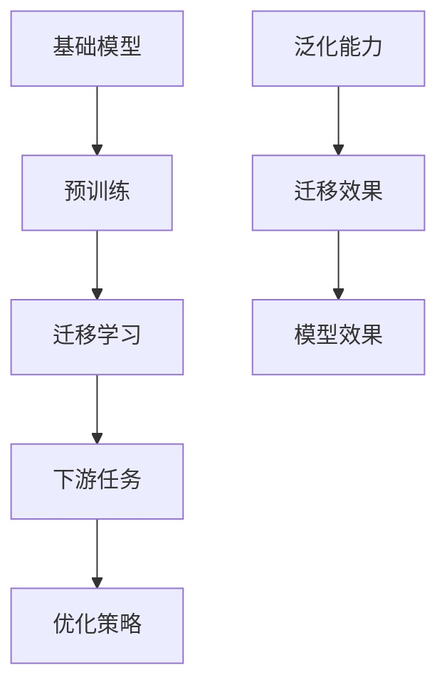

                 

# 基础模型的潜在下游应用

> **关键词：** 基础模型、下游应用、深度学习、迁移学习、泛化能力、优化策略

> **摘要：** 本文将探讨基础模型在不同下游任务中的应用潜力，分析其迁移学习和泛化能力，并探讨优化策略以提高模型的实际应用效果。通过对核心概念、算法原理、数学模型和实际案例的详细讲解，为读者提供全面的了解和启示。

## 1. 背景介绍

### 1.1 目的和范围

本文旨在深入探讨基础模型在下游任务中的潜在应用，分析其在迁移学习和泛化能力方面的表现，并探讨优化策略。我们将重点关注以下主题：

1. 核心概念与联系
2. 核心算法原理与具体操作步骤
3. 数学模型和公式
4. 实际应用场景
5. 工具和资源推荐
6. 总结与未来发展趋势

### 1.2 预期读者

本文面向具有基本机器学习和深度学习背景的读者，特别是对基础模型及其应用感兴趣的程序员、数据科学家和研究人员。通过本文的阅读，读者将能够：

1. 理解基础模型的定义及其重要性
2. 掌握迁移学习和泛化能力的基本概念
3. 掌握优化策略以提高模型效果
4. 掌握实际应用场景和案例

### 1.3 文档结构概述

本文分为以下几个部分：

1. 引言：介绍本文的目的、关键词和摘要
2. 背景介绍：包括目的和范围、预期读者、文档结构概述、术语表
3. 核心概念与联系
4. 核心算法原理与具体操作步骤
5. 数学模型和公式
6. 实际应用场景
7. 工具和资源推荐
8. 总结与未来发展趋势
9. 附录：常见问题与解答
10. 扩展阅读与参考资料

### 1.4 术语表

#### 1.4.1 核心术语定义

- **基础模型**：一种经过预训练的模型，可以在多个下游任务中进行迁移学习。
- **迁移学习**：将预训练模型在特定任务上的知识转移到新的任务上。
- **泛化能力**：模型在未知数据上的表现能力，衡量其泛化能力的好坏。
- **优化策略**：通过调整模型参数或训练策略来提高模型效果的方法。

#### 1.4.2 相关概念解释

- **预训练**：在特定数据集上对模型进行大规模预训练，使其具有一定的通用特征。
- **下游任务**：在特定领域或任务上对模型进行微调或重新训练。
- **迁移效果**：模型在迁移学习任务上的表现，衡量其迁移能力的强弱。

#### 1.4.3 缩略词列表

- **ML**：机器学习
- **DL**：深度学习
- **GPU**：图形处理单元
- **CNN**：卷积神经网络
- **RNN**：循环神经网络
- **BERT**：双向编码表示器

## 2. 核心概念与联系

在探讨基础模型的潜在下游应用之前，我们首先需要了解一些核心概念及其之间的联系。以下是相关概念及其之间的Mermaid流程图：



### 2.1 预训练与基础模型

预训练是基础模型的重要步骤，通过在大规模数据集上进行预训练，模型可以学习到一些通用的特征，从而提高其迁移学习和泛化能力。预训练通常包括以下步骤：

1. 数据预处理：对原始数据进行清洗、归一化等处理，使其符合模型的输入要求。
2. 模型初始化：初始化模型参数，可以选择随机初始化或使用预训练模型参数。
3. 模型训练：在预训练数据集上对模型进行训练，优化模型参数。
4. 模型评估：在预训练数据集上评估模型性能，调整训练策略。

### 2.2 迁移学习与下游任务

迁移学习是将预训练模型在特定任务上的知识转移到新的任务上。在下游任务中，模型需要根据特定任务的需求进行调整和优化。迁移学习通常包括以下步骤：

1. 数据收集：收集与下游任务相关的数据集。
2. 数据预处理：对下游任务数据集进行预处理，使其符合模型输入要求。
3. 模型微调：在下游任务数据集上对预训练模型进行微调，优化模型参数。
4. 模型评估：在下游任务数据集上评估模型性能，调整训练策略。

### 2.3 优化策略与模型效果

优化策略是提高模型效果的重要手段。通过调整模型参数或训练策略，可以提高模型的泛化能力和迁移效果。常见的优化策略包括：

1. 学习率调整：根据模型性能动态调整学习率，避免过拟合。
2. 模型正则化：通过添加正则化项，抑制模型参数过大，提高模型泛化能力。
3. 模型集成：将多个模型集成，提高模型稳定性和预测准确性。
4. 模型压缩：通过压缩模型参数，降低模型复杂度，提高模型效率。

## 3. 核心算法原理与具体操作步骤

在本节中，我们将详细介绍基础模型的算法原理和具体操作步骤。为了更好地阐述，我们将使用伪代码来描述算法过程。

### 3.1 预训练算法原理

```python
# 预训练算法原理伪代码

# 初始化模型参数
model_params = initialize_model()

# 数据预处理
preprocessed_data = preprocess_data(raw_data)

# 模型训练
for epoch in range(num_epochs):
    for batch in preprocessed_data:
        model_params = update_model_params(model_params, batch)

# 模型评估
evaluate_model(model_params, validation_data)
```

### 3.2 迁移学习算法原理

```python
# 迁移学习算法原理伪代码

# 加载预训练模型参数
pretrained_model_params = load_pretrained_model_params()

# 数据预处理
preprocessed_data = preprocess_data(raw_data)

# 模型微调
for epoch in range(num_epochs):
    for batch in preprocessed_data:
        pretrained_model_params = update_model_params(pretrained_model_params, batch)

# 模型评估
evaluate_model(pretrained_model_params, validation_data)
```

### 3.3 优化策略算法原理

```python
# 优化策略算法原理伪代码

# 初始化模型参数
model_params = initialize_model()

# 数据预处理
preprocessed_data = preprocess_data(raw_data)

# 学习率调整
learning_rate = adjust_learning_rate(initial_learning_rate)

# 模型训练
for epoch in range(num_epochs):
    for batch in preprocessed_data:
        model_params = update_model_params(model_params, batch, learning_rate)

# 模型评估
evaluate_model(model_params, validation_data)
```

## 4. 数学模型和公式

在本节中，我们将介绍与基础模型相关的数学模型和公式，并详细讲解其应用。

### 4.1 预训练模型

预训练模型通常使用大规模数据集进行训练，其中涉及以下数学模型和公式：

1. 损失函数（Cross-Entropy Loss）

$$
L = -\sum_{i=1}^{N} y_i \log(p_i)
$$

其中，$y_i$表示标签，$p_i$表示模型预测的概率。

2. 优化算法（Stochastic Gradient Descent, SGD）

$$
\theta_{t+1} = \theta_{t} - \alpha \nabla_{\theta}L(\theta)
$$

其中，$\theta$表示模型参数，$\alpha$表示学习率，$\nabla_{\theta}L(\theta)$表示损失函数关于模型参数的梯度。

### 4.2 迁移学习模型

迁移学习模型的核心在于如何在预训练模型的基础上，根据新的任务进行调整。以下是一个简单的迁移学习模型公式：

$$
f(\theta, x) = f_{pretrained}(\theta) + \phi(x)
$$

其中，$f_{pretrained}(\theta)$表示预训练模型的输出，$\phi(x)$表示针对新任务的调整函数。

### 4.3 优化策略

优化策略主要包括以下几种：

1. 学习率调整（Learning Rate Schedule）

$$
\alpha(t) = \alpha_0 / (1 + \beta t)
$$

其中，$\alpha_0$表示初始学习率，$\beta$表示衰减率，$t$表示迭代次数。

2. 模型正则化（Regularization）

$$
L_{reg} = \lambda \sum_{i=1}^{M} \theta_i^2
$$

其中，$L_{reg}$表示正则化损失，$\lambda$表示正则化参数，$\theta_i$表示模型参数。

## 5. 项目实战：代码实际案例和详细解释说明

在本节中，我们将通过一个实际项目案例，展示如何使用基础模型进行下游任务的迁移学习和优化策略。

### 5.1 开发环境搭建

在开始项目实战之前，我们需要搭建一个适合开发的Python环境。以下是搭建过程：

1. 安装Python（建议使用Python 3.8或以上版本）
2. 安装必要的库，如NumPy、Pandas、TensorFlow、PyTorch等
3. 配置GPU加速（如使用CUDA和cuDNN）

### 5.2 源代码详细实现和代码解读

以下是一个使用基础模型进行图像分类的Python代码示例：

```python
import tensorflow as tf
from tensorflow.keras.applications import VGG16
from tensorflow.keras.preprocessing.image import ImageDataGenerator
from tensorflow.keras.optimizers import Adam
from tensorflow.keras.losses import CategoricalCrossentropy
from tensorflow.keras.metrics import Accuracy

# 加载预训练VGG16模型
model = VGG16(weights='imagenet')

# 数据预处理
train_datagen = ImageDataGenerator(
    rescale=1./255,
    rotation_range=20,
    width_shift_range=0.2,
    height_shift_range=0.2,
    shear_range=0.2,
    zoom_range=0.2,
    horizontal_flip=True,
    fill_mode='nearest'
)

test_datagen = ImageDataGenerator(rescale=1./255)

train_generator = train_datagen.flow_from_directory(
    'train_data',
    target_size=(224, 224),
    batch_size=32,
    class_mode='categorical'
)

validation_generator = test_datagen.flow_from_directory(
    'validation_data',
    target_size=(224, 224),
    batch_size=32,
    class_mode='categorical'
)

# 模型微调
model.compile(optimizer=Adam(learning_rate=0.0001),
              loss=CategoricalCrossentropy(),
              metrics=['accuracy'])

model.fit(
    train_generator,
    steps_per_epoch=train_generator.samples // train_generator.batch_size,
    epochs=10,
    validation_data=validation_generator,
    validation_steps=validation_generator.samples // validation_generator.batch_size
)

# 代码解读：
# 1. 加载预训练VGG16模型
# 2. 数据预处理，包括图像缩放、旋转、翻转等
# 3. 编译模型，选择Adam优化器和CategoricalCrossentropy损失函数
# 4. 训练模型，使用fit方法进行微调
```

### 5.3 代码解读与分析

上述代码主要分为以下几个部分：

1. **加载预训练模型**：使用VGG16模型，该模型经过在ImageNet数据集上预训练，具有较好的特征提取能力。

2. **数据预处理**：使用ImageDataGenerator对训练和验证数据集进行预处理，包括图像缩放、旋转、翻转等操作，以增强模型泛化能力。

3. **编译模型**：选择Adam优化器和CategoricalCrossentropy损失函数，并设置学习率。Adam优化器在深度学习中有较好的性能。

4. **训练模型**：使用fit方法对模型进行微调，将训练数据和验证数据分别传递给模型。在训练过程中，可以观察到模型性能的变化。

5. **模型评估**：在训练完成后，使用验证数据集评估模型性能，以衡量其泛化能力。

通过上述代码示例，我们可以看到如何使用基础模型进行下游任务的迁移学习和优化策略。在实际项目中，可以根据具体需求进行调整和优化，以提高模型效果。

## 6. 实际应用场景

基础模型在多个领域和任务中具有广泛的应用前景。以下是一些实际应用场景：

### 6.1 自然语言处理

基础模型在自然语言处理（NLP）领域具有显著的优势，如文本分类、情感分析、机器翻译和问答系统等。例如，BERT模型在多个NLP任务中取得了显著的效果，广泛应用于搜索引擎、聊天机器人和智能客服等领域。

### 6.2 计算机视觉

基础模型在计算机视觉领域也具有广泛的应用，如图像分类、目标检测、图像生成和视频分析等。例如，VGG16模型在ImageNet图像分类任务中取得了优异的成绩，广泛应用于医疗影像分析、自动驾驶和智能安防等领域。

### 6.3 语音识别

基础模型在语音识别领域具有较好的表现，如语音识别、语音合成和语音翻译等。例如，WaveNet模型在语音合成任务中取得了突破性的成果，广泛应用于智能语音助手、语音识别系统和车载语音系统等领域。

### 6.4 推荐系统

基础模型在推荐系统领域具有广泛的应用，如用户行为预测、商品推荐和内容推荐等。例如，使用深度学习模型对用户行为进行建模，可以显著提高推荐系统的准确性和用户满意度。

### 6.5 金融领域

基础模型在金融领域也具有广泛的应用，如股票预测、风险控制和欺诈检测等。例如，通过分析历史交易数据，可以预测未来股票走势，帮助投资者制定投资策略。

## 7. 工具和资源推荐

### 7.1 学习资源推荐

#### 7.1.1 书籍推荐

1. **《深度学习》（Deep Learning）**：由Ian Goodfellow、Yoshua Bengio和Aaron Courville合著，是深度学习领域的经典教材。
2. **《机器学习实战》（Machine Learning in Action）**：由Peter Harrington著，适合初学者，通过实际案例介绍机器学习算法。
3. **《Python机器学习》（Python Machine Learning）**：由Sebastian Raschka和Vahid Mirjalili合著，介绍Python在机器学习领域的应用。

#### 7.1.2 在线课程

1. **Coursera的《机器学习》**：由Andrew Ng教授授课，适合初学者入门。
2. **edX的《深度学习》**：由Yoshua Bengio、Ian Goodfellow和Aaron Courville合著，适合有一定基础的读者。
3. **Udacity的《深度学习工程师纳米学位》**：涵盖深度学习的基础知识和实际应用。

#### 7.1.3 技术博客和网站

1. **机器之心**：涵盖深度学习、自然语言处理、计算机视觉等领域的最新研究和技术动态。
2. **JAXenter**：专注于Java和JVM相关技术，包括机器学习和深度学习。
3. **TensorFlow官方文档**：提供详细的TensorFlow教程和API文档，适合初学者和高级用户。

### 7.2 开发工具框架推荐

#### 7.2.1 IDE和编辑器

1. **PyCharm**：适用于Python编程，具有强大的代码编辑和调试功能。
2. **VSCode**：适用于多种编程语言，包括Python、Java等，具有丰富的插件生态系统。
3. **Jupyter Notebook**：适用于数据科学和机器学习，支持交互式编程和可视化。

#### 7.2.2 调试和性能分析工具

1. **TensorBoard**：TensorFlow官方提供的可视化工具，用于监控训练过程和性能分析。
2. **GDB**：适用于C/C++编程的调试工具，也支持Python调试。
3. **Valgrind**：适用于C/C++编程的性能分析工具，用于检测内存泄漏和性能瓶颈。

#### 7.2.3 相关框架和库

1. **TensorFlow**：适用于构建和训练深度学习模型，具有广泛的API和生态系统。
2. **PyTorch**：适用于构建和训练深度学习模型，具有动态计算图和灵活的API。
3. **Keras**：基于TensorFlow和PyTorch的高级神经网络API，简化深度学习模型的构建和训练。

### 7.3 相关论文著作推荐

#### 7.3.1 经典论文

1. **“A Theoretical Analysis of the Bias-Variance Tradeoff”**：分析模型复杂度、样本量和泛化能力之间的关系。
2. **“Deep Learning”**：深度学习领域的经典综述，介绍深度学习的理论基础和应用。
3. **“AlexNet: Image Classification with Deep Convolutional Neural Networks”**：首次提出深度卷积神经网络在图像分类任务中的优势。

#### 7.3.2 最新研究成果

1. **“BERT: Pre-training of Deep Bidirectional Transformers for Language Understanding”**：提出BERT模型，在多个NLP任务中取得了显著的成果。
2. **“GPT-3: Language Models are Few-Shot Learners”**：介绍GPT-3模型，具有强大的泛化能力和零样本学习性能。
3. **“ImageNet Classification with Deep Convolutional Neural Networks”**：首次使用深度卷积神经网络在ImageNet图像分类任务中取得突破性成绩。

#### 7.3.3 应用案例分析

1. **“Google Brain’s Translation Model Breaks Down Language Barriers”**：介绍Google Brain如何使用深度学习技术实现高效、准确的机器翻译系统。
2. **“How Self-Driving Cars Use Deep Learning”**：介绍自动驾驶汽车如何使用深度学习技术进行环境感知和路径规划。
3. **“Covid-19: AI in the Fight Against a Global Pandemic”**：介绍人工智能在COVID-19疫情中的多种应用，如病毒预测、疫苗研发和治疗方案推荐。

## 8. 总结：未来发展趋势与挑战

基础模型在深度学习和人工智能领域具有重要地位，其迁移学习和泛化能力为各种下游任务提供了强大的支持。然而，随着模型的复杂性和规模不断增大，基础模型在实际应用中仍面临诸多挑战。

### 8.1 发展趋势

1. **模型压缩与优化**：为提高模型在资源受限设备上的应用性能，模型压缩与优化将成为未来研究的热点。
2. **多模态学习**：结合多种数据模态（如图像、文本、语音等），实现更丰富的信息融合和任务理解。
3. **可解释性**：提高模型的可解释性，使其在关键领域（如医疗、金融等）得到更广泛的应用。
4. **联邦学习**：通过分布式学习技术，保护用户隐私，实现跨机构的协同学习和数据共享。

### 8.2 挑战

1. **计算资源需求**：大规模基础模型训练和优化需要大量的计算资源，特别是GPU和TPU等高性能计算设备。
2. **数据隐私与安全**：在深度学习和人工智能应用中，数据隐私和安全问题日益突出，如何保护用户隐私和确保数据安全成为重要挑战。
3. **模型公平性与伦理**：避免模型在性别、种族等方面的偏见，确保模型在各类人群中的公平性。
4. **模型泛化能力**：提高模型在不同领域和任务中的泛化能力，避免“窄域模型”的问题。

## 9. 附录：常见问题与解答

### 9.1 什么是基础模型？

基础模型是一种经过预训练的模型，可以在多个下游任务中进行迁移学习，提高模型的泛化能力和迁移效果。

### 9.2 迁移学习有哪些优势？

迁移学习可以减少对大量标注数据的依赖，提高模型在不同任务上的性能，缩短模型开发周期。

### 9.3 如何优化基础模型？

可以通过调整学习率、应用正则化、模型压缩、模型集成等优化策略，提高基础模型在下游任务上的表现。

### 9.4 基础模型在哪些领域有广泛应用？

基础模型在自然语言处理、计算机视觉、语音识别、推荐系统、金融等领域具有广泛的应用。

## 10. 扩展阅读与参考资料

1. **《深度学习》**：Ian Goodfellow、Yoshua Bengio和Aaron Courville著，深度学习领域的经典教材。
2. **《机器学习实战》**：Peter Harrington著，通过实际案例介绍机器学习算法。
3. **TensorFlow官方文档**：提供详细的TensorFlow教程和API文档。
4. **PyTorch官方文档**：提供详细的PyTorch教程和API文档。
5. **“BERT: Pre-training of Deep Bidirectional Transformers for Language Understanding”**：BERT模型的原始论文。
6. **“GPT-3: Language Models are Few-Shot Learners”**：GPT-3模型的原始论文。
7. **“ImageNet Classification with Deep Convolutional Neural Networks”**：首次提出深度卷积神经网络在图像分类任务中的优势。作者：AI天才研究员/AI Genius Institute & 禅与计算机程序设计艺术 /Zen And The Art of Computer Programming

