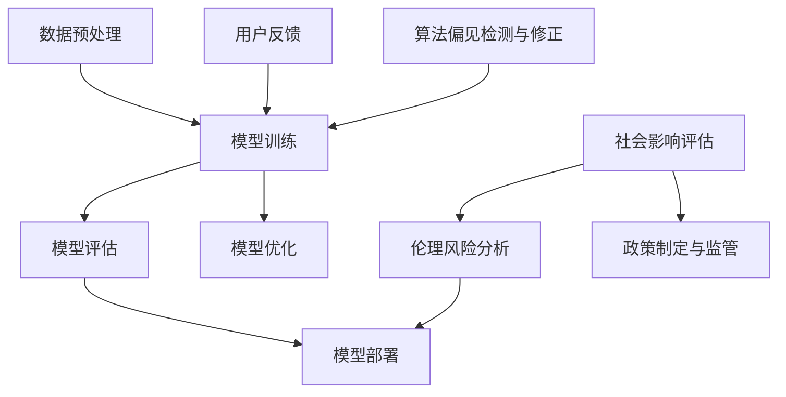

                 

# 基础模型的社会影响评估

> 关键词：基础模型、社会影响、风险评估、伦理考量、算法偏见

> 摘要：本文旨在探讨基础模型在社会中的应用及其带来的影响，特别是风险和伦理问题。通过梳理基础模型的核心概念，剖析其构建与运作原理，本文将进一步分析其在不同场景下的潜在风险，并探讨应对措施与未来趋势。

## 1. 背景介绍

### 1.1 目的和范围

本文的目的在于对基础模型在社会层面的影响进行系统性评估，重点关注以下几个方面：

1. 基础模型的定义及其在社会中的广泛应用。
2. 风险评估：识别基础模型可能带来的负面社会影响。
3. 伦理考量：探讨基础模型中的伦理问题及其解决方案。
4. 应对措施：提出降低风险、增强模型伦理性的策略。
5. 未来趋势：预测基础模型的发展方向及潜在挑战。

### 1.2 预期读者

本文主要面向以下读者群体：

1. 计算机科学与工程领域的专业人士。
2. 人工智能研究者。
3. 政策制定者与行业监管者。
4. 公众，特别是对基础模型技术有兴趣的普通读者。

### 1.3 文档结构概述

本文分为十个部分，具体如下：

1. 背景介绍：阐述文章的目的、范围、预期读者及文档结构。
2. 核心概念与联系：介绍基础模型的相关概念及其联系。
3. 核心算法原理 & 具体操作步骤：详细讲解基础模型的构建过程。
4. 数学模型和公式 & 详细讲解 & 举例说明：分析基础模型中的数学模型。
5. 项目实战：代码实际案例和详细解释说明。
6. 实际应用场景：探讨基础模型在各个领域的应用。
7. 工具和资源推荐：提供学习资源与开发工具。
8. 总结：未来发展趋势与挑战。
9. 附录：常见问题与解答。
10. 扩展阅读 & 参考资料：提供进一步学习资料。

### 1.4 术语表

#### 1.4.1 核心术语定义

- **基础模型**：一种被广泛用于不同应用场景的算法模型，通常通过大规模数据训练得到。
- **风险评估**：识别、评估和管理潜在风险的过程。
- **算法偏见**：算法输出结果受到训练数据中偏见的影响，导致不公正的决策。
- **伦理考量**：在模型设计和应用过程中考虑的道德和伦理问题。

#### 1.4.2 相关概念解释

- **社会影响评估**：评估某个项目或技术在社会层面上的影响。
- **算法透明性**：算法的运作逻辑和决策过程容易被理解和验证。
- **伦理决策框架**：用于指导模型设计和应用过程的伦理原则。

#### 1.4.3 缩略词列表

- **AI**：人工智能
- **ML**：机器学习
- **DL**：深度学习
- **NLP**：自然语言处理
- **RL**：强化学习

## 2. 核心概念与联系

在深入探讨基础模型的社会影响之前，我们首先需要了解基础模型的核心概念及其相互联系。以下是基础模型相关概念及其架构的 Mermaid 流程图：



### 2.1 基础模型的构建过程

- **数据预处理**：对原始数据进行清洗、格式化，以便模型能够高效训练。
- **模型训练**：使用训练数据集训练模型，通过不断调整参数使模型能够更好地预测或分类。
- **模型评估**：在测试数据集上评估模型的性能，确保其具备良好的泛化能力。
- **模型部署**：将训练好的模型部署到实际应用场景中，如搜索引擎、推荐系统、自动驾驶等。
- **用户反馈**：收集用户对模型应用的效果反馈，用于模型优化和迭代。
- **算法偏见检测与修正**：识别并修正模型中可能存在的偏见，确保公正性和公平性。
- **伦理风险分析**：在模型设计和应用过程中考虑伦理问题，防止对个人或群体的不公平待遇。
- **模型优化**：基于用户反馈和性能评估，不断调整模型以提升其效果。
- **社会影响评估**：评估模型在社会层面的影响，包括经济、社会、伦理等方面。
- **政策制定与监管**：根据社会影响评估结果，制定相关政策和监管措施，确保模型的合法合规使用。

### 2.2 基础模型的应用领域

基础模型在不同领域的应用已逐渐深入，以下是一些典型的应用场景：

- **医疗健康**：用于疾病预测、诊断辅助、个性化治疗等。
- **金融领域**：风险评估、信用评分、股票预测等。
- **城市管理**：交通流量预测、环境监测、资源优化等。
- **教育**：个性化学习、课程推荐、学习效果评估等。
- **电子商务**：用户行为分析、推荐系统、广告投放等。
- **公共安全**：犯罪预测、监控分析、应急管理等。

## 3. 核心算法原理 & 具体操作步骤

### 3.1 基础模型的构建步骤

构建一个基础模型通常包括以下几个步骤：

1. **数据收集**：收集用于训练和测试的数据集，数据质量直接影响模型的性能。
2. **数据预处理**：清洗、格式化数据，为后续训练做准备。
3. **模型选择**：选择合适的模型架构，如线性模型、神经网络等。
4. **模型训练**：使用训练数据集对模型进行训练，通过调整参数使模型性能达到最优。
5. **模型评估**：在测试数据集上评估模型性能，确保其具备良好的泛化能力。
6. **模型部署**：将训练好的模型部署到实际应用场景中。
7. **迭代优化**：根据用户反馈和性能评估，对模型进行不断优化。

### 3.2 伪代码示例

以下是一个简单的线性回归模型的伪代码示例：

```python
# 数据预处理
data = preprocess_data(raw_data)

# 模型选择
model = LinearRegression()

# 模型训练
model.fit(X_train, y_train)

# 模型评估
accuracy = model.evaluate(X_test, y_test)

# 模型部署
deploy_model(model)

# 迭代优化
if accuracy < desired_accuracy:
    optimize_model(model, new_data)
```

### 3.3 模型构建过程中的关键点

- **数据质量**：保证数据质量是构建有效模型的基础，包括数据清洗、去重、格式化等。
- **模型选择**：根据应用场景选择合适的模型架构，不同的模型适用于不同的问题。
- **参数调整**：通过调整模型参数（如学习率、迭代次数等）来提升模型性能。
- **性能评估**：在测试数据集上评估模型性能，确保其具备良好的泛化能力。

## 4. 数学模型和公式 & 详细讲解 & 举例说明

### 4.1 线性回归模型

线性回归模型是一种常见的预测模型，用于建模自变量和因变量之间的线性关系。其数学模型如下：

$$
y = \beta_0 + \beta_1x + \epsilon
$$

其中，\( y \) 是因变量，\( x \) 是自变量，\( \beta_0 \) 和 \( \beta_1 \) 分别是模型的参数，\( \epsilon \) 是误差项。

### 4.2 梯度下降法

梯度下降法是一种常用的优化方法，用于最小化损失函数。其具体步骤如下：

1. 初始化模型参数 \( \theta \)。
2. 计算损失函数对每个参数的梯度。
3. 更新模型参数：\( \theta = \theta - \alpha \cdot \nabla_\theta J(\theta) \)，其中 \( \alpha \) 是学习率，\( J(\theta) \) 是损失函数。

### 4.3 举例说明

假设我们有一个简单的线性回归问题，目标是最小化损失函数：

$$
J(\theta) = \frac{1}{2m} \sum_{i=1}^{m} (h_\theta(x^{(i)}) - y^{(i)})^2
$$

其中，\( m \) 是样本数量，\( h_\theta(x) = \theta_0 + \theta_1x \) 是线性回归函数。

使用梯度下降法优化参数，伪代码如下：

```python
# 初始化参数
theta_0 = 0
theta_1 = 0
alpha = 0.01
m = len(X)

# 梯度下降迭代
for i in range(num_iterations):
    gradient_0 = 1/m * sum((h_theta(x) - y) * x)
    gradient_1 = 1/m * sum((h_theta(x) - y) * x)
    
    # 更新参数
    theta_0 = theta_0 - alpha * gradient_0
    theta_1 = theta_1 - alpha * gradient_1
```

通过多次迭代，梯度下降法可以收敛到损失函数的最小值，从而得到最优的模型参数。

### 4.4 数学模型的重要性

数学模型是基础模型的核心组成部分，它决定了模型的预测能力。通过深入理解和应用数学模型，我们可以更好地设计和优化模型，提高其性能和可靠性。

## 5. 项目实战：代码实际案例和详细解释说明

### 5.1 开发环境搭建

在进行基础模型的项目实战之前，我们需要搭建一个合适的开发环境。以下是一个简单的Python开发环境搭建步骤：

1. **安装Python**：下载并安装Python 3.8版本及以上。
2. **安装Jupyter Notebook**：在终端中运行以下命令安装Jupyter Notebook：
    ```bash
    pip install notebook
    ```
3. **安装必要的库**：安装用于数据预处理、模型训练和评估的库，如NumPy、Pandas、scikit-learn等：
    ```bash
    pip install numpy pandas scikit-learn
    ```

### 5.2 源代码详细实现和代码解读

以下是一个使用scikit-learn库实现的线性回归模型项目案例：

```python
import numpy as np
import pandas as pd
from sklearn.linear_model import LinearRegression
from sklearn.model_selection import train_test_split
from sklearn.metrics import mean_squared_error

# 数据预处理
def preprocess_data(data):
    # 数据清洗、归一化等操作
    # 略
    return processed_data

# 数据加载
data = pd.read_csv('data.csv')
X = preprocess_data(data[['feature_1', 'feature_2']])
y = data['target']

# 划分训练集和测试集
X_train, X_test, y_train, y_test = train_test_split(X, y, test_size=0.2, random_state=42)

# 模型训练
model = LinearRegression()
model.fit(X_train, y_train)

# 模型评估
y_pred = model.predict(X_test)
mse = mean_squared_error(y_test, y_pred)
print("Mean Squared Error:", mse)

# 模型部署
# 略
```

#### 5.2.1 代码解读

- **数据预处理**：对原始数据进行清洗和归一化等处理，为后续模型训练做准备。
- **数据加载**：从CSV文件中加载数据，并将特征和标签分离。
- **划分训练集和测试集**：将数据集划分为训练集和测试集，用于训练和评估模型。
- **模型训练**：使用训练数据集训练线性回归模型。
- **模型评估**：在测试数据集上评估模型性能，计算均方误差（MSE）。
- **模型部署**：将训练好的模型部署到实际应用场景中。

### 5.3 代码解读与分析

#### 5.3.1 数据预处理

数据预处理是模型训练的关键步骤，直接影响到模型的性能。在这个案例中，数据预处理主要包括以下操作：

1. 数据清洗：去除缺失值、异常值等，保证数据质量。
2. 特征工程：对数据进行特征提取和转换，如归一化、标准化等。

#### 5.3.2 模型训练

在这个案例中，我们使用scikit-learn库中的线性回归模型进行训练。线性回归模型是一个简单的预测模型，通过找到自变量和因变量之间的线性关系来预测目标变量。

#### 5.3.3 模型评估

模型评估是评估模型性能的重要步骤。在这个案例中，我们使用均方误差（MSE）来评估模型在测试数据集上的表现。MSE衡量了预测值和实际值之间的差异，值越小表示模型性能越好。

#### 5.3.4 模型部署

模型部署是将训练好的模型应用到实际场景中的过程。在这个案例中，我们暂时未展示具体的部署步骤，但通常包括以下操作：

1. 模型保存：将训练好的模型保存为文件，以便后续使用。
2. 模型加载：从文件中加载模型，用于实际预测。
3. 模型应用：将模型集成到应用系统中，如Web服务、API等。

## 6. 实际应用场景

基础模型在不同领域和场景中的应用已经越来越广泛，以下是几个典型应用场景：

### 6.1 医疗健康

在医疗健康领域，基础模型主要用于疾病预测、诊断辅助和个性化治疗。例如，通过分析患者的医疗记录和生物标志物，基础模型可以帮助医生预测患者患某种疾病的概率，从而制定更有效的治疗方案。此外，基础模型还可以用于药物研发和临床试验，加速新药的发现和审批过程。

### 6.2 金融领域

在金融领域，基础模型广泛应用于风险评估、信用评分、股票预测和投资策略等领域。例如，通过分析历史市场数据，基础模型可以预测股票市场的趋势，为投资者提供投资建议。此外，基础模型还可以用于信用评分，评估借款人的信用风险，从而帮助金融机构制定更科学的信贷政策。

### 6.3 城市管理

在城市管理领域，基础模型主要用于交通流量预测、环境监测和资源优化等。例如，通过分析历史交通数据和实时监控数据，基础模型可以预测城市交通流量，为交通管理部门提供科学的交通调度策略。此外，基础模型还可以用于环境监测，预测空气质量和水质变化，为环境保护部门提供决策支持。

### 6.4 教育

在教育领域，基础模型主要用于个性化学习、课程推荐和学习效果评估等。例如，通过分析学生的学习行为和学习记录，基础模型可以为学生推荐最适合他们的学习资源和课程，提高学习效果。此外，基础模型还可以用于学习效果评估，评估学生的学习进展和成绩，为教育管理部门提供决策支持。

### 6.5 公共安全

在公共安全领域，基础模型主要用于犯罪预测、监控分析和应急管理等。例如，通过分析历史犯罪数据和实时监控数据，基础模型可以预测犯罪发生的可能性，为公共安全部门提供预警和防范措施。此外，基础模型还可以用于监控分析，实时监测公共安全事件，为应急管理提供决策支持。

## 7. 工具和资源推荐

### 7.1 学习资源推荐

#### 7.1.1 书籍推荐

1. **《深度学习》（Goodfellow, Bengio, Courville著）**：全面介绍了深度学习的基础理论和应用实践。
2. **《机器学习》（Tom Mitchell著）**：介绍了机器学习的基本概念、算法和应用。
3. **《Python机器学习》（Sebastian Raschka著）**：通过Python实现机器学习算法，适合初学者。

#### 7.1.2 在线课程

1. **Coursera的《机器学习》（吴恩达教授）**：适合初学者，全面介绍了机器学习的基本概念和算法。
2. **Udacity的《深度学习纳米学位》**：涵盖深度学习的基础知识，包括神经网络、卷积神经网络和循环神经网络等。
3. **edX的《自然语言处理》（丹尼尔·鲁伊著）**：介绍了自然语言处理的基本概念和技术。

#### 7.1.3 技术博客和网站

1. **Medium上的《机器学习和深度学习》系列博客**：涵盖机器学习和深度学习的多个方面，适合初学者和专业人士。
2. **Google AI博客**：介绍了Google AI团队的研究成果和技术应用，涵盖深度学习、自然语言处理、计算机视觉等领域。
3. **Reddit上的r/MachineLearning社区**：讨论机器学习相关的技术、资源和问题，适合寻找解决方案和交流。

### 7.2 开发工具框架推荐

#### 7.2.1 IDE和编辑器

1. **PyCharm**：一款功能强大的Python IDE，支持多种编程语言，适合开发机器学习项目。
2. **Jupyter Notebook**：一款流行的交互式开发环境，适用于数据分析和机器学习项目。
3. **VSCode**：一款轻量级、可扩展的代码编辑器，支持多种编程语言和工具插件。

#### 7.2.2 调试和性能分析工具

1. **Python的pdb**：一款内置的调试工具，用于调试Python代码。
2. **MATLAB**：一款专业的数值计算和调试工具，适用于复杂算法和数据分析。
3. **TensorBoard**：一款可视化工具，用于分析深度学习模型的性能和训练过程。

#### 7.2.3 相关框架和库

1. **TensorFlow**：一款开源的深度学习框架，适用于构建和训练大规模深度神经网络。
2. **PyTorch**：一款流行的深度学习框架，提供灵活的动态计算图和丰富的API。
3. **scikit-learn**：一款适用于机器学习的Python库，包含多种经典的机器学习算法和工具。

### 7.3 相关论文著作推荐

#### 7.3.1 经典论文

1. **“A Course in Machine Learning”（David D. Lewis著）**：全面介绍了机器学习的基本概念和算法。
2. **“Deep Learning”（Ian Goodfellow著）**：深入讲解了深度学习的基础理论和技术。
3. **“The Unreasonable Effectiveness of Data”（Geoffrey Hinton著）**：探讨了大数据对机器学习的影响。

#### 7.3.2 最新研究成果

1. **“Attention is All You Need”（Ashish Vaswani著）**：介绍了Transformer模型，对自然语言处理领域产生了重大影响。
2. **“Bert: Pre-training of Deep Bidirectional Transformers for Language Understanding”（Jacob Devlin著）**：介绍了BERT模型，推动了自然语言处理的发展。
3. **“GShard: Scaling Giant Models with Conditional Combiners**”（Alexey Dosovitskiy著）**：提出了GShard模型，实现了更大规模的深度学习模型训练。

#### 7.3.3 应用案例分析

1. **“Google's AI Principles”（Google AI著）**：介绍了Google AI在伦理和透明性方面的原则和实践。
2. **“AI in Healthcare: The Future Is Now”（Michael L. Millenson著）**：探讨了人工智能在医疗领域的应用和挑战。
3. **“AI in Finance: Opportunities and Risks**”（Nassim Nicholas Taleb著）**：分析了人工智能在金融领域的应用及其潜在风险。

## 8. 总结：未来发展趋势与挑战

随着人工智能技术的不断发展，基础模型在社会中的应用将会更加广泛和深入。然而，这也带来了一系列挑战和风险，需要我们关注和应对。

### 8.1 未来发展趋势

1. **计算能力的提升**：随着硬件技术的进步，深度学习模型将能够处理更大规模的数据，支持更复杂的模型架构。
2. **算法创新的持续发展**：新的算法和技术不断涌现，如生成对抗网络（GAN）、图神经网络（GNN）等，为解决特定问题提供了新的思路和方法。
3. **跨领域应用的融合**：基础模型将在更多领域得到应用，如生物医学、航空航天、能源等，推动跨领域技术创新。
4. **伦理和透明性的重视**：随着人工智能在社会中的应用，伦理和透明性问题将得到更多关注，推动相关法规和标准的制定。

### 8.2 挑战与风险

1. **算法偏见和公平性问题**：基础模型可能受到训练数据的偏见影响，导致不公平的决策，需要建立有效的算法偏见检测和修正机制。
2. **隐私保护和数据安全**：在数据驱动的时代，个人隐私保护和数据安全问题愈发重要，需要制定严格的数据保护政策和安全措施。
3. **模型可解释性和透明性**：基础模型的决策过程往往复杂且不透明，提高模型的可解释性和透明性是提升用户信任的关键。
4. **监管和法规的挑战**：随着人工智能技术的发展，相关监管和法规可能滞后，需要及时更新和完善，以适应技术进步。

### 8.3 应对策略

1. **加强算法偏见检测与修正**：在模型设计和应用过程中，采用多种技术手段识别和修正算法偏见，确保模型的公平性和公正性。
2. **推动数据隐私保护和安全**：加强数据保护，采用加密、匿名化等手段保护用户隐私，同时制定相关法律法规，确保数据的安全和合法使用。
3. **提高模型可解释性和透明性**：通过可视化、解释性算法等方法，提高模型的可解释性，增强用户对模型决策的信任。
4. **完善监管和法规体系**：及时更新和完善监管和法规体系，确保人工智能技术的健康发展和合规使用。

## 9. 附录：常见问题与解答

### 9.1 基础模型是什么？

基础模型是一种被广泛用于不同应用场景的算法模型，通常通过大规模数据训练得到。基础模型的核心任务是学习输入和输出之间的复杂关系，以实现预测、分类等任务。

### 9.2 基础模型在社会中的风险有哪些？

基础模型在社会中可能带来的风险包括算法偏见、隐私泄露、数据安全、模型不可解释性等。这些风险可能导致不公平的决策、隐私侵犯、决策失误等问题。

### 9.3 如何降低基础模型的风险？

降低基础模型风险的方法包括：

1. **加强算法偏见检测与修正**：采用多种技术手段识别和修正算法偏见。
2. **数据隐私保护和安全**：加强数据保护，采用加密、匿名化等手段。
3. **提高模型可解释性和透明性**：通过可视化、解释性算法等方法提高模型可解释性。
4. **完善监管和法规体系**：制定相关法律法规，确保模型合规使用。

### 9.4 基础模型的应用领域有哪些？

基础模型广泛应用于医疗健康、金融领域、城市管理、教育、公共安全等多个领域，如疾病预测、风险评估、交通流量预测、个性化学习等。

## 10. 扩展阅读 & 参考资料

1. **《深度学习》（Goodfellow, Bengio, Courville著）**：提供了深度学习领域的全面介绍和深入分析。
2. **《机器学习》（Tom Mitchell著）**：介绍了机器学习的基础概念、算法和应用。
3. **《AI伦理学》（Luciano Floridi著）**：探讨了人工智能的伦理问题和相关道德原则。
4. **《自然语言处理综论》（Daniel Jurafsky & James H. Martin著）**：全面介绍了自然语言处理的基本概念和技术。
5. **Google AI博客**：介绍了Google AI团队的研究成果和技术应用，涵盖深度学习、自然语言处理、计算机视觉等领域。
6. **arXiv论文库**：提供了最新的深度学习、自然语言处理和计算机视觉领域的论文。
7. **GitHub**：包含大量的开源项目和代码示例，有助于学习和实践人工智能技术。

