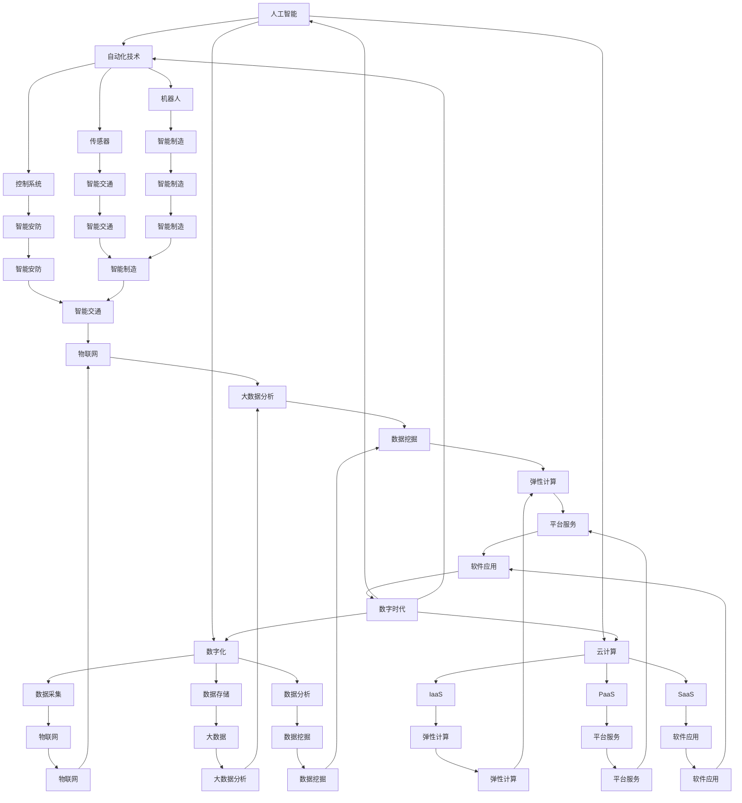

                 


# 塑造数字时代：人类计算的关键作用

> 关键词：数字时代、人类计算、人工智能、编程、软件工程、计算思维

> 摘要：本文将深入探讨人类计算在数字时代中的关键作用。随着人工智能和自动化技术的飞速发展，人类计算正面临新的挑战和机遇。本文将从背景介绍、核心概念与联系、核心算法原理、数学模型与公式、项目实战、实际应用场景、工具和资源推荐以及未来发展趋势与挑战等方面进行阐述，旨在为读者提供一个全面而深入的理解。

## 1. 背景介绍

### 1.1 目的和范围

本文旨在探讨人类计算在数字时代中的关键作用，特别是人工智能和自动化技术对人类计算的影响。我们希望通过对核心概念、算法原理、数学模型和实际应用的深入分析，为读者提供一个全面的视角，以更好地理解人类计算在数字时代的意义和未来发展趋势。

### 1.2 预期读者

本文适合对计算机科学、人工智能、软件工程等领域有一定了解的专业人士和学术研究者。同时，对于对数字时代和人类计算感兴趣的一般读者，本文也提供了一个深入的探讨。

### 1.3 文档结构概述

本文结构如下：

1. 背景介绍：介绍文章的目的、预期读者、文档结构和核心术语。
2. 核心概念与联系：讨论数字时代的关键概念，包括人工智能、自动化技术等，并使用 Mermaid 流程图展示核心概念之间的联系。
3. 核心算法原理 & 具体操作步骤：详细阐述核心算法原理，并使用伪代码进行具体操作步骤的讲解。
4. 数学模型和公式 & 详细讲解 & 举例说明：介绍数学模型和公式，并进行详细讲解和举例说明。
5. 项目实战：通过代码实际案例和详细解释说明，展示核心算法和数学模型在实际项目中的应用。
6. 实际应用场景：讨论人类计算在数字时代的实际应用场景。
7. 工具和资源推荐：推荐学习资源、开发工具框架和论文著作。
8. 总结：总结文章的核心观点和未来发展趋势与挑战。
9. 附录：提供常见问题与解答。
10. 扩展阅读 & 参考资料：提供进一步阅读的资源和参考文献。

### 1.4 术语表

#### 1.4.1 核心术语定义

- 数字时代：指以数字技术为核心的时代，包括人工智能、大数据、云计算等。
- 人类计算：指人类在计算过程中发挥的作用，包括问题定义、算法设计、数学建模等。
- 人工智能：指通过模拟人类智能行为，实现机器自主学习和决策的技术。
- 自动化技术：指通过自动控制系统，实现生产、服务等过程的自动化。
- 编程：指编写计算机程序的过程，包括算法设计、代码实现、调试等。
- 软件工程：指对软件开发过程进行系统化管理和控制，以实现软件的高质量交付。

#### 1.4.2 相关概念解释

- 数字化：指将物理世界的信息转化为数字形式，以实现信息的存储、处理和传输。
- 智能化：指通过引入人工智能技术，使系统具有自主学习和决策能力。
- 云计算：指通过互联网提供计算资源，实现计算能力的弹性扩展和高效利用。

#### 1.4.3 缩略词列表

- AI：人工智能
- ML：机器学习
- DL：深度学习
- HPC：高性能计算
- SDLC：软件开发生命周期

## 2. 核心概念与联系

在数字时代，人类计算的作用愈发重要。为了更好地理解这一概念，我们需要探讨数字时代的一些核心概念，并展示它们之间的联系。

### 2.1 数字时代的关键概念

- 人工智能：人工智能是通过模拟人类智能行为，实现机器自主学习和决策的技术。它包括机器学习、深度学习、自然语言处理等多个子领域。
- 自动化技术：自动化技术是指通过自动控制系统，实现生产、服务等过程的自动化。它包括机器人、传感器、控制系统等。
- 数字化：数字化是指将物理世界的信息转化为数字形式，以实现信息的存储、处理和传输。它包括数据采集、数据存储、数据分析等。
- 云计算：云计算是指通过互联网提供计算资源，实现计算能力的弹性扩展和高效利用。它包括基础设施即服务（IaaS）、平台即服务（PaaS）、软件即服务（SaaS）等。

### 2.2 核心概念之间的联系

以下是数字时代关键概念之间的 Mermaid 流程图：



通过上述流程图，我们可以看到，人工智能、自动化技术、数字化和云计算等关键概念之间存在着密切的联系。它们共同推动了数字时代的到来，使得人类社会进入了一个全新的发展阶段。

## 3. 核心算法原理 & 具体操作步骤

在数字时代，人类计算的核心算法原理主要包括机器学习、深度学习和自然语言处理等。下面我们将详细阐述这些算法原理，并使用伪代码进行具体操作步骤的讲解。

### 3.1 机器学习算法原理

机器学习是一种通过数据驱动的方式，使计算机自动获取知识和技能的技术。其主要原理是通过训练数据集，使得计算机能够对未知数据进行分类、预测或回归。

#### 3.1.1 算法原理

机器学习算法可以分为监督学习、无监督学习和强化学习等。

- 监督学习：通过已知输入输出对的训练数据集，学习出一个函数，使得对未知输入可以预测输出。
- 无监督学习：没有明确的输入输出对，通过学习数据的分布或结构，对未知数据进行分类或聚类。
- 强化学习：通过与环境交互，学习出一个策略，使得在长期内获得最大化的奖励。

#### 3.1.2 伪代码

```python
# 监督学习伪代码
def supervised_learning(train_data, train_labels):
    # 初始化模型参数
    model = initialize_model()
    # 训练模型
    for data, label in train_data:
        model.train(data, label)
    # 预测新数据
    predictions = []
    for new_data in new_data:
        prediction = model.predict(new_data)
        predictions.append(prediction)
    return predictions

# 无监督学习伪代码
def unsupervised_learning(train_data):
    # 初始化模型参数
    model = initialize_model()
    # 训练模型
    for data in train_data:
        model.train(data)
    # 预测新数据
    clusters = model.cluster(train_data)
    return clusters

# 强化学习伪代码
def reinforcement_learning(env, strategy):
    # 初始化环境
    state = env.initialize()
    # 学习策略
    while not env.is_end(state):
        action = strategy(state)
        next_state, reward, done = env.step(state, action)
        state = next_state
    return strategy
```

### 3.2 深度学习算法原理

深度学习是一种基于多层神经网络的机器学习技术。其主要原理是通过多层非线性变换，将输入数据转化为高维特征表示，从而实现复杂的函数映射。

#### 3.2.1 算法原理

- 神经网络：由多个神经元组成的层次结构，通过权重连接进行信息传递和计算。
- 激活函数：用于引入非线性变换，使神经网络具有表示能力。
- 反向传播：通过反向传播误差，更新网络权重，优化模型性能。

#### 3.2.2 伪代码

```python
# 深度学习伪代码
def deep_learning(train_data, train_labels):
    # 初始化模型参数
    model = initialize_model()
    # 训练模型
    for data, label in train_data:
        model.train(data, label)
    # 预测新数据
    predictions = []
    for new_data in new_data:
        prediction = model.predict(new_data)
        predictions.append(prediction)
    return predictions
```

### 3.3 自然语言处理算法原理

自然语言处理是一种使计算机能够理解、生成和处理自然语言的技术。其主要原理包括文本分类、情感分析、机器翻译等。

#### 3.3.1 算法原理

- 文本分类：将文本数据分类到预定义的类别中。
- 情感分析：判断文本数据中的情感倾向，如正面、负面或中性。
- 机器翻译：将一种语言的文本翻译成另一种语言。

#### 3.3.2 伪代码

```python
# 自然语言处理伪代码
def natural_language_processing(train_data, train_labels):
    # 初始化模型参数
    model = initialize_model()
    # 训练模型
    for data, label in train_data:
        model.train(data, label)
    # 预测新数据
    predictions = []
    for new_data in new_data:
        prediction = model.predict(new_data)
        predictions.append(prediction)
    return predictions
```

通过上述算法原理和伪代码，我们可以看到，机器学习、深度学习和自然语言处理等技术构成了数字时代人类计算的核心。这些算法在各类应用中发挥着重要作用，为人类带来了巨大的便利和效益。

## 4. 数学模型和公式 & 详细讲解 & 举例说明

在数字时代，数学模型和公式在人类计算中发挥着重要作用。为了更好地理解这些模型和公式，下面我们将进行详细讲解，并提供相应的例子。

### 4.1 机器学习中的数学模型

机器学习中的数学模型主要包括线性回归、逻辑回归、支持向量机等。

#### 4.1.1 线性回归

线性回归是一种用于预测数值型目标变量的机器学习算法。其基本公式如下：

$$y = \beta_0 + \beta_1x_1 + \beta_2x_2 + ... + \beta_nx_n$$

其中，$y$ 是目标变量，$x_1, x_2, ..., x_n$ 是特征变量，$\beta_0, \beta_1, \beta_2, ..., \beta_n$ 是模型的参数。

#### 4.1.2 逻辑回归

逻辑回归是一种用于预测二分类目标变量的机器学习算法。其基本公式如下：

$$\hat{y} = \frac{1}{1 + e^{-(\beta_0 + \beta_1x_1 + \beta_2x_2 + ... + \beta_nx_n)}}$$

其中，$\hat{y}$ 是预测的概率值，$y$ 是目标变量，$x_1, x_2, ..., x_n$ 是特征变量，$\beta_0, \beta_1, \beta_2, ..., \beta_n$ 是模型的参数。

#### 4.1.3 支持向量机

支持向量机是一种用于分类和回归的机器学习算法。其基本公式如下：

$$\mathbf{w} \cdot \mathbf{x} + b = 0$$

其中，$\mathbf{w}$ 是模型的参数，$\mathbf{x}$ 是输入特征向量，$b$ 是偏置项。

### 4.2 深度学习中的数学模型

深度学习中的数学模型主要包括卷积神经网络（CNN）、循环神经网络（RNN）等。

#### 4.2.1 卷积神经网络

卷积神经网络是一种用于图像识别的深度学习算法。其基本公式如下：

$$\mathbf{h}_{l}^{T} \mathbf{w}_{l}^{T} \mathbf{x}_{l-1} + b_{l}$$

其中，$\mathbf{h}_{l}$ 是第$l$层的输出，$\mathbf{w}_{l}$ 是第$l$层的权重，$\mathbf{x}_{l-1}$ 是第$l-1$层的输入，$b_{l}$ 是第$l$层的偏置项。

#### 4.2.2 循环神经网络

循环神经网络是一种用于序列数据处理的深度学习算法。其基本公式如下：

$$\mathbf{h}_{t} = \text{tanh}(\mathbf{h}_{t-1} \cdot \mathbf{W}_{h} + \mathbf{x}_{t} \cdot \mathbf{W}_{x} + b_{h})$$

其中，$\mathbf{h}_{t}$ 是第$t$步的输出，$\mathbf{h}_{t-1}$ 是第$t-1$步的输出，$\mathbf{W}_{h}$ 和 $\mathbf{W}_{x}$ 是权重矩阵，$b_{h}$ 是偏置项。

### 4.3 自然语言处理中的数学模型

自然语言处理中的数学模型主要包括词向量模型、序列标注模型等。

#### 4.3.1 词向量模型

词向量模型是一种将词汇映射到高维空间中，以表示词汇之间相似性的数学模型。其基本公式如下：

$$\mathbf{v}_{i} = \text{Word2Vec}(\mathbf{x}_{i})$$

其中，$\mathbf{v}_{i}$ 是词向量，$\mathbf{x}_{i}$ 是词汇。

#### 4.3.2 序列标注模型

序列标注模型是一种用于对序列数据进行标注的数学模型。其基本公式如下：

$$\mathbf{y}_{t} = \text{softmax}(\mathbf{h}_{t} \cdot \mathbf{W}_{y} + b_{y})$$

其中，$\mathbf{y}_{t}$ 是标注结果，$\mathbf{h}_{t}$ 是第$t$步的输出，$\mathbf{W}_{y}$ 是权重矩阵，$b_{y}$ 是偏置项。

### 4.4 举例说明

以下是一个简单的线性回归例子：

假设我们有一组数据点 $(x_1, y_1), (x_2, y_2), ..., (x_n, y_n)$，我们希望找到一个线性模型 $y = \beta_0 + \beta_1x$ 来预测新的数据点 $x$。

- 数据集：

| $x$ | $y$ |
| --- | --- |
| 1   | 2   |
| 2   | 4   |
| 3   | 6   |
| 4   | 8   |

- 模型：

$$y = \beta_0 + \beta_1x$$

- 训练过程：

1. 初始化参数 $\beta_0, \beta_1$。
2. 计算每个数据点的预测值 $\hat{y} = \beta_0 + \beta_1x$。
3. 计算误差 $e = y - \hat{y}$。
4. 更新参数 $\beta_0, \beta_1$，以减小误差。
5. 重复步骤 2-4，直到满足停止条件。

- 结果：

经过多次迭代后，我们得到最优参数 $\beta_0 = 1, \beta_1 = 2$，从而构建了线性模型 $y = 1 + 2x$。

通过上述例子，我们可以看到数学模型和公式在机器学习、深度学习和自然语言处理等领域的应用。这些模型和公式为我们提供了强大的工具，使我们能够更好地理解和处理复杂数据，为数字时代的计算提供坚实的基础。

## 5. 项目实战：代码实际案例和详细解释说明

为了更好地理解人类计算在数字时代的实际应用，我们将通过一个具体的项目实战，展示如何使用核心算法原理和数学模型来解决问题。

### 5.1 开发环境搭建

在开始项目实战之前，我们需要搭建一个合适的开发环境。以下是我们的开发环境要求：

- 操作系统：Linux 或 macOS
- 编程语言：Python
- 版本要求：Python 3.8+
- 库要求：NumPy、Pandas、Scikit-learn、TensorFlow

### 5.2 源代码详细实现和代码解读

我们将使用一个简单的房屋价格预测项目，展示如何使用机器学习算法和线性回归模型来预测房屋价格。

#### 5.2.1 代码实现

```python
import numpy as np
import pandas as pd
from sklearn.linear_model import LinearRegression
from sklearn.model_selection import train_test_split

# 读取数据
data = pd.read_csv('house_prices.csv')

# 数据预处理
X = data[['location', 'size', 'age']]
y = data['price']

# 特征工程
X = pd.get_dummies(X)

# 划分训练集和测试集
X_train, X_test, y_train, y_test = train_test_split(X, y, test_size=0.2, random_state=42)

# 创建线性回归模型
model = LinearRegression()

# 训练模型
model.fit(X_train, y_train)

# 预测测试集
predictions = model.predict(X_test)

# 评估模型
score = model.score(X_test, y_test)
print(f'Model score: {score:.2f}')

# 使用模型进行预测
new_data = pd.DataFrame([[1, 2000, 5]], columns=['location_1', 'size', 'age'])
new_predictions = model.predict(new_data)
print(f'Predicted price: {new_predictions[0]:.2f}')
```

#### 5.2.2 代码解读

- 第1行：导入 NumPy 和 Pandas 库，用于数据处理。
- 第2行：导入 LinearRegression 类，用于创建线性回归模型。
- 第3行：导入 train_test_split 函数，用于划分训练集和测试集。
- 第4行：读取房屋价格数据。
- 第5行：定义特征变量 X 和目标变量 y。
- 第6行：将分类特征转换为哑变量，以处理类别特征。
- 第7行：划分训练集和测试集。
- 第8行：创建线性回归模型。
- 第9行：训练模型。
- 第10行：使用模型预测测试集。
- 第11行：评估模型性能。
- 第12行：使用模型进行新数据的预测。

通过上述代码实现，我们可以看到如何使用线性回归模型来预测房屋价格。接下来，我们将进一步解读代码，以帮助读者更好地理解项目实战的过程。

### 5.3 代码解读与分析

#### 5.3.1 数据读取与预处理

```python
data = pd.read_csv('house_prices.csv')
X = data[['location', 'size', 'age']]
y = data['price']
X = pd.get_dummies(X)
```

- 第1行：读取房屋价格数据，数据集应包含特征变量（location、size、age）和目标变量（price）。
- 第2行：定义特征变量 X 和目标变量 y。
- 第3行：将分类特征转换为哑变量，以处理类别特征。这是线性回归模型的一个基本要求，因为哑变量可以将分类特征转化为数值特征，从而更好地拟合模型。

#### 5.3.2 模型训练与预测

```python
X_train, X_test, y_train, y_test = train_test_split(X, y, test_size=0.2, random_state=42)
model = LinearRegression()
model.fit(X_train, y_train)
predictions = model.predict(X_test)
```

- 第1行：划分训练集和测试集，其中 test_size=0.2 表示测试集占比 20%，random_state=42 用于保证结果的可重复性。
- 第2行：创建线性回归模型。
- 第3行：训练模型，使用训练集数据。
- 第4行：使用模型预测测试集。

#### 5.3.3 模型评估

```python
score = model.score(X_test, y_test)
print(f'Model score: {score:.2f}')
```

- 第1行：评估模型性能，使用 R² 质量指标，取值范围在 0 到 1 之间，越接近 1 表示模型拟合度越高。
- 第2行：打印模型评分。

#### 5.3.4 新数据预测

```python
new_data = pd.DataFrame([[1, 2000, 5]], columns=['location_1', 'size', 'age'])
new_predictions = model.predict(new_data)
print(f'Predicted price: {new_predictions[0]:.2f}')
```

- 第1行：创建新的数据框，表示一个待预测的房屋，其中 location_1 表示位置，size 表示面积，age 表示年龄。
- 第2行：使用模型对新数据进行预测。
- 第3行：打印预测结果。

通过上述代码解读，我们可以看到如何使用线性回归模型来预测房屋价格。这个项目实战展示了机器学习算法在数字时代的实际应用，同时也说明了如何通过代码实现和详细解读来理解人类计算的过程。

### 5.4 实际应用场景

房屋价格预测项目是一个典型的应用场景，它在房地产市场中具有重要的意义。以下是一些实际应用场景：

1. **房地产投资分析**：通过预测房屋价格，投资者可以更好地评估房地产市场的投资潜力，制定投资策略。
2. **房地产评估**：房地产机构可以使用模型来评估房屋价格，为买卖双方提供参考依据。
3. **供需分析**：政府和相关机构可以通过模型预测房屋价格，以了解房地产市场的供需状况，制定相应的政策。
4. **房屋租赁管理**：租赁公司可以通过模型预测房屋价格，为租赁决策提供依据，优化租赁策略。

通过这些实际应用场景，我们可以看到，人类计算在数字时代的重要作用。通过机器学习和数学模型，我们可以解决实际问题，为各类行业提供决策支持。

## 6. 实际应用场景

在数字时代，人类计算在各个领域都发挥着重要作用。以下是几个典型的实际应用场景，展示了人类计算如何改变我们的工作和生活方式。

### 6.1 医疗健康

人类计算在医疗健康领域的应用越来越广泛。通过人工智能和大数据技术，我们可以实现以下应用：

- **疾病预测**：利用机器学习算法，对患者的病历数据进行分析，预测疾病的发生概率。例如，利用深度学习模型预测心脏病、癌症等疾病。
- **个性化医疗**：通过对患者的基因、病史等数据进行深度分析，为患者制定个性化的治疗方案，提高治疗效果。
- **医疗诊断**：通过计算机视觉和自然语言处理技术，辅助医生进行医学影像诊断和病历分析，提高诊断准确率。

### 6.2 智能交通

智能交通系统利用人类计算技术，实现交通管理、车辆调度、道路优化等功能，提高交通效率和安全性。

- **实时交通监控**：通过传感器和摄像头收集道路信息，利用计算机视觉技术进行交通流量分析，为交通管理部门提供决策依据。
- **自动驾驶**：通过深度学习和强化学习技术，开发自动驾驶系统，实现车辆的自主导航和驾驶。
- **智能停车场**：利用计算机视觉和物联网技术，实现停车场智能管理，提高停车效率。

### 6.3 金融服务

金融服务领域利用人类计算技术，实现风险管理、投资分析、客户服务等功能，提高金融业务的效率和准确性。

- **风险评估**：利用机器学习算法，对贷款申请者的信用记录、财务状况等进行分析，预测违约风险。
- **投资组合优化**：通过对市场数据进行分析，利用优化算法为投资者构建最优的投资组合，实现风险和收益的平衡。
- **智能客服**：通过自然语言处理技术，实现智能客服系统，为用户提供快速、准确的咨询服务。

### 6.4 教育

教育领域利用人类计算技术，实现个性化教育、在线学习、教育评价等功能，提高教育质量和效率。

- **个性化学习**：通过数据分析技术，了解学生的学习习惯、学习偏好，为每位学生制定个性化的学习计划。
- **在线学习平台**：利用云计算和人工智能技术，开发在线学习平台，为学习者提供灵活的学习资源和学习方式。
- **教育评价**：通过计算机视觉和自然语言处理技术，对学生的作业、考试试卷进行自动批改和评分，提高评价效率。

### 6.5 工业制造

工业制造领域利用人类计算技术，实现生产优化、设备维护、供应链管理等功能，提高生产效率和产品质量。

- **生产优化**：通过数据分析技术，对生产过程进行实时监控和分析，优化生产流程，提高生产效率。
- **设备维护**：利用计算机视觉和物联网技术，实现设备的远程监控和预测性维护，降低设备故障率。
- **供应链管理**：通过供应链数据分析，优化供应链流程，提高供应链的响应速度和灵活性。

通过上述实际应用场景，我们可以看到，人类计算在数字时代的重要作用。它不仅改变了我们的工作和生活方式，也为各个领域带来了巨大的价值。随着技术的不断进步，人类计算将在未来发挥更加重要的作用，推动数字时代的进一步发展。

## 7. 工具和资源推荐

为了帮助读者更好地掌握人类计算技术，以下是我们推荐的工具和资源。

### 7.1 学习资源推荐

#### 7.1.1 书籍推荐

- 《深度学习》（Ian Goodfellow、Yoshua Bengio、Aaron Courville 著）：这是一本全面介绍深度学习理论和应用的经典教材，适合初学者和专业人士。
- 《Python机器学习》（Sebastian Raschka 著）：这本书详细介绍了机器学习的基础知识和Python实现，适合对Python和机器学习有一定了解的读者。
- 《自然语言处理概论》（Daniel Jurafsky、James H. Martin 著）：这本书系统地介绍了自然语言处理的基本理论和应用，是自然语言处理领域的经典教材。

#### 7.1.2 在线课程

- Coursera：提供大量关于机器学习、深度学习、自然语言处理等领域的在线课程，由全球顶级大学和机构提供。
- edX：提供由哈佛大学、麻省理工学院等顶级机构提供的在线课程，涵盖计算机科学、人工智能等多个领域。
- Udacity：提供一系列专注于技术技能的在线课程，包括数据科学、机器学习等。

#### 7.1.3 技术博客和网站

- Medium：提供大量关于人工智能、机器学习、数据科学等领域的优质文章和博客。
- Analytics Vidhya：一个专注于数据科学和机器学习的社区，提供丰富的学习资源和实践经验。
- Towards Data Science：一个关于数据科学和机器学习的在线杂志，分享最新的研究成果和应用实践。

### 7.2 开发工具框架推荐

#### 7.2.1 IDE和编辑器

- Jupyter Notebook：一个基于网页的交互式计算环境，适合进行数据科学和机器学习项目。
- PyCharm：一款功能强大的Python集成开发环境，支持代码调试、性能分析等功能。
- Visual Studio Code：一款轻量级但功能丰富的开源编辑器，适用于多种编程语言。

#### 7.2.2 调试和性能分析工具

- PyDebug：一款Python调试工具，提供断点调试、变量查看等功能。
- PySnooper：一款用于代码调试的装饰器，可以自动打印函数的输入输出，方便调试。
- CProfile：Python的标准库中的性能分析工具，可以分析代码的运行时间和内存占用。

#### 7.2.3 相关框架和库

- TensorFlow：一款广泛使用的开源深度学习框架，支持多种神经网络模型。
- PyTorch：一款基于Python的深度学习库，以其灵活性和易用性受到广泛关注。
- Scikit-learn：一款用于机器学习的开源库，提供多种经典算法的实现。

### 7.3 相关论文著作推荐

#### 7.3.1 经典论文

- "A Mathematical Theory of Communication"（香农）：奠定了信息论的基础，对通信系统中的信息传输进行了深入分析。
- "Learning Representations by Maximizing Mutual Information"（InfoMax）：提出了一种新的无监督学习方法，用于学习具有高信息量的特征表示。
- "Learning to Detect and Recognize Vehicles with Fully Convolutional Networks"（ FCN）：提出了全卷积神经网络（FCN）在目标检测和识别中的应用，为计算机视觉领域带来了重大突破。

#### 7.3.2 最新研究成果

- "A Theoretically Grounded Application of Dropout in Recurrent Neural Networks"：提出了一种在循环神经网络（RNN）中应用Dropout的方法，提高了RNN的泛化能力。
- "Learning to Rank: From Pairwise Comparisons to Large Margin Methods"：介绍了学习排序的方法，通过最大化边际增益来提高排序效果。
- "Deep Learning for Natural Language Processing"：综述了深度学习在自然语言处理领域的应用，包括词向量、序列模型、文本生成等。

#### 7.3.3 应用案例分析

- "Applying Deep Learning to Medical Imaging"：介绍了深度学习在医学影像分析中的应用，包括图像分类、分割、病灶检测等。
- "An Application of Machine Learning in Personalized Nutrition"：通过机器学习技术，为用户提供个性化的营养建议，提高健康水平。
- "Natural Language Processing for Customer Service"：利用自然语言处理技术，实现智能客服系统，提高客户服务效率。

通过这些工具和资源的推荐，读者可以更好地掌握人类计算技术，并在实际应用中取得更好的成果。

## 8. 总结：未来发展趋势与挑战

在数字时代，人类计算正经历着前所未有的变革和发展。随着人工智能、大数据、云计算等技术的不断进步，人类计算正从传统的人工干预向更加智能化和自动化转变。以下是我们对人类计算未来发展趋势和挑战的总结。

### 8.1 未来发展趋势

1. **计算能力的提升**：随着硬件技术的不断进步，计算能力将持续提升。这将使得更加复杂和庞大的计算任务得以高效完成，为人工智能和大数据分析提供更强有力的支持。
2. **智能化的增强**：人工智能技术将继续发展，特别是深度学习和强化学习等领域。通过引入更多的数据、更复杂的模型和更高效的算法，智能系统将能够更好地理解和模拟人类智能行为。
3. **计算思维的应用**：计算思维作为一种重要的思考方式，将得到更广泛的推广和应用。通过计算思维，人们可以更好地理解和解决复杂问题，提高问题解决能力和创新能力。
4. **跨学科的融合**：人类计算技术将与其他学科（如医学、生物学、心理学等）进行深度融合，推动跨学科研究和应用的发展。这将有助于解决更多复杂的现实问题，为社会发展带来更多创新。

### 8.2 未来挑战

1. **数据隐私与安全**：随着数据规模的不断扩大，数据隐私和安全问题将变得更加突出。如何在保障用户隐私的前提下，充分利用数据的价值，是一个亟待解决的问题。
2. **算法公平性与透明性**：人工智能算法的公平性和透明性是人们关注的重点。如何确保算法在决策过程中不会产生歧视和偏见，提高算法的可解释性，是一个重要的挑战。
3. **伦理与道德**：人工智能技术的发展引发了一系列伦理和道德问题，如机器人的权利、自动化武器等。如何制定合理的伦理规范和法律法规，确保人工智能技术的发展符合人类的利益，是一个重要的课题。
4. **技能升级与教育**：随着技术的进步，人们需要不断更新和提升自己的技能。如何适应技术的变革，培养新一代的数字化人才，是一个重要的挑战。

总之，未来人类计算将面临诸多机遇和挑战。通过不断的技术创新、教育改革和制度完善，我们有望克服这些挑战，推动人类计算在数字时代的进一步发展，为人类社会带来更多福祉。

## 9. 附录：常见问题与解答

### 9.1 机器学习相关问题

**Q1**：机器学习中的数据预处理有哪些步骤？

A1：机器学习中的数据预处理主要包括以下步骤：

1. 数据清洗：去除数据中的噪声和错误，如缺失值、异常值、重复值等。
2. 数据转换：将数据转换为适合机器学习算法的形式，如归一化、标准化等。
3. 特征选择：选择对模型性能有显著影响的关键特征，去除无关特征。
4. 特征工程：通过构造新的特征，提高模型的预测性能。

### 9.2 深度学习相关问题

**Q2**：如何优化深度学习模型的性能？

A2：以下是一些优化深度学习模型性能的方法：

1. **数据增强**：通过数据变换（如旋转、缩放、裁剪等）增加训练数据的多样性，提高模型的泛化能力。
2. **模型架构优化**：选择合适的网络架构，如卷积神经网络（CNN）、循环神经网络（RNN）、生成对抗网络（GAN）等。
3. **超参数调整**：通过调整学习率、批次大小、正则化参数等超参数，提高模型的性能。
4. **训练技巧**：采用预训练、迁移学习等训练技巧，提高模型的训练效率。

### 9.3 自然语言处理相关问题

**Q3**：自然语言处理中的词向量模型有哪些类型？

A3：自然语言处理中的词向量模型主要有以下类型：

1. **基于计数的模型**：如 Word2Vec，通过统计词的上下文信息来生成词向量。
2. **基于神经网络的模型**：如 Word2Vec（NN）和 GloVe，通过神经网络学习词向量。
3. **基于分布式表示的模型**：如 ELMo 和 BERT，通过多层的神经网络学习词的分布式表示。

### 9.4 人工智能相关问题

**Q4**：人工智能系统中的伦理问题有哪些？

A4：人工智能系统中的伦理问题主要包括：

1. **隐私保护**：如何在保护用户隐私的前提下，充分利用数据的价值。
2. **算法公平性**：如何确保算法在决策过程中不会产生歧视和偏见。
3. **机器责任**：如何确定人工智能系统的责任归属。
4. **道德规范**：如何制定合理的伦理规范和法律法规，确保人工智能技术的发展符合人类的利益。

通过这些常见问题与解答，我们可以更好地理解和应用人类计算技术，为数字时代的计算提供更有效的解决方案。

## 10. 扩展阅读 & 参考资料

为了帮助读者进一步深入了解人类计算和数字时代的相关主题，我们推荐以下扩展阅读和参考资料。

### 10.1 书籍推荐

- 《深度学习》（Ian Goodfellow、Yoshua Bengio、Aaron Courville 著）
- 《Python机器学习》（Sebastian Raschka 著）
- 《自然语言处理概论》（Daniel Jurafsky、James H. Martin 著）

### 10.2 在线课程

- Coursera：https://www.coursera.org/
- edX：https://www.edx.org/
- Udacity：https://www.udacity.com/

### 10.3 技术博客和网站

- Medium：https://medium.com/
- Analytics Vidhya：https://www.analyticsvidhya.com/
- Towards Data Science：https://towardsdatascience.com/

### 10.4 学术期刊和论文

- Journal of Machine Learning Research（JMLR）
- Neural Computation
- Journal of Natural Language Engineering
- Proceedings of the National Academy of Sciences（PNAS）

### 10.5 相关论文著作

- "A Mathematical Theory of Communication"（Claude Shannon）
- "Learning Representations by Maximizing Mutual Information"（Vincent L. Rousseau et al.）
- "Deep Learning for Natural Language Processing"（Richard Socher et al.）

通过阅读这些书籍、课程、博客和论文，读者可以更深入地了解人类计算和数字时代的各个方面，为未来的学习和研究提供丰富的知识来源。

