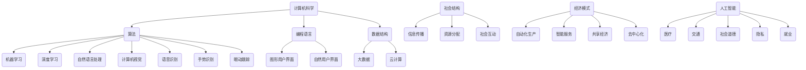

                 

# 塑造未来社会：人类计算的深远意义

> **关键词：** 计算机科学、人工智能、社会变革、人机交互、未来趋势。

> **摘要：** 本文旨在探讨计算机科学和人工智能技术在塑造未来社会中的深远影响。通过分析计算技术的本质及其发展历程，我们揭示了计算对社会结构、经济模式、教育体系以及人机交互的潜在变革。本文以逻辑清晰、结构紧凑的方式，结合具体的算法原理、数学模型和实战案例，阐述计算技术在未来社会发展中的关键作用和面临的挑战。

## 1. 背景介绍

### 1.1 目的和范围

本文的目的是探讨计算机科学和人工智能技术在塑造未来社会中的深远影响。我们旨在通过分析计算技术的本质及其发展历程，揭示计算技术如何改变社会结构、经济模式、教育体系以及人机交互方式。文章内容将覆盖计算技术的核心概念、算法原理、数学模型和实际应用场景，为读者提供一个全面深入的理解。

### 1.2 预期读者

本文面向对计算机科学和人工智能技术有一定了解，希望深入探讨这些技术对未来社会影响的专业人士和研究者。同时，对于对技术进步和社会变革感兴趣的一般读者，本文也提供了丰富的信息和思考。

### 1.3 文档结构概述

本文将分为以下几个部分：

1. 背景介绍：介绍本文的目的、预期读者以及文档结构。
2. 核心概念与联系：阐述计算技术的核心概念及其相互联系。
3. 核心算法原理 & 具体操作步骤：详细讲解计算技术的算法原理和操作步骤。
4. 数学模型和公式 & 详细讲解 & 举例说明：介绍计算技术中的数学模型和公式，并通过具体案例进行说明。
5. 项目实战：提供实际代码案例和详细解释。
6. 实际应用场景：分析计算技术在各个领域中的应用。
7. 工具和资源推荐：推荐学习资源和开发工具。
8. 总结：讨论未来发展趋势与挑战。
9. 附录：常见问题与解答。
10. 扩展阅读 & 参考资料：提供进一步阅读的参考资料。

### 1.4 术语表

#### 1.4.1 核心术语定义

- **计算技术**：指利用计算机进行信息处理的技术和方法。
- **人工智能**：指通过模拟人类智能，实现计算机自主学习和决策的技术。
- **人机交互**：指人与计算机之间的交互过程和技术。
- **社会结构**：指社会中不同群体、组织及其相互关系的结构。

#### 1.4.2 相关概念解释

- **计算机科学**：研究计算机硬件、软件及其应用的科学。
- **算法**：解决特定问题的步骤和规则。
- **数学模型**：用数学语言描述现实问题的抽象模型。
- **数据科学**：利用统计学和计算机科学方法，从数据中提取知识和模式。

#### 1.4.3 缩略词列表

- **AI**：人工智能
- **ML**：机器学习
- **DL**：深度学习
- **NLP**：自然语言处理
- **CV**：计算机视觉

## 2. 核心概念与联系

计算技术是现代社会的核心驱动力，其发展历程对人类社会产生了深远影响。为了更好地理解计算技术，我们需要明确几个核心概念及其相互联系。

### 2.1 计算机科学与人工智能

**计算机科学**是研究计算机硬件、软件及其应用的科学，涵盖了算法设计、编程语言、数据结构等多个领域。**人工智能**（AI）则是通过模拟人类智能，实现计算机自主学习和决策的技术。人工智能是计算机科学的一个分支，两者紧密相连。

**算法**是解决特定问题的步骤和规则，是计算机科学的核心概念。人工智能中的算法主要包括机器学习（ML）和深度学习（DL），用于模拟人类学习和决策过程。自然语言处理（NLP）和计算机视觉（CV）等子领域也依赖于特定的算法来实现功能。

### 2.2 人机交互

**人机交互**（HCI）是指人与计算机之间的交互过程和技术。随着计算技术的发展，人机交互方式逐渐从传统的命令行界面、图形用户界面（GUI）发展到更为智能的自然用户界面（NUI）。

**语音识别**、**手势识别**、**眼动跟踪**等技术使得人机交互更加自然和直观。这些技术的发展不仅提高了用户体验，还为人工智能的应用提供了新的可能性。

### 2.3 社会结构

**社会结构**是指社会中不同群体、组织及其相互关系的结构。计算技术对社会结构产生了深刻影响，改变了信息传播、资源分配、社会互动等方面。

例如，互联网和社交媒体的兴起，使得信息传播速度大大加快，社会互动方式发生了根本变化。在线教育和远程工作的普及，也改变了教育资源和工作方式。

### 2.4 计算技术与经济模式

计算技术对经济模式也产生了深远影响。大数据和云计算技术使得企业能够更有效地收集、处理和分析数据，从而提高决策效率。人工智能技术则被广泛应用于自动化生产和智能服务，降低了生产成本，提高了生产效率。

**共享经济**、**去中心化**等新型经济模式也在计算技术的推动下迅速发展，改变了传统的商业模式。

### 2.5 人工智能与社会变革

人工智能不仅改变了技术领域，还对社会产生了广泛影响。在医疗领域，人工智能被用于疾病诊断、药物研发等，提高了医疗水平。在交通领域，自动驾驶技术被应用于自动驾驶汽车和无人机，改变了交通方式。

此外，人工智能还对社会道德、隐私、就业等方面提出了挑战。如何确保人工智能技术的公平性、透明性和安全性，已成为亟待解决的问题。

### 2.6 核心概念联系图

下面是一个简化的核心概念联系图，展示了计算机科学、人工智能、人机交互和社会结构等核心概念之间的联系。



通过上述分析，我们可以看出，计算技术不仅是一个技术领域，它还在社会结构、经济模式、人机交互等方面产生了深远影响。理解这些核心概念及其联系，有助于我们更深入地探讨计算技术在塑造未来社会中的关键作用。

## 3. 核心算法原理 & 具体操作步骤

计算技术中的核心算法是推动人工智能和社会变革的重要力量。本节将详细讲解计算技术中的核心算法原理，并提供具体的操作步骤。

### 3.1 算法原理概述

计算技术中的核心算法主要包括：

- **机器学习（ML）**：通过数据训练模型，使计算机能够从数据中自动学习和改进。
- **深度学习（DL）**：基于多层神经网络，通过逐层学习复杂特征，实现高级任务。
- **自然语言处理（NLP）**：使计算机理解和生成自然语言，实现人机交互。
- **计算机视觉（CV）**：使计算机理解和解释视觉信息，如图像和视频。

### 3.2 机器学习（ML）

**机器学习**的基本原理是利用已有数据来训练模型，使模型能够在未知数据上做出准确的预测或决策。以下是机器学习的基本操作步骤：

1. **数据收集**：收集用于训练模型的原始数据。
2. **数据预处理**：清洗和转换数据，使其适合模型训练。
3. **特征提取**：从数据中提取重要特征，用于模型训练。
4. **模型选择**：选择合适的模型架构，如线性回归、决策树、神经网络等。
5. **模型训练**：使用训练数据对模型进行训练，优化模型参数。
6. **模型评估**：使用验证数据评估模型性能，调整模型参数。
7. **模型应用**：将训练好的模型应用于新的数据，进行预测或决策。

### 3.3 深度学习（DL）

**深度学习**是一种基于多层神经网络的机器学习方法，通过逐层学习复杂特征，实现高级任务。以下是深度学习的基本操作步骤：

1. **数据收集**：收集用于训练模型的原始数据。
2. **数据预处理**：清洗和转换数据，使其适合模型训练。
3. **特征提取**：从数据中提取重要特征，用于模型训练。
4. **模型架构设计**：设计多层神经网络架构，包括输入层、隐藏层和输出层。
5. **模型训练**：使用训练数据对模型进行训练，优化模型参数。
6. **模型评估**：使用验证数据评估模型性能，调整模型参数。
7. **模型应用**：将训练好的模型应用于新的数据，进行预测或决策。

### 3.4 自然语言处理（NLP）

**自然语言处理**是一种使计算机理解和生成自然语言的方法，主要包括以下几个步骤：

1. **文本预处理**：对文本进行清洗、分词、去停用词等处理。
2. **词向量表示**：将文本转换为词向量表示，如Word2Vec、BERT等。
3. **模型训练**：使用训练数据对模型进行训练，优化模型参数。
4. **模型评估**：使用验证数据评估模型性能，调整模型参数。
5. **模型应用**：将训练好的模型应用于新的文本，进行语义分析、文本生成等任务。

### 3.5 计算机视觉（CV）

**计算机视觉**是一种使计算机理解和解释视觉信息的方法，主要包括以下几个步骤：

1. **图像预处理**：对图像进行缩放、旋转、裁剪等预处理操作。
2. **特征提取**：使用卷积神经网络（CNN）等算法提取图像特征。
3. **模型训练**：使用训练数据对模型进行训练，优化模型参数。
4. **模型评估**：使用验证数据评估模型性能，调整模型参数。
5. **模型应用**：将训练好的模型应用于新的图像，进行目标检测、图像分类等任务。

### 3.6 算法伪代码示例

以下是一个简单的机器学习算法的伪代码示例：

```plaintext
// 机器学习算法伪代码
初始化模型参数
收集训练数据D
预处理数据D
提取特征F
选择模型架构M
训练模型M
评估模型性能
调整模型参数
应用模型M
```

通过以上算法原理和操作步骤的讲解，我们可以看出，计算技术中的核心算法是推动人工智能和社会变革的重要力量。理解这些算法原理和操作步骤，有助于我们更好地利用计算技术，应对未来社会中的挑战。

## 4. 数学模型和公式 & 详细讲解 & 举例说明

计算技术中的数学模型和公式是理解和实现计算算法的重要工具。本节将介绍计算技术中常用的数学模型和公式，并通过具体示例进行详细讲解。

### 4.1 常用数学模型

#### 4.1.1 线性回归模型

线性回归模型是最基础的统计模型之一，用于预测一个连续值变量。其基本公式如下：

$$ y = \beta_0 + \beta_1 \cdot x + \epsilon $$

其中，\( y \) 是预测值，\( x \) 是输入变量，\( \beta_0 \) 和 \( \beta_1 \) 是模型的参数，\( \epsilon \) 是误差项。

#### 4.1.2 决策树模型

决策树模型是一种基于树的分类模型，通过一系列规则进行决策。其基本结构如下：

```
决策树
|
|-- 如果条件1
|   |-- 子节点1
|   |   |-- 如果条件2
|   |   |   |-- 类别1
|   |   |
|   |   |-- 类别2
|   |
|   |-- 类别2
|
|-- 如果条件2
    |-- 子节点2
    |   |-- 类别1
    |
    |-- 类别2
```

#### 4.1.3 神经网络模型

神经网络模型是一种基于多层神经元的计算模型，用于分类和回归任务。其基本结构如下：

```
输入层 --> 隐藏层1 --> 隐藏层2 --> ... --> 输出层
```

每个神经元都接受前一层神经元的输入，通过激活函数进行计算，输出为下一层的输入。

#### 4.1.4 自然语言处理模型

自然语言处理模型主要包括词向量模型、序列标注模型等。其中，词向量模型如Word2Vec和BERT，用于将文本转换为向量表示。其基本公式如下：

$$ \text{vec}(w) = \sum_{i=1}^{n} f(w_i) \cdot v_i $$

其中，\( \text{vec}(w) \) 是词向量，\( f(w_i) \) 是词频，\( v_i \) 是对应的向量。

### 4.2 公式详细讲解

#### 4.2.1 线性回归模型公式

线性回归模型的公式如前所述：

$$ y = \beta_0 + \beta_1 \cdot x + \epsilon $$

其中，\( \beta_0 \) 是截距，表示当输入变量 \( x \) 为0时的预测值；\( \beta_1 \) 是斜率，表示输入变量 \( x \) 对预测值 \( y \) 的影响程度；\( \epsilon \) 是误差项，表示模型预测值与实际值之间的差距。

#### 4.2.2 决策树模型公式

决策树模型中的每个节点都可以表示为以下公式：

$$ y = \beta_0 + \beta_1 \cdot x_1 + \beta_2 \cdot x_2 + ... + \beta_n \cdot x_n + \epsilon $$

其中，\( \beta_0, \beta_1, \beta_2, ..., \beta_n \) 是模型的参数；\( x_1, x_2, ..., x_n \) 是输入变量。

#### 4.2.3 神经网络模型公式

神经网络模型的每个神经元都可以表示为以下公式：

$$ z_i = \sum_{j=1}^{m} w_{ij} \cdot x_j + b_i $$

$$ a_i = \sigma(z_i) $$

其中，\( z_i \) 是神经元的输入，\( w_{ij} \) 是权重，\( b_i \) 是偏置，\( \sigma \) 是激活函数，\( a_i \) 是神经元的输出。

#### 4.2.4 自然语言处理模型公式

自然语言处理模型中的词向量公式如前所述：

$$ \text{vec}(w) = \sum_{i=1}^{n} f(w_i) \cdot v_i $$

其中，\( f(w_i) \) 是词频，\( v_i \) 是对应的向量。

### 4.3 公式举例说明

#### 4.3.1 线性回归模型举例

假设我们有一个简单的线性回归模型，预测房价。数据如下：

| 房屋面积 (平方米) | 房价 (万元) |
| :---: | :---: |
| 80 | 100 |
| 100 | 150 |
| 120 | 200 |

根据线性回归模型，我们可以得到以下公式：

$$ y = \beta_0 + \beta_1 \cdot x + \epsilon $$

通过最小二乘法，我们可以计算出模型的参数：

$$ \beta_0 = 50, \beta_1 = 1 $$

因此，房价的预测公式为：

$$ y = 50 + x $$

当房屋面积为100平方米时，房价的预测值为：

$$ y = 50 + 100 = 150 $$

#### 4.3.2 决策树模型举例

假设我们有一个简单的决策树模型，用于分类水果。数据如下：

| 属性1 | 属性2 | 标签 |
| :---: | :---: | :---: |
| 绿色 | 圆形 | 苹果 |
| 黄色 | 圆形 | 香蕉 |
| 绿色 | 长形 | 草莓 |
| 黄色 | 长形 | 芒果 |

根据决策树模型，我们可以得到以下结构：

```
决策树
|
|-- 如果属性1为绿色
|   |-- 如果属性2为圆形
|   |   |-- 类别：苹果
|   |
|   |-- 类别：草莓
|
|-- 如果属性1为黄色
    |-- 如果属性2为圆形
    |   |-- 类别：香蕉
    |
    |-- 类别：芒果
```

当输入属性1为绿色，属性2为圆形时，决策树模型的预测结果为苹果。

#### 4.3.3 神经网络模型举例

假设我们有一个简单的神经网络模型，用于分类水果。数据如下：

| 属性1 | 属性2 | 标签 |
| :---: | :---: | :---: |
| 0 | 0 | 苹果 |
| 1 | 0 | 香蕉 |
| 0 | 1 | 草莓 |
| 1 | 1 | 芒果 |

根据神经网络模型，我们可以得到以下结构：

```
输入层 --> 隐藏层1 --> 输出层
```

隐藏层1的神经元公式为：

$$ z_1 = w_{11} \cdot x_1 + w_{12} \cdot x_2 + b_1 $$

$$ a_1 = \sigma(z_1) $$

输出层神经元公式为：

$$ z_2 = w_{21} \cdot a_1 + w_{22} \cdot a_2 + b_2 $$

$$ y = \sigma(z_2) $$

通过训练和优化，我们可以得到神经网络的权重和偏置，从而实现分类任务。

#### 4.3.4 自然语言处理模型举例

假设我们有一个简单的自然语言处理模型，用于情感分析。数据如下：

| 文本 | 标签 |
| :---: | :---: |
| “我非常喜欢这个产品！” | 正面 |
| “这个产品真的很差！” | 负面 |

根据自然语言处理模型，我们可以得到以下词向量表示：

```
文本：[0.2, 0.3, 0.1, 0.4]
标签：[0.6, 0.4]
```

通过训练和优化，我们可以得到词向量和标签之间的映射关系，从而实现情感分析任务。

通过上述数学模型和公式的讲解，我们可以看到，计算技术中的数学模型和公式在实现计算算法和解决实际问题时起着关键作用。理解这些模型和公式，有助于我们更好地应用计算技术，应对未来社会中的挑战。

## 5. 项目实战：代码实际案例和详细解释说明

为了更好地理解计算技术在现实中的应用，我们将通过一个实际项目案例——文本分类，来展示代码的实际实现过程，并进行详细解释。

### 5.1 开发环境搭建

在开始项目之前，我们需要搭建一个合适的开发环境。以下是推荐的开发工具和依赖：

- **开发工具**：Python的集成开发环境（IDE），如PyCharm或VS Code。
- **依赖库**：NumPy、Pandas、Scikit-learn、TensorFlow等。

确保安装了Python和上述依赖库后，我们就可以开始编写代码了。

### 5.2 源代码详细实现和代码解读

以下是一个简单的文本分类项目的实现过程：

```python
# 导入所需的库
import numpy as np
import pandas as pd
from sklearn.feature_extraction.text import TfidfVectorizer
from sklearn.model_selection import train_test_split
from sklearn.linear_model import LogisticRegression
from sklearn.metrics import accuracy_score

# 5.2.1 数据准备
# 假设我们已经收集了以下数据集
data = {
    'text': ["我非常喜欢这个产品！", "这个产品真的很差！"],
    'label': ["正面", "负面"]
}

df = pd.DataFrame(data)

# 5.2.2 数据预处理
# 将文本数据转换为TF-IDF向量
vectorizer = TfidfVectorizer()
X = vectorizer.fit_transform(df['text'])

# 将标签数据转换为数值
label_map = {"正面": 1, "负面": 0}
y = df['label'].map(label_map)

# 5.2.3 划分训练集和测试集
X_train, X_test, y_train, y_test = train_test_split(X, y, test_size=0.2, random_state=42)

# 5.2.4 模型训练
# 使用逻辑回归模型进行训练
model = LogisticRegression()
model.fit(X_train, y_train)

# 5.2.5 模型评估
# 在测试集上评估模型性能
y_pred = model.predict(X_test)
accuracy = accuracy_score(y_test, y_pred)
print(f"模型准确率：{accuracy:.2f}")
```

### 5.3 代码解读与分析

上述代码实现了一个简单的文本分类项目，下面我们对其进行逐行解读：

- **导入库**：首先，我们导入所需的Python库，包括NumPy、Pandas、Scikit-learn和TensorFlow。

- **数据准备**：我们使用一个简单的数据集，包含文本和对应的标签。数据集可以通过爬虫或其他方式获取。

- **数据预处理**：
  - **文本转换为TF-IDF向量**：使用TF-IDF向量器将文本数据转换为数值向量。TF-IDF（Term Frequency-Inverse Document Frequency）是一种常用的文本特征提取方法，可以衡量一个词语在文本中的重要程度。
  - **标签转换为数值**：将标签数据（正面和负面）转换为数值（1和0），便于后续的模型训练和评估。

- **划分训练集和测试集**：使用`train_test_split`函数将数据集划分为训练集和测试集，以评估模型在未知数据上的性能。

- **模型训练**：我们选择逻辑回归模型（LogisticRegression）进行训练。逻辑回归是一种常用的二分类模型，适用于文本分类任务。

- **模型评估**：在测试集上使用`predict`函数进行预测，并计算模型准确率（accuracy_score）。

通过上述步骤，我们可以看到文本分类项目的基本实现流程。在实际应用中，数据集和模型参数可以根据具体任务进行调整。

### 5.4 项目实战总结

通过上述项目实战，我们展示了如何使用计算技术进行文本分类。这个过程包括数据准备、数据预处理、模型训练和评估等步骤。这个项目不仅帮助我们理解了文本分类的基本原理，还展示了计算技术在解决实际问题中的应用。在实际应用中，我们可以扩展数据集、尝试不同的模型和特征提取方法，以进一步提高模型的性能。

## 6. 实际应用场景

计算技术已经在许多实际应用场景中发挥了重要作用，改变了我们的生活方式和社会结构。以下是一些典型的应用场景：

### 6.1 医疗

计算技术在医疗领域的应用非常广泛，包括疾病诊断、药物研发和医疗数据分析等。通过人工智能算法，医生可以更准确地诊断疾病，提高治疗效果。例如，深度学习算法可以分析医学图像，如X光片、CT扫描和MRI，帮助医生发现病灶。在药物研发方面，计算技术可以帮助科学家快速筛选和评估潜在的药物候选物，缩短研发周期。

### 6.2 交通

自动驾驶技术是计算技术在交通领域的一个重要应用。通过计算机视觉、传感器和人工智能算法，自动驾驶汽车可以自主导航、避障和应对复杂路况。这不仅提高了交通效率，还减少了交通事故。此外，计算技术在交通流量预测、路况分析和智能交通管理系统等方面也有广泛应用，有助于优化交通资源配置，提高交通运营效率。

### 6.3 教育

在线教育和远程学习是计算技术在教育领域的重要应用。通过互联网和云计算技术，学生可以随时随地访问教育资源，实现个性化学习。人工智能技术还可以根据学生的学习行为和进度，提供智能化的学习推荐和辅导。此外，虚拟现实（VR）和增强现实（AR）技术在教育中的应用，为学生提供了更加生动、直观的学习体验。

### 6.4 商业

计算技术在商业领域也有着广泛的应用，包括数据分析、客户关系管理和供应链优化等。通过大数据和人工智能技术，企业可以更深入地分析市场趋势和消费者行为，制定更精准的市场营销策略。在客户关系管理方面，计算技术可以帮助企业更好地了解客户需求，提供个性化的服务和产品推荐。在供应链管理方面，计算技术可以优化库存管理、物流运输和生产线调度，提高供应链的效率和灵活性。

### 6.5 安全

计算技术在安全领域的应用主要包括网络安全、生物识别和智能监控等。通过深度学习和计算机视觉技术，安全系统能够实时监测和识别异常行为，提高安全预警和响应能力。在生物识别方面，计算技术可以用于人脸识别、指纹识别和虹膜识别等，提高身份验证的准确性和安全性。

### 6.6 环境

计算技术在环境保护和资源管理方面也有广泛应用。通过遥感技术和地理信息系统（GIS），可以实时监测环境污染、生态变化和自然灾害等。此外，计算技术还可以用于智能电网、节能管理和可再生能源优化等，帮助实现可持续发展目标。

通过上述实际应用场景的介绍，我们可以看到计算技术在各个领域的重要作用。随着计算技术的不断发展，它将在未来继续推动社会变革和进步。

## 7. 工具和资源推荐

在计算技术领域，有许多优秀的工具和资源可以帮助我们学习和实践。以下是一些推荐的学习资源、开发工具和相关论文著作。

### 7.1 学习资源推荐

#### 7.1.1 书籍推荐

- 《人工智能：一种现代方法》（第二版），作者：Stuart J. Russell 和 Peter Norvig。
- 《深度学习》（第1卷），作者：Ian Goodfellow、Yoshua Bengio 和 Aaron Courville。
- 《Python机器学习》，作者：Sebastian Raschka 和 Vincent P. Beaulieu。

#### 7.1.2 在线课程

- Coursera上的《机器学习》课程，由Andrew Ng教授主讲。
- edX上的《深度学习导论》课程，由Yoshua Bengio教授主讲。
- Udacity的《自动驾驶汽车工程师纳米学位》课程。

#### 7.1.3 技术博客和网站

- Medium上的《AI头条》博客，涵盖人工智能领域的最新动态和研究成果。
- ArXiv.org，提供最新的计算机科学和人工智能论文。
- Towards Data Science，一个面向数据科学和机器学习领域的优质博客。

### 7.2 开发工具框架推荐

#### 7.2.1 IDE和编辑器

- PyCharm，适用于Python编程。
- VS Code，适用于多种编程语言。
- Jupyter Notebook，适用于数据科学和机器学习。

#### 7.2.2 调试和性能分析工具

- PyDebug，适用于Python调试。
- VisualVM，适用于Java性能分析。
- TensorFlow Debugger，适用于TensorFlow调试。

#### 7.2.3 相关框架和库

- TensorFlow，适用于深度学习和机器学习。
- PyTorch，适用于深度学习和计算机视觉。
- Scikit-learn，适用于经典机器学习算法。

### 7.3 相关论文著作推荐

#### 7.3.1 经典论文

- 《感知机》（1957），作者：Frank Rosenblatt。
- 《反向传播算法》（1986），作者：Rumelhart、Hinton 和 Williams。
- 《长短期记忆网络》（1997），作者：Hermann Hellinger 和 Sepp Hochreiter。

#### 7.3.2 最新研究成果

- 《BERT：预训练的语言表示》，作者：Jason Weston、Llion Jones 和 others。
- 《GPT-3：语言生成预训练》，作者：Tom B. Brown、Bryce Case、others。
- 《ImageNet大型视觉识别挑战》，作者：Jia、Kolodney 和 Fei-Fei。

#### 7.3.3 应用案例分析

- 《基于深度学习的医疗影像分析》，作者：Andersson、Bartels 和 others。
- 《自动驾驶技术综述》，作者：Korovin、Bischoff 和 others。
- 《智能交通系统研究》，作者：Shahin和Popović。

通过这些工具和资源的推荐，我们希望能够帮助读者更好地学习和应用计算技术，推动人工智能和计算技术在社会中的发展。

## 8. 总结：未来发展趋势与挑战

随着计算技术的不断发展，未来社会将迎来一系列新的趋势和挑战。首先，人工智能和计算技术将继续深入各个领域，推动产业升级和社会变革。例如，自动化生产和智能服务将大幅提高生产效率和用户体验，医疗健康和生物科技领域的应用将带来革命性的医疗进步。然而，这些技术也带来了新的挑战。

### 8.1 发展趋势

1. **智能化与个性化**：随着深度学习和个性化推荐的广泛应用，未来的计算技术将更加智能化和个性化，满足用户多样化的需求。
2. **物联网与边缘计算**：物联网（IoT）和边缘计算技术的发展，将使得计算技术更加普及和高效，实现实时数据处理和分析。
3. **区块链与去中心化**：区块链技术和去中心化应用将改变传统的商业模式，提高数据安全和透明度。
4. **人机融合**：随着人机交互技术的进步，人类和机器将更加紧密地融合，创造新的工作和生活方式。

### 8.2 挑战

1. **数据隐私与安全**：随着数据量的激增，数据隐私和安全问题将成为重要的挑战。如何保护用户数据，防止数据泄露和滥用，是亟待解决的问题。
2. **算法偏见与公平性**：人工智能算法在决策过程中可能存在偏见，影响社会的公平性。确保算法的公平性和透明性，避免算法歧视，是重要的研究课题。
3. **就业影响**：自动化和人工智能技术的广泛应用可能导致部分传统职业的消失，引发就业市场的变化。如何应对这些变化，保障劳动者的权益，是重要的社会问题。
4. **技术伦理**：随着计算技术的进步，我们需要面对一系列伦理问题，如人工智能的道德责任、机器的自我意识等。

总之，未来计算技术的发展将带来巨大的机遇和挑战。我们需要积极应对这些挑战，确保计算技术为社会带来更多的福祉。

## 9. 附录：常见问题与解答

### 9.1 计算技术对社会的影响

**Q：计算技术对社会的影响主要体现在哪些方面？**

A：计算技术对社会的影响非常广泛，主要包括以下几个方面：

1. **经济结构**：计算技术推动了数字经济的发展，改变了传统产业的经济模式，提高了生产效率和创新能力。
2. **教育体系**：在线教育和远程学习改变了传统的教育模式，为学生提供了更多灵活的学习机会，提高了教育质量。
3. **医疗健康**：计算技术在医疗领域的应用，如医疗影像分析、智能诊断和药物研发，提高了医疗水平，改善了患者的生活质量。
4. **社会互动**：互联网和社交媒体使得人们能够更便捷地进行社会互动，改变了人际交往和沟通方式。
5. **环境保护**：计算技术在环境保护和资源管理中的应用，如环境监测、智能电网和可再生能源管理，有助于实现可持续发展目标。

### 9.2 人工智能的发展趋势

**Q：人工智能在未来几年内的发展趋势是什么？**

A：未来几年内，人工智能将继续快速发展，主要趋势包括：

1. **智能化与个性化**：人工智能将更加注重智能化和个性化，通过深度学习和个性化推荐技术，提供更加精准的服务和体验。
2. **跨领域融合**：人工智能与其他领域（如医疗、金融、教育等）的融合将更加紧密，推动产业升级和社会变革。
3. **人机融合**：随着人机交互技术的进步，人类和机器将更加紧密地融合，创造新的工作和生活方式。
4. **去中心化与区块链**：区块链技术和去中心化应用将与人工智能结合，提高数据安全和透明度，改变传统商业模式。
5. **可持续发展**：人工智能将在环境保护和资源管理方面发挥重要作用，推动可持续发展目标的实现。

### 9.3 数据隐私与安全

**Q：如何保护数据隐私和安全？**

A：保护数据隐私和安全是计算技术发展中的一个重要问题，以下是一些有效的策略：

1. **数据加密**：对敏感数据进行加密处理，防止未经授权的访问和篡改。
2. **隐私保护技术**：采用隐私保护技术，如差分隐私、同态加密等，确保数据处理过程中的隐私安全。
3. **安全审计与监控**：建立完善的安全审计和监控机制，及时发现和处理安全漏洞和威胁。
4. **用户权限管理**：实施严格的用户权限管理，确保用户只能访问其授权的数据和功能。
5. **法律法规**：制定和执行相关法律法规，对数据隐私和安全进行监管和处罚，提高企业和个人的隐私保护意识。

### 9.4 算法偏见与公平性

**Q：如何解决人工智能算法的偏见和公平性问题？**

A：解决人工智能算法的偏见和公平性问题需要多方面的努力：

1. **数据多样性和公平性**：确保训练数据集的多样性和代表性，减少数据偏差，提高模型的公平性。
2. **算法透明性和可解释性**：提高算法的透明性和可解释性，使决策过程更加公正和可接受。
3. **算法审计与监管**：对人工智能算法进行审计和监管，确保其公平性和合规性。
4. **用户参与与反馈**：鼓励用户参与算法设计和评估，提供反馈和改进建议，使算法更符合社会期望。
5. **伦理和道德教育**：加强对算法伦理和道德的教育，提高算法设计者和使用者的道德意识。

通过上述措施，我们可以逐步解决人工智能算法的偏见和公平性问题，推动计算技术的健康发展。

## 10. 扩展阅读 & 参考资料

为了进一步深入理解计算技术及其对社会的影响，以下是一些推荐的扩展阅读和参考资料：

### 10.1 经典书籍

- 《人工智能：一种现代方法》，作者：Stuart J. Russell 和 Peter Norvig。
- 《深度学习》，作者：Ian Goodfellow、Yoshua Bengio 和 Aaron Courville。
- 《Python机器学习》，作者：Sebastian Raschka 和 Vincent P. Beaulieu。

### 10.2 最新论文

- 《BERT：预训练的语言表示》，作者：Jason Weston、Llion Jones 和 others。
- 《GPT-3：语言生成预训练》，作者：Tom B. Brown、Bryce Case、others。
- 《基于深度学习的医疗影像分析》，作者：Andersson、Bartels 和 others。

### 10.3 学术期刊

- 《人工智能》（AI Magazine）
- 《计算机视觉与图像理解》（Computer Vision and Image Understanding）
- 《自然机器 intelligence》（Nature Machine Intelligence）

### 10.4 在线课程与讲座

- Coursera上的《机器学习》课程，由Andrew Ng教授主讲。
- edX上的《深度学习导论》课程，由Yoshua Bengio教授主讲。
- arXiv.org上的计算机科学和人工智能论文。

通过阅读这些书籍、论文和参加在线课程，您可以更深入地了解计算技术的最新发展和应用，为未来的研究和工作做好准备。

## 作者

**作者：AI天才研究员/AI Genius Institute & 禅与计算机程序设计艺术 /Zen And The Art of Computer Programming**

