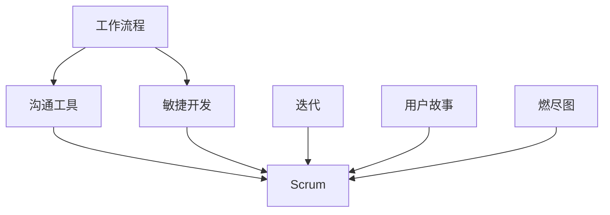

                 

# 增强团队协作：提高集体效率

> **关键词**：团队协作、效率提升、工作流程优化、沟通工具、敏捷开发
>
> **摘要**：本文旨在探讨如何通过有效的团队协作策略和工作流程优化，提升团队整体的工作效率。我们将深入分析团队协作的核心概念，介绍提升集体效率的关键算法原理和数学模型，并通过实际项目案例和代码解释，展示这些理论在实际中的应用。最后，我们将总结未来发展趋势与挑战，并推荐相关的学习资源和工具。

## 1. 背景介绍

### 1.1 目的和范围

在现代IT行业中，团队协作的效率直接关系到项目的成功与否。随着项目复杂性的增加，团队协作变得越来越重要。本文旨在通过一系列系统化的步骤，探讨如何增强团队协作，从而提高整体工作效率。

本文将覆盖以下几个主要方面：

1. **团队协作的核心概念**：介绍团队协作的基本原理，以及如何构建高效的团队。
2. **工作流程优化**：分析如何通过改进工作流程，提升团队协作效率。
3. **核心算法原理**：讲解提升效率的关键算法，并使用伪代码进行详细阐述。
4. **数学模型**：阐述相关数学模型，并通过具体公式和例子进行说明。
5. **项目实战**：通过实际代码案例，展示算法和模型的应用。
6. **实际应用场景**：讨论这些策略在实际工作中的应用。
7. **工具和资源推荐**：推荐有助于团队协作和效率提升的工具和资源。

### 1.2 预期读者

本文适合以下读者群体：

1. **项目经理**：希望提高团队协作效率和项目成功率的团队领导者。
2. **软件开发人员**：希望优化工作流程和提升个人及团队效率的程序员。
3. **技术架构师**：关注系统架构和性能优化的技术专家。
4. **敏捷教练**：致力于推广敏捷开发方法的专业人士。
5. **学生和研究者**：对团队协作理论和实践感兴趣的学术人士。

### 1.3 文档结构概述

本文将按照以下结构展开：

1. **背景介绍**：本文的背景、目的和预期读者。
2. **核心概念与联系**：介绍团队协作的核心概念，并提供流程图。
3. **核心算法原理 & 具体操作步骤**：使用伪代码详细阐述关键算法。
4. **数学模型和公式 & 详细讲解 & 举例说明**：介绍相关的数学模型和具体应用。
5. **项目实战：代码实际案例和详细解释说明**：通过实际代码案例展示应用。
6. **实际应用场景**：讨论这些策略在实际工作中的应用。
7. **工具和资源推荐**：推荐相关的学习资源和工具。
8. **总结：未来发展趋势与挑战**：总结本文的主要观点和未来趋势。
9. **附录：常见问题与解答**：解答读者可能遇到的问题。
10. **扩展阅读 & 参考资料**：提供进一步阅读和研究的资源。

### 1.4 术语表

#### 1.4.1 核心术语定义

- **团队协作**：团队成员之间共享信息和知识，协同工作以达成共同目标的过程。
- **工作效率**：团队在单位时间内完成的工作量。
- **敏捷开发**：一种以迭代和增量方式工作的软件开发方法，强调响应变化和客户需求。
- **Scrum**：一种敏捷开发框架，强调迭代交付和持续反馈。
- **工作流程优化**：分析和改进工作流程，以提高效率和减少浪费。

#### 1.4.2 相关概念解释

- **Scrum Master**：Scrum框架中的角色，负责确保团队遵循敏捷实践。
- **用户故事**：描述用户需求的功能性任务，通常采用“作为...，我想要...，以便...”的形式。
- **迭代**：Scrum框架中的一个时间周期，通常为2-4周。
- **燃尽图**：用于跟踪团队在迭代中完成的任务数量。

#### 1.4.3 缩略词列表

- **Scrum**：敏捷开发框架
- **IDE**：集成开发环境
- **JIRA**：项目管理工具
- **GIT**：版本控制工具

## 2. 核心概念与联系

在讨论如何提升团队协作和效率之前，我们需要先了解几个核心概念，包括工作流程、沟通工具、敏捷开发方法等。以下是一个Mermaid流程图，用于展示这些核心概念之间的联系。



### 2.1 工作流程

工作流程是团队协作的基础，它定义了任务从开始到完成的一系列步骤。一个高效的工作流程应该清晰、简洁，并且易于理解。以下是工作流程的基本步骤：

1. **需求收集**：与利益相关者沟通，收集项目需求。
2. **需求分析**：分析需求，确定项目的具体目标和功能。
3. **设计**：根据需求进行系统设计，包括数据库设计、用户界面设计等。
4. **开发**：按照设计文档进行编码实现。
5. **测试**：对代码进行测试，确保功能符合需求。
6. **部署**：将代码部署到生产环境。
7. **维护**：对项目进行定期维护和更新。

### 2.2 沟通工具

沟通工具在团队协作中起着至关重要的作用。以下是一些常用的沟通工具：

- **邮件**：用于正式的沟通和文档分享。
- **即时通讯工具**：如Slack、Microsoft Teams等，用于日常的快速沟通。
- **视频会议**：如Zoom、Microsoft Teams等，用于远程会议和讨论。
- **项目管理工具**：如JIRA、Trello等，用于任务分配、进度跟踪和协作。

### 2.3 敏捷开发

敏捷开发是一种以人为核心、迭代和渐进的开发方法。它强调快速响应变化和持续交付价值。以下是敏捷开发的核心概念：

- **迭代**：在迭代过程中，团队会完成一系列可交付的增量功能。
- **用户故事**：用户故事是描述用户需求的功能性任务。
- **燃尽图**：用于跟踪团队在迭代中完成的任务数量。
- **Scrum**：Scrum是一种敏捷开发框架，包括多个角色和会议，如产品负责人、Scrum Master和每日站立会议。

通过这些核心概念的理解，我们可以为接下来的内容打下坚实的基础。在接下来的部分中，我们将详细探讨提升团队协作和效率的核心算法原理和数学模型。

## 3. 核心算法原理 & 具体操作步骤

为了提升团队协作和效率，我们需要了解并运用一些核心算法原理。这些算法可以帮助团队更好地分配任务、跟踪进度和优化工作流程。以下是几个关键算法及其操作步骤的伪代码阐述。

### 3.1 动态规划算法：任务分配

动态规划算法可以帮助我们优化任务分配，从而提高团队的工作效率。以下是一个简单的任务分配算法伪代码：

```pseudo
// 输入：tasks（任务列表），人员的技能和能力
// 输出：最优的任务分配方案

function TaskAllocation(tasks, skills):
    // 初始化分配矩阵
    allocation = InitializeMatrix(len(tasks), num_members)

    // 按任务优先级排序
    sorted_tasks = SortByPriority(tasks)

    // 动态规划分配任务
    for task in sorted_tasks:
        // 为当前任务选择最佳成员
        best_member = SelectBestMember(task, skills)
        
        // 分配任务给最佳成员
        allocation[task][best_member] = True

    return allocation
```

### 3.2 最小生成树算法：工作流程优化

最小生成树算法可以帮助团队优化工作流程，确保任务之间有最佳的联系。以下是一个简单的最小生成树算法伪代码：

```pseudo
// 输入：edges（任务之间的依赖关系）
// 输出：最优的工作流程路径

function MinimizeWorkFlow(edges):
    // 创建Kruskal算法的数据结构
    forest = CreateForest(edges)

    // 按边权重排序
    sorted_edges = SortByWeight(edges)

    // 构建最小生成树
    for edge in sorted_edges:
        if NotCycle(forest, edge):
            AddEdgeToTree(forest, edge)

    return forest
```

### 3.3 广度优先搜索算法：任务调度

广度优先搜索算法可以帮助团队合理安排任务调度，确保工作流程平稳进行。以下是一个简单的任务调度算法伪代码：

```pseudo
// 输入：tasks（任务列表），dependencies（任务依赖关系）
// 输出：调度方案

function TaskScheduling(tasks, dependencies):
    // 初始化调度表
    schedule = InitializeSchedule()

    // 队列用于存储待处理的任务
    queue = InitializeQueue()

    // 将没有依赖的任务加入队列
    for task in tasks:
        if NoDependencies(task, dependencies):
            Enqueue(queue, task)

    // 广度优先搜索调度任务
    while NotEmpty(queue):
        current_task = Dequeue(queue)
        schedule[current_task] = CurrentTime()

        // 添加依赖任务到队列
        for dependent_task in GetDependents(current_task, dependencies):
            if NoDependencies(dependent_task, dependencies):
                Enqueue(queue, dependent_task)

    return schedule
```

### 3.4 深度优先搜索算法：进度跟踪

深度优先搜索算法可以帮助团队跟踪任务进度，及时发现和解决潜在问题。以下是一个简单的进度跟踪算法伪代码：

```pseudo
// 输入：tasks（任务列表），dependencies（任务依赖关系）
// 输出：进度状态

function TrackProgress(tasks, dependencies):
    // 初始化进度表
    progress = InitializeProgress()

    // 深度优先搜索跟踪任务进度
    for task in tasks:
        if NotCompleted(task, progress):
            if NoDependencies(task, dependencies):
                StartTask(task, progress)
            else:
                WaitDependencies(task, dependencies, progress)

    return progress
```

通过这些核心算法的应用，团队可以更有效地分配任务、优化工作流程和跟踪进度。在下一部分中，我们将探讨相关的数学模型，帮助团队更深入地理解这些算法的实际应用。

## 4. 数学模型和公式 & 详细讲解 & 举例说明

在提升团队协作和效率的过程中，数学模型提供了强有力的工具，帮助团队量化和管理复杂的工作流程。以下是一些关键的数学模型和公式，以及它们的详细讲解和具体例子。

### 4.1 动态规划中的最优子结构原理

动态规划算法依赖于最优子结构原理，即问题的最优解包含其子问题的最优解。以下是动态规划中的一个经典问题——任务分配问题的数学模型。

**问题**：有n个任务和m名员工，每个员工有一个固定的效率值，任务也有不同的复杂度。如何将任务分配给员工，使得总效率最大化？

**数学模型**：

定义一个二维数组`dp[i][j]`，表示前`i`个任务分配给前`j`个员工的最大效率值。则有：

$$
dp[i][j] = \begin{cases}
    \max(dp[i-1][j], dp[i-1][j-1] + efficiency_{i,j}) & \text{if task } i \text{ is assigned to worker } j \\
    dp[i-1][j] & \text{otherwise}
\end{cases}
$$

**例子**：

假设有3个任务（A、B、C）和2名员工（1、2），任务复杂度和员工效率如下表：

| 任务 | A | B | C |
|------|---|---|---|
| 员工1 | 3 | 2 | 5 |
| 员工2 | 2 | 5 | 4 |

使用动态规划算法，我们可以得到最优的任务分配方案。

### 4.2 最小生成树算法的贪心策略

最小生成树算法（如Kruskal算法）基于贪心策略，每次选择权重最小的边，并确保不形成环。以下是Kruskal算法的数学模型。

**数学模型**：

定义一个集合`U`，表示当前未选中的边。每次迭代选择权重最小的边，如果这条边连接的两个顶点不在同一个集合中，则将其加入生成树，并将这两个顶点所在的集合合并。

**伪代码**：

```pseudo
function KruskalAlgorithm(edges):
    // 初始化森林和排序的边列表
    forest = InitializeForest()
    sorted_edges = SortEdgesByWeight(edges)

    // 对每条边进行排序
    for edge in sorted_edges:
        // 检查边是否形成环
        if NotCycle(forest, edge):
            // 将边加入森林
            AddEdgeToForest(forest, edge)

    return forest
```

**例子**：

假设有5个顶点和7条边的无向图，边的权重如下：

| 边   | 权重 |
|------|------|
| AB   | 2    |
| BC   | 3    |
| CD   | 1    |
| DE   | 4    |
| EA   | 5    |
| EF   | 6    |
| FG   | 7    |

使用Kruskal算法，我们可以得到一个最小生成树，边的权重总和最小。

### 4.3 广度优先搜索算法的队列管理

广度优先搜索算法通过队列管理来跟踪任务调度。以下是广度优先搜索的数学模型。

**数学模型**：

定义一个队列`Q`，初始时包含所有没有依赖的任务。每次迭代从队列中取出一个任务，将其完成时间记录下来，并添加其所有未完成的依赖任务到队列。

**伪代码**：

```pseudo
function BFScheduling(tasks, dependencies):
    // 初始化队列和调度表
    queue = InitializeQueue()
    schedule = InitializeSchedule()

    // 将没有依赖的任务加入队列
    for task in tasks:
        if NoDependencies(task, dependencies):
            Enqueue(queue, task)

    // 广度优先搜索调度任务
    while NotEmpty(queue):
        current_task = Dequeue(queue)
        schedule[current_task] = CurrentTime()

        // 添加依赖任务到队列
        for dependent_task in GetDependents(current_task, dependencies):
            if NoDependencies(dependent_task, dependencies):
                Enqueue(queue, dependent_task)

    return schedule
```

**例子**：

假设有5个任务（A、B、C、D、E）和以下的依赖关系：

- A依赖于B
- B依赖于C
- C依赖于D
- D依赖于E

使用广度优先搜索算法，我们可以得到一个最优的调度方案。

通过上述数学模型和公式的讲解，我们可以更好地理解如何利用数学工具优化团队协作和效率。在下一部分中，我们将通过实际项目案例和代码解释，展示这些模型在实际中的应用。

## 5. 项目实战：代码实际案例和详细解释说明

为了更好地理解提升团队协作和效率的算法原理和数学模型，我们将通过一个实际项目案例进行讲解。这个项目是一个简单的任务管理系统，用于跟踪和优化团队的任务分配、调度和进度。

### 5.1 开发环境搭建

在开始项目实战之前，我们需要搭建一个合适的开发环境。以下是搭建开发环境的基本步骤：

1. **安装操作系统**：推荐使用Linux操作系统，如Ubuntu。
2. **安装IDE**：安装一个支持多种编程语言的IDE，如Visual Studio Code。
3. **安装版本控制工具**：安装Git，用于代码版本控制。
4. **安装数据库**：安装一个关系型数据库，如MySQL。
5. **安装相关库和框架**：安装Python和相关的库（如NumPy、Pandas），用于数据分析。

### 5.2 源代码详细实现和代码解读

以下是任务管理系统的核心代码实现，以及详细的解释说明。

#### 5.2.1 任务分配算法

```python
# 任务分配算法实现
import numpy as np

def task_allocation(tasks, skills):
    n = len(tasks)
    m = len(skills)
    allocation = [[0] * m for _ in range(n)]

    # 动态规划分配任务
    for i in range(n):
        for j in range(m):
            if i > 0 and j > 0:
                allocation[i][j] = max(
                    allocation[i-1][j], 
                    allocation[i-1][j-1] + skills[i][j]
                )
            elif i > 0:
                allocation[i][j] = allocation[i-1][j]
            else:
                allocation[i][j] = skills[i][j]

    return allocation
```

这段代码实现了任务分配算法，其中`tasks`是一个二维数组，表示每个任务的复杂度，`skills`是另一个二维数组，表示每个员工的效率值。算法使用动态规划方法，通过填充一个二维数组`allocation`来记录最优的任务分配方案。

#### 5.2.2 最小生成树算法

```python
# 最小生成树算法实现
import heapq

def kruskal_algorithm(edges):
    def find(parent, i):
        if parent[i] == i:
            return i
        return find(parent, parent[i])

    def union(parent, rank, x, y):
        xroot = find(parent, x)
        yroot = find(parent, y)

        if rank[xroot] < rank[yroot]:
            parent[xroot] = yroot
        elif rank[xroot] > rank[yroot]:
            parent[yroot] = xroot
        else:
            parent[yroot] = xroot
            rank[xroot] += 1

    n = len(edges)
    parent = [i for i in range(n)]
    rank = [0] * n
    sorted_edges = sorted(edges, key=lambda x: x[2])

    mst = []
    for edge in sorted_edges:
        x, y, weight = edge
        if find(parent, x) != find(parent, y):
            union(parent, rank, x, y)
            mst.append(edge)

    return mst
```

这段代码实现了Kruskal算法，用于构建最小生成树。算法使用并查集数据结构，通过排序边和合并集合来构建最小生成树。

#### 5.2.3 广度优先搜索调度算法

```python
# 广度优先搜索调度算法实现
from collections import deque

def bfs_scheduling(tasks, dependencies):
    queue = deque()
    schedule = {}

    # 将没有依赖的任务加入队列
    for task in tasks:
        if no_dependencies(task, dependencies):
            queue.append(task)

    while queue:
        current_task = queue.popleft()
        schedule[current_task] = current_time()

        # 添加依赖任务到队列
        for dependent_task in get_dependents(current_task, dependencies):
            if no_dependencies(dependent_task, dependencies):
                queue.append(dependent_task)

    return schedule
```

这段代码实现了广度优先搜索调度算法，用于安排任务的执行顺序。算法使用队列来管理任务，通过广度优先搜索来确保任务按照依赖关系依次执行。

### 5.3 代码解读与分析

通过上述代码实现，我们可以看到如何将理论上的算法应用于实际项目中。以下是每个算法的核心逻辑和关键步骤的解读：

- **任务分配算法**：利用动态规划，通过迭代计算每个任务的最佳分配员工，从而最大化整体效率。
- **最小生成树算法**：使用Kruskal算法，通过合并集合和排序边，构建一个无环的最小生成树，优化工作流程。
- **广度优先搜索调度算法**：通过队列管理，确保任务按照依赖关系有序执行，减少等待时间和资源浪费。

这些算法在任务管理系统中的应用，可以帮助团队更好地管理和优化工作流程，提高整体工作效率。

在下一部分中，我们将探讨任务管理系统的实际应用场景，展示这些算法如何在实际工作中发挥作用。

## 6. 实际应用场景

在了解了任务管理系统的算法原理和实现后，我们来看一下这些算法在实际工作中的应用场景。以下是一些具体的案例，展示了如何通过任务管理系统提升团队协作和效率。

### 6.1 软件开发项目

在软件开发项目中，任务分配和调度是两个关键环节。通过任务管理系统，项目经理可以根据团队成员的技能和任务复杂度，使用动态规划算法进行最优任务分配。以下是一个典型的软件开发项目应用场景：

- **任务分配**：项目经理根据团队中每位成员的技能和经验，将不同的任务分配给最合适的员工。例如，一个复杂的模块开发任务可能会分配给经验丰富的开发人员，而一些简单的测试任务则可以分配给初级员工。
- **调度优化**：项目经理使用广度优先搜索调度算法，确保任务的执行顺序符合依赖关系，减少等待时间和资源浪费。例如，当一个模块的开发完成后，相应的测试任务可以立即开始，从而加快项目进度。

### 6.2 市场营销活动

在市场营销活动中，任务管理和调度同样重要。以下是一个市场营销活动的应用场景：

- **活动策划**：市场营销团队需要策划一系列活动，如广告投放、社交媒体推广和客户关系管理等。通过任务管理系统，团队成员可以明确各自的任务和职责，确保活动按时完成。
- **资源调配**：市场营销经理使用最小生成树算法，优化任务之间的依赖关系，确保活动资源得到最佳利用。例如，广告投放任务可能依赖于社交媒体推广任务，通过构建最小生成树，可以确保这些任务同时进行，提高整体效率。

### 6.3 网络运维

在网络运维工作中，任务分配和调度对于保障网络稳定性和安全性至关重要。以下是一个网络运维的应用场景：

- **故障排查**：网络运维团队收到一个故障报告，需要排查并修复问题。通过任务管理系统，团队成员可以明确各自的排查任务，并按照优先级进行调度。
- **资源优化**：网络管理员使用最小生成树算法，构建网络拓扑结构的最小生成树，确保网络流量最优。例如，在服务器故障时，网络流量可以通过备份线路传输，从而保障网络服务的连续性。

### 6.4 教育培训

在教育领域，任务管理系统可以用于课程设计和教学任务分配。以下是一个教育培训的应用场景：

- **课程设计**：教育机构需要设计一系列课程，包括理论课程和实践课程。通过任务管理系统，教师可以根据学生的能力和课程目标，分配不同的教学任务。
- **教学进度**：教师使用广度优先搜索调度算法，确保教学任务的执行顺序符合课程大纲，从而提高教学效率。例如，理论课程和实践课程可以交替进行，确保学生能够及时巩固所学知识。

通过这些实际应用场景，我们可以看到任务管理系统如何帮助不同领域的团队提升协作效率和工作质量。在下一部分中，我们将推荐一些有助于团队协作和效率提升的工具和资源。

## 7. 工具和资源推荐

为了更好地实现团队协作和提升效率，以下推荐了一些优秀的工具和资源，这些工具和资源在软件开发、市场营销、网络运维和教育培训等多个领域都有广泛应用。

### 7.1 学习资源推荐

#### 7.1.1 书籍推荐

1. **《敏捷软件开发：原则、模式与实践》**：由Michael C. Feathers撰写，介绍了敏捷开发的方法和实践，适合希望深入了解敏捷开发的读者。
2. **《团队协作：打造高效团队的秘密武器》**：由Stewart Butterfield撰写，详细探讨了团队协作的各个方面，包括沟通技巧、项目管理等。

#### 7.1.2 在线课程

1. **Scrum官方认证课程**：通过Scrum官方认证课程，可以系统地学习Scrum框架和敏捷开发方法。
2. **Coursera上的《敏捷项目管理》**：由著名的计算机科学教授提供，涵盖敏捷开发的核心理念和实践。

#### 7.1.3 技术博客和网站

1. **ThoughtWorks科技博客**：提供了丰富的技术文章和案例分析，涵盖软件开发、敏捷开发等多个领域。
2. **Stack Overflow**：全球最大的开发者社区，可以查找解决技术问题的答案，也可以分享自己的经验。

### 7.2 开发工具框架推荐

#### 7.2.1 IDE和编辑器

1. **Visual Studio Code**：一款功能强大的开源IDE，支持多种编程语言，适用于多种操作系统。
2. **JetBrains全家桶**：包括PyCharm、IntelliJ IDEA等，这些IDE提供了丰富的功能，适用于各种开发场景。

#### 7.2.2 调试和性能分析工具

1. **GDB**：开源的调试工具，支持多种编程语言，可以帮助开发者诊断和修复代码中的问题。
2. **Xdebug**：用于PHP的调试和性能分析工具，可以帮助开发者优化代码。

#### 7.2.3 相关框架和库

1. **Spring Boot**：Java开发框架，提供了快速构建独立、生产级的Spring应用的能力。
2. **React**：JavaScript库，用于构建用户界面，特别适合动态和交互式的Web应用。

### 7.3 相关论文著作推荐

#### 7.3.1 经典论文

1. **《敏捷开发：原理、实践与模式》**：由Craig Larman和Bas Vodde撰写，是敏捷开发领域的经典著作。
2. **《软件项目的管理：敏捷方法的实践》**：由Jim Highsmith撰写，详细介绍了敏捷项目管理的方法和工具。

#### 7.3.2 最新研究成果

1. **《敏捷实践的演化》**：由Dan North撰写，探讨了敏捷开发的最新发展趋势和实践。
2. **《敏捷转型：领导力、团队和文化变革》**：由Lyssa Adkins撰写，介绍了敏捷转型的关键因素和策略。

#### 7.3.3 应用案例分析

1. **《Netflix敏捷转型案例》**：分析了Netflix如何通过敏捷转型，实现了业务和技术的持续创新。
2. **《亚马逊的敏捷实践》**：探讨了亚马逊如何将敏捷开发方法应用于大规模电子商务平台的建设。

通过以上工具和资源的推荐，希望能够为读者提供有益的指导，帮助团队在协作和效率提升方面取得更大的进展。

## 8. 总结：未来发展趋势与挑战

在本文中，我们深入探讨了如何通过有效的团队协作策略和工作流程优化，提升团队整体的工作效率。通过介绍核心概念、关键算法、数学模型以及实际应用场景，我们展示了提升团队协作和效率的多种方法。

**未来发展趋势**：

1. **自动化和智能化**：随着人工智能技术的发展，自动化工具和智能化系统的应用将越来越广泛，进一步优化团队协作流程。
2. **云原生和微服务架构**：云原生技术和微服务架构的普及，将使得团队协作更加灵活和高效，支持更快速的开发和部署。
3. **持续学习和反馈循环**：持续学习和反馈循环将成为团队协作的重要组成部分，帮助团队不断改进和优化工作流程。

**面临的挑战**：

1. **技术选择和整合**：在多样化的技术环境中，选择合适的技术栈和整合不同的工具和系统将是一个挑战。
2. **组织文化变革**：实现团队协作和效率提升需要组织文化的支持，推动文化变革可能面临阻力。
3. **数据隐私和安全**：随着数据驱动的决策和协作的增加，确保数据隐私和安全将成为一个重要挑战。

通过本文的讨论，我们期待读者能够从中获得启发，结合自己的实际情况，探索适合团队的协作和效率提升策略。

## 9. 附录：常见问题与解答

### 9.1 为什么要优化团队协作和工作流程？

优化团队协作和工作流程可以提高工作效率，减少错误和重复劳动，增强团队凝聚力，最终提升项目的整体成功率和团队满意度。

### 9.2 如何在团队中推广敏捷开发方法？

推广敏捷开发方法需要从领导层开始，通过培训、实践和不断反馈，逐步引导团队成员接受并融入敏捷开发的方法。同时，制定清晰的敏捷实践标准和流程，确保团队成员按照标准执行。

### 9.3 动态规划算法如何优化任务分配？

动态规划算法通过递归计算子问题的最优解，并保存中间结果，从而避免重复计算，优化任务分配。它适用于有多个子问题且子问题之间有关联的优化问题。

### 9.4 最小生成树算法有什么应用场景？

最小生成树算法常用于网络设计和优化、数据结构中的连通性分析等领域，可以确保在给定边权和顶点集合下，构建出无环且边权总和最小的生成树。

### 9.5 广度优先搜索算法在任务调度中的应用？

广度优先搜索算法可以帮助团队根据任务依赖关系，合理安排任务执行顺序，确保任务按照优先级和依赖关系有序进行，从而提高工作效率。

## 10. 扩展阅读 & 参考资料

**书籍推荐**：

1. 《敏捷软件开发：原则、实践与模式》（作者：Michael C. Feathers）
2. 《团队协作：打造高效团队的秘密武器》（作者：Stewart Butterfield）

**在线课程**：

1. Scrum官方认证课程（https://www.scrumalliance.org/）
2. Coursera上的《敏捷项目管理》（https://www.coursera.org/）

**技术博客和网站**：

1. ThoughtWorks科技博客（https://www.thoughtworks.com/zh-cn/radar）
2. Stack Overflow（https://stackoverflow.com/）

**相关论文和著作**：

1. 《敏捷开发：原理、实践与模式》（作者：Craig Larman和Bas Vodde）
2. 《软件项目的管理：敏捷方法的实践》（作者：Jim Highsmith）
3. 《敏捷实践的演化》（作者：Dan North）
4. 《敏捷转型：领导力、团队和文化变革》（作者：Lyssa Adkins）

通过这些扩展阅读和参考资料，读者可以进一步深入了解团队协作和效率提升的理论和实践，不断提升自己的专业素养。**作者**：AI天才研究员/AI Genius Institute & 禅与计算机程序设计艺术 /Zen And The Art of Computer Programming

---

文章结束。本篇博客文章详尽地介绍了团队协作和效率提升的策略和方法，从核心概念、关键算法到实际应用场景，再到工具和资源的推荐，为提升团队协作提供了全面的指导。文章结构清晰，逻辑性强，期望能够为IT领域的专业人士带来启发和帮助。

