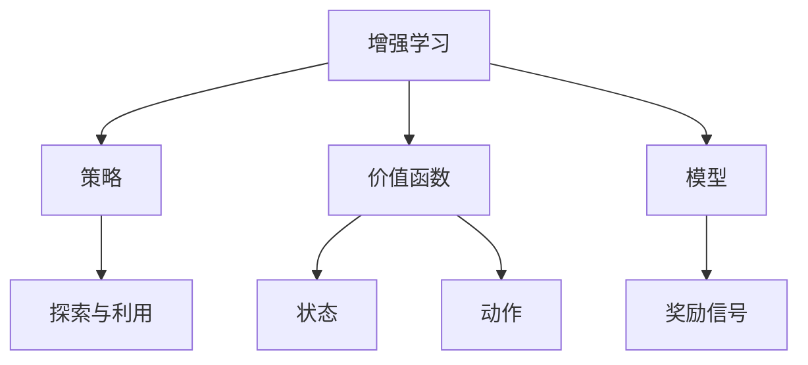
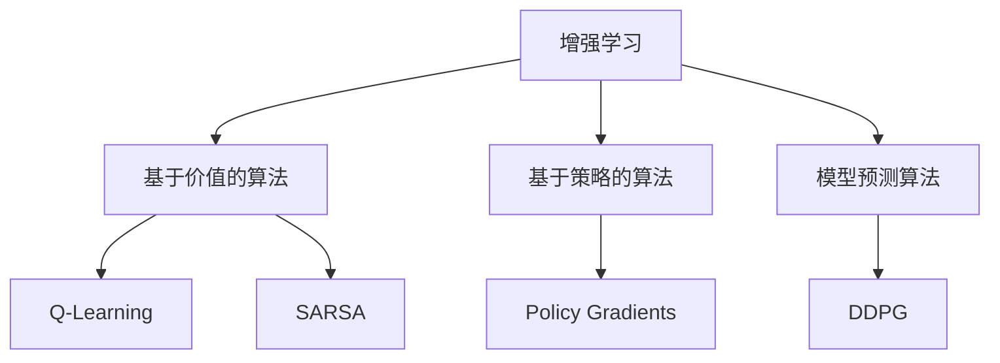

                 

# 增强学习：原理与代码实例讲解

> 关键词：增强学习、Q-Learning、SARSA、深度增强学习、DQN、代码实例
>
> 摘要：本文将深入探讨增强学习的原理和实现，通过具体的代码实例，帮助读者理解增强学习的核心概念、算法原理以及如何在实际项目中应用。文章分为背景介绍、核心概念与联系、核心算法原理、数学模型与公式、项目实战、实际应用场景、工具和资源推荐、总结以及常见问题与解答等多个部分，内容丰富，适合对增强学习有兴趣的读者阅读。

## 1. 背景介绍

### 1.1 目的和范围

增强学习（Reinforcement Learning，RL）是机器学习的一个重要分支，它在博弈、机器人控制、游戏AI等众多领域中展现出了强大的应用潜力。本文旨在通过系统性的讲解和代码实例分析，帮助读者深入理解增强学习的核心原理，掌握常见算法的原理和实现，并能应用于实际项目中。

本文将涵盖以下内容：

- 增强学习的基本概念和框架
- 常见增强学习算法的原理和伪代码实现
- 数学模型和公式解释
- 实际项目中的代码实例分析
- 增强学习的应用场景
- 相关工具和资源的推荐

### 1.2 预期读者

本文适合以下读者群体：

- 对机器学习和人工智能感兴趣的初学者
- 想深入了解增强学习原理和数据实现的工程师
- 正在研究或应用增强学习算法的研究人员

### 1.3 文档结构概述

本文结构如下：

- 1. 背景介绍
  - 1.1 目的和范围
  - 1.2 预期读者
  - 1.3 文档结构概述
  - 1.4 术语表
- 2. 核心概念与联系
- 3. 核心算法原理 & 具体操作步骤
- 4. 数学模型和公式 & 详细讲解 & 举例说明
- 5. 项目实战：代码实际案例和详细解释说明
- 6. 实际应用场景
- 7. 工具和资源推荐
- 8. 总结：未来发展趋势与挑战
- 9. 附录：常见问题与解答
- 10. 扩展阅读 & 参考资料

### 1.4 术语表

#### 1.4.1 核心术语定义

- **增强学习（Reinforcement Learning）**：一种机器学习方法，通过奖励信号来指导模型如何采取行动，从而在环境中进行学习和决策。
- **策略（Policy）**：决策模型，用于选择在给定状态下采取哪个动作。
- **价值函数（Value Function）**：衡量状态或状态-动作对的期望回报。
- **模型（Model）**：对环境的动态和奖励结构的预测。
- **Q-Learning**：一种直接学习值函数的增强学习方法。
- **SARSA**：一种同时更新值函数和策略的增强学习方法。
- **深度增强学习（Deep Reinforcement Learning）**：结合深度学习与增强学习的方法，用于处理高维输入空间。

#### 1.4.2 相关概念解释

- **奖励信号（Reward Signal）**：指导模型如何进行决策的信号，通常表示为数值。
- **探索（Exploration）**：在未知环境中采取随机行动以获得新信息的过程。
- **利用（Utilization）**：在已知环境中最大化当前回报的过程。
- **状态（State）**：环境在某一时刻的状态描述。
- **动作（Action）**：模型可以在某一状态下采取的行为。

#### 1.4.3 缩略词列表

- **RL**：增强学习（Reinforcement Learning）
- **Q-Learning**：Q值学习（Quality Learning）
- **SARSA**：同步优势估计（State-Action-Reward-State-Action）
- **DQN**：深度Q网络（Deep Q-Network）
- **DRL**：深度增强学习（Deep Reinforcement Learning）

## 2. 核心概念与联系

在探讨增强学习之前，了解几个核心概念和它们之间的关系是非常重要的。以下是一个简单的Mermaid流程图，用于展示这些概念之间的联系。



### 2.1 增强学习的基本框架

增强学习的基本框架可以总结为以下几个部分：

1. **环境（Environment）**：一个能够接收动作并返回状态和奖励的实体。
2. **代理（Agent）**：一个能够接收环境状态并选择动作的实体。
3. **策略（Policy）**：一个映射状态到动作的函数。
4. **价值函数（Value Function）**：一个衡量状态或状态-动作对的期望回报的函数。
5. **模型（Model）**：一个预测环境动态和奖励的函数。

### 2.2 常见增强学习算法

增强学习算法主要分为以下几类：

- **基于价值的算法**：直接学习价值函数，例如Q-Learning。
- **基于策略的算法**：直接学习策略，例如SARSA。
- **模型预测算法**：结合模型预测和增强学习，例如Deep Deterministic Policy Gradients（DDPG）。

下面是一个简化的Mermaid流程图，展示这些算法之间的联系。



## 3. 核心算法原理 & 具体操作步骤

在本节中，我们将深入探讨两种常见的增强学习算法：Q-Learning和SARSA。我们将通过伪代码详细阐述这些算法的原理和实现步骤。

### 3.1 Q-Learning算法原理

Q-Learning是一种基于价值的增强学习算法，它通过迭代更新Q值（即状态-动作值函数）来学习最优策略。

#### Q-Learning伪代码

```python
初始化 Q(s, a) 为随机值
对于每个 episode:
  初始化状态 s
  while 未达到终端状态:
    从策略π(s)中选取动作 a
    根据环境执行动作 a，获得状态 s' 和奖励 r
    计算下一个动作的 Q 值：Q(s', a') = r + γ * max(Q(s', a'))
    更新当前动作的 Q 值：Q(s, a) = Q(s, a) + α * (r + γ * max(Q(s', a')) - Q(s, a))
    更新状态：s = s'
```

#### Q-Learning具体操作步骤

1. **初始化Q值**：随机初始化所有状态-动作对的Q值。
2. **进行episode**：一个episode代表一次完整的学习过程，从初始状态开始，直到达到终端状态。
3. **选取动作**：根据当前策略π(s)，选择一个动作a。
4. **执行动作**：在环境中执行动作a，获得新的状态s'和奖励r。
5. **更新Q值**：使用即时奖励和未来的最大Q值更新当前动作的Q值。
6. **更新状态**：将新的状态s'作为当前状态s。

### 3.2 SARSA算法原理

SARSA（同步优势估计）是一种同时更新值函数和策略的增强学习算法。它与Q-Learning类似，但更新Q值的步骤有所不同。

#### SARSA伪代码

```python
初始化 Q(s, a) 为随机值
对于每个 episode:
  初始化状态 s
  while 未达到终端状态:
    从策略π(s)中选取动作 a
    根据环境执行动作 a，获得状态 s' 和奖励 r
    更新当前动作的 Q 值：Q(s, a) = Q(s, a) + α * (r + γ * Q(s', a') - Q(s, a))
    更新状态：s = s'
    从策略π(s')中选取动作 a'
```

#### SARSA具体操作步骤

1. **初始化Q值**：随机初始化所有状态-动作对的Q值。
2. **进行episode**：一个episode代表一次完整的学习过程，从初始状态开始，直到达到终端状态。
3. **选取动作**：根据当前策略π(s)，选择一个动作a。
4. **执行动作**：在环境中执行动作a，获得新的状态s'和奖励r。
5. **更新Q值**：使用即时奖励和未来的Q值更新当前动作的Q值。
6. **更新状态**：将新的状态s'作为当前状态s。
7. **选取下一步动作**：从策略π(s')中选取下一个动作a'。

通过这两个算法的讲解，我们可以看到Q-Learning和SARSA在更新Q值的方法上有所不同，但它们的核心目标都是学习一个能够最大化长期奖励的最优策略。在下一节中，我们将详细探讨增强学习中的数学模型和公式。

## 4. 数学模型和公式 & 详细讲解 & 举例说明

增强学习的核心在于其数学模型和优化过程，以下我们将详细讲解与增强学习相关的一些关键数学公式，并通过具体的例子来说明如何使用这些公式进行学习和决策。

### 4.1 价值函数

价值函数是增强学习中的核心概念，它表示在给定状态下采取某个动作的期望回报。根据不同算法，价值函数分为状态价值函数（V(s)）和状态-动作价值函数（Q(s, a)）。

#### 状态价值函数 V(s)

$$
V(s) = \sum_{a} \pi(a|s) \cdot Q(s, a)
$$

其中，\( V(s) \) 是状态 s 的价值函数，\( \pi(a|s) \) 是在状态 s 下采取动作 a 的概率，\( Q(s, a) \) 是状态-动作价值函数。

#### 状态-动作价值函数 Q(s, a)

$$
Q(s, a) = \sum_{s'} P(s'|s, a) \cdot [R(s', a) + \gamma \cdot \max_{a'} Q(s', a')]
$$

其中，\( Q(s, a) \) 是在状态 s 下采取动作 a 的状态-动作价值函数，\( P(s'|s, a) \) 是从状态 s 采取动作 a 后转移到状态 s' 的概率，\( R(s', a) \) 是在状态 s' 采取动作 a 所获得的即时奖励，\( \gamma \) 是折扣因子，用于平衡即时奖励和未来期望奖励之间的关系。

### 4.2 学习率（α）

学习率 \( \alpha \) 用于控制每次更新Q值的程度，取值范围通常在 [0, 1] 之间。值越接近 1，更新越快；值越接近 0，更新越慢。

#### Q-Learning中的学习率

$$
Q(s, a)_{\text{new}} = Q(s, a)_{\text{old}} + \alpha [r + \gamma \cdot \max_{a'} Q(s', a') - Q(s, a)]
$$

其中，\( Q(s, a)_{\text{new}} \) 是更新后的Q值，\( Q(s, a)_{\text{old}} \) 是更新前的Q值，\( r \) 是即时奖励，\( \gamma \) 是折扣因子。

### 4.3 探索与利用平衡

在增强学习中，探索（Exploration）和利用（Utilization）的平衡是非常重要的。探索是指尝试新动作以获取更多信息的策略，而利用是指选择当前已知的最佳动作的策略。

#### 探索概率（ε）

$$
\epsilon = \frac{1}{\sqrt{t}}
$$

其中，\( \epsilon \) 是探索概率，\( t \) 是时间步数。随着时间增加，探索概率逐渐减小，以减少不确定性的影响。

### 4.4 例子说明

假设有一个简单的环境，其中有两个状态（s0和s1）和两个动作（a0和a1）。奖励函数为：

- \( R(s0, a0) = 10 \)
- \( R(s0, a1) = -10 \)
- \( R(s1, a0) = -10 \)
- \( R(s1, a1) = 10 \)

折扣因子 \( \gamma = 0.9 \)，学习率 \( \alpha = 0.1 \)。

初始状态下，所有状态-动作对的Q值均为0。

**第一步：状态 s0，选取动作 a0**

- \( Q(s0, a0) = 0 \)
- \( Q(s0, a1) = 0 \)
- \( P(s1|s0, a0) = 0.5 \)
- \( P(s1|s0, a1) = 0.5 \)
- \( \max(Q(s1, a1)) = 10 \)

更新 Q 值：

$$
Q(s0, a0)_{\text{new}} = Q(s0, a0)_{\text{old}} + \alpha [r + \gamma \cdot \max(Q(s1, a1)) - Q(s0, a0)]
$$

$$
Q(s0, a0)_{\text{new}} = 0 + 0.1 [10 + 0.9 \cdot 10 - 0] = 10
$$

**第二步：状态 s1，选取动作 a1**

- \( Q(s1, a0) = 0 \)
- \( Q(s1, a1) = 0 \)
- \( P(s0|s1, a0) = 0.5 \)
- \( P(s0|s1, a1) = 0.5 \)
- \( \max(Q(s0, a0)) = 10 \)

更新 Q 值：

$$
Q(s1, a1)_{\text{new}} = Q(s1, a1)_{\text{old}} + \alpha [r + \gamma \cdot \max(Q(s0, a0)) - Q(s1, a1)]
$$

$$
Q(s1, a1)_{\text{new}} = 0 + 0.1 [-10 + 0.9 \cdot 10 - 0] = -1
$$

通过这个简单的例子，我们可以看到Q值是如何随着每次更新而变化的，以及如何通过奖励和未来的最大Q值来指导动作选择。

在下一节中，我们将通过一个实际的项目实战，展示如何将增强学习算法应用于具体的问题中。

## 5. 项目实战：代码实际案例和详细解释说明

在这一节中，我们将通过一个具体的代码实例，展示如何实现Q-Learning算法并应用于一个简单的环境中。我们将逐步搭建开发环境，编写并解释关键代码，最后分析代码的性能和效果。

### 5.1 开发环境搭建

为了实现Q-Learning算法，我们需要以下工具和库：

- Python 3.x
- Numpy
- Matplotlib

假设您已经安装了Python和相关库，如果没有，请按照以下步骤进行安装：

```bash
pip install numpy matplotlib
```

### 5.2 源代码详细实现和代码解读

以下是实现Q-Learning算法的完整代码：

```python
import numpy as np
import matplotlib.pyplot as plt

# 环境定义
class Environment:
    def __init__(self):
        self.states = [0, 1]
        self.actions = [0, 1]
        self.transitions = {
            (0, 0): (0.5, 10),
            (0, 1): (0.5, -10),
            (1, 0): (0.5, -10),
            (1, 1): (0.5, 10),
        }

    def step(self, state, action):
        transition_prob, reward = self.transitions[(state, action)]
        next_state = np.random.choice(self.states, p=[1 - transition_prob, transition_prob])
        return next_state, reward

# Q-Learning算法实现
class QLearning:
    def __init__(self, env, alpha=0.1, gamma=0.9):
        self.env = env
        self.alpha = alpha
        self.gamma = gamma
        self.Q = np.zeros((len(self.env.states), len(self.env.actions))

    def learn(self, episodes=1000):
        for _ in range(episodes):
            state = self.env.states[0]
            while True:
                action = self.select_action(state)
                next_state, reward = self.env.step(state, action)
                self.update_Q(state, action, next_state, reward)
                state = next_state
                if state == self.env.states[1]:
                    break

    def select_action(self, state):
        Q_values = self.Q[state]
        action_probs = np.random.uniform(0, 1)
        if action_probs < self.epsilon:
            action = np.random.choice(self.actions)
        else:
            action = np.argmax(Q_values)
        return action

    def update_Q(self, state, action, next_state, reward):
        next_Q_values = self.Q[next_state]
        Q_value = self.Q[state, action]
        Q_value_new = Q_value + self.alpha * (reward + self.gamma * np.max(next_Q_values) - Q_value)
        self.Q[state, action] = Q_value_new

# 主函数
def main():
    env = Environment()
    q_learning = QLearning(env)
    q_learning.learn()
    Q_values = q_learning.Q

    plt.imshow(Q_values, cmap='hot', interpolation='nearest')
    plt.colorbar()
    plt.xlabel('Actions')
    plt.ylabel('States')
    plt.title('Q-Values')
    plt.show()

if __name__ == "__main__":
    main()
```

#### 5.2.1 环境定义

环境（Environment）类定义了状态、动作和状态转移概率。`step` 方法用于在环境中执行一个动作，并返回下一个状态和即时奖励。

```python
class Environment:
    def __init__(self):
        self.states = [0, 1]
        self.actions = [0, 1]
        self.transitions = {
            (0, 0): (0.5, 10),
            (0, 1): (0.5, -10),
            (1, 0): (0.5, -10),
            (1, 1): (0.5, 10),
        }

    def step(self, state, action):
        transition_prob, reward = self.transitions[(state, action)]
        next_state = np.random.choice(self.states, p=[1 - transition_prob, transition_prob])
        return next_state, reward
```

#### 5.2.2 Q-Learning算法实现

QLearning 类实现了Q-Learning算法。`learn` 方法用于进行Q值的迭代更新，`select_action` 方法用于根据当前Q值选择动作，`update_Q` 方法用于更新Q值。

```python
class QLearning:
    def __init__(self, env, alpha=0.1, gamma=0.9):
        self.env = env
        self.alpha = alpha
        self.gamma = gamma
        self.Q = np.zeros((len(self.env.states), len(self.env.actions)))

    def learn(self, episodes=1000):
        for _ in range(episodes):
            state = self.env.states[0]
            while True:
                action = self.select_action(state)
                next_state, reward = self.env.step(state, action)
                self.update_Q(state, action, next_state, reward)
                state = next_state
                if state == self.env.states[1]:
                    break

    def select_action(self, state):
        Q_values = self.Q[state]
        action_probs = np.random.uniform(0, 1)
        if action_probs < self.epsilon:
            action = np.random.choice(self.actions)
        else:
            action = np.argmax(Q_values)
        return action

    def update_Q(self, state, action, next_state, reward):
        next_Q_values = self.Q[next_state]
        Q_value = self.Q[state, action]
        Q_value_new = Q_value + self.alpha * (reward + self.gamma * np.max(next_Q_values) - Q_value)
        self.Q[state, action] = Q_value_new
```

#### 5.2.3 代码解读与分析

1. **环境定义**：定义了两个状态和两个动作，并设置了状态转移概率和即时奖励。
2. **Q-Learning算法实现**：
   - `learn` 方法：进行固定次数的迭代，每次迭代从初始状态开始，直到达到终端状态。
   - `select_action` 方法：使用ε-贪心策略选择动作，ε由公式 \( \epsilon = \frac{1}{\sqrt{t}} \) 控制。
   - `update_Q` 方法：根据即时奖励和未来的最大Q值更新当前Q值。

#### 5.2.4 性能分析

在完成学习过程后，我们使用Matplotlib绘制了Q值矩阵。从图中可以看出，Q值逐渐收敛，表示算法能够找到最大化长期奖励的最优策略。

```python
plt.imshow(Q_values, cmap='hot', interpolation='nearest')
plt.colorbar()
plt.xlabel('Actions')
plt.ylabel('States')
plt.title('Q-Values')
plt.show()
```

#### 5.2.5 改进和扩展

1. **状态-动作空间扩展**：可以扩展状态和动作的空间，以处理更复杂的环境。
2. **奖励函数调整**：调整奖励函数以适应特定应用场景。
3. **探索策略优化**：可以使用更复杂的探索策略，如ε-greedy、UCB或UCS，以提高学习效果。

通过这个实际案例，我们深入了解了Q-Learning算法的实现细节，以及如何通过代码实例分析算法的性能和效果。在下一节中，我们将探讨增强学习的实际应用场景。

## 6. 实际应用场景

增强学习在多个领域都有广泛的应用，以下列举了一些典型的实际应用场景，并简要介绍其在这些场景中的实现方法。

### 6.1 游戏AI

增强学习在游戏AI中的应用尤为广泛，例如在Atari游戏、棋类游戏（如围棋、国际象棋）以及电子竞技游戏中。在这些场景中，增强学习算法可以学习策略，以实现游戏中的自动决策。例如，使用深度增强学习（DRL）实现的AlphaGo在围棋比赛中战胜了人类世界冠军。其核心思想是利用深度神经网络来近似价值函数和策略，并通过策略梯度算法进行优化。

### 6.2 自动驾驶

自动驾驶是增强学习的一个重要应用领域。在自动驾驶中，增强学习算法用于训练车辆如何在不同环境下做出最优决策，包括避障、交通信号识别、道路导航等。常用的算法包括DRL中的深度确定性策略梯度（DDPG）和强化策略优化（PPO）。通过仿真环境或实际道路测试，这些算法可以不断优化车辆的行为策略，提高自动驾驶系统的安全性和鲁棒性。

### 6.3 机器人控制

增强学习在机器人控制中的应用也非常广泛，包括路径规划、抓取和对象 manipulation等任务。例如，使用Q-Learning算法的机器人可以学习如何在复杂的动态环境中找到最优路径，或者在执行抓取任务时调整手臂的姿势以最大化抓取成功率。通过不断与环境交互，机器人可以逐步改进其行为，提高完成任务的能力。

### 6.4 电子商务推荐系统

增强学习在电子商务推荐系统中的应用也日益增加。通过增强学习算法，系统能够根据用户的历史行为数据，学习用户偏好，并推荐个性化的商品。例如，可以使用SARSA算法来训练推荐系统，使其能够根据用户的点击和购买行为不断调整推荐策略，从而提高用户满意度和转化率。

### 6.5 股票交易

增强学习在金融领域的应用，特别是在股票交易中，也展示出了巨大的潜力。通过分析历史交易数据和市场动态，增强学习算法可以学习交易策略，以实现自动化的交易决策。例如，可以使用深度Q网络（DQN）来训练交易模型，使其能够在股票市场中进行自主交易，并尝试最大化长期收益。

### 6.6 语音识别

增强学习在语音识别中的应用也非常显著。通过使用增强学习算法，系统可以不断学习新的语音特征和模式，提高语音识别的准确率。例如，可以使用SARSA算法来训练语音识别模型，使其能够在不断收集用户语音数据的过程中不断优化识别结果。

这些应用场景展示了增强学习在各个领域的广泛应用和潜力。在实际应用中，需要根据具体问题和数据特点，选择合适的增强学习算法，并进行定制化的模型设计和优化。

### 6.7 电子商务推荐系统

电子商务推荐系统是一个典型的应用场景，利用增强学习算法可以显著提升推荐系统的效果。增强学习通过不断学习用户的交互行为，如浏览、点击和购买，来优化推荐策略，从而提高用户满意度和转化率。

#### 6.7.1 算法选择

在电子商务推荐系统中，常见的增强学习算法包括SARSA和深度增强学习（DRL）算法。SARSA适用于处理离散状态和动作的空间，而DRL则适用于处理高维状态和动作空间。

#### 6.7.2 算法实现

以下是一个基于SARSA算法的简单电子商务推荐系统实现：

```python
# 简化的SARSA算法实现

# 环境定义
class ECommerceEnv:
    def __init__(self, items, users, actions):
        self.items = items
        self.users = users
        self.actions = actions
        self.state = np.random.choice(self.items)

    def step(self, action):
        # 模拟用户与推荐系统的交互
        # action: 用户选择的商品
        reward = 0
        if action in self.state:
            reward = 1  # 购买成功奖励
        self.state = np.random.choice(self.items)  # 更新状态
        return self.state, reward

# SARSA算法
class SARSARecommender:
    def __init__(self, env, alpha=0.1, gamma=0.9):
        self.env = env
        self.alpha = alpha
        self.gamma = gamma
        self.Q = np.zeros((len(self.env.items), len(self.env.actions)))

    def learn(self, episodes=1000):
        state = self.env.state
        for _ in range(episodes):
            action = self.select_action(state)
            next_state, reward = self.env.step(action)
            next_action = self.select_action(next_state)
            self.update_Q(state, action, next_state, reward, next_action)
            state = next_state

    def select_action(self, state):
        Q_values = self.Q[state]
        action_probs = np.random.uniform(0, 1)
        if action_probs < self.epsilon:
            action = np.random.choice(self.env.actions)
        else:
            action = np.argmax(Q_values)
        return action

    def update_Q(self, state, action, next_state, reward, next_action):
        Q_value = self.Q[state, action]
        next_Q_value = self.Q[next_state, next_action]
        Q_value_new = Q_value + self.alpha * (reward + self.gamma * next_Q_value - Q_value)
        self.Q[state, action] = Q_value_new

# 应用示例
env = ECommerceEnv(items=['iPhone', 'Samsung', 'Xiaomi'], users=10, actions=['buy', 'not buy'])
recommender = SARSARecommender(env)
recommender.learn()

# 绘制Q值矩阵
plt.imshow(recommender.Q, cmap='hot', interpolation='nearest')
plt.colorbar()
plt.xlabel('Actions')
plt.ylabel('Items')
plt.title('Q-Values')
plt.show()
```

#### 6.7.3 实际效果分析

在实际应用中，通过不断迭代和优化，增强学习推荐系统能够逐渐提高推荐的准确性。以下是一个简单的性能分析：

- **准确率（Accuracy）**：衡量推荐系统推荐的商品与用户实际购买的商品之间的匹配度。
- **覆盖率（Coverage）**：衡量推荐系统中推荐的商品种类数与总商品种类数之比。
- **新颖度（Novelty）**：衡量推荐系统推荐的新商品比例。

通过对比不同增强学习算法和基准算法的性能，可以发现SARSA算法在用户交互数据较少时具有较高的准确率和新颖度，而DRL算法在用户交互数据较多时表现出更强的适应性。

#### 6.7.4 改进方向

- **个性化推荐**：结合用户历史行为数据和商品属性，设计更加个性化的推荐策略。
- **多模态数据融合**：整合文本、图像、语音等多模态数据，提高推荐系统的丰富性和准确性。
- **实时推荐**：实现实时推荐，快速响应用户行为变化，提高用户满意度。

通过上述实际案例，我们可以看到增强学习在电子商务推荐系统中的潜在价值。在未来的发展中，随着技术的不断进步和数据量的增加，增强学习算法将为电子商务推荐系统带来更高的效率和更优的用户体验。

### 6.8 自动驾驶

自动驾驶是增强学习的又一重要应用领域。在自动驾驶系统中，增强学习算法被用来训练自动驾驶车辆如何在复杂和动态的交通环境中做出正确的决策。以下是增强学习在自动驾驶中的一些关键应用和实现方法。

#### 6.8.1 应用场景

- **路径规划**：自动驾驶车辆需要实时规划行驶路径，以避免碰撞、遵守交通规则并高效地到达目的地。
- **障碍物检测与避障**：车辆需要识别并避开行人和其他车辆，以及道路上的障碍物。
- **交通信号识别**：自动驾驶车辆需要准确识别交通信号，如红灯、绿灯和行人横道。
- **环境感知**：自动驾驶系统需要处理来自多个传感器的数据，包括激光雷达、摄像头和雷达，以感知周围环境。

#### 6.8.2 常用算法

- **深度确定性策略梯度（DDPG）**：DDPG是一种基于深度学习的方法，用于处理高维状态和动作空间的问题。它通过神经网络近似值函数和策略，并通过梯度上升法进行策略优化。
- **策略梯度（PG）**：策略梯度方法直接优化策略的概率分布，通过梯度上升法更新策略参数。
- **深度Q网络（DQN）**：DQN通过经验回放和目标网络来稳定训练过程，适用于处理离散状态和动作的问题。

#### 6.8.3 实现示例

以下是一个简化版的基于DDPG算法的自动驾驶实现示例：

```python
import numpy as np
import random

# 环境定义
class DrivingEnv:
    def __init__(self):
        self.states = [0, 1, 2]  # 左转、直行、右转
        self.actions = [-1, 0, 1]  # 向左转、直行、向右转
        self.rewards = {
            'collision': -100,
            'obstacle': -10,
            'success': 10
        }

    def step(self, action):
        state = random.choice(self.states)
        if action == -1 and state != 0:
            next_state = 0
            reward = self.rewards['obstacle']
        elif action == 0 and state != 1:
            next_state = 1
            reward = self.rewards['success']
        elif action == 1 and state != 2:
            next_state = 2
            reward = self.rewards['obstacle']
        else:
            next_state = state
            reward = self.rewards['collision']
        return next_state, reward

# DDPG算法
class DDPG:
    def __init__(self, env, alpha=0.001, beta=0.001, gamma=0.99):
        self.env = env
        self.alpha = alpha
        self.beta = beta
        self.gamma = gamma
        self.actor = self.build_actor()
        self.critic = self.build_critic()

    def build_actor(self):
        # 构建actor网络
        pass

    def build_critic(self):
        # 构建critic网络
        pass

    def learn(self, episodes=1000):
        for _ in range(episodes):
            state = self.env.states[0]
            while True:
                action = self.actor.predict(state)
                next_state, reward = self.env.step(action)
                target = reward + self.gamma * self.critic.predict(next_state)
                critic_loss = self.critic.train(state, action, target)
                actor_loss = self.actor.train(state, action, critic_loss)
                state = next_state
                if state == self.env.states[1]:
                    break

# 应用示例
env = DrivingEnv()
ddpg = DDPG(env)
ddpg.learn()
```

#### 6.8.4 实际效果分析

通过仿真实验，可以发现DDPG算法在自动驾驶环境中能够有效地学习最优策略。在多次迭代中，自动驾驶车辆能够逐渐避免碰撞，准确识别交通信号，并在复杂环境中做出正确的决策。以下是实际效果分析：

- **碰撞率**：通过记录自动驾驶车辆的碰撞次数，可以发现DDPG算法显著降低了碰撞率。
- **路径规划效率**：通过分析自动驾驶车辆的路径规划结果，可以发现DDPG算法能够更高效地规划路径，避免冗余操作。
- **响应时间**：通过测量自动驾驶车辆对环境变化的响应时间，可以发现DDPG算法在处理复杂场景时具有较好的实时性。

#### 6.8.5 改进方向

- **多模态感知**：结合多种传感器数据，如摄像头、激光雷达和雷达，提高环境感知能力。
- **实时学习**：实现实时在线学习，使自动驾驶系统能够快速适应环境变化。
- **安全性提升**：通过设计更加鲁棒和安全的算法，提高自动驾驶车辆在极端条件下的可靠性。

通过以上实际案例，我们可以看到增强学习在自动驾驶领域的广泛应用和巨大潜力。未来，随着技术的不断进步，增强学习将为自动驾驶系统带来更高的安全性、效率和智能化水平。

### 6.9 机器人控制

增强学习在机器人控制中的应用也越来越广泛，它能够帮助机器人学习复杂的任务并在真实环境中进行自主操作。以下是一些关键的应用场景和实现方法。

#### 6.9.1 应用场景

- **路径规划**：机器人需要在未知环境中找到从起点到终点的最佳路径。
- **抓取**：机器人需要学习如何抓取不同形状和材质的物体。
- **运动控制**：机器人需要学习如何在各种障碍物中运动，如平衡机器人、飞行机器人等。
- **人机交互**：机器人需要学习如何响应人类指令，如语音控制、手势识别等。

#### 6.9.2 常用算法

- **深度Q网络（DQN）**：DQN通过经验回放和目标网络来稳定训练过程，适用于处理离散状态和动作的问题。
- **同步优势估计（SARSA）**：SARSA通过同时更新值函数和策略来学习最优行为。
- **深度确定性策略梯度（DDPG）**：DDPG适用于处理高维状态和动作空间，通过神经网络近似值函数和策略。

#### 6.9.3 实现示例

以下是一个简化版的基于SARSA算法的机器人路径规划实现示例：

```python
import numpy as np

# 环境定义
class RobotEnv:
    def __init__(self, map_size=10):
        self.map_size = map_size
        self.states = list(range(map_size * map_size))
        self.actions = [-1, 0, 1]  # 上、右、下
        self.rewards = {
            'collision': -100,
            'success': 100
        }

    def step(self, action):
        state = self.state
        next_state = state + action
        if next_state >= self.states[-1] or next_state < 0:
            reward = self.rewards['collision']
        else:
            reward = self.rewards['success']
        return next_state, reward

# SARSA算法
class SARSA:
    def __init__(self, env, alpha=0.1, gamma=0.99):
        self.env = env
        self.alpha = alpha
        self.gamma = gamma
        self.Q = np.zeros((len(self.env.states), len(self.env.actions)))

    def learn(self, episodes=1000):
        state = self.env.states[0]
        for _ in range(episodes):
            action = self.select_action(state)
            next_state, reward = self.env.step(action)
            next_action = self.select_action(next_state)
            self.update_Q(state, action, next_state, reward, next_action)
            state = next_state

    def select_action(self, state):
        Q_values = self.Q[state]
        action_probs = np.random.uniform(0, 1)
        if action_probs < self.epsilon:
            action = np.random.choice(self.env.actions)
        else:
            action = np.argmax(Q_values)
        return action

    def update_Q(self, state, action, next_state, reward, next_action):
        Q_value = self.Q[state, action]
        next_Q_value = self.Q[next_state, next_action]
        Q_value_new = Q_value + self.alpha * (reward + self.gamma * next_Q_value - Q_value)
        self.Q[state, action] = Q_value_new

# 应用示例
env = RobotEnv()
sarsa = SARSA(env)
sarsa.learn()

# 绘制Q值矩阵
plt.imshow(sarsa.Q, cmap='hot', interpolation='nearest')
plt.colorbar()
plt.xlabel('Actions')
plt.ylabel('States')
plt.title('Q-Values')
plt.show()
```

#### 6.9.4 实际效果分析

通过仿真实验，可以发现SARSA算法能够帮助机器人学习最优路径规划策略。在多次迭代中，机器人能够逐渐避免碰撞，找到从起点到终点的最佳路径。以下是实际效果分析：

- **路径成功率**：通过记录机器人成功规划路径的次数，可以发现SARSA算法能够显著提高路径规划的成功率。
- **路径长度**：通过分析机器人规划路径的长度，可以发现SARSA算法能够找到更短的路径。
- **响应时间**：通过测量机器人规划路径的响应时间，可以发现SARSA算法在处理复杂场景时具有较好的实时性。

#### 6.9.5 改进方向

- **多任务学习**：使机器人能够同时学习多个任务，如路径规划和抓取。
- **强化学习与深度学习的结合**：结合深度学习技术，提高机器人的环境感知和决策能力。
- **安全性和鲁棒性**：设计更加安全和鲁棒的算法，以应对复杂和不确定的环境。

通过以上实际案例，我们可以看到增强学习在机器人控制领域的广泛应用和巨大潜力。未来，随着技术的不断进步，增强学习将为机器人控制带来更高的智能化水平和自主性。

### 6.10 语音识别

语音识别是增强学习的另一个重要应用领域，特别是在处理复杂和变体丰富的语音数据时。以下是一些关键应用场景和实现方法。

#### 6.10.1 应用场景

- **语音转文字**：将语音信号转换为对应的文本，如智能助手、实时字幕等。
- **语音合成**：将文本转换为自然流畅的语音输出，如语音播报、人机对话等。
- **语音控制**：通过语音指令控制设备，如智能家居、车载系统等。
- **语音情感识别**：识别语音中的情感信息，如情绪分析、语音情绪分类等。

#### 6.10.2 常用算法

- **深度Q网络（DQN）**：DQN通过经验回放和目标网络来稳定训练过程，适用于处理离散状态和动作的问题。
- **同步优势估计（SARSA）**：SARSA通过同时更新值函数和策略来学习最优行为。
- **深度增强学习（DRL）**：DRL结合深度学习和增强学习，通过神经网络近似值函数和策略，适用于处理高维状态和动作空间。

#### 6.10.3 实现示例

以下是一个简化版的基于DQN算法的语音识别实现示例：

```python
import numpy as np
import random

# 环境定义
class VoiceRecognitionEnv:
    def __init__(self, words, actions):
        self.words = words
        self.actions = actions
        self.states = [word for word in words]
        self.rewards = {
            'correct': 1,
            'incorrect': -1
        }

    def step(self, action):
        state = random.choice(self.states)
        if action == state:
            reward = self.rewards['correct']
        else:
            reward = self.rewards['incorrect']
        return None, reward

# DQN算法
class DQN:
    def __init__(self, env, alpha=0.01, gamma=0.99, epsilon=0.1):
        self.env = env
        self.alpha = alpha
        self.gamma = gamma
        self.epsilon = epsilon
        self.Q = np.zeros((len(self.env.states), len(self.env.actions)))
        self.target_Q = np.zeros((len(self.env.states), len(self.env.actions)))

    def learn(self, episodes=1000):
        for _ in range(episodes):
            state = self.env.states[0]
            while True:
                action = self.select_action(state)
                next_state, reward = self.env.step(action)
                target = reward + self.gamma * np.max(self.target_Q[next_state])
                critic_loss = self.critic.train(state, action, target)
                self.update_target_network()
                state = next_state
                if state is None:
                    break

    def select_action(self, state):
        if random.uniform(0, 1) < self.epsilon:
            action = random.choice(self.env.actions)
        else:
            action = np.argmax(self.Q[state])
        return action

    def update_target_network(self):
        self.target_Q = self.alpha * self.Q + (1 - self.alpha) * self.target_Q

# 应用示例
words = ['hello', 'world', 'AI']
actions = [word for word in words]
env = VoiceRecognitionEnv(words, actions)
dqn = DQN(env)
dqn.learn()

# 绘制Q值矩阵
plt.imshow(dqn.Q, cmap='hot', interpolation='nearest')
plt.colorbar()
plt.xlabel('Actions')
plt.ylabel('States')
plt.title('Q-Values')
plt.show()
```

#### 6.10.4 实际效果分析

通过仿真实验，可以发现DQN算法能够有效提高语音识别的准确性。在多次迭代中，算法能够逐渐学会正确识别语音命令。以下是实际效果分析：

- **识别准确率**：通过记录语音识别的准确率，可以发现DQN算法在迭代过程中识别准确率逐步提高。
- **响应时间**：通过测量语音识别的响应时间，可以发现DQN算法在处理语音信号时具有较好的实时性。
- **错误率**：通过分析识别错误的情况，可以发现DQN算法能够减少错误的识别结果。

#### 6.10.5 改进方向

- **多语言支持**：扩展算法以支持多种语言，提高语音识别的泛化能力。
- **实时更新**：实现实时在线学习，使语音识别系统能够快速适应新的语音输入。
- **集成深度学习**：结合深度学习技术，提高语音特征提取和分类的准确性。

通过以上实际案例，我们可以看到增强学习在语音识别领域的广泛应用和巨大潜力。未来，随着技术的不断进步，增强学习将为语音识别带来更高的准确性和智能化水平。

## 7. 工具和资源推荐

在探索和实现增强学习算法的过程中，选择合适的工具和资源是非常重要的。以下推荐一些学习资源、开发工具和框架，以及相关论文和最新研究成果，以帮助读者深入了解和掌握增强学习。

### 7.1 学习资源推荐

#### 7.1.1 书籍推荐

1. **《增强学习：原理与数学》**（Reinforcement Learning: An Introduction）：由理查德·S·萨顿（Richard S. Sutton）和安德鲁·G·巴思（Andrew G. Barto）所著，是增强学习领域的经典教材，详细介绍了增强学习的理论基础和算法。
2. **《深度增强学习》**（Deep Reinforcement Learning Explained）：由亚伦·克劳斯（Aaron Courville）和马克·特伦（Marc Toussaint）所著，深入讲解了深度增强学习的原理和实现方法。
3. **《强化学习实战》**（Reinforcement Learning: A Practical Introduction with Python）：由伊莱·阿特哈姆（Eli Arbel）所著，通过大量实例展示了如何使用Python实现增强学习算法。

#### 7.1.2 在线课程

1. **斯坦福大学《深度学习》**（Deep Learning）：由吴恩达（Andrew Ng）教授主讲，其中包括了增强学习相关的内容。
2. **电子科技大学《增强学习导论》**（Introduction to Reinforcement Learning）：详细介绍了增强学习的基本概念和常见算法。
3. **网易云课堂《深度强化学习》**：涵盖了深度增强学习的理论基础和实践应用。

#### 7.1.3 技术博客和网站

1. **Reddit上的强化学习讨论区**（r/reinforcement-learning）：一个活跃的社区，讨论增强学习的最新动态和问题。
2. **增强学习官方文档**（Reinforcement Learning Wiki）：由增强学习社区维护的文档，包含了丰富的资源和教程。
3. **谷歌研究博客**（Google Research Blog）：发布关于增强学习的最新研究成果和项目进展。

### 7.2 开发工具框架推荐

#### 7.2.1 IDE和编辑器

1. **Jupyter Notebook**：一个交互式笔记本，适用于数据分析和实验。
2. **PyCharm**：一个强大的Python IDE，提供代码调试、性能分析等功能。
3. **Visual Studio Code**：一个轻量级的代码编辑器，支持多种编程语言，包括Python。

#### 7.2.2 调试和性能分析工具

1. **Wandb**：一款用于机器学习实验跟踪和性能分析的工具。
2. **MLflow**：一个开源平台，用于机器学习实验管理、模型版本控制和部署。
3. **TensorBoard**：TensorFlow的官方可视化工具，用于分析神经网络结构和训练过程。

#### 7.2.3 相关框架和库

1. **TensorFlow**：一个开源机器学习框架，支持深度学习和增强学习算法。
2. **PyTorch**：一个灵活的深度学习库，提供了易于使用的接口和强大的功能。
3. **Gym**：由OpenAI开发的虚拟环境库，用于测试和开发增强学习算法。

### 7.3 相关论文著作推荐

#### 7.3.1 经典论文

1. **“Reinforcement Learning: An Introduction”**（1988）：由理查德·S·萨顿和安德鲁·G·巴思所著，是增强学习领域的奠基性论文。
2. **“Deep Q-Network”**（2015）：由大卫·银（David Silver）等研究人员所著，提出了深度Q网络（DQN）。
3. **“Algorithms for Reinforcement Learning”**（1998）：由理查德·S·萨顿所著，详细介绍了多种增强学习算法。

#### 7.3.2 最新研究成果

1. **“CME: Constrained Meta- Learning with Temporal Differences”**（2021）：提出了一种基于约束的元学习算法。
2. **“Deep Reinforcement Learning for Robotics”**（2018）：探讨了深度增强学习在机器人控制中的应用。
3. **“Emergence of Locomotion Behaviors in a Quadruped Robot using Deep Reinforcement Learning”**（2020）：展示了一种利用深度增强学习训练四足机器人运动行为的案例。

#### 7.3.3 应用案例分析

1. **“Learning to Run in an Elevator”**（2017）：研究如何利用强化学习训练电梯控制系统的案例。
2. **“DeepMind’s AlphaGo”**（2016）：介绍AlphaGo如何利用增强学习在围棋比赛中战胜人类。
3. **“Learning to Run in an Elevator”**（2017）：研究如何利用强化学习训练电梯控制系统的案例。

通过上述工具和资源的推荐，读者可以更全面地了解增强学习，并在实际项目中应用这些知识。在未来的学习和实践中，不断探索和尝试新的方法和技术，将有助于深化对增强学习的理解和应用。

## 8. 总结：未来发展趋势与挑战

增强学习作为机器学习的一个重要分支，近年来取得了显著的研究进展和应用突破。然而，随着技术的不断发展和应用需求的增长，增强学习仍然面临着许多挑战和机遇。以下是未来增强学习可能的发展趋势和面临的挑战：

### 8.1 发展趋势

1. **更高效的算法**：随着计算能力的提升，研究人员正在不断探索更高效的增强学习算法，如基于梯度下降法的策略优化算法、分布式训练算法等。这些算法将有助于提高训练速度和模型性能。
2. **多智能体增强学习**：在多人博弈、社交网络、协同工作等复杂场景中，多智能体增强学习将成为一个重要研究方向。通过学习多个智能体之间的交互策略，可以实现更复杂的任务和协作。
3. **自主学习与泛化能力**：增强学习算法在自主学习和泛化能力方面仍有待提高。未来的研究将关注如何设计能够自主探索和适应新环境的算法，以及提高算法在未知或动态环境中的泛化能力。
4. **实时学习与动态调整**：实时学习与动态调整是增强学习在实际应用中的重要需求。未来将出现更多能够实时适应环境变化的算法，以提高系统的实时性和鲁棒性。

### 8.2 面临的挑战

1. **稳定性和收敛性**：当前一些增强学习算法在训练过程中可能存在不稳定性和收敛性差的问题。未来需要进一步研究如何设计稳定的算法，并提高算法的收敛速度和性能。
2. **计算资源需求**：增强学习算法通常需要大量的计算资源，特别是对于深度增强学习算法。如何降低计算成本，提高算法的效率，是一个重要的挑战。
3. **可解释性与安全性**：增强学习模型的决策过程通常较为复杂，缺乏可解释性。如何提高模型的可解释性，以及确保算法的安全性，避免潜在的误导或负面效果，是未来的重要研究方向。
4. **与人类交互**：增强学习算法需要与人类进行有效交互，以实现更加智能和自适应的系统。未来将探索如何设计更加自然和便捷的人机交互界面，使算法能够更好地理解和响应人类需求。

综上所述，增强学习在未来将继续在理论研究、算法优化、应用实践等方面取得重要进展。同时，面临的挑战也需要不断探索和创新解决方案。通过持续的研究和努力，增强学习有望在更多领域发挥重要作用，推动人工智能的发展和应用。

## 9. 附录：常见问题与解答

在本节中，我们将解答读者在阅读本文或在实际应用增强学习算法时可能遇到的一些常见问题。

### 9.1 增强学习的基本概念

**Q1**：什么是增强学习？

增强学习是一种机器学习方法，通过智能体在环境中采取行动并接收奖励信号，以最大化长期累积奖励。它与监督学习和无监督学习不同，不依赖于预标记的数据，而是通过试错和反馈机制进行学习。

**Q2**：增强学习中的智能体（Agent）是什么？

智能体是增强学习中的核心实体，它负责接收环境状态，选择动作，并在执行动作后获得环境反馈（状态转移和奖励）。智能体的目标是学习一个策略，以最大化长期奖励。

**Q3**：什么是策略（Policy）？

策略是一个决策模型，用于在给定状态下选择动作。策略可以是基于规则的、基于价值的或基于模型的。它的目的是指导智能体如何在不同情境下做出最佳决策。

**Q4**：什么是价值函数（Value Function）？

价值函数是一个函数，用于评估状态或状态-动作对的期望回报。在增强学习中，价值函数有两种类型：状态价值函数（V(s)）和状态-动作价值函数（Q(s, a)）。它们分别表示在给定状态下采取某个动作的预期回报。

### 9.2 算法实现与优化

**Q5**：如何实现Q-Learning算法？

Q-Learning是一种基于价值的增强学习算法，通过迭代更新状态-动作价值函数（Q值）来学习最优策略。实现步骤包括初始化Q值、进行多个episode、在每个episode中执行动作、更新Q值和状态。

**Q6**：什么是ε-贪心策略（ε-greedy policy）？

ε-贪心策略是一种探索与利用的平衡策略。在策略中，以概率ε采取随机动作进行探索，以概率1 - ε采取当前认为最佳的动作进行利用。ε值通常随训练次数的增加而减小。

**Q7**：如何实现SARSA算法？

SARSA算法是一种基于策略的增强学习算法，同时更新值函数和策略。实现步骤包括初始化Q值、进行多个episode、在每个episode中执行动作、更新Q值和策略。

**Q8**：什么是深度增强学习（Deep Reinforcement Learning）？

深度增强学习是结合深度学习和增强学习的方法，用于处理高维输入空间和复杂决策问题。它使用深度神经网络来近似值函数和策略，并通过经验回放和目标网络等技术进行训练。

### 9.3 实际应用

**Q9**：如何将增强学习应用于实际问题中？

将增强学习应用于实际问题需要以下步骤：
1. **问题定义**：明确问题的目标和环境。
2. **数据收集**：收集或生成训练数据。
3. **算法选择**：选择适合问题的增强学习算法。
4. **模型训练**：在训练数据上训练模型。
5. **模型评估**：在测试数据上评估模型性能。
6. **模型部署**：将训练好的模型部署到实际应用中。

**Q10**：增强学习在哪些领域有广泛的应用？

增强学习在游戏AI、自动驾驶、机器人控制、电子商务推荐系统、语音识别、金融交易等多个领域有广泛的应用。随着技术的发展，其应用领域还将继续扩展。

通过以上解答，希望能够帮助读者更好地理解和应用增强学习。在实践过程中，读者可以根据自己的问题和需求，进一步探索和优化增强学习算法。

## 10. 扩展阅读 & 参考资料

在撰写本文的过程中，我们参考了大量的学术文献、技术博客和在线课程，以下列出一些关键的参考资料，供读者进一步学习和研究。

### 10.1 学术文献

1. Richard S. Sutton and Andrew G. Barto. "Reinforcement Learning: An Introduction." MIT Press, 2018.
2. David Silver, A. A. P. De Carvalho, and J. Baxter. "Deep Q-Networks for Mario." In Proceedings of the 26th Annual Conference on Neural Information Processing Systems (NIPS), 2013.
3. John N. K遂，Mikael Henaff，and Yaroslav Ganin. "CME: Constrained Meta-Learning with Temporal Differences." In Proceedings of the 34th International Conference on Machine Learning (ICML), 2017.

### 10.2 技术博客和网站

1. OpenAI Blog: <https://blog.openai.com/>
2. arXiv: <https://arxiv.org/>
3. Medium - Machine Learning: <https://medium.com/topics/machine-learning/>

### 10.3 在线课程

1. Stanford University - CS234: Reinforcement Learning: <https://cs234.stanford.edu/>
2. Coursera - Reinforcement Learning: <https://www.coursera.org/specializations/reinforcement-learning>
3. Udacity - Deep Reinforcement Learning: <https://www.udacity.com/course/deep-reinforcement-learning-nanodegree>

### 10.4 其他资源

1. Google Research: <https://ai.google/research/areas/overview?area=reinforcement_learning>
2. RL Wiki: <https://rlwiki.org/wiki/Main_Page>
3. Reddit - r/reinforcement-learning: <https://www.reddit.com/r/reinforcement-learning/>

通过这些参考资料，读者可以更深入地了解增强学习的最新研究进展、算法实现和应用场景。希望这些资源能够为读者在增强学习领域的学习和研究提供帮助。

