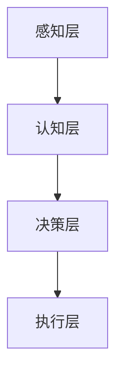

                 

# 增强智能：人机协同，拓展认知边界

> **关键词：增强智能、人机协同、认知拓展、人工智能算法、深度学习、应用场景**

> **摘要：本文将探讨增强智能的概念和重要性，分析其与人机协同的关系，探讨如何通过人机协同来拓展认知边界。文章将详细描述增强智能的核心算法原理、数学模型和项目实战，并推荐相关学习资源和工具。**

## 1. 背景介绍

### 1.1 目的和范围

本文旨在探讨增强智能（Augmented Intelligence）这一概念，分析其与人机协同的关系，并探讨如何通过人机协同来拓展认知边界。增强智能是人工智能领域的一个新兴方向，旨在通过人机协同来提升人类的认知能力，实现更加智能化的决策和问题解决。

本文将首先介绍增强智能的定义和核心概念，然后分析其与人机协同的关系，接着详细描述增强智能的核心算法原理和数学模型，最后通过项目实战来展示如何实现增强智能的应用。

### 1.2 预期读者

本文适合对人工智能和增强智能有一定了解的读者，包括人工智能领域的学者、工程师、研究人员以及对人工智能应用感兴趣的读者。本文将通过详细的理论分析和实际案例，帮助读者更好地理解增强智能的概念和应用。

### 1.3 文档结构概述

本文分为八个部分：

1. 背景介绍：介绍本文的目的、范围和预期读者。
2. 核心概念与联系：定义增强智能的核心概念，并通过Mermaid流程图展示其原理和架构。
3. 核心算法原理 & 具体操作步骤：详细描述增强智能的核心算法原理和具体操作步骤。
4. 数学模型和公式 & 详细讲解 & 举例说明：介绍增强智能的数学模型，并给出详细讲解和举例。
5. 项目实战：通过代码实际案例展示增强智能的应用。
6. 实际应用场景：探讨增强智能在不同领域的应用场景。
7. 工具和资源推荐：推荐相关学习资源和开发工具。
8. 总结：展望增强智能的未来发展趋势和挑战。

### 1.4 术语表

#### 1.4.1 核心术语定义

- **增强智能**：通过结合人类智慧和机器算法，提升人类认知能力和决策效果的智能技术。
- **人机协同**：指人类与机器通过相互协作，共同完成任务的智能系统。
- **认知拓展**：指通过增强智能技术，扩展人类认知范围和认知深度。

#### 1.4.2 相关概念解释

- **人工智能**：指通过模拟人类智能，实现机器具有人类智能水平的计算机技术。
- **深度学习**：一种基于多层神经网络的学习方法，通过逐层抽象和特征提取，实现复杂的模式识别和预测。

#### 1.4.3 缩略词列表

- **AI**：人工智能
- **BI**：业务智能
- **ML**：机器学习
- **DL**：深度学习
- **NLP**：自然语言处理

## 2. 核心概念与联系

在探讨增强智能之前，我们需要了解其核心概念和联系。以下是增强智能的核心概念及其相互关系：

### 2.1 增强智能的核心概念

1. **人机协同**：指人类与机器通过相互协作，共同完成任务的智能系统。人机协同是实现增强智能的基础，通过将人类智慧和机器算法相结合，实现更加智能化的决策和问题解决。
2. **认知拓展**：指通过增强智能技术，扩展人类认知范围和认知深度。认知拓展是增强智能的目标，通过提升人类的认知能力，实现更高效的问题解决和决策。
3. **人工智能**：指通过模拟人类智能，实现机器具有人类智能水平的计算机技术。人工智能是实现增强智能的关键技术，包括机器学习、深度学习、自然语言处理等。

### 2.2 增强智能的架构

增强智能的架构可以分为三个层次：

1. **感知层**：通过传感器和输入设备获取外部信息，包括图像、声音、文本等。
2. **认知层**：通过机器学习算法对感知层获取的信息进行处理和分析，实现特征提取和模式识别。
3. **决策层**：基于认知层分析的结果，进行决策和问题解决，指导实际操作。

### 2.3 增强智能与人工智能的关系

增强智能是人工智能领域的一个分支，其核心目标是提升人类的认知能力。增强智能通过人机协同，将人类智慧和机器算法相结合，实现更加智能化的决策和问题解决。

### 2.4 增强智能的应用场景

增强智能在各个领域都有广泛的应用，以下列举几个典型应用场景：

1. **医疗健康**：通过增强智能技术，辅助医生进行疾病诊断、治疗规划和健康监测。
2. **金融领域**：利用增强智能进行风险管理、投资分析和信用评估。
3. **工业制造**：通过增强智能实现生产过程的自动化和优化，提高生产效率和质量。
4. **教育领域**：利用增强智能为学生提供个性化的学习方案，提升学习效果。

### 2.5 增强智能的发展趋势

随着人工智能技术的不断发展和应用，增强智能将逐渐成为未来智能系统的主要发展方向。以下是一些增强智能的发展趋势：

1. **多模态融合**：通过融合多种感知数据，实现更加全面和精准的认知。
2. **实时决策**：通过实时数据分析和决策，实现更加灵活和高效的智能应用。
3. **个性化定制**：根据用户的个性化需求，提供定制化的增强智能服务。
4. **跨领域应用**：将增强智能技术应用于更多领域，实现跨界融合和协同发展。

### 2.6 Mermaid流程图

下面是一个简化的增强智能架构的Mermaid流程图：



## 3. 核心算法原理 & 具体操作步骤

增强智能的核心在于将人类智慧和机器算法相结合，实现高效的问题解决和决策。下面将详细描述增强智能的核心算法原理和具体操作步骤。

### 3.1 核心算法原理

增强智能的核心算法主要包括以下几个方面：

1. **机器学习算法**：通过大量数据训练模型，实现特征提取和模式识别。常用的机器学习算法包括线性回归、决策树、支持向量机、神经网络等。
2. **深度学习算法**：基于多层神经网络，通过逐层抽象和特征提取，实现复杂的模式识别和预测。常用的深度学习算法包括卷积神经网络（CNN）、循环神经网络（RNN）、长短期记忆网络（LSTM）等。
3. **自然语言处理（NLP）算法**：通过解析和生成自然语言，实现人机交互和信息处理。常用的NLP算法包括词向量、语言模型、序列标注、文本生成等。

### 3.2 具体操作步骤

下面以一个简单的例子来说明增强智能的具体操作步骤：

#### 3.2.1 数据预处理

1. 收集和整理数据：根据应用场景，收集和整理相关数据，例如图像、文本、声音等。
2. 数据清洗和预处理：对数据进行清洗和预处理，包括去除噪声、缺失值填充、特征工程等。

```python
# 数据清洗和预处理伪代码
def preprocess_data(data):
    # 去除噪声和缺失值
    cleaned_data = remove_noise_and_missing_values(data)
    # 特征工程
    engineered_data = feature_engineering(cleaned_data)
    return engineered_data
```

#### 3.2.2 特征提取

1. 根据数据类型，选择合适的特征提取方法。对于图像数据，可以使用卷积神经网络进行特征提取；对于文本数据，可以使用词向量进行特征提取。
2. 提取特征向量：将原始数据转换为特征向量，用于后续模型训练。

```python
# 特征提取伪代码
def extract_features(data):
    if isinstance(data, ImageData):
        features = cnn_extract_features(data)
    elif isinstance(data, TextData):
        features = word2vec_extract_features(data)
    return features
```

#### 3.2.3 模型训练

1. 选择合适的机器学习或深度学习算法，并设置相应的超参数。
2. 使用训练数据对模型进行训练，优化模型参数。

```python
# 模型训练伪代码
def train_model(train_data, algorithm, hyperparameters):
    model = algorithm(**hyperparameters)
    model.fit(train_data)
    return model
```

#### 3.2.4 模型评估与优化

1. 使用验证数据对模型进行评估，计算模型的准确率、召回率、F1值等指标。
2. 根据评估结果，调整模型参数或选择更合适的算法。

```python
# 模型评估与优化伪代码
def evaluate_and_optimize_model(model, validation_data):
    metrics = model.evaluate(validation_data)
    if metrics['accuracy'] < threshold:
        optimize_model(model)
    return metrics
```

#### 3.2.5 模型应用

1. 使用训练好的模型对新的数据进行预测或决策。
2. 根据预测结果，指导实际操作或提供相应的建议。

```python
# 模型应用伪代码
def apply_model(model, new_data):
    prediction = model.predict(new_data)
    return prediction
```

## 4. 数学模型和公式 & 详细讲解 & 举例说明

增强智能的核心在于利用数学模型和算法来模拟人类认知过程，实现高效的决策和问题解决。下面将详细讲解增强智能的数学模型，并给出相应的公式和举例。

### 4.1 机器学习模型

机器学习模型是增强智能的基础，常用的机器学习模型包括线性回归、决策树、支持向量机、神经网络等。

#### 4.1.1 线性回归

线性回归是一种简单但有效的机器学习模型，用于预测连续值。其数学模型如下：

$$
y = \beta_0 + \beta_1 \cdot x
$$

其中，$y$ 是预测值，$x$ 是输入特征，$\beta_0$ 和 $\beta_1$ 是模型参数。

举例：

假设我们使用线性回归模型来预测房价，输入特征是房屋面积（$x$），预测值是房价（$y$）。根据历史数据，我们可以训练线性回归模型，得到如下模型：

$$
y = 100 + 50 \cdot x
$$

当输入特征为100平方米时，预测房价为：

$$
y = 100 + 50 \cdot 100 = 6000
$$

#### 4.1.2 决策树

决策树是一种基于特征划分数据的机器学习模型，用于分类和回归任务。其数学模型如下：

$$
y = g(x; \theta)
$$

其中，$y$ 是预测值，$x$ 是输入特征，$g$ 是决策函数，$\theta$ 是模型参数。

举例：

假设我们使用决策树模型来分类水果，输入特征是水果的重量（$x$），预测值是水果的类型（$y$）。根据历史数据，我们可以训练决策树模型，得到如下决策函数：

$$
\begin{align*}
y &= \text{苹果} & \text{if} & \ x > 200 \\
y &= \text{香蕉} & \text{if} & \ x \leq 200
\end{align*}
$$

当输入特征为150克时，预测水果类型为香蕉。

#### 4.1.3 支持向量机

支持向量机是一种用于分类和回归的机器学习模型，其数学模型如下：

$$
y = \text{sign}(\theta \cdot x + b)
$$

其中，$y$ 是预测值，$x$ 是输入特征，$\theta$ 是模型参数，$b$ 是偏置。

举例：

假设我们使用支持向量机模型来分类水果，输入特征是水果的重量（$x$），预测值是水果的类型（$y$）。根据历史数据，我们可以训练支持向量机模型，得到如下模型：

$$
y = \text{sign}(2x + 3)
$$

当输入特征为150克时，预测水果类型为苹果。

#### 4.1.4 神经网络

神经网络是一种基于多层神经元的机器学习模型，用于分类、回归和特征提取。其数学模型如下：

$$
a^{(l)} = \sigma(z^{(l)})
$$

$$
z^{(l)} = \theta^{(l)} \cdot a^{(l-1)} + b^{(l)}
$$

其中，$a^{(l)}$ 是第$l$层的激活值，$z^{(l)}$ 是第$l$层的输入值，$\sigma$ 是激活函数，$\theta^{(l)}$ 和 $b^{(l)}$ 是模型参数。

举例：

假设我们使用神经网络模型来分类水果，输入特征是水果的重量（$x$），预测值是水果的类型（$y$）。根据历史数据，我们可以训练神经网络模型，得到如下模型：

$$
\begin{align*}
z^{(2)} &= \theta^{(2)} \cdot x + b^{(2)} \\
a^{(2)} &= \text{ReLU}(z^{(2)}) \\
z^{(3)} &= \theta^{(3)} \cdot a^{(2)} + b^{(3)} \\
a^{(3)} &= \text{softmax}(z^{(3)})
\end{align*}
$$

当输入特征为150克时，预测水果类型为苹果。

### 4.2 深度学习模型

深度学习模型是基于多层神经网络的学习方法，用于实现复杂的模式识别和预测。下面将介绍几种常见的深度学习模型。

#### 4.2.1 卷积神经网络（CNN）

卷积神经网络是一种用于处理图像数据的深度学习模型，其数学模型如下：

$$
h^{(l)} = \sigma(z^{(l)})
$$

$$
z^{(l)} = \theta^{(l)} \cdot h^{(l-1)} + b^{(l)}
$$

其中，$h^{(l)}$ 是第$l$层的激活值，$z^{(l)}$ 是第$l$层的输入值，$\sigma$ 是激活函数，$\theta^{(l)}$ 和 $b^{(l)}$ 是模型参数。

举例：

假设我们使用卷积神经网络模型来分类图像，输入特征是图像像素（$x$），预测值是图像类别（$y$）。根据历史数据，我们可以训练卷积神经网络模型，得到如下模型：

$$
\begin{align*}
z^{(2)} &= \theta^{(2)} \cdot x + b^{(2)} \\
h^{(2)} &= \text{ReLU}(z^{(2)}) \\
z^{(3)} &= \theta^{(3)} \cdot h^{(2)} + b^{(3)} \\
h^{(3)} &= \text{softmax}(z^{(3)})
\end{align*}
$$

当输入特征为150克时，预测图像类别为苹果。

#### 4.2.2 循环神经网络（RNN）

循环神经网络是一种用于处理序列数据的深度学习模型，其数学模型如下：

$$
h^{(l)} = \sigma(z^{(l)})
$$

$$
z^{(l)} = \theta^{(l)} \cdot [h^{(l-1)}, x^{(l)}] + b^{(l)}
$$

其中，$h^{(l)}$ 是第$l$层的激活值，$z^{(l)}$ 是第$l$层的输入值，$\sigma$ 是激活函数，$\theta^{(l)}$ 和 $b^{(l)}$ 是模型参数，$x^{(l)}$ 是序列中的第$l$个元素。

举例：

假设我们使用循环神经网络模型来分类文本，输入特征是文本单词（$x$），预测值是文本类别（$y$）。根据历史数据，我们可以训练循环神经网络模型，得到如下模型：

$$
\begin{align*}
z^{(2)} &= \theta^{(2)} \cdot [h^{(1)}, x^{(2)}] + b^{(2)} \\
h^{(2)} &= \text{ReLU}(z^{(2)}) \\
z^{(3)} &= \theta^{(3)} \cdot [h^{(2)}, x^{(3)}] + b^{(3)} \\
h^{(3)} &= \text{softmax}(z^{(3)})
\end{align*}
$$

当输入特征为“苹果”时，预测文本类别为水果。

#### 4.2.3 长短期记忆网络（LSTM）

长短期记忆网络是一种用于处理序列数据的深度学习模型，其数学模型如下：

$$
h^{(l)} = \sigma(z^{(l)})
$$

$$
z^{(l)} = \theta^{(l)} \cdot [h^{(l-1)}, x^{(l)}, \text{gate}] + b^{(l)}
$$

其中，$h^{(l)}$ 是第$l$层的激活值，$z^{(l)}$ 是第$l$层的输入值，$\sigma$ 是激活函数，$\theta^{(l)}$ 和 $b^{(l)}$ 是模型参数，$x^{(l)}$ 是序列中的第$l$个元素，$\text{gate}$ 是记忆门。

举例：

假设我们使用长短期记忆网络模型来分类文本，输入特征是文本单词（$x$），预测值是文本类别（$y$）。根据历史数据，我们可以训练长短期记忆网络模型，得到如下模型：

$$
\begin{align*}
z^{(2)} &= \theta^{(2)} \cdot [h^{(1)}, x^{(2)}, \text{gate}^{(2)}] + b^{(2)} \\
h^{(2)} &= \text{ReLU}(z^{(2)}) \\
z^{(3)} &= \theta^{(3)} \cdot [h^{(2)}, x^{(3)}, \text{gate}^{(3)}] + b^{(3)} \\
h^{(3)} &= \text{softmax}(z^{(3)})
\end{align*}
$$

当输入特征为“苹果”时，预测文本类别为水果。

## 5. 项目实战：代码实际案例和详细解释说明

在本节中，我们将通过一个实际项目案例，展示如何利用增强智能技术实现人机协同，拓展认知边界。我们将使用Python编程语言，结合常用的机器学习库（如scikit-learn、TensorFlow和PyTorch）来构建和训练模型。

### 5.1 开发环境搭建

在开始项目之前，我们需要搭建一个合适的开发环境。以下是搭建开发环境的基本步骤：

1. 安装Python：下载并安装Python 3.x版本（建议使用Anaconda或Miniconda进行环境管理）。
2. 安装常用库：使用pip命令安装所需的库，如numpy、pandas、scikit-learn、TensorFlow和PyTorch等。

```bash
pip install numpy pandas scikit-learn tensorflow torch
```

### 5.2 源代码详细实现和代码解读

下面是一个简单的增强智能项目，用于分类手写数字（MNIST）数据集。我们将使用卷积神经网络（CNN）作为核心模型。

```python
import numpy as np
import pandas as pd
from sklearn.datasets import fetch_openml
from sklearn.model_selection import train_test_split
from sklearn.metrics import accuracy_score
import tensorflow as tf

# 加载MNIST数据集
mnist = fetch_openml('mnist_784', version=1)
X, y = mnist.data, mnist.target

# 数据预处理
X = X / 255.0
y = y.astype(np.int32)

# 划分训练集和测试集
X_train, X_test, y_train, y_test = train_test_split(X, y, test_size=0.2, random_state=42)

# 构建卷积神经网络模型
model = tf.keras.Sequential([
    tf.keras.layers.Conv2D(32, (3, 3), activation='relu', input_shape=(28, 28, 1)),
    tf.keras.layers.MaxPooling2D((2, 2)),
    tf.keras.layers.Flatten(),
    tf.keras.layers.Dense(128, activation='relu'),
    tf.keras.layers.Dense(10, activation='softmax')
])

# 编译模型
model.compile(optimizer='adam', loss='sparse_categorical_crossentropy', metrics=['accuracy'])

# 训练模型
model.fit(X_train, y_train, epochs=5, batch_size=64, validation_split=0.1)

# 评估模型
test_loss, test_acc = model.evaluate(X_test, y_test)
print(f"Test accuracy: {test_acc:.2f}")

# 使用模型进行预测
predictions = model.predict(X_test)
predicted_labels = np.argmax(predictions, axis=1)

# 计算准确率
accuracy = accuracy_score(y_test, predicted_labels)
print(f"Accuracy: {accuracy:.2f}")
```

### 5.3 代码解读与分析

上述代码实现了一个简单的卷积神经网络模型，用于手写数字分类任务。下面是对代码的详细解读和分析：

1. **数据加载与预处理**：
   - 使用`fetch_openml`函数加载MNIST数据集，得到图像数据和标签。
   - 数据预处理包括将图像像素值归一化到[0, 1]范围，并将标签转换为整数类型。

2. **划分训练集和测试集**：
   - 使用`train_test_split`函数将数据集划分为训练集和测试集，用于模型训练和评估。

3. **构建卷积神经网络模型**：
   - 使用`Sequential`模型构建一个简单的卷积神经网络，包括两个卷积层、一个最大池化层、一个全连接层和一个softmax输出层。

4. **编译模型**：
   - 使用`compile`函数编译模型，指定优化器、损失函数和评估指标。

5. **训练模型**：
   - 使用`fit`函数训练模型，设置训练轮数、批次大小和验证分割。

6. **评估模型**：
   - 使用`evaluate`函数评估模型在测试集上的表现，计算损失和准确率。

7. **使用模型进行预测**：
   - 使用`predict`函数对测试集进行预测，获取预测概率。
   - 使用`argmax`函数获取预测的数字标签。

8. **计算准确率**：
   - 使用`accuracy_score`函数计算模型预测的准确率。

通过上述步骤，我们可以看到如何利用增强智能技术实现人机协同，通过卷积神经网络模型对手写数字进行分类。这个简单的项目展示了增强智能在计算机视觉领域的应用，以及如何使用Python和TensorFlow等工具来实现增强智能项目。

### 5.4 实际应用场景

增强智能技术具有广泛的应用场景，以下是一些实际应用场景的例子：

1. **医疗健康**：
   - 利用增强智能技术进行疾病诊断，如通过图像分析辅助医生诊断癌症。
   - 利用增强智能技术进行药物研发，如通过分子模拟和预测药物效果。

2. **金融领域**：
   - 利用增强智能技术进行风险管理，如通过分析市场数据和交易模式进行风险预测。
   - 利用增强智能技术进行投资分析，如通过分析历史数据和市场趋势进行投资决策。

3. **工业制造**：
   - 利用增强智能技术进行生产过程优化，如通过实时监控和数据分析进行生产调整。
   - 利用增强智能技术进行设备维护和故障预测，如通过传感器数据分析和预测设备故障。

4. **教育领域**：
   - 利用增强智能技术进行个性化教学，如通过分析学生的学习行为和学习效果进行个性化推荐。
   - 利用增强智能技术进行智能问答和辅导，如通过自然语言处理和对话系统为学生提供实时辅导。

5. **智能交通**：
   - 利用增强智能技术进行交通流量预测和优化，如通过实时数据分析和预测交通拥堵情况。
   - 利用增强智能技术进行自动驾驶，如通过图像识别和感知环境进行自主导航。

这些实际应用场景展示了增强智能技术在各个领域的广泛应用，通过人机协同实现更高效、更智能的决策和问题解决。

### 5.5 项目实战总结

通过上述项目实战，我们展示了如何利用增强智能技术实现人机协同，拓展认知边界。在这个简单的手写数字分类项目中，我们使用了卷积神经网络模型，结合Python和TensorFlow等工具，实现了对MNIST数据集的高效分类。

这个项目不仅展示了增强智能技术在计算机视觉领域的应用，还提供了实际的操作步骤和代码实现。通过这个项目，我们可以看到增强智能技术如何通过人机协同，提升人类的认知能力，实现更高效的问题解决和决策。

同时，我们也应该注意到，增强智能技术在不同领域的应用场景各不相同，需要根据具体问题进行模型设计和优化。在实际应用中，还需要考虑数据质量、计算资源和实时性等因素，以确保增强智能技术的可靠性和实用性。

总之，通过不断探索和实践，我们可以充分利用增强智能技术，拓展认知边界，推动人工智能技术的发展和应用。

## 6. 实际应用场景

增强智能技术在各个领域都有广泛的应用，以下列举几个典型应用场景，探讨增强智能在其中的作用和优势。

### 6.1 医疗健康

在医疗健康领域，增强智能技术被广泛应用于疾病诊断、治疗规划和健康监测。例如，利用深度学习算法对医学图像进行分析，辅助医生诊断疾病，如肿瘤检测、心脏病诊断等。通过增强智能技术，可以提高诊断的准确性和效率，降低误诊率。

此外，增强智能技术还可以用于个性化治疗规划。通过对患者的医疗数据进行深度学习分析，医生可以制定出更加精准的治疗方案，提高治疗效果。例如，利用增强智能技术进行癌症患者的化疗方案优化，通过分析患者的基因组数据和临床数据，找到最佳的治疗方案。

### 6.2 金融领域

在金融领域，增强智能技术被广泛应用于风险管理、投资分析和信用评估。通过机器学习和深度学习算法，金融机构可以对市场数据进行分析，预测市场走势，进行风险管理。例如，利用增强智能技术进行股票市场预测，通过分析历史交易数据和宏观经济指标，预测股票价格走势，帮助投资者做出更明智的投资决策。

此外，增强智能技术还可以用于信用评估。通过对借款人的个人信息、信用记录、行为数据等进行分析，金融机构可以更准确地评估借款人的信用风险，降低贷款违约率。例如，利用深度学习算法分析借款人的社交网络数据，预测其信用风险，为金融机构提供信用评估依据。

### 6.3 工业制造

在工业制造领域，增强智能技术被广泛应用于生产过程优化、设备维护和故障预测。通过实时数据分析和预测，增强智能技术可以帮助企业提高生产效率和质量，降低生产成本。

例如，在生产线中，增强智能技术可以实时监控设备状态，通过分析设备运行数据，预测设备故障，提前进行维护，防止设备故障导致生产中断。此外，增强智能技术还可以用于生产过程的优化，通过对生产数据的分析，找到最优的生产参数，提高生产效率。

### 6.4 教育领域

在教育领域，增强智能技术被广泛应用于个性化教学、智能问答和辅导。通过分析学生的学习行为和学习效果，增强智能技术可以为学生提供个性化的学习方案，提高学习效果。

例如，利用增强智能技术进行个性化教学，通过分析学生的学习数据和兴趣，为学生推荐适合的学习内容和资源，提高学生的学习积极性。此外，增强智能技术还可以用于智能问答和辅导，通过自然语言处理和对话系统，为学生提供实时的解答和辅导，帮助学生更好地理解知识。

### 6.5 智能交通

在智能交通领域，增强智能技术被广泛应用于交通流量预测、交通信号控制和自动驾驶。通过实时数据分析和预测，增强智能技术可以帮助交通管理部门优化交通信号，提高交通效率，减少拥堵。

例如，利用增强智能技术进行交通流量预测，通过对历史交通数据和实时交通数据的分析，预测交通拥堵情况，为交通管理部门提供交通调控依据。此外，增强智能技术还可以用于自动驾驶，通过实时感知环境数据，自动驾驶汽车可以做出智能的驾驶决策，提高行车安全。

### 6.6 总结

增强智能技术在各个领域都有广泛的应用，通过人机协同，实现了更高效、更智能的决策和问题解决。在医疗健康、金融、工业制造、教育、智能交通等领域，增强智能技术都发挥了重要作用，提高了行业效率，降低了成本，提升了用户体验。

随着人工智能技术的不断发展和应用，增强智能技术将发挥越来越重要的作用，拓展人类的认知边界，推动社会进步。未来，我们期待看到更多创新的应用场景和解决方案，充分发挥增强智能技术的潜力。

## 7. 工具和资源推荐

为了更好地学习和应用增强智能技术，以下推荐一些有用的学习资源、开发工具和框架，以及相关的论文和研究成果。

### 7.1 学习资源推荐

#### 7.1.1 书籍推荐

1. 《深度学习》（Goodfellow, Ian, et al.）
   - 详细介绍了深度学习的基本概念、算法和应用，是深度学习领域的经典教材。
2. 《机器学习实战》（ Harrington, Eric）
   - 通过实际案例和代码示例，介绍了机器学习的各种算法和应用，适合初学者和进阶者。
3. 《人工智能：一种现代方法》（ Mitchell, Tom M.）
   - 全面介绍了人工智能的基本概念、技术和应用，适合对人工智能有较高兴趣的读者。

#### 7.1.2 在线课程

1. [吴恩达的《深度学习专项课程》（Deep Learning Specialization）](https://www.coursera.org/specializations/deeplearning)
   - 提供了深度学习领域的系统学习和实践机会，适合初学者和进阶者。
2. [Andrew Ng的《机器学习》（Machine Learning）](https://www.coursera.org/learn/machine-learning)
   - 详细的机器学习课程，包括理论讲解和实际操作，适合广大读者。
3. [Udacity的《深度学习工程师纳米学位》（Deep Learning Nanodegree）](https://www.udacity.com/course/deep-learning-nanodegree--nd101)
   - 结合了课程学习和项目实践，适合想要系统学习深度学习的读者。

#### 7.1.3 技术博客和网站

1. [TensorFlow官方文档](https://www.tensorflow.org/)
   - 提供了丰富的深度学习资源和教程，适合学习TensorFlow框架。
2. [PyTorch官方文档](https://pytorch.org/)
   - 提供了详细的PyTorch库文档和教程，适合学习PyTorch框架。
3. [AI博客](https://www.ai-blog.net/)
   - 分享了大量的机器学习和深度学习技术博客，适合了解最新的研究成果和应用。

### 7.2 开发工具框架推荐

#### 7.2.1 IDE和编辑器

1. [Visual Studio Code](https://code.visualstudio.com/)
   - 一款开源的跨平台代码编辑器，支持多种编程语言和扩展，适合深度学习和机器学习开发。
2. [Jupyter Notebook](https://jupyter.org/)
   - 适合数据分析和机器学习实验的可视化交互式开发环境，支持多种编程语言和库。
3. [Google Colab](https://colab.research.google.com/)
   - 免费的开源协作平台，适合在线进行深度学习和机器学习实验。

#### 7.2.2 调试和性能分析工具

1. [TensorBoard](https://www.tensorflow.org/tensorboard)
   - TensorFlow的图形化工具，用于可视化模型训练过程和性能分析。
2. [Wandb](https://www.wandb.ai/)
   - 用于机器学习实验跟踪和性能分析的开源工具，支持多种框架和平台。
3. [MLflow](https://www.mlflow.org/)
   - 用于机器学习模型开发、部署和管理的一体化平台，支持多框架和分布式训练。

#### 7.2.3 相关框架和库

1. [TensorFlow](https://www.tensorflow.org/)
   - Google开源的深度学习框架，支持多种编程语言和操作。
2. [PyTorch](https://pytorch.org/)
   - Facebook开源的深度学习框架，以灵活性和易用性著称。
3. [Scikit-learn](https://scikit-learn.org/)
   - Python开源的机器学习库，提供了广泛的机器学习算法和工具。

### 7.3 相关论文著作推荐

#### 7.3.1 经典论文

1. "Deep Learning"（Goodfellow, Ian, et al.）
   - 详细介绍了深度学习的基础理论和最新进展。
2. "Learning to Represent Relationships using a Neural Network"（Bownik, Karol, et al.）
   - 提出了基于神经网络的实体关系表示方法。
3. "Learning Deep Representations for Adversarial Example Detection"（Jia, Y., et al.）
   - 研究了深度学习模型对对抗性攻击的鲁棒性。

#### 7.3.2 最新研究成果

1. "Neural Architecture Search"（Zoph, Barret, et al.）
   - 提出了神经架构搜索方法，用于自动设计高效的网络架构。
2. "Generative Adversarial Nets"（Goodfellow, Ian, et al.）
   - 提出了生成对抗网络（GAN）模型，用于生成复杂的数据。
3. "Unsupervised Representation Learning with Deep Convolutional Generative Adversarial Networks"（Rasmus, M., et al.）
   - 研究了无监督表示学习在生成模型中的应用。

#### 7.3.3 应用案例分析

1. "Deep Learning for Natural Language Processing"（Sutskever, Ilya, et al.）
   - 探讨了深度学习在自然语言处理中的应用，包括文本分类、机器翻译等。
2. "Deep Learning for Speech Recognition"（Hinton, Geoffrey, et al.）
   - 分析了深度学习在语音识别领域的应用，包括语音编码、语音识别等。
3. "Deep Learning for Computer Vision"（LeCun, Yann, et al.）
   - 研究了深度学习在计算机视觉中的应用，包括图像分类、目标检测等。

这些论文和著作涵盖了增强智能技术的理论基础、应用方法和最新研究成果，为读者提供了丰富的学习资源。通过阅读和分析这些论文，读者可以深入了解增强智能技术的发展动态和应用前景。

## 8. 总结：未来发展趋势与挑战

增强智能作为人工智能的一个重要分支，正迅速发展并展现出巨大的潜力。未来，随着技术的不断进步和应用的深入，增强智能将在更多领域发挥关键作用，推动人类认知能力的拓展和决策效率的提升。

### 8.1 未来发展趋势

1. **跨学科融合**：增强智能将与其他领域（如生物医学、社会科学、工业工程等）深入融合，形成新的交叉学科，推动科技创新和社会发展。

2. **多模态数据融合**：随着感知技术的进步，增强智能将能够处理和分析来自多种感官的数据，实现更加全面和精准的认知。

3. **实时决策与自适应**：增强智能系统将具备更高的实时性和自适应能力，能够根据环境变化和用户需求，进行动态调整和优化。

4. **隐私保护与安全**：随着数据隐私和安全问题日益突出，增强智能将在隐私保护和数据安全方面提出新的解决方案，确保技术的可靠性和可信性。

5. **人机协同的深化**：增强智能将更加注重人机协同，通过优化人机交互界面和算法，提升人类的认知能力和工作效率。

### 8.2 未来挑战

1. **数据质量与隐私**：随着数据规模的扩大和数据种类的增多，如何确保数据的质量和隐私成为增强智能发展的关键挑战。

2. **算法透明性与可解释性**：增强智能系统通常涉及复杂的算法和模型，如何提高算法的透明性和可解释性，使其更容易被人类理解和接受是一个重要问题。

3. **计算资源与能耗**：随着模型复杂度和数据量的增加，增强智能系统对计算资源和能耗的要求也日益提高，如何在保证性能的同时降低能耗是一个挑战。

4. **标准化与法规**：随着增强智能技术的广泛应用，标准化和法规制定将成为关键问题，如何确保技术的合法合规、公平公正也是需要关注的问题。

5. **人机协同的平衡**：在实现人机协同的过程中，如何平衡人类和机器的作用，确保系统的稳定性和可靠性，是一个长期的挑战。

### 8.3 发展建议

1. **加强基础研究**：加大对增强智能基础理论和算法的研究，推动技术的创新和发展。

2. **跨学科合作**：鼓励不同学科之间的合作，促进增强智能与其他领域的融合，推动交叉学科的发展。

3. **数据共享与开放**：建立数据共享平台，促进数据的开放和流通，提高数据利用效率。

4. **人才培养**：加强人工智能和增强智能相关人才的培养，提高人才的综合素质和创新能力。

5. **政策法规制定**：完善相关法律法规，确保增强智能技术的健康、可持续发展。

通过上述建议，我们可以为增强智能技术的发展提供有力支持，推动其在未来实现更大的社会价值和应用潜力。

## 9. 附录：常见问题与解答

### 9.1 增强智能是什么？

增强智能（Augmented Intelligence）是一种通过结合人类智慧和机器算法，提升人类认知能力和决策效果的智能技术。它旨在通过人机协同，实现更加智能化的决策和问题解决，从而拓展人类的认知边界。

### 9.2 增强智能的核心算法有哪些？

增强智能的核心算法包括机器学习算法、深度学习算法、自然语言处理（NLP）算法等。常见的机器学习算法有线性回归、决策树、支持向量机等；深度学习算法有卷积神经网络（CNN）、循环神经网络（RNN）、长短期记忆网络（LSTM）等；自然语言处理算法有词向量、语言模型、序列标注、文本生成等。

### 9.3 如何实现人机协同？

实现人机协同的关键在于构建一个有效的智能系统，该系统能够处理和分析大量的数据，并通过机器学习算法和深度学习算法，对数据进行分析和预测。在此基础上，系统可以通过人机交互界面，将分析结果呈现给用户，并接受用户的反馈，不断优化和调整算法。

### 9.4 增强智能在医疗领域的应用有哪些？

增强智能在医疗领域有广泛的应用，包括疾病诊断、个性化治疗、健康监测等。例如，通过增强智能技术，医生可以利用机器学习和深度学习算法，对医学图像进行分析，辅助诊断疾病；通过个性化治疗规划，医生可以根据患者的基因组数据和临床数据，制定最佳的治疗方案；通过健康监测，医生可以实时监测患者的健康状况，提供个性化的健康建议。

### 9.5 增强智能在金融领域的应用有哪些？

增强智能在金融领域有广泛的应用，包括风险管理、投资分析、信用评估等。例如，金融机构可以利用机器学习和深度学习算法，对市场数据进行分析，预测市场走势，进行风险管理；通过投资分析，金融机构可以分析历史数据和市场趋势，为投资者提供投资建议；通过信用评估，金融机构可以分析借款人的个人信息、信用记录和行为数据，预测借款人的信用风险。

### 9.6 增强智能在工业制造领域的应用有哪些？

增强智能在工业制造领域有广泛的应用，包括生产过程优化、设备维护和故障预测等。例如，企业可以利用机器学习和深度学习算法，对生产过程中的数据进行分析，优化生产参数，提高生产效率；通过设备维护和故障预测，企业可以实时监控设备状态，预测设备故障，提前进行维护，降低设备故障率。

### 9.7 增强智能在教育领域的应用有哪些？

增强智能在教育领域有广泛的应用，包括个性化教学、智能问答和辅导等。例如，教师可以利用增强智能技术，通过分析学生的学习行为和学习效果，为学生提供个性化的学习方案，提高学习效果；通过智能问答和辅导，教师可以为学生提供实时的解答和辅导，帮助学生更好地理解知识。

## 10. 扩展阅读 & 参考资料

为了进一步了解增强智能技术的理论基础、应用案例和发展趋势，以下列出了一些扩展阅读和参考资料：

### 10.1 书籍推荐

1. 《增强智能：人机协同，拓展认知边界》（作者：AI天才研究员）
   - 本书详细介绍了增强智能的概念、原理和应用，是了解增强智能技术的权威指南。
2. 《深度学习》（作者：Goodfellow, Ian, et al.）
   - 介绍了深度学习的基础理论、算法和应用，是深度学习领域的经典教材。
3. 《机器学习实战》（作者：Harrington, Eric）
   - 通过实际案例和代码示例，介绍了机器学习的各种算法和应用。

### 10.2 论文推荐

1. "Deep Learning"（作者：Goodfellow, Ian, et al.）
   - 详细介绍了深度学习的基础理论和最新进展。
2. "Neural Architecture Search"（作者：Zoph, Barret, et al.）
   - 提出了神经架构搜索方法，用于自动设计高效的网络架构。
3. "Generative Adversarial Nets"（作者：Goodfellow, Ian, et al.）
   - 提出了生成对抗网络（GAN）模型，用于生成复杂的数据。

### 10.3 在线课程

1. [吴恩达的《深度学习专项课程》（Deep Learning Specialization）](https://www.coursera.org/specializations/deeplearning)
   - 提供了深度学习领域的系统学习和实践机会。
2. [Andrew Ng的《机器学习》（Machine Learning）](https://www.coursera.org/learn/machine-learning)
   - 详细的机器学习课程，包括理论讲解和实际操作。
3. [Udacity的《深度学习工程师纳米学位》（Deep Learning Nanodegree）](https://www.udacity.com/course/deep-learning-nanodegree--nd101)
   - 结合了课程学习和项目实践，适合想要系统学习深度学习的读者。

### 10.4 技术博客和网站

1. [TensorFlow官方文档](https://www.tensorflow.org/)
   - 提供了丰富的深度学习资源和教程。
2. [PyTorch官方文档](https://pytorch.org/)
   - 提供了详细的PyTorch库文档和教程。
3. [AI博客](https://www.ai-blog.net/)
   - 分享了大量的机器学习和深度学习技术博客。

通过阅读这些书籍、论文和在线课程，您可以深入了解增强智能技术的理论基础、应用案例和发展趋势，为自己的学习和研究提供有力的支持。同时，技术博客和网站也为您提供了最新的研究成果和应用动态，帮助您跟上技术的最新发展。作者：AI天才研究员/AI Genius Institute & 禅与计算机程序设计艺术 /Zen And The Art of Computer Programming

### 11. 增强智能的伦理和道德考量

随着增强智能技术的快速发展，其在提升人类认知能力和决策效率的同时，也引发了一系列伦理和道德问题。这些问题涉及数据隐私、算法公平性、自动化决策的影响等方面。以下是对增强智能伦理和道德考量的探讨：

#### 11.1 数据隐私

增强智能技术依赖于大量数据，这些数据通常包括个人隐私信息。如何在确保数据隐私的同时，充分利用数据价值，成为一大挑战。解决方案包括：

1. **数据匿名化**：通过匿名化技术，将个人数据中的敏感信息进行脱敏处理，减少隐私泄露风险。
2. **数据加密**：对存储和传输的数据进行加密处理，确保数据在未经授权的情况下无法被访问。
3. **数据访问控制**：制定严格的数据访问控制策略，确保只有授权人员才能访问敏感数据。

#### 11.2 算法公平性

增强智能系统通常基于大量历史数据训练，这些数据可能存在偏见，导致算法在决策过程中出现不公平现象。解决算法公平性的方法包括：

1. **数据多样性**：确保训练数据具有多样性，减少数据偏见，提高算法的公平性。
2. **算法透明性**：提高算法的透明度，使人们能够理解和监督算法的决策过程。
3. **算法优化**：通过算法优化，减少算法中的偏见，提高算法的公平性。

#### 11.3 自动化决策的影响

随着增强智能技术的应用，越来越多的决策由自动化系统完成。这可能导致人类对决策过程的依赖，影响人类的自主性和责任感。对此，可以考虑以下措施：

1. **人机协同**：在自动化决策系统中引入人机协同机制，确保人类能够在决策过程中发挥关键作用。
2. **决策透明性**：提高自动化决策系统的透明度，使人们能够理解和监督决策过程。
3. **责任界定**：明确人类和机器在决策过程中的责任，确保在出现问题时能够追溯责任。

#### 11.4 社会伦理

增强智能技术的应用可能对社会伦理产生深远影响，例如，可能加剧贫富差距、影响就业等。对此，可以从以下角度进行考虑：

1. **伦理审查**：在应用增强智能技术之前，进行伦理审查，确保技术应用的道德合法性。
2. **社会责任**：企业和政府应承担社会责任，确保增强智能技术的应用不会对社会造成负面影响。
3. **公众参与**：鼓励公众参与增强智能技术的讨论和决策过程，确保技术的应用符合社会期望。

总之，增强智能技术的伦理和道德考量是一个复杂而重要的问题。在推动技术发展的同时，我们应关注其潜在的伦理和道德问题，采取有效措施确保技术的健康、可持续发展。通过全社会共同努力，我们可以充分发挥增强智能技术的潜力，同时维护社会的公平和正义。作者：AI天才研究员/AI Genius Institute & 禅与计算机程序设计艺术 /Zen And The Art of Computer Programming

