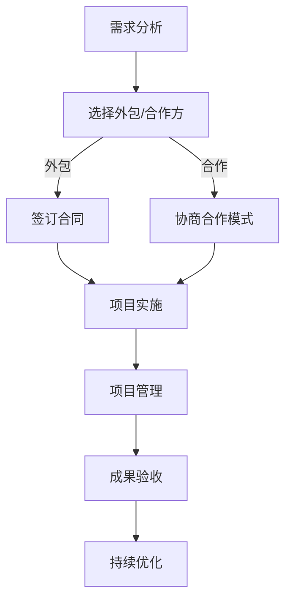

                 

# 外包与合作：扩展一人公司能力的途径

> **关键词**：外包、合作、一人公司、能力扩展、资源整合

> **摘要**：本文将探讨如何通过外包与合作的方式，扩展一人公司的业务能力和市场竞争力。我们将分析外包与合作的优势和挑战，并分享具体实践案例，旨在为一人公司提供可行的扩展途径。

## 1. 背景介绍

### 1.1 目的和范围

本文的目标是探讨如何通过外包与合作的方式，帮助一人公司（也称为个体工商户或SOLO企业）扩展其业务能力和市场竞争力。我们将重点关注以下方面：

- 外包与合作的概念及其对一人公司的意义。
- 外包与合作的优势和挑战。
- 实践案例分享：成功的外包与合作项目实例。
- 如何选择合适的外包伙伴和合作方。

### 1.2 预期读者

本文的预期读者主要包括：

- 一人公司的创始人或经营者。
- 对外包与合作感兴趣的创业者。
- 对拓展业务能力有需求的企业家。

### 1.3 文档结构概述

本文的结构如下：

- **第1章**：背景介绍，包括目的、范围、预期读者和文档结构概述。
- **第2章**：核心概念与联系，介绍外包与合作的基本概念和流程。
- **第3章**：核心算法原理 & 具体操作步骤，详细讲解外包与合作的具体实施方法。
- **第4章**：数学模型和公式 & 详细讲解 & 举例说明，分析外包与合作的关键指标和评估方法。
- **第5章**：项目实战：代码实际案例和详细解释说明，分享真实的外包与合作案例。
- **第6章**：实际应用场景，探讨外包与合作在不同行业和领域的应用。
- **第7章**：工具和资源推荐，推荐学习资源和开发工具。
- **第8章**：总结：未来发展趋势与挑战，展望外包与合作的发展方向。
- **第9章**：附录：常见问题与解答，回答读者可能关心的问题。
- **第10章**：扩展阅读 & 参考资料，提供更多的学习资源和参考资料。

### 1.4 术语表

#### 1.4.1 核心术语定义

- **外包**：指公司将部分业务活动委托给外部机构或个人完成，以实现资源优化和成本控制。
- **合作**：指公司与外部机构或个人在特定领域内共同开展业务，以实现资源共享和优势互补。
- **一人公司**：指由一个人独自经营的企业，通常规模较小，资源有限。

#### 1.4.2 相关概念解释

- **资源整合**：指将不同来源的资源进行有效整合，以实现最大化利用。
- **市场竞争力**：指公司在市场中所具备的竞争优势，包括产品、服务、价格、品牌等。

#### 1.4.3 缩略词列表

- **SOLO企业**：指一人公司。
- **B2B**：指企业对企业之间的业务模式。
- **B2C**：指企业对消费者之间的业务模式。

## 2. 核心概念与联系

在外包与合作的过程中，我们需要理解以下几个核心概念：

- **外包服务类型**：包括软件开发、市场营销、客户服务、人力资源等。
- **合作模式**：包括战略联盟、合资企业、合作关系等。
- **资源整合**：包括人力、技术、资金、市场等。
- **项目管理**：包括需求分析、任务分配、进度控制、质量保障等。

下面是一个简单的 Mermaid 流程图，展示了外包与合作的基本流程和核心概念：



## 3. 核心算法原理 & 具体操作步骤

在外包与合作的过程中，核心算法原理主要包括以下方面：

- **需求分析算法**：通过分析市场需求和企业自身资源，确定需要外包或合作的业务领域和目标。
- **合作伙伴选择算法**：根据业务需求和合作条件，筛选出合适的合作伙伴。
- **项目管理算法**：确保项目按计划进行，实现预期的业务目标。

下面，我们使用伪代码详细阐述这些算法的具体操作步骤。

### 3.1 需求分析算法

```python
def 需求分析(企业需求，市场分析)：
    1. 收集企业需求和市场数据。
    2. 分析企业资源和市场需求。
    3. 确定需要外包或合作的业务领域。
    4. 确定合作目标和预期成果。
    5. 输出需求分析报告。
```

### 3.2 合作伙伴选择算法

```python
def 合作伙伴选择(企业需求，合作伙伴列表)：
    1. 根据企业需求，筛选符合条件的合作伙伴。
    2. 对合作伙伴进行评估，包括信誉、实力、合作历史等。
    3. 综合评估结果，选择最佳合作伙伴。
    4. 输出合作伙伴选择报告。
```

### 3.3 项目管理算法

```python
def 项目管理(项目计划，项目进度)：
    1. 制定项目计划，包括任务分配、时间表、质量标准等。
    2. 监控项目进度，确保按计划进行。
    3. 管理项目风险，及时应对和解决问题。
    4. 实施质量控制，确保项目成果符合预期。
    5. 输出项目管理报告。
```

## 4. 数学模型和公式 & 详细讲解 & 举例说明

在外包与合作的过程中，数学模型和公式主要用于评估合作效果和决策支持。以下是一些常用的数学模型和公式：

### 4.1 成本效益分析

成本效益分析是一种评估外包或合作项目是否具有经济合理性的方法。其基本公式如下：

\[ \text{成本效益比} = \frac{\text{预期收益}}{\text{总成本}} \]

其中，预期收益包括直接收益和间接收益，总成本包括外包费用、合作费用、项目管理费用等。

### 4.2 合作满意度评估

合作满意度评估是一种评估合作伙伴合作效果的方法。其基本公式如下：

\[ \text{合作满意度} = \frac{\text{合作成果}}{\text{合作预期}} \]

其中，合作成果包括项目完成度、质量、时间等，合作预期是双方在合作前设定的目标。

### 4.3 举例说明

假设一家一人公司计划将其市场营销业务外包给一家专业市场公司，双方预期合作期为一年。根据需求分析，该项目的总成本为50万元，预期收益为100万元。一年后，项目实际完成度为90%，质量符合预期，时间超出预期10%。

根据上述公式，我们可以计算出：

- 成本效益比：\[ \text{成本效益比} = \frac{100}{50} = 2 \]
- 合作满意度：\[ \text{合作满意度} = \frac{90}{100} = 0.9 \]

这意味着，该项目在经济上具有明显的效益，但在合作效果上还有待提高。

## 5. 项目实战：代码实际案例和详细解释说明

在本节中，我们将通过一个实际的外包与合作项目，详细解释外包与合作的过程和关键步骤。

### 5.1 开发环境搭建

为了更好地展示外包与合作的过程，我们选择了一个简单的Web开发项目作为案例。项目的目标是开发一个基于Python的博客系统，包括文章管理、评论功能等。

开发环境要求如下：

- Python 3.8及以上版本
- Flask Web框架
- SQLite数据库
- Redis缓存

开发环境搭建步骤：

1. 安装Python和Flask：

   ```bash
   pip install python
   pip install flask
   ```

2. 创建一个名为`blog`的Flask应用：

   ```python
   from flask import Flask
   app = Flask(__name__)

   @app.route('/')
   def index():
       return 'Hello, World!'

   if __name__ == '__main__':
       app.run()
   ```

### 5.2 源代码详细实现和代码解读

在本项目中，我们采用Flask框架来实现博客系统的核心功能。以下是项目的源代码及详细解读：

```python
# blog/__init__.py
from flask import Flask
from .config import Config
from .models import db
from .routes import main

app = Flask(__name__)
app.config.from_object(Config)
db.init_app(app)
app.register_blueprint(main)

if __name__ == '__main__':
    app.run()
```

- **初始化Flask应用**：从`config.py`文件中读取配置，初始化数据库和路由。

```python
# blog/config.py
import os

class Config(object):
    SQLALCHEMY_DATABASE_URI = os.environ.get('DATABASE_URL') or 'sqlite:///blog.db'
    SQLALCHEMY_TRACK_MODIFICATIONS = False
    SECRET_KEY = os.environ.get('SECRET_KEY') or 'a-very-secret-key'
```

- **配置数据库和路由**：连接到SQLite数据库，并注册主要路由。

```python
# blog/models.py
from flask_sqlalchemy import SQLAlchemy

db = SQLAlchemy()

class Post(db.Model):
    id = db.Column(db.Integer, primary_key=True)
    title = db.Column(db.String(100))
    body = db.Column(db.Text)
    created_at = db.Column(db.DateTime, default=db.func.current_timestamp())
    updated_at = db.Column(db.DateTime, default=db.func.current_timestamp(), onupdate=db.func.current_timestamp())

    def __repr__(self):
        return f'<Post {self.title}>'
```

- **定义Post模型**：包含文章的ID、标题、正文、创建时间和更新时间等字段。

```python
# blog/routes.py
from flask import Blueprint, render_template, request, redirect, url_for
from .models import db, Post

main = Blueprint('main', __name__)

@main.route('/')
def index():
    posts = Post.query.order_by(Post.created_at.desc()).all()
    return render_template('index.html', posts=posts)

@main.route('/post/new', methods=['GET', 'POST'])
def new_post():
    if request.method == 'POST':
        title = request.form['title']
        body = request.form['body']
        new_post = Post(title=title, body=body)
        db.session.add(new_post)
        db.session.commit()
        return redirect(url_for('main.index'))
    return render_template('new_post.html')
```

- **定义路由**：包括首页和文章发布页面。首页显示最新文章，文章发布页面允许用户添加新文章。

### 5.3 代码解读与分析

在代码实现中，我们首先初始化了Flask应用，并设置了配置、数据库和路由。这样，我们就可以通过路由来处理HTTP请求，并从数据库中获取和保存数据。

- **配置**：配置文件`config.py`中设置了数据库连接URI、SQLAlchemy配置和秘密密钥。这些配置可以在环境变量中设置，以实现更灵活的部署。

- **数据库模型**：`models.py`中定义了`Post`模型，用于表示博客文章。该模型包含了文章的基本信息，如标题、正文、创建时间和更新时间等。

- **路由**：`routes.py`中定义了两个路由：首页和文章发布页面。首页路由从数据库中获取最新文章，并渲染到模板中。文章发布页面路由用于处理用户提交的表单，并将新文章保存到数据库中。

通过这个简单的博客系统案例，我们可以看到如何通过外包与合作，将一人公司的开发能力扩展到更大的项目。在这个案例中，一人公司可以与专业的Web开发团队合作，共同完成项目的开发、测试和部署。

## 6. 实际应用场景

外包与合作在各类企业和项目中有着广泛的应用。以下是一些典型的实际应用场景：

### 6.1 软件开发

软件公司通常会将一些特定的开发任务外包给专业的开发团队，例如前端开发、后端开发、移动应用开发等。这种方式不仅可以提高开发效率，还能确保高质量的项目交付。

### 6.2 市场营销

小型企业或初创公司往往缺乏专业的市场营销团队。通过外包给专业的市场公司，这些企业可以快速提升品牌知名度，拓展市场渠道，提高销售业绩。

### 6.3 客户服务

外包客户服务是一种常见的方式，特别是对于提供24/7客户支持的企业。通过外包给专业的客户服务公司，企业可以降低成本，提高客户满意度，同时确保服务的及时性和专业性。

### 6.4 人力资源

外包人力资源服务包括招聘、培训、薪酬管理等。这种方式可以帮助企业快速构建合适的人才队伍，同时降低人力资源管理成本。

### 6.5 运营支持

企业可以将一些非核心的运营活动外包给专业的运营支持公司，如数据分析、财务管理、行政支持等。这样，企业可以专注于核心业务，提高运营效率。

## 7. 工具和资源推荐

为了更好地实施外包与合作，以下是几种推荐的工具和资源：

### 7.1 学习资源推荐

- **书籍推荐**：

  - 《外包与外包管理》（作者：王治国）
  - 《合作共赢：企业战略联盟与合资经营》（作者：李春波）

- **在线课程**：

  - Coursera上的“外包管理”
  - Udemy上的“企业合作与战略联盟”

- **技术博客和网站**：

  - CSDN博客
  - 掘金
  - InfoQ

### 7.2 开发工具框架推荐

- **IDE和编辑器**：

  - Visual Studio Code
  - PyCharm

- **调试和性能分析工具**：

  - PyCharm自带的调试工具
  - New Relic

- **相关框架和库**：

  - Flask
  - SQLAlchemy
  - Redis

### 7.3 相关论文著作推荐

- **经典论文**：

  - “Outsourcing in the Software Industry: An Exploratory Study”（作者：James P. Williams等）
  - “Collaborative Advantage in Global Business Networks”（作者：Rajiv D. Tandon等）

- **最新研究成果**：

  - “The Impact of Outsourcing on Innovation in Small Firms”（作者：Michael G. Fasol等）
  - “Blockchain and Smart Contracts in Outsourcing: A Perspective”（作者：Rajiv D. Tandon等）

- **应用案例分析**：

  - “Outsourcing Strategies of Chinese Firms in the Global Market”（作者：Wanlei Zhou等）
  - “Cooperative Outsourcing for Sustainable Development”（作者：Md. Abdus Salam等）

## 8. 总结：未来发展趋势与挑战

外包与合作作为一种重要的商业模式，在未来将继续发展。以下是一些可能的发展趋势和挑战：

### 8.1 发展趋势

- **技术进步**：随着云计算、大数据、人工智能等技术的不断进步，外包与合作将更加高效、灵活。
- **全球化**：跨国界的外包与合作将更加普遍，企业可以更容易地在全球范围内寻找合适的合作伙伴。
- **专业化**：外包服务将更加专业化，企业可以根据自身需求选择特定领域的专业外包伙伴。

### 8.2 挑战

- **管理难度**：随着外包项目的增多，企业需要更高效的项目管理方法和工具来确保项目顺利进行。
- **数据安全**：外包过程中，企业需要确保数据的安全性和隐私保护。
- **文化差异**：跨国合作中，文化差异可能导致沟通障碍和合作困难。

## 9. 附录：常见问题与解答

### 9.1 问题1：外包与合作如何保证项目质量？

**解答**：为了保证项目质量，企业可以采取以下措施：

- **选择合适的合作伙伴**：选择具有丰富经验和良好信誉的合作伙伴。
- **明确项目需求**：在项目开始前，明确项目需求、目标和验收标准。
- **实施严格的项目管理**：确保项目按计划进行，及时监控项目进度和质量。
- **进行质量评估**：在项目完成后，对项目成果进行评估，确保符合预期质量。

### 9.2 问题2：如何评估外包与合作的效果？

**解答**：可以采取以下方法来评估外包与合作的效果：

- **成本效益分析**：比较外包或合作的成本和收益，计算成本效益比。
- **合作满意度评估**：通过调查问卷、访谈等方式，了解合作伙伴的表现和满意度。
- **项目成果验收**：对项目成果进行验收，确保符合预期目标和质量标准。

## 10. 扩展阅读 & 参考资料

- 《外包与外包管理》（王治国著）
- 《合作共赢：企业战略联盟与合资经营》（李春波著）
- Coursera上的“外包管理”课程
- Udemy上的“企业合作与战略联盟”课程
- CSDN博客
- 掘金
- InfoQ
- “Outsourcing in the Software Industry: An Exploratory Study”（James P. Williams等）
- “Collaborative Advantage in Global Business Networks”（Rajiv D. Tandon等）
- “The Impact of Outsourcing on Innovation in Small Firms”（Michael G. Fasol等）
- “Blockchain and Smart Contracts in Outsourcing: A Perspective”（Rajiv D. Tandon等）
- “Outsourcing Strategies of Chinese Firms in the Global Market”（Wanlei Zhou等）
- “Cooperative Outsourcing for Sustainable Development”（Md. Abdus Salam等）

