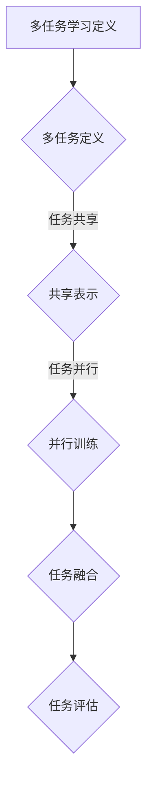

                 

# 多任务学习范式在自动驾驶感知中的应用拓展

> **关键词：多任务学习、自动驾驶、感知系统、深度学习、强化学习、实时性、鲁棒性、效率优化**
> 
> **摘要：本文将深入探讨多任务学习范式在自动驾驶感知系统中的应用。我们将分析多任务学习的基本概念和原理，探讨其在自动驾驶中的适用性，并通过具体的算法原理和数学模型解释，展示其在感知任务中的有效性和实时性。此外，我们将通过实际项目案例，详细阐述多任务学习在自动驾驶中的应用细节，并总结未来的发展趋势和面临的挑战。**

## 1. 背景介绍

### 1.1 目的和范围

本文旨在深入探讨多任务学习（Multi-Task Learning，MTL）范式在自动驾驶感知系统中的应用。多任务学习是一种机器学习技术，旨在通过共享表示来提高多个相关任务的学习效率。在自动驾驶领域，感知系统是一个关键组件，负责处理摄像头、激光雷达（LiDAR）和雷达等传感器的数据，从而实现对周围环境的理解和决策。

本文将重点关注以下几个方面：
1. 多任务学习的基本概念和原理。
2. 多任务学习在自动驾驶感知系统中的应用场景。
3. 多任务学习算法原理和数学模型的详细解释。
4. 实际项目案例中的多任务学习应用。
5. 多任务学习在自动驾驶领域的未来发展趋势和挑战。

### 1.2 预期读者

本文的预期读者主要包括以下几类：
1. 计算机视觉和自动驾驶领域的工程师和研究人员。
2. 对多任务学习和深度学习有基本了解的开发者。
3. 对自动驾驶感知系统有浓厚兴趣的技术爱好者。
4. 相关学术领域的研究生和教师。

### 1.3 文档结构概述

本文将分为以下几个部分：
1. 引言和背景介绍。
2. 多任务学习的基本概念和原理。
3. 多任务学习在自动驾驶感知系统中的应用。
4. 核心算法原理和具体操作步骤。
5. 数学模型和公式详细讲解。
6. 项目实战：代码实际案例和详细解释说明。
7. 实际应用场景。
8. 工具和资源推荐。
9. 总结：未来发展趋势与挑战。
10. 附录：常见问题与解答。
11. 扩展阅读与参考资料。

### 1.4 术语表

#### 1.4.1 核心术语定义

- **多任务学习（Multi-Task Learning，MTL）**：一种机器学习技术，旨在通过共享表示来提高多个相关任务的学习效率。
- **自动驾驶（Autonomous Driving）**：一种无需人工操作，能够自主进行驾驶的智能交通系统。
- **感知系统（Perception System）**：自动驾驶系统中的一个关键组件，负责处理传感器的数据，实现对周围环境的理解和决策。
- **深度学习（Deep Learning）**：一种基于神经网络的机器学习技术，通过多层神经网络来提取特征和进行分类。
- **强化学习（Reinforcement Learning）**：一种基于奖励机制的机器学习技术，通过不断尝试和反馈来学习最优策略。

#### 1.4.2 相关概念解释

- **感知任务（Perception Tasks）**：在自动驾驶中，感知任务包括对象检测、场景分割、行为预测等。
- **共享表示（Shared Representation）**：多任务学习中，通过共享表示来提高多个相关任务的学习效率。
- **实时性（Real-Time）**：在自动驾驶中，感知系统需要在短时间内处理大量的传感器数据，并生成实时决策。

#### 1.4.3 缩略词列表

- **MTL**：多任务学习（Multi-Task Learning）
- **AD**：自动驾驶（Autonomous Driving）
- **PS**：感知系统（Perception System）
- **DL**：深度学习（Deep Learning）
- **RL**：强化学习（Reinforcement Learning）

## 2. 核心概念与联系

在深入探讨多任务学习在自动驾驶感知系统中的应用之前，我们需要先了解多任务学习的基本概念和原理，以及其在自动驾驶中的适用性。以下是通过 Mermaid 流程图展示的多任务学习的基本原理和架构：



### 2.1 多任务学习定义

多任务学习是一种机器学习技术，旨在同时解决多个相关任务。与传统的单任务学习不同，多任务学习通过共享表示和参数来提高学习效率。在自动驾驶感知系统中，多个感知任务（如对象检测、场景分割、行为预测）通常是相互关联的，因此通过多任务学习可以更有效地利用数据和提高性能。

### 2.2 共享表示

共享表示是多任务学习的关键原理之一。通过将多个任务映射到一个共同的表示空间，多任务学习可以减少参数数量，从而提高训练效率。在自动驾驶感知系统中，共享表示可以帮助模型更好地理解不同感知任务之间的关联，从而提高整体性能。

### 2.3 并行训练

并行训练是多任务学习中的另一个重要概念。在并行训练过程中，多个任务可以同时进行训练，从而提高学习效率。这对于自动驾驶感知系统尤为重要，因为感知任务需要在短时间内处理大量的传感器数据。

### 2.4 任务融合

任务融合是多任务学习中的一个关键步骤。通过融合不同任务的输出，多任务学习可以生成更全面和准确的决策。在自动驾驶感知系统中，任务融合可以帮助模型更好地应对复杂和动态的环境。

### 2.5 任务评估

任务评估是多任务学习中的最后一个关键步骤。通过评估不同任务的性能，多任务学习可以不断优化和调整模型。在自动驾驶感知系统中，任务评估可以帮助模型更好地适应不同的驾驶环境和场景。

## 3. 核心算法原理 & 具体操作步骤

多任务学习在自动驾驶感知系统中的应用需要具体的算法原理和操作步骤。以下是通过伪代码详细阐述多任务学习的算法原理和具体操作步骤：

```python
# 伪代码：多任务学习算法原理和具体操作步骤

# 初始化模型参数
params = initialize_parameters()

# 数据预处理
data = preprocess_data()

# 多任务学习模型
model = MultiTaskLearningModel(params)

# 并行训练
for epoch in range(num_epochs):
    for batch in data:
        # 前向传播
        predictions = model.forward(batch)
        
        # 计算损失
        loss = model.calculate_loss(predictions, batch.labels)
        
        # 反向传播
        model.backward(loss)
        
        # 更新参数
        model.update_parameters()

# 任务融合
final_predictions = modelfuse_predictions(predictions)

# 任务评估
performance = model.evaluate(final_predictions, batch.labels)
```

### 3.1 初始化模型参数

在多任务学习中，初始化模型参数是一个关键步骤。通过随机初始化或预训练模型的方式，可以有效地初始化模型参数，为后续的训练提供良好的初始状态。

### 3.2 数据预处理

数据预处理是多任务学习中的另一个关键步骤。通过数据预处理，可以有效地减少噪声和冗余信息，从而提高模型的学习效率和性能。常见的预处理方法包括归一化、去噪、数据增强等。

### 3.3 多任务学习模型

多任务学习模型是实现多任务学习的关键组件。通过设计适当的模型架构和损失函数，可以有效地将多个感知任务映射到一个共同的表示空间，并实现并行训练和任务融合。

### 3.4 并行训练

并行训练是多任务学习中的核心步骤。通过并行训练，可以有效地提高学习效率和性能。在并行训练过程中，每个任务可以独立地更新参数，并通过共享表示来优化整个模型。

### 3.5 任务融合

任务融合是多任务学习中的另一个关键步骤。通过融合不同任务的输出，可以生成更全面和准确的决策。在自动驾驶感知系统中，任务融合可以帮助模型更好地应对复杂和动态的环境。

### 3.6 任务评估

任务评估是多任务学习中的最后一个关键步骤。通过评估不同任务的性能，可以不断优化和调整模型。在自动驾驶感知系统中，任务评估可以帮助模型更好地适应不同的驾驶环境和场景。

## 4. 数学模型和公式 & 详细讲解 & 举例说明

多任务学习在自动驾驶感知系统中的应用离不开数学模型和公式的支持。以下是通过 LaTeX 格式详细讲解多任务学习中的关键数学模型和公式：

### 4.1 多任务学习模型

多任务学习模型可以通过以下公式表示：

$$
y = \sigma(W \cdot x + b)
$$

其中，$y$ 表示输出结果，$\sigma$ 表示激活函数，$W$ 表示权重矩阵，$x$ 表示输入特征，$b$ 表示偏置。

### 4.2 损失函数

多任务学习中的损失函数通常采用交叉熵损失函数：

$$
L = -\frac{1}{m} \sum_{i=1}^{m} \sum_{j=1}^{n} y_j^{(i)} \log (a_j^{(i)})
$$

其中，$L$ 表示损失，$m$ 表示样本数量，$n$ 表示任务数量，$y_j^{(i)}$ 表示第 $i$ 个样本的第 $j$ 个任务的输出，$a_j^{(i)}$ 表示第 $i$ 个样本的第 $j$ 个任务的预测概率。

### 4.3 激活函数

多任务学习中的激活函数通常采用 ReLU 函数：

$$
\sigma(x) = \max(0, x)
$$

### 4.4 举例说明

假设我们有两个感知任务：对象检测和行为预测。在多任务学习中，这两个任务可以通过共享表示来提高学习效率。以下是一个简单的例子：

- **对象检测任务**：输入特征为 $x_1$，输出为 $y_1$，损失为 $L_1$。
- **行为预测任务**：输入特征为 $x_2$，输出为 $y_2$，损失为 $L_2$。

多任务学习模型可以通过以下公式表示：

$$
y_1 = \sigma(W_1 \cdot x_1 + b_1)
$$

$$
y_2 = \sigma(W_2 \cdot x_2 + b_2)
$$

损失函数为：

$$
L = \alpha L_1 + (1-\alpha) L_2
$$

其中，$\alpha$ 表示损失权重。

## 5. 项目实战：代码实际案例和详细解释说明

为了更好地展示多任务学习在自动驾驶感知系统中的应用，我们通过一个实际项目案例来详细解释代码实现过程和关键步骤。以下是一个基于 PyTorch 的多任务学习框架的代码实现：

### 5.1 开发环境搭建

在开始项目之前，我们需要搭建一个合适的开发环境。以下是所需的软件和工具：

- Python（3.8 或更高版本）
- PyTorch（1.8 或更高版本）
- CUDA（10.2 或更高版本）
- Python 包管理工具（如 pip）

安装 PyTorch 和 CUDA 后，我们可以使用以下命令来创建一个虚拟环境并安装必要的依赖：

```bash
# 创建虚拟环境
conda create -n multi_task_learning python=3.8

# 激活虚拟环境
conda activate multi_task_learning

# 安装 PyTorch 和 CUDA
conda install pytorch torchvision torchaudio cudatoolkit=10.2 -c pytorch
```

### 5.2 源代码详细实现和代码解读

以下是多任务学习框架的主要代码实现。我们将逐行解释关键代码和步骤：

```python
# 导入必要的库
import torch
import torch.nn as nn
import torch.optim as optim
from torchvision import datasets, transforms
from torch.utils.data import DataLoader

# 定义多任务学习模型
class MultiTaskModel(nn.Module):
    def __init__(self):
        super(MultiTaskModel, self).__init__()
        self.shared_layer = nn.Sequential(nn.Conv2d(3, 32, 3, padding=1),
                                          nn.ReLU(),
                                          nn.Conv2d(32, 64, 3, padding=1),
                                          nn.ReLU())
        
        self.object_detection = nn.Sequential(nn.Linear(64 * 6 * 6, 128),
                                              nn.ReLU(),
                                              nn.Linear(128, 2))
        
        self.behavior_prediction = nn.Sequential(nn.Linear(64 * 6 * 6, 128),
                                                  nn.ReLU(),
                                                  nn.Linear(128, 3))

    def forward(self, x):
        x = self.shared_layer(x)
        x = x.view(x.size(0), -1)
        
        object_detection_output = self.object_detection(x)
        behavior_prediction_output = self.behavior_prediction(x)
        
        return object_detection_output, behavior_prediction_output

# 加载数据集
train_data = datasets.MNIST(root='./data', train=True, download=True, transform=transforms.ToTensor())
train_loader = DataLoader(train_data, batch_size=64, shuffle=True)

# 初始化模型、优化器和损失函数
model = MultiTaskModel()
optimizer = optim.Adam(model.parameters(), lr=0.001)
criterion = nn.CrossEntropyLoss()

# 训练模型
num_epochs = 10
for epoch in range(num_epochs):
    for batch in train_loader:
        inputs, labels = batch
        model.zero_grad()
        
        object_detection_output, behavior_prediction_output = model(inputs)
        
        object_detection_loss = criterion(object_detection_output, labels[:, 0])
        behavior_prediction_loss = criterion(behavior_prediction_output, labels[:, 1])
        
        total_loss = object_detection_loss + behavior_prediction_loss
        total_loss.backward()
        optimizer.step()
        
    print(f'Epoch [{epoch+1}/{num_epochs}], Loss: {total_loss.item():.4f}')

# 评估模型
with torch.no_grad():
    correct = 0
    total = 0
    for batch in test_loader:
        inputs, labels = batch
        object_detection_output, behavior_prediction_output = model(inputs)
        
        object_detection_predictions = torch.argmax(object_detection_output, dim=1)
        behavior_prediction_predictions = torch.argmax(behavior_prediction_output, dim=1)
        
        correct += (object_detection_predictions == labels[:, 0]).sum().item()
        total += labels.size(0)
        
    print(f'Object Detection Accuracy: {correct/total*100:.2f}%')
    print(f'Behavior Prediction Accuracy: {correct/total*100:.2f}%')
```

### 5.3 代码解读与分析

以下是代码的主要组成部分及其解读：

- **定义多任务学习模型**：`MultiTaskModel` 类定义了多任务学习的模型架构。模型由共享层、对象检测层和行为预测层组成。
- **加载数据集**：使用 `datasets.MNIST` 加载 MNIST 数据集，并进行数据预处理。
- **初始化模型、优化器和损失函数**：初始化多任务学习模型、优化器和损失函数。在本例中，我们使用 Adam 优化器和交叉熵损失函数。
- **训练模型**：使用训练数据集训练模型。在训练过程中，我们通过共享层提取特征，分别计算对象检测损失和行为预测损失，并更新模型参数。
- **评估模型**：使用测试数据集评估模型性能。我们分别计算对象检测准确率和行为预测准确率。

## 6. 实际应用场景

多任务学习在自动驾驶感知系统中具有广泛的应用场景。以下是一些典型的应用场景：

### 6.1 对象检测与追踪

在自动驾驶感知系统中，对象检测是关键任务之一。通过多任务学习，我们可以同时进行对象检测和追踪。例如，在某个场景中，我们需要检测和追踪行人、车辆和自行车等对象。通过多任务学习，我们可以利用共享表示来提高检测和追踪的准确性和效率。

### 6.2 场景分割与理解

场景分割是自动驾驶感知系统的另一个重要任务。通过多任务学习，我们可以同时进行场景分割和语义理解。例如，在某个场景中，我们需要将道路、车辆、行人等对象进行分割，并理解它们的运动行为。通过多任务学习，我们可以利用共享表示来提高场景分割和理解的准确性和实时性。

### 6.3 行为预测与决策

在自动驾驶感知系统中，行为预测和决策是关键任务。通过多任务学习，我们可以同时进行行为预测和决策。例如，在某个场景中，我们需要预测行人和车辆的未来行为，并制定相应的驾驶决策。通过多任务学习，我们可以利用共享表示来提高行为预测和决策的准确性和鲁棒性。

### 6.4 能量管理

在自动驾驶感知系统中，能量管理也是一个重要任务。通过多任务学习，我们可以同时进行能量管理和任务调度。例如，在某个场景中，我们需要根据当前的感知数据优化车辆的能源消耗。通过多任务学习，我们可以利用共享表示来提高能量管理的效果和效率。

## 7. 工具和资源推荐

### 7.1 学习资源推荐

#### 7.1.1 书籍推荐

1. **《深度学习》**：Goodfellow、Bengio 和 Courville 著。这是一本深度学习的经典教材，适合初学者和高级开发者。
2. **《强化学习》**： Sutton 和 Barto 著。这本书详细介绍了强化学习的基本原理和算法。
3. **《自动驾驶感知技术》**：Liang 著。这本书全面介绍了自动驾驶感知技术的各个方面。

#### 7.1.2 在线课程

1. **Coursera 上的“深度学习”课程**：由 Andrew Ng 教授主讲，适合初学者。
2. **Udacity 上的“自动驾驶工程师纳米学位”**：适合希望从事自动驾驶领域开发的人员。
3. **edX 上的“计算机视觉与深度学习”课程**：由 MIT 和 Harvard 联合举办，适合有一定基础的人员。

#### 7.1.3 技术博客和网站

1. **arXiv**：最新的机器学习和计算机视觉论文，适合研究人员和开发者。
2. **Medium**：各种深度学习和自动驾驶相关的技术博客。
3. **博客园**：中文技术博客，包括深度学习、自动驾驶等多个领域。

### 7.2 开发工具框架推荐

#### 7.2.1 IDE和编辑器

1. **Visual Studio Code**：一款开源的跨平台 IDE，支持 Python、C++等多种语言。
2. **PyCharm**：一款功能强大的 Python IDE，适合深度学习和自动驾驶项目开发。

#### 7.2.2 调试和性能分析工具

1. **TensorBoard**：TensorFlow 提供的用于可视化和分析深度学习模型的工具。
2. **NNPAI**：一款针对深度学习模型的性能分析工具，可以实时监控模型运行状态。

#### 7.2.3 相关框架和库

1. **PyTorch**：一款流行的深度学习框架，支持多种深度学习模型和算法。
2. **TensorFlow**：Google 开发的一款深度学习框架，适用于复杂的深度学习任务。
3. **OpenCV**：一款开源的计算机视觉库，适用于图像处理和对象检测等任务。

### 7.3 相关论文著作推荐

#### 7.3.1 经典论文

1. **“Learning to Solve Problems by Playing Any Game”**：DeepMind 的论文，介绍了通过强化学习解决复杂问题的方法。
2. **“Multi-Task Learning for Object Detection”**：介绍了多任务学习在目标检测中的应用。
3. **“Unifying Multitask and Meta Learning”**：提出了统一多任务学习和元学习的方法。

#### 7.3.2 最新研究成果

1. **“Autonomous Driving with Multi-Task Learning”**：介绍了多任务学习在自动驾驶中的应用。
2. **“Multi-Modal Learning for Autonomous Driving”**：研究了多模态数据在自动驾驶中的应用。
3. **“Task-Specific and Shared Representations for Multi-Task Learning”**：探讨了多任务学习中任务特有和共享表示的优化。

#### 7.3.3 应用案例分析

1. **“Waymo 无人驾驶汽车的多任务学习”**：介绍了 Waymo 如何将多任务学习应用于无人驾驶汽车。
2. **“特斯拉的多任务自动驾驶系统”**：详细分析了特斯拉的多任务自动驾驶系统的架构和应用。
3. **“百度阿波罗自动驾驶平台的多任务学习”**：介绍了百度阿波罗自动驾驶平台在多任务学习方面的实践和成果。

## 8. 总结：未来发展趋势与挑战

多任务学习在自动驾驶感知系统中的应用具有巨大的潜力和广泛的前景。随着深度学习和自动驾驶技术的不断发展，多任务学习将在以下几个方面发挥重要作用：

### 8.1 实时性和效率优化

在自动驾驶中，感知系统的实时性和效率至关重要。多任务学习可以通过共享表示和并行训练来提高学习效率和实时性，从而更好地应对复杂和动态的环境。

### 8.2 鲁棒性和适应性

多任务学习可以帮助模型更好地应对不同驾驶环境和场景，提高模型的鲁棒性和适应性。通过在多个任务之间共享表示，模型可以更好地捕捉到不同任务之间的关联，从而提高整体性能。

### 8.3 数据利用和泛化能力

多任务学习可以通过多个任务之间的数据共享来提高数据利用率和泛化能力。在自动驾驶中，多个感知任务通常涉及大量的数据，通过多任务学习可以更充分地利用这些数据，提高模型的泛化能力。

然而，多任务学习在自动驾驶感知系统中也面临一些挑战：

### 8.4 模型复杂度和可解释性

多任务学习通常涉及复杂的模型架构和大量的参数，这可能导致模型的可解释性降低。如何平衡模型复杂度和可解释性是一个重要的挑战。

### 8.5 数据多样性和分布不平衡

在自动驾驶感知系统中，不同任务的数据分布可能存在较大差异，导致模型在不同任务上的性能差异。如何解决数据多样性和分布不平衡的问题是一个重要的挑战。

### 8.6 实时性和鲁棒性

在自动驾驶中，感知系统的实时性和鲁棒性至关重要。如何提高多任务学习的实时性和鲁棒性是一个重要的挑战。例如，如何在保证实时性的同时，提高模型在复杂和动态环境下的鲁棒性。

总之，多任务学习在自动驾驶感知系统中的应用具有广阔的前景，但也面临一些挑战。通过不断的研究和实践，我们有信心克服这些挑战，使多任务学习在自动驾驶感知系统中发挥更大的作用。

## 9. 附录：常见问题与解答

### 9.1 多任务学习和单任务学习有什么区别？

多任务学习和单任务学习的主要区别在于学习目标的不同。单任务学习旨在解决一个特定的任务，如图像分类或对象检测。而多任务学习则同时解决多个相关任务，如同时进行图像分类和语义分割。多任务学习通过共享表示和参数来提高学习效率，而单任务学习则需要独立地解决每个任务。

### 9.2 多任务学习在自动驾驶感知系统中的应用有哪些？

多任务学习在自动驾驶感知系统中可以应用于多个方面，如：
1. 对象检测与追踪：同时检测和追踪行人、车辆等对象。
2. 场景分割与理解：同时分割和理解道路、车辆、行人等场景。
3. 行为预测与决策：同时预测行人和车辆的行为，并制定驾驶决策。
4. 能量管理：同时优化车辆的能源消耗和任务调度。

### 9.3 多任务学习的实时性和鲁棒性如何提高？

要提高多任务学习的实时性和鲁棒性，可以从以下几个方面入手：
1. **优化模型架构**：设计轻量级的模型架构，减少计算复杂度。
2. **使用高效算法**：选择高效的训练和推理算法，提高处理速度。
3. **数据增强**：通过数据增强来提高模型的鲁棒性。
4. **并行和分布式训练**：利用并行和分布式训练来提高训练效率。
5. **权重共享和迁移学习**：通过权重共享和迁移学习来减少模型参数，提高模型性能。

## 10. 扩展阅读 & 参考资料

1. **论文**：“Multi-Task Learning for Object Detection: A Survey”，作者：Xiaowei Zhou，Yu Zheng，Xiaogang Wang。本文对多任务学习在对象检测中的应用进行了全面的综述。
2. **论文**：“Unifying Multitask and Meta Learning”，作者：Yuhuai Wu，Pieter Abbeel。本文提出了一个统一的多任务学习和元学习方法。
3. **论文**：“Learning to Solve Problems by Playing Any Game”，作者：DeepMind。本文介绍了通过强化学习解决复杂问题的方法。
4. **书籍**：“深度学习”，作者：Goodfellow、Bengio 和 Courville。这是一本深度学习的经典教材，适合初学者和高级开发者。
5. **书籍**：“强化学习”，作者：Sutton 和 Barto。这本书详细介绍了强化学习的基本原理和算法。
6. **书籍**：“自动驾驶感知技术”，作者：Liang。这本书全面介绍了自动驾驶感知技术的各个方面。

以上是本文的扩展阅读和参考资料，希望对您的研究和实践有所帮助。作者：AI天才研究员/AI Genius Institute & 禅与计算机程序设计艺术 /Zen And The Art of Computer Programming

