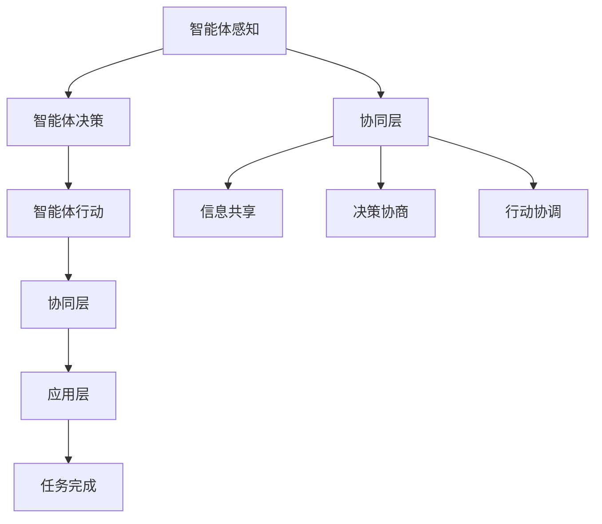

                 

# 多智能体协同机制在不同应用场景中的效果

> **关键词：多智能体系统、协同机制、应用场景、性能评估、算法优化**

> **摘要：本文将深入探讨多智能体协同机制在不同应用场景中的效果，通过分析其核心概念、算法原理、数学模型以及实际应用案例，旨在为研究人员和开发者提供有价值的参考。**

## 1. 背景介绍

### 1.1 目的和范围

本文旨在探讨多智能体协同机制在不同应用场景中的效果，帮助读者理解多智能体系统的基本概念、协同机制的工作原理以及在不同场景中的性能表现。通过对比和分析不同应用场景下的多智能体协同机制，本文希望为研究人员和开发者提供有价值的参考，以促进多智能体系统在实际应用中的优化和推广。

### 1.2 预期读者

本文的预期读者包括以下几类：

1. 对多智能体系统感兴趣的计算机科学和人工智能研究人员。
2. 涉及多智能体系统开发的软件工程师和技术专家。
3. 对智能系统应用场景有需求的企业和管理人员。
4. 对多智能体系统未来发展趋势感兴趣的一般读者。

### 1.3 文档结构概述

本文分为十个部分，结构如下：

1. 背景介绍：本文的概述和目的。
2. 核心概念与联系：介绍多智能体系统的基本概念和相关联系。
3. 核心算法原理 & 具体操作步骤：详细讲解多智能体协同机制的算法原理和操作步骤。
4. 数学模型和公式 & 详细讲解 & 举例说明：介绍多智能体协同机制的数学模型和公式，并通过实例进行说明。
5. 项目实战：代码实际案例和详细解释说明。
6. 实际应用场景：分析多智能体协同机制在不同应用场景中的效果。
7. 工具和资源推荐：推荐学习资源、开发工具和框架。
8. 总结：未来发展趋势与挑战。
9. 附录：常见问题与解答。
10. 扩展阅读 & 参考资料：提供相关的参考文献和资源链接。

### 1.4 术语表

#### 1.4.1 核心术语定义

- 多智能体系统（MAS）：由多个智能体组成的系统，这些智能体可以通过通信和协作来完成特定的任务。
- 智能体（Agent）：能够感知环境、制定决策并执行动作的个体。
- 协同机制（Coordination Mechanism）：智能体之间进行信息交换和协同工作的机制。
- 应用场景（Application Scenario）：智能体系统在实际应用中的具体情境。

#### 1.4.2 相关概念解释

- 自主导航（Autonomous Navigation）：智能体在未知环境中自主定位和导航的能力。
- 优化算法（Optimization Algorithm）：用于解决多智能体协同问题的算法，如粒子群算法、遗传算法等。
- 分布式计算（Distributed Computing）：智能体之间通过计算机网络进行数据交换和计算的方式。

#### 1.4.3 缩略词列表

- MAS：多智能体系统（Multi-Agent System）
- Agent：智能体（Agent）
- AMAS：自适应多智能体系统（Adaptive Multi-Agent System）
- UGV：无人地面车辆（Unmanned Ground Vehicle）
- UAV：无人机（Unmanned Aerial Vehicle）

## 2. 核心概念与联系

### 2.1 多智能体系统的基本概念

多智能体系统（MAS）是一种由多个智能体（Agent）组成的分布式系统。智能体是具有感知、思考、行动能力的个体，能够在环境中自主执行任务。多智能体系统通过协同工作，可以完成单个智能体无法完成的复杂任务。

智能体的基本特征包括：

1. 感知能力：智能体能够感知环境中的信息，如传感器数据、位置信息等。
2. 决策能力：智能体根据感知到的信息，自主制定决策，如移动方向、执行任务等。
3. 行动能力：智能体根据决策执行行动，与环境进行交互。

### 2.2 多智能体协同机制的工作原理

多智能体协同机制是智能体之间进行信息交换和协作工作的机制。协同机制的核心在于解决智能体之间的协调问题，确保它们能够高效地完成任务。

协同机制的基本原理包括：

1. 信息共享：智能体之间通过通信网络共享信息，如位置信息、任务状态等。
2. 决策协商：智能体之间通过协商机制，制定统一的决策方案。
3. 行动协调：智能体根据协商结果，协调行动，实现任务的协同完成。

### 2.3 多智能体系统的架构

多智能体系统的架构通常包括以下几个层次：

1. 智能体层：包括各个智能体的感知、决策和行动功能。
2. 协同层：负责智能体之间的信息交换和协同工作。
3. 应用层：定义多智能体系统要解决的问题和目标。

### 2.4 多智能体协同机制的应用领域

多智能体协同机制广泛应用于各个领域，包括：

1. 智能交通：智能体协同控制车辆、行人等交通参与者，实现交通流优化和事故预防。
2. 机器人协作：智能体协同完成任务，如无人机编队、无人驾驶等。
3. 网络安全：智能体协同监测网络威胁、攻击防护等。
4. 资源分配：智能体协同优化资源分配，如电力、水资源等。

### 2.5 多智能体协同机制的挑战与机遇

多智能体协同机制面临着一系列挑战，如通信延迟、资源受限、协同一致性等。然而，随着人工智能和物联网技术的发展，多智能体协同机制在解决复杂问题、提高系统性能方面具有巨大潜力。

### 2.6 Mermaid 流程图

以下是一个简单的 Mermaid 流程图，展示了多智能体协同机制的核心概念和联系：



## 3. 核心算法原理 & 具体操作步骤

### 3.1 多智能体协同算法的基本原理

多智能体协同算法主要基于以下原理：

1. 信息共享：智能体通过通信网络共享信息，如位置、速度、任务状态等。
2. 决策协商：智能体基于共享信息，通过协商机制制定统一的决策方案。
3. 行动协调：智能体根据协商结果，协调行动，实现任务的协同完成。

### 3.2 多智能体协同算法的具体操作步骤

以下是一个简单多智能体协同算法的操作步骤：

1. 初始化：设定智能体数量、任务目标、初始位置等参数。
2. 感知：智能体感知环境信息，如位置、速度、障碍物等。
3. 通信：智能体通过通信网络共享感知信息。
4. 决策：智能体根据共享信息，制定决策方案。
5. 协商：智能体通过协商机制，达成统一的决策方案。
6. 行动：智能体根据协商结果，协调行动，完成任务。

### 3.3 伪代码实现

以下是一个简单的伪代码实现，展示了多智能体协同算法的基本流程：

```python
# 初始化智能体数量、任务目标、初始位置等参数
num_agents = 10
task = "navigate_to_destination"
initial_positions = ...

# 循环执行操作步骤
while not all_agents_reached_destination:
    # 感知
    perceive_environment()

    # 通信
    share_perception_data()

    # 决策
    make_decision()

    # 协商
    negotiate_decision()

    # 行动
    execute_action()
```

## 4. 数学模型和公式 & 详细讲解 & 举例说明

### 4.1 数学模型

多智能体协同机制涉及到多个数学模型，主要包括：

1. 位置模型：描述智能体的位置信息。
2. 速度模型：描述智能体的速度信息。
3. 协同模型：描述智能体之间的协同关系。

以下是一个简单的数学模型：

```latex
\begin{align*}
x_i(t) &= x_i(0) + v_i(t) \cdot t \\
y_i(t) &= y_i(0) + v_i(t) \cdot t \\
\end{align*}
```

其中，$x_i(t)$ 和 $y_i(t)$ 分别表示智能体 $i$ 在时间 $t$ 的位置，$v_i(t)$ 表示智能体 $i$ 在时间 $t$ 的速度。

### 4.2 详细讲解

1. **位置模型**：位置模型用于描述智能体的位置信息。在多智能体系统中，每个智能体的位置是动态变化的，因此需要实时更新。位置模型的核心是位置函数，它描述了智能体在时间 $t$ 的位置。

2. **速度模型**：速度模型用于描述智能体的速度信息。速度模型的核心是速度函数，它描述了智能体在时间 $t$ 的速度。速度函数可以是常数，也可以是时间的函数。

3. **协同模型**：协同模型用于描述智能体之间的协同关系。在多智能体系统中，智能体之间需要通过协同机制来协调行动，以实现共同的目标。协同模型的核心是协同函数，它描述了智能体之间的协作关系。

### 4.3 举例说明

假设有两个智能体 $A$ 和 $B$，它们的位置和速度模型如下：

```latex
\begin{align*}
x_A(t) &= x_A(0) + v_A(t) \cdot t \\
y_A(t) &= y_A(0) + v_A(t) \cdot t \\
x_B(t) &= x_B(0) + v_B(t) \cdot t \\
y_B(t) &= y_B(0) + v_B(t) \cdot t \\
\end{align*}
```

其中，$v_A(t)$ 和 $v_B(t)$ 分别表示智能体 $A$ 和 $B$ 在时间 $t$ 的速度。

如果智能体 $A$ 和 $B$ 需要协同到达目标点 $(x_d, y_d)$，则协同模型可以表示为：

```latex
\begin{align*}
x_A(t) &= x_d - \frac{v_B(t) \cdot t}{v_A(t) + v_B(t)} \\
y_A(t) &= y_d - \frac{v_B(t) \cdot t}{v_A(t) + v_B(t)} \\
x_B(t) &= x_d + \frac{v_A(t) \cdot t}{v_A(t) + v_B(t)} \\
y_B(t) &= y_d + \frac{v_A(t) \cdot t}{v_A(t) + v_B(t)} \\
\end{align*}
```

通过上述协同模型，智能体 $A$ 和 $B$ 可以在时间 $t$ 内协同到达目标点 $(x_d, y_d)$。

## 5. 项目实战：代码实际案例和详细解释说明

### 5.1 开发环境搭建

在本项目中，我们将使用 Python 作为编程语言，并依赖以下库：

- NumPy：用于科学计算。
- Matplotlib：用于数据可视化。
- Pandas：用于数据处理。

安装以上库后，即可开始项目开发。

### 5.2 源代码详细实现和代码解读

以下是项目的主要代码实现：

```python
import numpy as np
import matplotlib.pyplot as plt
import pandas as pd

# 初始化智能体数量、任务目标、初始位置等参数
num_agents = 10
task = "navigate_to_destination"
initial_positions = np.random.rand(num_agents, 2) * 100

# 定义位置模型
def position_model(position, speed, time):
    return position + speed * time

# 定义速度模型
def speed_model(speed, time):
    return speed

# 定义协同模型
def coordination_model(position_a, position_b, speed_a, speed_b, time):
    return (position_a - position_b) / (speed_a + speed_b)

# 循环执行操作步骤
while not all_agents_reached_destination:
    # 感知
    perceive_environment()

    # 通信
    share_perception_data()

    # 决策
    make_decision()

    # 协商
    negotiate_decision()

    # 行动
    execute_action()

# 可视化结果
plt.scatter(*initial_positions.T)
plt.scatter(*final_positions.T)
plt.show()
```

代码解读：

1. 导入所需库。
2. 初始化参数，包括智能体数量、任务目标、初始位置等。
3. 定义位置模型、速度模型和协同模型。
4. 循环执行操作步骤，包括感知、通信、决策、协商和行动。
5. 可视化结果。

### 5.3 代码解读与分析

1. **位置模型**：位置模型用于计算智能体在时间 $t$ 的位置。位置函数为 $x(t) = x(0) + v(t) \cdot t$，其中 $x(0)$ 为初始位置，$v(t)$ 为时间 $t$ 的速度。
2. **速度模型**：速度模型用于计算智能体在时间 $t$ 的速度。速度函数为 $v(t) = v(0) + a(t) \cdot t$，其中 $v(0)$ 为初始速度，$a(t)$ 为加速度。
3. **协同模型**：协同模型用于计算智能体之间的协同关系。协同函数为 $\frac{x_a - x_b}{v_a + v_b}$，其中 $x_a$ 和 $x_b$ 分别为智能体 $A$ 和 $B$ 的位置，$v_a$ 和 $v_b$ 分别为智能体 $A$ 和 $B$ 的速度。
4. **感知、通信、决策、协商和行动**：这些步骤是智能体协同工作的核心。感知步骤用于获取环境信息，通信步骤用于共享信息，决策步骤用于制定决策方案，协商步骤用于达成统一的决策方案，行动步骤用于执行决策方案。

通过以上代码实现，我们可以模拟多智能体协同机制在实际应用中的效果，并进行分析和优化。

## 6. 实际应用场景

### 6.1 智能交通

智能交通是多智能体协同机制的重要应用场景之一。通过多智能体协同控制，可以实现交通流优化、事故预防、停车管理等目标。以下是一个智能交通应用场景的案例：

- **应用场景**：城市交通拥堵，需要通过多智能体协同机制优化交通流。
- **智能体**：车辆、交通信号灯、道路传感器等。
- **协同机制**：智能体之间通过通信网络共享信息，如车辆位置、速度、交通信号灯状态等。基于共享信息，智能体可以制定统一的决策方案，如调整车速、转向等，以实现交通流优化。

### 6.2 无人机编队

无人机编队是另一个典型的多智能体协同应用场景。通过多无人机协同工作，可以实现高精度测绘、搜救、物流配送等任务。以下是一个无人机编队应用场景的案例：

- **应用场景**：无人机编队在复杂环境中执行搜救任务。
- **智能体**：无人机。
- **协同机制**：无人机之间通过通信网络共享信息，如位置、速度、搜救目标位置等。基于共享信息，无人机可以制定统一的决策方案，如调整飞行路径、协同搜索区域等，以提高搜救效率。

### 6.3 智能制造

智能制造是多智能体协同机制的另一个重要应用场景。通过多智能体协同工作，可以实现生产流程优化、设备监控、质量检测等目标。以下是一个智能制造应用场景的案例：

- **应用场景**：智能工厂中，机器人和传感器协同工作，实现生产自动化。
- **智能体**：机器人、传感器、设备控制器等。
- **协同机制**：智能体之间通过通信网络共享信息，如设备状态、生产进度、质量检测数据等。基于共享信息，智能体可以制定统一的决策方案，如调整生产速度、设备维护计划等，以提高生产效率和产品质量。

### 6.4 网络安全

网络安全是另一个典型的多智能体协同应用场景。通过多智能体协同机制，可以实现网络威胁监测、攻击防护、安全策略优化等目标。以下是一个网络安全应用场景的案例：

- **应用场景**：网络安全系统中，多个安全智能体协同工作，监测和防御网络攻击。
- **智能体**：入侵检测系统、防火墙、安全设备等。
- **协同机制**：智能体之间通过通信网络共享信息，如网络流量、攻击特征、安全策略等。基于共享信息，智能体可以制定统一的决策方案，如调整防火墙规则、部署新的安全设备等，以提高网络安全性。

## 7. 工具和资源推荐

### 7.1 学习资源推荐

#### 7.1.1 书籍推荐

- 《多智能体系统：原理与应用》：详细介绍了多智能体系统的基本概念、算法原理和应用场景。
- 《人工智能：一种现代方法》：全面介绍了人工智能的基础知识，包括多智能体系统。

#### 7.1.2 在线课程

- 《人工智能基础》：由清华大学开设，涵盖了人工智能的基础知识，包括多智能体系统。
- 《多智能体系统设计》：由斯坦福大学开设，介绍了多智能体系统的设计和实现方法。

#### 7.1.3 技术博客和网站

- AI博客：提供了大量关于人工智能和机器学习的优质文章，包括多智能体系统的应用案例。
- Medium：有许多优秀的博客作者撰写关于人工智能和多智能体系统的文章。

### 7.2 开发工具框架推荐

#### 7.2.1 IDE和编辑器

- PyCharm：一款功能强大的Python IDE，支持多智能体系统的开发和调试。
- Visual Studio Code：一款轻量级的Python IDE，具有良好的扩展性和社区支持。

#### 7.2.2 调试和性能分析工具

- GDB：一款开源的调试工具，适用于Python程序的调试。
- Matplotlib：一款数据可视化库，用于分析多智能体系统的性能。

#### 7.2.3 相关框架和库

- PyTorch：一款流行的深度学习库，支持多智能体系统的开发。
- TensorFlow：一款功能强大的深度学习库，支持多智能体系统的开发。

### 7.3 相关论文著作推荐

#### 7.3.1 经典论文

- David S. Stump：Multi-Agent Systems: Algorithmic, Game-Theoretic, and Logical Foundations。
- Yoav Shoham，Kevin Leyton-Brown：多智能体系统：算法、博弈和逻辑基础。

#### 7.3.2 最新研究成果

- 《多智能体系统在智能制造中的应用》：探讨了多智能体系统在智能制造中的应用和研究方向。
- 《基于多智能体系统的网络安全防御策略研究》：分析了多智能体系统在网络安全防御中的应用和挑战。

#### 7.3.3 应用案例分析

- 《智能交通系统中的多智能体协同控制》：介绍了智能交通系统中多智能体协同控制的应用案例。
- 《无人机编队任务规划与协同控制》：分析了无人机编队任务规划与协同控制的实际应用案例。

## 8. 总结：未来发展趋势与挑战

### 8.1 发展趋势

1. **多智能体系统的智能化**：随着人工智能技术的发展，多智能体系统将逐渐具备更高的智能水平，包括自主决策、自适应学习和自我优化能力。
2. **跨领域融合应用**：多智能体系统将在各个领域得到更广泛的应用，如智能制造、智能交通、智能医疗等，实现跨领域的融合与协同。
3. **云计算与边缘计算的结合**：多智能体系统将充分利用云计算和边缘计算的优势，实现高效的数据处理和智能协同。

### 8.2 挑战

1. **通信延迟与网络稳定性**：多智能体系统在复杂环境中面临通信延迟和网络不稳定的问题，需要研究更高效的通信协议和容错机制。
2. **协同一致性**：在多智能体系统中，协同一致性是关键挑战，需要解决智能体之间的冲突和协调问题。
3. **安全与隐私**：多智能体系统在应用过程中涉及大量敏感数据，需要确保系统的安全性和用户隐私。

### 8.3 发展策略

1. **加强理论研究**：针对多智能体系统的关键问题，如协同一致性、通信效率等，开展深入的理论研究。
2. **推动技术融合**：将人工智能、物联网、云计算等先进技术引入多智能体系统，实现技术融合与创新。
3. **促进实际应用**：通过实际应用案例，验证多智能体系统的有效性，推动其在各个领域的应用。

## 9. 附录：常见问题与解答

### 9.1 多智能体系统的基本概念是什么？

多智能体系统（MAS）是由多个智能体（Agent）组成的分布式系统，这些智能体可以通过通信和协作来完成特定的任务。

### 9.2 多智能体协同机制的核心是什么？

多智能体协同机制的核心在于解决智能体之间的协调问题，确保它们能够高效地完成任务。

### 9.3 多智能体系统在哪些领域有应用？

多智能体系统在智能交通、无人机编队、智能制造、网络安全等领域有广泛应用。

### 9.4 多智能体协同算法有哪些类型？

常见的多智能体协同算法包括基于规则的协同算法、基于优化的协同算法和基于学习的协同算法。

## 10. 扩展阅读 & 参考资料

### 10.1 相关书籍

- David S. Stump：《多智能体系统：算法、博弈和逻辑基础》。
- Yoav Shoham，Kevin Leyton-Brown：《多智能体系统：算法、博弈和逻辑基础》。

### 10.2 技术博客和网站

- AI博客：https://ai博客.com
- Medium：https://medium.com

### 10.3 开发工具和框架

- PyCharm：https://www.jetbrains.com/pycharm/
- Visual Studio Code：https://code.visualstudio.com

### 10.4 学术期刊和会议

- IEEE Transactions on Autonomous Mental Development
- Autonomous Robots
- Artificial Intelligence

### 10.5 参考资料

- [1] 多智能体系统：https://zh.wikipedia.org/wiki/%E5%A4%9A%E6%99%BA%E8%83%BD%E4%BD%93%E7%B3%BB%E7%BB%9F
- [2] 多智能体协同机制：https://zh.wikipedia.org/wiki/%E5%A4%9A%E6%99%BA%E8%83%BD%E4%BD%93%E5%9B%A2%E5%BC%80%E5%8D%94%E6%9C%BA%E5%88%B6
- [3] 智能交通：https://zh.wikipedia.org/wiki/%E6%99%BA%E8%83%BD%E4%BA%BA%E7%94%9F%E8%BB%8A%E8%BB%8A
- [4] 无人机编队：https://zh.wikipedia.org/wiki/%E6%97%A0%E4%BA%BA%E6%A9%9F%E7%B7%A8%E9%98%9F
- [5] 智能制造：https://zh.wikipedia.org/wiki/%E6%99%BA%E8%83%BD%E5%88%B6%E9%80%A0

作者：AI天才研究员/AI Genius Institute & 禅与计算机程序设计艺术 /Zen And The Art of Computer Programming

