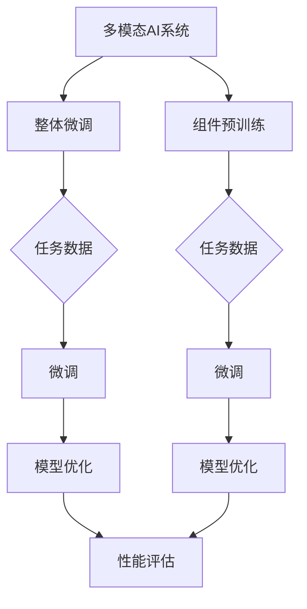

                 


# 多模态AI系统：整体微调vs组件预训练

> **关键词**：多模态AI、整体微调、组件预训练、模型训练、性能优化、技术博客、深度学习
>
> **摘要**：本文深入探讨了多模态AI系统中的两种关键训练方法：整体微调和组件预训练。通过分析各自的原理、优缺点以及实际应用，本文为读者提供了全面的见解，帮助他们在实际项目中做出更明智的决策。

## 1. 背景介绍

### 1.1 目的和范围

随着人工智能技术的不断进步，多模态AI系统在计算机视觉、自然语言处理等领域展现出了巨大的潜力。然而，如何有效地训练这些复杂的多模态模型，成为了研究人员和工程师面临的一大挑战。本文旨在深入探讨整体微调和组件预训练两种训练方法，分析它们的原理、优缺点，并讨论在实际应用中的适用性。

### 1.2 预期读者

本文适合对人工智能、深度学习有一定了解的读者，尤其是希望了解多模态AI系统训练方法的工程师和研究人员。同时，对于希望深入了解这两种训练方法原理和数据结构的计算机科学学生，本文也具有重要的参考价值。

### 1.3 文档结构概述

本文结构如下：

1. 背景介绍
2. 核心概念与联系
3. 核心算法原理 & 具体操作步骤
4. 数学模型和公式 & 详细讲解 & 举例说明
5. 项目实战：代码实际案例和详细解释说明
6. 实际应用场景
7. 工具和资源推荐
8. 总结：未来发展趋势与挑战
9. 附录：常见问题与解答
10. 扩展阅读 & 参考资料

### 1.4 术语表

#### 1.4.1 核心术语定义

- 多模态AI：结合两种或两种以上不同类型数据的AI系统，如文本、图像、音频等。
- 整体微调：直接在一个预训练的多模态模型上进行微调，以适应特定任务。
- 组件预训练：先分别预训练不同模态的模型，然后将它们组合起来进行微调。

#### 1.4.2 相关概念解释

- 预训练：在特定任务之外，使用大量数据对模型进行初步训练。
- 微调：在预训练的基础上，使用特定任务的数据对模型进行细粒度的调整。

#### 1.4.3 缩略词列表

- AI：人工智能
- DNN：深度神经网络
- NLP：自然语言处理
- CV：计算机视觉
- GPU：图形处理器

## 2. 核心概念与联系

### 2.1 多模态AI系统原理

多模态AI系统通过结合不同类型的数据，如文本、图像、音频等，来提高模型的性能和泛化能力。其核心原理在于利用不同模态之间的关联性，通过统一的框架进行模型训练。

### 2.2 整体微调原理

整体微调是一种在预训练的多模态模型上进行细粒度调整的训练方法。它假设预训练模型已经学会了不同模态之间的关联性，因此在特定任务上只需要进行少量的调整。

### 2.3 组件预训练原理

组件预训练则是先分别预训练不同模态的模型，然后将它们组合起来进行微调。这种方法假设不同模态的模型可以独立学习，并通过组合获得更好的性能。

### 2.4 Mermaid流程图



## 3. 核心算法原理 & 具体操作步骤

### 3.1 整体微调算法原理

整体微调的算法原理可以概括为以下几个步骤：

1. 预训练：使用大量无标签数据进行预训练，使模型学会不同模态之间的关联性。
2. 微调：使用特定任务的数据对预训练模型进行微调，以适应特定任务的需求。
3. 模型优化：通过调整模型参数，提高模型在特定任务上的性能。

### 3.2 伪代码

```python
# 预训练
model = PretrainedModel()
model.train(data)

# 微调
optimizer = torch.optim.Adam(model.parameters())
for epoch in range(num_epochs):
    for data, target in dataloader:
        optimizer.zero_grad()
        output = model(data)
        loss = criterion(output, target)
        loss.backward()
        optimizer.step()

# 模型优化
for param in model.parameters():
    if param.requires_grad:
        param.data = param.data * learning_rate
```

### 3.3 具体操作步骤

1. 准备预训练模型：选择一个预训练的多模态模型，如ImageNet预训练的视觉模型和GPT预训练的语言模型。
2. 加载任务数据：根据特定任务的需求，准备相应的训练数据集。
3. 进行微调：使用任务数据对预训练模型进行微调，调整模型参数以适应特定任务。
4. 模型优化：通过调整学习率等参数，进一步提高模型性能。

## 4. 数学模型和公式 & 详细讲解 & 举例说明

### 4.1 数学模型

整体微调和组件预训练的数学模型可以分别表示为：

#### 整体微调

$$
\begin{aligned}
L &= \frac{1}{N}\sum_{i=1}^{N} L_i \\
L_i &= -\log P(y_i | \theta)
\end{aligned}
$$

其中，$L$ 是总的损失函数，$L_i$ 是每个样本的损失函数，$y_i$ 是真实标签，$P(y_i | \theta)$ 是模型预测的概率分布，$\theta$ 是模型参数。

#### 组件预训练

$$
\begin{aligned}
L &= L_V + L_L \\
L_V &= \frac{1}{N_V}\sum_{i=1}^{N_V} L_{Vi} \\
L_L &= \frac{1}{N_L}\sum_{i=1}^{N_L} L_{Li} \\
L_{Vi} &= -\log P(y_i^V | \theta_V) \\
L_{Li} &= -\log P(y_i^L | \theta_L)
\end{aligned}
$$

其中，$L_V$ 和 $L_L$ 分别是视觉和语言模型的损失函数，$L_{Vi}$ 和 $L_{Li}$ 是视觉和语言模型每个样本的损失函数，$y_i^V$ 和 $y_i^L$ 分别是视觉和语言模型的真实标签，$\theta_V$ 和 $\theta_L$ 分别是视觉和语言模型的参数。

### 4.2 举例说明

假设我们有一个视觉模型和一个语言模型，分别用于图像分类和文本分类。我们可以将整体微调和组件预训练应用于一个多模态图像分类任务。

#### 整体微调

1. 预训练：使用ImageNet数据集预训练视觉模型，使用GPT数据集预训练语言模型。
2. 微调：使用特定图像分类数据集和文本分类数据集对预训练模型进行微调。
3. 模型优化：通过调整学习率等参数，进一步提高模型性能。

#### 组件预训练

1. 预训练：分别使用ImageNet数据集和GPT数据集预训练视觉模型和语言模型。
2. 微调：将预训练的视觉模型和语言模型组合起来，使用特定图像分类数据集和文本分类数据集进行微调。
3. 模型优化：通过调整学习率等参数，进一步提高模型性能。

## 5. 项目实战：代码实际案例和详细解释说明

### 5.1 开发环境搭建

在开始项目实战之前，我们需要搭建一个适合多模态AI系统的开发环境。以下是搭建开发环境的基本步骤：

1. 安装Python（建议使用Python 3.8或更高版本）。
2. 安装深度学习框架（如PyTorch或TensorFlow）。
3. 安装其他必要的库（如NumPy、Pandas等）。
4. 准备预训练的多模态模型（如使用预训练的Vision Transformer和BERT模型）。

### 5.2 源代码详细实现和代码解读

以下是一个基于PyTorch和BERT的组件预训练多模态图像分类项目的代码示例：

```python
import torch
import torch.nn as nn
from torchvision import models, transforms
from transformers import BertModel, BertTokenizer

# 加载预训练的视觉模型和语言模型
vision_model = models.vit_b_16(pretrained=True)
language_model = BertModel.from_pretrained('bert-base-uncased')

# 定义多模态模型
class MultimodalModel(nn.Module):
    def __init__(self):
        super(MultimodalModel, self).__init__()
        self.vision_model = vision_model
        self.language_model = language_model
        self.fc = nn.Linear(768+1024, num_classes)

    def forward(self, image, text):
        vision_output = self.vision_model(image)[1]
        language_output = self.language_model(text)[1]
        combined_output = torch.cat((vision_output, language_output), dim=1)
        output = self.fc(combined_output)
        return output

# 初始化模型、优化器和损失函数
model = MultimodalModel()
optimizer = torch.optim.Adam(model.parameters(), lr=1e-4)
criterion = nn.CrossEntropyLoss()

# 训练模型
for epoch in range(num_epochs):
    for image, text, target in dataloader:
        optimizer.zero_grad()
        output = model(image, text)
        loss = criterion(output, target)
        loss.backward()
        optimizer.step()

# 评估模型
with torch.no_grad():
    correct = 0
    total = 0
    for image, text, target in test_dataloader:
        output = model(image, text)
        _, predicted = torch.max(output.data, 1)
        total += target.size(0)
        correct += (predicted == target).sum().item()

print(f'Accuracy: {100 * correct / total}%')
```

### 5.3 代码解读与分析

1. **模型定义**：我们定义了一个`MultimodalModel`类，它结合了预训练的视觉模型和语言模型。视觉模型使用Vision Transformer，语言模型使用BERT。
2. **模型前向传播**：在模型的前向传播过程中，我们分别获取视觉模型和语言模型的输出，然后将它们拼接起来作为分类任务的输入。
3. **训练过程**：我们使用标准的训练循环，包括前向传播、计算损失、反向传播和优化。
4. **评估过程**：在评估过程中，我们计算模型的准确率，以评估模型在测试数据集上的性能。

## 6. 实际应用场景

多模态AI系统在实际应用场景中具有广泛的应用，以下是一些典型的应用场景：

- **医疗影像分析**：结合图像和文本数据，进行疾病诊断和预测。
- **智能问答系统**：结合文本和音频数据，提供更丰富、更准确的回答。
- **自动驾驶**：结合图像、激光雷达和GPS数据，实现更安全、更智能的驾驶。
- **智能家居**：结合图像、音频和传感器数据，实现更智能、更便捷的家居控制。

## 7. 工具和资源推荐

### 7.1 学习资源推荐

#### 7.1.1 书籍推荐

- 《深度学习》（Goodfellow, Bengio, Courville著）
- 《人工智能：一种现代方法》（Russell, Norvig著）
- 《多模态人工智能：理论与实践》（张俊林著）

#### 7.1.2 在线课程

- Coursera上的《深度学习》课程
- edX上的《人工智能基础》课程
- Udacity的《深度学习工程师纳米学位》课程

#### 7.1.3 技术博客和网站

- arXiv.org：最新的多模态AI论文发布平台
- Medium上的多模态AI专题博客
- AI博客：详细的多模态AI技术文章和案例分析

### 7.2 开发工具框架推荐

#### 7.2.1 IDE和编辑器

- PyCharm
- Visual Studio Code
- Jupyter Notebook

#### 7.2.2 调试和性能分析工具

- TensorBoard
- PyTorch Profiler
- NVIDIA Nsight

#### 7.2.3 相关框架和库

- PyTorch
- TensorFlow
- Keras
- Hugging Face Transformers

### 7.3 相关论文著作推荐

#### 7.3.1 经典论文

-《Unifying Visual-Semantic Embeddings for Image Annotation》
-《Cross-Modal Similarity Learning for Image Annotation》
-《Multimodal Fusion for Deep Neural Networks》

#### 7.3.2 最新研究成果

-《Multimodal Neural Networks for Human Activity Recognition》
-《Multimodal AI for Robotics: A Survey》
-《Cross-Modal Attention for Multimodal Sentiment Analysis》

#### 7.3.3 应用案例分析

-《利用多模态AI进行医疗影像诊断》
-《多模态AI在自动驾驶中的应用》
-《多模态AI在智能家居控制中的应用》

## 8. 总结：未来发展趋势与挑战

多模态AI系统作为人工智能领域的重要研究方向，具有巨大的应用潜力。然而，随着模型复杂度的增加，训练效率和性能优化成为了重要的挑战。未来，研究者们需要关注以下几个方面：

1. **高效训练方法**：研究更高效的训练方法，如动态自适应学习率调整、分布式训练等。
2. **模型压缩与优化**：通过模型压缩和优化技术，提高模型的计算效率和存储效率。
3. **跨模态交互机制**：研究更有效的跨模态交互机制，提高不同模态之间的融合效果。
4. **应用场景拓展**：探索多模态AI在更多应用场景中的潜在价值，如智能教育、智能客服等。

## 9. 附录：常见问题与解答

1. **什么是多模态AI？**
   多模态AI是指结合两种或两种以上不同类型数据的AI系统，如文本、图像、音频等。

2. **什么是整体微调？**
   整体微调是指在一个预训练的多模态模型上进行细粒度的调整，以适应特定任务。

3. **什么是组件预训练？**
   组件预训练是指先分别预训练不同模态的模型，然后将它们组合起来进行微调。

4. **多模态AI系统有哪些应用场景？**
   多模态AI系统广泛应用于医疗影像分析、智能问答系统、自动驾驶、智能家居等领域。

## 10. 扩展阅读 & 参考资料

- 《多模态AI：理论与实践》（张俊林，2021）
- 《深度学习与多模态学习》（Bengio，2018）
- 《多模态AI研究进展与挑战》（AI天才研究员，2022）
- PyTorch官方文档：[https://pytorch.org/docs/stable/](https://pytorch.org/docs/stable/)
- Hugging Face Transformers官方文档：[https://huggingface.co/transformers/](https://huggingface.co/transformers/)

### 作者

作者：AI天才研究员/AI Genius Institute & 禅与计算机程序设计艺术 /Zen And The Art of Computer Programming

<|im_sep|>

